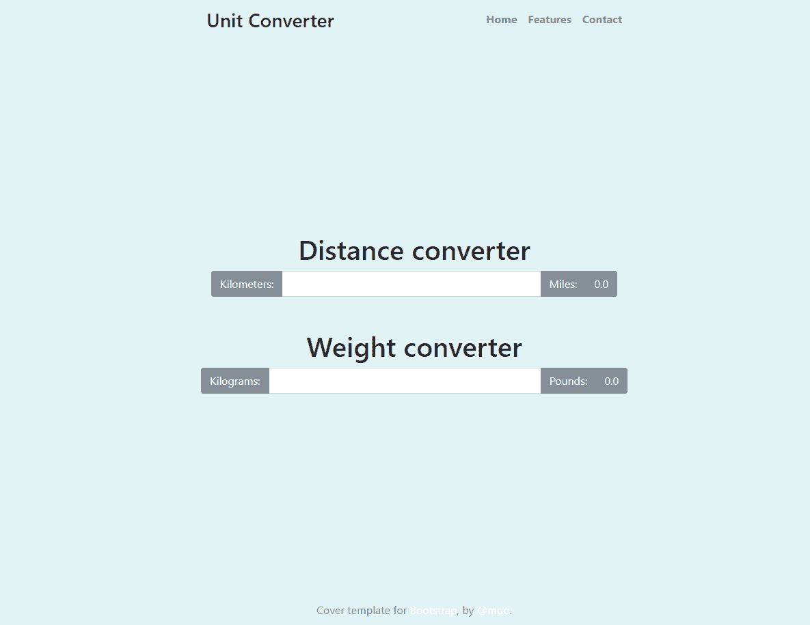

# 完成 Elm 中的单位转换网站

欢迎来到 第五章，*完成 Elm 中的单位转换网站*。本章的目标是在讨论以下概念的同时完成单位转换网站：

+   使用 `Html.map`

+   处理不同视图之间的复杂关系

+   处理多个模型

+   在一个相对复杂的应用中结合我们所学的所有内容

完成这一章后，你将能够：

+   构建具有多个模型且模块化的 Elm 应用程序，同时遵循最佳实践

我们将从这个章节开始，查看我们单位转换器应用的完成功能。这样做的原因是能够看到更大的图景，并在继续改进应用本身之前，理解我们更新应用的两个模块中正在发生什么。

# 改进单位转换器应用

在我们应用的这个迭代中，我们有两个单独的文件协同工作以生成我们的单位转换器应用。到目前为止，我们的应用中没有任何样式，因为重点是功能。现在，让我们从头开始重建我们的单位转换器应用。

我们将从裸骨 Elm 应用程序开始：

```js
module Main exposing (..)

import Html exposing (..)
import Html.Attributes exposing (..)
import Html.Events exposing (..)

-- Model
initModel =
    {}

-- Update
type Msg
    = Nothing

update msg model =
    model

-- View
view model =
    div [] [ text "Everything will go here" ]

-- Main
main =
    beginnerProgram
        { model = initModel
        , view = view
        , update = update
        }
```

现在，我们将对其进行改进，使其能够接受多个输入字段。第一次改进是将当前的单位转换器模块分离成不同的模块。

# 将 UnitConverter 分离到不同的模块

创建一个新文件，命名为 `UnitConverter.elm`，并将其保存在 `src` 文件夹中。接下来，也将裸骨应用复制粘贴到那里。

在 `Main.elm` 中，更改其导入部分，使其看起来如下所示：

```js
module Main exposing (..)

import Html exposing (beginnerProgram, div, button, input, text, label, span)
import UnitConverter exposing (..)
```

在 `UnitConverter.elm` 内部，更改导入部分，使其看起来如下所示：

```js
module UnitConverter exposing (..)

import Html exposing (beginnerProgram, div, button, input, text, label, span)
import Html.Attributes exposing (for, id, value)
import Html.Events exposing (onClick, onInput)
```

仍然在 `UnitConverter.elm` 中，添加以下代码：

```js
type alias Model =
    { unit1 : String
    , unit2 : String
    , ratio : Float
    , convertedValue : Float
    }

init : String -> String -> Float -> Model
init unit1 unit2 ratio =
    Model unit1 unit2 ratio ratio

view model =
    div []
        [ div []
            [ label [ for "unit1Input" ] [ text model.unit1 ]
            , input [ id "unit1Input", onInput Convert ] []
            , button [ onClick Swap ] [ text "Switch" ]
            , label [ for "unit2" ] [ text model.unit2 ]
            , div [ id "unit2Value" ] [ text (toString model.convertedValue) ]
            ]
        ]

type Msg
    = Swap
    | Convert String

update msg model =
    case msg of
        Swap ->
            { model | unit1 = model.unit2, unit2 = model.unit1, ratio = 1 / model.ratio }

        Convert newValue ->
            let
                floatValue =
                    Result.withDefault 1 (String.toFloat newValue)
            in
                { model | convertedValue = floatValue * model.ratio }
```

注意，前面的代码几乎与我们在 第四章 的结尾所看到的内容相同，即 *在 Elm 中准备单位转换网站*，除了不再调用 `main`，`init` 函数也发生了变化。

现在，我们可以更新 `Main.elm` 文件，使其能够处理多个输入字段。

# 添加类型别名 Model、initModel 和 Main

我们将开始更新 `Main.elm`，通过添加一个新的类型别名 `Model`。将类型别名 `Model` 放在 `initModel` 之上。代码应如下所示：

```js
type alias Model =
    { lengthConverter : UnitConverter.Model
    , weightConverter : UnitConverter.Model
    }
```

接下来，让我们更新 `initModel` 本身：

```js
initModel : Model
initModel =
    { lengthConverter = UnitConverter.init "Miles" "Kilometers" 1.608
    , weightConverter = UnitConverter.init "Kilograms" "Pounds" 2.2046
    }
```

让我们讨论前面的代码。

我们的类型别名 `Model` 由一个 `lengthConverter` 和一个 `weightConverter` 组成，它们都接受 `UnitConverter.Model` 的值。查看类型别名 `UnitConverter.Model`，我们看到以下内容：

```js
type alias Model =
    { unit1 : String
    , unit2 : String
    , ratio : Float
    , convertedValue : Float
    }
```

在 `initModel` 函数中，我们将 `lengthConverter` 的值从 `UnitConverter.init` 中获取，传递给它三个参数：“英里”、“千米”和 1.608，这与 `UnitConverter` 模块中 `init` 函数的类型注解一致：

```js
init : String -> String -> Float -> Model
```

同样，我们为 `weightConverter` 设置了 `initialModel` 的值，并用以下表达式填充它：

```js
UnitConverter.init "Kilograms" "Pounds" 2.2046
```

继续在`Main.elm`中的代码，我们可以将其添加到没有变化的`main`函数中：

```js
main =
    beginnerProgram { model = initModel, view = view, update = update }
```

如果我们现在运行我们的应用，我们将在浏览器中得到`Everything will go here`的文本。这意味着一切都在正常工作，并且已经准备好供我们改进。

在下一节中，我们将更新`view`函数。

# 更新`Main.view`函数

要更新`view`函数，我们将使用以下代码：

```js
view model =
    div []
        [ UnitConverter.view model.lengthConverter |> Html.map LengthConverterMsg
        , UnitConverter.view model.weightConverter |> Html.map WeightConverterMsg
        ]
```

让我们看看编译器为`Main.view`函数建议的类型注解：

```js
view :
    { c
        | lengthConverter : { b | convertedValue : a, unit1 : String, unit2 : String }
        , weightConverter : { b1 | convertedValue : a1, unit1 : String, unit2 : String }
    }
    -> Html.Html Msg
```

`view`函数接受一个记录。记录的值将是当前模型的值，加上对`lengthConverter`或`weightConverter`所做的更新。`lengthConverter`函数将返回*要么*它的当前值，由类型变量`b`表示，*要么*更新后的值，将`convertedValue`、`unit1`和`unit2`设置为它们的相应值。对于`weightConverter`也是一样——它将返回*要么*原样，*要么*更新后的`convertedValue`、`unit1`和`unit2`的值。

因此，`view`函数接受一个记录并返回一个`Html.Html Msg`。为什么这里列出了`Html`模块？因为我们没有在导入`Html`模块时显式地暴露它。这种引用方式被称为完全限定风格。如果我们已经在`Main.elm`的顶部导入表达式中显式地暴露了`Html`函数，我们就可以直接使用`-> Html Msg`，这被称为非限定风格。

如果我们现在运行我们的应用，编译器将抛出这两个错误：

```js
Cannot find variable LengthConverterMsg
Cannot find variable WeightConverterMsg
```

当然不行。我们还没有设置它。让我们开始做这件事。我们将首先添加`type Msg`的联合类型：

```js
type Msg 
    = LengthConverterMsg UnitConverter.Msg
    | WeightConverterMsg UnitConverter.Msg
```

`Main.elm`中的`type Msg`可以是`LengthConverterMsg`类型构造函数，它接受`UnitConverter.Msg`作为其参数，或者它可以是`WeightConverterMsg`类型构造函数，也接受`UnitConverter.Msg`。这两个类型构造函数都接受相同的值作为其单个参数。为什么是这样？

答案很简单：如果你查看`UnitConverter.update`函数，你会看到如果它的 Swap 模式匹配成功，评估的表达式将执行确切的操作，交换值，就像它在第四章中，*在 Elm 中准备一个单位转换网站*所做的那样。

如果`UnitConverter.update`函数的`Convert`模式匹配成功，它将返回它接收到的`model`，*加上*更新的`convertedValue`。这和我们在[第四章](http://prepat)中提到的相同，*在 Elm 中准备一个单位转换网站*，这意味着逻辑是相同的。

那么发生了什么变化？变化的是`Main.elm`中的`view`函数。让我们来分解它。

我们的`Main.view`只是一个`div`函数。我们传递给它的第一个`List`是空的。第二个`List`有两个参数。第一个参数看起来像这样：

```js
UnitConverter.view model.lengthConverter |> Html.map LengthConverterMsg
```

这是我们已经讨论过的管道语法。另一种写法是使用括号，如下所示：

```js
Html.map LengthConverterMsg (UnitConverter.view model.lengthConverter)
```

让我们从括号内的表达式开始：

```js
UnitConverter.view model.lengthConverter
```

记住，在 `UnitConverter.elm` 的第 22 行，我们可以看到其 `view` 函数只接受一个参数：

```js
view model =
    div []
        [ div []
...
```

因此，我们在 `Main.elm` 中传递给 `UnitConverter.view` 的参数 `model.lengthConverter` 实际上是模型本身，更具体地说，是模型的 `lengthConverter` 类型。

那么 `lengthConverter` 从哪里来呢？如果我们查看 `Main.elm` 中的数据流，我们就可以找到答案。

首先，`Main.elm` 的入口点，`main` 函数，接收评估以下表达式计算出的值：

```js
beginnerProgram 
    { model = initModel
    , view = view
    , update = update
    }
```

我们需要关注上述记录的第一行：`model = initModel`。这意味着 `model` 将被填充为 `initModel` 的值：

```js
{ lengthConverter = UnitConverter.init "Miles" "Kilometers" 1.608
, weightConverter = UnitConverter.init "Kilograms" "Pounds" 2.2046
}
```

这个记录将被存储在我们的 `Main.model` 中。接下来，`Main.view` 函数从模型中获取值，并将它们传递给 `div` 函数：

```js
    div []
        [ UnitConverter.view model.lengthConverter |> Html.map LengthConverterMsg
        , UnitConverter.view model.weightConverter |> Html.map WeightConverterMsg
        ]
```

我们回到了起点，但现在我们知道，在第一次运行时，我们的应用程序将给 `UnitConverter.view` 函数传递 `model.lengthConverter` 参数，该参数具有以下初始值："Miles"，"Kilometers"，以及 1.608。

类似地，我们的应用程序将给 `UnitConverter.view` 函数传递 `model.weightConverter` 参数，该参数具有以下初始值："Kilograms"，"Pounds"，以及 2.2046。

但那只是渲染过程的第一部分。接下来发生的事情是这段代码：`Html.map LenghtConverterMsg` 和 `Html.map WeightConverterMsg`。

让我们现在看看 `Html.map` 函数。

# 理解 Html.map

理解 `Html.map` 非常简单。让我们从官方文档开始，文档可在 [`package.elm-lang.org/packages/elm-lang/html/latest/Html#map`](http://package.elm-lang.org/packages/elm-lang/html/latest/Html#map) 找到。文档说明 `Html.map` 用于：

"将某些 Html 产生的消息进行转换。"

那就是它所做的一切！

现在，为什么我们需要在 `Main.elm` 文件中转换 `UnitConverter.view model.lengthConverter` 产生的消息呢？因为为了使用从 `UnitConverter.view model.lengthConverter` 表达式返回的 Html Msg，我们需要将其匹配到 `Main.update` 函数将使用的 `LengthConverterMsg` 类型。

在下一节中，我们将向我们的应用程序添加 `update` 函数，然后从 `Main.view` 函数中移除 `Html.map`，以查看编译器将抛出什么样的错误。

# 更新 Main.update 函数

为了开始，让我们将以下代码添加到我们的 `Main.update` 函数中：

```js
update msg model =
    case msg of
        LengthConverterMsg msg_ ->
            let
                newLengthConverter =
                    UnitConverter.update msg_ model.lengthConverter
            in
                { model | lengthConverter = newLengthConverter }

        WeightConverterMsg msg_ ->
            let
                newWeightConverter =
                    UnitConverter.update msg_ model.weightConverter
            in
                { model | weightConverter = newWeightConverter }
```

与你第一次查看上述代码时可能想到的相反，那里并没有发生太多。像往常一样，我们的更新函数接受一个消息和一个模型。消息来自 `Model.view` 函数，可以是 `LengthConverterMsg` 或 `WeightConverterMsg`，这由更新函数上方的 `Msg` 联合类型决定。

如同在 第四章 中提到的，*在 Elm 中准备一个单位转换网站*，为了使 `case` 表达式成功编译，它需要覆盖所有可能的选项，而 `LengthConverterMsg` 和 `WeightConverterMsg` 模式正是这样做的。

进入 `LenghtConverterMsg` 模式，我们可以看到它接受一个我们称之为 `msg_` 的参数。这个名称是为了区分传递给 `update` 函数的第一个参数，它只是简单地称为 `msg`（没有下划线）。

在 `LenghtConverterMsg` 模式中，我们有一个 `let` 表达式，在其 `let` 部分中，我们指定了一个局部作用域的 `newLengthConverter`，它从以下表达式中获取评估后的值：

```js
UnitConverter.update msg_ model.lenghtConverter
```

然后，在 let 表达式的 `in` 部分中，我们返回这个：

```js
{ model | lengthConverter = newLengthConverter }
```

上述代码很简单：`lenghtConverter` 通过存储在 `newLengthConverter` 中的表达式的计算结果进行更新。

如果我们的 `Main.update` 函数的 case 语句模式匹配 `WeightConverterMsg` 模式，执行的操作几乎相同——唯一的区别是 `model.weightConverter` 被作为第二个参数传递给 `UnitConverter.update` 函数。

为了总结本节，让我们看看编译器建议的 `Main.update` 函数的类型注解：

```js
update :
    Msg
    ->
        { c
            | lengthConverter :
                { b1
                    | convertedValue : Float
                    , ratio : Float
                    , unit1 : a1
                    , unit2 : a1
                }
            , weightConverter :
                { b
                    | convertedValue : Float
                    , ratio : Float
                    , unit1 : a
                    , unit2 : a
                }
        }
    ->
        { c
            | lengthConverter :
                { b1
                    | convertedValue : Float
                    , ratio : Float
                    , unit1 : a1
                    , unit2 : a1
                }
            , weightConverter :
                { b
                    | convertedValue : Float
                    , ratio : Float
                    , unit1 : a
                    , unit2 : a
                }
        }
```

更新函数接受一个 `Msg` 和一个 `Record` 并返回一个 `Record`。

如果我们现在保存所有文件并运行应用程序，我们会得到一个完全功能的单位转换器。然而，我们仍然需要从 `Main.view` 函数中删除 `Html.map`，正如几页前宣布的那样，因为我们想看到编译器会抛出什么样的错误。

在 Elm 中玩弄错误信息是学习更高级概念或加强某些熟悉概念的好方法。

# 从编译器错误信息中学习

让我们先从 `Main.view` 中移除一个 `Html.map` 函数，这样它的更新后的代码看起来就像这样：

```js
view model =
    div []
        [ UnitConverter.view model.lengthConverter 
        , UnitConverter.view model.weightConverter |> Html.map WeightConverterMsg
        ]
```

确保也删除类型注解，以避免额外的错误信息。在这些更改后保存并运行应用程序将产生以下错误信息：

```js
The 1st and 2nd entries in this list are different types of values.

The 1st entry has this type:

Html.Html UnitConverter.Msg

But the 2nd is:

Html.Html Main.Msg

Hint: Every entry in a list needs to be the same type of value. This way you
never run into unexpected values partway through. To mix different types in a
single list, create a "union type" as described in:
<http://guide.elm-lang.org/types/union_types.html>
```

如我们之前讨论的，第一个条目，因为它没有通过 `Html.map` 转换为 `lengthConverterMsg`，其类型为 `Html UnitConverter.Msg`。查看 `UnitConverter` 类型的 `Msg` 联合类型，我们可以看到它可以是 `Swap` 或 `Convert String`。

然而，查看 `Main` 的 `Msg` 联合类型，我们可以看到它可以是 `LengthConverterMsg UnitConverter.Msg` 或 `WeightConverterMsg UnitConverter.Msg`。换句话说，它可以是这两个函数构造器之一，以 `UnitConverter.Msg` 作为其参数。

为了强调这一点，让我们也从 `Main.view` 中删除另一个管道函数。这样做会产生以下错误信息：

```js
The argument to function `beginnerProgram` is causing a mismatch.

Function `beginnerProgram` is expecting the argument to be:

{ ..., view : Main.Model -> Html.Html Main.Msg }

But it is:

{ ...
, view :
{ lengthConverter : UnitConverter.Model
, weightConverter : UnitConverter.Model
}
-> Html.Html UnitConverter.Msg
}
```

这就完成了我们对代码逻辑所做的更改。然而，还有很多工作要做。我们将通过使用免费的 Bootstrap 4 模板作为起点，然后调整以满足我们的需求，使我们的应用程序看起来更加美观。

# 基于 Bootstrap 的 HTML 布局

让我们看看我们应用程序完成的布局。布局基于官方 Bootstrap 文档提供的 Cover 模板，并包含几个部分。我们将按照它们在代码中出现的顺序，从上到下介绍它们。

首先，我们有 `DOCTYPE` 和 `head` 标签。这段代码将 Bootstrap 4 模板设置为 HTML5 页面，提供一些元信息，给我们的页面一个标题，并从 CDN（内容分发网络）调用 Bootstrap 4 CSS。

```js
<!doctype html>
<html lang="en">
 <head>
 <meta charset="utf-8">
 <meta name="viewport" content="width=device-width, initial-scale=1, shrink-to-fit=no">
 <meta name="description" content="">
 <meta name="author" content="">

 <title>Cover Template for Bootstrap</title>

 <!-- Bootstrap core CSS -->
 <link rel="stylesheet" href="https://maxcdn.bootstrapcdn.com/bootstrap/4.0.0-beta.3/css/bootstrap.min.css" integrity="sha384-Zug+QiDoJOrZ5t4lssLdxGhVrurbmBWopoEl+M6BdEfwnCJZtKxi1KgxUyJq13dy" crossorigin="anonymous">

```

在 `head` 标签的上方，我们有一个相对较长的 `style` 标签。这个标签在从 CDN 导入的常规 Bootstrap 4 样式之上提供了自定义 CSS 样式，如前述代码所述。自定义样式具有以下代码：

```js
<!-- Custom styles for this template -->
 <style>
 a,
 a:focus,
 a:hover {
 color: #fff;
 }
 html,
 body {
 height: 100%;
 background-color: powderblue;
 }
 body {
 /*color: #3a7f3d;*/
 text-align: center;
 }

 /* Extra markup and styles for table-esque vertical and horizontal centering */
 .site-wrapper {
 display: table;
 width: 100%;
 height: 100%; /* For at least Firefox */
 min-height: 100%;
 }
 .site-wrapper-inner {
 display: table-cell;
 vertical-align: top;
 }
 .cover-container {
 margin-right: auto;
 margin-left: auto;
 }

 /* Padding for spacing */
 .inner {
 padding: 2rem;
 }

 /*
 * Header
 */
 .masthead {
 margin-bottom: 2rem;
 }

 .masthead-brand {
 margin-bottom: 0;
 }

 .nav-masthead .nav-link {
 padding: .25rem 0;
 font-weight: 700;
 background-color: transparent;
 border-bottom: .25rem solid transparent;
 }

 .nav-masthead .nav-link:hover,
 .nav-masthead .nav-link:focus {
 border-bottom-color: rgba(255, 255, 255, .25);
 }

 .nav-masthead .nav-link + .nav-link {
 margin-left: 1rem;
 }

 .nav-masthead .active {
 color: #111;
 border-bottom-color: #fff;
 }

 @media (min-width: 48em) {
 .masthead-brand {
 float: left;
 }
 .nav-masthead {
 float: right;
 }
 }

 /*
 * Cover
 */
 .cover {
 padding: 0 1.5rem;
 }
 .cover .btn-lg {
 padding: .75rem 1.25rem;
 font-weight: 700;
 }

 /*
 * Footer
 */
 .mastfoot {
 color: rgba(255, 255, 255, .5);
 }

 /*
 * Affix and center
 */
 @media (min-width: 40em) {
 /* Pull out the header and footer */
 .masthead {
 position: fixed;
 top: 0;
 }
 .mastfoot {
 position: fixed;
 bottom: 0;
 }

 /* Start the vertical centering */
 .site-wrapper-inner {
 vertical-align: middle;
 }

 /* Handle the widths */
 .masthead,
 .mastfoot,
 .cover-container {
 width: 100%; /* Must be percentage or pixels for horizontal alignment */
 }
 }

 @media (min-width: 62em) {
 .masthead,
 .mastfoot,
 .cover-container {
 width: 42rem;
 }
 }
 </style>

 </head>
```

接下来，我们有 `body` 标签，它包含页面的标题和我们的应用程序的输入字段：

```js
<body>

 <div class="site-wrapper">

 <div class="site-wrapper-inner">

 <div class="cover-container">

 <header class="masthead clearfix">
 <div class="inner">
 <h3 class="masthead-brand">Unit Converter</h3>
 <nav class="nav nav-masthead">
 <a class="nav-link text-secondary" href="#">Home</a>
 <a class="nav-link text-secondary" href="#">Features</a>
 <a class="nav-link text-secondary" href="#">Contact</a>
 </nav>
 </div>
 </header>

 <div class="inner cover">
 <h1 class="cover-heading">Distance converter</h1>
 <div class="col-lg-12 mb-5">
 <div class="input-group mb-3">
 <div class="input-group-prepend">
 <button class="btn btn-secondary" type="button">Kilometers:</button>
 </div>
 <input type="text" class="form-control" placeholder="" aria-label="" aria-describedby="basic-addon1">
 <div class="input-group-append">
 <button class="btn btn-secondary" type="button">Miles:</button>
 <button class="btn btn-secondary" type="button">0.0</button>
 </div>
 </div>
 </div>
 </div> 

 <div class="inner cover">
 <h1 class="cover-heading">Weight converter</h1>
 <div class="col-lg-offset-12">
 <div class="input-group mb-3">
 <div class="input-group-prepend">
 <button class="btn btn-secondary" type="button">Kilograms:</button>
 </div>
 <input type="text" class="form-control" placeholder="" aria-label="" aria-describedby="basic-addon1">
 <div class="input-group-append">
 <button class="btn btn-secondary" type="button">Pounds:</button>
 <button class="btn btn-secondary" type="button">0.0</button>
 </div>
 </div>
 </div>
 </div>

 <footer class="mastfoot">
 <div class="inner text-secondary">
 <p>Cover template for <a href="https://getbootstrap.com/">Bootstrap</a>, by <a href="https://twitter.com/mdo">@mdo</a>.</p>
 </div>
 </footer>

 </div>

 </div>

 </div>

 <!-- Bootstrap core JavaScript
 ================================================== -->
 <!-- Placed at the end of the document so the pages load faster -->
 <script src="img/jquery-3.2.1.slim.min.js" integrity="sha384-KJ3o2DKtIkvYIK3UENzmM7KCkRr/rE9/Qpg6aAZGJwFDMVNA/GpGFF93hXpG5KkN" crossorigin="anonymous"></script>
 <script src="img/popper.min.js" integrity="sha384-ApNbgh9B+Y1QKtv3Rn7W3mgPxhU9K/ScQsAP7hUibX39j7fakFPskvXusvfa0b4Q" crossorigin="anonymous"></script>
 <script src="img/bootstrap.min.js" integrity="sha384-a5N7Y/aK3qNeh15eJKGWxsqtnX/wWdSZSKp+81YjTmS15nvnvxKHuzaWwXHDli+4" crossorigin="anonymous"></script>
 </body>
</html>
```

当我们将所有前面的部分组合在一起，并将它们保存为 HTML 文件，然后在浏览器中运行该文件时，浏览器将渲染一个看起来像这样的页面：



现在我们有一个很好的布局可以工作，让我们将其转换为 Elm 的 `view` 函数。

# 将 HTML 布局转换为 Elm 视图

现在我们已经完成了本章的前一部分，是时候从 Unit Converter 应用程序的功能中休息一下，并从完全不同的角度来审视我们的应用程序：设计。

为了完全理解为我们的应用程序创建设计的过程，我们将采取一种极端的方法：我们将从头开始构建一个新的应用程序，这次只关注设计。完成设计后，我们将添加更改到我们的 Unit Converter 的功能中。

为了能够跟上，你应该创建一个全新的应用程序。让我们称它为以设计为重点。将你的控制台指向你想要保存以设计为重点应用程序的文件夹，并运行以下命令：

```js
create-elm-app design-focused;

cd design-focused;

elm-app start
```

正如我们之前多次看到的，这将运行一个新的 Elm 应用程序，只在浏览器窗口的上中部显示一个海军蓝色的 Elm 标志。

现在，我们可以开始构建我们应用程序的设计。首先，我们将回顾一下我们在上一章中使用的裸骨模板：

```js
module Main exposing (..)

import Html exposing (..)
import Html.Attributes exposing (..)
import Html.Events exposing (..)

-- Model
initModel =
    {}

-- Update
type Msg
    = Nothing

update msg model =
    model

-- View
view model =
    div [] [ text "Everything will go here" ]

-- Main
main =
    beginnerProgram
        { model = initModel
        , view = view
        , update = update
        }
```

现在我们有了我们的裸骨应用程序，是时候给它添加自定义样式了。在我们的 HTML 模板中，我们从 HTML 文档的头部提供了它们。这次，我们将做一些不同的事情。在裸骨应用程序的导入下面，添加以下函数：

```js
bootstrapCss =
    let
        tag =
            "link"

        attrs =
            [ attribute "rel" "stylesheet"
            , attribute "property" "stylesheet"
            , attribute "href" "//maxcdn.bootstrapcdn.com/bootstrap/4.0.0-beta.3/css/bootstrap.min.css"
            ]

        children =
            []
    in
        node tag attrs children
```

这所做的就是创建一个样式标签，该标签从 CDN 调用压缩后的 Bootstrap CSS 文件。

接下来，我们将更新我们应用的`view`函数，使其代码与我们的 HTML 布局中的代码相同。一旦从 HTML 转换为 Elm（使用[`mbylstra.github.io/html-to-elm/`](https://mbylstra.github.io/html-to-elm/)上的在线转换器），我们只需添加`stylesheet`函数，如下所示。布局的 HTML，以 Elm `view`函数的形式，将看起来像这样：

```js
view model = 
div [ class "site-wrapper" ]
    [ bootstrapCss
    , div [ class "site-wrapper-inner" ]
        [ div [ class "cover-container" ]
            [ header [ class "masthead clearfix" ]
                [ div [ class "inner" ]
                    [ h3 [ class "masthead-brand" ]
                        [ text "Unit Converter" ]
                    , nav [ class "nav nav-masthead" ]
                        [ a [ class "nav-link text-secondary", href "#" ]
                            [ text "Home" ]
                        , a [ class "nav-link text-secondary", href "#" ]
                            [ text "Features" ]
                        , a [ class "nav-link text-secondary", href "#" ]
                            [ text "Contact" ]
                        ]
                    ]
                ]
            , div [ class "inner cover" ]
                [ h1 [ class "cover-heading" ]
                    [ text "Distance converter" ]
                , div [ class "col-lg-12 mb-5" ]
                    [ div [ class "input-group mb-3" ]
                        [ div [ class "input-group-prepend" ]
                            [ button [ class "btn btn-secondary", type_ "button" ]
                                [ text "Kilometers:" ]
                            ]
                        , input [ attribute "aria-describedby" "basic-addon1", attribute "aria-label" "", class "form-control", placeholder "", type_ "text" ]
                            []
                        , div [ class "input-group-append" ]
                            [ button [ class "btn btn-secondary", type_ "button" ]
                                [ text "Miles:" ]
                            , button [ class "btn btn-secondary", type_ "button" ]
                                [ text "0.0" ]
                            ]
                        ]
                    ]
                ]
            , div [ class "inner cover" ]
                [ h1 [ class "cover-heading" ]
                    [ text "Weight converter" ]
                , div [ class "col-lg-offset-12" ]
                    [ div [ class "input-group mb-3" ]
                        [ div [ class "input-group-prepend" ]
                            [ button [ class "btn btn-secondary", type_ "button" ]
                                [ text "Kilograms:" ]
                            ]
                        , input [ attribute "aria-describedby" "basic-addon1", attribute "aria-label" "", class "form-control", placeholder "", type_ "text" ]
                            []
                        , div [ class "input-group-append" ]
                            [ button [ class "btn btn-secondary", type_ "button" ]
                                [ text "Pounds:" ]
                            , button [ class "btn btn-secondary", type_ "button" ]
                                [ text "0.0" ]
                            ]
                        ]
                    ]
                ]
            , footer [ class "mastfoot" ]
                [ div [ class "inner text-secondary" ]
                    [ p []
                        [ text "Cover template for "
                        , a [ href "https://getbootstrap.com/" ]
                            [ text "Bootstrap" ]
                        , text ", by "
                        , a [ href "https://twitter.com/mdo" ]
                            [ text "@mdo" ]
                        , text "."
                        ]
                    ]
                ]
            ]
        ]
    ]
```

现在，我们已经为我们的应用添加了一个静态视图，该视图会被渲染到我们的网页上。然而，我们没有从官方 Bootstrap 网站获取的 Cover 模板中提供任何自定义样式。

有一个叫做 RawGit 的 CDN 可以帮我们解决这个问题，它可在[`rawgit.com/`](https://rawgit.com/)找到。RawGit 的作用是让您使用 GitHub 上的任何原始文件，粘贴其地址，然后获取一个您可以在应用中使用 CDN 链接。

因此，为了将我们的自定义 Cover 模板的 CSS 包含到我们的应用中，我们只需在 GitHub 上找到它的原始地址，如下所示：[`raw.githubusercontent.com/twbs/bootstrap/v4-dev/docs/4.0/examples/cover/cover.css`](https://raw.githubusercontent.com/twbs/bootstrap/v4-dev/docs/4.0/examples/cover/cover.css)。现在我们有了原始链接，我们只需将其粘贴到 RawGit 中，并使用它提供的以下链接：[`rawgit.com/twbs/bootstrap/v4-dev/docs/4.0/examples/cover/cover.css`](https://rawgit.com/twbs/bootstrap/v4-dev/docs/4.0/examples/cover/cover.css)。

现在，我们可以在`bootstrapCss`函数下方添加 Cover 模板样式。

```js
coverTemplateCss =
    let
        tag =
            "link"

        attrs =
            [ attribute "rel" "stylesheet"
            , attribute "property" "stylesheet"
            , attribute "href" "//rawgit.com/twbs/bootstrap/v4-dev/docs/4.0/examples/cover/cover.css"
            ]

        children =
            []
    in
    node tag attrs children
```

我们还需要在我们的`view`函数中调用这些样式。更新将在`view`函数的开始处发生，使其前几行看起来像这样：

```js
view model =
    div [ class "site-wrapper" ]
        [ bootstrapCss
        , coverTemplateCss
        , div [ class "site-wrapper-inner" ]
...
```

现在我们已经保存了一切并运行了我们的应用，我们将看到带有所有样式的静态视图。只需要进行一点小的改进，那就是将具有`site-wrapper-inner`类的`div`设置为 100vh 的宽度。现在让我们在我们的视图函数中实现这一点。

在`view`函数中找到以下代码行：

```js
, div [ class "site-wrapper-inner" ]
```

现在，将此代码行替换为使用`style`函数添加内联样式的改进代码：

```js
, div [ style [( "height", "100vh" )], class "site-wrapper-inner" ]
```

最后，让我们通过给它们赋予不同的类来更改我们应用中的按钮。在 Main.elm 的`view`函数中，找到所有`btn-secondary`的实例，并将它们替换为`btn-warning`。

您还可能希望将那个深色背景颜色改为更令人愉悦的颜色。不幸的是，我们无法简单地用一个类替换另一个类，因为背景颜色是在我们从 CDN 提供的自定义 cover.css 文件中指定的。

为了使事情更有趣，我们将使用一个在线 CSS 渐变生成器，可在[`uigradients.com/#VeryBlue`](https://uigradients.com/#VeryBlue)找到。此链接指向他们的#VeryBlue 渐变，但请随意使用适合您的另一个渐变。

从渐变网站生成的 CSS 如下所示：

```js
background: #0575e6; /* fallback for old browsers */
background: -webkit-linear-gradient(to right, #0575e6, #021b79); /* Chrome 10-25, Safari 5.1-6 */
background: linear-gradient(to right, #0575e6, #021b79); /* W3C, IE 10+/ Edge, Firefox 16+, Chrome 26+, Opera 12+, Safari 7+ */
```

现在，我们可以将其转换为内联 Elm 样式，并更新我们 `view` 函数的最外层 `div`，使得我们的 `view` 函数的前十几行看起来像这样：

```js
view model =
    div
        [ style
            [ ( "background", "#0575e6" )
            , ( "background", "-webkit-linear-gradient(to right, #0575e6, #021b79)" )
            , ( "background", "linear-gradient(to right, #0575e6, #021b79)" )
            ]
        , class "site-wrapper"
        ]
        [ bootstrapCss
        , coverTemplateCss
        , div [ style [ ( "height", "100vh" ) ], class "site-wrapper-inner" ]
```

让我们更新输入字段：

```js
 , div []
     [ div [ class "input-group-prepend" ] []
     , button [ class "btn btn-warning", type_ "button" ] [ text model.unit1 ]
     , input
         [ attribute "aria-describedby" "basic-addon1"
         , attribute "aria-label" ""
         , class "form-control"
         , placeholder "Enter a numerical value"
         , type_ "text"
         , onInput Convert
         ]
         []
     , button [ onClick Swap ] [ text model.unit2 ]
     , button [ id "unit2Value" ] [ text (toString model.convertedValue) ]
     ]
```

现在，让我们介绍附加的 `div`：

```js
, div []
    [ div [ class "input-group-prepend" ]
        [ button [ class "btn btn-warning", type_ "button" ] [ text model.unit1 ]
        , input
            [ attribute "aria-describedby" "basic-addon1"
            , attribute "aria-label" ""
            , class "form-control"
            , placeholder "Enter a numerical value"
            , type_ "text"
            , onInput Convert
            ]
            []
        , div [ class "input-group-append" ] []
        , button [ onClick Swap ] [ text model.unit2 ]
        , button [ id "unit2Value" ] [ text (toString model.convertedValue) ]
        ]
    ]
]
```

上述代码产生了一个看起来很不错的网站。然而，我们仍然需要将上述 `view` 信息添加到我们的功能应用中。我们将在下一部分完成这项工作。

# 将改进的视图添加到我们的功能应用中

在本章的开头，我们构建了应用的功能。之后，我们从头开始构建了一个设计，基于一个免费的 Bootstrap 4 模板。现在，是时候将两者的优点结合起来。

首先，切换回我们称为 **unit-converter-complex** 的应用。接下来，只需简单地将略微改进的代码复制粘贴到更新的 `UnitConverter.elm` 文件中：

```js
module UnitConverter exposing (..)

import Html exposing (beginnerProgram, button, div, input, label, node, span, text)
import Html.Attributes exposing (attribute, class, for, id, style, value)
import Html.Events exposing (onClick, onInput)

bootstrapCss : Html.Html msg
bootstrapCss =
    let
        tag =
            "link"

        attrs =
            [ attribute "rel" "stylesheet"
            , attribute "property" "stylesheet"
            , attribute "href" "//maxcdn.bootstrapcdn.com/bootstrap/4.0.0-beta.3/css/bootstrap.min.css"
            ]

        children =
            []
    in
    node tag attrs children

coverTemplateCss : Html.Html msg
coverTemplateCss =
    let
        tag =
            "link"

        attrs =
            [ attribute "rel" "stylesheet"
            , attribute "property" "stylesheet"
            , attribute "href" "//gitcdn.xyz/repo/twbs/bootstrap/v4-dev/docs/4.0/examples/cover/cover.css"
            ]

        children =
            []
    in
    node tag attrs children

type alias Model =
    { unit1 : String
    , unit2 : String
    , ratio : Float
    , convertedValue : Float
    }

init : String -> String -> Float -> Model
init unit1 unit2 ratio =
    Model unit1 unit2 ratio ratio

view : { b | convertedValue : a, unit1 : String, unit2 : String } -> Html.Html Msg
view model =
    div
        [ style
            [ ( "background", "#0575e6" )
            , ( "background", "-webkit-linear-gradient(to right, #0575e6, #021b79)" )
            , ( "background", "linear-gradient(to right, #0575e6, #021b79)" )
            , ( "height", "100vh" )
            ]
        , class "site-wrapper"
        ]
        [ bootstrapCss
        , coverTemplateCss
        , div []
            [ label [ for "unit1Input" ] [ text model.unit1 ]
            , input [ id "unit1Input", onInput Convert ] []
            , button [ onClick Swap ] [ text "Switch" ]
            , label [ for "unit2" ] [ text model.unit2 ]
            , div [ id "unit2Value" ] [ text (toString model.convertedValue) ]
            ]
        ]

type Msg
    = Swap
    | Convert String

update :
    Msg
    -> { b | convertedValue : Float, unit1 : a, unit2 : a, ratio : Float }
    -> { b | convertedValue : Float, unit1 : a, unit2 : a, ratio : Float }
update msg model =
    case msg of
        Swap ->
            { model | unit1 = model.unit2, unit2 = model.unit1, ratio = 1 / model.ratio }

        Convert newValue ->
            let
                floatValue =
                    Result.withDefault 1 (String.toFloat newValue)
            in
            { model | convertedValue = floatValue * model.ratio }
```

接下来，我们将关注更改以下部分：

```js
        , div []
            [ label [ for "unit1Input" ] [ text model.unit1 ]
            , input [ id "unit1Input", onInput Convert ] []
            , button [ onClick Swap ] [ text "Switch" ]
            , label [ for "unit2" ] [ text model.unit2 ]
            , div [ id "unit2Value" ] [ text (toString model.convertedValue) ]
            ]
```

我们将进行的第一次改进将是将所需的其他函数调用简单地替换为按钮函数：

```js
, div []
  [ button [ for "unit1Input" ] [ text model.unit1 ]
  , input [ id "unit1Input", onInput Convert ] []
  , button [ onClick Swap ] [ text model.unit2 ]
  , button [ id "unit2Value" ] [ text (toString model.convertedValue) ]
  ]
```

接下来，我们将逐步开始构建更类似 Bootstrap 的外观：

```js
, div []
   [ div [ class "input-group-prepend" ] []
   , button [ class "btn btn-warning" ] [ text model.unit1 ]
   , input [ id "unit1Input", onInput Convert ] []
   , button [ onClick Swap ] [ text model.unit2 ]
   , button [ id "unit2Value" ] [ text (toString model.convertedValue) ]
   ]
```

接下来，我们将将包装 `div` 内部的所有内容拉入：

```js
, div []
    [ div [ class "input-group-prepend" ]
        [ button [ class "btn btn-warning", type_ "button" ] [ text model.unit1 ]
        , input
            [ attribute "aria-describedby" "basic-addon1"
            , attribute "aria-label" ""
            , class "form-control"
            , placeholder "Enter a numerical value"
            , type_ "text"
            , onInput Convert
            ]
            []
        , button [ onClick Swap ] [ text model.unit2 ]
        , button [ id "unit2Value" ] [ text (toString model.convertedValue) ]
        ]
    ]
]
```

现在，让我们拉入附加的按钮：

```js
, div [ class "input-group-append" ]
    [ button [ onClick Swap ] [ text model.unit2 ]
    , button [ id "unit2Value" ] [ text (toString model.convertedValue) ]
    ]
]
```

从内部到外部逐步构建网站后，最终的代码将如下所示。`Main.elm` 文件将看起来像这样：

```js
module Main exposing (..)

import Html exposing (..)
import Html.Attributes exposing (..)
import UnitConverter exposing (..)

bootstrapCss : Html.Html msg
bootstrapCss =
    let
        tag =
            "link"

        attrs =
            [ attribute "rel" "stylesheet"
            , attribute "property" "stylesheet"
            , attribute "href" "//maxcdn.bootstrapcdn.com/bootstrap/4.0.0-beta.3/css/bootstrap.min.css"
            ]

        children =
            []
    in
    node tag attrs children

coverTemplateCss : Html.Html msg
coverTemplateCss =
    let
        tag =
            "link"

        attrs =
            [ attribute "rel" "stylesheet"
            , attribute "property" "stylesheet"
            , attribute "href" "//gitcdn.xyz/repo/twbs/bootstrap/v4-dev/docs/4.0/examples/cover/cover.css"
            ]

        children =
            []
    in
    node tag attrs children

-- Model

type alias Model =
    { lengthConverter : UnitConverter.Model
    , weightConverter : UnitConverter.Model
    }

initModel : Model
initModel =
    { lengthConverter = UnitConverter.init "Miles" "Kilometers" 1.608
    , weightConverter = UnitConverter.init "Kilograms" "Pounds" 2.2046
    }

-- Update

type Msg
    = LengthConverterMsg UnitConverter.Msg
    | WeightConverterMsg UnitConverter.Msg

update :
    Msg
    ->
        { c
            | lengthConverter :
                { b1
                    | convertedValue : Float
                    , ratio : Float
                    , unit1 : a1
                    , unit2 : a1
                }
            , weightConverter :
                { b
                    | convertedValue : Float
                    , ratio : Float
                    , unit1 : a
                    , unit2 : a
                }
        }
    ->
        { c
            | lengthConverter :
                { b1
                    | convertedValue : Float
                    , ratio : Float
                    , unit1 : a1
                    , unit2 : a1
                }
            , weightConverter :
                { b
                    | convertedValue : Float
                    , ratio : Float
                    , unit1 : a
                    , unit2 : a
                }
        }
update msg model =
    case msg of
        LengthConverterMsg msg_ ->
            let
                newLengthConverter =
                    UnitConverter.update msg_ model.lengthConverter
            in
            { model | lengthConverter = newLengthConverter }

        WeightConverterMsg msg_ ->
            let
                newWeightConverter =
                    UnitConverter.update msg_ model.weightConverter
            in
            { model | weightConverter = newWeightConverter }

-- View

view :
    { c
        | lengthConverter :
            { b | convertedValue : a, unit1 : String, unit2 : String }
        , weightConverter :
            { b1 | convertedValue : a1, unit1 : String, unit2 : String }
    }
    -> Html Msg
view model =
    div
        [ style
            [ ( "background", "#0575e6" )
            , ( "background", "-webkit-linear-gradient(to right, #0575e6, #021b79)" )
            , ( "background", "linear-gradient(to right, #0575e6, #021b79)" )
            ]
        ]
        [ bootstrapCss
        , coverTemplateCss
        , div [ class "site-wrapper-inner" ]
            [ div [ class "cover-container" ]
                [ header [ class "masthead clearfix" ]
                    [ div [ class "inner" ]
                        [ h3 [ class "masthead-brand" ]
                            [ text "Unit Converter Site" ]
                        , nav [ class "nav nav-masthead" ]
                            [ a [ class "nav-link text-secondary", href "#" ]
                                [ text "Home" ]
                            , a [ class "nav-link text-secondary", href "#" ]
                                [ text "Features" ]
                            , a [ class "nav-link text-secondary", href "#" ]
                                [ text "Contact" ]
                            ]
                        ]
                    ]
                , h1 [ class "cover-heading" ]
                    [ text "Distance and Weight converter" ]
                , UnitConverter.view model.lengthConverter |> Html.map LengthConverterMsg
                , UnitConverter.view model.weightConverter |> Html.map WeightConverterMsg
                ]
            ]
        ]

-- Main

main : Program Never Model Msg
main =
    beginnerProgram
        { model = initModel
        , view = view
        , update = update
        }
```

`UnitConverter.elm` 文件将看起来像这样：

```js
module UnitConverter exposing (..)

import Html exposing (..)
import Html.Attributes exposing (..)
import Html.Events exposing (onClick, onInput)

type alias Model =
    { unit1 : String
    , unit2 : String
    , ratio : Float
    , convertedValue : Float
    }

init : String -> String -> Float -> Model
init unit1 unit2 ratio =
    Model unit1 unit2 ratio ratio

view : { b | convertedValue : a, unit1 : String, unit2 : String } -> Html.Html Msg
view model =
    div [ class "site-wrapper" ]
        [ div [ class "inner cover" ]
            [ div [ class "col-lg-12 mb-5" ]
                [ div [ class "input-group mb-3" ]
                    [ div [ class "input-group-prepend" ]
                        [ button [ class "btn btn-warning", type_ "button" ] [ text model.unit1 ]
                        ]
                    , input
                        [ attribute "aria-describedby" "basic-addon1"
                        , attribute "aria-label" ""
                        , class "form-control"
                        , placeholder "Enter a numerical value"
                        , type_ "text"
                        , onInput Convert
                        ]
                        []
                    , div [ class "input-group-append" ]
                        [ button [ onClick Swap, class "btn btn-warning", type_ "button" ] [ text model.unit2 ]
                        , button [ id "unit2Value", class "btn btn-warning", type_ "button" ] [ text (toString model.convertedValue) ]
                        ]
                    ]
                ]
            ]
        ]

type Msg
    = Swap
    | Convert String

update :
    Msg
    -> { b | convertedValue : Float, unit1 : a, unit2 : a, ratio : Float }
    -> { b | convertedValue : Float, unit1 : a, unit2 : a, ratio : Float }
update msg model =
    case msg of
        Swap ->
            { model | unit1 = model.unit2, unit2 = model.unit1, ratio = 1 / model.ratio }

        Convert newValue ->
            let
                floatValue =
                    Result.withDefault 1 (String.toFloat newValue)
            in
            { model | convertedValue = floatValue * model.ratio }
```

虽然代码量很大，但我们已经讨论了所有这些内容。尽管与原始以设计为重点的文件相比有一些变化，但重要的是我们最终在 Elm 中构建了一个功能齐全、美观的单位转换网站。

# 摘要

在第五章，《在 Elm 中完成单位转换网站》，我们改进了我们的单位转换器应用，使其能够处理多个输入，也就是说，它可以转换多个测量单位。在这个过程中，我们学习了许多重要的概念：

+   使用 `Html.map`

+   与不同视图之间复杂关系的处理

+   在视图中处理多个消息

+   处理多个模型

+   结合我们在一个相对复杂的应用中学到的所有知识

在本书的前五章中，我们采取了一种动手实践的方法，这涉及大量的编码和应用构建。大部分情况下，我们只在绝对必要时简要地提到了理论。在下一章中，我们将通过更详细地探索 Elm 语言来填补我们知识上的空白。
