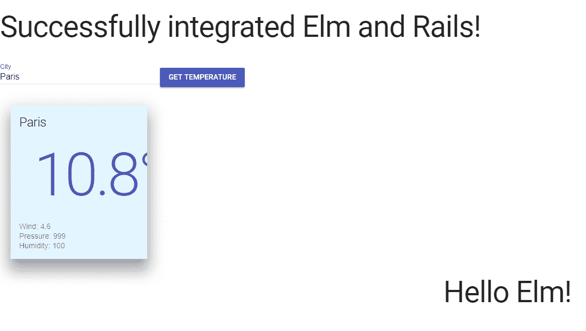

# 第十章：将 Elm 与 Rails 集成

欢迎来到第十章，*将 Elm 与 Rails 集成*。本章的目标是在前端使用 Elm 实现简单的用户认证。对于后端，我们将使用 Ruby on Rails 5.1.5。

我们将涵盖的主题包括：

+   使用 Codeanywhere 设置基本的 Rails 5.1.5 应用程序

+   在 Codeanywhere 上安装 Ruby 2.5.0 和 Rails 5.1.5

+   创建一个新的 Rails 项目

+   将 Elm 与 Rails 5.1.5 集成

+   将我们的 Elm 天气应用程序添加到我们的 Rails 应用程序中

完成本章后，您将能够：

+   在 Codeanywhere 上安装一个新的 Rails 项目

+   利用 webpacker 钩子更容易地与 Elm 一起工作

+   在现有的 Rails 应用程序中集成由 Elm 驱动的模块

# 使用 Codeanywhere 设置基本的 Rails 5.1.5 应用程序

**Codeanywhere** 是一个在线 **集成开发环境**（**IDE**），拥有许多优秀功能。您可以通过将浏览器指向 [codeanywhere.com](http://codeanywhere.com) 来访问它。

要开始使用它，需要进行注册。

在实际上能够使用容器化的 Ubuntu 14.04 环境来运行我们的 Rails 5.1.5 应用程序之前，Codeanywhere 要求新注册用户确认他们的电子邮件。

要开始，请选择一个新的 Ubuntu 14.04 空白开发堆栈，给它起个名字，例如，elmrails，然后点击 CREATE 按钮。

点击 CREATE 按钮，将创建一个新的 Ubuntu 14.04 容器，供我们工作使用。

需要注意的一个重要事项是我们在 Codeanywhere 应用程序的编辑器面板中收到的消息。编辑器面板并不复杂；它只是打开的 Codeanywhere 应用程序中最大的面板，以标签的形式列出打开的文件。在成功创建容器后，我们收到的消息会列出容器的名称和一些附加信息，如下所示：

```js
elmrails Container
Development Stack with your custom installed tools

This Codeanywhere Container comes with:

2GB of Disc Storage
256MB RAM (+ 512 MB swap)
Sudo access
SSH access on hostXX.codeanyhost.com:12345
Access to all HTTP and Websocket ports
The operating system running on this Container is Ubuntu 14.04 (64 bit). Ubuntu uses Advanced Packaging Tool (apt) package manager. You can read more here: apt-get

To access an application running on your Container use the following link (ports 1024-9999 available):

http://<containername>-<username><123456>.codeanyapp.com

To access your application over HTTPS, make sure your application is running on port 3000 and use the following link:

https://<containername>-<username><123456>.codeanyapp.com

If the port is blocked by your firewall you can connect through the standard HTTP port: (replace XX with port you have specified in your app)

http://port-XX.<containername>-<username><123456>.codeanyapp.com

```

在这里列出的所有信息中，以下信息最为重要：

```js
To access an application running on your Container use the following link (ports 1024-9999 available):

http://<containername>-<username><123456>.codeanyapp.com
```

这条信息之所以重要，原因很简单：该地址将是您需要在浏览器中打开以查看您的工作 Rails 应用的地址。然而，现在还为时尚早，因为我们还需要安装 Ruby 2.5.0 和 Rails 5.1.5。

# 在 Codeanywhere 上安装 Ruby 2.5.0 和 Rails 5.1.5

完成容器设置后，点击编辑器链接，您就可以开始安装 Ruby 2.5.0 和 Rails 5.1.5。有关如何操作的详细说明，请参阅 gorails.com 网站上的优秀在线指南，地址如下：[`gorails.com/setup/ubuntu/14.04`](https://gorails.com/setup/ubuntu/14.04)。

在这里，我们将只列出需要在控制台中运行的命令，以提供一个快速概览。请注意，以下命令也可以在本章附带代码文件中找到。

注意，在某个时刻，您将需要运行命令 `rbenv install 2.5.0`，这将使控制台看起来冻结。为了更好地了解正在发生的事情，您可以使用以下标志运行此命令：

```js
rbenv install --verbose 2.5.0
```

使用`rbenv install`命令运行此标志将开启详细日志记录，这样你可以更详细地看到安装进度，而不用担心应用是否真的在做什么。

应该运行的完整命令列表如下：

```js
curl -sL https://deb.nodesource.com/setup_8.x | sudo -E bash -
curl -sS https://dl.yarnpkg.com/debian/pubkey.gpg | sudo apt-key add -
echo "deb https://dl.yarnpkg.com/debian/ stable main" | sudo tee /etc/apt/sources.list.d/yarn.list
sudo apt-get update
sudo apt-get install git-core curl zlib1g-dev build-essential libssl-dev libreadline-dev libyaml-dev libsqlite3-dev sqlite3 libxml2-dev libxslt1-dev libcurl4-openssl-dev python-software-properties libffi-dev nodejs yarn
cd
git clone https://github.com/rbenv/rbenv.git ~/.rbenv
echo 'export PATH="$HOME/.rbenv/bin:$PATH"' >> ~/.bashrc
echo 'eval "$(rbenv init -)"' >> ~/.bashrc
exec $SHELL
git clone https://github.com/rbenv/ruby-build.git ~/.rbenv/plugins/ruby-build
echo 'export PATH="$HOME/.rbenv/plugins/ruby-build/bin:$PATH"' >> ~/.bashrc
exec $SHELL
rbenv install 2.5.0
ruby -v
rbenv global 2.5.0
ruby -v
gem install bundler
node -v
gem install rails -v 5.1.5
rbenv rehash
rails -v
```

现在我们已经安装了所有先决条件，我们将安装一个 Rails 应用。

# 创建一个新的 Rails 项目

要安装一个新的 Rails 应用，你的`bash`需要在`workspace`文件夹内。为了验证你处于正确的位置，你应该在控制台中看到以下输出：

```js
cabox@box-codeanywhere:~/workspace$
```

现在，只需运行以下命令：

```js
rails new simple --webpack=elm
```

注意，单词`simple`可以是任何你想要的东西。你选择的单词将决定你的 Rails 5 应用将被安装的文件夹名称。

接下来，在 Codeanywhere 应用的左侧面板中，右键单击最底部的条目，即`elmrails`，然后在弹出的上下文菜单中点击`refresh`命令。

执行此操作将导致树结构刷新，现在你将能够看到在`elmrails`项目文件夹内列出的另一个名为`simple`的文件夹，如下所示：

```js
∨ elmrails
  > simple
```

点击左侧面板中`simple`文件夹的标题将切换文件夹结构的可见性。如果你点击它将其展开，你会看到以下结构：

```js
∨ simple
  > .git
  > app
  > bin
  > config
  > db
  > elm-stuff
  > lib
  > log
  > node_modules
  > public
  > test
  > tmp
  > vendor
    .babelrc
    .gitignore
    .postcssrc.yml
    config.ru
    elm-package.json
    Gemfile
    Gemfile.lock
    package.json
    Rakefile
    README.md
    yarn.lock
```

现在你已经确认成功安装了 Rails，是时候试驾一下了。通过运行以下命令将 bash 指向`simple`文件夹：

```js
cd simple
```

现在，输入启动 Rails 服务器的命令：

```js
rails s
```

你应该在控制台中看到以下输出：

```js
=> Booting Puma
=> Rails 5.1.5 application starting in development
=> Run `rails server -h` for more startup options
Puma starting in single mode...
* Version 3.11.3 (ruby 2.5.0-p0), codename: Love Song
* Min threads: 5, max threads: 5
* Environment: development
* Listening on tcp://0.0.0.0:3000
Use Ctrl-C to stop
```

现在是时候查看我们在线运行的样板 Rails 应用了。为了做到这一点，我们需要参考我们创建 Ubuntu 容器后得到的信息，也就是说，我们需要检查以下信息：

```js
To access an application running on your Container use the following link (ports 1024-9999 available):

http://<containername>-<username><123456>.codeanyapp.com
```

注意，当我们运行`rails s`命令时，控制台输出以这一行结束：

```js
* Listening on tcp://0.0.0.0:3000
```

这意味着我们的 Rails 应用正在以下地址提供服务：

```js
http://<containername>-<username><123456>.codeanyapp.com:3000
```

如果你在新标签页的浏览器中指向此地址，你会看到 Rails 5 的欢迎屏幕：

```js
<Rails logo>
Yay! You’re on Rails!
<A drawing>
Rails version: 5.1.5
Ruby version: 2.5.0 (x86_64-linux)
```

在本节中，我们成功安装了 Rails。不仅如此，通过在 Rails 项目创建命令中提供`--webpack=elm`标志，我们成功地将 Elm 与我们的新 Rails 项目集成。

这也是为什么我们不得不在本章开头进行相对较长的 Rails 5.1.5 安装：为了实现 Rails 和 Elm 的简单、无痛苦的集成。

在下一节中，我们将开始修改我们的 Rails 应用，并在其中开始使用 Elm。

# 集成 Elm 与 Rails 5.1.5

当不传递任何附加标志运行 `rails new <projectname>` 命令时，创建的 Rails 应用程序是一个默认的应用程序，没有 Elm 集成。删除我们在上一步中创建的新 Rails 项目的文件夹并运行一个新的 Rails 项目创建命令，这次不传递标志，可能是一个很好的练习。然而，为了避免浪费在这种事情上的时间，我们将在这里列出当我们向 `rails new <projectname>` 命令传递 `--webpack=elm` 标志时创建的一些附加文件。

要了解 Elm 如何与 Rails 集成，最好的起点是 `app/javascript` 文件夹，在该文件夹中，是 `hello_elm.js` 文件。

这是 `hello_elm.js` 的内容：

```js
// Run this example by adding <%= javascript_pack_tag "hello_elm" %> to the
// head of your layout file, like app/views/layouts/application.html.erb.
// It will render "Hello Elm!" within the page.

import Elm from '../Main'

document.addEventListener('DOMContentLoaded', () => {
  const target = document.createElement('div')

  document.body.appendChild(target)
  Elm.Main.embed(target)
})
```

这个 JavaScript 文件将 `Main.elm` 文件渲染的视图嵌入到一个 `div` 元素中。

但这个 `div` 元素将存在于哪里？这完全取决于我们。

例如，`hello_elm.js` 的前三条实际上是单行 JavaScript 注释，它们为我们提供了如何在 Rails 网站的布局文件中渲染 Elm 驱动的视图的精确指令。

如注释掉的指令所示，我们需要进入我们 Rails 应用程序的默认布局视图，即 `application.html.erb`。

此文件的完整路径是 `simple/app/views/layouts/application.html.erb`。因此，让我们打开这个文件，并在其 `head` 中添加 `javascript_pack_tag`，如下所示：

```js
<!DOCTYPE html>
<html>
  <head>
    <title>Simple</title>
    <%= csrf_meta_tags %>

    <%= stylesheet_link_tag 'application', media: 'all', 'data-turbolinks-track': 'reload' %>
    <%= javascript_include_tag 'application', 'data-turbolinks-track': 'reload' %>
     <%= javascript_pack_tag "hello_elm" %>
  </head>
...
```

最后，为了将所有这些连接起来，我们需要将 `application#index` 设置为我们的 Rails 应用程序将打开的默认路由。我们将通过更新位于 `simple/config/` 文件夹中的 `routes.rb` 文件来实现这一点：

```js
Rails.application.routes.draw do
  # For details on the DSL available within this file, see http://guides.rubyonrails.org/routing.html
  root 'application#index'
end
```

在此文件中，我们仅在文件的最后一行之上添加了 `root 'application#index'` 路由。这样做告诉我们的 Rails 应用程序，我们希望将其路由到应用程序控制器的索引操作作为默认路由，或称为 *root* 路由。

如果我们在浏览器中刷新我们的运行中的应用程序，此时我们会得到以下错误：

```js
Unknown action
The action 'index' could not be found for ApplicationController
```

这意味着我们需要为我们的 `ApplicationController` 添加索引视图。为此，我们只需在 `views` 文件夹中创建一个新的文件夹。我们将把这个新文件夹称为 `application`。接下来，在 `application` 文件夹中，让我们创建一个新的文件，我们将称之为 `index.html.erb`。

注意，为了在 Codeanywhere 中创建文件夹和文件，你需要右键单击应该包含它们的父文件夹。然后，根据你的需要选择“创建文件夹”或“创建文件”命令。一旦你做出选择，就会出现一个模态窗口，你将能够输入你的文件或文件夹的名称，具体取决于你选择的命令。

接下来，打开新创建的 `index.html.erb` 文件，并在其中仅输入一行代码：

```js
<h1>Successfully integrated Elm and Rails!</h1>
<div></div>
```

接下来，保存所有更改，并在你查看你的 Rails 应用程序（带有 Rails 启动屏幕）的页面中刷新页面。

接下来，打开运行着 Rails 服务器的 bash 标签页。注意，控制台正在输出以下消息：

```js
[Webpacker] Compiling…
[Webpacker] Compiled all packs in /home/cabox/workspace/simple/public/packs
Completed 200 OK in 187478ms (Views: 187460.0ms)
```

这些消息意味着 webpacker 正在工作，编译你的 Elm 代码并将其集成到你的 Rails 项目中。正如你所看到的输出，这次编译花费了大约 188 秒。一旦完成，你可以刷新你预览的 Rails 应用的页面，现在，你应该在屏幕的右上部分看到以下消息：

```js
Hello Elm!
```

让你的 Rails 应用在默认路由上显示这条消息，意味着你已经成功地将 Elm 集成到 Rails 中。

现在，我们已经成功地将 Elm 集成到我们的 Rails 应用中，让我们通过构建一些更复杂的东西来进一步改进我们的结果。

# 将我们的 Elm 天气应用添加到我们的 Rails 应用中

在本节中，我们将通过添加 Elm 天气应用来改进我们的 Rails 应用。我们将使用 第八章 的 *添加更多功能到天气应用* 末尾所拥有的天气应用的完成版本。

为了做到这一点，让我们打开 Rails 应用的根目录中的 `elm-package.json` 文件，并添加额外的依赖项，以便完整的更新文件看起来如下：

```js
{
 "version": "1.0.0",
 "summary": "helpful summary of your project, less than 80 characters",
 "repository": "https://github.com/user/project.git",
 "license": "BSD3",
 "source-directories": [
 "app/javascript"
 ],
 "exposed-modules": [],
 "dependencies": {
 "debois/elm-mdl": "8.1.0 <= v < 9.0.0",
 "elm-lang/core": "5.0.0 <= v < 6.0.0",
 "elm-lang/html": "2.0.0 <= v < 3.0.0",
 "elm-lang/http": "1.0.0 <= v < 2.0.0",
 "myrho/elm-round": "1.0.2 <= v < 2.0.0"
 },
 "elm-version": "0.18.0 <= v < 0.19.0"
}
```

接下来，我们需要安装这些包。我们不能直接通过 Elm 来安装它们，而是需要使用 Yarn。我们需要运行的命令如下：

```js
yarn run elm package install
```

控制台将打印以下内容到屏幕上：

```js
yarn run v1.5.1
$ /home/cabox/workspace/simple/node_modules/.bin/elm package install
Some new packages are needed. Here is the upgrade plan.

 Install:
 debois/elm-dom 1.2.3
 debois/elm-mdl 8.1.0
 elm-lang/dom 1.1.1
 elm-lang/mouse 1.0.1
 elm-lang/window 1.0.1
 myrho/elm-round 1.0.2

Do you approve of this plan? [Y/n] y
Starting downloads...

 ● debois/elm-dom 1.2.3
 ● elm-lang/mouse 1.0.1
 ● elm-lang/dom 1.1.1
 ● debois/elm-mdl 8.1.0
 ● elm-lang/window 1.0.1
 ● myrho/elm-round 1.0.2

Packages configured successfully!
Done in 25.23s.
```

现在，我们需要创建一个新文件，我们将称之为 `WeatherApp.elm`。接下来，我们可以简单地复制并粘贴完整的天气应用到这个文件中。我们唯一需要做的修改是在第一行，它需要看起来像这样：

```js
module WeatherApp exposing (..)
```

`WeatherApp.elm` 文件的完整代码可以在 第八章 的代码文件中找到，*添加更多功能到天气应用*（因为我们使用的是在 第八章 的 *添加更多功能到天气应用* 末尾完成的改进天气应用的 `Main.elm` 文件中的代码）。

接下来，我们还需要添加一个 JS 文件，它将成为我们的 `WeatherApp.elm` 文件的入口点。我们将把这个 JS 文件命名为类似 `hello_elm.js` 的样子，这意味着我们将使用下划线字符分隔单词，并且文件名中不会使用大写字母。因此，在 `javascript/packs` 文件夹中创建一个新文件，并将其命名为 `weather_app.js`。

接下来，将以下代码添加到这个新文件中：

```js
import Elm from './WeatherApp'

document.addEventListener('DOMContentLoaded', () => {
  const target = document.getElementById('weather-app')

  Elm.WeatherApp.embed(target);
})
```

接下来，我们需要通过添加 `javascript_pack_tag` 并传递一个具有 `id` 属性为 `weather-app` 的 `div` 来更新我们的 `views/application/index.html.erb` 文件：

```js
<h1>
  Successfully integrated Elm and Rails!
</h1>
<%= javascript_pack_tag "weather_app" %>
<div id="weather-app"></div>
<div></div>
```

现在，我们可以重新启动我们的 Rails 服务器：

```js
rails s
```

注意，这次，webpacker 将花费相当长的时间来编译所有新添加的包（`Http`、`Material` 和 `Round`）。在运行 `rails s` 命令后，你应该在控制台中看到以下消息：

```js
rails s
=> Booting Puma
=> Rails 5.1.5 application starting in development
=> Run `rails server -h` for more startup options
Puma starting in single mode...
* Version 3.11.3 (ruby 2.5.0-p0), codename: Love Song
* Min threads: 5, max threads: 5
* Environment: development
* Listening on tcp://0.0.0.0:3000
Use Ctrl-C to stop
Started GET "/" for ......... at 2018-03-10 04:04:30 -0500
Cannot render console from .........! Allowed networks: 127.0.0.1, ::1, 127.0.0.0/127.255.255.255
Processing by ApplicationController#index as HTML
 Rendering application/index.html.erb within layouts/application
[Webpacker] Compiling…
```

最后，在编译完成后，我们将在控制台中看到以下消息：

```js
[Webpacker] Compiled all packs in /home/cabox/workspace/simple/public/packs
 Rendered application/index.html.erb within layouts/application (87118.0ms)
Completed 200 OK in 97585ms (Views: 96676.2ms)
```

如果我们在浏览器中打开我们的 Rails 应用程序并刷新它，我们将看到以下网页：



如您所见，我们目前由 Rails 驱动的网站有三个部分：一个静态的 `h1` 标题和两个独立的 Elm 应用程序，天气应用程序和问候应用程序。

这意味着我们已经成功地将两个独立的 Elm 应用程序添加到我们的 Rails 应用程序中。这样，我们可以逐渐开始将 Elm 小部件引入现有的 Rails 驱动的网站。如果我们是一个不知道 Elm 但想了解它如何与现有项目集成并从中学习的开发者团队，这将非常棒。这种方法的另一个可能用例是，如果我们公司的管理层决定尝试 Elm 而不是全盘投入。

# 摘要

在本章中，我们涵盖了以下主题：

+   使用 Codeanywhere 设置基本的 Rails 5.1.5 应用程序

+   在 Codeanywhere 上安装 Ruby 2.5.0 和 Rails 5.1.5

+   创建一个全新的 Rails 项目

+   将 Elm 与 Rails 5.1.5 集成

+   将我们的 Elm 天气应用程序添加到我们的 Rails 应用程序中

带着这些知识，我们可以开始向我们的 Rails 应用程序中添加独立的 Elm 驱动的模块。

这本书的内容到此结束。然而，您与 Elm 的旅程才刚刚开始。以下是一些如果您想了解更多关于这个优秀语言的有用资源（以下链接按无特定顺序列出）：

+   [`github.com/bryanjenningz/25-elm-examples`](https://github.com/bryanjenningz/25-elm-examples)

+   [`www.smashingmagazine.com/2018/01/learning-elm-drum-sequencer-part-1/`](https://www.smashingmagazine.com/2018/01/learning-elm-drum-sequencer-part-1/)

+   [`elmprogramming.com/`](http://elmprogramming.com/)

+   [`www.reddit.com/r/elm/`](https://www.reddit.com/r/elm/)

+   [`elmlang.herokuapp.com/`](http://elmlang.herokuapp.com/)

+   [`www.elmlog.com/meetup_groups`](https://www.elmlog.com/meetup_groups)

+   [`discourse.elm-lang.org/`](https://discourse.elm-lang.org/)

# 访问 elmcasts.com

最后，这本书的作者启动了一个全新的项目。一个专门用于学习 Elm 的网站。

沿着类似 [railscasts.com](http://railscasts.com) 和 [laracasts.com](http://laracasts.com) 的网站的传统，我决定将其命名为 [**elmcasts.com**](http://elmcasts.com)。当这本书上市时，网站应该已经上线并运行。
