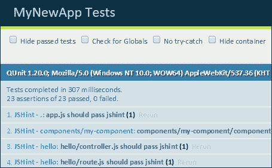
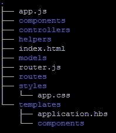
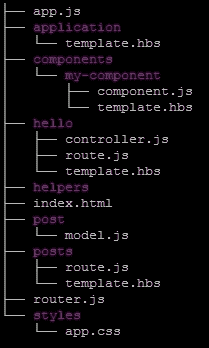

# 第一章 Ember CLI 基础

在本章中，我们将介绍以下食谱：

+   安装 Ember CLI

+   创建你的第一个项目

+   探索 pods 和文件夹布局

+   资产编译

+   依赖管理

+   升级你的项目

+   部署

# 简介

Ember CLI 是一个基于**Node.js**的命令行界面工具，专为**Ember.js**中的应用程序编程设计。自其创建以来，这个工具已成为创建 Ember 应用程序的首选方法。

简而言之，Ember CLI 使得启动新的 Ember 应用程序变得简单。在其他框架中，你可能需要学习**gulp**或**grunt**作为你的任务运行器。在 Ember CLI 中，这一切都为你内置了。在 Ember.js 生态系统中拥有 Ember CLI 是一个变革，使这个框架在众多框架中脱颖而出。

Ember CLI 处理测试、编译和升级，甚至内置了网络服务器。Ember CLI 不仅为你生成样板代码，而且与许多测试框架很好地集成。它有一个强大的插件系统，可以扩展其当前功能之外的功能。

# 安装 Ember CLI

Ember CLI 的安装对于学习 Ember 至关重要，并将贯穿本书的始终。

## 准备工作

在安装 Ember CLI 之前，我们必须安装**Node 包管理器**（**npm**）。`npm`是 JavaScript 的包管理器，默认情况下与 Node.js 一起安装。

你必须安装 Node.js 的 0.12 或更高版本，以便 Ember CLI 可以运行。如果可能，请尝试安装 4.0.0 或更高版本。这是首选版本。

Node.js 在包括 Windows、Mac 和 Linux 在内的几个主要平台上可用。安装 Node.js 有多种方法：

+   **一键安装程序**：许多平台，如 Windows 和 Mac，都提供这种功能

+   **Homebrew**或**MacPorts**：这对于 Mac OS 用户很有用

+   **下载 TAR 文件**：下载 Node.js 的 TAR 文件并解压

+   **通过 Linux 包管理系统安装**：Yum、apt-get 或 pacman 可用于在 Linux 环境中安装

### Windows 或 Mac 的一键安装程序

这种方法到目前为止是最简单的。要安装 node，你需要打开[`nodejs.org/download`](http://nodejs.org/download)的 node 网站。点击 Windows 或 Mac 的`pkg`、`msi`或`exe`安装程序。下载后运行它。

### Mac 的 Homebrew 或 MacPorts

如果你已经安装了 Homebrew，只需运行以下命令：

```js
$ brew install node

```

另一方面，如果你正在使用 MacPorts，你可以使用 port install 命令：

```js
$ sudo port install nodejs

```

### 小贴士

MacPorts 可以从[`www.macports.org`](http://www.macports.org)安装。Homebrew 可以从[`brew.sh`](http://brew.sh)安装。两者都为 OS X 系统提供简单的包管理。

### 一个 TAR 文件

TAR 文件是一种存档文件类型。要通过 TAR 安装 node，你需要从 Node.js 网站下载 TAR 文件并解压和安装。一种方法是使用`curl`。

我只会推荐这种方法，如果您正在使用 Linux 发行版。如果您在 Linux 上运行，您需要安装正确的工具来从源代码编译。在 Ubuntu 上，您需要安装 build-essential 和 `curl` 软件包：

```js
$ curl http://nodejs.org/dist/node-latest.tar.gz | tar xz --strip-components=1
$ ./configure
$ sudo make install

```

### Linux 软件包管理器

所有主要的 Linux 发行版都提供 Node.js 软件包。在 Ubuntu 上，您可以直接使用 `apt-get`：

```js
$ sudo apt-get install nodejs

```

在 Fedora 上，您可以使用 `yum`：

```js
$ yum install nodejs npm

```

检查您的 Linux 发行版以获取有关如何安装 Node.js 等软件包的更多详细信息。请注意，某些发行版可能提供过时的 Node.js 版本。在这种情况下，我建议您使用稍后将要讨论的 **Node Version Manager** (**NVM**) 安装方法。

### 测试安装

要测试您的安装，请运行 `–v` 命令：

```js
$ node –v
$ npm –v

```

这将显示当前安装的版本。请注意，您必须运行 v0.12 或更高版本才能运行 Ember CLI。如果可能，请尝试运行 v4.0.0 或更高版本。

### 小贴士

NVM 是一个 bash 脚本，它可以帮助管理多个活动的 Node.js 版本。NVM 提供了一个非常简单的命令行界面，可以安装任何版本的 Node.js，而无需访问 Node.js 网站。它将每个安装分开，使得在版本之间切换变得非常容易。我建议大多数 Mac 和 Linux 的初学者运行此脚本。您可以在 [`github.com/creationix/nvm`](https://github.com/creationix/nvm) 下载 NVM。

## 如何操作...

我们需要使用 `npm` 来安装 Ember CLI。我们将使用 `-g` 选项全局安装它，这样就可以从命令行在任何地方运行它。

1.  打开命令提示符并输入以下命令：

    ```js
    $ sudo npm install –g ember-cli

    ```

    如果已安装 NVM，则命令开头不需要 `sudo`。

1.  在 Ember CLI 安装完成后，我们需要下载 **Bower**。Bower 是客户端编程的包管理器，也是 Ember.js 的另一个重要组件。在开始安装 Bower 之前，必须安装 Node.js 和 npm。我们将使用 Bower 来安装所有客户端库：

    ```js
    $ sudo npm install –g bower

    ```

    与上一个命令类似，如果 Node.js 是通过 NVM 安装的，则命令开头不需要 `sudo`。

1.  最后一步是安装 **PhantomJS**。PhantomJS 是一个脚本化的无头浏览器，用于自动化和测试网页。它被 Ember CLI 所青睐，需要安装：

    ```js
    $ npm install –g phantomjs

    ```

1.  如果您在 Windows 上，请安装 Ember CLI Windows 工具：

    ```js
    $ npm install ember-cli-windows –g

    ```

1.  安装完成后，此工具可以在任何项目目录中运行：

    ```js
    $ ember-cli-windows

    ```

1.  确保下载并安装 Git for Windows: [`git-scm.com/downloads`](https://git-scm.com/downloads)

    ### 注意

    **在 Windows 上工作**

    Windows 上的构建时间可能比 Mac 或 Linux 更长。Ember CLI Windows 工具可以帮助加快和优化构建性能。只需在项目目录中运行它。您也可以将其作为插件下载。

    另一种帮助提高性能的方法是始终以提升权限运行 PowerShell/CMD。否则，可能会出现性能问题和错误。最后，尽量使用 npm 版本 3 或更高版本。在 Windows 中，较旧版本可能会遇到长文件路径问题。

    另一个实用的技巧如下：

    ### 小贴士

    **可选：安装 Watchman**

    Watchman 是适用于 OS X 和类 UNIX 操作系统的文件监视服务。它由 Facebook 开发，是 Ember CLI 监视项目更改的更有效方式。如果没有安装，Ember CLI 将回退到使用 **NodeWatcher**。NodeWatcher 更容易出错，并且难以观察大型树。如果您的平台支持，请安装 Watchman。要下载和配置 Watchman，请访问 [`facebook.github.io/watchman/`](https://facebook.github.io/watchman/)。

## 它是如何工作的...

Ember CLI 是用 Node.js 编写的，可以通过 npm 安装。该工具解释用户命令以帮助创建 Ember.js 应用程序。每个用户命令都会被查找并执行。Ember CLI 依赖于包括 Bower、Lodash、Broccoli 和 Babel 在内的多个其他依赖项。

## 还有更多...

让我们来看看命令和别名。

### 命令

Ember CLI 安装后，我们将能够访问多个命令。以下是一些更重要命令的简短列表：

| 命令 | 目的 |
| --- | --- |
| `ember` | 这将打印出可用的命令列表 |
| `ember new <应用名称>` | 这将在 `<应用名称>` 目录中创建一个目录并创建应用程序结构 |
| `ember init` | 这将在当前目录中创建一个应用程序 |
| `ember build` | 这将在 `/dist` 文件夹中构建应用程序 |
| `ember server` | 这将启动一个网络服务器 |
| `ember generate <生成器名称>` | 这将运行一个生成器，为项目构建脚手架 |
| `ember destroy <生成器名称>` | 这将卸载由生成器创建的模块 |
| `ember test` | 这将使用 **Testem** 运行测试 |
| `ember install <插件名称>` | 这将安装插件 |

### 别名

请记住，对于每个命令，都有一个别名。这些别名使运行命令变得更快。假设您想构建一个新的项目。通常，您会输入以下内容：

```js
$ ember build

```

这将正常工作且效果良好。它将生成一个新的项目和应用程序结构。您也可以使用别名。

```js
$ ember b

```

这里有一些您可以使用的一些常用别名。这是可选的。

| 命令 | 别名 |
| --- | --- |
| `ember build` | `ember b` |
| `ember generate` | `ember g` |
| `ember init` | `ember i` |
| `ember server` | `ember s` |
| `ember destroy` | `ember d` |
| `ember test` | `ember t` |
| `ember version` | `ember v` |

# 创建您的第一个项目

在这个菜谱中，我们将创建我们的第一个项目。

## 如何操作...

我们将首先使用 Ember CLI 工具来创建我们的第一个项目。

1.  打开命令提示符并输入以下命令：

    ```js
    $ ember new my-project

    ```

    这将创建一个全新的项目，名为 `my-project`。项目结构将包含我们开始所需的一切。

1.  要显示此项目，我们可以简单地运行服务器命令：

    ```js
    $ cd my-project
    $ ember server

    ```

    `ember server` 命令将在端口 4200 上启动一个网络服务器。您可以通过打开 `http://localhost:4200` 来访问此端口。您应该看到默认的 **欢迎使用 Ember 网站**。

    ### 小贴士

    在开发应用程序时保持 Ember 服务器运行是一个好主意。Ember CLI 使用一个名为 **LiveReload** 的工具在更改时刷新网络浏览器。这可以用来查看新更改如何影响您的应用程序。要运行 LiveReload，只需输入 `ember server`。这将启动带有 LiveReload 的服务器。

1.  服务器命令默认为端口 4200。您可以使用 `--port` 参数轻松更改此端口：

    ```js
    $ ember server --port 1234

    ```

    这将在端口 `1234` 上启动服务器，而不是默认的 4200。

1.  另一个有用的选项是 `--proxy` 参数。这将把所有 **Asynchronous JavaScript and XML**（**Ajax**）请求代理到指定的地址。假设我们有一个运行在端口 `8080` 上的节点服务器。我们可以按照以下方式运行服务器：

    ```js
    $ ember server --proxy http://127.0.0.1:8080

    ```

    对于每个 Ajax 请求，Ember 现在将把这些请求发送到本地的端口 `8080`。

    ### 小贴士

    请记住，从 Ember 2.0 开始，**Internet Explorer**（**IE**）8 的支持已被取消。所有现代网络浏览器和 8 版本之后的 IE 版本都能正常工作。如果需要 IE 8 的支持，Ember.js 1.13 扩展了浏览器支持，应该可以与它兼容。

## 它是如何工作的...

`ember server` 命令创建一个 **Node.js Express 服务器**。此服务器使用 LiveReload，并在任何更改时刷新网页。服务器命令接受不同的参数，包括 `--proxy` 和 `--port`。

## 更多内容...

在运行服务器时，您可以访问测试。启动服务器后，您将能够访问 **QUnit** 接口。QUnit 是一个 JavaScript 单元测试框架。它用于运行您的集成和验收测试。要访问该接口，请将浏览器导航到 `http://localhost:4200/tests`。这将显示项目中的所有测试。从这里，您可以查看哪些测试通过，哪些失败。我们将在后面的章节中介绍这一点：



# 探索 pods 和文件夹布局

Ember CLI 将为我们创建文件夹结构。Ember.js 使用 **模型-视图-控制器**（**MVC**）模式。您将在本食谱中看到文件夹结构是如何布局的，以及模型、控制器和视图（模板）是如何相互分离的。

## 准备工作

Ember CLI 依赖于 **ES2015** 模块。这意味着您可以使用明天的 JavaScript 语法编写今天的代码。这是通过 **Ember Resolver** 实现的。

### 小贴士

**ES2015**

ECMAScript 6，也称为 ES2015，是即将推出的 ECMAScript 编程语言版本。ES2015 包含几个新功能，包括模板字符串、解构、箭头函数、模块和类定义等。所有这些现在都在您的 Ember 项目中可用。

### Pods

Ember pod 是一种不同类型的结构，它根据功能而不是类型来组织您的模块。随着您的项目增长，您可能希望按功能组织项目以帮助保持事物有序。Ember 解析器将首先查找 pod 结构，然后再查看传统结构。

要自动设置 pod 结构，您可以编辑项目目录根目录中的 `.ember-cli` 文件并添加以下行：

```js
{
  "usePods": true
}
```

### 提示

**下载示例代码**

您可以从 [`www.packtpub.com`](http://www.packtpub.com) 下载示例代码文件，以获取您购买的所有 Packt 出版物的所有内容。如果您在其他地方购买了此书，您可以访问 [`www.packtpub.com/support`](http://www.packtpub.com/support) 并注册以将文件直接通过电子邮件发送给您。

这将设置默认结构，使其始终使用 pods。当使用 pods 时，设置所有 pods 所在的位置是一个好主意。为此，您需要编辑 `config/environment.js` 文件：

```js
...
var ENV = {
  modulePrefix: 'pod-example',

..   podModulePrefix: 'pod-example/pods' 
```

`podModulePrefix` 属性设置 POD 路径，格式如下：`{appname}/{poddir}`。在先前的例子中，POD 目录现在设置为 `app` 文件夹中的 `/pods`。如果未设置位置，所有新的模块都将创建在 `app/` 文件夹中。

## 如何做到这一点...

创建新项目后，将生成一个正常的文件夹布局。此布局由几种不同类型的模块组成。以下是每个目录的简要描述：

| 目录 | 执行的操作 |
| --- | --- |
| `app/adapters` | 适配器帮助扩展逻辑以与后端数据存储进行通信 |
| `app/components` | 组件用于帮助重用代码，并且其名称中必须包含破折号 |
| `app/helpers` | Helper 用于 HTML 重用 |
| `app/initializers` | 初始化器首先运行并帮助设置您的应用程序 |
| `app/mixins` | 这是一种用于多重继承的特殊类型的 **Ember.Object** |
| `app/routes` | 路由帮助在不同应用程序状态之间移动 |
| `app/serializers` | 这用于序列化您的数据模型 |
| `app/transform` | Transform 用于反序列化和序列化模型属性 |
| `app/utils` | Utils 是小型实用类 |
| `app/models` | 模型存储数据存储 |
| `app/templates` | 模板使用 HTMLBars 向用户显示 HTML |
| `app/templates/components` | 这些是在组件中使用的模板 |

一个带有默认布局的新项目 `app` 文件夹看起来类似于以下内容：



每个模块都将有自己的目录。例如，`templates` 文件夹将存储所有模板，而 `components` 控制器将存储所有组件。

假设我们使用 pods 添加了一个新的帖子资源。以下命令将生成一个新的帖子模型、路由和模板，并将更新路由：

```js
$ ember g resource posts

```

现在，文件系统将看起来像这样：



Pods 根据功能对目录进行排序。帖子（posts）文件夹是功能，文件命名是根据它们所服务的功能来命名的。

## 它是如何工作的...

每个 Ember CLI 项目的目录结构都是经过设计的。当创建新项目或生成新脚手架时，CLI 会将文件放置在某个目录中，并使用 Ember Resolver 理解的 ES2015 格式进行命名结构。

Ember Resolver 负责查找应用程序中的代码并转换实际类文件中的命名约定。使用 Ember pods 时，解析器知道首先在默认结构之前查找那里。

# 资产编译

在这个菜谱中，我们将看看如何将资产添加到项目中。

## 如何做...

在你的应用程序中，在某个时刻，你可能想要添加资产并最小化或指纹化你的项目。这可以在项目的`root`文件夹中的`ember-cli-build.js`文件或`asset`文件夹中完成。

### CSS 和资产

所有资产应放置在`public/assets`文件夹中。资产可以在程序中通过`assets/images/{image file}`进行引用。CSS 文件应放置在`app/styles`文件夹中。

### 压缩

默认情况下，CSS 和 JavaScript 文件在生产构建过程中会被压缩。有方法可以打开和关闭此功能。例如，假设你想关闭 CSS 和 JavaScript 的压缩。为此，我们可以简单地编辑`ember-cli-build.js`文件，并在`// Add options here`部分添加`minifyCSS`和`minifyJS`部分：

```js
module.exports = function(defaults) {
  var app = new EmberApp(defaults, {
    // Add options here
    minifyCSS: {
      enabled: false
    },
    minifyJS: {
      enabled: false
    }
  });
```

这将告诉编译器不要压缩 JavaScript 和 CSS。要在生产模式下构建应用程序，只需使用`--environment`参数：

```js
$ ember build --enviroment=production

```

### 指纹化

默认情况下，所有文件在生产构建过程中都会进行指纹识别。这包括所有`js`、`css`、`png`、`jpg`和`gif`资产。在这个过程中，所有这些文件都会在其文件名末尾附加一个 md5 校验和。在这个过程中，所有 HTML 和 CSS 文件都将被重写以包含这些新名称。

在对文件进行指纹化时，有几种选项可用。这全部都在`ember-cli-build.js`文件中控制。假设你想要禁用指纹化：

```js
…
fingerprint: {
 enabled: false
}
…
```

另一个有用的选项是为所有静态文件添加一个域名。这可以通过使用`prepend`选项来完成。同样，这需要添加到`application`文件夹根目录下的`ember-cli-build.js`文件中：

```js
…
fingerprint: {
   prepend: 'http://www.example.com'
}
```

现在，所有资产都将包含`www.example.com`域名。例如，一个普通的 JavaScript `src`文件将看起来像这样：

```js
<script src="img/script.js">
```

这将被转换为以下内容：

```js
<script src="img/script-12324adfasdf123234.js">
```

另一个有用的选项是 `exclude`。它接受一个字符串数组。`exclude` 数组中的任何文件名都不会被指纹化：

```js
fingerprint: {
  exclude: ['fonts/12424']
}
```

`ignore` 选项也接受一个字符串数组。包含 `ignore` 数组中任何项目的任何文件名都不会被处理或指纹化：

```js
fingerprint: {
  ignore: ['fonts/12424']
}
```

`extension` 选项默认为 `'js'`、`'css'`、`'png'`、`'jpg'`、`'gif'` 和 `'map'`。此选项可用于添加其他需要指纹化的文件类型：

```js
fingerprint: {
  extension: ['r3','html']
}
```

`replaceExtensions` 选项默认为 `'html'`、`'css'` 和 `'js'`。如果需要，可以添加新文件类型以替换源代码和新的校验和文件名：

```js
fingerprint: {
  replaceExtensions: ['html','htm']
}
```

## 它是如何工作的...

导入过程是通过 Broccoli 资产管道库完成的。这个构建工具执行所有指纹化、压缩和资产导入操作。此外，如果安装了适当的插件，Broccoli 还处理所有预处理程序。

资产清单位于项目文件夹根目录下的 `ember-cli-build.js` 文件中。你只能导入位于 `bower_components` 或 `vendor` 目录中的资产。

# 依赖项管理

让我们看看依赖项管理以及我们如何在 Ember 项目中使用它。

## 如何做到这一点...

Bower 用于 Ember CLI 的依赖项管理。Bower 是一个前端工具，用于帮助获取和安装你可能需要的包。

1.  `bower.json` 文件位于你项目的 `root` 文件夹中。它包含所有依赖项。假设我们想要安装 **Bootstrap 库**：

    ```js
    $ bower install bootstrap --save

    ```

    此命令将在 `bower_components` 文件夹中安装 `bootstrap` 并将包信息保存到 `bower.json` 文件中。

    ### 小贴士

    **Ember 插件**

    将第三方库添加到 Ember 的另一种流行方式是使用插件或插件，正如你有时看到的那样。插件是 Ember 在应用程序之间共享库的方式。有超过一千个这样的插件可供使用。

    你可以使用 Ember CLI 安装插件。例如，要安装 Bootstrap，你需要在项目目录中的命令行中输入以下内容：

    `$ ember install ember-bootstrap`

    你可以轻松在这些网站上找到插件列表：

    [`www.emberobserver.com`](http://www.emberobserver.com)

    [`www.emberaddons.com`](http://www.emberaddons.com)

    这将在第十一章 *实时网络应用* 的 *工作与创建插件* 菜谱中更详细地讨论，*实时网络应用*。

1.  如果出于某种原因需要重新安装依赖项，可以单独运行 `install` 命令：

    ```js
    $ bower install

    ```

    这将安装 `bower.json` 文件中列出的所有依赖项。

### app.import 代码

Ember CLI 允许你加载 **异步** **模块定义**（**AMD**）和非 AMD 资产。这是一种定义代码模块及其依赖项的方式。

1.  要加载非 AMD 资产，你需要使用 `ember-cli-build.js` 文件导入它：

    ```js
    …
    app.import('bower_components/moment/moment.js');
    ```

1.  这很有用，因为你可以使用 Bower 安装组件，然后使用`app.import` AMD 使其在程序中可用。你需要查阅包规范以了解如何使用它。

    ### 提示

    **关于 JSHint 的提示**

    JSHint 是一个社区驱动的工具，用于检测 JavaScript 代码中的错误和潜在问题。它是 Ember CLI 内置的。当使用非 AMD 资产时，如果你有全局变量，你可能会遇到 JSHint 错误。为了解决这个问题，在模块页面的顶部添加`/* global MY_GLOBAL */`。在 moment 的例子中，它看起来像`/* global moment */`。

1.  AMD 资产以类似的方式导入。你在第一个参数中添加路径，在第二个参数中添加导出和模块列表：

    ```js
    app.import('bower_components/ic-ajax/dist/named-amd/main.js', {
      exports: {
        'ic-ajax': [
          'default',
          'defineFixture',
          'lookupFixture',
          'raw',
          'request',
        ]
      }
    });
    ```

1.  要在你的应用程序中使用此资产，你可以按照以下方式导入：

    ```js
    import { raw as icAjaxRaw } from 'ic-ajax';;
    ```

## 它是如何工作的...

依赖管理是通过 Bower 完成的。在依赖安装后，Broccoli 库被调用以将资产添加到管道中。这两个工具都是用 node 编写的，并且内置在 Ember CLI 中。

# 升级你的项目

Ember CLI 正在持续升级，每六周 Ember.js 就会有一个新的版本发布。保持你的构建工具和版本更新是很重要的。在这个菜谱中，我们将探讨如何做到这一点。

## 如何做到这一点...

要升级你的 Ember CLI 版本，你必须执行以下步骤：

1.  首先，卸载旧的`ember-cli`：

    ```js
    $ npm uninstall –g ember-cli

    ```

1.  清除 npm 缓存：

    ```js
    $ npm cache clean

    ```

1.  清除 Bower 缓存：

    ```js
    $ bower cache clean

    ```

1.  安装最新版本的`ember-cli`：

    ```js
    $ npm install –g ember-cli

    ```

1.  如果需要，你可以指定由`X.X.X`表示的版本：

    ```js
    $ npm install –g ember-cli@X.X.X

    ```

### 更新现有项目

在某些情况下，你可能想要将现有项目更新到最新版本的 Ember CLI。在这种情况下，你需要执行以下步骤：

1.  首先，在项目文件夹的根目录中更改你想要升级的目录。删除这些临时开发目录：

    ```js
    $ rm –rf node_modules bower_components dist tmp

    ```

1.  使用以下命令更新`package.json`文件，以包含我们升级到的 Ember 版本：

    ```js
    $ npm install ember-cli@X.X.X --save-dev

    ```

    `X.X.X`代表`ember-cli`的版本。`--save-dev`参数将信息保存到`package.json`文件中。

1.  再次安装所有的 npm 和 Bower 包：

    ```js
    $ npm install
    $ bower install

    ```

1.  最后一步是运行`init`命令：

    ```js
    $ ember init

    ```

    `init`命令将默认项目蓝图添加到你的目录中。

    ### 提示

    **init**

    `init`命令将在你的项目目录中创建一个新的应用程序蓝图。按照提示并审查所有更改。你可能需要替换现有文件。按*d*进行文件差异比较并审查所做的更改。在开始升级过程之前，创建项目的备份。

请记住，在升级你的项目后，你可能会遇到许多新的弃用警告需要处理。当你运行`ember server`时，你会看到这些警告。每个都需要解决。

要解决这些弃用问题，查看应用程序提供的警告。例如，您可能会收到有关 `Ember.View` 的警告。警告将描述应使用 `Ember.Component` 代替。然后您需要将受影响的代码用 Ember 组件而不是 Ember 视图替换。

## 它是如何工作的...

当您升级工具时，您只是卸载节点包并重新安装最新版本。清除 Bower 和 Node 缓存也是一个好主意，这样 Node 和 Bower 就不会有任何冲突的包。

当我们更新现有项目时，我们首先必须确保所有现有模块和包都被删除。这是因为当我们安装 Ember CLI 的最新版本时，一些包可能会发生变化。在将 `ember-cli` 保存回包文件后，然后您可以再次安装 `npm` 和 Bower。

运行 `ember init` 在您所在的目录中生成应用程序结构。这很重要，因为自上次升级以来，一些文件可能已经更改。您始终可以按 *d* 键来比较更改。

# 部署

在创建您的应用程序后，您将需要能够部署它。让我们看看部署应用程序的一些方法。

## 如何操作...

1.  在部署之前的第一基本步骤是构建您的项目。要构建应用程序，请运行 `build` 命令：

    ```js
    $ ember build

    ```

1.  此命令将在 `/dist` 文件夹中构建项目的所有内容。要为生产构建项目，您需要使用 `-prod` 参数：

    ```js
    $ ember build -prod

    ```

1.  如果需要，您可以指定默认输出文件夹：

    ```js
    $ ember build –prod –o<directory>

    ```

构建用于生产的应用程序将自动压缩您的文件并对它们进行指纹识别。当您的环境设置为开发时，这不会发生，这是默认设置。

`/dist` 文件夹包含了您的 Web 服务器所需的一切。在这个时候，要部署您的应用程序，您只需要将 `/dist` 文件夹的内容复制到您的 Web 服务器上。

### 小贴士

**Ember CLI Deploy**

部署您的 Ember 应用程序的另一种极好方式是使用名为 **Ember CLI Deploy** 的 Ember 插件。此插件帮助您将 Ember 应用程序部署到多个不同的服务。它背后有一个非常活跃的社区，因此您可以期待频繁的更新。随着您的 Ember 应用程序的增长，您可能想看看这个。有关 Ember CLI 部署的更多信息，请参阅：[`github.com/ember-cli/ember-cli-deploy`](https://github.com/ember-cli/ember-cli-deploy)。

### 部署到 Firebase

Firebase 是一种后端服务，可以处理数据存储、用户身份验证、静态托管等。在这个例子中，我们将使用 Firebase 作为托管我们的 Ember 应用程序的方式。

1.  在 Firebase 上注册一个账户。这可以在 [`www.firebase.com`](http://www.firebase.com) 完成。

1.  接下来，安装 `firebase-tools`：

    ```js
    $ npm install –g firebase-tools

    ```

1.  在您创建项目并准备部署后，在文件夹根目录下运行 `firebase init` 命令：

    ```js
    $ firebase init

    ```

    运行此命令后，您将需要回答几个问题。它首先会要求您登录到您的 Firebase 账户。输入您的凭证以继续。然后，它会要求您输入 Firebase 应用程序的名称。最后，它会要求您输入应用程序公共目录的名称。在大多数情况下，这应该是 `/dist`。

1.  编辑 `firebase.json` 文件并添加一些重写规则：

    ```js
    {
      "firebase": "my-new-app",
      "public": "dist",
      "rewrites": [{
        "source": "**",
        "destination": "/index.html"
      }],
    }
    ```

    这是为了帮助在应用程序中进行导航。将 `my-new-app` 改为您的应用程序名称。

1.  剩下的就是部署到 Firebase：

    ```js
    $ firebase deploy

    ```

## 它是如何工作的...

Ember CLI 构建过程使用 Broccoli 资产管道和构建工具本身进行编译。它将所有文件合并，压缩，指纹化，并将它们组织在 `/dist` 文件夹中，以便可以部署。

许多服务可以托管静态文件。您可以使用 Firebase，或者构建生产版本后在自己的 Nginx 或 Apache 服务器上托管。
