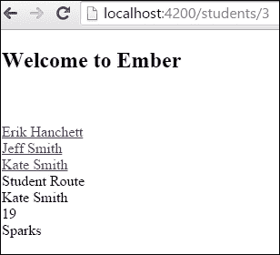
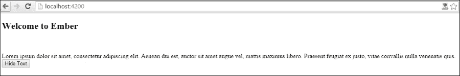
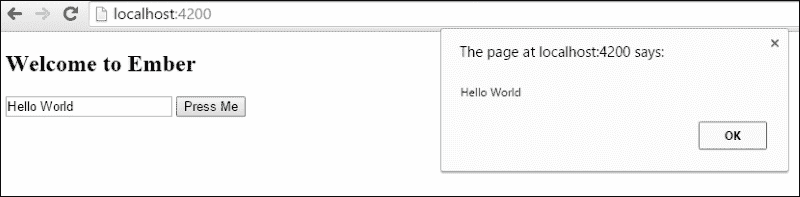

# 第三章. Ember 模板

在本章中，我们将涵盖以下菜谱：

+   定义应用程序模板

+   在模板中使用条件

+   显示项目列表

+   使用元素属性和类绑定

+   在模板内部处理 HTML 链接

+   处理 HTML 动作

+   使用模板输入助手

+   使用开发助手

# 简介

Ember 应用程序使用模板引擎向用户显示 HTML 和动态内容。在 Ember 中，这是通过 Handlebars 模板库完成的。这个库将 Handlebars 表达式渲染到屏幕上，使用数据绑定。

**HTMLbars** 是 Ember 使用的 Handlebars 的一个变体。它具有更好的性能，并以更有效的方式处理构建 DOM。请注意，在本章中，我们将将 HTMLbars 和 Handlebars 互换使用，因为它们本质上做的是同一件事。

在本章中，我们将介绍如何在我们的应用程序中使用模板。

# 定义应用程序模板

要与模板一起工作，我们需要了解属性如何与控制器和组件绑定的一些基础知识。以下是一些介绍如何完成此操作的菜谱。

## 准备工作

在我们开始之前，我们需要生成一个模板。

1.  我们首先将使用 Ember CLI 创建一个新的应用程序：

    ```js
    $ ember new HelloWorldApp
    $ cd HelloWorldApp

    ```

    此命令将生成一个我们可以用于此菜谱的新应用程序。

1.  接下来，创建一个新的路由，用于添加一个新的模板：

    ```js
    $ ember g route helloworld

    ```

    此命令将生成模板和路由文件以及单元测试。模板文件名为 `helloworld.hbs`，将在 `app/templates` 文件夹中生成。路由文件名为 `helloworld.js`，位于 `app/routes` 文件夹中。`route.js` 文件也将被修改以包含新的 `helloworld` 路由。我们将在第四章（Chapter 4）中更详细地讨论路由，*Ember Router*。

1.  然后，我们需要生成一个 `controller`：

    ```js
    $ ember g controller helloworld

    ```

    这将在 `app/controller` 文件夹中生成一个名为 `helloworld.js` 的新文件，并在 `tests/unit/controllers` 中生成一个单元测试。我们现在可以继续了。

## 如何操作...

让我们看看如何向我们的新模板文件添加属性。

1.  首先，编辑 `helloworld.hbs` 文件。对于这个简单的例子，我们将创建一个包含姓氏和名字属性的字符串，如下所示：

    ```js
    // app/templates/helloworld.hbs
    Hello World! My name is {{firstName}} {{lastName}}.
    {{outlet}}
    ```

    Handlebar 表达式被双大括号 `{{ }}` 包围，并有一个上下文。上下文是一个对象，Handlebar 表达式从中读取其属性。在这个例子中，上下文是控制器。`{{outlet}}` 将渲染任何嵌套路由的模板，这将在稍后更详细地讨论。

1.  控制器需要具有 `firstName` 和 `lastName` 属性，以便它们可以在模板中显示：

    ```js
    // app/controllers/helloworld.js
    import Ember from 'ember';

    export default Ember.Controller.extend({
        firstName: 'Erik',
        lastName: 'Hanchett'
    });
    ```

    控制器的名称与模板相同。按照惯例，模板将从同名的控制器中检索属性。它们彼此绑定。如果数据有任何变化，其他值也会变化。

### 使用带有组件的模板

与控制器类似，我们可以创建一个可以作为模板上下文的组件。在组件中，我们可以设置模板稍后可以访问的属性。

1.  要创建一个新的组件，使用`generate component`命令：

    ```js
    $ ember g component hello-world

    ```

    所有组件的名称都必须包含一个连字符。此命令将在`app/components/hello-world.js`文件夹中创建`hello-world.js`文件，在`app/components/hello-world.hbs`文件中创建一个模板文件，并在`tests/integration/components/hello-world-test.js`中创建一个集成测试文件。

1.  编辑`hello-world.hbs`文件并添加 hello world 字符串：

    ```js
    // app/templates/components/hello-world.hbs
    Hello World! My name is {{firstName}} {{lastName}}.
    {{yield}}
    ```

    `firstName`和`lastName`参数是从组件中检索的。当组件以块形式存在时，使用`yield`表达式。我们将在第六章*Ember 组件*中更多地讨论这一点。

1.  向组件文件`hello-world.js`添加两个属性，第一个是`firstName`，最后一个是`lastName`：

    ```js
    // components/hello-world.js
    import Ember from 'ember';

    export default Ember.Component.extend({
        firstName: 'John',
        lastName: 'Smith'
    });
    ```

1.  对于最后一部分，我们只需要将刚刚创建的组件添加到我们的`application.hbs`文件之一：

    ```js
    // app/templates/application.hbs
    <h2 id="title">Welcome to Ember</h2>

    {{hello-world}}
    {{outlet}}
    ```

    `{{hello-world}}` Handlebars 表达式将组件添加到`application.hbs`文件中。然后`hello-world`模板将在这里渲染。`{{outlet}}`模板将渲染`application`路由下的嵌套路由。

1.  启动 Ember 服务器并导航到`http://localhost:4200`。

1.  在 Ember 服务器启动后，在本地主机 4200 端口打开一个网页浏览器。屏幕上的消息将显示**Hello World! My name is John Smith**。

1.  导航到`http://localhost:4200/helloworld`，你会看到两条消息。屏幕上的消息将显示**Hello World! My name is John Smith**。**Hello World! My name is Erik Hanchett**。

1.  当`helloworld`路由被加载时，应用程序模板会显示。然后`{{outlet}}`模板会使用`helloworld`模板文件的內容进行渲染。这就是为什么两个消息都会显示。记住，所有路由都嵌套在`application`路由下。

## 它是如何工作的...

Ember.js 使用 Handlebars 模板库。这个库为你提供了一种在组件或控制器（也称为上下文）和模板之间进行数据绑定的方式。这种数据绑定是双向的。换句话说，组件或控制器中的数据变化将在模板中反映出来。模板中数据的变化将在控制器或组件中反映出来。

在前面的简单示例中，组件中的`firstName`和`lastName`属性在模板中通过双大括号`{{}}`进行访问。这被称为 Handlebars 表达式。模板只是普通的 HTML，其中嵌入了 Handlebar 表达式。Ember 在构建过程中稍后编译这些模板。

# 在模板中使用条件

使用条件是使用 Ember 模板引擎的基本方法。在下面的菜谱中，我们将查看条件以及它们如何与模板一起工作。

## 如何做到这一点...

让我们看看一个简单的示例，该示例在某个属性为真时显示文本。

1.  创建一个新的项目并生成一个名为`conditional`的新控制器。在`application`文件夹的根目录下运行此命令以创建`controller`和`template`：

    ```js
    $ ember g controller conditional
    $ ember g template conditional

    ```

    这将创建条件控制器。

1.  在`router.js`文件中更新新的`conditional`路由：

    ```js
    // app/router.js
    …
    Router.map(function() {
      this.route('conditional');
    });
    ```

    这将添加一个新的`conditional`路由。要使用 Ember 服务器访问此路由，请打开网页浏览器并导航到`http://localhost:4200/conditional`。

1.  使用`isHomeworkDone`属性更新`conditional`控制器：

    ```js
    // app/controllers/conditional.js
    import Ember from 'ember';

    export default Ember.Controller.extend({
        isHomeworkDone: true});
    ```

    这将创建一个新的`isHomeworkDone`属性并将其默认设置为`true`。

1.  更新条件模板，使其在`isHomeworkDone`是`true`时显示一条消息，如果不是则显示另一条消息：

    ```js
    // app/templates/conditional.hbs
    Hello!
    {{#if isHomeworkDone}}
     Thanks for finishing the homework!
    {{else}}
     Please finish the homework
    {{/if}}
    ```

    ### 注意

    `{{if}}`语句是一个助手，必须像任何其他 Handlebar 表达式一样被大括号`{{}}`包围。它以一个`#`符号开始，表示它是一种块调用形式。`{{/if}}`语句关闭该语句。

    之前的示例显示了两种语句，`{{if}}`和`{{else}}`，都是块形式。只有为真的语句将被显示。

1.  如我们从早期的控制器中知道的那样，如果`isHomeworkDone`是`true`，则在模板渲染后，将显示语句`Thanks for finishing the homework!`。另一方面，如果`isHomeworkDone`是`false`，则将显示语句`Please finish the homework`。

1.  要测试此示例，请导航到`http://localhost:4200/conditional`路由。`application.hbs`中的`{{outlet}}`将渲染其内部的`conditional`模板。

### 使用模板与内联调用

内联调用可用于使用`if`语句在一行代码中显示数据。

1.  我们将使用内联调用重新创建前面的示例。使用内联调用在`app/templates`文件夹中的`condtional.hbs`文件中编辑`router.js`文件，使用新的`if`语句：

    ```js
    // app/templates/conditional.hbs
    Hello

    {{if isHomeworkDone 'Thanks for finishing the homework!' 'Please finish the homework'}}
    ```

1.  当使用内联调用时，您不需要使用井号`#`或使用`{{/if}}`结束`if`块。一切都可以在一个表达式中写出来。

1.  在`isHomeworkDone`之后，助手的第一个参数`Thanks for finishing` `the homework!`只有在`isHomeworkDone`是`true`时才会显示。第二个参数`Please finish the homework`将在`isHomeworkDone`是`false`时显示。

### 在模板中使用嵌套调用

嵌套调用是内联的，这意味着它们返回单个值。它们也可以在内联助手中接受多个嵌套的`if`语句。

1.  在`conditional`控制器中，添加两个名为`isHomeworkDone`和`isChoresDone`的属性：

    ```js
    // app/controllers/conditional.js
    import Ember from 'ember';

    export default Ember.Controller.extend({
      isHomeworkDone: true,
      isChoresDone: true});
    ```

    这两个都默认为`true`。

1.  让我们使用嵌套调用只显示一个消息，如果`isHomeworkDone`和`isChoresDone`都是`true`。用新的嵌套`if`语句编辑`condtional.hbs`文件：

    ```js
    // app/templates/conditional.hbs
    Hello

    {{if isHomeworkDone (if isChoresDone 'Thanks for finishing the homework!' )}}
    ```

    `谢谢完成作业`字符串只有在`isChoresDone`和`isHomeworkDone`都是`true`时才会显示。否则，不会显示任何内容。由于控制器将这两个值都设置为`true`，在模板渲染后，将显示**谢谢完成作业！**。

### 与`if`相反的是`unless`

另一个有用的助手是`unless`。它正好与`if`助手相反。它可以与所有三种调用方式一起工作——内联、块和嵌套。

我们将在`conditional.hbs`文件中创建一个`unless`块，如果它在我们不是真的，将显示一个字符串：

```js
// app/templates/conditional.hbs
Hello

{{#unless isHomeworkDone}}
  Please finish the homework
{{else}}
  Thanks for finishing the homework!
{{/unless}}
```

在这个块中，如果`isHomeworkDone`是`false`，`unless`助手将显示`请完成作业`。另一方面，如果`isHomeworkDone`是`true`，将显示消息`谢谢完成作业！`。这本质上与`if`助手相反。

在这个例子中，假设`isHomeworkDone`是`true`，在模板渲染后，将显示字符串`谢谢完成作业！`。

## 它是如何工作的...

`if`和`unless`条件是内置助手，它们由 Handlebars 模板引擎提供给我们。它们被大括号`{{}}`包围，这告诉 Handlebars 解释它们。`{{if}}`语句检查属性是否为`true`。JavaScript 值如`undefined`、`null`、`''`、`[]`和数字`0`将返回为`false`。

这些条件助手可以通过三种不同的方式被调用——块、嵌套或内联。所有三种都会与`if`和`unless`助手一起工作。

# 显示物品列表

通常，你会有一个需要迭代的物品列表。我们可以使用`each`助手遍历这些项目。这个配方将介绍如何做到这一点。

## 如何做到这一点...

假设我们有一个学生列表，并想在模板中显示它们。我们将使用`each`助手来完成这项工作。

1.  在一个新项目中，生成`student``controller`和`template`：

    ```js
    $ ember g template student
    $ ember g controller student

    ```

    这将创建我们示例所需的必要文件。

1.  使用新的`student`路由更新`router.js`文件：

    ```js
    // app/router.js
    …
    Router.map(function() {
      this.route('student');
    });
    ```

    这将添加一个新的`conditional`路由。要使用 Ember 服务器访问此路由，请打开网络浏览器并导航到`http://localhost:4200/student`。

1.  将学生控制器更新为具有`students`数组属性：

    ```js
    // app/controllers/students.js
    import Ember from 'ember';

    export default Ember.Controller.extend({
      students: [ {name: 'Erik'}, {name: 'Jim'}, {name: 'Jane'}]
    });
    ```

    这个数组有三个学生对象。

1.  在我们的`student.hbs`模板中，我们将使用`each`助手遍历`students`数组：

    ```js
    // app/templates/student.hbs

    {{#each students as |student|}}
      {{student.name}}<br>
    {{/each}}
    ```

    `each`辅助函数的第一个参数是要迭代的数组。在这种情况下，这是在`student`控制器中声明的`students`数组。`|student|`块`param`是我们将用于遍历数组的内容。

    `each`辅助函数必须以块形式存在。在这个例子中，学生的每个值都会显示，并在其后使用 HTML 换行符。

1.  渲染后的输出将如下所示：

    ```js
    Erik<br>
    Jim<br>
    Jane<br>
    ```

    如果数组意外为空，可以使用`{{else}}`。

1.  向模板添加一个新的数组。这个数组可以是空的，甚至可能不存在：

    ```js
    // app/templates/student.hbs

    {{#each emptyArray as |item|}}
      {{item}}
    {{else}}
      Empty Array
    {{/each}}
    ```

    只有当数组为空或不存在时，才会渲染`else`块。

### 查找数组的索引

如果需要，你还可以在第二个块`param`中访问数组的`index`。

1.  创建一个新的数组并添加`index`块`param`：

    ```js
    // app/templates/student.hbs

    {{#each students as |student index|}}
    Student {{student.name}} is at index {{index}}<br>
    {{/each}}
    ```

    在每次迭代后，使用 HTML 换行元素显示`name`和`index`。索引可以通过双大括号`{{index}}`访问。

1.  假设我们正在使用本章前面提到的相同的学生数组，渲染的输出将如下所示：

    ```js
    Student Erik is at index 0<br>
    Student Jim is at index 1<br>
    Student Jane is at index 2<br>
    ```

    请记住，`index`从`0`开始，而不是`1`。

## 它是如何工作的...

`each`辅助函数使用块参数来遍历数组。`each`辅助函数接受一个数组参数，而`block param`用于遍历列表中的每个单独的项目。如果数组不存在或为空，可以使用`else`来显示一条消息。

在本章的食谱中，`students`数组在`controller`中声明。它有几个学生对象，可以通过模板访问。模板使用了这个数组，并使用`each`辅助函数遍历它。

# 使用元素属性和类绑定

HTMLBars 的一个非常有用的功能是将元素绑定到你的 HTML 属性中。

## 如何做...

一个非常简单的例子是将元素绑定到`img src`标签。

1.  在一个新项目中，生成`index template`和`index controller`：

    ```js
    $ ember g template index
    $ ember g controller index

    ```

    这将生成此示例所需的文件。

1.  创建一个新的`index controller`文件，其属性为`url`、`sideClass`和`secondClass`：

    ```js
    // app/controllers/index.js
    import Ember from 'ember';
    export default Ember.Controller.extend({
      url: 'http://placehold.it/350x200',
      sideClass: 'cc',
      secondClass: 'dd'

    });
    ```

    我们可以获取`index`路由和控制器，而无需为它们创建特定的路由。它的工作方式与应用程序路由相同，所有其他路由都继承自该路由。

1.  创建一个新的模板并添加一个`img`标签。将显示`url`元素：

    ```js
    // app/templates/index.hbs

    
    ```

    这将像`url`属性在`img`标签的`src`属性中一样被渲染。

1.  模板将使用`url`属性如下渲染：

    ```js
    
    ```

    我们基本上可以将这个添加到我们喜欢的任何标签中。

1.  让我们在模板中创建一个`div`标签，并添加一些用于类的属性：

    ```js
    // app/templates/index.hbs

    <div id="side" class="{{sideClass}} {{secondClass}}">Info</div>
    ```

    `sideClass`和`secondClass`都将添加到类属性中。由于这些属性被绑定，它们就像 Ember 中的任何其他属性一样。它们可以动态更改，并且模板将相应地渲染。

    ### 小贴士

    **内容安全策略**

    在运行本书中的示例时，你可能会偶尔在控制台中看到关于内容安全违规的消息。它们通常会以大红色文本出现在你的控制台中。Ember 团队这样做是为了帮助提醒开发者你的应用程序可能存在的潜在安全问题。对于本书的目的，这些警告可以忽略。另一方面，你可以通过编辑 `config/environment.js` 文件和 `contentSecurityPolicy` 部分来修复这些警告。你可以在 [`content-security-policy.com/`](http://content-security-policy.com/) 找到关于内容安全如何工作的示例。

## 它是如何工作的...

通过 HTMLBars 模板库在属性中绑定元素，该库基于 Handlebars 库。它查看每个具有属性的属性，并在屏幕上渲染它。这些属性绑定到可以在控制器或组件中访问的属性。

我们可以将任何属性绑定到任何属性上。唯一的例外是视图辅助函数。我们将在本章的稍后部分讨论这个问题。

# 在模板内处理 HTML 链接

Ember.js 提供的最有用的辅助函数之一是 `link-to` 辅助函数。我们将讨论如何在本次食谱中使用这个有用的功能。

## 如何做到...

`link-to` 辅助函数用于导航 Ember 应用程序。第一个参数始终是路由的名称。第二个是动态段。我们将在稍后讨论动态段。

使用 `link-to` 辅助函数的最简单方法之一是将其内联使用。

1.  创建一个新的学生应用程序和路由。在 `project` 目录的根目录下运行此命令：

    ```js
    $ ember g route students

    ```

    Ember CLI 将生成一个名为 `students` 的新路由。这将更新 `router.js` 文件以及添加模板和路由文件。

1.  在 `app/templates` 文件夹中打开 `students.hbs` 文件，并向其中添加此字符串：

    ```js
    // app/templates/students.hbs
    Hi from the students route
    {{outlet}}
    ```

    在导航到 `students` 路由后，将显示此消息。

1.  打开 `application.hbs` 文件。让我们添加一个 `link-to` 辅助函数：

    ```js
    // app/templates/application.hbs
    {{#link-to 'students'}}Students{{/link-to}}<br>
    {{outlet}}
    ```

    `link-to` 辅助函数的第一个参数是 `students`。这是我们之前创建的 `students` 路由。这将渲染一个名为 `Students` 的 HTML 超链接，链接到 `students` 路由。`{{outlet}}` 告诉 Handlebars 模板库在哪里渲染路由的输出。

1.  `link-to` 的输出将显示一个 HTML 链接。当点击此链接时，它将显示我们在 `students.hbs` 文件中创建的 `students` 路由消息。这是由 `{{outlet}}` 渲染的：

    ```js
    Students
    Hi from the students route
    ```

    `Students` 是指向路由 `/students` 的超链接。

    Ember.js 足够智能，可以记住点击链接后的历史记录。因此，如果用户不小心在网页浏览器上点击后退，它将返回到上一个路由。

1.  如果需要，你可以通过向 `link-to` 辅助函数添加 `replace=true` 选项来覆盖此行为：

    ```js
    // app/templates/application.hbs
    {{#link-to 'students' replace=true}}Students{{/link-to}}<br>
    {{outlet}}
    ```

    ### 小贴士

    **向视图辅助函数添加数据属性**

    很不幸，像 `link-to` 和 `input` 这样的数据视图助手不允许自定义数据属性。换句话说，如果你正在使用 `link-to`，你不能在 `link-to` 助手末尾添加 `data-toggle='dropdown'`。然而，正常的属性如 `class` 将会工作。

    添加自定义属性的一种方法是为 `link-to` 或 `input` 助手重新打开 `Ember.LinkComponent` 或 `Ember.TextField`。在 第二章 中讨论了重新打开类，*The Ember.Object Model*，所以首先查看那里。重新打开类后，你可以添加一个 `attributeBindings` 属性数组。数组中的每个元素都是你希望对 `link-to` 或 `input` 助手可用的数据属性。例如，要将 `data-toggle` 作为属性添加到你的 `link-to` 助手，它将看起来像 `attributeBindings: ['data-toggle']`。我们将在下一节中讨论更多关于 `input` 助手的内容。

    或者，你可以创建一个从 `LinkComponent` 扩展而来的组件，而不是普通的简单组件。然后你可以向它添加属性。确保不要将其命名为 `link-to`。

### 使用带有动态段落的 `link-to` 助手

可以使用 `link-to` 助手来链接动态段。动态段被添加到 `link-to` 助手的第二个参数中。在这个菜谱中，我们将创建一个带有动态段的 `students` 路由。

1.  从项目根目录运行此命令以创建 `students` 的 `resource`：

    ```js
    $ ember g resource students

    ```

    这将创建我们新的 `students` 路由所需的所有模型、路由和模板。

1.  接下来，我们需要更新 `router.js` 文件并添加一个简单的动态段：

    ```js
    // app/router.js
    import Ember from 'ember';
    import config from './config/environment';

    var Router = Ember.Router.extend({
      location: config.locationType
    });

    Router.map(function() {
      this.route('students',{path: '/students/:student_id'});
    });

    export default Router;
    ```

    在这里需要意识到最重要的是路径。这被称为动态段，由 :`student_id` 表示。按照惯例，`students` 路由将从学生模型中检索信息。如果用户导航到 `/students/5`，路由将检索具有 ID 为 5 的学生模型。更多关于动态段和路由的信息，请参阅 第四章，*Ember Router*。

1.  在 `app/routes` 文件夹中创建一个新的 `application.js` 文件。为了简单起见，我们将让应用程序路由返回一个学生对象的数组，我们可以在模板中检索它：

    ```js
    // app/routes/application.js

    import Ember from 'ember';

    export default Ember.Route.extend({
      model(){
        return [{id: 1,name: 'Erik Hanchett', age: 16, location: 'Reno'},{id: 2,name: 'Jeff Smith', age: 17, location: 'San Francisco'},{id: 3,name: 'Kate Smith',age: 19, location: 'Sparks'}];
      }
    });
    ```

    `application` 路由位于顶部，并且所有其他路由都会继承它。在这个例子中，我们返回了一个具有多个属性的对象列表。这个模型将能够在我们的学生模板中访问。

1.  更新 `app/templates` 文件夹中的学生模板：

    ```js
    // app/templates/students.hbs
    Student Route<br>
    {{model.name}}<br>
    {{model.age}}<br>
    {{model.location}}<br>
    ```

    这个模板将显示传递给它的模型中的 `name`、`age` 和 `location`。确保所有值都以前缀 `model` 开头。

1.  然后，我们将更新 `application.hbs` 文件，使用 `{{each}}` 助手和 `link-to`：

    ```js
    // app/templates/application.hbs
    <h2 id="title">Welcome to Ember</h2><br>
    <br>
    {{#each model as |student|}}
      {{#link-to 'students' student}}{{student.name}}{{/link-to}} <br>
    {{/each}}
    {{outlet}}
    <br>
    <br>
    ```

    在这个例子中，我们有一个 `each` 助手，它遍历模型。`link-to` 助手有两个参数。第一个是路由，即 `students`。第二个是动态段，`student`。Ember 会将每个段替换为对应对象 ID 属性值。如果由于某种原因没有模型存在，您可以显式设置该值：

    ```js
    {{#link-to 'students' 1}}Some Student{{/link-to}}
    ```

    这将链接学生的路由与具有 ID 为 `1` 的动态段。

    ### 小贴士

    **多个段**

    可能会有嵌套多个段的路由。例如，一个博客可能有博客文章，每篇博客文章可能有评论。在这种情况下，您可以在 `link-to` 助手中指定多个段。您只需用空格将它们分开。例如，一个有多个评论的博客可能看起来像 `{{#link-to 'blog.comment' 1 comment}}Comment{{/link-to}}`。`1` 是第一个动态段，comment 是第二个动态段。

1.  渲染后，将显示三个链接，如下所示：

    ```js
    <a href="/students/1">Erik Hanchett</a>
    <a href="/students/2">Jeff Smith</a>
    <a href="/students/3">Kate Smith</a>
    ```

1.  点击任何链接将导航到具有该 ID 的学生路线。模板随后将在屏幕上显示学生的信息如下：

## 它是如何工作的...

`link-to` 助手由模板引擎用于在整个应用程序中路由客户。它仅用于内部链接，不用于外部链接。

`link-to` 助手接受两个或更多参数。第一个是路由的名称。第二个用于动态段。

# 处理 HTML 动作

通常，在应用程序中，我们需要允许与影响应用程序状态的控件进行交互。为了实现这一点，我们将使用动作。

## 如何实现...

`{{action}}` 助手用于 HTML 元素，当用户点击元素时，将动作发送回模板对应的控制器或组件。让我们看看这个例子。

1.  创建一个新的项目，导航到 `application` 目录的根目录，并输入以下命令以生成一个新的组件：

    ```js
    $ ember g component action-component

    ```

    请记住，所有组件的名称都必须包含一个连字符。这将生成组件模板、JavaScript 文件和测试文件。

1.  编辑 `components` 文件夹中的 `action-component.js` 文件。我们将添加动作 `toggleText`：

    ```js
    // app/components/action-component.js
    import Ember from 'ember';

    export default Ember.Component.extend({
      showText: true,
      actions: {
        toggleText(){
          this.toggleProperty('showText');
        }
      }
    });
    ```

    在这个例子中，我们有一个默认为 `true` 的 `showText` 属性。当触发动作 `toggleText` 时，它会切换 `showText` 属性。`toggleProperty` 方法设置其当前属性的相反值。

1.  `toggleText` 动作现在可以添加到模板中。下一步是将动作添加到组件模板中，使用 `{{action}}` 助手：

    ```js
    // app/templates/components/action-component.hbs
    {{#if showText}}
    Lorem ipsum dolor sit amet, consectetur adipiscing elit. Aenean dui est, auctor sit amet augue vel, mattis maximus libero. Praesent feugiat ex justo, vitae convallis nulla venenatis quis.
    {{/if}}<br>
    <button {{action 'toggleText'}}>{{if showText 'Hide Text' 'Show Text'}}</button>
    {{yield}}
    ```

    `if`辅助工具仅在`showText`属性为`true`时显示文本。底部的按钮有一个名为`toggleText`的动作附加到它上。每次按下此按钮时，相应的`action-component`组件将调用`toggleText`动作。为了保持清晰，按钮文本将显示为`Hide Text`（如果文本显示）和`Show Text`（如果文本隐藏）。

    `action`辅助工具可以添加到任何 HTML 元素上。一旦元素被点击，动作就会被触发。

1.  好知道你可以将动作附加到任何 HTML 元素上，但并非所有元素都会响应。某些浏览器可能会忽略点击事件。在这种情况下，你可以使用这个`css`技巧作为解决方案：

    ```js
    [data-ember-action] {
      cursor: pointer;
    }
    ```

    ### 小贴士

    **指定事件类型**

    默认情况下，所有动作都会监听点击事件。当点击发生时，该动作将在上下文、组件或控制器中触发。你可以使用`on`选项指定替代点击事件。例如，一个具有双击动作的按钮将看起来像`<button {{action 'toggleText' on='doubleClick'}}Show Text</button>`。所有事件名称在分配给`on`时必须为驼峰式和小写。

1.  现在，我们需要将组件添加到`application`模板文件中，以便它可以显示：

    ```js
    // app/templates/application.hbs
    <h2 id="title">Welcome to Ember</h2>
    <br>
    <br>
    {{action-component}}
    {{outlet}}
    <br>
    ```

    这将把我们的动作组件添加到我们的`application`模板中。

1.  在使用 Ember 服务器加载应用程序后，它将看起来如下所示：

    按下`Hide Text`按钮将隐藏文本。再次按下它将显示文本。

    ### 小贴士

    **允许修改键**

    默认情况下，`action`辅助工具会在同时按下修改键（如*Alt*或*Ctrl*）时忽略点击事件。如果需要，你可以指定一个`allowedKeys`选项。例如，一个允许键*Alt*的按钮将看起来像`<button {{action 'toggleText' allowedKeys='alt'}}Show Text</button>`。

### 向动作事件添加参数

你可以在动作处理程序中添加参数，这些参数将被传递回上下文。`action`辅助工具的动作名称之后的所有内容都将作为参数传递给组件或控制器。

1.  首先，我们将创建一个新的组件。在项目创建后，在`project`文件夹的根目录下运行此命令：

    ```js
    $ ember g component param-component

    ```

    这将生成我们新的`param-component`所需的组件文件。

1.  编辑`param-component.js`文件并添加一个名为`pressed`的新动作：

    ```js
    // app/components/param-component.js
    import Ember from 'ember';

    export default Ember.Component.extend({
      actions: {
        pressed(text){
          alert(text);
        }
      }
    });
    ```

    在这个简单的示例中，`pressed`动作只有一个参数。当动作被触发时，将显示一个带有传入参数文本的`alert`框。

1.  下一步是编辑模板并添加动作：

    ```js
    // app/templates/components/param-component.hbs
    {{input text='text' value=hello}}
    <button {{action 'pressed' hello}}>Press Me</button>
    {{yield}}
    ```

    在这个模板中，我们有一个`input`辅助工具。`input`辅助工具将在*使用模板输入辅助工具*菜谱中更详细地讨论。按钮点击会触发`pressed`动作，并将输入辅助工具中的`hello`文本传递给动作。

    ### 注意

    **允许默认浏览器动作**

    默认情况下，动作辅助工具会阻止 DOM 事件的默认浏览器行为。换句话说，当用户点击可能否则会重新加载页面的链接或按钮时，Ember 会阻止这种行为。如果需要，您可以使用`preventDefault=false`来关闭此行为。例如，我们可以向链接添加一个动作事件，并将其重定向到页面，同时触发一个事件`<a href="thispage.htm" {{action 'pressed' preventDefault=false}}>按我</a>`。

1.  下一步是将`param-component`添加到应用程序中：

    ```js
    // app/templates/application.hbs
    <h2 id="title">Welcome to Ember</h2>
    <br>
    <br>
    {{param-component}}

    {{outlet}}
    <br>
    ```

    在此代码中，我们向`application`模板添加了`param-component`。

1.  启动服务器后，将显示一个文本框。按下**按我**按钮将在弹出的警告框中显示文本。它应该如下所示：

1.  在某些情况下，我们可能不会使用`input`辅助工具。假设我们想要一个动作事件触发`onblur`。我们可以在`action`辅助工具中指定一个`value`选项：

    ```js
    // app/templates/components/param-component.hbs
    <input type="text" value={{hello}} onblur={{action 'pressed' value='target.value'}} />
    ```

    输入`text`字段具有等于`hello`属性的`value`。每当元素失去焦点时，都会引发`onblur`事件。默认情况下，动作处理程序接收事件监听器的第一个参数。在这种情况下，它将是`Event {}`。我们必须指定`value`选项来指定目标值，使用`target.value`。

由于 Ember 绑定值的方式，我们无法简单地只发送`hello`属性作为参数到动作。这就是为什么我们必须使用`value`选项。

您可以通过在文本框中输入文本并点击框外使其失去焦点来测试这一点，以便在弹出的警告框中显示正确的文本。

## 它是如何工作的...

`action`辅助工具附着到 HTML 元素上，以便允许用户交互。它向模板的相应上下文、组件或控制器发送命名事件。

默认情况下，`action`辅助工具会发送事件监听器的第一个参数。您可以在`action`事件之后发送任何您想要的参数。如果需要，您可以指定`value`选项并使用`value.target`，这将发送事件的目标。

# 使用模板输入辅助工具

要创建常见的表单控件，可以使用`input`辅助工具。本食谱将介绍如何在我们的 Ember 应用程序中使用它们。

## 如何操作...

最常见的`input`辅助工具是`{{input}}`。它围绕`Ember.TextField`视图，几乎与传统的`<input>`HTML 元素相同。

1.  创建一个新的项目。在`app/templates`文件夹中，打开`application.hbs`文件并添加一个`input`辅助工具：

    ```js
    // app/templates/application.hbs
    <h2 id="title">Welcome to Ember</h2>
    <br>
    <br>
    {{input value='Hello World'}}
    ```

    这个`input`辅助工具非常简单；它所做的只是将文本框的值设置为`hello world`。它被双大括号包围，并支持正常的输入属性。

1.  当渲染时，它将如下所示：

    ```js
    <h2 id="title">Welcome to Ember</h2>
    <br>
    <br>
    <input type="text" value="Hello World"/>
    ```

    如果需要，我们可以将属性分配给`input`辅助工具。

1.  创建一个新的`application`控制器。在根`application`文件夹中运行此命令：

    ```js
    $ ember g controller application

    ```

    这将生成一个应用程序可以访问的新控制器。

1.  打开控制器并添加一个新属性。我们将称之为 `helloText`：

    ```js
    // app/controllers/application.js
    import Ember from 'ember';

    export default Ember.Controller.extend({
        helloText: 'Hello World'
    });
    ```

1.  再次编辑 `application.hbs` 文件并将 `value` 设置为属性：

    ```js
    // app/templates/application.hbs
    <h2 id="title">Welcome to Ember</h2>
    <br>
    <br>
    {{input value=helloText}}
    ```

    `helloText` 属性现在绑定到输入值。具有引号值的属性将直接设置到元素。如果未加引号，则这些值将绑定到模板当前渲染上下文上的属性。在这种情况下，这是控制器。

1.  让我们在 `input` 辅助器中添加一个简单的动作。这可以通过将破折号化的事件名称作为属性添加到 `input` 辅助器来完成：

    ```js
    // app/templates/application.hbs
    <h2 id="title">Welcome to Ember</h2>
    <br>
    <br>
    {{input value=helloText key-press='pressed'}}
    ```

    每当按下键时，组件或控制器中的 `pressed` 动作将被触发。

1.  由于我们没有创建按键事件，我们将将其添加到我们的控制器中：

    ```js
    // app/controllers/application.js
    …
      actions: {
        pressed(){
          console.log('pressed');
        }
      }
    ```

    每当在文本框中按下键时，都会将一条消息记录到控制台。

### 如何使用复选框辅助器

在上一个示例中，我们创建了一个简单的输入文本框。我们也可以以相同的方式创建复选框。这使用了 `Ember.Checkbox` 视图。

1.  在一个新项目中，打开 `app/templates` 文件夹中的 `application.hbs` 文件。让我们添加一个新的复选框：

    ```js
    // app/templates/application.hbs
    <h2 id="title">Welcome to Ember</h2>
    <br>
    <br>
    {{input type='checkbox' checked=isChecked}}
    ```

    这与输入文本框非常相似。

1.  生成 `application` 控制器。这将用于存储我们的 `isChecked` 属性：

    ```js
    $ ember g controller application

    ```

1.  使用新的 `isChecked` 属性更新控制器。将其设置为 `true`：

    ```js
    // app/controllers/application.js
    import Ember from 'ember';

    export default Ember.Controller.extend({
        isChecked: true
    });
    ```

    此控制器只有一个布尔属性，`isChecked`。

1.  `isChecked` 属性绑定到复选框。渲染后，它应该看起来如下：

    ```js
    …
    <input type="checkbox" checked="true"/>
    ```

### 如何使用文本区域

要创建 `textarea` 元素，我们可以使用 `textarea` 辅助器。这会包装 `Ember.TextArea` 视图。

创建一个新的项目并编辑 `app/templates` 文件夹中的 `application.hbs` 文件。添加一个 `textarea` 辅助器：

```js
// app/templates/application.hbs
<h2 id="title">Welcome to Ember</h2>
<br>
<br>
{{textarea value='hello world' cols='20' rows='10'}}
```

文本区域框将显示为 `20` 列和 `10` 行。渲染后看起来如下：

```js
…
<textarea rows="6" cols="80">Hello World</textarea>
```

添加动作和属性的方式与 `input` 和 `checkbox` 辅助器相同。

## 它是如何工作的...

输入、文本区域和复选框都是辅助器，使处理常见的表单控件变得更加容易。它们围绕 `Ember.TextField`、`Ember.Checkbox` 和 `Ember.TextArea` 包装。

使用这些辅助器，我们可以轻松地将元素和动作绑定到它们。

# 使用开发辅助器

调试模板是一项你经常会使用的任务。以下是执行此操作的步骤。

## 如何做到这一点...

调试 Ember 模板最基本的方法是使用 `{{log}}` 和 `{{debugger}}`。

1.  创建一个新的 Ember 应用程序。创建一个名为 `log-example` 的新组件。在根 `application` 文件夹中运行以下命令：

    ```js
    $ ember g component log-example

    ```

    这将创建一个新的组件模板和 JavaScript 文件。

1.  在 `app/components` 文件夹中打开 `log-example.js` 文件并添加一个名为 `helloText` 的新属性：

    ```js
    // app/components/log-example.js
    import Ember from 'ember';

    export default Ember.Component.extend({
        helloText: 'Hello World'
    });
    ```

    这是一个只有一个属性的简单组件。

1.  在 `app/templates/components` 目录中打开 `log-example.hbs` 文件并添加 `log`：

    ```js
    // app/templates/components/log-example.hbs
    {{log 'Hello text is' helloText}}
    ```

    这将在浏览器的控制台窗口中显示一个字符串。

1.  现在，我们可以将这个新组件添加到我们的 `application.hbs` 文件中：

    ```js
    // app/templates/application.hbs
    <h2 id="title">Welcome to Ember</h2>
    <br>
    <br>
    {{log-example}}
    ```

    文本 **Hello text is Hello World** 在渲染后将在控制台显示。

1.  在这个相同的例子中，让我们添加 `{{debugger}}`。编辑 `log-example.hbs` 文件，并将其添加到底部：

    ```js
    // app/templates/components/log-example.hbs
    {{log 'Hello text is' helloText}}
    {{debugger}}
    hi
    ```

    调试器等同于 JavaScript 的 `debugger` 关键字。它将停止代码的执行，并允许检查当前的渲染上下文。

1.  如果我们启动服务器并加载网页，浏览器将在加载过程中暂停在调试语句处。此时，我们可以打开浏览器的控制台窗口，并使用 `get` 函数来查找 `helloText` 的当前值：

    ```js
    > get('helloText')
    > "Hello World"

    ```

    `get` 命令可以检索上下文中的任何值。换句话说，它可以检索组件或控制器中的任何值。如果调试语句在 `{{each}}` 循环中，这也同样适用。

1.  你也可以在控制台调试器中获取视图的上下文：

    ```js
    > context

    ```

    ### 小贴士

    **Ember 检查器**

    Ember 检查器是 Chrome 和 Firefox 网络浏览器的插件。它使得调试和了解你的 Ember 应用变得容易。当你使用此插件时，你可以看到关于你的应用的各种信息，包括路由、模型、模板、控制器和组件。你可以从 Firefox 或 Chrome 插件商店免费下载它。

## 它是如何工作的...

Handlebars 库使得调试模板变得容易。它们是与网络浏览器交互的辅助工具，用于将信息记录到控制台或停止其执行。

Ember 的 `{{debugger}}` 在 JavaScript 中的等效是 `debugger`。它们的工作方式非常相似。
