# 第五章。Ember 控制器

在本章中，我们将介绍以下食谱：

+   存储应用程序属性

+   处理控制器中的动作

+   与转换一起工作

+   管理控制器之间的依赖关系

# 简介

Ember.js 中的控制器与组件类似。它们可以封装代码，处理动作，并具有属性。此外，控制器可以转换到应用程序的不同部分，并从其他控制器检索信息。

在不久的将来，控制器将被组件完全取代。然而，直到这一发生，了解控制器的工作原理是很有帮助的。

# 存储应用程序属性

控制器的一个优点是存储属性。控制器具有存储在应用程序中的属性，这与模型不同，模型中的属性是保存到服务器的。在本食谱中，我们将查看几种不同类型的属性以及它们如何在模板中显示。

## 如何操作...

1.  在新应用程序中，运行以下命令：

    ```js
    $ ember g controller application

    ```

    在这个应用程序中，我们将使用`application controller`来存储所有属性。

1.  更新应用程序控制器以添加新的动作和几个属性：

    ```js
    // app/controllers/application.js
    import Ember from 'ember';

    export default Ember.Controller.extend({
        prop2: 'test',
        prop3: true,
        actions: {
          enter(val){
            alert(this.get('prop1'));
            alert(this.getProperties('prop1','prop2').prop1);
            alert(val);
            this.toggleProperty('prop3');
          }
        }
    });
    ```

    此控制器有两个属性。第一个属性包含一个字符串。第二个具有附加的布尔值`true`。`enter`动作显示几个警告框。让我们更详细地看看`enter`动作：

    ```js
        alert(this.get('prop1'));
        alert(this.getProperties('prop1','prop2').prop1);
        alert(val);
        this.toggleProperty('prop3');
    ```

    当在 Ember 中访问属性时，始终使用`this.get`和`this.set`。这保证了属性将在 Ember 中被正确读取或设置。此外，我们可以使用`this.getProperties`。这允许我们一次性获取多个属性。它返回一个包含这些属性及其值的对象。

    另一个有用的方法是`toggleProperty`。这将取一个布尔值并将其切换。换句话说，`false`的值将变为`true`，反之亦然。

    注意，您不必在控制器定义中声明每个属性。属性可以直接从模板中检索并进行操作。在上面的示例中，`prop1`属性是从模板中检索的。它从未在控制器中定义过。如果需要，您可以设置默认属性值。

1.  更新应用程序的模板。显示属性：

    ```js
    // app/templates/application.hbs
    <h2 id="title">Welcome to Ember</h2>

    {{outlet}}

    <input type='text' value={{prop1}}>One way input<br>
    Property 1:{{prop1}}<br>
    Property 2:{{prop2}}<br>
    {{input type='text'  value=prop1}}Two way input helper<br>
    <button {{action 'enter' prop1}}>Value of prop1</button><br>

    Propert 3:{{prop3}}
    ```

    `prop1`属性绑定到括号输入和`input`辅助工具。默认情况下，括号输入标签是单向的。这意味着当模板渲染时，`prop1`属性是从控制器中检索的。它被复制，并且属性的变化不会反映回控制器。另一方面，`input`辅助工具是双向绑定的。对`input`辅助工具中的值所做的任何更改都会反映在控制器中。

1.  启动 Ember 服务器并更新单向输入中的值：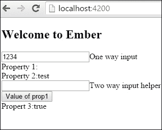

    即使括号输入标签的值设置为`prop1`，它也不会改变模板中其他地方的`{{prop1}}`属性。这是因为值被设置为仅以这种方式工作。在控制器中更改`prop1`值的唯一方法是将它作为从模板发送回控制器的操作。

    这是“数据向下，操作向上”的基础。数据从控制器或组件复制到模板。对其的任何更改都会随后通过操作发送回父组件或控制器。请记住这个概念，因为它在 Ember 中变得越来越流行。

1.  更新双向输入助手框中的值：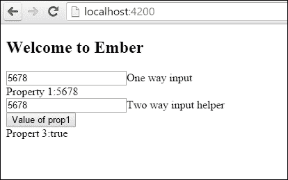

    双向`input`助手更新模板中的所有值，因为它链接回控制器。模板中属性的任何更改都会反映在控制器中，因为它双向绑定。

1.  点击**prop1 的值**按钮：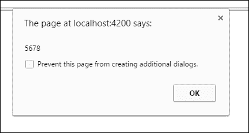

    当按钮被点击时，会触发一个操作。它会显示三个警告框。每个警告框都会显示`prop1`属性。然后它会将第三个布尔属性从`true`切换到`false`。

计算属性或观察者也可以添加到控制器中。要了解更多信息，请查看第二章，*Ember.Object 模型*。

## 它是如何工作的...

控制器可以使用属性向用户显示信息。与模型不同，它们不会被持久化到服务器。然而，它们被持久化在应用程序状态中。当与模板一起工作时，它们可以是单向或双向绑定。

# 在控制器中处理操作

操作对控制器很重要。它们由用户操作触发，可以用来改变应用程序状态。在这个菜谱中，我们将创建四种不同类型的操作，并看看它们如何对不同情况进行反应。

## 如何操作...

1.  在一个新的应用中，生成以下文件：

    ```js
    $ ember g controller application
    $ ember g route application

    ```

    我们将使用`controller`和`application`来存储操作。一些操作会冒泡到`route`，而一些则不会。

1.  更新应用程序控制器并添加三个新操作：

    ```js
    // app/controllers/application.js
    import Ember from 'ember';

    export default Ember.Controller.extend({
        actions: {
          action1(){
            alert('Application controller action action1');
          },
          action2(){
            alert('Application controller action action2');
            return true;
          },
          action3(val){
            alert(`Value Passed: ${val}`);
          }
        }
    });
    ```

    让我们看看每个操作：

    ```js
        action1(){
          alert('Application controller action action1');
        },
    ```

    这是一个正常的操作。它只是显示一个警告框：

    ```js
        action2(){
          alert('Application controller action action2');
          return true;
        },
    ```

    这个操作有点更有趣。默认情况下，如果控制器中存在所有控制器操作，它们会`return false`。通过将值返回到`true`，这个操作将在显示警告框后冒泡到`application`路由。然后路由可以处理这个操作：

    ```js
        action3(val){
          alert(`Value Passed: ${val}`);
        }
    ```

    操作会传递一个值给它。它会在警告框中向用户显示这个值。警告框中的文本正在使用一种称为 ES6 模板字符串的东西。这使得在文本中显示变量变得稍微容易一些。

1.  更新应用程序路由并添加两个更多操作：

    ```js
    // app/routes/application.js
    import Ember from 'ember';

    export default Ember.Route.extend({
        actions: {
          enter(){
            alert('Application route action enter!');
          },
          action2(){
            alert('Application route action action2!');
          }
        }
    });
    ```

    每个动作都会显示一个警告框。你可能已经注意到 `enter` 动作在控制器中不存在。按照惯例，模板 `actions` 首先在控制器中查找。如果动作在控制器中未定义，它将向上冒泡到路由。

1.  向应用程序模板添加四个按钮：

    ```js
    // app/templates/application.hbs
    <h2 id="title">Welcome to Ember</h2>

    <button {{action 'action1'}}>Action 1 in controller</button>
    <button {{action 'action2'}}>Action 2 in controller and route</button>
    <button {{action 'action3' 'Hello World'}}>Action 3 Passing Values</button>
    <button {{action 'enter'}}>Action enter only in route</button>
    ```

    每个 `button` 都绑定了一个 `action`。默认情况下，这是绑定到点击事件；如果需要，可以更改它。

1.  运行 `ember server`。打开网页浏览器查看以下屏幕：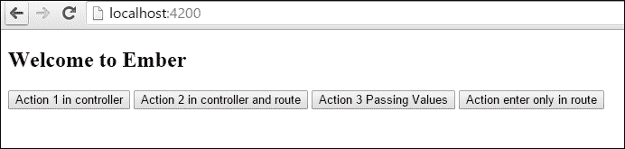

    每个按钮代表不同类型的动作。

1.  点击第一个按钮：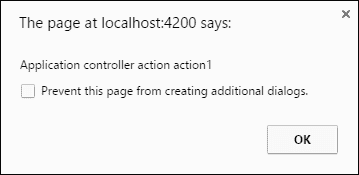

    这显示了控制器中的消息。

1.  点击第二个按钮：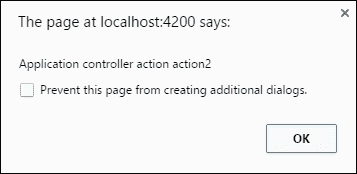

1.  这个警告框首先从控制器中显示：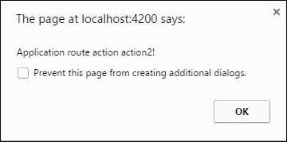

    第二个警告框是从应用程序路由中显示的。

1.  点击第三个动作：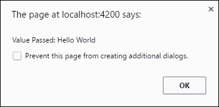

    这显示了带有传递值的控制器消息。

1.  点击最后一个按钮：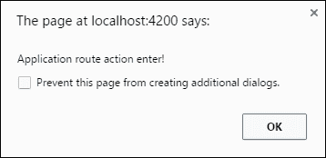

    这将显示应用程序路由中的消息，因为它在控制器中未定义。

## 它是如何工作的...

Ember 中的动作会冒泡，但它们依赖于用户动作。它们从控制器开始，然后移动到路由。我们可以在模板中添加动作并从模板传递值到我们的动作。

# 与过渡一起工作

当在路由内部时，你可以使用控制器过渡到另一个路由。我们将查看如何从一个路由过渡到另一个路由的示例。

## 如何操作...

1.  在一个新应用程序中，生成以下文件：

    ```js
    $ ember g route foo1
    $ ember g route foo2
    $ ember g controller foo1
    $ ember g controller foo2
    $ ember g template index

    ```

    这将为我们生成两个不同的路由——`foo1` 和 `foo2` 路由。每个路由将有一个按钮，可以过渡到另一个路由。每个控制器将处理动作逻辑。

1.  向 foo1 控制器添加一个动作：

    ```js
    // app/controllers/foo1.js
    import Ember from 'ember';

    export default Ember.Controller.extend({
        actions: {
          enter(){
            this.transitionToRoute('foo2');
          }
        }
    });
    ```

    这个控制器有一个名为 `enter` 的动作，它过渡到名为 `foo2` 的路由。`this.transitionToRoute` 方法用于在应用程序中过渡到不同的路由。它接受两个参数。第一个参数是路由的名称。第二个参数是可选的，你可以在其中输入模型。默认情况下，如果添加，它将在 URL 中序列化。

    `trasintionToRoute` 方法可以接受路由路径。例如，你可能有一个名为 `foo2` 的嵌套路由 `foo3`。你可以通过调用 `this.trasitionToRoute('foo2.foo3')` 来过渡到这个路由。

1.  向 foo2 控制器添加一个动作：

    ```js
    // app/controllers/foo2.js
    import Ember from 'ember';

    export default Ember.Controller.extend({
        actions: {
          enter(){
            this.transitionToRoute('foo1');
          }
        }
    });
    ```

    当触发 `enter` 动作时，它将过渡到 `foo1` 路由。

1.  更新 foo1 模板：

    ```js
    // app/templates/foo1.hbs
    This is Foo1<br>

    <button {{action 'enter'}}>Move to route foo2</button>
    ```

    这个 `button` 触发了 `foo1` 控制器中的 `enter` `action`。

1.  更新 foo2 模板：

    ```js
    // app/templates/foo2.hbs
    This is Foo2<br>
    <button {{action 'enter'}}>Move to route foo1</button>
    ```

    这个 `button` 触发了 `foo2` 控制器中的 `enter` `action`。

1.  在索引模板文件中为两个路由添加一个链接：

    ```js
    // app/templates/index.hbs
    {{link-to 'Foo1 Route' 'foo1'}}<br>
    {{link-to 'Foo2 Route' 'foo2'}}<br>
    ```

    这使用非块形式的 `link-to` 辅助函数。第一个参数是显示的名称，第二个是路由的名称。

1.  更新应用模板文件：

    ```js
    // app/templates/application.hbs
    {{#link-to 'application'}}<h2 id="title">Welcome to Ember</h2>{{/link-to}}

    {{outlet}}
    ```

    应用模板文件顶部有一个链接返回到应用。

1.  运行`ember server`，在打开网页浏览器后，你会看到以下屏幕：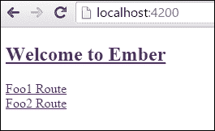

    这显示了每个路由的链接。

1.  点击**Foo1 路由**链接。将显示以下页面：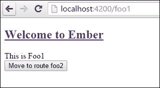

    这显示了 foo1 路由。

1.  点击**Foo2 路由**按钮。将显示以下屏幕：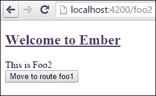

    点击按钮后，显示 foo2 路由。

## 它是如何工作的...

要在应用中导航，我们可以在控制器中使用转换。`trasitionToRoute`方法用于从一个路由转换到另一个路由。它是`Ember.Controller`类的一部分。

# 管理控制器之间的依赖关系

经常，控制器需要访问其他控制器的属性和模型。当你有嵌套资源时，这尤为重要。在这个菜谱中，我们将查看一个需要访问父控制器模型和属性的嵌套控制器。

## 如何操作...

1.  在一个新应用中，生成一些新的路由和模板：

    ```js
    $ ember g route foo1
    $ ember g route foo1/foo2
    $ ember g controller foo1
    $ ember g controller foo1/foo2
    $ ember g template index

    ```

    这生成了`foo1`和`foo2`路由和控制器。`foo2`路由是一个嵌套路由。索引模板将包含链接。

1.  在`router.js`文件中验证是否已正确创建所有路由：

    ```js
    // app/router.js
    import Ember from 'ember';
    import config from './config/environment';

    const Router = Ember.Router.extend({
      location: config.locationType
    });

    Router.map(function() {
      this.route('foo1', function() {
        this.route('foo2');
      });
    });

    export default Router;
    ```

    随着我们生成了路由，`router.js`应该已经为我们设置好了。正如你所见，`foo2`路由嵌套在`foo1`路由下。这意味着我们将必须访问`/foo1/foo2` URL 来访问`foo2`路由。

1.  向 foo1 路由添加一个新模型：

    ```js
    // app/routes/foo1.js
    import Ember from 'ember';

    export default Ember.Route.extend({
        model(){
          return ['abc','def','ghi'];
        }
    });
    ```

    此路由所做的只是返回一个包含简单字母数组的模型。

1.  向 foo2 路由添加一个新模型：

    ```js
    // app/routes/foo1/foo2.js
    import Ember from 'ember';

    export default Ember.Route.extend({
        model(){
          return ['jkl','mno','pqr'];
        }
    });
    ```

    嵌套的`foo2`路由在其`model`钩子中也返回一个简单的字母数组。

1.  向 foo1 控制器添加一个新属性：

    ```js
    // app/controlers/foo1.js
    import Ember from 'ember';

    export default Ember.Controller.extend({
        prop1: 'foo property'
    });
    ```

    此控制器有一个字符串属性。

1.  在 foo2 控制器中创建一个可以访问`foo1`模型和属性的属性：

    ```js
    // app/controllers/foo1/foo2.js
    import Ember from 'ember';

    export default Ember.Controller.extend({
        foo1Controller:Ember.inject.controller('foo1'),
        foo1: Ember.computed.reads('foo1Controller.model')
    });
    ```

    `Ember.inject.controller`允许我们访问`foo1`控制器和属性。然后我们可以使用`Ember.computed.reads`方法设置`foo1`属性。这创建了一个只读的计算属性，我们可以在模板中使用它。

1.  更新 foo1 模板文件：

    ```js
    // app/templates/foo1.hbs
    <h3>Foo1</h3>

    {{#each model as |letters|}}
        {{letters}}<br>
    {{/each}}
    {{outlet}}
    ```

    `foo1`模板所做的只是显示模型中的列表。

1.  更新 foo2 模板文件：

    ```js
    // app/templates/foo1/foo2.hbs
    <h3>Foo2</h3>

    {{#each model as |letters|}}
        {{letters}}<br>
    {{/each}}
    <h3>Here is the model injected in from the foo1 controller</h3>
    {{#each foo1 as |letters|}}
        {{letters}}<br>
    {{/each}}

    <h3>Foo1 property</h3>
    {{foo1Controller.prop1}}
    ```

    `foo2`模板可以访问`foo2`和`foo1`控制器的所有属性。在这个例子中，我们可以使用`each`辅助函数列出`foo2`模型中的所有字母。它还可以使用`foo1`计算属性列出`foo1`控制器中的所有字母。我们甚至可以使用`foo1Controller`访问单个属性。

1.  向应用和索引模板文件添加一些基本链接：

    ```js
    // app/application.hbs
    {{#link-to 'application'}}<h2 id="title">Welcome to Ember</h2>{{/link-to}}

    {{outlet}}
    ```

    应用文件顶部将有一个链接：

    ```js
    // app/templates/index.hbs
    {{link-to 'Foo1 Route' 'foo1'}}<br>
    {{link-to 'Foo2 Route' 'foo1.foo2'}}
    ```

    这里的`link-to`辅助函数链接到`foo1`和`foo2`路由。

1.  启动 Ember 服务器，打开网页浏览器后，你会看到以下屏幕：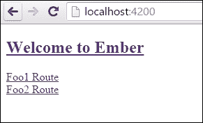

    索引主页显示每个路由的链接。

1.  点击**Foo2 路由**。以下窗口将显示：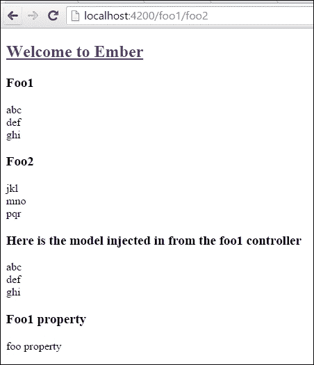

    如你所见，`foo1` 模板和 `foo2` 模板都会显示。`foo2` 模板可以访问 `foo2` 和 `foo1` 属性和模型。

## 它是如何工作的...

控制器可以使用 `Ember.inject.controller` 访问其他控制器。这被称为**依赖注入**。当我们将一个对象注入到另一个对象中时，就会发生依赖注入。依赖注入在第十一章的*使用依赖注入*配方中进行了更详细的介绍，*实时 Web 应用*。
