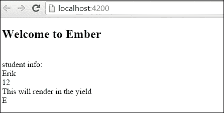
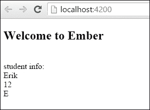
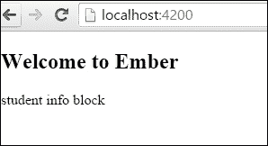
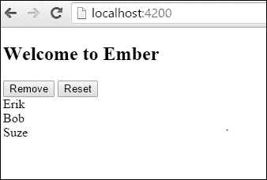
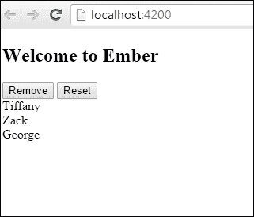
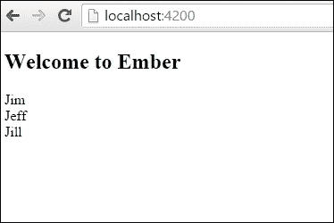
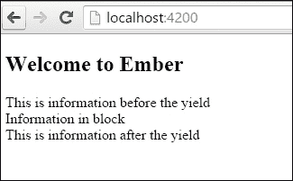

# 第六章。Ember 组件

在本章中，您将学习以下菜谱：

+   在应用中使用组件

+   在组件中使用事件

+   在组件中实现动作

+   将属性传递给组件

+   在组件中使用 yield

# 简介

组件是 Ember.js 的一个主要特性。使用组件，您可以封装代码并创建小部件和自定义标签。此外，您可以将属性传递给组件，处理事件和动作，并在其中包装内容。通常，它可以取代您的控制器。

组件与 **W3C** 自定义元素规范紧密对齐。尽管 W3C 规范仍在考虑中，但鉴于足够的时间，它可能会被 Web 所采用。

# 在应用中使用组件

组件可以在应用中以多种方式使用。在本菜谱中，我们将了解如何创建组件并将其添加到模板中。

## 如何操作...

首先，我们将创建一个简单的组件来显示学生信息。

1.  在新应用中生成一个新的组件：

    ```js
    $ ember g component student-info

    ```

    所有组件名称都必须包含一个连字符。这将生成 `student-info` 组件。此占位符将在 `app/components` 和 `app/templates/components` 文件夹中创建。

1.  编辑 `app/components` 文件夹中的 `student-info.js` 文件。添加一些简单的属性：

    ```js
    // app/components/student-info.js
    import Ember from 'ember';

    export default Ember.Component.extend({
        name: 'Erik',
        grade: 12,
        nickName: 'E'

    });
    ```

    在此组件中，我们添加了三个属性，`name`、`grade` 和 `nickName`。我们将在模板中稍后使用这些属性。

1.  更新 `app/templates/components` 文件夹中的组件模板：

    ```js
    // app/templates/components/student-info.hbs
    <br>student info:<br>
        {{name}}<br>
        {{grade}}<br>
        {{nickName}}<br>
    ```

    在此模板中，我们只是显示组件中的信息。

1.  最后，让我们编辑 `app/templates` 文件夹中的 `application.hbs` 文件：

    ```js
    // app/templates/application.hbs
    <h2 id="title">Welcome to Ember</h2>
    {{student-info}}
    ```

    通过向其中添加 Handlebars 表达式 `{{student-info}}` 来将组件添加到应用模板中。这将自动注册内联 Handlebars 辅助函数并将 `student-info.hbs` 文件的内容渲染到 `application.hbs` 文件中。

    让我们更改此示例并添加块形式。

1.  编辑 `student-info.hbs` 文件并添加 `yield`：

    ```js
    <br>student info:<br>
        {{name}}<br>
        {{grade}}<br>
        {{yield}}
        {{nickName}}<br>
    ```

    `{{yield}}` 表达式将是外部模板在组件以块形式渲染时的占位符。我们将在 *使用 yield 与组件* 菜谱中进一步讨论这一点。

1.  使用新块形式组件更新 `application.hbs` 文件：

    ```js
    // app/templates/application.hbs
    <h2 id="title">Welcome to Ember</h2>
    {{#student-info}}
        This will render in the yield<br>
    {{/student-info}}
    ```

    组件名称前有一个哈希 (`#`) 符号。这是向 Handlebars 模板引擎发出信号，表示组件将以块形式存在。`student-info.hbs` 文件中的 `yield` 辅助函数将显示块中的内容。

1.  运行 `ember server` 并查看此输出：

    学生组件在此应用模板中以块形式显示。

    ### 小贴士

    所有组件都是 `div` 标签。换句话说，默认创建的组件模板将在 `div` 标签中渲染。这可以通过 `tagName` 属性来更改。您只需将此属性添加到 `components` 目录中的组件 JavaScript 文件中即可。

### 动态创建学生组件

如果需要，你可以在运行时延迟选择组件。让我们看看一个例子，使用我们在早期部分创建的学生组件来做这件事。

1.  在一个新项目中，创建一个新的`student-info`组件：

    ```js
    $ ember g component student-info

    ```

    这将为`student-info`组件生成必要的文件。

1.  编辑组件文件并添加以下信息：

    ```js
    // app/components/student-info.js
    import Ember from 'ember';

    export default Ember.Component.extend({
        name: 'Erik',
        grade: 12,
        nickName: 'E',

    });
    ```

    此组件有几个简单的属性。

1.  使用以下信息更新组件模板：

    ```js
    // app/templates/components/student-info.hbs
    <br>student info:<br>
        {{name}}<br>
        {{grade}}<br>
        {{yield}}
        {{nickName}}<br>
        {{moreInfo}}<br>
    ```

    就像之前一样，我们正在显示从组件上下文中检索的一些简单属性。

1.  在`app/routes`文件夹中创建一个新的应用程序路由。添加一个名为`comp`的新`model`方法：

    ```js
    // app/routes/application.js
    import Ember from 'ember';

    export default Ember.Route.extend({
        model() {
          return ['student-info'];

        }
    });
    ```

    此模型返回一个字符串数组。此数组将用作我们模板中要动态显示的组件的名称。

1.  更新`app/templates`文件夹中的`application.hbs`文件。添加一个新的`each`助手，该助手将显示新的动态组件：

    ```js
    <h2 id="title">Welcome to Ember</h2>
    {{#each model as |comp|}}
        {{component comp}}
    {{/each}}
    ```

    要显示动态组件，你必须使用`{{component}}`助手。助手的第一个参数是你想要使用的组件的名称。在这种情况下，`{{comp}}`被渲染为`student-info`。请注意，我们可以使用组件助手的内联形式或块形式。如果组件以内联形式渲染，则不使用`yield`。

1.  运行`ember server`后，模板将使用动态组件进行渲染：

## 它是如何工作的...

组件用于将数据封装成可以在整个应用程序中轻松重用的形式。每个组件可以是块形式或内联形式，默认情况下以`div`标签的形式渲染。组件有一个模板和 JavaScript 文件。

# 在组件中使用事件

当创建组件时，你可以将事件附加到它们上。让我们看看一个例子。

## 如何做到这一点...

1.  在一个新项目中，生成一个名为`student-info`的新组件：

    ```js
    $ ember g component student-info

    ```

    这将在`component`目录和`templates/components`文件夹中生成组件文件。

1.  编辑`app/components/student-info.js`文件。添加一个新的`click`事件：

    ```js
    // app/components/student-info.js
    import Ember from 'ember';

    const {$}=  Ember
    export default Ember.Component.extend({
        click() {
          $('html').fadeToggle( 'slow', 'linear');
          $('html').delay(250).fadeIn();
        }
    });
    ```

    在这个例子中，你首先会注意到我们正在使用 ES2015 解构赋值。解构赋值语法从数组或对象中提取数据。我无需在所有地方都键入`Ember.$`，只需键入`$`即可。

    Ember CLI 默认安装了 jQuery。我们正在使用 jQuery 语法来淡入 HTML 文档，并在组件被点击后淡出。

    虽然我们不仅仅限于`click`事件。Ember 还有几个可用的事件。

    +   触摸事件：

        `touchStart`

        `touchMove`

        `touchEnd`

        `touchCancel`

    +   键盘事件：

        `keyDown`

        `keyUp`

        `keyPress`

    +   鼠标事件：

        `mouseDown`

        `mouseUp`

        `contextMenu`

        `click`

        `doubleClick`

        `mouseMove`

        `focusIn`

        `focusOut`

        `mouseEnter`

        `mouseLeave`

    +   表单事件：

        `submit`

        `change`

        `focusIn`

        `focusOut`

        `input`

    +   HTML5 拖放事件：

        `dragStart`

        `drag`

        `dragEnter`

        `dragLeave`

        `dragOver`

        `dragEnd`

        `drop`

1.  对于最后一步，我们需要将组件添加到我们的应用程序模板中。目前不需要编辑组件模板。我们将只设置组件为块形式，以便任何对元素的点击都将触发事件：

    ```js
    // app/templates/application.hbs
    <h2 id="title">Welcome to Ember</h2>

    {{#student-info}}
        Student info block
    {{/student-info}}
    {{outlet}}
    ```

    `student-info` 组件是块形式的。点击块中的任何位置将触发 `click` 事件，导致 HTML 文档淡出。

    在 `app` 文件夹的根目录下有一个 `index.html` 文件。此文件包含默认的 HTML 和 `head` 标签。它还包含一些指向你的 CSS 和供应商文件的链接。你可能注意到有 `{{content-for}}` 辅助函数。这些与 Ember 插件一起使用，不应删除。

1.  运行 `ember server`，模板应按以下方式渲染：

    如果点击学生信息块 `div` 的任何部分，HTML 文档将淡出。

## 它是如何工作的...

Ember 组件中的事件通过在组件中添加事件名称作为方法来工作。这些事件在组件被添加到的模板中触发。默认情况下，组件是 `div` 标签。因此，任何事件都必须在渲染的模板中的 `div` 标签的上下文中发生。

Ember 支持多种不同类型的事件，包括双击、HTML 5 拖放事件和触摸事件。可以使用 `Ember.Application.customEvents` 方法注册自定义事件。

# 在组件中实现动作

组件可以通过动作与变化进行通信。这些动作可以发送回父组件或在组件中处理。让我们看看几个展示这一点的示例。

## 如何做...

在这个示例中，我们将创建一个学生列表，然后对其进行操作。

1.  在一个新项目中，生成一个 `student-list` 组件：

    ```js
    $ ember g component student-list

    ```

    这将生成 `student-list` 组件和必要的文件。

1.  更新 `app/components` 文件夹中的 `student-list.js` 文件。我们需要创建几个 `actions` 和一个新的数组：

    ```js
    // app/components/student-list.js
    import Ember from 'ember';

    export default Ember.Component.extend({
        init() {
          this._super(...arguments);
          this.setup();
        }, 
        actions: {
          remove(){
            this.get('listOfStudents').popObject();
          },
          reset(){
            this.setup();
          }

        },
        setup(){
          let st = this.set('listOfStudents',[]);
          st.clear();
          st.pushObject('Erik');
          st.pushObject('Bob');
          st.pushObject('Suze');

        }

    });
    ```

    此组件的第一部分是 `init` 方法。该方法将在组件初始化时立即触发。这是一个私有方法，用于设置组件。由于我们正在重写此框架方法，我们必须调用 `super` 以确保组件正确创建。然后调用 `setup` 方法。

    `setup` 方法创建一个新的 `listOfStudents` 数组，将其清空，并通过将其弹出到数组中来创建三个新的字符串对象。由于我们在 `init` 方法中创建 `listOfStudents` 数组，它将属于此组件实例的局部变量。在 `init` 或 `didInsertElement` 方法中声明对象或属性是良好的实践。否则，如果对象或数组被声明为组件的属性，组件将不再拥有其独立的独立状态。我们将在本书的后面讨论 `didInsertElement` 钩子。

    列出了两个`actions`，`remove`和`reset`。两者都将与组件模板中的动作相关联，我们将在稍后使用。`remove`动作从数组的顶部删除或弹出对象。`reset`方法调用`setup`，这使组件返回到其原始状态。

1.  添加几个按钮，并使用`each`辅助函数在`app/templates/components`文件夹中的`student-list.hbs`文件中列出数组的内容：

    ```js
    // app/templates/components/student-list.hbs
    <button {{action 'remove'}}>Remove</button>
    <button {{action 'reset'}}>Reset</button><br>
    {{#each listOfStudents as |student|}}
        {{student}}<br>
    {{/each}}
    ```

    `{{action}}`辅助函数将在点击`remove`和`reset`按钮时触发。`action`辅助函数的第一个参数始终是动作名称。`each`辅助函数列出`listOfStudents` Ember 数组的内容。

1.  对于最后一部分，将`student-list`组件添加到应用程序模板中：

    ```js
    // app/templates/application.hbs
    <h2 id="title">Welcome to Ember</h2>
    {{student-list }}
    {{outlet}}
    ```

    这将显示`student-list`组件的内容。

1.  启动`ember server`后，你的输出将如下所示：

    点击**移除**按钮将逐个删除每个项目。**重置**按钮将数组重置。

### 使用我们的学生组件的闭包动作

Ember 为你提供了一种从父组件向子组件发送动作的方法。我们可以使用闭包动作来实现这一点。

1.  在一个新项目中，生成一个新的`application`路由和一个`student-list`组件：

    ```js
    $ ember g route application
    $ ember g controller application
    $ ember g component student-list

    ```

    这将在`app/routes`文件夹中生成`application.js`文件，`application`控制器和`student-list`组件。

1.  在应用程序路由文件中，添加一个新的`listOfStudents`数组：

    ```js
    // app/routes/application.js
    import Ember from 'ember';

    export default Ember.Route.extend({
        listOfStudents: [],
        beforeModel(){
          this.reset();
        },
        model(){

          return this.get('listOfStudents');
        },
        reset(){
          let st = this.get('listOfStudents');
          st.clear();
          st.pushObject('Tiffany');
          st.pushObject('Zack');
          st.pushObject('George');
        },
        actions: {
          removeRoute(){
            this.get('listOfStudents').popObject();
          },
          resetRoute(){
            this.reset();
          }
        }
    });
    ```

    这可能让你想起了上一个示例。在这里，我们创建了一个名为`listOfStudents`的新数组。`beforeModel`钩子将在模型设置之前运行。在这个`beforeModel`中，调用了`reset`方法。这会将默认数据添加到数组中。

    模型钩子返回`listOfStudents`数组。此外，我们添加了两个动作`remove`和`reset`，分别用于删除一个项目或将项目重置回原始数组。

    这实际上与我们在组件中较早之前拥有的代码相同，但我们将其移动到了路由中。

1.  编辑`application.hbs`文件并添加我们刚刚创建的组件：

    ```js
    // app/templates/application.hbs
    <h2 id="title">Welcome to Ember</h2>
    {{student-list onRemove=(action 'removeController' ) onReset=(action 'resetController')}}
    {{#each model as |student|}}
        {{student}}<br>
    {{/each}}
    {{outlet}}
    ```

    此模板将显示来自我们的模型和`student-list`组件的学生列表。`onRemove`和`onReset`属性设置为传递给组件的父控制器中的函数。这被称为**闭包动作**。所有闭包动作都必须在`(action 'removeController')`动作周围有括号。

1.  向控制器添加两个新动作：

    ```js
    // app/controllers/application.js
    import Ember from 'ember';

    export default Ember.Controller.extend({
        actions:{
          removeController(){
            this.send('removeRoute');
          },
          resetController(){
            this.send('resetRoute');
          }
        }
    });
    ```

    这两个动作使用`this.send`将动作发送到我们之前定义的`removeRoute`和`resetRoute`动作。你可以使用`send`方法从父路由或控制器触发动作。

1.  更新组件模板文件：

    ```js
    // app/templates/components/student-list.hbs
    <button {{action 'removeComponent'}}>Remove</button>
    <button {{action 'resetComponent'}}>Reset</button>
    ```

    此组件显示两个按钮，这些按钮与组件中定义的动作相关联。

1.  更新组件 JavaScript 文件，并添加两个新动作：

    ```js
    // app/components/student-list.js
    import Ember from 'ember';

    export default Ember.Component.extend({
        actions: {
          removeComponent(){
            this.get('onRemove')();
          },
          resetComponent(){
            his.attrs.onReset();
          }
        }
    });
    ```

    这些动作将从组件模板触发。此时，它们将触发从关闭操作传递给它的函数，即`onRemove`和`onReset`。

    要调用这些方法，你可以使用`this.get`或`this.attrs`。在这种情况下，`this.get`方法和属性名`onRemove`将调用传递给它的方法。

    在另一种情况下，你可以使用`this.attrs`来访问属性上的属性以调用传递的函数，即`this.attrs.onReset()`。

    动作将按此方式流动：**应用模板 -> 组件 -> 控制器 -> 路由**。最终结果是路由触发动作以删除或重置列表。

1.  运行`ember server`，你应该会看到一个可以删除或重置的列表：

1.  点击**删除**或**重置**按钮将触发从控制器传递进来的动作。这个动作将冒泡到路由以重置或从列表中删除一个项目。

## 它是如何工作的...

在组件中可以通过几种方式处理动作。动作可以添加到不同的 HTML 标签中，并在组件内部处理。动作还可以通过关闭操作或发送操作发送到父组件或控制器。

关闭操作使得传递动作变得更容易。我们可以将动作传递给组件，然后它们可以调用这些动作。这有助于在不同父路由、控制器和组件之间分离逻辑。

# 将属性传递给组件

组件默认情况下与其周围环境隔离。组件需要的任何数据都必须传递进来。在这个菜谱中，我们将创建一个学生列表。然而，我们将传递数据到组件以进行渲染。

## 如何实现...

1.  在一个新应用中，生成一个新的组件和`application`路由：

    ```js
    $ ember g route application
    $ ember g component student-list

    ```

    这将在`routes`文件夹中生成`application.js`文件以及从`student-list`组件必需的文件。

1.  编辑`app/routes`文件夹中的`application.js`文件：

    ```js
    // app/routes/application.js
    import Ember from 'ember';

    export default Ember.Route.extend({
        model() {
          return ['Jim','Jeff','Jill']
        }
    });
    ```

    此模型将返回一个简单的数组。

1.  更新`app/templates/components`文件夹中的`student-list`模板：

    ```js
    // app/templates/components/student-info.hbs

    {{#each compModel as |student|}}
        {{student}}<br>
    {{/each}}
    ```

    这将使用`compModel`属性，并通过`each`辅助函数遍历它。

1.  编辑`app/templates`文件夹中的`application.hbs`文件。添加新的`student-info`组件：

    ```js
    // app/templates/application.hbs
    {{student-list compModel=model}}

    {{outlet}}
    ```

    `student-list`模板具有`compModel`属性。这个属性传递了在路由中之前设置的模型，即应用程序模型。请注意，`compModel`是从组件内部访问的。模型是从组件外部访问的。除非将其传递给它，否则组件无法访问模型。

1.  运行`ember server`，你应该在模型中看到元素列表：

## 它是如何工作的...

组件是独立的代码集合，无法访问外部世界。换句话说，组件必须通过传递给它任何所需的数据。您可以通过在 Handlebars 表达式中组件名称后添加属性来设置此操作。

# 使用组件的 yield

组件可以以块或内联形式设置。当以块形式时，组件可以提供信息。在这个菜谱中，我们将查看使用 yield 在模板中显示信息的示例。

## 如何操作...

1.  在一个新项目中，创建一个新的学生组件：

    ```js
    $ ember g component student-info

    ```

    这将创建学生组件。

1.  编辑`student-info`模板文件并添加一些文本：

    ```js
    // app/templates/components/student-info.hbs
    This is information before the yield<br>
    {{yield}}
    This is information after the yield
    ```

    组件中的`{{yield}}`表达式将是块中文本将被渲染的地方。

1.  将新的`student-info`组件添加到应用程序模板文件中：

    ```js
    // app/templates/application.hbs
    <h2 id="title">Welcome to Ember</h2>

    {{#student-info}}
        Information in block<br>
    {{/student-info}}
    ```

    当以块形式时，由哈希符号`#`指定，块中的信息将显示在`{{yield}}`中。

1.  运行`ember server`后，将显示以下屏幕：

    如您所见，组件`yield`模板显示了块中的信息。

## 它是如何工作的...

`{{yield}}` Handlebars 表达式通过获取组件块中的信息并将其渲染出来来工作。块形式由哈希符号`#`指定。内联组件没有哈希符号，并且不提供信息。
