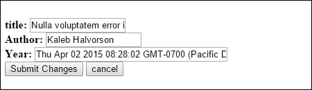
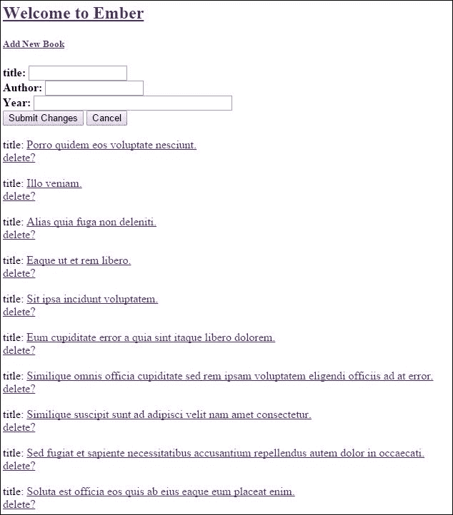
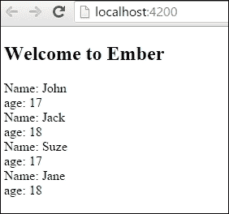
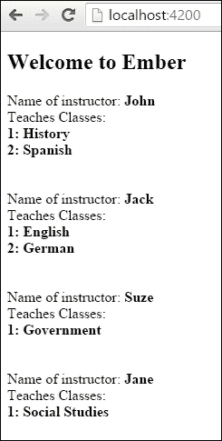

# 第七章. Ember 模型和 Ember Data

在本章中，您将学习以下食谱：

+   理解 Ember Data 的功能

+   使用 Ember Data 创建、读取、更新和删除记录

+   使用固定数据

+   自定义适配器和序列化器

+   处理关系

# 简介

模型是 Ember 中的对象，代表可以显示给用户的数据。它们是持久的，当用户关闭浏览器窗口时不会丢失。

许多模型是从存储在服务器数据库中的数据加载的。通常，数据以 JSON 表示的形式来回发送。这就是 Ember Data 发挥作用的地方。当您在 Ember 中创建应用程序时，Ember Data 默认包含。它有助于检索数据、在本地存储数据并将信息保存到服务器。

Ember Data 可以配置为与许多不同类型的数据库和服务器一起工作。如果使用得当，Ember Data 可以帮助您管理应用程序模型，而无需在应用程序中多次使用 Ajax 请求。

# 理解 Ember Data 的功能

Ember Data 使用一个单一的数据存储，可以在整个应用程序中访问。在这个例子中，我们将创建一个简单的应用程序，检索书籍列表并将其显示给用户。

## 准备工作

在我们开始之前，我们需要为我们的服务器生成模拟数据。Ember CLI 内置了一个模拟服务器，可以通过生成基本的 **Express 服务器** 来处理这种情况。然而，为了本食谱的目的，我们将继续使用 Ember CLI Mirage 插件。它具有更多功能且易于使用。您可以在 [`github.com/samselikoff/ember-cli-mirage`](https://github.com/samselikoff/ember-cli-mirage) 找到更多关于 Ember CLI Mirage 的信息。

1.  首先，让我们创建一个新的应用程序：

    ```js
    $ ember new BookExample

    ```

1.  应用程序创建完成后，让我们安装插件：

    ```js
    $ cd BookExample
    $ ember install ember-cli-mirage
    $ ember g factory book

    ```

    这将安装所需的最新 Bower 和 `npm` 软件包，并为 Mirage 创建 `book` 工厂。

    为了使这个食谱工作，我们需要模拟书籍数据。

1.  编辑 `app/mirage` 文件夹中的 `config.js` 文件：

    ```js
    // app/mirage/config.js
    export default function() {

        this.get('/books');
        this.get('/books/:id');
    }
    ```

    此配置文件将设置我们所需的数据的虚拟路由。`/books` 路由将返回所有书籍数据，而 `/books/:id` 路由将根据 URL 中传递的 ID 返回单个书籍。

1.  更新 `app/mirage/factories` 文件夹中的 `book.js` 文件。添加以下属性：

    ```js
    // app/mirage/factories/book.js
    import Mirage, {faker}  from 'ember-cli-mirage';

    export default Mirage.Factory.extend({

        title: faker.lorem.sentence,  // using faker
        author() {return faker.name.findName(); },
        year: faker.date.past
    });
    ```

    此文件设置了我们将用于模型的属性。`title` 属性指的是书籍的名称，`author` 指的是写这本书的人，而 `year` 是出版年份。为了使事情更简单一些，Ember CLI Mirage 包含了一个名为 `faker` 的库。这个库生成我们可以用来填充我们的内存数据存储的数据。

1.  更新 `app/mirage/scenarios` 文件夹中的 `default.js` 文件：

    ```js
    export default function( server ) {

        server.createList('book',10);
    }
    ```

    确保删除 `server` 附近的注释。此场景将在浏览器加载时每次生成十个新的 `'book'` 记录。浏览器加载后，书籍将通过工厂生成。

## 如何做到这一点...

1.  首先创建一个用于书籍的模型文件、REST 适配器和路由：

    ```js
    $ ember g model book title:string author:string year:date
    $ ember g adapter application
    $ ember g route books
    $ ember g route application

    ```

    此命令将生成一个名为 `book` 的新模型，并将 `title`、`author` 和 `year` 作为模型中的属性。`generate adapter` 命令将为我们的应用程序创建一个新的适配器，而最后的命令将为 `book` 和 `application` 生成路由。

1.  在 `app/models` 文件夹中打开 `book.js` 文件。它应该看起来如下：

    ```js
    // app/models/book.js
    import DS from 'ember-data';

    export default DS.Model.extend({
        title: DS.attr('string'),
        author: DS.attr('string'),
        year: DS.attr('date')
    });
    ```

    `models` 文件是我们将要使用的数据的表示。我们可以使用三种不同类型的数据：`string`、`number` 或 `date`。这些数据将从我们的模拟服务器加载。

1.  在 `app/adapters` 文件夹中打开创建的 `application.js` 文件：

    ```js
    // app/adapters/application.js
    import DS from 'ember-data';

    export default DS.RESTAdapter.extend({
    });
    ```

    Ember Data 有几个适配器可供使用。其中最容易使用的是 REST 适配器。

1.  REST 适配器期望服务器以这种格式提供数据：

    ```js
    {
      "books": [
        {
          "id": 1,
          "title": "Some title",
          "author": "Authors name",
          "date": "1980-05-23"
        }
        {
          "id": 2,
          "title": "Some other title",
          "author": "Authors name 2",
          "date": "1985-05-23"

        }
      ]
    }
    ```

    前面的 JSON 列出了一个书籍数组。如果意外地只返回了一个记录，REST 适配器会期望数组被命名为 `book` 而不是 `books`。请记住，你应该将所有记录名称使用驼峰命名法，并且数据应该以 REST 适配器格式呈现。

1.  我们需要能够从我们的数据存储中检索数据并将其展示给用户。编辑 `app/routes` 文件夹中的 `application.js` 文件。添加一个新的模型，它返回所有列出的书籍：

    ```js
    // app/routes/application.js
    import Ember from 'ember';

    export default Ember.Route.extend({
        model(){
          return this.store.findAll('book');
        }
    });
    ```

    如 第四章 中所述，*Ember Router*，路由的一个职责是返回模型数据。Ember Data 存储有一个名为 `findAll` 的方法，它将返回 `book` 模型的所有数据。按照惯例，Ember 应用程序将执行一个 HTTP GET 请求到 `/book/` URL，并期望响应中包含 JSON 负载。由于此模型位于应用程序路由中，它可以在任何模板中访问。

1.  更新 `application.hbs` 文件并显示来自模拟服务器的新的数据：

    ```js
    // app/templates/application.hbs
    {{#link-to 'index'}}<h2 id="title">Welcome to Ember</h2>{{/link-to}}

    {{outlet}}

    {{#each model as |book|}}
        <br>
        title: {{#link-to 'books' book.id}}{{book.title}}{{/link-to}}<br>
    {{/each}}
    ```

    此模板使用 `each` 辅助函数遍历页面加载后从 `model` 钩子返回的所有数据。`link-to` 辅助函数将 `book.id` 作为参数传递到 URL 中。我们将使用书籍的 `title` 作为链接。

1.  更新书籍路由，使其返回单个记录：

    ```js
    // app/routes/books.js
    import Ember from 'ember';

    export default Ember.Route.extend({
        model(params){
          return this.store.findRecord('book',params.book_id);
        }
    });
    ```

    `model` 钩子从 URL 接收一个参数。可以使用 Ember Data 的 `findRecord` 来查找单个记录。当 `model` 钩子被加载时，它将向 `/books/:id` URL 发送一个 HTTP GET 请求。第一个参数是数据存储，第二个参数是记录 ID。

1.  在 `app` 文件夹中的 `router.js` 文件中更新新的动态路由 `books`：

    ```js
    // app/router.js
    import Ember from 'ember';
    import config from './config/environment';

    var Router = Ember.Router.extend({
        location: config.locationType
    });

    Router.map(function() {
        this.route('books', {path:'/books/:book_id'});
    });

    export default Router;
    ```

    这个新的 `books` 路由的路径为 `/books/:book_id`。要访问 `books` 路由，必须在路径中提交一个 ID。

1.  更新 `books.hbs` 模板：

    ```js
    // app/templates/books.hbs
    {{outlet}}
    <br>
    <b>Author: {{model.author}}</b><br>
    <b>Year: {{model.year}}</b>
    <br>
    ```

    访问此路由将触发 `model` 钩子。这将渲染所选书籍的 `author` 和 `year`。

1.  运行 `ember server` 并打开一个网页浏览器。您将看到所有标题的列表，每个标题都有一个链接指向每本书：

    每篇文章都有一个唯一的 ID。点击链接将显示该书的标题和作者。

## 工作原理...

模型代表 Ember 中的数据。这些模型可以使用 Ember Data 将数据存储、更新和从服务器检索数据。从服务器发送的数据通常是 JSON 格式。Ember 为与来自服务器的数据接口提供了一组适配器。REST 适配器是最常用的。它期望数据以特定格式，以便 Ember 可以解析、存储并向用户显示。

Ember Data 在从服务器检索数据后缓存数据。这最小化了往返服务器的次数。然而，当从存储返回缓存的记录时，Ember Data 将在后台发出请求。如果数据已更改，它将在屏幕上重新渲染。

# 使用 Ember Data 创建、读取、更新和删除记录

在前面的配方中，我们从我们的模拟服务器检索了现有的书籍数据并将其显示给用户。Ember Data 还具有从数据存储创建、删除甚至更新记录的能力。我们将探讨这些方法以及更多。

## 准备工作

就像前面的例子一样，我们需要安装 Ember CLI Mirage。请参阅前面的配方以获取有关此过程的说明。我们将使用与书籍配方相同的工厂，并添加新的方法来添加、编辑和删除数据。

1.  在 `mirage` 文件夹中，打开 `config.js` 文件：

    ```js
    // app/mirage/config.js
    export default function() {

        this.get('/books');
        this.get('/books/:id');
        this.put('/books/:id');
        this.post('/books');
        this.delete('/books/:id');
    }
    ```

    这将模拟我们的后端，并允许我们创建、更新和删除数据。这是通过使用 HTTP PUT、POST 和 DELETE 请求来完成的。我们将在程序中稍后使用这些。

1.  更新 `app/mirage` 文件夹中的 `book.js` 文件：

    ```js
    // app/mirage/factories/book.js
    import Mirage, {faker}  from 'ember-cli-mirage';

    export default Mirage.Factory.extend({

       title: faker.lorem.sentence,  // using faker
       author() {return faker.name.findName(); },
       year: faker.date.past
    });
    ```

    这个工厂将用于生成 Mirage 内部数据库将返回的假数据。

1.  更新 `scenarios` 文件夹中的 `default.js` 文件：

    ```js
    // app/mirage/scenarios/default.js
    export default function( server ) {

        server.createList('book',10);
    }
    ```

    每次应用程序加载时，服务器将创建 `10` 个 `book` 对象。

## 如何操作...

对于这个配方，我们将向我们在 *Understanding the functionalities of Ember* *Data* 配方中已有的书籍示例中添加内容。

1.  创建一个名为 `new` 的路由和一个名为 `books` 的控制器：

    ```js
    $ ember g route new
    $ ember g controller books
    $ ember g controller new
    $ ember g controller application

    ```

    这将生成 `new` 路由和 `books` 控制器文件。

1.  为新路由创建一个新的模板：

    ```js
    // app/templates/new.hbs
    {{outlet}}
    <b>title: {{input value=info.title size='15'}}</b><br>
    <b>Author: {{input value=info.author size='15'}}</b><br>
    <b>Year: {{input value=info.year size='35'}}</b><br>
    <button {{action 'newText' }}>Submit Changes</button>
    <button {{action 'cancel' }}>Cancel</button><br>
    ```

    新路由将用于向存储库添加新书。在这个模板中，使用 `input` 辅助函数创建三个文本框。每个都将绑定到信息属性。底部的一个按钮将提交更改到 `newText` `action` 方法。`cancel` 按钮将触发 `cancel` 动作。

1.  更新 `new.js` 控制器，添加新的 `cancel` 和 `newText` `actions`：

    ```js
    // app/controllers/new.js
    import Ember from 'ember';

    export default Ember.Controller.extend({
        info: {},
        actions:{
          newText(){
            let inf = this.get('info');
            let newBook = this.store.createRecord('book',{
              title: inf.title,
              author: inf.author,
              year: new Date(inf.year)
            });

          newBook.save().then(()=>{
            this.transitionToRoute('application');
            this.set('info',{});
          },()=> {
            console.log('failed');
          });
          },
          cancel(){
            return true;
          }

        }
    });
    ```

1.  这里有很多事情在进行中；让我们首先看看 `newText` 动作：

    ```js
        newText(){
          let inf = this.get('info');
          let newBook = this.store.createRecord('book',{
            title: inf.title,
            author: inf.author,
            year: new Date(inf.year)
          });
    ```

    在这个操作中，我们获取之前声明的`info`属性。这个属性是一个对象，用于存储从模板中获取的值。存储库有一个名为`createRecord`的方法，它接受两个参数。第一个参数是模型。第二个是我们想要存储的对象。在这种情况下，我们想要向存储库添加一个新的`book`记录。我们使用`inf`对象设置`title`、`author`和`year`。

1.  使用`createRecord`方法不会持久化更改。`save()`方法用于将数据持久化回服务器：

    ```js
        newBook.save().then(()=>{
          this.transitionToRoute('application');
          this.set('info',{});
        },()=> {
          console.log('failed');
        });
    ```

    `save`方法是一个承诺。它要么成功，要么失败。如果成功，我们使用`transitionToRoute`方法将路由切换回主应用程序。

    之后，我们将`info`属性设置回空对象。我们这样做是为了清除模板`input`助手的所有数据。如果它不成功，那么我们将输出错误到控制台：

    ```js
        cancel(){
          return true;
        }
    ```

    `cancel`操作返回`true`。这意味着不是控制器处理它，而是将其冒泡到路由进行处理：

    ### 小贴士

    **使用 Ember 的 REST**

    在使用 Ember 中的 REST 适配器时，`save()`方法将向服务器发送 PUT、DELETE、GET 或 POST HTTP 请求。PUT 请求将在更新期间发送。DELETE 请求用于删除记录。POST 用于添加新记录，而 GET 请求用于检索记录。这是由 Ember REST 适配器按照惯例完成的。

1.  更新`books.hbs`模板文件，添加一个新操作以更新：

    ```js
    // app/templates/books.hbs
    {{outlet}}
    <br>
    <b>title: {{input value=model.title size='15'}}</b><br>
    <b>Author: {{input value=model.author size='15'}}</b><br>
    <b>Year: {{input value=model.year size='35'}}</b><br>
    <button {{action 'updateText'}}>Submit Changes</button>
    <button {{action 'cancel'}}>cancel</button>
    <br>
    ```

    我们已更新书籍模板，使其与上一个示例的行为不同。在这个示例中，它将允许我们按以下方式编辑条目：

    

1.  更新`books.js`控制器以处理新的`updateText`和`cancel`操作：

    ```js
    // app/controllers/books.js
    import Ember from 'ember';

    export default Ember.Controller.extend({
        actions: {
          updateText(){
            let book = this.get('model');
            book.set('year',new Date(book.get('year')));
            book.save();
            this.transitionToRoute('application');
          },
          cancel() {
            return true;
          }
        }
    });
    ```

    `updateText`操作获取当前书籍`model`，设置`year`，然后保存。之后，它过渡到`application`路由。如果需要，我们可以处理保存承诺失败时的错误条件。为了简单起见，我们将保持原样。`cancel`操作返回`true`，这意味着它将冒泡到书籍路由进行处理。

1.  更新路由中的`books.js`文件：

    ```js
    // app/routes/books.js
    import Ember from 'ember';

    export default Ember.Route.extend({
        model(params){
          return this.store.findRecord('book',params.book_id);
        },
        actions:{
          cancel() {
            return true;
          }
        }
    });
    ```

    路由文件与上一个配方相同，但现在我们有一个`cancel`操作。这个`cancel`操作将在控制器返回`true`后触发。通过在这里返回`true`，操作再次冒泡到应用程序路由。

1.  更新`new.js`路由文件：

    ```js
    // app/routes/new.js
    import Ember from 'ember';

    export default Ember.Route.extend({
        actions: {
          cancel() {
            return true;
          }
        }
    });
    ```

    此文件将接收来自新控制器的操作。它也返回`true`，这意味着`cancel`操作将由应用程序路由处理。

1.  更新应用程序路由文件：

    ```js
    // app/routes/application.js
    import Ember from 'ember';

    export default Ember.Route.extend({
        model(){
          return this.store.findAll('book');
        },
        actions: {
          cancel(){
            this.transitionTo('application');
          }
        }
    });
    ```

    应用程序路由中的`cancel`操作处理新的和书籍路由的`cancel`操作。在任何情况下，它都会过渡到`application`路由。总之，操作的冒泡从新的控制器到新的路由，最后到应用程序路由。如果`cancel`操作未包含在控制器中，根据惯例，操作将自动向上冒泡。

1.  我们需要更新应用程序模板并添加一个新选项来删除记录。使用新的`delete`操作更新`application.hbs`文件：

    ```js
    // app/templates/application.hbs
    {{#link-to 'index'}}<h2 id="title">Welcome to Ember</h2>{{/link-to}}
    {{#link-to 'new'}}<h5>Add New Book</h5>{{/link-to}}

    {{outlet}}

    {{#each model as |book|}}
        <br>
        title: {{#link-to 'books' book.id}}{{book.title}}{{/link-to}} <br>
    <a href="" {{action 'delete' book}}>delete?</a><br>
    {{/each}}
    ```

    应用程序将显示每本书。每条记录底部还有一个`delete`操作按钮，该按钮传递`book`记录。

1.  更新应用程序控制器以处理新的`delete`操作：

    ```js
    // app/controllers/application.js
    import Ember from 'ember';

    export default Ember.Controller.extend({
        actions:{
          delete(book){
            book.deleteRecord();
            console.log(book.get('isDeleted'));
            book.save();
          }
        }
    });
    ```

    书籍记录有一个名为`deleteRecord`的方法。这个方法会删除记录；然而，它不会在`save()`完成之前向服务器发送 HTTP 删除请求。另一个名为`destroyRecord`的方法会同时`delete`和`save`。在这个例子中，我们将使用`deleteRecord`。

1.  加载 Ember 服务器，你会看到一个记录列表。你可以点击每条记录并删除或编辑它：

    ### 小贴士

    **不使用 Ember Data？**

    当与后端数据存储一起工作时，Ember Data 是首选方法。然而，它不必是唯一的选择。在路由中定义模型信息时，你可以使用 Ajax 方法或定义自己的存储库。如果需要，你可以使用服务并将它们注入到你的应用程序的各个部分。这需要额外的大量工作，具体取决于你的设置，但这是一个选择。

## 它是如何工作的...

Ember Data 附带了一些适配器，可以用来从后端服务器检索数据。REST 适配器允许用户使用 HTTP GET、DELETE、PUT 和 POST 请求向后端服务器发送请求。默认情况下，它期望以 JSON 格式接收响应。

Ember Data 存储方法允许用户查找、删除和保存记录。Ember 的`save()`方法触发对服务器的响应。在保存完成之前，如果需要，可以回滚记录。

# 使用固定数据

固定数据是模拟数据的一种方式。它是静态数据，可以在测试我们的应用程序时用于我们的模型以显示给用户。在这个菜谱中，我们将看到如何使用 Ember CLI Mirage 设置它的一些基本知识。

## 准备工作

与我们其他许多示例一样，我们将使用 Ember CLI Mirage。我们将设置固定数据而不是使用工厂。

1.  开始创建一个新的应用程序。然后添加 Ember CLI Mirage 插件并生成应用程序的模型和路由：

    ```js
    $ ember install ember-cli-mirage
    $ ember g model student name:string age:number
    $ ember g route index
    $ ember g adapter application
    $ ember g fixture students

    ```

    这些命令将生成我们应用程序的基本结构。在这个应用程序中，固定数据将用于显示学生信息。为了简单起见，我们只会显示这些信息而不会对其进行操作。

1.  在`mirage`的`fixtures`文件夹中，更新`students.js`文件并添加固定数据：

    ```js
    // app/mirage/fixtures/students.js
    export default [
        {id: 1, name: 'John', age: 17},
        {id: 2, name: 'Jack', age: 18},
        {id: 3, name: 'Suze', age: 17},
        {id: 4, name: 'Jane', age: 18}
    ];
    ```

    固定数据有四个记录。每个记录都有一个不同的学生的 `name` 和 `age`。要使用 Ember CLI Mirage 与固定数据一起使用，你必须将其作为对象的数组输入。

1.  更新 `mirage` 文件夹中的 `config.js` 文件。此文件用于设置 `students` 路由：

    ```js
    // app/mirage/config.js
    export default function() {

        this.get('/students');

    }
    ```

    这将为 Ember Data 设置一个模拟服务器端点。按照惯例，Ember Data 将查找复数模型名称的 URL 路径。在这个例子中，我们的模型将是学生；因此，当 Ember Data 查找数据时，它将对服务器的 `/students` 执行 GET 请求。

1.  在 `default.js` 文件中添加一个新的场景用于固定数据：

    ```js
    // app/mirage/scenarios/default.js
    export default function(server ) {
        server.loadFixtures();

    }
    ```

    `loadFixtures()` 命令将在内存中加载固定数据，以便它们可用于 `students` 路由。

## 如何操作...

1.  之前，我们创建了模型文件。让我们先看看它，以确保一切设置正确：

    ```js
    // app/models/student.js
    import DS from 'ember-data';

    export default DS.Model.extend({
        name: DS.attr('string'),
        age: DS.attr('number')
    });
    ```

    `student` 模型有两个属性，称为 `name` 和 `age`。

1.  更新 `index.js` 路由文件以返回学生模型：

    ```js
    // app/routes/index.js
    import Ember from 'ember';

    export default Ember.Route.extend({
        model(){
          return this.store.findAll('student');
        }
    });
    ```

    路由文件将使用 `findAll` 方法返回所有 `student` 记录。这将触发对服务器 `/students` 的 HTTP GET 请求。当你访问路由时，将触发 `model` 钩子。按照惯例，Ember 将缓存这些结果。

1.  打开应用程序适配器。将其设置为 REST 适配器：

    ```js
    // app/adapters/application.js
    import DS from 'ember-data';

    export default DS.RESTAdapter.extend({
    });
    ```

    `RESTAdapter` 将用于所有路由。它是一种假设通过 XHR 发送 JSON 数据的适配器类型。

1.  编辑 `index.hbs` 文件。这将显示模型信息：

    ```js
    // app/templates/index.hbs
    {{#each model as |student|}}
        Name: {{student.name}}<br>
        age: {{student.age}}<br>
    {{/each}}<br>
    ```

    在这个例子中，我们使用 `each` 辅助函数遍历所有记录。

1.  运行 `ember server`，以下结果应该会显示：

    页面加载后，将显示学生姓名和年龄的列表。这些数据是从我们之前设置的模拟服务器中检索的固定数据。

## 它是如何工作的...

固定数据在测试应用程序时使用。这是已知数据，可用于重复测试。Ember CLI Mirage 可以设置为使用固定数据。

我们将在测试章节中更详细地介绍使用固定数据与测试。

# 自定义适配器和序列化器

Ember Data 对如何访问数据有很强的意见。适配器对数据的外观有内置的假设。我们可以使用序列化和适配器来改变这些假设。

对于这个菜谱，我们将基于上一节中创建的学生应用程序进行构建。

## 准备工作

我们将使用之前菜谱中的相同应用程序。我们需要编辑 Ember CLI Mirage 以处理新的命名空间。

在 `mirage` 文件夹中的 `config.js` 文件中更新 `students` 路由：

```js
// app/mirage/config.js
export default function() {

    this.get('api/v1/students');
}
```

这将更改端点为 `api/v1/students` 而不是仅仅 `/students`。

## 如何操作...

1.  在上一节中的学生应用程序中，编辑 `adapters` 文件夹中的 `application.js` 文件。

1.  添加一个新的 `namespace`：

    ```js
    // app/adapters/application.js
    import DS from 'ember-data';

    export default DS.RESTAdapter.extend({
        namespace: 'api/v1'
    });
    ```

    `namespace` 属性用于在请求前添加特定的 URL 前缀。在这种情况下，所有请求都将添加 `api/v1` 作为前缀。

1.  启动 Ember 服务器，你应该会看到请求发送到 `/api/v1/students`。

### Ember Data 中的可选定制

如果需要，Ember 提供了多种其他定制选项。以下是一些需要记住的重要选项。

#### 主机定制

在适配器文件中，你可以添加 Ember Data 应该发送请求的新位置。这将覆盖本地服务器的默认位置：

```js
// app/adapters/application.js
import DS from 'ember-data';

export default DS.RESTAdapter.extend({
host: 'https://api.example.com'
});
```

例如，现在所有请求都将发送到 `api.example.com`。

#### Headers 定制

根据 API，你可能需要在每个 HTTP 请求中发送特定的 headers。你可以使用 `headers` 属性来添加这些 headers：

```js
// app/adapters/application.js
import DS from 'ember-data';

export default DS.RESTAdapter.extend({
  headers: {
    'API_INFO:': 'key',
    'SECOND_HEADER': 'Some value'
  }
});
```

这将为每个发送的请求添加新的 `headers`。如果需要，你还可以通过创建计算属性在 headers 中使用动态信息。

### 与序列化器一起工作

当使用 Ember Data 时，序列化器格式化从后端数据存储发送和接收的数据。我们可以定制这些数据以适应后端的需求。

#### 更新 IDs

默认情况下，Ember Data 期望每个记录都有一个 ID。我们可以使用主键属性来更改此名称。

1.  生成一个新的 `serializer` 文件：

    ```js
    $ ember g serializer application

    ```

    这将生成我们可以更新的 `serializer` 文件。

1.  使用新的 ID 更新 `application.js` 序列化器：

    ```js
    // app/serializers/application.js
    import DS from 'ember-data';

    export default DS.RESTSerializer.extend({
        primaryKey: '_id'
    });
    ```

    这将在序列化和反序列化数据时将 ID 属性转换为 `_id`。换句话说，当数据从服务器发送或接收时，它将有一个设置为 `_id` 的主键。

#### 处理 JSON 负载时的 KeyForAttribute

有时，从服务器返回的数据可能不是正确的格式。例如，`RESTAdapter` 期望 JSON 负载属性名称为驼峰式。我们可以使用 `keyForAttribute` 属性来更改这一点：

```js
// app/serializers/application.js
import DS from 'ember-data';

export default DS.RESTSerializer.extend({
    keyForAttribute(attr) {
      return Ember.String.decamelize(attr);
    }
});
```

例如，假设从服务器返回的数据是下划线而不是驼峰式。服务器返回 `school_name` 而不是 `schoolName`。这可以通过使用 `keyForAttribute` 和 `decamelize` 来修复。这将模型名称 `schoolName` 转换为 `school_name`，以便与服务器返回的内容匹配。

## 它是如何工作的...

适配器用于 Ember Data 以帮助解释从服务器发送和检索的数据。它对数据的外观有一套内置假设。我们可以进行更改，以便我们可以适应不同类型的 API。例如，我们可以定制端点的路径命名空间以及如果需要的主机。

序列化器格式化从服务器发送和接收的数据。Ember Data 期望数据以特定的格式。我们可以更改此数据中的许多内容，包括主键和 JSON 负载数据中的键。这是通过向序列化器添加新属性来实现的。

# 与关系一起工作

当与数据存储一起工作时，你需要能够处理关系。在这个菜谱中，我们将介绍一些常见的关系，从一对一和一对多，以及如何使用 Ember Data 来实现。

## 准备工作

与其他菜谱一样，我们将使用 Ember CLI Mirage 来模拟我们的后端。在这个菜谱中，我们将创建一个简单的一对多和一对多关系。我们将模拟一个有教练和班级的学校。对于每个班级，都有一个教练。每个教练将有一个或多个班级。

1.  创建一个新的 Ember 应用程序。在这个应用程序中，生成以下文件：

    ```js
    $ ember install ember-cli-mirage
    $ ember g model instructor
    $ ember g model class
    $ ember g route index
    $ ember g helper addone
    $ ember g adapter application
    $ ember g fixture classes
    $ ember g fixture instructors

    ```

    这将创建我们需要的模型、路由、适配器和辅助函数。

1.  在 `mirage` 的 `fixtures` 文件夹中，更新这两个文件，`classes.js` 和 `instructors.js`：

    ```js
    // app/mirage/fixtures/classes.js
    export default [
        {id: 1, subject: 'History',instructor:[1]},
        {id: 2, subject: 'Spanish',instructor:[1]},
        {id: 3, subject: 'Government',instructor:[3]},
        {id: 4, subject: 'English',instructor:[2]},
        {id: 5, subject: 'German',instructor:[2]},
        {id: 6, subject: 'Social Studies',instructor:[4]},
        {id: 7, subject: 'Math',instructor:[]}
    ];
    ```

    `classes.js` 文件包含班级和科目的列表。

1.  创建 `instructors.js` 文件：

    ```js
    // app/mirage/fixtures/instructors.js
    export default [
        {id: 1, name: 'John', age: 17, classes:[1,2]},
        {id: 2, name: 'Jack', age: 18, classes:[4,5]},
        {id: 3, name: 'Suze', age: 17, classes:[3]},
        {id: 4, name: 'Jane', age: 16, classes:[6]}
    ];
    ```

    如你所见，每位年轻教练都有一个他们教授的班级列表。每个班级只有一个，并且只有一个教练。

1.  编辑 Mirage 的 `config.js` 文件。添加新的路由：

    ```js
    // app/mirage/config.js
    export default function() {

        this.get('/instructors',['instructors','classes']);
        this.get('/classes',['instructors','classes']);
    }
    ```

1.  每个这些端点都将返回 `instructor` 和 `class` 数据。这是通过 **侧加载** 实现的。以下是一个示例 JSON 响应侧加载：

    ```js
    {
      "instructors": [
        {
          "id": 1,
          "name": "John",
          "age": "17",
          "classes": [1,2]
        },
        {
          "id": 2,
          "name": "Jack",
          "age": "18",
          "classes": [3,4]

        }
      ],
      "classes": [
        {
          "id": 1,
          "subject": "History",
          "instructor": [1]
        },
        {
          "id": 2,
          "subject": "Spanish",
          "instructor": [1]

        },
        {
          "id": 3,
          "subject": "Government",
          "instructor": [2]
        },
        {
          "id": 4,
          "subject": "English",
          "instructor": [2]

        },
      ]

    }
    ```

    如前例所示，`instructor` 和 `class` 数据都被返回了。这是 `RESTAdapter` 预期的默认行为。

    另一方面，我们可以使用异步关系返回数据。当这种情况发生时，服务器数据存储只返回一个模型的数据。然后 Ember 执行一个或多个 HTTP 请求以检索其他模型的数据。为了简化这个例子，我们假设数据是侧加载的。

1.  最后，创建一个新的场景，用于加载我们使用的固定数据：

    ```js
    // app/mirage/scenarios/default.js
    export default function( server ) {

      server.loadFixtures();
    }
    ```

    这将加载这两个固定数据，以便它们可以被返回给 Ember 客户端。

## 如何实现...

1.  打开 `adapter` 文件夹中的 `application.js` 文件。将其设置为 `RESTAdapter`：

    ```js
    import DS from 'ember-data';

    export default DS.RESTAdapter.extend({
    });
    ```

    将使用 `RESTAdapter` 来实现这个菜谱。

1.  编辑 `models` 文件夹中的 `class.js` 和 `instructor.js` 文件。为模型添加新的属性：

    ```js
    // app/models/class.js
    import DS from 'ember-data';

    export default DS.Model.extend({
      subject: DS.attr('string'),
      instructor: DS.belongsTo('instructor')
    });
    ```

    在这个例子中，我们需要确保班级有一个 `instructor`。这可以通过使用 `DS.belongsTo` 方法来实现。这告诉 Ember 查看该属性的 `instructor` 模型。

1.  教练与班级模型之间存在一对一的关系。一位教练可以教授一个或多个班级。我们可以使用 `DS.hasMany()` 方法并指定模型名称来实现这一点：

    ```js
    // app/models/instructor.js
    import DS from 'ember-data';

    export default DS.Model.extend({
        name: DS.attr('string'),
        age: DS.attr('number'),
        classes: DS.hasMany('class')
    });
    ```

1.  更新 `routes` 文件夹中的 `index.js` 文件。指定它返回所有 `instructor` 数据：

    ```js
    // app/routes/index.js
    import Ember from 'ember';

    export default Ember.Route.extend({
        model(){
          return this.store.findAll('instructor');
        }
    });
    ```

    此路由使用 Ember Data 的 `findAll` 方法返回所有 `instructor` 数据。

1.  更新 `helper` 文件：

    ```js
    // app/helpers/addone.js
    import Ember from 'ember';

    export function addone(params) {
        return +params+1;
    }

    export default Ember.Helper.helper(addone);
    ```

    Ember 中的辅助函数用于操作模板数据。你可以传递信息给一个，并返回信息。在这个例子中，我们进行了一些简单的数学运算。

1.  使用模型数据编辑 `index.hbs` 文件：

    ```js
    // app/templates/index.hbs
    {{outlet}}
    {{#each model as |instructor|}}
    Name of instructor: <b>{{instructor.name}}</b><br>
    Teaches Classes:<br>
    {{#each instructor.classes as |class index|}}
        <b>{{addone index}}: {{class.subject}}</b><br>
    {{/each}}
    <br>    <br>
    {{/each}}
    ```

    在这个模板中，我们使用 `each` 辅助函数来显示讲师的姓名。为了访问课程信息，另一个 `each` 辅助函数遍历 `instructor.classes`。在每次迭代中，我们显示 `subject` 和 `index` 课程。由于索引从零开始，我们可以将其传递给 `addone` 辅助函数。这个辅助函数增加传递给它的数字。

1.  运行 `ember server` 并应看到从固定数据中显示的所有数据：

    每位讲师都列出了每个课程

## 它是如何工作的...

Ember 使用 `DS.hasMany` 和 `DS.belongsTo` 方法来表示一对多和一对一的关系。按照惯例，Ember 假设你正在使用 JSON API 适配器。在撰写本文时，JSON API 是 Ember Data 的默认适配器。它通过 XHR 通过定义良好的 JSON 与服务器通信。它的目标是便于在客户端和服务器端处理，同时支持广泛的用例，包括关系。在大多数情况下，REST 适配器表现良好。因此，我在书中包括了它而不是 JSON API 适配器。请注意，你可以使用任一适配器来实现你的目标。

这可以通过使用 `RESTAdapter` 来更改。`RESTAdapter` 假设所有键都是驼峰式命名，并且发送的数据都是侧加载的。这样做是为了帮助开发者轻松地将他们的后端 API 和数据存储与 Ember 集成。
