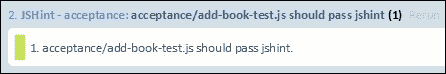

# 第八章。日志、调试和测试

在这一章中，我们将介绍以下配方：

+   使用 Ember.Logger

+   使用 Ember 检查器

+   验证弃用和使用 Ember 检查器的先进功能

+   使用接受测试

+   使用单元测试

+   测试组件

+   测试路由

+   测试模型

+   测试控制器

# 简介

测试是 Ember 框架的一个重要部分。Ember 允许三种不同的测试分类——**接受**、**单元**和**集成**。

接受测试用于测试应用程序流程和交互。它模拟用户可能执行的动作。例如，这可能包括填写表单或导航到应用程序的不同部分。

单元测试用于测试功能的小块。这可能包括测试计算属性或检查不同元素标签的字段。

集成测试介于单元测试和接受测试之间。建议与组件测试一起使用。例如，集成测试与测试 UI 和控件效果良好。

为您的应用程序创建测试用例是一种良好的实践，特别是如果这个应用程序将在生产中使用。

# 使用 Ember.Logger

**Ember.Logger** 是 Ember 中一种强大的日志类型。它超越了 `imports.console` 的功能。在这个配方中，我们将查看一些示例，说明如何在您的应用程序中使用它。

## 如何做...

在这个项目中，我们将创建一个简单的程序，演示如何使用一些 `Ember.logging` 功能：

1.  在一个新程序中，添加一个新的 `index` 路由：

    ```js
    $ ember g route index

    ```

    这将创建一个新的 `index` 路由。

1.  编辑 `routes` 文件夹中的 `index.js` 文件。添加一些新的日志：

    ```js
    // app/routes/index.js
    import Ember from 'ember';
    const {Logger}= Ember;
    export default Ember.Route.extend({
        model(){
          Logger.log('log');
          Logger.info('info', 'more stuff');
          Logger.error('error');
          Logger.debug('debug');
          Logger.warn('warn');
          Logger.assert(true === false);
          return {};
        }
    });
    ```

    `Ember.logging` 提供了五种不同的日志选项。所有这些不同类型的 `log` 方法都接受一个或多个参数。当写入浏览器控制台窗口时，每个参数将被连接在一起，并用空格分隔：

    ```js
    Logger.log('log');
    ```

1.  这是 Ember 中日志的基本形式。它只是将值记录到浏览器控制台：

    ```js
    Logger.info('info', 'more stuff');
    ```

    `info` 记录器将消息作为 `info` 消息记录到控制台。在 Firefox 和 Chrome 中，旁边会显示一个小的 **I** 图标：

    ```js
    Logger.error('error');
    ```

    `error` 日志以带有 **错误** 图标的红色文本和堆栈跟踪的形式打印到控制台。

    ```js
    Logger.debug('debug');
    ```

    `debug` 日志以蓝色文本打印到控制台。

    ```js
    Logger.warn('warn');
    ```

    警告日志将以带有 **警告** 图标的格式打印到控制台。

    ```js
    Logger.assert(true === false);
    ```

    如果返回值是 `false`，则 `assert` 语句将返回错误和堆栈跟踪。

1.  启动 Ember 服务器并打开 **控制台**。这是它在 Chrome 中的外观截图：

## 它是如何工作的...

Ember.Logger 是一个更强大的控制台记录器。它是一个强大的日志工具，可以简化调试。Ember.Logger 是 Ember CLI 包内建的。

# 使用 Ember 检查器

Ember 检查器是您浏览器的一个插件，可以帮助您调试 Ember 应用程序。在这个配方中，我们将查看一些示例，说明如何使用它。

## 准备工作

在开始之前，你必须安装附加组件。它适用于 Chrome、Firefox 或 Opera。其他浏览器如 Internet Explorer 也可以通过 `bookmarklet` 使用。

1.  安装 Ember Inspector 的浏览器附加组件：

    +   对于 Firefox，从以下网站安装附加组件：[`addons.mozilla.org/en-US/firefox/addon/ember-inspector/`](https://addons.mozilla.org/en-US/firefox/addon/ember-inspector/)

    +   在 Chrome 中，从 Chrome 网上应用店安装附加组件：[`chrome.google.com/webstore/detail/ember-inspector/bmdblncegkenkacieihfhpjfppoconhi`](https://chrome.google.com/webstore/detail/ember-inspector/bmdblncegkenkacieihfhpjfppoconhi)

    +   所有其他浏览器请访问 Ember Inspector 的 GitHub 页面以获取进一步说明：[`github.com/emberjs/ember-inspector`](https://github.com/emberjs/ember-inspector)

1.  为了我们食谱的目的，我们将使用 Ember CLI Mirage 返回一个简单的 `school` 模型。在创建新项目后，运行此命令：

    ```js
    $ ember install ember-cli-mirage
    $ ember g factory school

    ```

    这将安装所有必要的文件，以便我们可以模拟 HTTP 服务器。

1.  在安装了 Ember CLI Mirage 的附加组件后，更新 `mirage` 文件夹中的 `config.js` 文件：

    ```js
    // app/mirage/config.js
    export default function() {

        this.get('/schools');
    }
    ```

    这将为我们的 Ember 客户端在检索学校信息时连接的 HTTP GET 路由添加。

1.  更新 `mirage/factories/` 文件夹中名为 `school.js` 的文件，用于学校信息：

    ```js
    // app/mirage/factories/school.js
    import Mirage, {faker}  from 'ember-cli-mirage';

    export default Mirage.Factory.extend({

        name:faker.name.firstName,       // using faker
        city: faker.address.city,
    });
    ```

    此文件将用于生成我们虚构学校的假名字和城市数据。

1.  更新 `default.js` 文件：

    ```js
    // app/mirage/scenarios/default.js
    export default function( server ) {

        server.createList('school', 2);
    }
    ```

    这将为我们的应用程序从工厂中生成所需的数据。

1.  生成 `index` 路由、`model` 和 REST `adapter`：

    ```js
    $ ember g route index
    $ ember g model school name:string city:string
    $ ember g adapter application

    ```

    这些文件将用于我们的应用程序，我们将在下一节中讨论。

## 如何操作...

此应用程序的目的是返回学校列表。我们将使用 Ember Inspector 来更详细地查看这些数据。

1.  打开 `adapters` 文件夹中的 `application.js` 文件。验证 `RESTAdapter` 是否已设置：

    ```js
    // app/adapters/application.js
    import DS from 'ember-data';

    export default DS.RESTAdapter.extend({
    });
    ```

    这告诉 Ember 使用 Ember Data 的 REST 适配器。回顾 第七章，*Ember 模型和 Ember Data*，以刷新 Ember Data 的知识。

1.  编辑 `models` 文件夹中的 `school.js` 文件：

    ```js
    // app/models/school.js
    import DS from 'ember-data';

    export default DS.Model.extend({
        name: DS.attr('string'),
        city: DS.attr('string')
    });
    ```

    此模型有两个属性，`name` 和 `city`。

1.  更新 `app/templates` 文件夹中的 `index.hbs` 文件：

    ```js
    // app/templates/index.hbs
    {{outlet}}

    {{#each model as |schoolName|}}
        Name:{{schoolName.name}}<br>
        City:{{schoolName.city}}<br>
        <br>
    {{/each}}
    ```

    `each` 辅助函数将遍历返回的每个模型并显示学校信息。

1.  更新 `app/routes` 文件夹中的 `index.js` 文件：

    ```js
    // app/routes/index.js
    import Ember from 'ember';

    export default Ember.Route.extend({
        model() {
          return this.store.findAll('school');
        }
    });
    ```

1.  运行 `ember server` 并你会看到学校列表，如下图所示：

1.  让我们打开 Ember Inspector 看看它显示了什么。在 Chrome 中，你可以通过打开控制台并点击 **Ember** 选项卡来访问它：

    Ember Inspector 显示 **视图树**、**路由**、**数据**、**弃用**和 **信息**。

1.  在 Ember Inspector 中点击 **Info**：

    信息显示在此应用程序中加载的所有库信息。这有助于了解所有内容使用的是哪个版本。

1.  在 Ember 检查器中点击**视图** **树**：

    **视图树**显示了有关应用程序的各种信息。它显示了当前的路由、模板、模型等。这有助于确定当前屏幕上加载了什么。

1.  在 Ember 检查器中点击**路由**：

    **路由**显示所有可用的路由、控制器和模板。一些路由可能尚未定义，但将显示，例如**加载**。

1.  点击**index**路由旁边的**$E**：

    在检查器中，您可以通过点击**$E**来分配实例变量。

1.  打开控制台并使用实例变量**$E**添加新记录：

1.  您可以在浏览器的控制台窗口中键入以下内容：

    ```js
    $E.store.createRecord('school',{name: 'Test School', city: 'Reno'});

    ```

    这将在您的数据存储中添加一条新记录。页面将自动更新此信息。这非常有价值。您可以在任何地方使用它来帮助调试问题。

1.  点击**数据**以查看所有模型数据：

    可选地，您可以点击这些数据中的任何一个并验证其属性。您也可以进行更改，并且它将自动更新到屏幕上。

# 验证弃用和使用 Ember 检查器的高级功能

在本食谱中，我们将使用 Ember 检查器的先进功能来探索弃用。

## 如何操作...

弃用警告将在弃用部分显示。请检查此选项以确保您的应用程序中没有弃用内容。如果列出弃用，它将有一个您可以点击的链接，以查看您需要做什么来修复它：


## 工作原理...

Ember 检查器旨在使创建和调试 Ember 应用程序变得更加容易。它被创建为大多数现代网络浏览器的插件。它显示您当前应用程序的信息、路由、模板、数据等。

它是一个开源插件，并有一个活跃的开发者社区支持。新功能正在不断添加。要请求您自己的功能，请查看以下 GitHub 页面：[`github.com/emberjs/ember-inspector`](https://github.com/emberjs/ember-inspector)

# 使用接受测试

接受测试通常有助于测试工作流程并模拟用户交互。在本食谱中，我们将探讨创建几个简单的接受测试。

## 如何操作...

1.  在新应用程序中，创建一个名为`book-shelf`的新组件和一个名为`add-book-test.js`的新接受测试：

    ```js
    $ ember g component book-shelf
    $ ember g acceptance-test add-book

    ```

    这将为`book-shelf`组件和`add-book`接受测试创建必要的代码。请注意，将为`book-shelf`组件生成一个集成测试。在本示例中，我们不会更新集成测试。

1.  使用新的`books`数组和新的操作更新组件文件：

    ```js
    // app/components/book-shelf.js
    import Ember from 'ember';

    export default Ember.Component.extend({
        books: Ember.A([{name: 'Moby Dick'}]),
        actions: {
          add(val) {
            this.get('books').addObject({name:val});
          }
        }
    });
    ```

    此组件使用 `books` 属性来跟踪书架上的书籍。`books` 属性是一个 Ember 对象数组。`add` 动作将另一个对象添加到数组中。使用 `Ember.A` 声明 Ember 数组。

1.  更新 `book-shelf.hbs` 组件模板文件：

    ```js
    // app/templates/components/book-shelf.hbs
    {{input value=val}}
    <button {{action 'add' val}}>Push Me</button><br>
    <ul>
    {{#each books as |book|}}
        <li>{{book.name}}<br></li>
    {{/each}}
    </ul>
    ```

    组件列出所有书籍。它还有一个 `input` 辅助器和 `button`。按钮有一个名为 `add` 的动作，在点击事件上被触发。它将 `input` 辅助器的值作为参数传递给 `action`。

1.  将 `book-shelf` 组件添加到应用程序文件：

    ```js
    <h2 id="title">Welcome to Ember</h2>
    {{book-shelf}}
    {{outlet}}
    ```

    此代码将 `book-shelf` 组件添加到应用程序模板中。

1.  将测试代码添加到 `add-book-test.js` 文件：

    ```js
    // app/tests/acceptance/add-book-test.js
    import { test } from 'qunit';
    import moduleForAcceptance from 'example3/tests/helpers/module-for-acceptance';

    moduleForAcceptance('Acceptance | add book');

    test('visiting / and adding book', function(assert) {
        visit('/');
        fillIn('input','My new book');
        click('button');
        andThen(function() {
          assert.equal(currentURL(), '/');
          assert.equal(find('li:last').text(),'My new book');

        });

    });
    ```

    这个验收测试访问应用程序的根目录 `/`。然后，它向 `input` 辅助器添加新文本并点击 `button`。然后检查 URL 和模板，以确保文本已被添加。

    顶部的代码大多是样板代码。测试在底部，可以按步骤进行。`visit`、`fillIn`、`click` 和 `andThen` 辅助器都是异步测试辅助器。

    ### 注意

    以下是一个所有异步和同步测试辅助器的列表：

    +   `click(selector)`: 这将点击一个元素并触发相应的动作，并在异步行为完成后返回一个承诺

    +   `fillIn(selector, value)`: 这将使用给定的值填充选定的输入，并在所有异步行为完成后返回一个承诺

    +   `keyEvent(selector, type, keyCode)`: 这在元素上模拟 `keypress`、`keydown` 或 `keyup`

    +   `triggerEvent(selector, type, options)`: 这将在由 `selector` 标识的元素上触发给定的事件

    +   `visit(url)`: 这将访问由 URL 给定的路由，并在所有异步行为完成后返回一个承诺

    +   `currentPath()`: 这将返回当前路径

    +   `currentRouteName()`: 这将返回当前激活的路由

    +   `currentURL()`: 这将返回当前 URL

    +   `find(selector, context)`: 这将从应用程序的根元素开始查找元素；可选地，您可以添加一些上下文

1.  运行 `ember server` 并访问 `/tests` URL。此 URL 将显示所有正在运行的测试。查找添加书籍的验收测试：

1.  这个验收测试表明一切通过。或者，您也可以在命令行上运行测试：

    ```js
    $ ember test –server

    ```

1.  这将弹出一个屏幕，以便您可以在控制台中运行测试。要使用此功能，您必须首先导航到 `localhost` 的 `7357` 端口。然后，此屏幕将刷新以显示通过测试的数量：

    每个测试都将进行检查，并且任何失败的测试都将显示在此屏幕上。在文件更改后，测试将被重新运行。

## 它是如何工作的...

接受测试用于测试用户交互和流程。这是通过 Ember 的 QUnit 测试框架完成的，尽管可以使用第三方插件支持其他测试框架。您可以导航到 `/tests` URL 或在服务器上运行 `ember test` 来执行测试用例。

# 使用单元测试

单元测试用于测试较小的功能块。在这个菜谱中，我们将看到一个例子。

## 如何操作...

在这个例子中，我们将创建一个简单的 `Ember.Object`，并带有计算属性。我们将测试这个计算属性并断言返回的值是否正确。

1.  在一个新项目中，在 `models` 文件夹中创建一个新的 `first-last.js` 文件：

    ```js
    // app/models/first-last.js

    import Ember from 'ember';

    export default Ember.Object.extend({
        firstName: 'John',
        lastName: 'Smith',
        fullName: Ember.computed('firstName', 'lastName', function() {
          const firstName = this.get('firstName');
          const lastName= this.get('lastName');
          return `Full Name: ${firstName} ${lastName}`;
        })
    });
    ```

    在此文件中，我们有两个属性，`firstName` 和 `lastName`。计算属性 `fullName` 将这两个属性组合起来并返回一个全名。如果这些属性中的任何一个发生变化，计算属性将会触发。

1.  创建一个新的单元测试来检查 `Ember.Object` 和 `computed` 属性：

    ```js
    $ ember g model-test first-last

    ```

    生成的 `model-test` 单元测试将在 `/tests/unit/models` 目录中创建一个新的测试文件。

1.  更新 `first-last-test.js` 文件，添加一个新的单元测试来检查计算属性是否返回正确的值：

    ```js
    // tests/unit/models/first-last-test.js

    import { moduleFor, test } from 'ember-qunit';

    moduleFor('model:first-last', 'Unit | Model | fullName', {
        unit: true
    });

    test('check computed property fullName', function(assert) {
        const firstLast= this.subject();
        firstLast.set('firstName','Erik');
        firstLast.set('lastName','Hanchett');
        assert.equal(firstLast.get('fullName'), 'Full Name: Erik Hanchett');
    });
    ```

    `moduleFor` 是由 `ember-qunit` 提供的单元测试辅助工具。这有助于我们获取用于查找和实例化的模型。`unit: true` 属性将测试用例标记为单元测试。由于我们使用 `moduleFor`，我们可以使用 `this.subject()` 实例化 `firstLast` 对象。然后测试设置计算属性的 `firstName` 和 `lastName` 并进行 `assert` 以确保它们相等。

1.  运行 `ember server` 并检查 `/tests` URL 的输出：

    输出显示单元测试已通过

1.  更新 `first-last-test.js` 文件，使用错误的值：

    ```js
    // tests/unit/models/first-last-test.js
    …
    test('check computed property fullName', function(assert) {
        const firstLast= this.subject();
        firstLast.set('firstName','Erik');
        firstLast.set('lastName','Hanchett');
        assert.equal(firstLast.get('fullName'),'Full Name: Erik wrong');
    });
    ```

    我们更新了代码，所以现在测试将失败，因为文本不匹配。

1.  导航到 `/tests` 文件夹并查看输出：

    现在测试失败，因为文本不匹配。您可以通过导航到 `/tests` 文件夹或从命令行运行 `ember test` 来查看此输出。

## 工作原理...

单元测试用于测试小块代码或功能。它们是 Ember QUnit 库的一部分。单元测试可以运行您应用程序中的几乎所有内容，包括模型、组件或控制器。

# 测试组件

应该使用集成测试来测试组件。在这个菜谱中，我们将查看一个简单示例，该示例是一个改变文本大小的组件。

## 如何操作...

1.  在一个新应用中，创建一个名为 `font-sizer` 的新组件：

    ```js
    $ ember g component font-sizer

    ```

    这将生成一个名为 `font-sizer` 的新组件。此组件将用于调整文本大小。

1.  更新 `components` 文件夹中的 `font-sizer.js` 文件：

    ```js
    // app/components/font-sizer.js
    import Ember from 'ember';

    export default Ember.Component.extend({
        textInfo: 'Hello World',
        attributeBindings: ['style'],
        style: Ember.computed('size',function() {
          const size = this.get('size');
          return new Ember.Handlebars.SafeString("font-size: "+ size);
        })

    });
    ```

    所有组件都在模板内部以`div`标签的形式渲染。如果需要，我们可以向这些`div`标签添加不同的属性。在这种情况下，`attributeBindings`属性将添加一个`style`标签。`style`标签将是一个计算属性，每当`size`值更改时都会更新。`Ember.Handlebars.SafeString`让 Ember 知道字符串应该以不转义的形式显示，并且它是安全的。

1.  使用新组件更新`application.hbs`文件：

    ```js
    // app/templates/application.hbs
    <h2 id="title">Welcome to Ember</h2>

    {{#font-sizer size="38px" }}
        Test
    {{/font-sizer }}
    {{outlet}}
    ```

    `font-sizer`组件是块形式的。测试文本将在`div`块中。

1.  更新`font-sizer-test.js`文件，以便我们可以检查确保属性已被添加：

    ```js
    // tests/integration/components/font-sizer-test.js
    import { moduleForComponent, test } from 'ember-qunit';
    import hbs from 'htmlbars-inline-precompile';

    moduleForComponent('font-sizer', 'Integration | Component | font sizer', {
        integration: true
    });

    test('check attributes', function(assert) {

        this.render(hbs`{{font-sizer size=val}}`);
        this.set('val','38px');
        assert.equal(this.$('div').attr('style'),'font-size: 38px', 'size is set to 38px');

    });
    ```

    当我们创建组件时，此代码会自动为我们生成。`moduleForComponent`辅助函数用于组件。`integration`: `true`标签将此测试标记为集成测试。通过这样做，我们能够渲染组件并将`size`属性传递给它。使用`assert.equal`方法来检查`font-size`是否设置正确。

1.  运行`ember server`并检查`/tests`：

    测试用例通过

### 在字体大小组件中测试操作

我们可以模拟操作并测试结果以验证预期结果。

1.  使用现有应用程序，更新`font-sizer.js`文件以添加新操作：

    ```js
    // app/components/font-sizer.js
    …
        textInfo: 'Hello World',
        }),
        actions: {
          updateText(){
            this.set('textInfo','Hi');
          }
        }

    });
    ```

    此新操作将`textInfo`属性设置为`'Hi'`。

1.  更新`components`文件夹中的`font-sizer.js`文件：

    ```js
    // app/templates/components/font-sizer.hbs
    <div id='info'>{{textInfo}}</div><br>
    {{yield}}<br>
    <button {{action 'updateText'}}>Update Text</button>
    ```

    在这个模板中，我们创建了一个新的`div`标签，其 ID 为`info`，围绕`textInfo`属性。为`button`点击添加了一个新的`updateText`操作。此操作更新`textInfo`属性。

1.  向`font-sizer-test.js`文件添加一个新测试，以便它可以检查添加的新操作：

    ```js
    // tests/integration/components/font-sizer-test.js
    …
    test('check action', function(assert) {

        assert.expect(2);
        this.render(hbs`{{font-sizer}}`);
        assert.equal(this.$('#info').text(), 'Hello World', |'starting text is hello world');
        this.$('button').click();
        assert.equal(this.$('#info').text(),'Hi', 'text changed   to hi');

    });
    ```

    通过设置`assert.expect(2)`，测试必须有两个断言，否则将失败。我们首先使用`this.render`辅助函数渲染组件。下一个语句检查`this.$('#info').text()`返回的值是否等于`Hello World`。然后我们模拟点击按钮。最后一个语句检查`this.$('#info').text()`是否等于`Hi`。

1.  运行`ember server`并导航到`/tests`。所有测试都将通过：

## 工作原理...

组件通过`moduleForComponent`辅助函数使用集成测试。Ember 的 QUnit 功能利用了 Ember 实际查看组件的方式。您可以测试绑定值以及返回的操作。

# 测试路由

测试路由可以通过验收测试或单元测试来完成。在这个例子中，我们将为路由创建一个简单的单元测试。

## 如何操作...

1.  在一个新应用程序中，生成一个新的`students`路由：

    ```js
    $ ember g route students

    ```

    此命令将为学生生成路由代码。

1.  编辑学生路由信息并添加一个新属性：

    ```js
    // app/routes/students.js
    import Ember from 'ember';

    export default Ember.Route.extend({
        someText: 'someText'
    });
    ```

    此路由有一个名为`someText`的属性。

1.  编辑`tests/unit/routes`文件夹中的`students-tests.js`文件：

    ```js
    // tests/unit/routes/students-test.js
    import { moduleFor, test } from 'ember-qunit';

    moduleFor('route:students', 'Unit | Route | students', {
        // Specify the other units that are required for this test.
    });

    test('check prop and route exists', function(assert) {
        let route = this.subject();
        assert.expect(3);
        assert.equal(route.get('someText'),'someText');
        route.set('someText','otherText');
        assert.equal(route.get('someText'),'otherText');
        assert.ok(route);
    });
    ```

    在这个例子中，我们正在检查 `someText` 属性的输出。第一个 `assert.equal` 获取属性并检查它是否与 `someText` 值匹配。路由实例也可以设置属性。下一个断言检查新值是否已设置。最后的断言确保路由可用。

1.  运行 `ember server` 并导航到 `/tests`：

    这表明所有测试都通过了

## 它是如何工作的...

在你的 Ember 应用程序中，路由有几个不同的功能。它可以存储你的模型数据，并具有属性和操作。当测试路由时，我们可以使用它进行更通用的验收测试或作为单独的单元测试。

# 测试模型

当测试模型时，你可以使用 Ember Data 来帮助。在这个菜谱中，我们将创建一个模型并测试以确保它正确地创建数据。

## 如何做...

1.  在一个新应用程序中，生成一个新的学生模型：

    ```js
    $ ember g model student.js

    ```

    这将生成学生模型所需的所有文件。

1.  更新学生模型，添加两个属性：

    ```js
    // app/models/student.js
    import DS from 'ember-data';

    export default DS.Model.extend({
        firstName: DS.attr('string'),
        lastName: DS.attr('string')
    });
    ```

    这个模型有两个属性，`firstName` 和 `lastName`。两者都持有 `string` 类型的值。

1.  为新模型添加一个新的单元测试，以测试新属性：

    ```js
    // tests/unit/models/student-test.js
    import { moduleForModel, test } from 'ember-qunit';

    moduleForModel('student', 'Unit | Model | student', {
        // Specify the other units that are required for this test.
        needs: []
    });

    test('it exists', function(assert) {
        let model = this.subject();
        assert.ok(!!model);
    });

    test('Test model data', function(assert) {
        assert.expect(2);
        let model = this.subject({firstName: 'Erik', lastName: 'Hanchett'});
        assert.equal(model.get('firstName'),'Erik', 'first Name is Erik');
        assert.equal(model.get('lastName'),'Hanchett', 'last Name is Erik');
    });
    ```

1.  这个测试使用 `moduleForModel` 辅助函数。第一个测试检查模型是否正常存在。第二个测试检查属性：

    ```js
    …
    test('Test model data', function(assert) {
        assert.expect(2);
        let model = this.subject({firstName: 'Erik', lastName: 'Hanchett'});
        assert.equal(model.get('firstName'),'Erik', 'first Name is Erik');
        assert.equal(model.get('lastName'),'Hanchett', 'last Name is Erik');
    });
    ```

    在创建 `model` 实例时，你可以传递 `model` 属性的值。在这种情况下，在存储中创建了一个 `{firstName: 'Erik', lastName: 'Hanchett'}` 对象。我们可以使用 `model.get` 方法访问这些值。`assert.equal` 方法与模型进行比较，以确保值匹配。

1.  运行 `ember server` 并导航到 `/tests`，你会看到通过测试的测试：

    这表明两个测试都通过了

## 它是如何工作的...

`moduleForModel` 辅助函数用于访问 Ember 的模型信息。这是通过 Ember Data 实现的，以便可以测试模型。Ember 的 QUnit 提供了一种完全测试模块的方法。

# 测试控制器

应该在你的应用程序中测试控制器。在这个菜谱中，我们将测试一些来自控制器的基本操作。

## 如何做...

1.  创建一个新的 `index` 控制器：

    ```js
    $ ember g controller index

    ```

    这创建了一个名为 `index` 的新控制器。

1.  在索引控制器中，添加一个新的属性和操作：

    ```js
    // app/controllers/index.js
    import Ember from 'ember';

    export default Ember.Controller.extend({
        myValue: 'value',
        actions:{
          pressed(value){
            this.set('myValue',value);
          }
        }
    });
    ```

    这个控制器有一个名为 `myValue` 的属性。另一个名为 `pressed` 的操作将 `myValue` 的值更改为函数中传入的任何值。

1.  更新索引单元测试。为操作和属性添加一些测试：

    ```js
    // tests/unit/controllers/index-test.js
    import { moduleFor, test } from 'ember-qunit';

    moduleFor('controller:index', 'Unit | Controller | index', {
        // Specify the other units that are required for this test.
        // needs: ['controller:foo']
    });

    // Replace this with your real tests.
    test('it exists', function(assert) {
        let controller = this.subject();
        assert.ok(controller);
    });

    test('check property', function(assert) {
        assert.expect(2);
        let controller = this.subject();
        assert.equal(controller.get('myValue'),'value');
        controller.send('pressed','newValue');
        assert.equal(controller.get('myValue'),'newValue');
    });
    ```

1.  这里使用 `moduleFor` 辅助函数来测试控制器。第一个测试确保控制器存在：

    ```js
    …
    test('check property', function(assert) {
        assert.expect(2);
        let controller = this.subject();
        assert.equal(controller.get('myValue'),'value');
        controller.send('pressed','newValue');
        assert.equal(controller.get('myValue'),'newValue');
    });
    ```

    这个测试使用`this.subject`创建了一个控制器实例。检查初始值以确保其正确性。要向控制器发送动作，调用`controller.send`方法。发送方法可以接受一个或多个参数。第一个是触发动作的名称。之后是应该传递给方法的任何值。

1.  运行`ember server`并导航到`/tests`。这将显示通过测试：

    这条消息显示所有测试都通过了

## 它是如何工作的...

控制器测试与我们之前讨论的单元测试非常相似。它们使用 QUnit 的`moduleFor`辅助函数。在一个控制器中，我们可以测试属性或动作，并确保结果符合预期。
