# 1

# 工具腰带——每个超级英雄 SDET 需要的工具

这不是您普通的枯燥乏味的科技手册。这本书旨在有趣。这就是为什么许多章节都采用了漫画书主题。但与一些超级英雄不同，您不需要被放射性蜘蛛咬伤才能获得这些力量。我们只需要一些工具，利用 TypeScript 中的 WebdriverIO 创建一个伟大的框架。

如果您是刚开始作为 **软件测试开发工程师**（**SDET**）的旅程，您可能会想直接跳过，安装 TypeScript 编码环境，运行您的第一个测试，并希望看到 **通过**的结果。我自己也这样做过，但后来意识到有些工具我错过了，这些工具本可以帮助从开始就使旅程变得更轻松。这就是为什么第一章讲述了系统规格、工具和配置，这些将帮助我们从第一天开始编写更好的代码。

在此过程中，我将分享我作为 SDET 超过 20 年的经验和技巧。这里会有一些经验法则和高级技术。这些旨在帮助您编写更多测试，更有效地调试，并创建一个稳定、可扩展的测试框架，且代码维护量远低于其他框架。

本章涵盖的主要主题包括：

+   纯净机器设置

+   为您的操作系统安装 Visual Studio Code

+   使用 Prettier、ESLint 和 GitLens 编写更好的代码

+   安装 Chrome 扩展程序

+   安装 WebdriverIO

# 纯净机器设置

在您可以在纯净机器上的测试自动化世界中做任何事情之前，您必须安装一些包，因此您需要机器的管理员权限。所以，在继续之前，请确保您已经全局安装了以下包及其最稳定的版本：

+   NodeJS

+   Yarn

+   Java JDK

+   **集成开发环境**（**IDE**）（IntelliJ、VSCode 等等）

+   Git

如果您正在使用 Windows 机器，以下是一些额外的步骤：

+   为您的 node 设置 PATH 环境变量

+   重启机器以使所有更改生效

在我们运行第一个测试之前，我们需要检查系统要求并获取我们的工具。在本章中，我们将介绍如何安装和配置使我们的工作更轻松的工具，如下所示：

+   **硬件规格**

+   **Node.js**

+   **GitHub 账户**和 **GitHub Desktop** 用于代码变更管理

+   **Microsoft Visual** **Studio Code**

+   **Prettier**、**GitLens** 和 **ESLint 扩展**

+   **SelectorsHub** 和 **EditThisCookie** Chrome 扩展程序

注意，要安装这些工具，您需要本地管理员权限，或者认识您 IT 安全部门中拥有权限并能为您安装它们的人。没有本地管理员权限，您将无法取得进展。您应该拥有与产品开发团队相同的权限，您将测试他们的应用程序。

这就带我们来到了我们的第一个经验法则。

# 经验法则——硬件资源和访问权限必须与开发团队相匹配

在整本书中，我将提出一些我用来保持我们走在正确道路上的经验法则，并避开荆棘丛。

让我们谈谈为什么这很重要。一开始，你只需考虑你是否能安装 Chrome 扩展，就可以评估你的自动化项目是否会成功。如果你的企业 IT 安全部门阻止安装任何浏览器扩展，你的自动化进度将受到严重阻碍。我们都希望有一个成功的测试自动化项目。我们不想在起点就受到限制。*测试自动化是代码开发；它需要开发工具，而你就是一个开发者。*不要让任何人告诉你不同。

如果你的雇主或客户将你的项目视为仅仅是记录和回放，那么你的项目从一开始就注定要失败。这种情况的最大红旗是，你的计算机资源和访问权限与开发者的不匹配。

*问题：我的 WebdriverIO 测试自动化系统的技术规格要求是什么？*

答案很简单：*做*和*不做*：

*不要*使用互联网上任何地方列出的最低要求。无论是什么，都太小了。

*确实*要匹配 CPU 速度、RAM 数量、驱动器空间和桌面上显示器的数量。

这包括匹配开发团队使用的 Mac 或 Windows 操作系统的版本。Windows 应该是 64 位的，可能是专业版。

这还包括你的应用程序开发者的本地管理员权限。这允许你安装将节省团队时间的浏览器扩展。这意味着你可能需要提出一个商业案例来满足这一要求。

真的很简单：没有这些工具，你将花费时间手动编写定位器，并采取额外步骤来清除 cookies。项目将进展缓慢，公司将在相同的时间内为更少的测试支付更多费用。在极端情况下，你可能不得不放弃一个项目，并寻找一个愿意认真对待 QA 测试的新雇主。唯一的例外是如果你的应用程序开发者正在使用 Eclipse，这并不推荐用于专业级别的代码开发。

话虽如此，让我们首先安装 WebdriverIO 的工具，以确保我们朝着正确的方向前进。

我们将首先模仿两个拥有无限财富和卓越智慧的英雄。为了有效地打击犯罪，一个拥有多个工具的腰带，另一个则有一个带有 AI 智能的金属战衣，以帮助更快地将恶棍——或者在我们的情况下，是虫子——绳之以法。

## 安装 Node.js 和 npm

Node.js 是一个开源的、跨平台的运行时环境，也是一个用于在客户端浏览器之外运行 Web 应用的异步库。该项目使用 Node 版本 16.13.0 创建，出于几个原因。早期版本仅需要支持同步模式，这在 WebDriverIO 7.0 中已被弃用，并在版本 8.0 中被移除。尽管截至本文撰写时 Node 的最新版本是 19.8.1，但建议使用 16.13.0，因为它与大多数其他模块和包的兼容性最好。

确保您有足够的硬盘空间用于安装。安装至少需要 3 GB。默认情况下，这些工具安装在 `C:` 驱动器上。如果您的驱动器接近容量，请考虑在更大的驱动器分区上安装。

让我们从安装 Node 和 npm 开始。以下截图显示了如何进行操作：

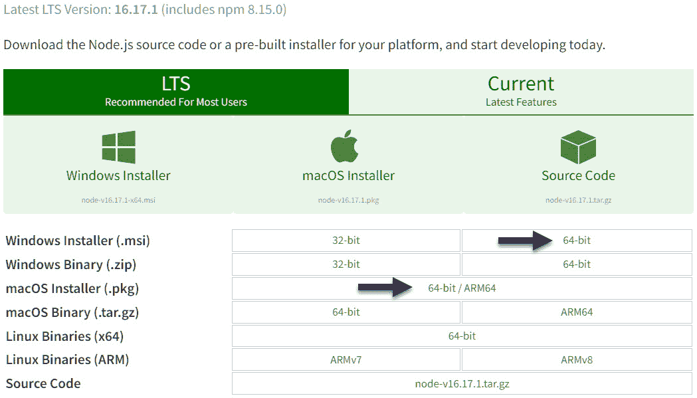

图 1.1 – 从 https://nodejs.org/en/download/ 下载 Node.js

对于 Mac，安装最新的 `.pkg` 文件。

对于 Windows，下载 64 位版本。

要安装的 Node.js 版本将是 `@wdio/sync` **同步模式**，它仅通过 Node.js 版本 12.0 得到支持且稳定。本书将使用 `async()` 和 `await()` 命令进行异步命令执行。

安装过程中还将安装以下内容：

+   **Chocolatey** 用于 Windows 或 **Brew** 用于 Mac，是一个包安装工具

+   **Python**

+   **Node.js**

+   **npm**

+   **必需** **系统更新**

提示

所有这些都需要管理员权限才能成功完成。

完成后，检查 Node.js 和 Chocolatey 路径是否已添加到系统的 `PATH` 环境变量中，如下面的截图所示。如果没有，它们必须手动添加：

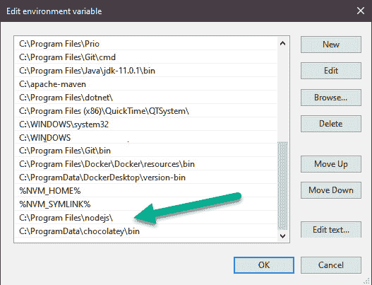

图 1.2 – Windows PATH 环境变量中的 Node.js 和 Chocolatey 路径

对于 Mac 和 Windows，我们将安装至少版本 18.0 的 Node。从命令行中，输入以下两个命令：

```js
> nvm install 18
Downloading node.js version 18.17.1 (64-bit)...
> nvm use 18
Now using node v18.17.1 (64-bit)
```

虽然这完成了 Node 的安装，但我们还需要注意提供额外选项的替代包管理器。

## 替代节点包管理器 – Yarn 与 npm 的比较

虽然 npm 是默认的节点包管理器，但我们推荐使用 Yarn 来安装包和运行程序。Yarn 的一个主要优点是它并行安装包。这显著减少了初始化或刷新 `package.json` 文件时的构建时间。

再次从命令行输入以下内容：

```js
> npm install --global yarn
```

安装 Yarn 后，您可以通过运行以下命令来验证安装：

```js
> yarn --version
1.19.22
```

完成这些后，我们将决定项目将存放在哪里。

## 使用 GitHub Desktop 配置编码环境

在接下来的章节中，我们将更深入地探讨 Git 和 GitHub 用于代码版本控制。但制定计划总是好的，因此我们将为我们的项目创建一个 Git 文件夹结构。

我们的 `wdio` 项目工作区将位于 Git `C:` 驱动器中。原因是 Node.js 项目依赖于许多支持包。这些将在 `node_modules` 文件夹中占用大量的额外空间。在某个时候，驱动器将被填满，影响响应速度。

让我们从在驱动器根目录或 Mac 上的桌面上创建一个 `\repos` 文件夹开始，以存放我们的项目：

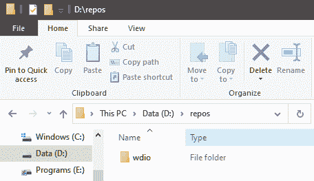

图 1.3 – 示例仓库和项目目录结构

我们的项目将位于名为 `\wdio` 的本地仓库中。这是我们存储文件的地方。稍后，我们将使用代码仓库进行版本控制，例如**GitHub**、**GitLab**和**Bitbucket**。对于这本书，我们将使用 GitHub，GitHub Desktop 将是我们的代码提交工具。

## GitHub 和 GitHub Desktop 工具

所有开发者都需要的一个工具是代码版本控制。这将是任何你加入的团队的要求，并且他们期望你了解 Git 命令。学习语法和命令对新程序员来说可能是一个挑战。在命令提示符中输入的错误可能在任何时刻发生，而知道如何解决这些问题可能是一个更大的挑战。

然而，有一个更简单的方法可以使生活变得更美好。使用**GitHub Desktop**工具进行代码提交，可以直观地了解代码更改。你可以检查它使用的 Git 命令，以学习如何使用终端窗口并减少错误。

首先，我们需要一个 GitHub 账户。

## 获取 GitHub 账户

访问 [www.github.com](http://www.github.com) 并点击**注册**。输入电子邮件、密码和用户名，并验证您的账户。

在账户设置过程中，选择**自动化和 CI/CD**选项。这将配置项目，使其能够在一天或一周中的特定时间自动触发执行：


图 1.4 – 自动化和 CI/CD 配置

现在我们有一个免费的公共 GitHub 账户来练习提交和版本控制。现在，转到您的 GitHub 页面，创建一个带有 README 文件的 `wdio` 仓库。请注意，免费 GitHub 账户是公开的。在专业工作中，最好是你或你的雇主购买付费计划以使仓库私有：

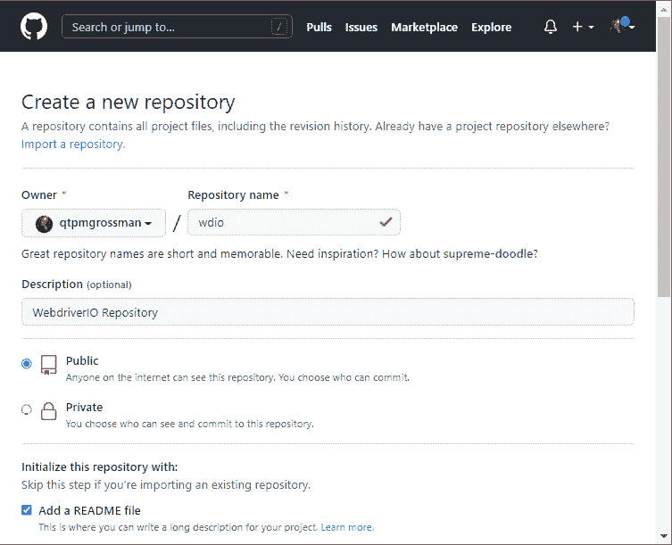

图 1.5 – 使用 GitHub 的 README 文件初始化 wdio 项目仓库

我们现在有了 GitHub 账户仪表板。它提供了安装额外工具的建议：

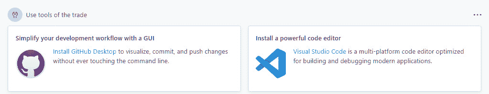

图 1.6 – GitHub 中的链接以安装 GitHub Desktop 和 Visual Studio Code

从这里，我们将添加 GitHub Desktop 和 Visual Studio Code IDE。首先，我们将安装 GitHub Desktop。

## 安装 GitHub Desktop

[从 [`desktop.github.com/`](https://desktop.github.com/) 下载 GitHub Desktop](https://desktop.github.com/)

GitHub Desktop 的安装非常简单。只需下载适用于您操作系统的安装程序并启动它。一旦过程完成，GitHub Desktop 将启动：

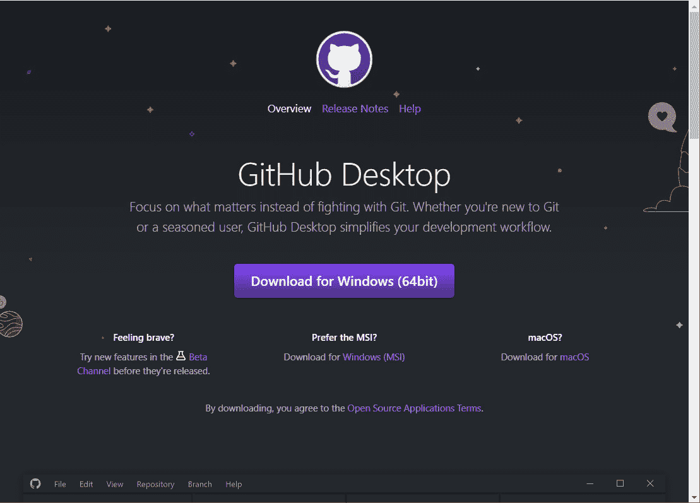

图 1.7 – 为您的操作系统下载 GitHub Desktop

如果你曾经看过 Git 的入门级命令行视频，学习所有这些复杂的命令可能会让你脊背发凉。这可能会激发出恐惧，如果在不先从其他团队成员那里拉取更改的情况下提交更改，团队项目可能会被破坏。这就是为什么对于初学者来说，GUI 比打印的 Git 技巧表更好——它可以在学习 Git 命令时防止错误。以下是一个例子：

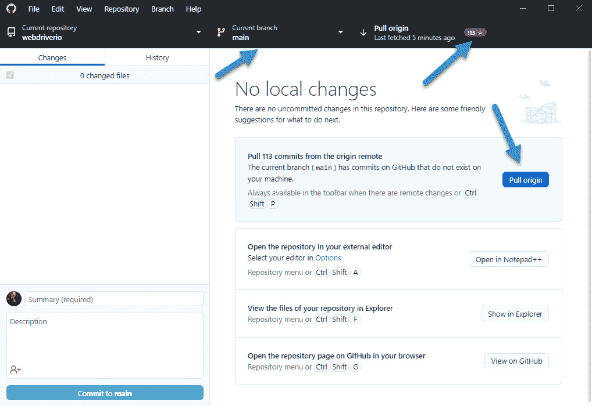

图 1.8 – GitHub Desktop 显示在提交操作之前应该拉取的挂起更改

在速度和准确性方面，图形界面工具比命令行界面更推荐。在先前的例子中，我们知道我们处于 `webdriverio` 仓库的 `main` 分支，并且项目已从其他团队成员那里提交了更改，一个大的蓝色 **拉取来源** 按钮提醒我们首先拉取其他团队成员已提交的更改。跳过此步骤可能会撤销代码更改，造成麻烦。

GitHub Desktop 的 **历史** 视图提供了最近提交的描述。它告诉我们哪些文件被更改了，以及旧代码行和新代码行之间的差异：

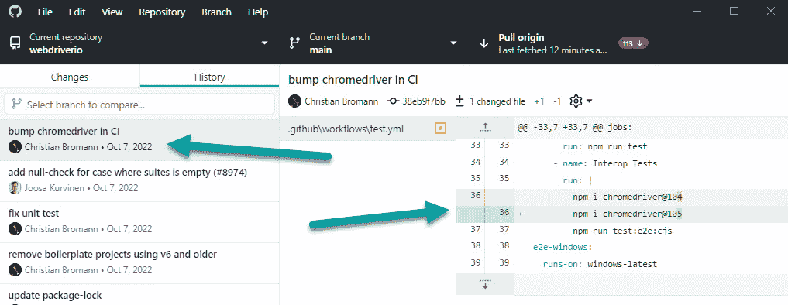

图 1.9 – GitHub Desktop 的历史视图显示旧的和新的代码更改

通过单击一个按钮执行代码提交比在终端窗口中键入要快。我们将很快链接我们的项目。接下来，我们将安装我们的编码环境工具。

## 选择你的 TypeScript 开发环境 – 微软 Visual Studio Code 与 JetBrains Aqua

在开发一个健壮框架的旅途中，我们需要做出许多决定，其中之一是选择哪个 IDE 来编写和运行我们的代码。我个人的偏好是使用 Visual Studio Code，因为它在多个视图中编码更容易。

然而，截至本文撰写时，JetBrains Aqua 仅支持在从配置启动脚本时设置断点。当从嵌入的终端窗口启动测试脚本时，它不会在断点处暂停。这就是我们将运行我们的 WebdriverIO 脚本的方式。由于 Visual Studio Code 是开源的，因此将是这些项目的首选工具，但我仍然建议您尝试 JetBrains Aqua，因为它拥有优越的代码界面设计。

**Microsoft Visual Studio Code**是本书的免费 IDE，并得到了强大的公司支持。然而，许多免费工具缺乏收入来源来支持开发团队或产品支持团队。免费工具在功能上可能比付费工具落后几年。以 Selenium 为例，它在 2019 年 5 月发布的 4.0 版本中引入了相对元素定位，而这一功能在大多数付费工具集中都已有，包括 Micro Focus **Unified Functional Testing** (**UFT**)，它可以追溯到 2010 年。

# 为您的操作系统[安装 Visual Studio Code](https://code.visualstudio.com/download)

[从](https://code.visualstudio.com/download) [`code.visualstudio.com/download`](https://code.visualstudio.com/download) 下载 Visual Studio Code。

按照您操作系统的安装过程进行安装。再次提醒，建议将这些工具安装在一个大于`\repos`目录的较大驱动器上。

现在 Visual Studio 已经安装，我们可以从嵌入的终端外壳窗口检查 Node 和 npm 是否已安装。

从主菜单，选择**Terminal** > **New Terminal**，然后在 Windows 上按*Ctrl* + *Shift*，在 Mac 上按*^* + *Shift* + *`*。

启动测试的终端外壳取决于您的个人选择。**PowerShell**推荐给 Windows 用户，**ZSH**推荐给 Mac 用户，**Git Bash**对于命令行 Git 用户来说是个不错的选择。但是，对于调试，两个平台都需要**JavaScript Debug Terminal**。

从终端窗口，点击位于右下角**+**按钮旁边的**v**向下箭头，选择**JavaScript Debug Terminal**，并输入以下内容：

```js
node –v
npm -v
```

系统将响应您已安装的 Node 和 npm 的版本：

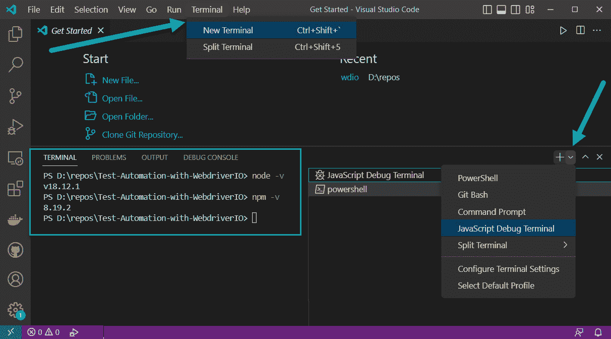

图 1.10 – 从 Visual Studio Code 中嵌入的终端外壳检查您已安装的 Node 和 npm 版本

注意，JavaScript Debug Terminal 的运行速度会比 PowerShell 或 Bash 外壳慢，因此最好只在需要停止在断点进行调试时使用它。接下来，我们将从 Visual Studio Code 初始化我们的项目。

## 初始化 Node 项目

现在我们已经安装了 Visual Studio Code 并创建了我们的项目工作区目录，我们可以检查 Node 是否已安装并初始化我们的项目。从终端导航到`/repos/wdio`文件夹，并输入以下命令：

```js
npm init -y
```

这将创建一个新的 Node `package.json` 文件，并带有默认配置：

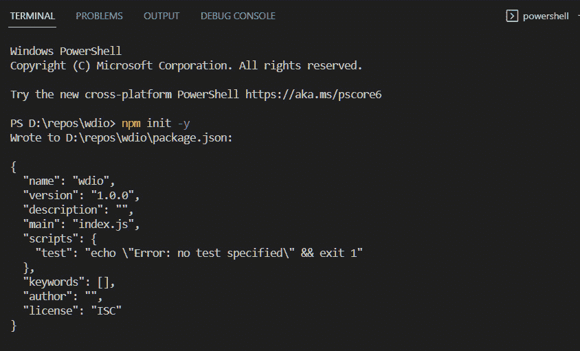

图 1.11 – 初始化 Node package.json 文件

此文件跟踪 WebdriverIO 使用以构建和自动化测试的所有支持 Node 包。

现在我们已经有了第一个项目文件，接下来，我们将配置编辑器设置以使编码更少出错。

## 配置 Visual Studio Code

第一个变化是 Visual Studio Code 将保存文件。默认情况下，从代码窗口切换到终端时不会发生隐式保存。由于我们的测试将从终端启动，我们想确保执行的是最新版本的代码。以下是我们可以如何配置它：

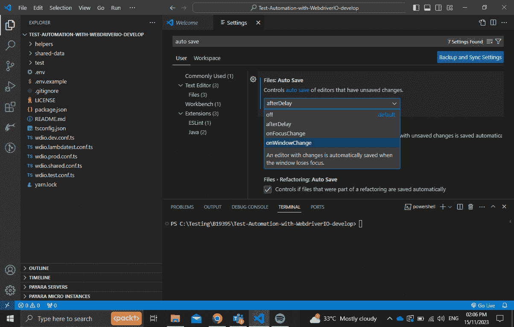

图 1.12 – 将 Visual Studio Code 设置为在焦点切换到终端窗口时保存文件

前往 `自动保存`。

将设置从 **afterDelay** 更改为 **onWindowChange**。

这将确保在从代码控制台切换到终端控制台时保存代码。这避免了代码已更新，但显示的结果却是使用未更改的代码执行的一个常见问题。

# X-ray vision – 使用 Prettier、ESLint 和 GitLens 编写更好的代码

开发者需要帮助他们的代码格式正确、遵循良好的编码实践，并知道团队成员何时进行代码更改的编码工具。这就是 Visual Studio Code 扩展如 Prettier、ESLint 和 GitLens 变得非常有价值的地方。让我们安装这些工具。

## 安装 Visual Studio Code 插件 – Prettier

从 **扩展** 图标添加 **Prettier 代码** **格式化器** 扩展：

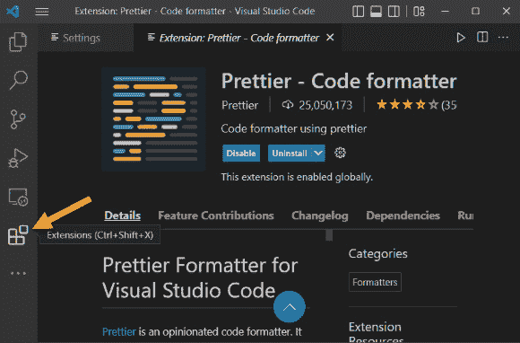

图 1.13 – 通过点击立方体图标可以访问扩展

Prettier 将自动格式化代码，而无需手动输入额外的制表符。在这个例子中，左侧的代码未格式化。现在我们可以通过右键单击代码并选择 **格式化文档** 来调用 Prettier：

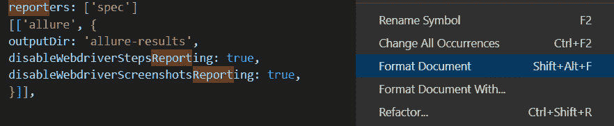

图 1.14 – Prettier 格式化前的代码示例

然后以结构化的方式重新格式化代码。请注意，方括号和大括号缩进，并且自动包含额外的行：

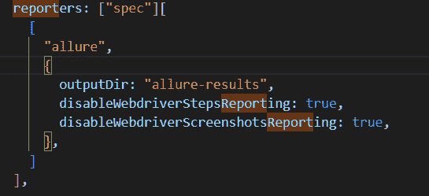

图 1.15 – Prettier 格式化的缩进代码

现在代码已格式化以供阅读。下一个扩展将帮助我们处理 GitHub 团队的工作。

## 安装 Visual Studio Code 插件 – GitLens

在许多其他功能中，GitLens 扩展将显示在我们 GitHub 仓库中最后进行代码更改的人。从 **扩展** 中添加 **GitLens** 扩展：

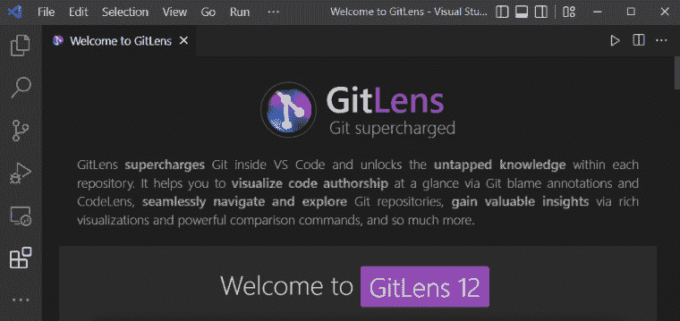

图 1.16 – GitLens 扩展

点击项目中任何跟踪文档的任何一行都会激活 GitLens：

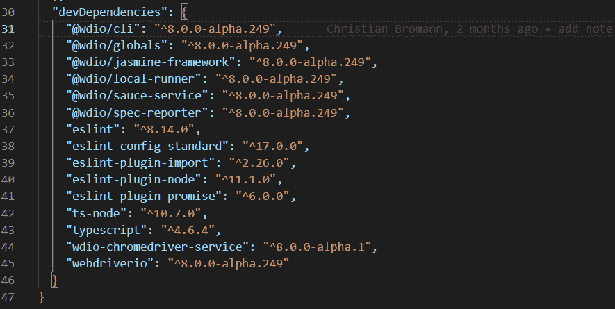

图 1.17 – GitLens 以灰色显示最后提交代码更改的人

在前面的示例中，我们可以看到第 31 行是在 2 个月前由 *Christian Bromann* 更新的。这使得了解代码行何时被更改、由谁更改以及多久以前变得很容易。

这个附加组件将帮助我们找到代码错误，以提高我们框架的可靠性。

## 安装 Visual Studio Code 附加组件 – ESLint

检查器是一个程序，它会在我们的代码中寻找潜在的问题，就像房间里角落里积累的灰尘。大多数编程语言都有检查器，ESLint 是一个 TypeScript 检查器。为什么是 ESLint 而不是 JSLint？**ES** 代表 **ECMAScript**，这是 JavaScript 的代码标准，旨在确保网页在不同浏览器之间的互操作性。截至本文撰写时，当前版本是 ES6。在搜索代码示例时，请注意代码片段是否为 ES5 或更早版本，因为近年来已经添加了新功能。

从 **扩展** 中添加 **ESLint** 扩展：

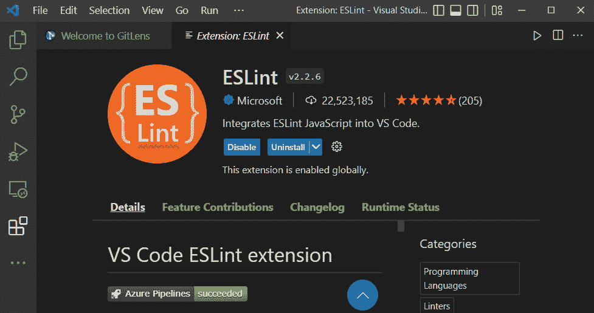

图 1.18 – ESLint ECMAScript 检查器扩展

ESLint 在 TypeScript 项目中查找并报告代码模式。目标是使代码更加一致，并提前避免错误。您可以在以下屏幕截图中看到它的使用情况：

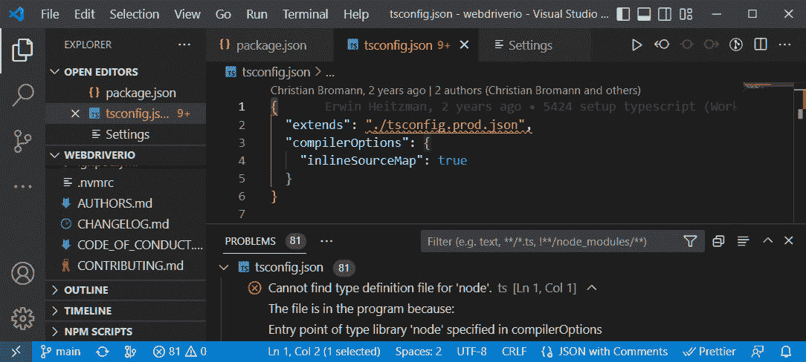

图 1.19 – ESLint 在 TypeScript 项目中报告 81 个潜在问题的示例

ESLint 提供了一个新的 **问题** 窗口，列出了改进我们代码库的问题和建议，随着我们增强框架，它还可以通过新的规则进行自定义。

*ECMAScript、JavaScript 和 TypeScript 之间的区别是什么？*

ECMAScript 是现代浏览器中发现的 JavaScript 语言定义，ES5 和 ES6 是最近的新描述。TypeScript 是 JavaScript 的超集，它向 JavaScript 添加了类型声明，就像 Java 一样。

现在我们已经配置了 Visual Studio Code，让我们为浏览器添加一些用于选择器和 cookie 的工具。

# 安装 Chrome 扩展

我们接下来的两个工具安装起来最为简单。**SelectorsHub** 允许我们在 Chrome、Edge 以及任何基于 Chromium 的浏览器中创建稳健的元素定位器，而 **EditThisCookie** 允许我们从浏览器前端清除 cookie 缓存。稍后，我们将确保框架会在每次新的测试执行前清除 cookies。

## 添加 SelectorsHub Chrome 扩展

在您的 Chrome 浏览器右上角，选择三个垂直省略号。然后，点击 **更多工具** 并然后 **扩展程序**。点击左上角的汉堡图标。最后，在左下角点击 **打开 Chrome 网上应用店**：

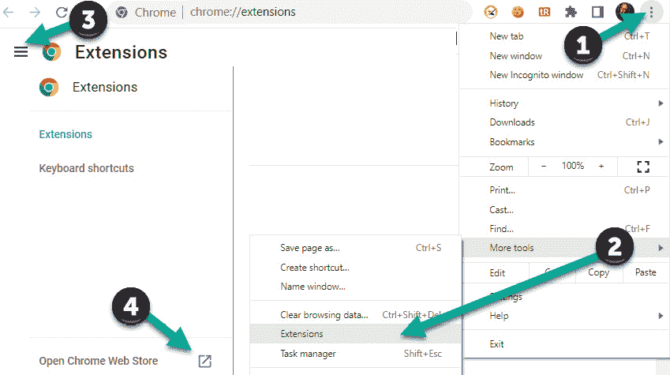

图 1.20 – 从 Chrome 网上应用店添加 Chrome 扩展程序

在 Chrome 网上应用店中，搜索并安装 **SelectorsHub** 扩展程序：

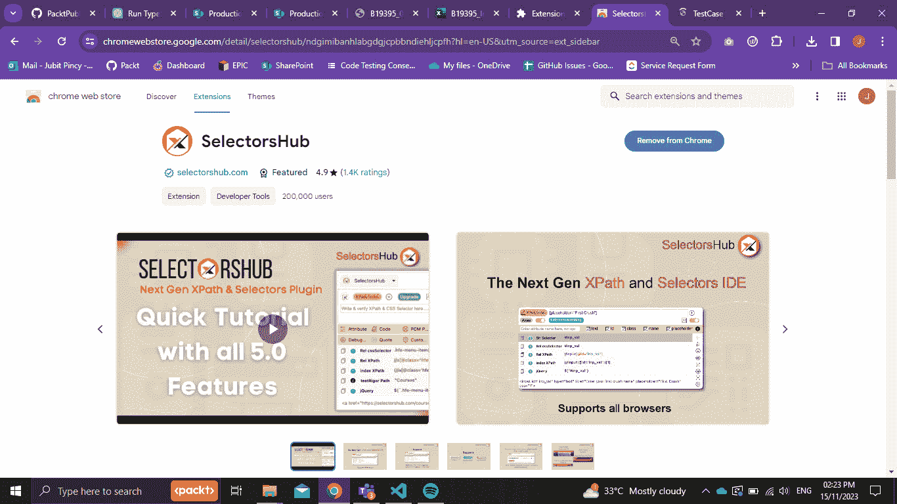

图 1.21 – SelectorsHub Chrome 扩展程序

一旦扩展程序安装完成，它应该被允许在 **隐身** 模式下交互。

在 **扩展程序** 页面，点击 **细节** 按钮，将 **允许在隐身模式下使用** 开关设置为开启：

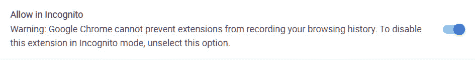

图 1.22 – 允许 SelectorsHub Chrome 扩展程序在隐身模式下显示

同样，我们将添加一个扩展程序，使清除我们的浏览器 cookies 更加快速。

## 添加 EditThisCookie Chrome 扩展程序

与之前的扩展程序一样，从 Chrome 网上应用店搜索 **EditThisCookie** 扩展程序：

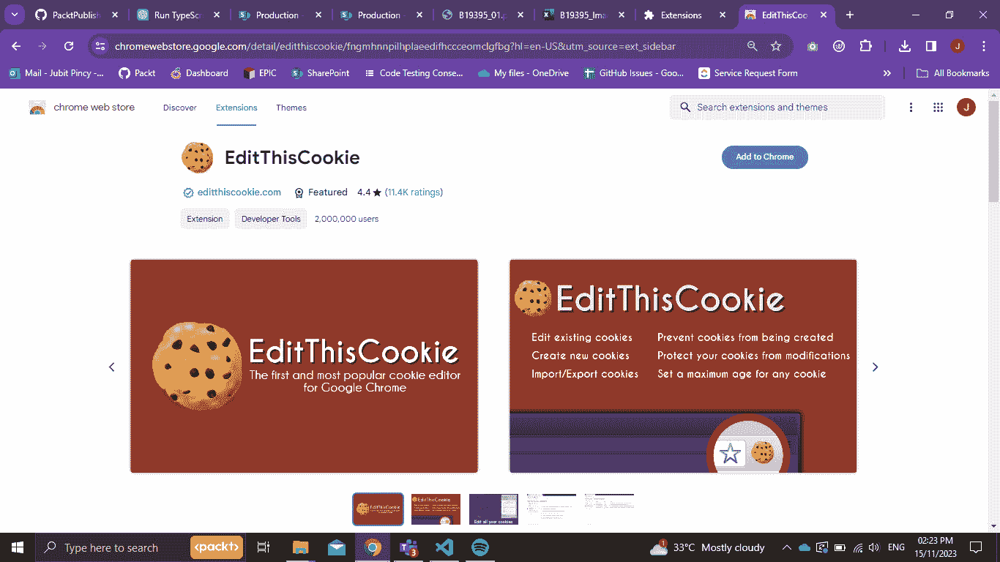

图 1.23 – EditThisCookie Chrome 扩展程序

**EditThisCookie** 扩展程序将使清除浏览器中的 cookies 更加容易。只需点击两次即可清除所有 cookies，并且它可以清除特定应用程序的 cookies，例如我们正在测试的应用程序。

接下来，我们需要这些扩展程序在 Chrome 浏览器上可见，以便于访问。

## 将 Chrome 扩展程序固定到浏览器标题栏

按照以下步骤操作：

1.  点击浏览器右上角的拼图扩展程序图标。

1.  点击两个扩展程序旁边的 **推针** 图标。

1.  这些图标现在将出现在浏览器右上角的 **扩展程序** 快捷方式区域，以便于访问：

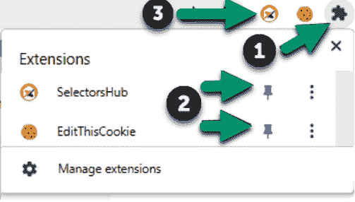

图 1.24 – 将扩展程序固定到浏览器工具栏

我们的工具带现在已经完整。我们有了编码环境、源代码编辑器以及一些故障排除工具，帮助我们一跃而起，完成高难度的项目。接下来，我们将安装 WebdriverIO。

# 安装 WebdriverIO

有两种选项可以使用和安装 WebdriverIO

+   使用 WDIO TestRunner 的异步模式

+   使用 WedbriverIO 独立模式

在下一章以及本书的其余部分，我们将使用第一种选项。尽管如此，仔细查看这两种选项：

**选项 1**：使用 WebdriverIO 及其内置的 WDIO TestRunner 是默认模式，也是最常见的使用场景。测试运行器有效地解决了在利用基本自动化库时经常遇到的许多挑战。首先，它通过组织和分配测试规范来简化您的测试执行管理，以最大化并发测试。此外，它熟练地管理会话操作，并提供一系列旨在帮助您在测试套件中排除故障和识别错误的功能。

在您方便的时候查看 `klassi-js` 仓库（https://github.com/klassijs/klassi-js）。还有一个项目模板，您可以克隆它（[`github.com/klassijs/klassi-example-test-suite`](https://github.com/klassijs/klassi-example-test-suite)），这样您就能在几秒钟内拥有一个运行中的项目。

以下是一个作为测试规范编写的示例脚本，并由 WDIO 执行：

```js
import { browser, $ } from '@wdio/globals'
describe('DuckDuckGo search', () => {
    it('Searches for WebdriverIO', async () => {
        await browser.url('https://duckduckgo.com/')
        await $('#search_form_input_homepage').setValue('WebdriverIO')
        await $('#search_button_homepage').click()
        const title = await browser.getTitle()
        expect(title).toBe('WebdriverIO at DuckDuckGo')
        // or just
        await expect(browser).toHaveTitle('WebdriverIO at DuckDuckGo')
    })
})
```

注意

所有 WebdriverIO 命令都是异步的，需要使用 `async`/`await` 正确处理。

# 摘要

在本章中，我们安装了许多开始编写健壮的测试自动化框架所需的工具。我们通过两个扩展增强了浏览器，以简化元素定位器的创建和处理 cookies。使用 npm 安装了 Node.js 环境，并创建了一个代码仓库文件夹。安装了 Visual Studio Code IDE，并提供了用于静态代码分析和代码格式的工具，我们还提供了有关代码何时被修改以及由谁修改的详细信息。

在下一章中，我们将安装 WebdriverIO 并开始探索 WebdriverIO TypeScript 框架项目的文件夹结构。
