# 第二章：独立堡垒 – 配置 WebdriverIO

在本章中，我们将安装 WebdriverIO 及其依赖项。有两种方法，我们将讨论每种方法的优点。同时，保持依赖项的版本更新也很重要。为此，我们将使用 Yarn 来保持我们的 package.json 和 yarn.lock 文件更新。

WDIO 的设置说明可以在官方网站的 **入门** 部分找到（[`webdriver.io/docs/gettingstarted`](https://webdriver.io/docs/gettingstarted)）：

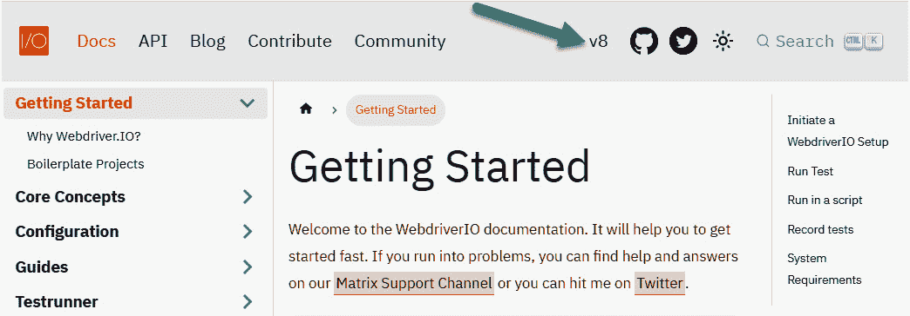

图 2.1 – 入门

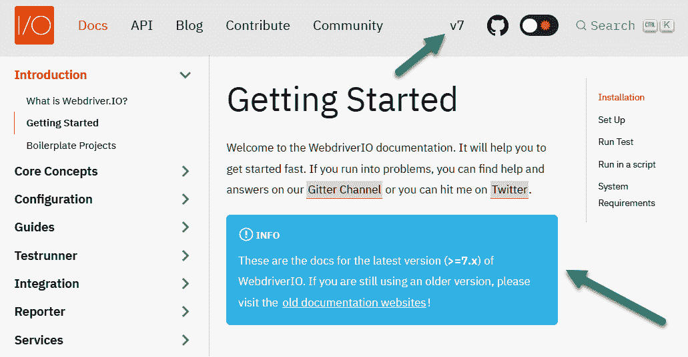

图 2.2 – 7.x 版本的当前文档指示器

在本节中，我们将涵盖以下主要主题：

+   WebdriverIO 设置

+   构建和安装项目依赖项

+   进行第一次提交

小贴士

确保您正在查看 WDIO 8.0 的最新版本。在 Google 上搜索有关 WDIO 功能的问题可能会导致旧版本的支持页面。

# WebdriverIO 设置

WDIO 团队努力使一切安装变得简单，如文档所述。WDIO 可以以两种方式设置：

+   在回答一系列问题时进行自定义配置

+   从 GitHub 上的现有项目克隆

对于此项目，我们将展示问题和所选答案。第二种方法，克隆样板项目方法，将在下一节中描述。

选项 1 – 开始安装 TypeScript 的 WebdriverIO 8.0 所需的步骤

从 `\repos\wdio` 文件夹导航。使用 Yarn 快速设置 WDIO 项目的最快方法是键入 `yarn create wdio`，以点（`.`）结束：

```js
> yarn create wdio .
```

WDIO 机器人将出现，并显示一系列配置问题：

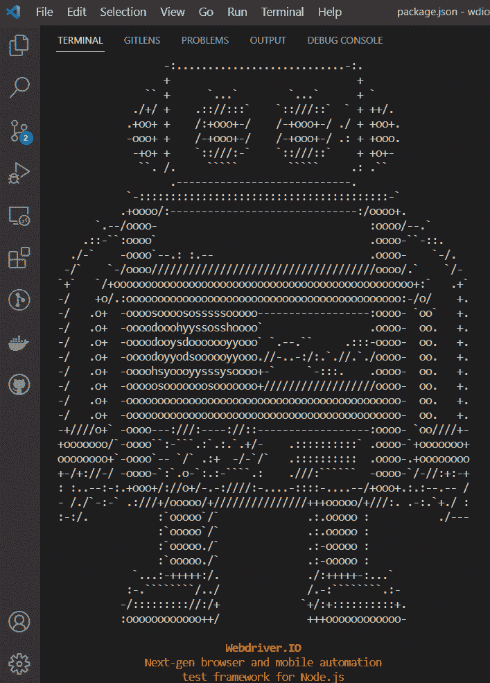

图 2.3 – 从代码 TERMINAL 窗口初始化 WDIO

初始化将询问如何从头开始配置 WDIO。以下是 WebDriver 8.0 的设置列表。有几个选项，许多人会使用默认设置。带有星号（`*`）的每个项目都显示了在设置时选择的选项：

注意

WebdriverIO 一直在更新。这些问题本身对于 Mac 和 Windows 用户应该是相似的。然而，随着新功能的添加，顺序、措辞和选择细节会有所变化。

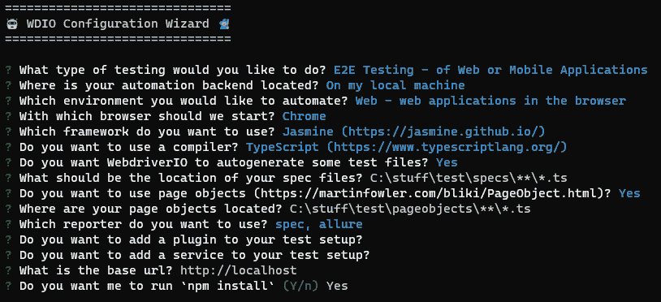

图 2.4 – 设置

**? 您想进行哪种类型的测试？（使用** **箭头键）**

+   > (*) 端到端测试 - Web 或移动应用程序

+   ( ) 组件或单元测试 - 在浏览器中

+   > https://webdriver.io/docs/component-testing

+   ( ) 桌面测试 - Electron 应用程序

+   > https://webdriver.io/docs/desktop-testing/electron

+   ( ) 桌面测试 - MacOS 应用程序

+   > https://webdriver.io/docs/desktop-testing/macos

**? 您的自动化后端位于何处？（使用** **箭头键）**

+   > (*) 在我的本地机器（默认）

+   ( ) 在云中使用 Experitest

+   ( ) 在云中使用 Sauce Labs

+   ( ) 在云中使用 Browserstack 或 Testingbot 或 LambdaTest 或其他服务

+   ( ) 我有自己的 Selenium 云

现在，有许多云选项，包括 `Experitest`、`Sauce Labs`、`BrowserStack`、`Testingbot` 和 `LambdaTest`。对于这本书，我们将在本地的 Mac 或 Windows 机器上安装自动化后端。

接下来是环境类型。为此目的，我们将使用 `Web`：

**? 您想自动化哪个环境？(使用** **箭头键)**

+   (*) Web - 浏览器中的网页应用

+   ( ) 移动设备 - 原生、混合和移动网页应用，在 Android 或 iOS 上

然后，选择我们将要使用的浏览器。选择默认的 Chrome。注意，我们稍后可以添加其他浏览器：

**? 我们应该从哪个浏览器开始？(按 <space> 选择，按 <a> 切换所有，按 <i> 反转选择，并按 <enter> ****继续)**

+   (*) Chrome

+   ( ) Firefox

+   ( ) Safari

+   ( ) Microsoft Edge

接下来是报告框架类型。对于这本书，我们将使用 Jasmine。然而，提供的许多代码将适用于所有列出的框架：

**? 您想使用哪个框架？(使用** **箭头键)**

+   ( ) Mocha (https://mochajs.org/)

+   ( ) Mocha with Serenity/JS (https://serenity-js.org/)

+   (*) Jasmine (https://jasmine.github.io/)

+   ( ) Jasmine with Serenity/JS (https://serenity-js.org/)

+   ( ) Cucumber (https://cucumber.io/)

+   ( ) Cucumber with Serenity/JS (https://serenity-js.org/)

WebdriverIO 默认使用 Mocha。然而，它也支持 Jasmine，并且可以与 Chai 结合使用进行高级断言。Cucumber 是一个抽象层框架，它隐藏了核心代码。这使得使用 Feature 文件创建测试时需要的专业技术资源更少。Cucumber 不在本书的范围之内，但描述的技术可以在 Cucumber WDIO 项目中实现。接下来，我们将告诉 WDIO 这是一个 TypeScript 项目：

**? 您想使用编译器吗？(使用** **箭头键)**

+   ( ) Babel (https://babeljs.io/)

+   (*) TypeScript (https://www.typescriptlang.org/)

+   ( ) 不！

**问题：什么是 Babel 以及是否需要它？**

Babel ([`babeljs.io/`](https://babeljs.io/)) 是一个 JavaScript 编译器。由于 JavaScript 在不同的浏览器中实现方式不同，因此使用编译器将我们的代码转换为较旧的 JavaScript 版本。某些功能在某些浏览器中未实现，例如 async/await，这取决于我们测试的浏览器版本。因此，编译器允许我们的框架具有向后兼容性。尽管这是一个 TypeScript 项目，但我们不需要 TypeScript 编译器。

**问题：如何知道不同浏览器和版本中可用的功能？**

[caniuse.com](http://caniuse.com) 网站提供了不同 ECMAScript 特性支持的描述性表格：

我们将使用 TypeScript 编写测试，它是 JavaScript 的超集。将使用 TypeScript 编译器。现在，为了快速启动示例脚本。

**? 您想让 WebdriverIO 自动生成一些** **测试文件吗？**

(Y/n) 是

这将自动设置一个示例测试以运行，以确保 WebdriverIO 正在正常工作。这也是我们将构建框架单元测试以检查功能是否正常工作的地方。哦，是的，我们是开发者，我们的自动化项目有自己的单元和集成测试。

以下是为 TypeScript 示例测试用例提供的默认路径，不应更改：

**? 您的** **规格文件** **应该位于何处？**

./test/specs/**/*.ts

测试可以组织到 specs 文件夹下的功能子文件夹和冒烟测试中。请注意，因为我们之前选择了 TypeScript，所以测试扩展 (.js) 已替换为 .ts。

**? 您想使用页面** **对象(**[`martinfowler.com/bliki/PageObject.html`](https://martinfowler.com/bliki/PageObject.html)**) 吗？**

是

这为我们项目设置了一个页面对象模型文件夹结构。

**? 您的页面对象** **位于何处？ ./test/pageobjects/**/*.ts**

现在，我们想要配置我们的报告器。

您想使用哪个报告器？

+   (*) spec

+   ( ) dot

+   ( ) junit

+   (*) Allure

+   ( ) 视频

+   ( ) mochawesome

+   ( ) Slack

WebdriverIO 支持广泛的报告器。在这个小型示例中，我们将从 spec 和 allure 报告器开始。请注意，WDIO 甚至支持 **视频** 选项。您可能会注意到 Slack 已包含在内。在本书的最后一章中，我们将使用 Jenkins 向 Slack 频道发送更新消息。

**? 您想将插件添加到您的** **测试设置中吗？**

+   ( ) wait-for: 提供等待特定条件直到定义的任务完成的功能的实用工具。

+   > https://www.npmjs.com/package/wdio-wait-for

+   ( ) angular-component-harnesses：支持 Angular 组件测试工具包。

+   > https://www.npmjs.com/package/@badisi/wdio-harness

+   ( ) Testing Library：鼓励遵循 dom-testing-library 的良好测试实践的实用工具。

+   > https://testing-library.com/docs/webdriverio-testing-library/intro

在我们的框架中，我们将采用高级方法等待页面同步。此选项将保持不变。

如果要测试的应用程序（AUT）是 Angular 项目，建议使用 Angular Component Harnesses 配置。

**? 您想将服务添加到您的** **测试设置中吗？**

+   ( ) VS Code

+   ( ) eslinter-service

+   ( ) lambdatest

+   ( ) crossbrowsertesting

+   ( ) VS Code

+   ( ) docker

+   ( ) Slack

备注

34 个附加服务已集成到 WDIO 中，包括 Slack、跨浏览器测试（Selenium Standalone）和 ES-Linter。涵盖所有这些超出了本书的范围。

WebdriverIO **Visual Studio Code** （**VS Code**）服务允许我们在 VS Code 桌面 ID 中无缝测试从端到端的扩展。通过提供您的扩展路径，服务将完成其余工作，如下所示：

+   🏗 安装 VS Code（可以是稳定版、内部版本或指定版本）。

+   ⬇ 下载与给定 VS Code 版本特定的 Chromedriver。

+   🚀 允许您从测试中访问 VS Code API。

+   🖥 使用自定义用户设置启动 VS Code（包括对 Ubuntu、macOS 和 Windows 上 VS Code 的支持）。

+   🌐 从服务器提供 VS Code，以便任何浏览器都可以访问进行测试扩展。

+   📔 使用与您的 VS Code 版本匹配的定位器启动页面对象。

下一个问题要求您输入测试应用的着陆页。为此，我们将使用默认提供的，因为示例测试使用它来导航到测试网站。

**? 基础 URL 是什么？**

http://localhost

这是我们的测试将启动的基本着陆页。

一个基本着陆页确保我们不会重复添加代码来导航到相同的着陆页。在本书的后面部分，我们将看到如何自定义此值。目前，我们将使用互联网沙盒进行测试。

最终的安装步骤是让 npm 下载并安装所有包。虽然这部分可以由安装程序执行，但我们需要进行一项修改。对于最终问题选择否。

**? 你想要我运行 `npm** **install` (Y/n)**

否

由于 Yarn 的速度更快，我们将使用 Yarn 而不是 npm 作为包管理器。这完成了从向导安装和配置 WebdriverIO 的设置。另一个选项是克隆现有项目，这将在下一部分介绍。如果您不打算从现有项目克隆，请跳转到 *安装和配置 WebdriverIO* 部分。

由于我们使用 Yarn 作为包管理器而不是 npm，我们需要删除 package-lock.json 文件并运行 yarn install 命令来构建等效的 yarn.lock 文件。

```js
> yarn install
```

## 选项 1 – 从模板项目克隆 WebdriverIO

设置 WDIO 的另一种方法是使用 WDIO GitHub 仓库中的预配置 WDIO 模板项目。这意味着可能不需要进行太多的故障排除。我们可以从许多预配置的模板项目中选择，这些项目包含所有必要的组件。

对于这个项目，我们将从 GitHub 上的 `Jasmine TypeScript Boilerplate` 项目进行分支：

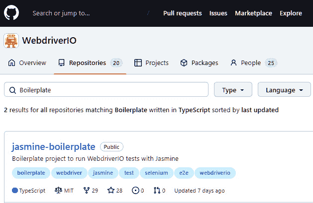

图 2.5 – GitHub 上的 Jasmine TypeScript 模板项目

点击 **jasmine-boilerplate** 链接。这将允许我们通过 **代码** 按钮创建自己的版本：

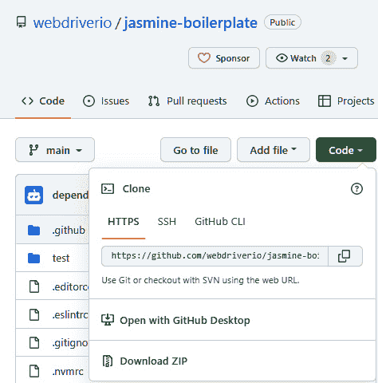

图 2.6 – 从 GitHub 复制项目 URL

点击 **代码**。将显示克隆项目的多个选择。选择 **使用** **GitHub Desktop** 打开：

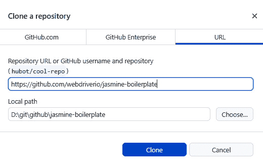

图 2.7 – 从源路径克隆到本地目标

点击 `repos` 路径。

接下来，我们将更改 `repo\wdio`，并点击 **克隆**：

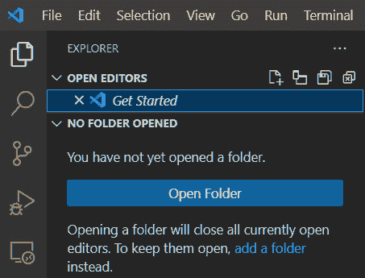

图 2.8 – VS Code 中的项目资源管理器图标

点击 `WDIO` 文件夹。

然后，点击 `repo\wdio` 文件夹，并点击 **打开**：

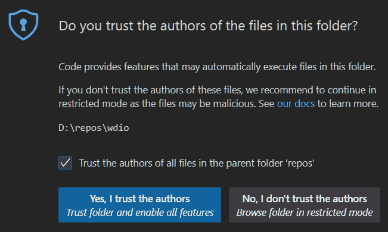

图 2.9 – 信任项目的作者

如果出现此对话框，请检查 **信任父文件夹‘repos’中所有文件的作者** 选项，然后点击 **是，我信任** **作者**。

这样，我们就涵盖了克隆安装方法。接下来，我们将安装所有内容。

# 构建和安装项目依赖项

如果你从一个现有项目中安装了 WebdriverIO，这就是我们继续的地方。在我们运行第一个测试之前，我们需要构建项目。在终端中，输入以下内容：

```js
> yarn install
```

这将引入所有相关包以运行项目。在未来某个时候，可能会出现漏洞，我们不得不更新我们的包。我们可以使用 Yarn 检查哪些包是当前的，哪些是过时的：

```js
> yarn outdated
```

输出可以在以下屏幕截图中看到：

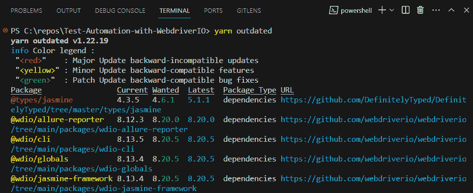

图 2.10 – 显示过时的包

如果我们盲目地升级所有包，可能会发生不兼容的情况。幸运的是，有 yarn upgrade 命令，允许单独升级包：

```js
> yarn upgrade-interactive
```

我们将看到以下输出：

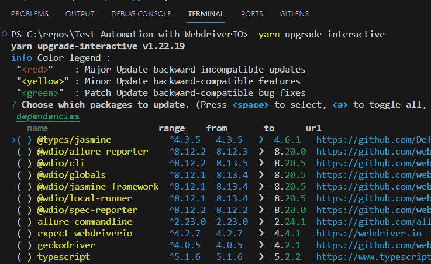

图 2.11 – 升级时的交互式包列表

这使我们保持项目包更新时具有最大的灵活性。

快速提示

如果你想清除终端，在 Windows 中使用 cls 或者在 Mac 上使用 Ctrl + K 或 clear。

安装后，yarn.lock 文件将被更新，node_modules 文件夹将下载所有支持依赖项。这包含已包含以支持 package.json 中包的包的扩展列表。`yarn.lock` 文件永远不需要编辑。

在这一点上，我们应该指出，WebdriverIO 的设置假设新手用户可能不知道如何引入所有支持包：

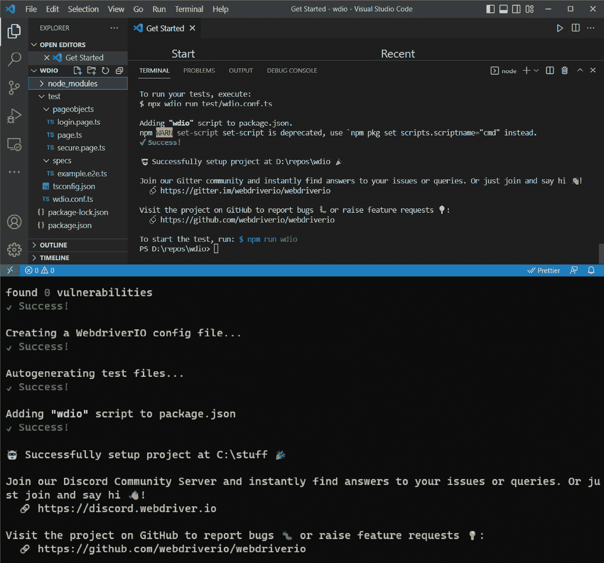

图 2.12 – 成功安装 TypeScript 的 WebdriverIO

最后，我们可以使用版本标志确认已安装的 WebdriverIO 版本。

对于 Windows 用户：

```js
> npx wdio --version
```

对于 Mac 用户：

```js
> wdio --version
```

我们做到了！所有支持的功能都已添加到 package.json 文件中。WDIO 甚至给我们一个提示来尝试我们的第一个测试 – `npm` `run wdio`：

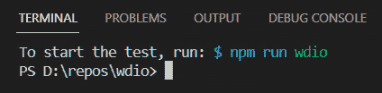

图 2.13 – WebdriverIO 给我们提示如何运行第一个测试

这已经设置了 WebdriverIO 并创建了一个可以执行以下 yarn 命令的示例测试：

```js
> yarn wdio
```

这将产生以下输出：

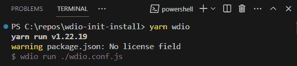

图 2.14 – yard 命令的输出

测试也可以通过运行命令来执行。让我们看看 Windows 和 Mac 的选项：

对于 Windows 用户：

```js
> npx wdio run test/wdio.conf.ts
```

对于 Mac 用户：

```js
> wdio run test/wdio.conf.ts
```

所有测试示例都可以在这个书的 GitHub 仓库中找到：[`github.com/PacktPublishing/Enhanced-Test-Automation-with-WebdriverIO`](https://github.com/PacktPublishing/Enhanced-Test-Automation-with-WebdriverIO)。

这将在 **spec** **Reporter** 窗口中运行样本测试，并将基本输出详细信息输出到终端窗口：

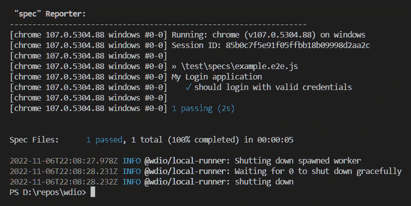

图 2.15 – 从样本 WDIO 测试的 spec 报告中显示的通过结果

现在我们已经设置了项目，无论是通过回答初始配置问题还是克隆现有项目，我们就可以查看我们新的 WDIO 自动化项目的配置和文件设置：

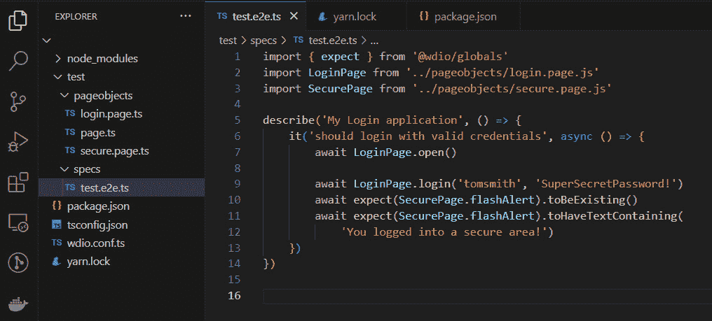

图 2.16 – 所有项目文件

这将显示项目中的所有文件和文件夹。它们相当多，所以我们将在这里介绍重要的部分。首先打开 `README.md` 文件。

对于任何项目，`README` 文件是开始的最佳位置。它提供了关于项目配置、特性和，最重要的是，如何快速开始样本测试的关键信息。

接下来，打开 `package.json` 文件。

这就是大部分 `Node.js` 配置发生的地方：


图 2.17 – wdio 项目中的所有 devDependancies

`yarn.lock` 文件是什么？

`yarn.lock` 文件包含所需项目包的完整列表，包括在 `package.json` 中支持其他包的包。它很大，但不用担心——你永远不需要更改它。Yarn 包管理器处理所有这些。哇！

让我们使用 `install` 命令运行 Yarn 包管理器，以获取所有内容并保持最新：

```js
> yarn install
```

这可以在以下屏幕截图中看到：

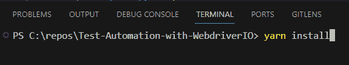

图 2.18 – 使用 Yarn 包管理器构建项目

## 进行第一次提交

现在我们已经运行了第一个测试，是时候将它带到我们的孤独堡垒——通过将其提交到本地仓库，然后到 GitHub 仓库。

### 忽略 Git 仓库中的文件

在我们将第一个提交到 Git 仓库之前，我们需要忽略一些文件。一旦我们设置了 WDIO 项目，VS Code 可能会建议将 `node_modules` 文件夹包含在 `gitignore` 文件中：

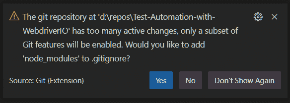

图 2.19 – VS Code 检测到 node_modules 文件夹可以被忽略

我们绝不想将这个文件夹提交到我们的 Git 仓库，因为它会不断由 npm 更新。让 `npm` 在线创建包含最新版本的文件夹内容会更好：

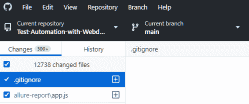

图 2.20 – GitHub Desktop 显示有超过 12,000 个文件需要提交到新仓库

这比我们需要的文件多得多。

要告诉 Git 忽略此项目文件夹，只需在项目根目录中创建一个 `.gitignore` 文件，并输入 `node_modules` 文件夹名称：

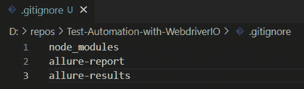

图 2.21 – .gitignore 文件包含不应提交的文件和文件夹

这同样适用于我们的 Allure 报告和结果文件夹。这些文件将在每次测试后反复重建，并且不需要置于版本控制之下。一旦这些测试从 Jenkins 运行，之前的运行可以暂时或永久地保存在那里。

通过简单地添加和保存 `.gitignore` 文件，文件列表会显著变化：

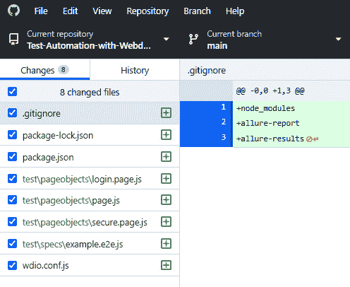

图 2.22 – 仓库现在只存储文件

一旦保存此 `.gitignore` 文件，我们将在 GitHub Desktop 中看到反映出的变化，文件数量减少到仅八个文件。

小贴士

永远不要在仓库中存储密码。密码应由安全数据提供者服务（如 Vault 或 AWS Secrets）提供。如果没有此类选项，则可以在项目文件夹之上引用密码文件。否则，将此类凭证文件存储在项目中需要将其添加到 `.gitignore` 文件中以确保安全。

我在我的职业生涯中发现的第一个错误与密码有关。在这里，用户有选项使用随机字符序列重置他们的密码。这个页面偶尔会崩溃。原因是要求密码由所有 128 个 ASCII 字符生成。这包括 BELL、不可打印字符，以及难以在键盘上输入的字符。真正的问题是这个集合包括了角度括号（`<` 和 `>`）。只有当新密码生成时包含这两个字符之一，页面才会崩溃，因为它们被解释为页面上的打开或关闭 HTML 标签。

IT 安全使用一些工具来检测仓库中的密码，但它们通常只检查 `main` 或 `master` 仓库，并忽略后续的 `feature` 分支。这也是一个安全风险。始终清理旧分支，因为这可能被视为 **安全运营中心**（**SOC**）II 合规违规，即使密码已经很久以前就过期了。

我们现在可以添加总结描述和可选的详细信息。只需点击 **提交到主分支** – 我们的所有新文件都将提交到我们的本地主分支：

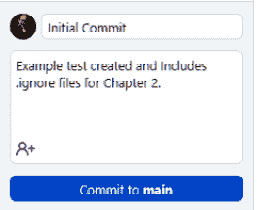

图 2.23 – 向本地提交添加注释和详细信息

然而，这只是在我们的本地 Git 仓库中进行了暂存。最后一步是点击**推送到远程仓库**，这将将其推送到 GitHub，以便我们的团队可以拉取：

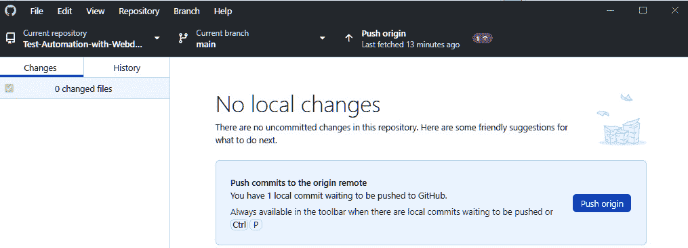

图 2.24 – GitHub Desktop 显示所有更改都已提交，并建议推送任何新更改

恭喜！你已经向你的 Git 仓库提交了第一个更改。现在，你的团队成员可以拉取你的更改，以确保所有测试都能顺利运行。

但如果你需要添加需要几天时间才能完成的新功能呢？

### 分支

要成为自动化团队的一员，你可能会被要求添加新的和复杂的功能。如果这需要几天时间，我们可能会考虑特性分支。新分支将从 `main` 分支创建。你的更改将提交到你的分支，并且会定期引入 `main` 分支的更改：

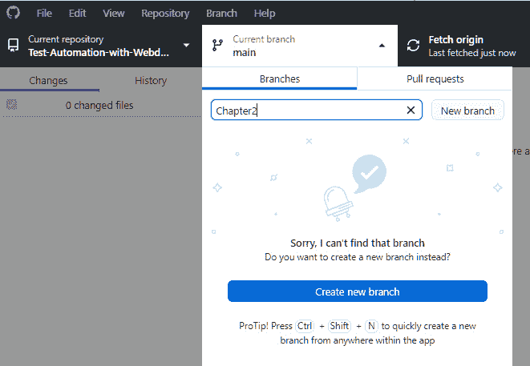

图 2.25 – 在 GitHub Desktop 中从主分支添加新分支

当你的更改完成后，将创建一个拉取请求，以将你的更改拉入 `main` 分支，并且可能删除 `feature` 分支。

对于本书，框架的最终状态将在这个章节命名的分支中。`main` 分支将包含最终项目。

# 摘要

在本章中，我们在一系列配置问题中添加了几个选项来安装 WebdriverIO。我们还展示了 Yarn 如何保持依赖项最新。最后，我们展示了如何从 GitHub Desktop 向仓库提交更改。

如果你遇到问题，请查看本书末尾的*附录*。在那里，你可以找到一个详细的常见和复杂问题的列表，包括原因、解释和解决方案。它还包括许多这些初始过程的节点命令速查表。

在下一章中，我们将探索 `wdio` 配置文件中的文件和连接，并查看调试我们代码的不同方法。
