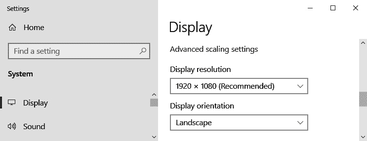
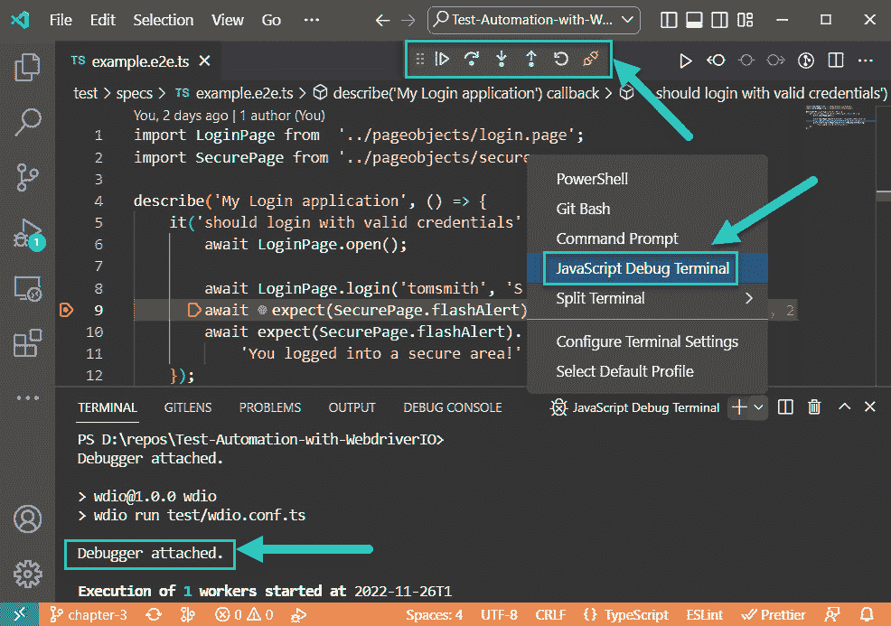
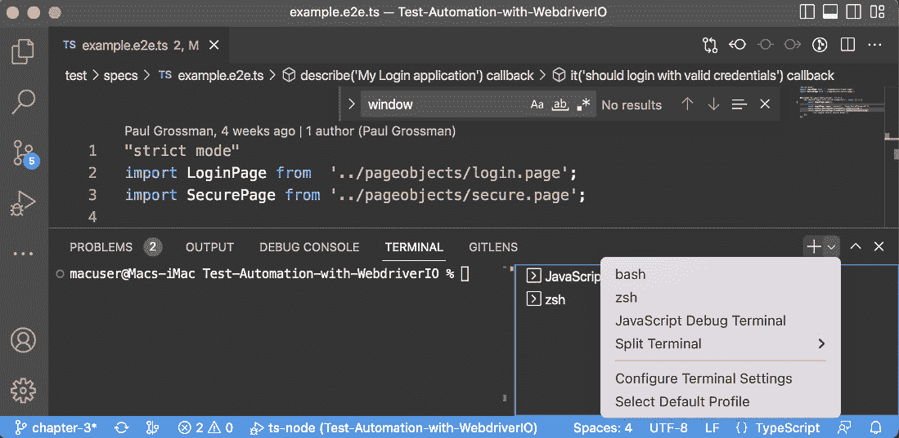
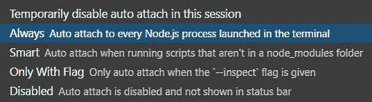
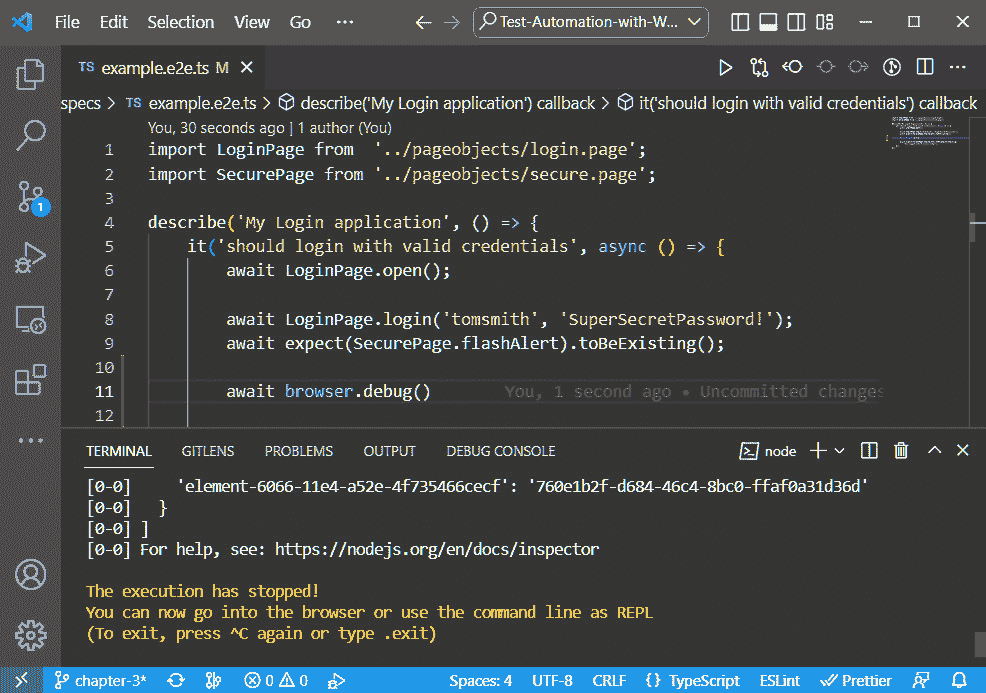
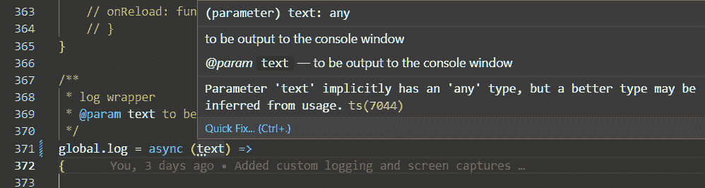

# 控制论增强 – WebdriverIO 配置和调试技巧

在本章中，我们将介绍创建和调试自定义 WebdriverIO 框架的技术。这将带我们了解帮助项目保持更新的服务。在项目中，许多文件被使用并相互交互。我们将添加辅助工具和其他功能来增强框架，并使调试更容易。我们将涵盖框架的节点文件，并演示在 Mac 和 Windows 操作系统上启动测试之间的差异。我们还将为单显示器调试创建我们的第一个钩子自定义。最后，我们将编写我们的第一个日志包装器，以在控制台窗口中获取更多控制权，通过自定义日志来提高调试效率。

具体来说，这是我们本章的主要话题：

+   WebdriverIO 节点项目的主要文件

+   让 Yarn 帮助保持文件更新

+   动态配置

+   `global.log()` 方法

+   强制执行编码标准的规则

# WebdriverIO 节点项目的三个主要文件

在遵循 WDIO 配置的过程中，会添加很多文件。这是熟悉这些文件的功能和它们之间关系的好时机，从以下这三个开始：

+   `package.json`

+   `yarn.lock`

+   `wdio.config.ts`

让我们按执行顺序逐一查看。

## `package.json` 文件

我们将要讨论的第一个配置文件是 `package.json` 文件。它有助于管理项目的依赖关系，并提供了一种运行脚本和访问项目其他信息的方式。此文件具有几个用途：

+   它可以指定可以从命令行运行的脚本。例如，一个 WebdriverIO 项目可能包括一个启动 Webdriver 服务器的 `wdio` 脚本和一个专门配置为在 Docker 容器实例上运行的 `wdio-docker` 脚本。

+   它指定了项目的依赖关系，即项目需要正常工作所需的包。例如，一个 Webdriver 项目将依赖于 `expect-wdio` 包进行验证。我们不必担心所有这些包的依赖冲突。当使用带有 --interactive 或 -i 标志的升级命令时，Yarn 提供了一个交互式升级模式。交互式升级模式允许您选择要升级的包。当运行 >yarn upgrade-interactive 时，Yarn 将显示一个过时包的列表，并提示选择要升级的包。Yarn 在确定要升级的版本时，会尊重您在 package.json 文件中指定的版本范围。

+   它可以指定 `devDependencies`，这些是开发者需要的，但并非一定用于执行。例如，一个 WebdriverIO 项目将依赖于 `@wdio/cli` 包。同样，`node-check-version` 工具将保持版本同步。

+   它可以包含有关项目的元数据，例如项目的名称、版本和作者：

    ```js
      "scripts": {
        "test": "echo \"Error: no test specified\" && exit 1",
        "wdio": "wdio run test/wdio.conf.ts",
        "debug": "cross-env set DEBUG=true && wdio run test/wdio.conf.ts",
        "report": "cross-env DEBUG=false wdio run test/wdio.conf.ts && allure generate report allure-results --clean && allure open",
        "wdio-docker": "DEBUG=false wdio run test/wdio.conf.ts && allure generate report allure-results --clean"
      },
      "devDependencies": {
        "@types/jasmine": "⁴.3.0",
        "@wdio/allure-reporter": "⁷.26.0",
        "@wdio/cli": "⁷.27.0",
        "@wdio/jasmine-framework": "⁷.26.0",
        "@wdio/local-runner": "⁷.27.0",
        "@wdio/mocha-framework": "⁷.26.0",
        "@wdio/spec-reporter": "⁷.26.0",
        "ts-node": "¹⁰.9.1",
        "typescript": "⁴.9.3",
      },
      "dependencies": {
        "expect-webdriverio": "³.0.0"
      }
    }
    ```

`package.json`文件还包含`"scripts"`模式。这是我们创建自定义运行配置快捷方式的地方。例如，要在命令提示符下运行测试，我们可以使用`npx`与`wdio`包一起提供 WebdriverIO 配置文件的路径：

```js
>npx wdio run ./wdio.conf.js
```

在安装时，WebdriverIO 在`scripts`包模式中包含一个`wdio run`配置：

```js
    "scripts": {
        "wdio": "wdio wdio.conf.ts"
    }
```

我们可以使用`wdio`快捷方式从包管理器隐式运行节点执行器：

```js
yarn wdio
```

我们现在可以为从上一章运行`Allure`报告添加一个快捷方式：

```js
    "scripts": {
        "wdio": "wdio wdio.conf.ts"
   "report": "allure generate --clean allure-results && allure open"
    }
```

运行测试和生成报告的命令行现在简化为以下内容：

```js
yarn wdio
yarn report
```

在*第十三章*中，当我们对多个浏览器进行测试时，这将会再次发挥作用。现在，让我们简要地看一下所有不同的包。

## yarn.lock 文件

此文件跟踪由`package.json`文件引入的所有外部支持包，这些包存储在`node_modules`文件夹中。如果已经检测到相同版本的包已被下载，则节点将跳过它以提高效率。此文件内容丰富，并且由于每次执行`yarn add`时都会重建它，因此无需手动修改。

接下来，我们将介绍 WebdriverIO 的核心。

## wdio.conf.ts 文件和 webhooks

此文件是配置所有 WDIO 包功能的地方。它包括 webhooks – 在框架的某些点上自动执行的代码。这使我们免于反复重写代码。此代码可以在每个会话、套件、测试、WebdriverIO 命令之前或之后注入，甚至可以在每个钩子之前或之后注入。所有默认功能都在每个钩子内部有文档说明，可供修改。以`beforeTest`代码为例：

```js
  /**
   * Function to be executed before a test (in Mocha/Jasmine) starts.
   */
  // beforeTest: function (test, context) {
  // },
```

通过取消注释`beforeTest`钩子函数，我们可以自定义 WebdriverIO 的功能。这只是为了在本地机器上运行，那里在小显示器上有有限的空间。例如，我们可以在每次测试之前最大化浏览器全屏：

```js
beforeTest: function (test, context) {
    browser.maximizeWindow();
},
```

# 经验法则 – 匹配你的开发者的硬件

这里有一个请求第二个显示器的好理由。我们刚刚在运行时将浏览器扩展到全屏。如果我们只有一个显示器，这将完全遮挡我们的**Visual Studio Code**（**VS Code**）窗口。为了提高效率，我们需要在主显示器上以全屏模式执行测试时，在外部显示器上看到 VS Code 中的终端窗口。

但如果你只有一个显示器，你可以在`wdio.config.ts`文件的 webhooks 中实施一个简单的技巧：将浏览器高度设置为显示分辨率的四分之三。首先，通过访问**设置**然后是**显示**来获取当前显示的高度和宽度（在 Windows 上）：



图 3.1 – Windows 上的主显示分辨率

在 Mac 上，转到**苹果**菜单并选择**关于本机** > **显示**：


图 3.2 – Mac 的主要显示分辨率

将显示高度乘以 0.75。在 `wdio.conf.ts` 文件中，取消注释 `beforeTest()` 方法。在 `browser.setWindow` 方法中输入宽度和减小后的高度值（在这个例子中，`970`），如下所示：

```js
beforeTest: function (test, context) {
    // VS Code Terminal visible on the bottom of the screen
    browser.setWindowSize(1920, 970)
},
```

这样，你就可以在单显示器上同时获得两者的最佳效果，如下面的截图所示：


图 3.3 – 在单显示器上运行自定义尺寸的浏览器，并在下方终端日志中运行

你可以在[`webdriver.io/docs/options/#hooks`](https://webdriver.io/docs/options/#hooks)在线文档中了解更多关于 WebdriverIO 插件的信息。由于这是一个 TypeScript 项目，因此也需要一些配置。

`tsconfig.json` 文件配置了 TypeScript 编译器的节点选项。它包括将要使用的框架，并包含用于断言的 WebdriverIO `expect` 库。这就是我们可以更改 ECMAScript 目标版本以匹配节点版本的地方：

```js
{
    "compilerOptions": {
        "moduleResolution": "node",
        "types": [
            "node",
            "webdriverio/async",
            "@wdio/jasmine-framework",
            "expect-webdriverio"
        ],
        "target": "es2022"
    }
}
```

`es2022` 目标是 ECMAScript 10 版本。ECMAScript 版本名称与功能的相关性可以在[`en.wikipedia.org/wiki/ECMAScript`](https://en.wikipedia.org/wiki/ECMAScript)中找到，而 `node` 与 ECMAScript 版本的相关性可以在[`node.green/`](https://node.green/)中找到。

`test/spec` 文件夹是执行测试脚本的存放位置。子文件夹可以帮助将测试分类。建议不要将这些文件夹结构做得太深，因为这会使相对路径难以跟踪。

`test/pageObjects` 文件夹包含用于查找和填充元素的页面对象模块。

最后，`node_modules` 文件夹包含了为支持节点项目而下载的所有支持包。

Chrome 浏览器总是在更新。接下来，我们需要确保项目资源保持最新。WebdriverIO 提供了一个服务来完成这项工作。

# 让 Yarn 帮助保持文件更新

正如 Yarn 升级交互式工具必须保持所有支持包的当前状态一样，WebdriverIO 提供了 ChromeDriver 服务以跟上 Chrome 的持续更新。我们可以通过在控制台中运行以下命令来安装此服务：

```js
yarn add wdio-chromedriver-service
```

然后，它必须在 `wdio.config.ts` 文件中进行配置。为此，找到以下内容：

```js
    services: ['chromedriver'],
```

用以下内容替换它：

```js
    outputDir: 'all-logs',
    services: [
        ['chromedriver', {
            args: ['--silent']
        }]
    ],
```

最后，应将 `all-logs` 文件夹添加到 `.gitignore` 文件中。现在，让我们来讨论一些调试技巧。

# 使用 VS Code 配置调试

VS Code 提供了四个命令提示符外壳来启动脚本。你使用哪个取决于你的操作系统。对于 Windows，有 PowerShell、Git Bash、命令提示符和 JavaScript 调试终端。Mac 包括 ZSH 壳：



图 3.4 – Windows 上的 VS Code 调试控件和 shell 终端

在 Mac 上看起来是这样的：



图 3.5 – Mac 上的 VS Code 调试控件和 shell 终端

脚本执行停止时，在代码中输入断点（如第 9 行左侧的空白处单击），这将附加调试器和控制面板。从面板中，可以继续代码执行，跳过方法调用，进入方法，或从调用代码返回，或重新启动或断开调试会话。

JavaScript 调试终端始终附加调试器。调试模式会减慢执行速度。因此，对于 Mac，一个实际的选择是打开两个 shell：JavaScript 调试终端和 ZSH 以实现更快的非调试执行。任何 shell 都可以通过自动附加激活调试：



图 3.6 – 自动附加调试器的命令面板选项

PowerShell、Git Bash、ZSH 和命令提示符必须通过将命令面板中的 **自动附加** 设置为 **始终** 来启用调试配置。它可以从 VS Code 的状态栏临时禁用：


图 3.7 – 可以从 VS Code 底部的状态栏临时禁用自动附加模式

在这一点上，我们可以通过传递 **环境变量** 来进一步自定义我们的框架。在 Mac 上，任何终端都很容易做到：

```js
> DEBUG=true yarn wdio
```

Windows 使得这一点变得复杂。要添加一个如 `DEBUG` 这样的变量，每个 shell 都有用于多行执行的单独语法。以下是列表：

+   Git Bash：

    ```js
    > set DEBUG=false && yarn wdio
    ```

+   PowerShell 和 JavaScript 调试终端：

    ```js
    > set DEBUG=false; yarn wdio
    ```

+   命令提示符和 ZSH（Mac）：

    ```js
    > DEBUG=true yarn wdio
    ```

此外，包快捷方式的语法在此处不同：

+   Mac：

    ```js
    "debug": "DEBUG=true wdio run test/wdio.conf.ts",
    ```

+   Windows：

    ```js
    "debug": "set DEBUG=true && wdio run test/wdio.conf.ts",
    ```

如果你有一个混合使用 Mac 和 Windows 的团队，情况可能看起来很糟糕。但超级英雄有助手，Node 也不例外。

经验法则 – cross-env 节点包

为了解决所有这些问题，我们将安装 `cross-env` 包：

`yarn` `add cross-env`

通过添加 `cross-env` 包，我们现在可以创建一个新的调试快捷方式，它在 Mac 和 Windows 上都使用相同的语法：

`debug: cross-env DEBUG=true` `wdio wdio.conf.ts`

## browser.debug()

另一种调试我们代码的方法是添加 `browser.debug()` 语句：



图 3.8 – 使用 browser.debug() 在 VS Code 中暂停执行

默认情况下，WebdriverIO 会暂停执行，但它受限于我们框架的默认超时间隔。对于 Jasmine，默认值大约是 1 分钟。然而，当发生错误时，我们需要更多的时间进行调试。通过将`defaultTimeoutInterval`设置为 15,000,000 毫秒（大约 4 小时），脚本将会有更多的时间来调试任何问题：

```js
jasmineOpts: {
  defaultTimeoutInterval: 15_000_000,
```

当然，我们不希望手动反复更改这个值，尤其是如果我们正在云环境中运行。这可以通过我们的下一个超级功能来处理。

# 动态配置

动态配置意味着我们可以通过分配系统变量并将它们传递给我们的框架来改变框架的行为方式。这些变量遵循常量的`ALL_CAPS`命名约定。让我们首先根据`DEBUG`环境变量的值分配一个超时。在`config`文件的顶部，我们将捕获`DEBUG`环境变量的值：

```js
const DEBUG = (process.env.DEBUG === undefined) ? false : (process.env.DEBUG === `true`)
```

如果没有明确定义`DEBUG`，则默认设置为`false`。现在，当我们明确执行调试快捷方式时，我们可以有一个扩展框架超时的变量：

```js
let timeout = DEBUG ? 10_000 : 16_000_000
```

经验法则

使用数字分隔符使你的代码更易读。TypeScript 支持在整数和浮点数中使用下划线代替逗号。这使得`16_000_000`成为一个有效的整数，同时使代码对人类更易读。

我们可以在`jasmineOpts`下找到超时。让我们引用这个新的超时变量。找到以下代码：

```js
jasmineOpts: {
defaultTimeoutInterval: 10000,
```

改成以下内容：

```js
jasmineOpts: {
defaultTimeoutInterval: timeout,
```

你可以考虑在快捷方式省略时将`DEBUG`默认设置为`True`，然后在从 Jenkins 等 CI/CD 环境（如 Docker）运行时明确将其关闭：

```js
const DEBUG = (process.env.DEBUG === undefined) ? true : (process.env.DEBUG === `true`)
```

原因是我们大部分时间都花在编写和调试代码上，这意味着我们花费较少的时间重复输入来启动测试：

```js
DEBUG=true yarn wdio
```

这只是在本地运行时扩展超时：

```js
yarn wdio
```

然后，我们可以在快捷方式中隐式地设置`debug`开关，在 CI/CD 中明确设置：

```js
     "scripts": {
        "wdio": "wdio wdio.conf.ts"
        "debug": "DEBUG=true wdio wdio.conf.ts"
        "wdio-docker": "DEBUG=false wdio wdio.conf.ts"
    }
```

在未来的章节中，我们将执行在 Docker 中的测试。在这种情况下，我们不希望我们的测试在调试错误时等待几个小时。在这个脚本中，我们将`DEBUG`改为`false`；测试将使用一个短超时，具体考虑这一点：

```js
yarn wdio-docker
```

问题：自动化框架的客户是谁？你可能认为它是利益相关者，但实际上并非如此。利益相关者是那些拥有非常吸引人的图表的受益者。你的团队是每天与框架一起工作的团队。这意味着你是客户。优先考虑框架功能，以帮助你日常工作中更高效的标准，而不是你资助者的心血来潮。

你可以在这里了解更多关于动态配置的信息：[`webdriver.io/docs/debugging/#dynamic-configuration`](https://webdriver.io/docs/debugging/#dynamic-configuration)。

当我们查看 Jasmine 选项时，我们可能会考虑在测试失败时自动将屏幕截图添加到结果中。这些可以添加到以下代码中：

```js
expectationResultHandler
expectationResultHandler: function(passed, assertion) {
 /**
 * only take screenshot if assertion failed
 */
 if(passed) {
      return
 }
 browser.saveScreenshot(`assertionError_${assertion.error.message}.png`)
 }
```

这将在我们项目的根目录下创建一个屏幕截图。屏幕截图不需要占用 Git 仓库的空间。因此，我们将它们添加到`.gitIgnore`的`*.png`文件中。

## 关于模板字符串的注意事项

你可能已经注意到，在这些代码示例中广泛使用了带重音符号的模板字符串 `'strings'`。虽然 TypeScript 支持字符串的单引号和双引号，但在测试自动化项目中，模板字符串更有意义。

假设，例如，我们希望将此字符串写入我们的控制台日志：

```js
Meet Dwane "The Rock" Johnson at Moe's tavern
```

如果我们使用引号，我们需要在字符串中双重转义引号：

```js
console.log("Meet ""Dwayne The Rock"" Johnson at Moe's  tavern")
```

如果我们使用单引号，则需要用反斜杠转义撇号：

```js
console.log('Meet Dwyane "The Rock" Johnson at Moe\'s  tavern')
```

但使用带重音的模板字符串时，不需要转义：

```js
console.log(`Meet Dwayne "The Rock" Johnson at Moe's tavern today`)
```

模板字符串还可以传递`${variables}`，使报告更加灵活和描述性：

```js
let guest = `Dwayne "The Rock" Johnson`
let location = `Moe's tavern`
```

现在，我们可以输出一个模板字符串到控制台，它比使用单引号或双引号的字符串更容易阅读：

```js
console.log(`Meet ${guest} at ${location} today`)
```

自定义报告函数的大部分目的是在调试期间减少噪音。

## 降低信噪比

现在，我们需要进行一些负面测试。将`ch3.ts`脚本修改为通过在`expect`验证链中添加`.not`来生成错误：

```js
await expect(SecurePage.flashAlert).not.toBeExisting();
```

现在，当我们运行代码时，我们会得到大量的消息细节：

```js
[0-0] 2022-11-28T09:14:03.160Z INFO webdriver: COMMAND findElements("css selector", "#flash")
[0-0] 2022-11-28T09:14:03.160Z INFO webdriver: [POST] http://localhost:9515/session/2e35b72bb526b5f0e346ba1379e4f5d9/elements
[0-0] 2022-11-28T09:14:03.161Z INFO webdriver: DATA { using: 'css selector', value: '#flash' }
[0-0] 2022-11-28T09:14:03.174Z INFO webdriver: RESULT [
[0-0]   {
[0-0]     'element-6066-11e4-a52e-4f735466cecf': 'd6b5d426-fbbb-4871-b190-94de4ef331cd'
[0-0]   }
```

产生了大量并非所有都很有洞察力的信息。在`wdio.config.ts`文件中，我们可以通过`logLevel`设置来控制控制台显示的详细程度：

```js
// Level of logging verbosity: trace | debug | info | warn | error | silent
    logLevel: 'info',
```

选项的顺序是按照详细程度列出的。默认的`'info'`级别可能会显得过于冗长。将其降低到`'warn'`级别更适合我们的需求。

我们最终的调试技术是使用包装器增强`console.log()`命令。

# 我们的第一个自定义包装方法 – global.log()

问题：什么是包装器？

包装器是一种定制方法或函数，其签名几乎与内置方法相同，但增加了额外的功能。在我们的第一个例子中，我们将创建一个全局包装器`console.log()`。

虽然`console.log()`方法适用于将信息输出到控制台窗口，但它可以增强并缩短。让我们在`wdio.config.ts`文件的末尾构建我们的第一个`log()`包装器：

```js
/**
 * log wrapper
 * @param text to be output to the console window
 */
global.log = async (text: any) =>  {
    console.log(`---> ${text}`)
}
```

这个`global.log()`包装器几乎与`console.log`相同，但它有一些突出显示的文本格式。让我们通过添加一些示例到测试中来看一下：

```js
console.log (`Entering password`)
[0-0] Entering password
await global.log (`Entering password`)
[0-0] ---> Entering password
```

这样，我们可以将添加到框架中的自定义消息与 Jasmine 和 node 报告输出生成的消息区分开来。

经验法则

即使一个函数只有一行，也要使用花括号。有两个原因。首先，它使得逻辑分支问题更容易被发现。其次，当添加括号时，你很快就会添加更多代码行。

假设我们想忽略传递给日志的空字符串和 null。当写成单行代码时，意图不是很清楚：

```js
global.log = async (text: any) => {
    if (text) console.log(`---> ${text}`)
}
```

但有了括号，逻辑看起来更清晰：

```js
global.log = async (text: any) => {
    if (text) {
        console.log(`---> ${text}`)
    }
}
```

这遵循了我们之前在*经验法则*框中提到的第二个原因——你很快就会添加更多的代码行。如果我们知道未解决的承诺传递给日志的时间和出现问题的行，前面的代码会更好。因此，我们将为`Promise`对象添加一个异常，并显示控制台跟踪以显示该行：

```js
global.log = async (text: any) => {
    if (text) //truthy value check
    {
        if (text===Promise){
            console.log(`--->     WARN: Log was passed a Promise object`)
            console.trace()
        }else{
            console.log(`---> ${text}`)
        }
    }
}
```

问题：为什么文本被分配为`any`类型而不是`string`类型？

在大多数情况下，我们将在 TypeScript 中声明参数的类型。这就是使用它的全部意义所在。但在这个案例中，我们希望我们的调试更加稳健。我们将在`ch3.ts`脚本中添加六个日志示例：

```js
describe(' Ch3: Cybernetic Enhancements', () => {
    it(should give detailed report and resize browser', async () => {
        await LoginPage.open();
        console.log (`Entering password`) // Intrinsic Log
        await global.log (`Entering password`) // Custom
        await global.log (``) // Does not print
        await global.log (null) // Does not print
        await global.log (Promise) // Adds trace
        await LoginPage.login('tomsmith', 'SuperSecretPassword!');
        await expect(SecurePage.flashAlert).toBeExisting();
        await expect(SecurePage.flashAlert).toHaveTextContaining(
            'You logged into a secure area!');
    });
});
```

有了这个，我们添加了自己的详细程度，使其脱颖而出。它跳过了空字符串和 null 字符串。它还提供了问题起源的行号，例如未解决的`Promise`：

```js
[0-0] Entering password
[0-0] ---> Entering password
[0-0] --->     WARN: Log was passed a Promise object
[0-0] Trace
[0-0]     at global.log (D:\repos\Test-Automation-with-WebdriverIO\test\wdio.conf.ts:379:21)
[0-0]     at UserContext.<anonymous> (D:\repos\wdio\test\specs\ch3.ts:13:22)
...
[0-0] PASSED in chrome - D:\repos\wdio\test\specs\ch3.ts
```

运行此代码使我们能够更灵活地记录我们的框架正在做什么。我们还有一个最后的话题要讨论，以确保我们编写出良好的代码。

# 执行编码标准的规则

每个编码项目都应该有一个文档，说明在代码审查期间将执行哪些编码规则。被称为“linters”的工具擅长检测这些规则。它们需要在项目开始时激活，以确保每个人都处于同一页面上。TypeScript 项目中可以激活多个规则。第一个被称为**严格模式**。

## 严格模式

JavaScript 有一个严格模式功能。将`"use strict"`作为 JavaScript 源文件的第一个行启用，可以启用额外的规则以确保遵循良好的编码实践，从而避免微小的代码错误。

这包括强制使用`let`、`var`或`const`关键字显式声明变量。TypeScript 有一个类似的严格模式，可以进一步强制所有变量都分配一个类型，例如`string`、`number`或`boolean`。这是为了避免隐式地将变量分配给`any`类型，这可能导致类型强制问题：



图 3.9 – 一个严格模式警告，其中文本被隐式声明为`any`类型

在前面的例子中，`text`变量被隐式地假定为`any`类型，因为没有为`text`变量提供类型分配：

```js
global.log = async (text) =>
```

启用严格模式后，`text`参数下面出现三个点。将鼠标悬停在这些点上会显示问题描述。它还包括 VS Code 建议快速修复的可能性，该修复将从使用中推断参数类型：

```js
global.log = async (text: any) =>
```

在一个新的 TypeScript 项目中，应该从一开始就启用严格规则。这些规则通过在`tsconfig.json`文件的`"compiler options"`部分下添加它们来启用。此规则启用了列出的所有子集规则：

```js
"compiler options": {
"strict": true,
...
```

然而，在现有项目中启用所有规则可能会创建大量的代码需要重构，这可能会导致测试创建的重大延迟。在这种情况下，可以逐步启用严格规则的子集并进行重构。

## 启用单个 TypeScript 子集规则检查

在严格模式编码标准之下，可以启用或禁用以下规则列表。

### “noImplicitAny”: true

此规则会在具有隐含 `any` 类型的表达式和声明上引发错误。在以下示例中，`x` 和 `y` 变量被隐式设置为 `any` 类型。因此，如果传递了一个字符串，代码将强制将数字转换为字符串并连接值，而不是相加：

```js
function add(x, y) {
  return x + y;
}
const result = add(10, '20');
console.log(result); // '1020'
```

以下代码通过显式地将 `x` 和 `y` 的类型赋值为 `number` 类型来解决这个问题。现在要传递的变量类型只能是数字，而不是字符串：

```js
function add(x: number, y: number) {
  return x + y;
}
const result = add(10, 20);
console.log(result); // 30
```

### “strictNullChecks”: true

此规则会在变量隐式赋值为 `null` 值时引发错误。当空字符串是有效变量但传递了 `Null` 值时，这可能会导致问题，抛出错误。

### “strictFunctionTypes”: true

此规则将启用对函数参数类型的严格检查。以下代码是一个例子：

```js
const multiply = function(x: number, y: number) { return x * y; };
```

为了修复这个错误，你需要对 `multiply` 函数的类型进行注解：

```js
const multiply: (x: number, y: number) => number = function(x, y) {
  return x * y;
};
```

### “strictBindCallApply”: true

此规则强制对函数上的 `bind`、`call` 和 `apply` 方法进行严格检查。这超出了本书将要介绍的技术范围。

#### bind()

`bind()` 函数创建一个新的函数，并为其指定一个特定的 `this` 值。它将用作 `this` 的值作为第一个参数；任何额外的参数在调用原始函数时传递。以下是一个例子：

```js
class MyClass {
  public myProperty: string = 'hello';
  public someMethod() {
    setTimeout(function() {
      console.log(this.myProperty); // 'this' is not properly bound to                                     // an object
    }, 1000);
  }
}
```

在前面的例子中，`someMethod()` 方法包含一个匿名函数，该函数使用 `this` 关键字访问当前对象上的属性。然而，`this` 关键字并没有正确地绑定到对象上：

```js
class MyClass {
  public myProperty: string = 'hello';
  public someMethod() {
    setTimeout(function() {
      console.log(this.myProperty);
    }.bind(this), 1000);
  }
}
```

在前面的代码中，错误已经通过使用 `bind()` 函数将 `this` 关键字绑定到当前对象上得到解决。

#### call()

`call()` 函数与 `bind()` 类似，但它立即调用原始函数，而不是创建一个新的函数。它将用作 `this` 的值作为第一个参数；任何额外的参数在调用原始函数时传递：

```js
class MyClass {
  public myProperty: string = 'hello';
  public someMethod() {
    const greeting = 'Hello';
    console.log(greeting.call(this, greeting)); // error: 'call' is                                                 // not a function
  }
}
```

在这个例子中，`someMethod()` 方法在字符串值（greeting）上调用 `call()` 函数。然而，`call()` 函数只能用于函数，所以当代码执行时这将会导致错误。

如果你启用了 `strictBindCallApply` 规则，ESLint 将捕获此错误并提醒你问题。为了修复错误，请在函数上调用 `call()` 函数，而不是字符串：

```js
  public greet(greeting: string) {
    console.log(`${greeting}, ${this.name}`);
  }
  public someMethod() {
    const greeting = 'Hello';
    this.greet.call(this, greeting); // calls the greet() method with                                      // a specific value for 'this'
  }
}
```

#### apply()

`apply()` 函数与 `call()` 函数类似，但它将传递给原始函数的参数作为一个数组而不是单独的参数列表。它将用作 `this` 的值作为第一个参数，将参数数组作为第二个参数：

```js
class MyClass {
  public myProperty: string = 'hello';
  public someMethod() {
    const greeting = 'Hello';
    console.log(greeting.apply(this, greeting)); // error: 'apply' is not a function
  }
}
```

在前面的例子中，`someMethod()` 方法在 `(`greeting`)` 字符串值上调用 `apply()` 函数。然而，`apply()` 函数只能用于函数，所以当代码执行时这将会导致错误：

```js
class MyClass {
  public myProperty: string = 'hello';
  public greet(greeting: string) {
    console.log(`${greeting}, ${this.name}`);
  }
  public someMethod() {
    const greeting = 'Hello';
    this.greet.apply(this, [greeting]); // calls the greet() method with a specific value for 'this'
  }
}
```

前面的代码展示了如何通过在函数上调用 `apply()` 函数而不是字符串来修复错误：

```js
"strictPropertyInitialization": true,
```

这个 ESLint 规则检查在类中声明但未在构造函数中初始化的属性。此规则可以用来强制在类使用之前正确初始化类中的所有属性：

```js
class MyClass {
  public myProperty: string;
  constructor() {
    // myProperty is not initialized in the constructor
  }
  public someMethod() {
    console.log(this.myProperty.toUpperCase());
  }
}
```

当你尝试使用 ESLint 检查代码时，它会抛出一个错误，因为 `myProperty` 在构造函数中未初始化。为了解决这个问题，将 `myProperty` 赋值为一个字符串：

```js
  public myProperty: string = "";
```

### “noImplicitThis”: true

这会在具有隐含 `any` 类型的表达式中引发错误。在 TypeScript 中，`this` 关键字指的是类的当前实例，它通常在类方法内部用于访问当前对象的属性或方法：

```js
class MyClass { public myProperty: string = 'hello';
  public someMethod() {
    setTimeout(function() {
      console.log(this.myProperty);
      // 'this' is not properly bound to an object
    }, 1000);
  }
}
```

ESLint 会抛出一个错误，因为匿名函数内的 `this` 关键字没有正确绑定到对象上。为了修复这个错误，使用箭头函数将函数绑定到对象上：

```js
      setTimeout(() => { console.log(this.myProperty);
      // 'this' is now properly bound to the current object
```

### “alwaysStrict”: true

这条最终规则确保 TypeScript 文件在第一行添加 `use strict`。实际上，这是指导编译器以严格模式创建 TypeScript，即使 TypeScript 文件中缺少该命令。

### @ts-ignore 指令

最终，你可能需要告诉编译器忽略一个警告。例如，自定义的 `log()` 函数故意将消息分配给 `any` 类型而不是 `string` 类型。这是为了忽略空字符串并捕获传递的未包装的承诺，这些承诺可以追溯到特定的代码行：

```js
// @ts-ignore
global.log = async (text: any) =>  {
    console.log(`---> ${text}`)
}
```

重要的是要注意，`@ts-ignore` 指令仅应作为临时措施使用，以帮助你在编写代码时绕过错误或警告。使用此指令广泛抑制错误或警告不是一个好主意，因为它可能导致不安全或不可靠的代码。

下一个问题是我们什么时候会有时间重构和记录我们的框架，当我们把所有时间都花在编写测试脚本上时？

小贴士 - “完成它”周五

最好的方式是将重构计划作为冲刺活动的一部分。敏捷项目有一个每日站立会议。一些团队选择取消周五的站立会议，并专门花额外的时间进行代码清理、重构和文档编写。我们的想法是，我们的周末应该属于我们自己和我们的家人，而不是专门用于工作。

利用人工智能

**GitHub Copilot**：由 GitHub 和 OpenAI 开发，它直接在编辑器中提供 AI 代码建议。它就像一个配对程序员，帮助你更快地编写代码，并在过程中学习新的 API 和语言。

**Tabnine**：一个与流行 IDE 一起工作的 AI 代码补全工具。它预测并建议你可能要编写的下一块代码，并支持多种编程语言。

**CodeGPT**：由 OpenAI 开发的一个强大且创新的 AI 驱动编码助手。它建立在 GPT-3 这一最先进语言模型的基础上，并专门针对帮助开发者和程序员在编码任务中提供支持。

## CodeGPT

CodeGPT 是由 OpenAI 开发的一个革命性的 AI 代码生成工具。它利用 GPT-3.5 架构来帮助开发者在各种编程语言中创建代码片段、函数，甚至整个程序，包括 TypeScript。这项技术是开发者的游戏改变者，因为它可以加速编码过程，提高代码质量，并帮助调试和解决问题。有了 CodeGPT，你可以快速生成代码示例，编写单元测试，甚至获得如何实现特定功能的建议，使其成为任何开发者工具箱中的宝贵补充。

这里是一个 CodeGPT 如何帮助生成 TypeScript 代码的例子。假设你想创建一个计算数字阶乘的 TypeScript 函数。使用 CodeGPT，你可以请求如下代码片段：

```js
```typescript

function factorial(n: number): number {

if (n <= 1) {

return 1;

}

return n * factorial(n - 1);

}

```js
```

CodeGPT 生成了计算阶乘的 TypeScript 代码，该函数接受一个输入数字`n`，并递归地计算其阶乘。这只是 CodeGPT 如何通过提供准确和高效的代码片段来简化编码任务的一个例子。

在编写这本书的过程中，我遇到了一个真实生活中的例子。我们要求一个高级函数，该函数可以从`key=value`格式的字符串中解析值，并将其转换为具有一些示例的字典对象。GitHub Copilot 已经知道 SwitchboardFactory SBF 对象，并提出了以下带有头部的函数：

```js
/**
 * Parses a string of key-value pairs and updates the SwitchBoard state with those values.
 * Each pair within the testData string should be separated by spaces, and
 * keys/values should be separated by an '=' character.
 *
 * For example, a string "guests=2 zipcode=12345" will result in SBF having
 * "guests" set to 2 and "zipcode" set to 12345.
 * @param {string} testData - The string containing key-value pairs to be parsed.
 */
export function parseToSBF(testData: string) {
  let parts = testData.split(" ");
  parts.forEach(part => {
    if (part.includes('=')) {
      let [key, value] = part.split("=");
      SBF.set(key, parseInt(value));
    }
  });
}
```

人工智能是未来的道路。我们正处于一个时刻，类似于查尔斯·布拉迪·金发明冲击钻时，用大锤砸碎混凝土的时刻。这是我们的大锤！

# 摘要

在本章中，我们回顾了 Webdriver 节点框架的节点文件。我们向您展示了如何使测试启动在 Mac 和 Windows 团队成员之间变得通用。我们还向您展示了如何设置环境以启用 TypeScript 中的调试和编写更好的代码。最后，我们编写了我们第一个自定义日志包装器，它优化了输出到控制台窗口。

通过控制日志记录，我们可以通过决定其格式和发送到 Allure 报告的内容来使我们的调试过程更加高效。在接下来的章节中，我们甚至将为可见性添加颜色，并将这个相同的包装概念应用到最常用的 WebdriverIO 浏览器方法上，以创建超级强大的稳健测试。

但我们不想过于急躁，医生！接下来，我们将讨论时间旅行的影响，因为 TypeScript 有点像速度选手！
