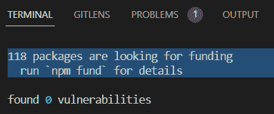

# 超级速度 – 时空悖论和未兑现的承诺

在本章中，我们将讨论我们如何处理在测试框架的事件循环中多线程执行时出现的问题。然后，我们将探讨当我们开始添加更复杂的功能时，如何保持框架中的开关在一致的位置。

JavaScript 是一种疯狂快速的编程语言。因为它的主要目标是尽可能快地构建网站页面，它使用多线程在事件循环中执行代码行。这在尽可能快地构建网页方面是一个优势，但在需要按特定顺序执行事件的测试自动化中可能会成为障碍。

事实上，这个速度极快的家伙甚至可以穿越时空。让我们在下一节中看看一个例子。

在我们这样做之前，这里是我们将在本章中涵盖的主题列表：

+   时空困境

+   薛定谔和测试自动化的量子力学

+   回调、Promise 和 async/await

+   纤维的死亡和同步模式

# 技术要求

所有测试示例都可以在这个 GitHub 仓库中找到：[`github.com/PacktPublishing/Enhanced-Test-Automation-with-WebdriverIO`](https://github.com/PacktPublishing/Enhanced-Test-Automation-with-WebdriverIO)。

# 时空困境

让我们从最基本的脚本开始 – 登录。在 `\pageobjects` 文件夹中打开 `login.page.ts`。注意 `login()` 函数中有一个 `async` 命令：

```js
    public async login (username: string, password: string)
        await this.inputUsername.setValue(username);
        await this.inputPassword.setValue(password);
        await this.btnSubmit.click();
    }
```

`async` 关键字强制函数始终是异步的，返回一个表示函数完成或失败的 `Promise` 对象。在 `.setValue` 和 `.click` 命令之前还有一个 `await` 关键字，它暂停函数直到 `Promise` 对象被解决或拒绝。如果移除 `await` 命令会发生什么？

```js
    public async login (username: string, password: string) {
        //Removed await keyword
        this.inputUsername.setValue(username);
        this.inputPassword.setValue(password);
        this.btnSubmit.click();
    }
```

从 Visual Studio Code 命令行运行 `wdio` 测试：

```js
 > yarn wdio
```

当测试执行时，它失败了！这表明在以下结果中提供的用户名无效，这让我们陷入了一个兔子洞，因为密码实际上是完全有效的：

```js
» \test\specs\ch2.ts
 My Login application
    x should login with valid credentials
 1 failing (12.2s)
 1) My Login application should login with valid credentials
 Expect $(`#flash`) to have text containing
- Expected  - 1
+ Received  + 2
- You logged into a secure area!
+ Your username is invalid!
```

那么，发生了什么变化？代码的执行顺序！没有 `await` 关键字，Node.js 将会同时执行所有 JavaScript 命令。所以，“您已登录到安全区域！”失败了，因为“用户名”字段被完全填充。相反，它报告“您的用户名无效”，因为当**提交**按钮被点击时，用户名仍然是空的。

当然，最好的超级英雄侦探需要更多的证据。没有人想到在犯罪现场拍照。所以，让我们添加一些调试输出并再次尝试测试：

```js
global.log (`Logging in with '${username}' and '${password}'`)
this.inputUsername.setValue(username);
global.log (`Entered '${username}'`)
this.inputPassword.setValue(password);
global.log (`Entered '${password}' and clicking Submit`)
this.btnSubmit.click();
global.log ("Submit clicked!")
```

这次，结果显示测试通过了。然而，我们现在遇到了一个过时的元素：

```js
[0-0] ---> Logging in with 'tomsmith' and 'SuperSecretPassword!'
[0-0] ---> Entered 'tomsmith'
[0-0] ---> Entered 'SuperSecretPassword!' and clicking Submit
[0-0] ---> Submit clicked!
[0-0] 2022-12-03T18:07:52.839Z WARN webdriver: Request encountered a stale element - terminating request
[0-0] PASSED in chrome - D:\repos\wdio\test\specs\ch2.ts
```

哪个元素是过时的？为了找出答案，我们需要将 `wdio.conf.ts` 中的 `logLevel` 改回 `info`：

```js
    logLevel: 'info',
```

现在，当我们重新运行测试时，我们得到了一个完全不同的错误，隐藏在大量信息中：

```js
[0-0]   error: 'no such element',
[0-0]   message: 'no such element: Unable to locate element: {"method":"css selector","selector":"#flash"}\n' +
[0-0]     '  (Session info: chrome=107.0.5304.122)',
```

看起来事情已经失控了。如果我们尝试添加更多的 `debug` 语句，我们可能会得到不同的结果，这些结果可能无法重复。你相信这个现象在比这本书更高级的书中被描述过吗？

# 谢林格和测试自动化的量子力学

这个问题类似于量子力学中众所周知的 *测量问题*。简单来说，在量子层面上测量事件的后果可能会改变事件的后果。想象一下用温度计测试冷水温度。随着时间的推移，测量设备会稍微加热冷水，而设备本身也会从冷水中冷却。因此，随着时间的推移，读数变得不确定。

在这种情况下，将详细信息发送到控制台窗口会给系统带来一点额外的开销。语句的执行速度略有变化，完成顺序也是如此，每次都会得到不同的结果。这与 JavaScript 事件循环中语句执行优先级的选择有很大关系，如下所示：


图 4.1 – JavaScript 事件循环中承诺和回调执行顺序的可视化

JavaScript 有一个包含主线程、宏任务和微任务的 Event Loop。后者，即承诺，在主线程语句之后执行。包括回调和超时语句的 `MacroTasks` *可以*在主线程之前但承诺之后执行。当这些任务以意外的顺序完成时，你可能会在调试过程中浪费数小时的时间来隔离问题。

`MacroTasks` 通常与 I/O 操作或 UI 渲染相关。`MacroTasks` 的例子包括 `setTimeout`、`setInterval`、`setImmediate` 和 I/O 操作。这些任务由事件循环执行，并且可以在 `MicroTasks` 之前或之后运行。

`MicroTasks` 通常与承诺相关。它们还可以包括突变观察者。开发者会在各种场景中使用这些，例如跟踪属性的变化、检测子元素的添加或删除，或者甚至观察元素内字符数据的变化。`MicroTasks` 在主线程语句执行之后和下一个 `macroTask` 执行之前执行。它们用于处理回调和解决承诺。

当任务以意外的顺序完成时，可能会导致调试挑战。这是因为执行顺序会影响测试的整体行为。对于在多个线程上优化构建网页所需的时间来说，这是可以接受的，但对于试图按顺序运行脚本步骤的 SDETs 来说，这会造成混乱。

# 回调、承诺和 async/await

为了解决这些问题，我们需要强制 JavaScript 以线性顺序执行代码。JavaScript 提供了三种解决方案——回调、承诺和 `async`/`await` 关键字。JavaScript 承诺和回调是两种了解异步调用何时有结果的方式。回调允许你在收到响应后执行一个函数。承诺做同样的事情，并允许你为多个操作指定一个易于阅读的顺序，以及处理错误情况。然而，你知道还有一个处理承诺的更简单的方法，称为同步模式吗？

# 纤维和同步模式的消亡

为了使异步回调到函数的实现更容易，JavaScript 添加了承诺。函数被传递时不带括号，这使得它们在视觉上与变量和对象相似。然后，`node-fibers` 包项目在后台隐式地将语句包装为回调。

直到版本 7.0，WebdriverIO 利用 `node-fibers` 包作为 `@wdio/sync` 功能的一部分。这意味着所有浏览器方法都会以同步方式执行，而不需要回调、承诺或 **await**。这对 WebdriverIO 框架架构师来说是一个绝妙的权衡！它避免了时间旅行问题，同时使代码更简单。

不幸的是，`node-fibers` 项目在 2021 年被终止。WebdriverIO 被迫通知用户两个解决方案——他们可以将 Node 锁定到最后一个与 `node-fibers` 兼容的受支持版本，从而错过 JavaScript 通过不断发展的 ECMAScript 标准添加的新功能。或者，他们可以将代码库重构以在函数中包含 `async` 并在浏览器方法中使用 `await`。大多数人选择了后者，并面临了大量代码重构的工作。



图 4.2 – 寻找资金的包

话虽如此，让我们看看我们如何解决这个时间危机。在我们之前的章节中，我们通过传递一个 `promise` 对象来模拟错误：

```js
await global.log (Promise) // Adds trace
```

如果我们移除 `await` 关键字会发生什么？

```js
global.log (Promise) // Adds trace with WARN out of order
[0-0] Trace
[0-0]     at global.log (D:\repos\Test-Automation-with-WebdriverIO\test\wdio.conf.ts:379:21)
[0-0]     at UserContext.<anonymous> (D:\repos\wdio\test\specs\example.e2e.ts:13:22)
[0-0] --->     WARN: Log was passed a Promise object
```

注意，当代码中缺少 `await` 时，所有发生的事情只是在错误详情之后出现自定义的 `WARN` 消息，而不是之前。这与 JavaScript 在多个线程中执行有关。我们有事件执行顺序错误的证据。

## 使用 async 和 await 保持简单

本书中的每个自定义方法都将异步执行。从理论上讲，我们可能会认为同时填充字段和下拉列表以提高速度是聪明的。然而，通常从列表中选择一个值将启动一个 `Ajax` 方法，该方法将更新网页。然后，如果元素尚未存在，因为代码在页面重新构建时执行，这将导致字段生成错误。

# 摘要

在本章中，我们了解了同步代码执行对我们框架的影响。虽然回调和承诺是保持代码按顺序运行的方法，但最好使用 async 和 await 来保持一致性。我们还升级了全局值到一个单一的 `switchboard` 对象，该对象可以在调试会话中查看。

在下一章中，我们将把到目前为止的所有内容结合起来，以增强我们的第一个方法包装函数。
