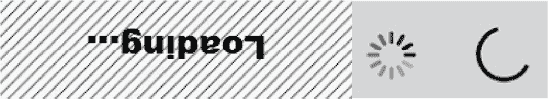

# 5

# 另一个自我 – 点击包装器

在本章和接下来的几章中，我们将介绍为`.click()`、`.select()`和`.setValue()`内置方法添加包装器的概念。这些包装器使我们能够向这些方法添加更多功能，从而使框架更加健壮，减少在测试过程中出现故障的可能性。

包装器是扩展测试套件功能的最简单方法，消除了重复添加代码（以多个测试脚本的形式）的需要。有时在测试时，页面加载缓慢，我们的元素需要更长的时间才能加载。有时，页面由于**异步 JavaScript 和 XML**（**AJAX**）而更新，我们找到的元素现在已过时，必须再次找到。我们在控制台窗口和 Allure 中显示的结果应该足够详细，以指示正在发生什么。包装器使我们能够高效地处理所有这些信息，包括滚动元素到视图中进行屏幕截图，寻找类似的替换对象以减少维护，以及在页面构建期间节省时间，以便元素有时间出现，而不必求助于较慢的硬编码等待方法。

我们将探索三种方法来为我们的框架注入超级力量：

+   辅助命令

+   浏览器命令

+   元素命令

我们首先开始添加一个`helpers`文件及其先决条件。

# 添加一个辅助文件

我们首先准备我们的辅助命令，这些命令需要`utility-types`包来支持 TypeScript 中的可选参数。此包可以通过以下命令安装：

```js
> yarn add utility-types
```

我们接下来将添加一个包含`helpers.ts`文件模块的`\helpers`文件夹。这个模块包含解决框架中问题的几个方法。这是我们存储框架大部分自定义支持代码的地方。

要在用 TypeScript 编写的 WebdriverIO 项目中创建一个辅助文件，我们需要执行以下操作：

1.  在我们的项目中创建一个新的目录来存储我们的辅助函数。这个目录将被称为`helpers`，位于我们的`src`目录中。

1.  在`helpers`目录中，为我们的辅助函数创建一个新的 TypeScript 文件。让我们称这个文件为`helpers.ts`。

1.  在`helpers.ts`文件的顶部，我们需要导入支持文件路径、全局对象和 Allure 报告的必要类型和函数。其中一些将在未来的章节中发挥作用：

    ```js
    import * from as fs from "fs"import * as path from "path";
    import { ASB } from "./globalObjects.ts";
    import allure from "@wdio/allure-reporter";
    ```

1.  在`helpers.ts`文件中，我们需要定义我们的辅助函数。文件的结构将包括公共方法包装器，如`click()`、`pageSync()`和`assert()`。它还将包含用于查找和替换数据标记的私有支持方法，以及`getElementType()`来确定如何通过类处理错误：

    ```js
    export const clickElement = async (driver: WebDriver, element: WebDriver.Element) => {p  try {p
        await driver.click(element)p
      } catch (error) {p
        throw new WebDriverError(`Unable to click element: ${error.message}`)p
      }p
    }
    ```

1.  在我们想要使用辅助函数的文件中，我们按照以下方式从`helpers.ts`文件中导入函数：

    ```js
    import { clickAdv } from './helpers/helpers'pWe can then use the clickAdv function in our test code like this:
    await clickAdv(driver, element)
    ```

这只是我们如何在用 TypeScript 编写的 WebdriverIO 项目中创建和使用辅助函数的一个例子。我们可以在`helpers.ts`文件中定义我们需要的任何辅助函数，并在需要时将它们导入到测试代码中。

在我们到达`click()`方法之前，让我们从`console.log`的包装器开始，这样我们就可以自定义详细信息。如果我们碰巧用`is blank`或`empty`或`null`变量等字符串调用它，它不需要打印任何内容。但如果传递了除字符串或数字之外的内容，例如一个承诺或一个对象，它应该输出一个警告而不会失败：

```js
 p
/**
 * Console.log wrapper
 *    - Does not print if string is empty / null
 *    - Prints trace if not passed string or number
 * @param message
 */
export async function log(message: any): Promise<void> {
  try {
    if (typeof message === "string" || typeof message === "number") {
      if (message) {
        console.log(`---> ${message}`);
      }
    } else {
      console.log(`--->   helpers.console() received: ${message}`);
      console.trace();
    }
  } catch (error: any) {
    console.log(`--->   helpers.console(): ${error.message}`);
  }
}
```

注意当错误输出到控制台时有一些额外的间距。这是故意的。我们将在稍后通过间距和颜色使我们的输出更直观。

要利用辅助工具，我们在测试文件中添加以下导入行：

```js
import * as helpers from '../../helpers/helpers.ts';
```

要调用该方法，我们使用以下语句：

```js
helpers.log (`Hello, World!`)
> [0-0] ---> Hello, World!
```

如果方法被调用时传递了一个空字符串，它不会在控制台输出任何内容：

```js
helpers.log (``)
```

如果传递的不是字符串或数字，那么会输出对象和跟踪信息，以下情况通常会发生，由于缺少`await`关键字，返回了一个承诺对象而不是字符串：

```js
helpers.log (Promise)
> [0-0] --->   helpers.console() received: function Promise() { [native code] }
> [0-0] Trace
> [0-0]     at Module.log (file:///D:/repos/Test-Automation-with-WebdriverIO/helpers/helpers.ts:14:15)
> [0-0]     at UserContext.<anonymous> (file:///D:/repos/Test-Automation-with-WebdriverIO/test/specs/example.e2e.ts:10:17)
```

当一个有问题的元素传递给`helper.log`包装器时，第二行代码`UserContext`将确定实际错误发生的位置。我们的调试现在开始看起来好一些。

让我们接下来识别并解决`login.page.ts`文件中`.click`方法的一个潜在问题。

# 测试自动化的“Hello, World!”

测试自动化的`Hello, World!`通常是一个检查网页上简单元素存在性的测试，例如标题或一段文本。这可能涉及编写以下操作的测试：

+   导航到一个网页

+   使用 XPath 或 CSS 选择器方法在页面上定位一个元素

+   验证元素是否在页面上存在并显示

在我们的第一个示例中，我们有以下五个简单的步骤来执行登录：

1.  导航到一个模拟的登录界面。

1.  输入用户名。

1.  输入密码凭据。

1.  点击登录按钮。

1.  验证是否出现一条消息，表明登录成功。

一个例子可以在`pageObjects\login.page.ts`文件中找到：

```js
await this.inputUsername.setValue(username);
await this.inputPassword.setValue(password);
await this.btnSubmit.click();
```

我们已经通过使用`await`语句解决了由于代码执行顺序错误可能出现的错误。然而，随着开发者更改我们正在自动化的页面，元素定位器可能会随着时间的推移而变得过时。例如，想象一下登录按钮的类最初是一个`button`类：

```js
<button class="radius" type="submit" fdprocessedid="ra4xrd">p
    <i class="fa fa-2x fa-sign-in"> Login</i>p
</button>
```

但在下一个版本中，它被更改为一个锚链接类：

```js
<a class="radius" type="submit" fdprocessedid="ra4xrd">p
    <i class="fa fa-2x fa-sign-in"> Login</i>p
</a>p
```

然后`.click`方法将抛出以下错误：

```js
[0-0] Error: Can't call click on element with selector "button[type="submit"]" because element wasn't found
```

我们可以在点击周围使用 `try`/`catch` 方法来捕获异常，并获取更多关于确切错误原因的详细信息。在这个例子中，如果点击方法成功，我们输出成功的事件。然而，如果元素不存在，被另一个元素覆盖，或者以其他方式无法点击，我们输出 `captured` 错误细节并将其发送到我们的控制台：

```js
    try{
        await this.btnSubmit.click();
        helpers.log(` Clicked button`);
    } catch (err)
        helpers.log(`    Click failed because\n${err)`);
  }
```

我们希望每个元素都有这样的功能，但又不希望在我们所有的测试脚本中重复添加此代码。幸运的是，有了包装器，有更好的方法。

# ES6 辅助模块与覆盖内建方法

有多种方法可以实现这个目标。一种方法是在每次调用中完全覆盖 `click()` 方法的内建行为。另一种方法是创建我们自己的自定义方法，并使用其独特的命名约定。最后，我们可以创建一个自己的函数，该函数接受对象作为参数并执行额外的功能。以下是这三种方法可能的样子：

我们可以覆盖所有的内建 `click()` 方法：

```js
btnLogin.click() // Customized with overWriteCommand
```

我们可以添加一个自定义方法：

```js
btnLogin.clickAdv()
```

或者在我们的 `Helpers` 文件中创建一个自定义函数：

```js
clickAdv(btnLogin)
```

你使用的方法由你决定。但关键是选择一个并始终如一地坚持，而不是使用不同方法的混合。每种方法都有其独特的优点值得考虑。让我们看看前两种方法的优缺点。

## 覆盖内建元素方法

我们可以增强 `click()` 方法的一种方式是完全覆盖来自 `ts.config.json` 文件的内建元素方法，如下所示：

```js
browser.overwriteCommand('click', async(origClick, element)= {
    let success = true;
    try{ p           element = await getValidElement(element, "button");
       await element.click(); // Instrinsic click
       console.log(' Clicked ${element.selector}');
    } catch (err)
        success = false;
        console.log(`$   {element.selector}click failed\n ${err)`);
  }
    return success;
})
```

这个命令将封装诸如检查对象有效性、设置框架、将框架设置到某个位置以及当元素不存在时跳过额外方法等功能。我们通过健全性测试来完成这项工作。例如，我们将尝试点击一个不存在的按钮 `btnBogus` 并查看脚本的其他部分如何执行。以下是这个虚假按钮的对象描述：

```js
await this.btnBogus.click();
```

使用这种方法，签名保持不变，并且我们所有的测试脚本都得到了增强：

```js
await this.btnSubmit.click();
```

自定义的 `click()` 方法可以添加更多关于正在发生什么的细节：

```js
[0-0] ---> Clicking button[type="submit"] ...
[0-0] --->   button clicked.
```

这种方法有效地为整个测试套件中每个元素的 `click()` 方法添加了增强功能。但这也是一个缺点——这个方法中的错误可能会在 `click()` 方法被使用的任何地方造成破坏。没有简单的方法可以将测试脚本中的特定行恢复到原始的内建方法，以查看错误是否是由覆盖的代码引起的。我们只能全部开启或全部关闭。

必须还有另一种方法！

## 添加自定义元素方法

我们可以向浏览器对象添加一个自定义元素命令。在这种情况下，让我们称它为 `clickAdv()`。它可以通过更改前面代码的第一行和最后一行来实现，如下所示：

```js
browser.addCommand("clickAdv", async function (){
…
}, true);
```

方法的调用变为如下所示：

```js
await this.btnSubmit.clickAdv();
```

自定义`clickAdv()`方法与覆盖版本具有相同的细节：

```js
[0-0] ---> Clicking button[type="submit"]
[0-0] --->   button clicked.;
```

快速提示

避免使用“魔法”值。这些值只有开发者知道，可能在文档中难以找到。在上一个示例中，最后一行将隐式的`false`覆盖为`true`。这意味着自定义方法应该添加到元素中，而不是浏览器中。

现在我们有了`clickAdv()`自定义方法的灵活性，可以通过在原子级别移除`Adv`来将其还原为内置版本：

```js
await this.btnAddToCart.clickAdv();
```

这是通过从方法中移除`Adv`来实现的：

```js
await this.btnAddToCart.click();
```

这看起来很完美！我们现在只需要用无效元素进行一点负面测试，看看输出是否表明点击失败。

# 谁测试 SDET 的代码？自动化框架的健全性测试

单元测试是任何开发项目的重要组成部分。由于预期开发者将为应用程序的功能编写单元测试，因此 SDETs 为框架代码库本身编写单元测试也是合理的。然而，“单元测试”和“集成测试”这两个术语在应用于自动化框架本身时常常引起混淆。让我们将这个方面称为“自动化框架的健全性测试”，尽管它实际上是针对离散框架功能及其集成的单元测试。这些是故意测试框架中功能可行性的脚本。就像之前的“Hello, World”示例一样，测试自动化有一个健全性测试版本，它测试我们的每个高级方法。由于自动化是一个开发项目，我们应该有一个简短的测试，故意测试框架的能力。这可能包括查找过时的 XPath 或 CSS 定位器，动态更改嵌入的数据标签为当前日期，或从包装方法中编写详细的日志。它可能包括对一个不存在的元素的负面测试，故意失败作为其预期结果。

随着我们添加更多功能，我们也应该在脚本中添加健全性测试。我们将添加一个不存在的按钮`btnBogus`，这将迫使方法失败：

```js
    public get btnBogus () {
        return $('button[type="bogus"]');
    }
```

为了进行健全性测试，我们将点击`btnBogus`按钮，然后点击`login` `page`类中的`login fail`方法中的`submit`按钮：

```js
        await this.btnBogus.clickAdv();
```

而我们的结果并不是我们所预期的：

```js
Error: Can't call clickAdv on element with selector "button[type="bogus"]" because element wasn't found
```

WebdriverIO 在执行自定义方法之前验证元素。如果方法被覆盖，也会发生相同的情况。这里的问题是它阻止我们在框架中实现自我修复对象或用可行的元素替换过时的元素。

必须有另一种方法。

# 通过自定义点击方法扩展我们的 ES 模块辅助文件

有两种方法可以编写无错误的程序；只有第三种方法有效。

–艾伦·J·佩里斯

我们的第三个选项是在`helpers`文件中创建一个`click()`方法。虽然它改变了我们的签名，但它使我们能够更好地控制从元素问题中恢复：

```js
await helpers.clickAdv(this.btnSubmit);
await helpers.clickAdv(this.btnBogus);
```

输出现在看起来是这样的：

```js
[0-0] ---> Clicking button[type="submit"] ...
[0-0] --->   button clicked.
[0-0] --->   pageSync() completed in 25 ms
[0-0] ---> Clicking button[type="bogus"] ...
[0-0] --->   button[type="submit"] was not clicked.
[0-0] Error: Can't call click on element with selector "button[type="bogus"]" because element wasn't found
```

快速提示

与许多编码约定不同，没有命名包装方法（wrapper methods）的通用方法。一些团队可能会使用尾随下划线（`_`），而其他团队可能会附加 `Wrapper` 这个词。这里的重要启示是，团队应该就一个可识别的命名约定达成一致，并在编码标准文档中记录，并在代码审查中遵循。

现在我们正在检查我们的按钮是否可以点击，让我们看看之后会发生什么。

# 为什么等待（waits）难以正确实现？

所有自动化工具都有确定当元素不存在时该做什么的方法。最常见的方法是等待对象存在。WebdriverIO 在 `wdio.config.json` 文件中有一个选项可以调整元素的超时时间：

```js
// Default timeout for all waitFor* commands.
waitforTimeout: 10_000,
```

默认时间是 10 秒。多年来，最常见的做法是等待 30 秒。问题是，根据我们的工具，如果我们的脚本导航到了错误的页面，超时可能会发生在每个元素上。如果有很多元素不存在，那么等待脚本最终结束的时间就会很长。

回到 2000 年代，WorkSoft 的创始人琳达·海斯（Linda Hayes）指出，有一种方法可以为我们框架计算一个良好的等待超时时间。将我们最慢页面渲染的平均时间乘以三。这意味着我们将预测测试中的应用程序将增加负载，并且可以足够灵活地处理它。

不同的工具有许多等待元素出现的方法。例如，Selenium 这样的工具有三个：隐式等待（implicit waits）、显式等待（explicit waits）和流畅等待（fluent waits）。隐式等待告诉 Selenium 在找不到页面上的元素之前等待一定的时间，然后抛出异常。显式等待等待特定条件满足后再继续，例如 `enabled` 或 `clickable`。流畅等待允许自定义最大等待时间、检查条件的频率以及应忽略的异常类型。

但是，一个元素不存在下一个最常见的原因是什么？那是因为页面仍在构建中。我们只需为元素出现添加一个硬编码的等待时间即可。

问题在于当这些等待混合在一起时，Selenium 脚本的实际等待时间可能会累计到几分钟，变得难以调试。

类似地，WebdriverIO 提供了多种等待类型来处理网页上的动态元素。这些包括 `waitUntil()`、`waitForExist()`、`waitForDisplayed()`、`waitForEnabled()` 和 `waitForSelected()` 等命令，这些命令允许在继续测试执行之前等待特定条件满足。

注意，`waitForExist()` 命令在测试自动化中很少使用。它仅仅意味着元素存在于 DOM 中，并不意味着它出现在页面上。`waitForDisplayed()` 提供了相同的检查，并使得元素更有可能被用户交互。

再次强调，琳达·海斯指出，为了使框架更健壮，每个元素都应该被检查以确保它存在并且已启用。这就像我们在夜间沿着蜿蜒的山路开车时，为我们的高速汽车提供了刹车。

如果我们不是等待每个元素都出现并启用，而是等待每次点击后页面构建完成，那会怎么样？这样，页面上每个元素更有可能是有效的。这将消除每次检查元素是否存在的需求。只有在元素未找到时，框架才能在抛出错误之前想出找到它的方法。

## “我不总是使用 Pause()，但当我使用时，它的时间不到 1000 毫秒”

是的，有时我们需要执行等待操作，但我们希望做得更智能。例如，`pageSync()`包装方法需要一个四分之一秒的等待时间，因为它正在计算页面上的元素数量。这是自定义`pause(ms)`方法的代码，它将告诉我们当硬编码的半秒等待时间发生时：

```js
/**
 * Wrapper for browser.pause
 * @param ms reports if wait is more than 1/2 second
 */
export async function pause(ms: number) {
  if (ms > 500){
  log(`  Waiting ${ms} ms...`); // Custom log
  }
  const start = Date.now();
  let now = start;
  while (now - start < ms) {
    now = Date.now();
  }
}
```

如果延迟时间超过半秒，该方法将写入控制台。这是为了提醒我们注意框架中的延迟量。`wait`就像给汤里加盐一样：一点是好的，但太多会毁掉所有人的汤。我们还可以计算总共浪费了多少时间。

## 突出显示元素

接下来，我们将添加一种突出显示元素的方法，以确保我们在调试时可以看到正在发生的情况。这些突出显示也是一个方便的检查元素是否可见的方法。此代码将以绿色突出显示一个元素，尽管我们可以覆盖该颜色。它还有一个检查，看我们正在突出显示的元素是否已经过时。如果是这种情况，该元素将被保存到自动化交换板，并且过时元素开关设置为`true`。这允许我们在调用例程中更新元素，以消除过时元素减慢测试执行速度的可能性。最后，该函数返回元素是否可见：

```js
export async function highlightOn(
  element: WebdriverIO.Element,
  color: string = "green"
): Promise<boolean> {
  let elementSelector:any
  let visible: boolean = true;
  try {
      elementSelector = await element.selector;
      try {
        await browser.execute(`arguments[0].style.border = '5px solid ${color}';`, element);
        visible = await isElementVisible(element)
      } catch (error: any) {
        // Handle stale element
        const newElement = await browser.$(elementSelector)
        ASB.set("element", newElement)
        ASB.set("staleElement", true)
        await browser.execute(`arguments[0].style.border = '5px solid ${color}';`, newElement);
        //log (`  highlightOn ${elementSelector} refresh success`)
      }
  } catch (error) {
    // Element no longer exists
    visible = false
  }
  return visible;
}
```

由于我们已经启用了突出显示功能，我们应该添加一些可以关闭突出显示的东西，我们将使用旋转器检测方法：

```js
export async function highlightOff(element: WebdriverIO.Element): Promise<boolean> {
  let visible: boolean = true;
  try {
      await browser.execute(`arguments[0].style.border = "0px";`, element);
  } catch (error) {
      // Element no longer exists
      visible = false;
  }
  return visible;
}
```

此方法简单地告诉我们移除突出显示时元素是否可见。

接下来，让我们实现一个旋转器检测方法，该方法等待直到旋转器不再出现在页面上：



注意，这个元素定位器将因项目而异。在某些项目中，我们寻找旋转器和加载器：

```js
export async function waitForSpinner(): Promise<boolean> {
  let spinnerDetected: boolean = false;
  // This spinner locator is unique to each project
  const spinnerLocator: string = `//img[contains(@src,'loader')]`;
  await pause(100); // Let browser begin building spinner on page
  let spinner = await browser.$(spinnerLocator);
  let found = await highlightOn(spinner);
  let timeout = ASB.get("spinnerTimeoutInSeconds")
  const start = Date.now();
  if (found) {
    const startTime = performance.now();
    spinnerDetected = true;
    try {
      while (found) {
        found = await highlightOn(spinner);
        if (!found) break;
        await pause(100);
        found = await highlightOff(spinner);
        if (!found) break;
        await pause(100);
        if  (Date.now() - start > timeout * 1000) {
          log (`ERROR: Spinner did not close after ${timeout}           seconds`)
          break;
        }
      }
    } catch (error) {
      // Spinner no longer exists
    }
    log(`  Spinner Elapsed time: ${Math.floor(performance.now() -     startTime)} ms`);
  }
  return spinnerDetected;
}
```

该方法利用`highlightOn()`和`highlightOff()`方法在检测到旋转器或**加载中…**元素时闪烁它。如果旋转器在超时时间内没有消失，它将记录一条消息。最后，如果检测到旋转器，它将返回一个布尔值。这有助于我们优化框架，因为如果我们需要执行页面同步，旋转器就会出现。

现在，我们可以继续扩展`click()`包装器。它需要一个动态方法来等待页面构建。

# 扩展点击方法包装器

让我们扩展`clickAdv()`方法，使其更加健壮，减少失败的可能性。首先，我们将在辅助类中添加一个`pageSync()`函数。这是一个确定页面构建何时稳定下来的替代方法。在每次点击后，我们将执行以下操作：

1.  计算页面上可见的`/span`元素的数量。

1.  等待 1/4 秒。

1.  重复以上步骤，直到以下任一情况发生：

    +   `/span`元素的计数稳定了三次

    +   超时了

1.  报告完成所需时间的服务级别协议指标。

1.  添加自定义等待时间长度的选项。

页面同步方法将动态等待页面构建。它被优化为至少花费 0.75 秒来检测页面何时完成。这减少了如果我们的元素在页面构建过程中不存在时抛出错误的概率。但它也给了我们等待更长时间的灵活性，如果系统负载很大，导致一切变慢，页面可以等待长达 30 秒。

它相当大，所以让我们将其分解：

```js
/**
 * pageSync - Dynamic wait for the page to stabilize.
 * Use after click
 * ms = default time wait between loops 125 = 1/8 sec
 *      Minimum 25 for speed / stability balance
 */
let LAST_URL: String = "";
export async function pageSync(
  ms: number = 25,
  waitOnSamePage: boolean = false
): Promise<boolean> {
  await waitForSpinner();
```

我们首先等待任何旋转器或**加载…**元素出现。然后我们通过仅在 URL 发生变化时执行来优化：

```js
let result = false;
  let skipToEnd = false;
  let thisUrl = await browser.getUrl();
  if (waitOnSamePage === false) {
    if (thisUrl === LAST_URL) {
      //skip rest of function
      result = true;
      skipToEnd = true;
    }
  }
```

如果 URL 没有变化，那么更有可能是因为选择了列表选项，导致页面上的元素发生了变化，从而简单地出现了一个旋转器。如果 URL 是新的，那么我们首先获取元素的第一次计数。这是一个动态循环，至少执行三次：

```js
  if (skipToEnd === false) {
    LAST_URL = thisUrl;
    const waitforTimeout = browser.options.waitforTimeout;
    let visibleSpans: String = `span:not([style*="visibility: hidden"])`;
    let elements: any = await $$(visibleSpans);
    let exit: boolean = false;
    let count: number = elements.length;
    let lastCount: number = 0;
    let retries: number = 3;
    let retry: number = retries;
    let timeout: number = 20; // 5 second timeout
    const startTime: number = Date.now();
    while (retry > 0) {
      if ((lastCount != count) || (count < 20)) {
        retry = retries; // Reset the count of attempts
      }
      // Exit after 3 stable element counts
      if (retry == 0) {
        break;
      }
      if (timeout-- === 0) {
        log("Page never settled");
        exit = true;
        break;
      }
      lastCount = count;
```

在每个元素计数之后，我们让页面短暂地继续构建。然后我们再次计数元素，直到连续三次尝试的计数相同。此外，我们持续检查页面计数是否大于 20 个元素。通常，这低于一个阈值，如果没有旋转器或**加载…**元素，页面就是空的。

需要注意的是，我们只计数`Span`元素。这可能是`div`元素，但我们不应该计数所有带有星号通配符的元素，原因在于，计数页面上的每个元素本身可能需要超过四分之一秒的时间：

```js
      // wait 1/4 sec before next count check
      await pause(ms);
      try {
        elements = await $$(visibleSpans);
      } catch (error: any) {
        exit = true;
        switch (error.name) {
          case "TimeoutError":
            log(`ERROR: Timed out while trying to find visible             spans.`);
            break;
          case "NoSuchElementError":
            log(`ERROR: Could not find any visible spans.`);
            break;
          default:
            if (error.message === `Couldn't find page handle`) {
              log(`WARN: Browser closed. (Possibly missing await)`);
            }
        }
        // Error thrown: Exit loop
        break;
      }
      count = await elements.length;
      retry--;
    }
```

元素计数可能会抛出错误。函数可能会超时。页面可能没有 span 元素，或者调用可能没有使用`await`关键字。在任何情况下，函数都会退出：

```js
    // Metric: Report if the page took more than 3 seconds to build
    const endTime = Date.now();
    const duration = endTime - startTime;
    if (duration > waitforTimeout) {
      log(`  WARN: pageSync() completed in ${duration / 1000}       sec  (${duration} ms) `);
    }
  }
  return result;
}
```

此方法接受两个可选参数。第一个是页面元素计数之间的等待时间（以毫秒为单位）。默认值可以低至 25 毫秒，但不应该超过 250 毫秒。这为我们提供了在点击后页面完成构建的最佳时间量。如果点击执行时页面没有变化，则为了速度，将跳过同步，并且如果没有 span 元素存在，它将提前退出。这通常发生在页面为空白的情况下。如果页面在几秒钟内没有稳定下来，它将退出并报告给控制台。

如果等待时间超过了框架的预期超时时间，它还会给我们一个警告。这意味着页面加载时间比用户愿意等待的时间更长。我们可以调用我们的 DBA 并检查具有过度记录检索时间的 SQL 查询。

为了提高效率，`pageSync`只有在页面 URL 发生变化时才会执行。这是一个速度优化。第二个参数是一个开关，用于强制进行页面同步检查，即使页面 URL 保持不变。

最后，它将指示浏览器是否不再存在。这可能发生在调用方法中缺少 await 语句，并且测试提前结束的情况下。

# 点击事件前的超级充电滚动

在执行点击之前检查元素是否在屏幕上是一个好的做法。此方法如果元素在视口中，则返回`true`：

```js
export async function isElementInViewport(element: WebdriverIO.Element): Promise<boolean> {
  let isInViewport = await element.isDisplayedInViewport();
  return isInViewport;
}
```

使用此方法，我们可以在执行点击事件之前仅当元素不在屏幕上时才滚动元素，从而优化我们的代码。然而，有一个注意事项：如果元素在 WebdriverIO 尝试点击它时正在移动，它可能会点击错误的元素！因此，我们需要另一个函数来告诉我们元素何时停止移动：

```js
export async function waitForElementToStopMoving(element: WebdriverIO.Element, timeout: number = 1500): Promise<boolean> {
  let rect = await element.getRect();
  pause (100);
  let isMoving = (rect !== await element.getRect())
  let startTime = Date.now();
  // Keep checking the element's position until it stops moving or the timeout is reached
  while (isMoving) {
    // If the element's position hasn't changed, it is not moving
    if (rect === await element.getRect()) {
      // Element is static
      isMoving = false;
    }else{
      // Element is moving...
      pause (100)
    }
    // If the timeout has been reached, stop the loop
    if (Date.now() - startTime > timeout) {
      break;
    }
    // Wait for a short amount of time before checking the element's position again
    await pause(100);
  }
  return !isMoving;
}
```

此方法检查元素位置是否在水平或垂直方向上发生变化。为了优化速度，只有在检测到元素已离屏时才会调用此方法。

让我们现在将这些内容组合成一个`clickAdv()`方法，以降低其失败的可能性。

快速提示：准确性胜过速度

如果测试无法达到成功结论，那么加快测试速度并不会带来优势。在`pageSync()`中的元素计数之间的等待时间可以减少到 0 毫秒，但这会增加执行过早的风险。你可以调整这个值以获得最佳性能，但要注意框架不要运行得太快。

# 扩展点击方法包装器

现在，我们已经准备好添加我们的`clickAdv()`包装方法。每次点击后，我们将有一个`pageSync()`方法执行，以便在等待页面完成时内置灵活的时间：

```js
export async function clickAdv(
  element: ChainablePromiseElement<WebdriverIO.Element>) {
  let success: boolean = false;
  const SELECTOR = await element.selector;
  log(`Clicking ${SELECTOR}`);
  try {
    //await element.waitForDisplayed();
    if (!await isElementInViewport(element)){
      await element.scrollIntoView({ block: "center", inline: "center" });
      await waitForElementToStopMoving(element)
    }
    await highlightOn(element);
    await element.click({ block: "center" });
    await pageSync();
    success = true;
  } catch (error: any) {
    log(`  ERROR: ${SELECTOR} was not clicked.\n           ${error.message}`);
    expect(`to be clickable`).toEqual(SELECTOR);
    // Throw the error to stop the test
    await element.click({ block: "center" });
  }
  return success;
}
```

在这段代码中，我们从元素中获取选择器的名称。我们在点击方法周围使用`try`/`catch`。然后，我们通过使用我们自己的自定义错误消息强制测试失败来结束测试，指出元素无法点击。在自动化交换机中，我们将已失败的值设置为 true，以确保由于点击失败而跳过框架中其他方法的执行。最后，我们返回`true`或`false`布尔值以表示成功。

现在我们用错误的元素运行测试时，我们可以得到更多关于潜在问题的详细信息：

```js
[0-0] ---> Clicking button[type="bogus"]
[0-0] --->   ERROR: button[type="bogus"] was not clicked. [0-0] Error: element ("button[type="bogus"]") still not displayed after 30000ms
```

注意，我们在 30 秒后得到了一个错误，说元素找不到。然而，我们的页面是在 28 秒前构建的。因此，让我们将我们的超时设置得更高效一些。这可以通过修改`wdio.conf.ts`文件中的`waitforTimeout`值来实现，如下所示：

```js
waitforTimeout: 3000,
```

现在当测试运行时，测试失败之前不会超过三秒钟，但测试会等待更长的时间来构建页面：

```js
public get btnBogus() {
  return $('//button[type="bogus"]');
}
await helpers.clickAdv(this.btnBogus);
```

再次强调，这个超时值会因项目而异。接下来，我们需要实现跟踪我们执行的一些信息的功能。

# 指标的重要性

这些方法报告了它们执行所需的时间。`ClickAdv()` 还会在构建页面所需的时间超过框架默认超时时间时报告一个警告。通过这种方式，我们可以开始了解我们的更改如何随着时间的推移影响应用程序的响应速度，以及框架本身如何影响执行速度。

例如，使用给定测试的基线执行时间，我们可以看到框架增强是否对总时间有积极影响，或者意外地减慢了执行速度。一个好的页面稳定化方法通常会早于硬编码的等待继续执行。通过跟踪`Pause()`方法添加的总时间来跟踪总执行时间。

# 自愈元素

通过自定义方法包装器，我们现在可以开始通过使用自愈元素来减少框架中所需的维护工作。这些是在用户界面中自动从问题中恢复而不需要更新页面对象模型的元素。这可以包括由于自上次发布以来类已更改而变得无效的链接元素。自愈元素旨在通过减少手动输入的需求并允许测试有更好的机会完成来改善测试体验。

例如，假设在最新版本中`Login`按钮是一个链接：

```js
  public get lnkSubmit() {
    return $('//a[text()="submit"]');
  }
```

在此之后，我们调用不再有效的按钮：

```js
    // Class switching
    await helpers.clickAdv(this.lnkSubmit);
```

通常，如果点击此元素，它会抛出错误。但如果我们注入一个基于定位器获取有效元素的函数，即使底层类已更改，我们也有机会通过这一步：

```js
  element = await getValidElement(element);
  const SELECTOR = await element.selector;
  await log(`Clicking ${SELECTOR}`);
```

在以下代码中，我们将提取链接的类标签名和文本，并动态生成按钮元素定位器。虽然不太可能，但代码也涵盖了反向情况，即按钮类已变为链接：

```js
export async function getValidElement(
  element: WebdriverIO.Element
): Promise<WebdriverIO.Element> {
  let selector: any = await element.selector;
  // Get a collection of matching elements
  let found: boolean = true;
  let newSelector: string = ""
  let newElement: any = element;
  let elements: WebdriverIO.Element[];
  let elementType:string = ""
  let elementText:string = ""
  try {
    elements = await $$(selector);
    if (elements.length === 0) {
      let index: number = selector.indexOf("[");
      elementType = selector.substring(0, index);
```

到目前为止，我们没有找到与定位器匹配的元素。因此，我们需要根据自上次发布以来丢失的元素进行创新。在以下代码中，我们将查看从链接锚点变为按钮或反之亦然的潜在类更改：

```js
      switch (elementType) {
        case "//a":
          elementText = selector.match(/=".*"/)[0].slice(2, -1);
          newSelector = `//button[contains(@type,'${elementText}')]`
          break;
        case "//button":
          elementText = selector.match(/=".*"/)[0].slice(2, -1);
          newSelector =`//a[contains(text(),'${elementText}'])`
          break;
```

在以下代码中，我们将添加类似的类切换代码来处理列表和`Input`元素：

```js
        default:
          found = false;
          newElement = element;
          break;
      }
      newElement = await $(newSelector);
      found = await isElementVisible (newElement)
    }
  } catch (error) {
    found = false;
  }
  // Successful class switch
  if (found) {
    await log(
      `  WARNING: Replaced ${selector}\n with ${newSelector}`
    );
  } else {
    await log(`  ERROR: Unable to find ${selector}`);
  }
  return newElement;
}
```

请记住，`getValidElement()`并不能解决我们所有的维护问题。目标是通过拥有足够智能的框架来从多个过时元素中恢复，并到达给定的端点，从而显著减少我们的维护工作。替换定位器的代码将针对每个项目是独特的，但可能会令人惊讶地发现你的测试将多么稳健。虽然有一些额外的代码和控制台日志的开销，但与将新版本推送到预发布环境时更新元素定位器所需的时间相比，这微不足道。

# 使用“alreadyFailed”开关板键来模拟方法

具有单一出口点的框架可以使用开关板来跟踪通过、失败和跳过的步骤数量。通过在 ASB 开关板中嵌入`alreadyFailed`开关，可以编写方法以模拟，仅报告动作本意要执行的操作：

```js
   ASB.set(`alreadyFailed`, !found)
   if (ASB.get(`alreadyFailed`) === true)) {
      allure.addStep(`Click '${selector}'`, undefined, 'skipped');
      ASB.set(`skipped`, ASB.get(`skipped`)++)
      return;
    }
```

这样可以跳过所有页面同步时间和延迟，同时增加计数器以获取测试到达目的地的所需步骤数。

# 摘要

在本章中，我们添加了一个`helpers`库，其中包含几个方法来增强我们的`click`方法。然后我们解决了将屏幕外的元素拉到屏幕上，并使用页面同步等待页面构建的灵活时间，以确保我们的元素在测试时不会抛出错误的问题。我们还添加了高亮显示以及旋转检测器。我们引入了类切换的概念，以尝试找到，并包括了一些关于执行速度的细节。

现在我们已经为`click()`方法建立了大部分支持框架，让我们对`setValue()`做同样的事情。这包括验证我们的输入元素，并使用最快的方式通过剪贴板填充字段。接下来，我们将看到如何输入文本并替换动态数据。
