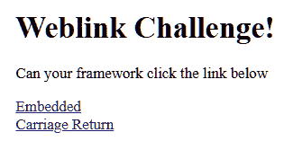
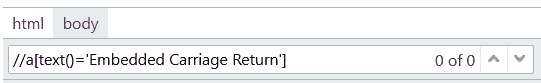
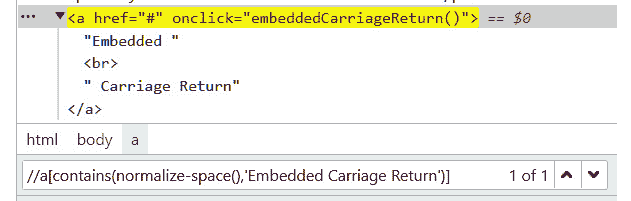

# 6

# `setValue` 包装器 – 输入文本和动态数据替换

在本章中，我们将适应之前章节中 `click()` 方法的功能，并将其扩展到 `setValue()` 方法。此外，包装器方法引入了在输入数据之前清除字段的多种方法。本章将向您展示如何实现动态数据标签替换作为增强功能。这是数据防止过时的焦点。例如，一个测试可能需要一个未来的或过去的日期。最后，我们将查看检测密码字段并使用 `setPassword()` 函数对其进行屏蔽。

在本章中，我们将涵盖以下主题：

+   创建 `setValue` 包装器

+   从普通英语规范化元素类描述

+   清除字段并输入数据的替代方法

+   动态替换 `<Today>` 标签为日期

+   隐藏敏感凭证数据

首先，有一些家务要做。在上一个章节中，我们介绍了按钮的类切换。我们将对输入字段以及即将到来的列表和文本元素做同样的事情。虽然我们可以推断出传递给 `getValidElement()` 方法的元素类型，但我们也可以直接从包装器中传递类型：

```js
inputField = await getValidElement(inputField, "field");
```

这意味着我们可以通过跳过提取 `element` 类的代码来优化代码的速度，通过明确地指定元素类型：

```js
 // Extract the element type if not provided
 if (elementType === "") {
 let index: number = selector.indexOf("[");
elementType = selector.substring(0, index);
 }else{
 elementText = normalizeElementType(elementType);
}
```

然而，显式的 `field` 字符串将不会匹配 `//input` 的隐式字符串类型。为了解决这个问题，我们将添加一个方法，将像 `field` 或 `item` 这样的通用描述符转换为合适的类字符串，例如 `//input` 和 “`//li`”。 

# 规范化元素类型

这是我们将编写一个方法来规范化所有显式字符串的地方。在这里，`link` 变为 `//a`，`button` 变为 `//button`，依此类推。您的框架可以根据需要继续扩展许多其他元素类型。以下函数 `normalizeElementType()` 将将元素的普通英语描述转换为常见的 `xPath` 等效值。请注意，`field` 和 `input` 变为相同的类，而空的类描述成为所有元素的定位符：

```js
function normalizeElementType(elementType: string)
{
  // Pessimistic: return all matches if the type is unknown
  let elementText = "//*"
  switch (elementType)
  {
    case "link":
      elementText = "//a";
      break;
    case "button":
      elementText = "//button";
      break;
    // Support different terms of the same field type
    case "field": // plain English reference to a type input field
    case "input": // type input
      elementText = "//input";
      break;
    case "list":
      elementText = "//select";
      break;
    case "text":
      elementText = "//p";
      break;
    default:
      log (`WARNING: Unable to normalize element type ${elementType}`)
  }
  return elementText;
}
```

在这个函数中，有几个值得注意的点。首先，该函数具有悲观性质，它假设传递的定位字符串为空或 `null`。`elementText` 被初始化为 `//*` 以返回第一行中的所有元素。这意味着我们假设在某个时刻可能会传递一个尚未实现的字符串，例如 `list`。为了文档记录，我们将未知字符串的名称作为警告输出到控制台日志。

其次，我们将元素更改为匹配所有值而不是停止测试。我们希望框架尽可能多地尝试到达终点，而不增加更多的维护时间。然而，它确实给出了一个警告，我们应该尽可能详细地描述。

由于我们现在支持未知元素类型，我们将向 `getValidElement()` 函数添加一个通用定位器：

```js
case "//*":
elementText = selector.match(/=".*"/)[0].slice(2, -1);
newSelector = `//*[contains(text(), '${elementText}'])`;
found = await isElementVisible(await $(newSelector));
break;
```

当我们规范化文本时，我们将常见的英语描述符替换为 `xpath` 元素或 CSS 字符串定位符等价物。然而，这不仅仅适用于类。这个相同的概念也被用于许多属性中。在我们继续到输入字段之前，让我们花一点时间看看一个链接。

规范化文本可以在 XPath 定位器中看到，使我们能够找到包含嵌入的回车和多余的临时空白空间的元素。在这个例子中，“嵌入回车”网页元素有额外的空格和回车：

```js
 <!DOCTYPE html>
<html>
<head>
    <title>Dynamic Loading Example</title>
    <script>
        function embeddedCarriageReturn() {
            var paragraph = document.getElementById("change-me");
            paragraph.innerHTML = "You clicked the Embedded Carriage             Return link!";
        }
    </script>
</head>
<body>
    <h1>Weblink Challenge!</h1>
    <p>Can you framework click the link below</p>
    <a href="#" onclick="embeddedCarriageReturn()">Embedded <br>        Carriage  Return</a>
    <p id="change-me"></p>
</body>
</html>
```



这意味着这个 xPath 无法识别链接：

```js
  public get btnEmbeddedCarriageReturn() {
    return $("//a[text()='Embedded Carriage Return']");
  }
```



然而，我们可以使用 `normalize-space()` 节点来规范化文本，以删除回车 `<br>` 换行符以及多余的空白：

```js
  public get btnEmbeddedCarriageReturn () {
    return $("//a[contains(normalize-space(),'Embedded Carriage     Return')] ");
  }
```



现在我们又有了工具箱中的另一个工具，我们可以编写可以找到包含额外空格和换行符的元素的定位器，如果这些元素被开发者清理，这将减少维护时间。让我们通过输入元素和 `setValue` 方法将这一概念提升到下一个层次。

# 添加 setValue() 方法包装器

我们首先在 `helpers` 文件中添加一个新的包装器，我们将扩展它以执行几个检查，然后再执行内建的 `setValue()` 方法：

```js
export async function setValueAdv(
  inputField: ChainablePromiseElement<WebdriverIO.Element>,
  text: string) {
//Custom setValue wrapper code here
await element.setValue(newValue);
}
```

现在，我们准备开始增强我们框架的数据填充方面。

# 这趟旅行真的有必要吗？

首先要做的就是检查以下代码是否必须执行。如果没有文本要输入，我们没有理由找到并替换一个有效的状态元素。因此，我们将首先检查是否已传递任何数据以进行输入：

```js
//Custom setValue wrapper code here
try{
    if (text.length === 0) {
        log (`      Warning: Attempted to enter "" into ${element.selector}`)
    return true;
}
}catch (error){
    log (`      Warning: Attempted to enter NULL into ${element.selector}`)
    log (`      Check if there was a query column to a missing column in a data file `)
    return false;
}
```

这个函数有三个动作：

+   如果文本不是 null 且不为空，代码将继续执行方法的其余部分。

+   如果文本为空字符串，则返回 `true`，意味着测试可以继续。这很有用，因为我们可能正在填充整个页面，但并非每个字段都需要值。我们可能通过姓氏、邮编和州的任意组合进行搜索。这允许我们设计一个页面方法，它具有所有输入字段，但仅与接收某些数据的元素交互。

+   空值是一个特殊情况。它是一个表明有问题的线索。作为超级英雄，我们总是想收集线索来识别通常的嫌疑人，他们正在犯罪。如果线索是以谜语的形式出现的，我们可能会与当地的精神病院联系，看看是否还有囚犯被关在带有问号的牢房里。

+   在这种情况下，NULL 值通常表明查询返回了空值。我们向控制台发送警告，并返回 `false` 作为状态。就像空值一样，它跳过函数的其余部分。

确认输入数据后，我们将采取第二步，并添加保持数据新鲜的能力。

# 煤炭变成钻石——替换动态数据标签

测试自动化中的一个非常常见的任务是使用当前日期填充字段。现在，我们不想每天手动更改日期，所以我们想要一个动态的功能来提供这种功能。如果我们足够聪明，这个功能可以返回当前、过去或未来的日期。甚至日期格式也可以修改。这就是嵌入式动态数据标签技术发挥作用的地方。

动态数据标签是一种保持定期变化的数据新鲜的方式。这可能是一周中的当前日期，一个由需要完成的批处理作业创建的唯一顺序号，或者一个排除周末和假期的未来业务日期。

每个项目都有许多独特应用。在这种情况下，我们将提供一个最常见的数据替换的简单示例——将标签名`"Today is: <today>"`替换为当前日期（即`"Today is 6/21/2023"`）。

然而，我们不会止步于此。我们还将对未来的日期进行任意天数的日期偏移：

```js
"Tomorrow is: <today+1>"
"Tomorrow is: 6/22/2023"
```

或者，我们也可以为过去日期进行操作：

```js
"Last week was: <today-7>"
"Last week was: 6/14/2023"
```

最后，我们希望有改变格式的功能：

```js
"Yesterday in European format: <today-1 dd/mm/yyyy>"
"Yesterday in European format: 20/6/2023"
```

这个`<today>`标签的基本格式将被替换为过去或未来的日期，使用自定义的`replaceTags()`函数。接下来，我们添加一个函数，该函数检测通过`setValueAdv()`传递的每个字符串中的这些标签。这将处理所有类型的标签：

```js
function replaceTags(text: string) {
  //check if the passed tag is in the format of "<someTag>"
  let newText: string = text;
  // Capture anything that is not a space
  let match = newText.match(/\<(.*?)\>/);
```

我们使用一种名为正则表达式的暗黑魔法，它可以识别括号内的字符串并将其提取出来：

+   `/`：这是正则表达式的开始分隔符。

+   `<`：这匹配文本中的打开尖括号`<`。

+   `(.*?)`：这是一个捕获组，匹配任意字符（由点`.`表示）零次或多次（由`*?`表示），直到遇到正则表达式中的下一个字符（在这种情况下，关闭的尖括号`>`）。`?`使`*`量词懒惰，意味着它将尽可能少地匹配字符以满足正则表达式模式。

+   `>`：这匹配文本中的关闭尖括号`>`。

+   `/`：这是正则表达式的结束分隔符。

可能需要在字符串中替换多个标签。因此，我们将遍历所有标签。标签识别不区分大小写，意味着`<today>`和`<TODAY>`是等效的：

```js
  while (match) {
    let tag = match[0].toLowerCase();
    let tagType = match[1].toLowerCase();
```

这个`switch`语句匹配标签扩展的第一部分，与未来的多个标签相匹配。在这种情况下，我们的第一次匹配将是一个以`<today`开头的标签，并通过后面的值来偏移日期：

```js
    switch (true) {
      case tag.includes("<today"):
```

我们有了`tag`字符串。现在，如果存在日期格式，我们将对其进行分割以转换函数末尾的日期：

```js
        let format: string = tagType.split(" ")[1] ? tagType.split(" ")[1] : "";
        let days: number = 0;
        const match = tag.match(/+-/);
```

另一个正则表达式用于提取偏移日期的天数：

+   `/`：这是正则表达式的开始分隔符。

+   `[+-]`：这匹配文本中的`+`或`-`字符。方括号表示字符类，这意味着正则表达式将匹配方括号内任意一个字符。

+   `(\d+)`：这是一个捕获组，匹配文本中的一或多个数字（由`\d`表示）。括号围绕`\d+`将匹配的数字作为一个组捕获。`+`量词意味着正则表达式将匹配一个或多个数字。

+   `/`：这是正则表达式的结束分隔符。

下一个动作是确定是否存在对过去或未来日期的偏移天数：

```js
        if (match) {
          const days = parseInt(match[0]);
        }
```

在这里，我们用函数替换字符串中的标签，该函数获取当前日期的偏移量和自定义格式：

```js
        newText = newText.replace(tag, getToday(days, format));
        break;
      default:
        log(`ERROR: Unknown tag <${tag}>`);
        break;
    }
    match = newText.match(/\<(.*?)\>/);
  }
```

这个循环会一直持续到所有标签都被替换。如果发现并替换了任何标签，新的文本将被输出到控制台进行记录：

```js
  if (newText !== text) {
    log(`    Replaced tags in '${text}' with '${newText}'`);
  }
  return newText;
}
```

现在我们有了提取动态日期标签的能力，我们需要使用`getToday()`函数来处理偏移日期和格式。默认情况下，即今天的日期为空，如果格式参数为空，则日期格式为`MM-dd-yyyy`。

```js
export function getToday(offset: number = 0, format: string = "MM-dd-yyyy") {
  const currentDate = new Date();
  currentDate.setDate(currentDate.getDate() + offset);
```

这里是我们的超级秘密配方。这段代码将根据传入的格式生成日期。为什么需要写大量的代码来支持所有日期格式，从两位数或四位数的年份和`0`前导日期到欧洲格式，当`Date.toLocalDateString`可以在这么少的代码行中为我们完成所有这些呢？

```js
  return currentDate.toLocaleDateString(undefined, {
    year: format.includes("yyyy") ? "numeric" : undefined,
    month: format.includes("MM")
      ? "2-digit"
      : format.includes("M")
      ? "numeric"
      : undefined,
    day: format.includes("dd")
      ? "2-digit"
      : format.includes("d")
      ? "numeric"
      : undefined,
  });
}
```

我们的动态日期标签提取器和格式化器已经完成！下一个技巧是将它填充到字段中。正如你可能猜到的，有不止一种方法可以做到这一点——慢速和快速的方法。

# 向字段中注入文本与输入文本

我们可能想要覆盖内置的`setValue()`命令来填充字段：

```js
await inputField.setValue(newValue);
```

原因是向元素注入值不一定能触发元素背后的任何附加 JavaScript 代码。这也可能跳过我们在注入数据时开发者添加的一些格式。或者，我们可以使用`addValue()`：

```js
await inputField.addValue(newValue);
```

现在，我们可能正在向已经包含文本的字段中追加文本。我们想要的函数是首先清除字段（如果已填充），然后像用户一样逐字输入，之后按*Tab*键移出字段。

这可以在我们的框架中以两种方式实现。

首先，我们将焦点设置在元素上，并通过`browser.keys()`方法发送按键。其次，我们直接使用元素的`AddValue()`方法发送按键。这将是一个备选方案，速度稍慢。无论使用什么工具，有时在高速输入时，元素可能无法正确接收输入的文本。因此，`AddValue`方法将作为备选方案，以确保字段能够准确填充。

让我们从第一种方法开始，使用`browser.keys`方法将文本发送到元素，并专注于速度。这是通过点击元素来设置焦点来实现的：

```js
await highlightOn(inputField);
await inputField.click();
```

元素现在具有焦点，多亏了高亮显示，我们可以看到哪个元素将接收输入。我们应该检查该字段是否需要清除。

# 检查字段是否预填充以提高速度

接下来，如果字段有任何预存文本，我们将清除该字段。执行此操作的基本方法是使用`clear()`方法：

```js
if (await inputField.getAttribute('value') !== '') {
await inputField.clear();
}
```

也可以通过发出`Meta-a`命令来选择所有文本来清除字段，从而提供另一种清除字段的方法。通过从浏览器发送回车 ASCII 键码来清除选定的文本：

```js
await browser.keys(['Meta', 'a']);
await browser.keys(['\ue003']);
```

现在，我们将把传递给包装器的文本输入到浏览器中的字段：

```js
await browser.keys(text);
```

更快并不总是更好。如果你发现 WebdriverIO 输入文本的速度导致问题，你可以使用以下替代代码来控制文本输入的速度：

```js
// type text letter by letter
for (let letter = 0; letter < text.length; letter++){
await pause(10); // control the typing speed
await inputField.addValue(text[letter]);
}
```

一旦输入文本，可以通过按*Tab*键来激活字段：

```js
await browser.keys(['tab']);
```

虽然*Tab*键可以用来激活元素，但有时需要使用*Enter*键：

```js
await browser.keys(['\ue007']);
```

然而，我们是不是要发送我们的密码到控制台，让每个人都能看到？当超级反派能够驾驶英雄的超能犯罪战斗车辆进行欢乐驾驶时，这就是城市里糟糕的一天。让我们让这种情况发生的可能性降低。

# 面具背后 – `SetValuePassword()`方法以保持数据安全

超级英雄戴面具是为了保护家人和朋友。在测试自动化中，我们需要保护我们的敏感数据，如密码。在这个方法中，我们采取额外步骤确保我们的密码不会显示在控制台和报告输出中，通过将大多数字符串替换为星号（`Password" = "Pa****rd"））。然而，如果我们的问题的根本原因是密码已过期，我们可能希望有一个小线索。因此，我们需要屏蔽我们的凭证的一部分：

```js
function maskString(str: string): string {
  let maskedStr = '';
  for (let charIndex = 0; charIndex < str.length; charIndex++) {
    if (charIndex > 1 && charIndex < str.length - 2) {
      maskedStr += '*';
    } else {
      maskedStr += str[charIndex];
    }
  }
  return maskedStr;
}
```

这里是原始密码和返回值的示例：

```js
let originalString = "SuperSecretPassword!";
let maskedString = maskString(originalString);
console.log(originalString); // Output: 'SuperSecretPassword! '
console.log(maskedString); // Output: 'se**********ation'
```

## 在输出中检测和屏蔽密码

下一步是检测可能为密码的字段，然后清除传递给它的数据。我们将密码发送到字段，但将数据的一个清洗版本输出到我们的结果中。首先，让我们获取文本的清洗版本：

```js
scrubbedtext = maskString (text)
```

接下来，我们将获取字段元素名称并检查它是否包含`ssword`字符串模式。这使我们很可能会清洗任何包含`password`或`Password`字符串的字段。这是由自定义的`getFieldName()`辅助方法提供的：

```js
/**
* Returns the first non-null property from the prioritized list: 'name', 'id', 'type', and 'class'. Can be amended to add other attributes such as "aria-label"
* @param {WebdriverIO.Element} element - The WebdriverIO element to get the name of the field
* @returns {string | null} The field name, or null if no properties have a value
*/
async function getFieldName(element: WebdriverIO.Element) {
// Add any custom properties here, e.g.:
// const customPropertyName = await element.getAttribute("aria-label");
// if (customPropertyName) return custom;
// Get the 'name' property of the element
  const name = await element.getAttribute("name");
  if (name) return name;
  // Get the 'id' property of the element
  const id = await element.getAttribute("id");
  if (id) return id;
  // Get the 'type' property of the element
  const type = await element.getAttribute("type");
  if (type) return type;
  // Get the 'class' property of the element if others are null
  const className = await element.getAttribute("class");
  return className;
}
```

你可能想知道，为什么不创建一个名为`getElementName()`的通用方法来返回任何元素的名称？原因是属性和优先级可能因我们是在寻找输入字段、按钮、列表或其他元素而有所不同。这使我们能够根据元素类型优化代码执行。

# 将所有内容组合在一起

现在我们已经拥有了所有定制的部件，让我们组装我们的超级方法。这些方法将返回成功值`true`或`false`。我们确保我们有一个来自前面章节的有效元素。我们将用未来的或过去的偏移量替换日期等标签。我们将检测字段是否是密码，并相应地屏蔽我们的值输出：

```js
export async function setValueAdv(
  inputField: WebdriverIO.Element,
  text: string
) {
  let success: boolean = false;
  inputField = await getValidElement(inputField, "field");
  const SELECTOR = await inputField.selector;
  let newValue: string = replaceTags(text);
  let scrubbedValue: string = newValue
  let fieldName: string = await getFieldName(inputField)
  //Mask Passwords in output
  if (fieldName.includes("ssword") ){
    scrubbedValue = maskValue(scrubbedValue)
  }
  await log(`Entering '${scrubbedValue}' into ${SELECTOR}`);
  try {
    // await element.waitForDisplayed();
    if (!(await isElementInViewport(inputField))) {
      await scrollIntoView(inputField);
      await waitForElementToStopMoving(inputField);
    }
    await highlightOn(inputField);
    //Check if text was entered
    // Clear input field
    await inputField.click();
    // Do we need to clear the field?
    if (await inputField.getValue()) await inputField.setValue(newValue);
    // Send text to input field
    for (const letter of text) {
      await inputField.addValue(letter);
    }
    success = true;
  } catch (error: any) {
    await log(`  ERROR: ${SELECTOR} was not populated with ${scrubbedValue}.\n       ${error.message}`
    );
    expect(`to be editable`).toEqual(SELECTOR);
    // Throw the error to stop the test, still masking password
    await inputField.setValue(scrubbedValue);
  }
  return success;
}
```

以下是我们输出中屏蔽凭证的示例：

```js
[0-0] ---> Logging in with user role 'tomsmith'
[0-0] ---> Entering 'tomsmith' into #username
[0-0] ---> Entering 'Su****************d!' into #password
```

我们可以实现许多其他功能来定制字段的输入数据。我们可以使用相同的技巧注入 SQL 语句，以确保始终检索有效的订单号进行搜索。可以填充随机的`Corporate Lorem Ipsum`填充词字符串来检查精确的字段长度边界。带有粗俗语言的文本可以用来测试它们是否会被标记，并发送通知电子邮件到测试账户。花几分钟时间思考一下所有可能通过自动化框架进行测试的动态和特殊数据类型。

# 摘要

在本章中，我们向我们的`setValueAdv()`方法添加了各种定制的设备。此方法提供一个结果，指示成功或失败，值为`true`或`false`。我们进行了背景检查，以确保我们有一个有效的元素。我们的方法涉及使用时间旅行的力量，通过用现在、未来或过去的日期偏移量替换与日期相关的标签。我们还考虑了安全性，并确保在相关字段可能是凭证输入时屏蔽我们的输出值。

接下来，我们将使用列表和组合框来超级增强`Select()`方法。
