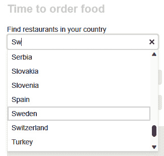
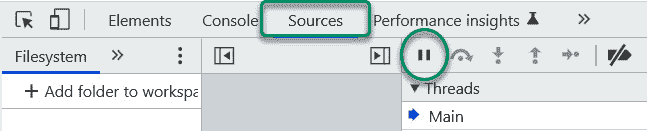
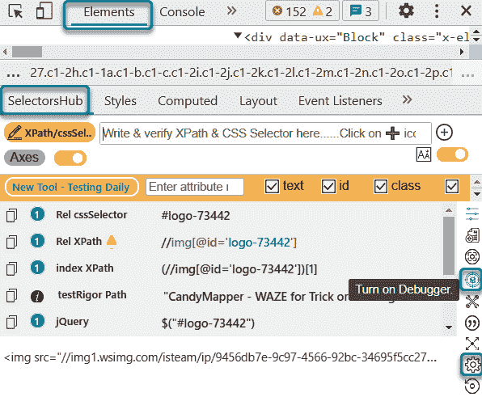
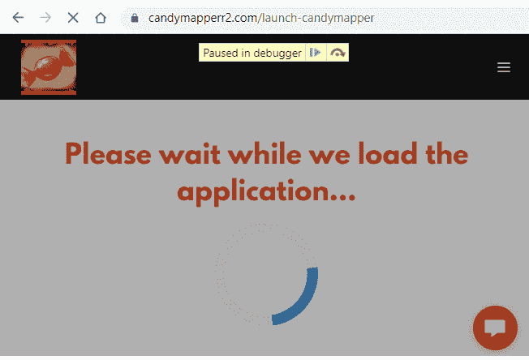
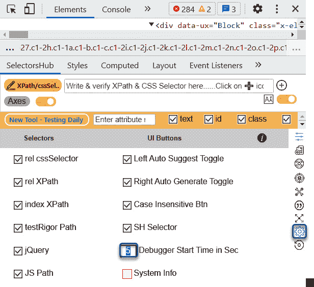

# 第七章：选择包装器 – 在列表和组合框中选择值

在本章中，我们将通过一个名为 `selectAdv()` 的多功能方法扩展我们的工具函数集。这个函数旨在有效地处理列表元素，类似于我们现有的 `clickAdv()` 和 `setValue()` 函数的操作。我们将包含一个验证检查以确保传递给函数的元素是有效的。此外，我们将实现一个重试机制，该机制尝试最多三次定位元素，每次必要时将其滚动到视图中。

然而，真正的挑战出现在处理组合框时。这些元素与交互复杂，尤其是在打开它们以显示可选择的项列表时。另一个关注点是，在选择新值之前清除组合框中残留的任何文本。我们将探讨三种不同的策略来实现这一点。

一旦克服了这些障碍，下一步就是从列表中识别所需的项目并选择它。在这里，另一个工具 `SelectorsHub` 作为救星出现，帮助我们精确地定位正确的项目。

我们在本章中将涵盖以下主要主题：

+   将 `Click` 和 `setValue` 的基本功能添加

+   从列表中选择项目

+   使用 `SelectorsHub` 检查失去焦点时关闭的列表

我们将从之前讨论的方法中共同的代码开始。

# 将 `clickAdv()` 和 `setValueAdv()` 的基本功能添加到 `selectAdv()`

就像之前的 `clickAdv()` 和 `setValueAdv()` 方法一样，我们希望确保我们的元素是有效的并且滚动到视图中以便进行屏幕截图。如果测试本身已经失败，我们将不会执行任何进一步的操作，本质上就是模拟函数。方法的开头部分将与 `clickAdv()` 方法类似：

```js
exports.selectAdv = async (selector, text){
  element = await getValidElement(element, "list");
      let listName : String = getListName{element}
```

如果列表元素不存在，我们将在 `getValidElement()` 函数中尝试找到三个类似节点。第一种方法是通过尝试使用 `@id` 属性找到列表：

```js
case 'list'
  newSelector = `//select[contains(@id,
    '${selector.toLowerCase()}'}]`;
  length = await (this.countMatches(newSelector)));
  exists = length != 0
  element = await ${`${newSelector}`);
```

如果没有找到所有小写 ID 的元素，我们将尝试再次不区分大小写：

```js
  if (length == 0){
    // Second chance List locator
    newSelector = `//select[contains(@id, '${selector}'}]`;
    length = await (this.countMatches(newSelector)));
    exists = length != 0
    element = await ${`${newSelector}`);
  }
```

我们最后的尝试将是寻找包含字符串中文本的任何元素的子 `select` 节点。这通常是一个 `Div` 或 `Span` 节点：

```js
  if (length == 0){
    // Second chance List locator
    newSelector = `//*[contains(text(),       '${selector}')]/parent::*/select]`;
    length = await (this.countMatches(newSelector)));
    exists = length != 0
    element = await ${`${newSelector}`);
  }
    break;
}
```

现在我们有了列表元素，我们有三种方式从列表中选择项目。每种方式都有其优点和缺点。

# 从列表中选择项目

WebdriverIO 提供了三种从元素中选择项目的方法：

+   `selectByVisibleText`：根据其可见文本匹配选项

+   `selectByIndex`：根据其索引位置（基于 0）匹配选项

+   `selectByAttribute`：根据特定的属性及其值匹配选项

例如，如果我们想从一个月份列表中选择第三个月份，这些方法中的每一个都可能有效：

```js
await lstMonth.selectByVisibleText ("March");
await lstMonth.selectByAttribute ("value", "March");
await lstMonth.selectByIndex(2); // 0 based index
```

通常，WebdriverIO 的`selectByVisibleText`方法作为包装器中的默认方法运行良好，但有时列表元素需要以其他方式与打开的列表进行交互。

在每种情况下，我们都应该验证是否已选择了正确的值：

```js
await lstElement.selectByVisibleText (item);
let itemValue = await listElement.getText();
if (itemValue === item) return true
```

此外，如果抛出错误，我们应该尝试在列表中找到一个接近匹配。

一种方法是在列表中发送下箭头。然后，我们检查所选值是否包含预期的值：

```js
await listElement.click({ block: 'center' }) // Set focus
await browser.keys(["\uE015"]}; // Send down arrow key to open the list 
```

然后，我们可以循环遍历并记录匹配项或打印不匹配值的列表：

```js
let item : String ="";
let arrItems: string[] = [];
let found : boolean = false
let lastItem : string = await listElement.getText()
arrItems.push(lastItem);
```

这是一个有两个出口点的无限循环。要么找到了一个接近匹配，要么到达了列表的最后一个项目但没有匹配：

```js
do {
  if (await listElement).getText().contains(item){
    found = true
    global.log ("Found a close match: " +
      listElement).getText()
    break;
  }
  await browser.keys(["\uE015"]}; // Send down arrow key
  item = listElement.getText()
  if (lastValue === item) {
    break;
 global.log (`'${item}' was not found in list: ${arrValues}); // Output the item and the list of values
}
   arrItems.push(item)
} while !(lastValue == listElement.getText()) // No match
```

如果这个循环从未找到匹配项，我们将输出我们寻求的项目和存储在`arrItems[]`中的可用元素列表：

```js
if (found === false) {
  await this.log (`    Failed to select '${text}' from ${arrItems} in ${listName}
  return element;
}
```

这完成了最常见的列表元素列表。然而，我们也可以支持一种与组合框交互的路径，这可能是一种完全不同的类型。

# 从组合框中选择

另一个使用包装器的原因是能够识别和与不是真正下拉列表的元素交互。在这个例子中，我们有一个组合框。这既是输入字段，也是从潜在匹配项列表中进行选择。以国家列表为例。



图 7.1 – 从部分文本中选择项的组合框

在具有多个`<option>`子元素的`<select>`元素中。这里有一些方法。

## 使用 selectByVisibleText

此方法允许您通过其可见文本（用户显示的文本）选择一个选项：

```js
const comboBoxSelector = 'select#yourComboBoxId';
$(comboBoxSelector).selectByVisibleText('Option Text');
```

## 使用 selectByAttribute

此方法允许您通过其`value`属性选择一个选项：

```js
const comboBoxSelector = 'select#yourComboBoxId';
$(comboBoxSelector).selectByAttribute('value', 'option-value');
```

## 使用 selectByIndex

此方法允许您通过其索引（`0`为基础）选择一个选项：

```js
const comboBoxSelector = 'select#yourComboBoxId';
$(comboBoxSelector).selectByIndex(1); // Index starts from 0
```

然后，我们点击字段并输入项目文本。如果我们找到一个包含该文本的元素，我们就点击它。然而，在自闭合列表中编写该元素定位器可能很棘手。这就是`SelectorsHub`派上用场的地方。

# 使用 SelectorsHub 检查失去焦点时关闭的列表

有时，很难获取列表项的定位器，因为列表只有在鼠标光标悬停在其上时才会打开。在这个例子中，我们可以暂停网页的执行，以便在列表展开时与元素交互。DevTools 中的暂停功能位于**源**选项卡：



图 7.2 – 选择“源”选项卡以显示暂停按钮

这对于捕获不会在屏幕上停留很长时间的元素很有用，例如旋转器和*加载...*机制。有时，我们可能不够快，无法到达暂停按钮，或者当我们移动鼠标离开它时，列表简单地关闭。这就是一个名为`SelectorsHub`的工具派上用场的地方。这个工具是 Chrome 浏览器的插件：


图 7.3 – SelectorsHub 显示在浏览器工具扩展菜单中

这个工具可以通过在 Chrome 浏览器扩展中搜索来安装。

安装后，该工具可以在 **元素** 选项卡中找到。通常，它是列出的第一个选项卡，有时是最后一个。这个工具的一个隐藏功能是 **调试** 模式。



图 7.4 – 从 SelectorsHub 激活暂停以冻结转轮并获取其定位器 ID

点击 `SelectorsHub` 将在五秒后自动暂停网页。这使我们能够及时捕获难以捉摸的元素。尝试暂停网站 [`candymapperr2.com/launch-candymapper`](https://candymapperr2.com/launch-candymapper) 的 *加载中...* 转轮页面：



图 7.5 – 网页上的转轮示例

默认情况下，五秒后进入暂停模式对于大多数这些情况来说已经足够了。为了捕捉非常短暂的对象，**设置** 选项允许我们根据需要更改延迟时间，使其更短或更长。



图 7.6 – 设置调试器等待时间

这也适用于短暂显示的 *加载中...* **等待** 机制。

# 编写位于列表中的定位器

现在，我们在组合框中有我们的列表，可以清除任何现有的元素文本。有几种方法可以做到这一点。我们可以设置值，我们可以双击以选择所有现有文本，最后，我们可以向字段发送 *Ctrl* + *A* 键盘快捷键：

```js
ListElement.setValue("");
```

然而，这可能不会适用于所有输入字段元素。也许双击字段会起作用：

```js
await listElement.doubleclick()
```

嗯，如果字段中已经有一个单词，比如 `Denmark`，那么它就会起作用，但如果它包含空格，比如 `Trinidad` `and Tobago`，则不会起作用。

令人惊讶的是，在字段上三击会选中所有内容。然而，在撰写本文时，作者知道没有自动化工具支持三击。此外，如果你想知道，这并不是三击：

```js
await listElement.click(); await listElement.click(); await listElement.click()
```

这里有一种清除字段的方法。通过单次点击将焦点置于字段上。然后，发送一个 `Home` 键来将光标置于字段的起始位置。接下来，按住 *Shift* 和 *End* 键以突出显示字段中的所有文本。最后，向字段发送一个 *Delete* 键，然后是文本，如下所示：

```js
await listElement.click()
await browser.keys(['Home']);
await browser.keys(['Shift','End']);
await browser.keys(['Delete']);
await browser.keys(`${item}`)
```

在这种情况下，组合框会显示所有可供选择的项目。在一个 `try` 和 `Catch` 块中，我们现在可以获取所有与预期值匹配的列表项集合：

```js
        // Find the item in the list
        try {
          listItems = await browser.$$(`//li/*`)
```

我们搜索一个接近完美匹配的列表项。

如果找到，我们就会中断循环并执行点击操作，使用自定义的 `clickAdv()` 方法：

```js
          for (const listItem of listItems) {
            if ((await listItem.getText()).includes(item))             // Found the element
            break;
          }

          clickAdv(listItem)
        } catch (error) {
```

如果这失败了，意味着没有可点击的项目。我们现在需要记录的最重要信息是列表中显示的可用项目：

```js
          listItems = await browser.$$(`//li/*`)
          for (const listItem of listItems) {
             textContent += await listItem.getText() + " | ";              // Get the text content of the element

        }
          await log(`  ERROR: "${item}" was not found in combobox: \n ${textContent}`)
        }
```

现在，我们有一个健壮的自定义方法，它将提供可操作的详细信息，帮助我们维护测试失败时的测试。从这里，我们可以扩展此方法，以便在存在多个近似匹配时报告。

# 摘要

在本章中，我们编写了一个自定义包装器来从列表元素中选择一个项目。我们学习了如何使用单一方法处理两种不同的对象类型，从而减少测试用例代码。组合框路径使用 `click()` 方法打开并遍历列表，以及清除输入字段以过滤列表中的匹配项。我们嵌入报告，如果不存在精确匹配或近似匹配，使调试更容易。这是通过发送日志错误消息来完成的，指示所寻求的项目、所使用的列表元素以及不匹配的值列表。我们还展示了如何使用 `SelectorsHub` 在列表关闭时，当对象失去焦点时，验证手写的 XPath 选择器。

这完成了测试自动化中最常用的四种方法中的三种。在下一章中，我们将创建一个增强的 `Assertion` 方法，该方法验证对象的状态或文本，以及验证页面上的通用文本。
