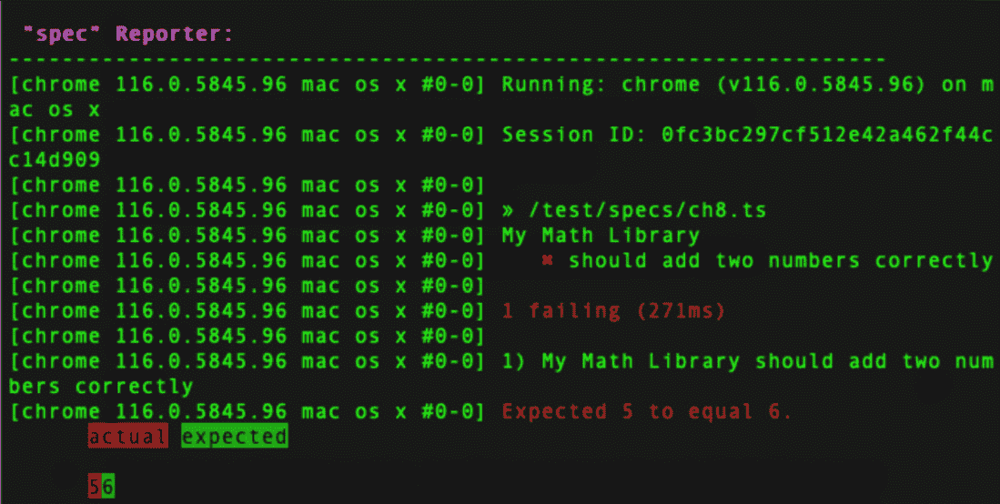
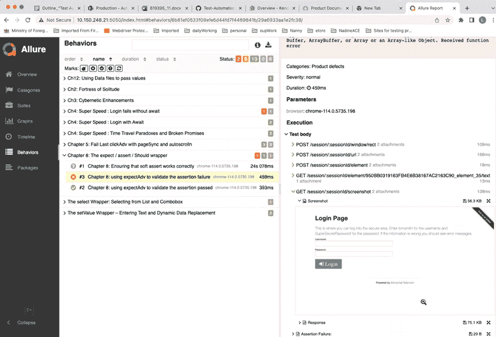

# 断言包装器 – 内嵌细节的重要性

在本章中，我们将编写我们的第一个断言包装器。断言允许我们通过或失败一个测试，并添加有关预期和实际结果的相关细节。WebdriverIO 至少有三种实现断言的方法，每种方法都有自己的风格。首先，有标准的 Jest `expect-webdriverio`，用于本书中的所有示例。然而，关于这些方法如何不同的背景知识应该被注意。

本章我们将涵盖以下主要内容：

+   expect, assert, and should

+   超时

+   硬和软 expect 断言

+   Allure 报告

# expect, assert, and should –我们是如何到达这里的？

让我们简要回顾一下 JavaScript 断言库的历史，以了解为什么我们将在自定义`assert()`包装器中做出一些选择。

## Jasmine 是什么？

Jasmine 首次发布于 2010 年。它旨在提供一种简单灵活的方式来添加断言。它提供了一套内置的断言方法。注意接口是`expect`，具有链式方法，如`.toBe`、`.toEqual`和`.not`。以下是 Jasmine 中的一个示例断言：

```js
function addNumbers(arg0: number, arg1: number): number {
  return arg0 + arg1;
}
describe('My Math Library', () => {
  it('should add two numbers correctly', () => {
    const result = addNumbers(2, 3);
    expect(result).toEqual(5);
    expect(result).toEqual(6); //Intentional fail
  });
});
```

前面的测试调用了一个简单的函数，该函数返回传递给`AddNumbers()`函数的两个参数的和。

这是一个基本的算术断言。如果我们运行它，我们会注意到通过的结果没有报告任何内容。只有失败被报告。在通过或失败时，它实际上并没有提供很多细节：



图 8.1：AddNumbers()函数通过和故意失败的测试结果

在一个测试自动化项目中，我们需要提取对象属性或值，并验证它们与预期结果是否一致。详细的结果可能只报告预期的`[true]`和实际的`[false]`。要提供这种输出，需要包含大量的附加代码，如果我们在测试或功能文件级别执行它。

## Jest 是什么？

在 2013 年，Jest 由 Facebook 发布，并被 React 社区广泛采用。它具有与 Jasmine 类似的断言语法，并增加了包括快照测试和代码覆盖率报告等额外功能。注意接口也是`expect`。以下是 Jest 中的相同断言：

```js
describe('My Math Library', () => {
  test('should add two numbers correctly', () => {
    let expected = 5
    let actual = 5
    expect(actual).toBe(expected);
    actual = 4
    expect(actual).toBe(expected);
  });
```

然而，Jest 本身不支持任何消息来报告验证的详细信息。应包含`jest-expect-message`包以提供此功能，使用`npm`或`yarn`：

```js
npm install jest-expect-message
yarn add jest-expect-message
```

现在我们已经为 Jest 添加了`expect`消息包，我们可以提供更详细的输出：

```js
describe('My Math Library', () => {
  test('should add two numbers correctly', () => {
    Let expected = 5
    let actual = 5
    expect(actual,
`Expected: '${expected}' Actual: '${actual}'`).toBe(expected);
expected = 4
expect(actual, `Expected: '${expected}' Actual: '${actual}'`).toBe(expected);
  });
});
```

Jest 作为 WebdriverIO 包的一部分被包含，但 WDIO 有一个扩展的断言库。这允许我们直接传递元素进行断言，而不是编写自己的代码。

## Chai 是什么？

Chai 是 JavaScript 中流行的断言库，它提供了三个接口来进行断言：

+   `should (BDD)`

+   `expect (BDD)`

+   `assert (TDD)`

这些接口各有优缺点，我们将在子节中探讨。

### 应该

`should` 接口扩展了所有对象，使其具有一个 `should` 属性，可以用来进行断言。以下是一个 Chai `should` 示例：

```js
import 'chai/register-should'
describe('My App', () => {
  it('should have the correct title', () => {
    browser.url('https://example.com');
    browser.getTitle().should.be.equal('Example Domain');
  });
});
```

虽然这个接口允许编写可读性和表达性强的代码，但它可能会以修改对象行为的方式产生意外的副作用。因此，它将不会成为我们实现的一部分。

### 断言

`assert` 接口提供了一种更传统的断言方式，使用传统的如 `assert.equal()` 和 `assert.notEqual()` 方法。这个接口对于已经熟悉其他测试框架或更喜欢更传统测试风格的开发者来说很有用。然而，它可能不如 `should` 或 `expect` 接口可读性和表达性强，尤其是在处理更复杂的断言时：

```js
const assert = require('assert');
describe('My App', () => {
  it('should have the correct title', () => {
    browser.url('https://example.com');
    const actualTitle = browser.getTitle();
    const expectedTitle = 'Example Domain';
    assert(actualTitle === expectedTitle);
  });
});
```

### 期待

Chai `expect` 接口提供了一种更灵活和可链式的断言方式。这个接口旨在易于阅读和编写，并提供了一种流畅的语法，可以用来以清晰和简洁的方式做出复杂的断言。以下是一个 Chai `should` 示例：

```js
import assert from 'chai';
describe('My App', () => {
  it('expect to have the correct title with chai', () => {
    browser.url('https://example.com');
    expect(browser.getTitle()).to.equal('Example Domain');
  });
});
```

使用 Chai 的 `expect` 接口是进行断言的首选方式。它提供了很多灵活性，而没有 `should` 的副作用，并且语法与 Jest 断言相似。但是有一个问题，我们得不到所有细节。考虑以下：

```js
await LoginPage.open();
await expect(browser).toHaveUrlContaining('the-internet.herokuapp.com/login')
[chrome 110.0.0.0 win32 #0-0]    ✓ Chapter 8: expectAdv Wrapper should check if actual is equal to expected
0.0 win32 #0-0] 1 passing (844ms)
```

当然，测试通过了，但它到底做了什么？没有预期结果，实际结果，或者断言做了什么的任何细节。这就是为什么我们需要包装器来简化我们结果的报告。

让我们看看一个失败的断言：

```js
await LoginPage.open();
await expect(browser).toHaveUrlContaining('the-internet.herokuapp.com/bogus')
[chrome 110.0.0.0 win32 #0-0] Error: Expect window to have url containing "the-internet.herokuapp.com/bogus"
Expected: "the-internet.herokuapp.com/bogus"
Received: "https://the-internet.herokuapp.com/login"
[chrome 110.0.0.0 win32 #0-0] error properties: Object({ matcherResult: Object({ pass: false, message: 'Expect window to have url containing
[chrome 110.0.0.0 win32 #0-0]
[chrome 110.0.0.0 win32 #0-0] Expected: "the-internet.herokuapp.com/bogus"
[chrome 110.0.0.0 win32 #0-0] Received: "https://the-internet.herokuapp.com/login"' }) })
[chrome 110.0.0.0 win32 #0-0] Error: Expect window to have url containing
[chrome 110.0.0.0 win32 #0-0] Expected: "the-internet.herokuapp.com/bogus"
[chrome 110.0.0.0 win32 #0-0] Received: https://the-internet.herokuapp.com/login
```

现在我们过度报告了，因为我们只有一个验证。错误被报告了三次到输出中，这是一个问题。

存在一个问题——所有这些断言包都是设计用来执行硬断言以结束测试执行，而不是软断言，后者将允许测试执行更多验证：

```js
Spec Files:      0 passed, 1 failed, 1 total (100% completed) in 00:00:06
```

注意验证失败需要 6 秒钟。我们真的需要等待那么长时间吗？我们已经有 `pageSync()` 方法消耗了所有需要的时间。

# 超时——比赛延迟

WebdriverIO `expect` 匹配器的默认超时时间为 3 秒，间隔为 100 毫秒。这意味着在 3 秒内有 30 次检查，这比行业标准等待 30 秒要好得多。记住我们正在使用 `pageSync()` 方法来消耗页面构建所需的时间。我们的断言几乎立即可用是有意义的。要调整 `expect-webdriverio` 断言的超时时间和间隔，我们可以在 `wdio.config.ts` 文件的 WebdriverIO 钩子部分进行更改：

```js
before: function (capabilities, specs){
require('expect-webdriverio').setOptions ({wait:5000, interval: 250});
}
```

此代码现在将把我们的`expect`断言执行次数改为 20 次。等待超时时间为 5 秒。检查将每 1/4 秒进行一次：

`Spec 文件：0 通过，1 失败，1 总计（100% 完成）` `耗时 00:00:05`

结果时间现在减少到了最优量。这仅仅是一秒钟，但点点滴滴的节省可以节省分钟和小时。

## 什么是 expect-webdriverio？

为了这本书的目的，我们将使用`expect-webdriverio`。

WebdriverIO 使用`expect-webdriverio`断言库，它是 Jest `expect`接口的扩展。它增加了浏览器和元素断言：

```js
const expect = require('expect-webdriverio');
describe('My App', () => {
  it('should have the correct title', () => {
    browser.url('https://example.com');
    expect(browser).toHaveTitle('Example Domain');
  });
});
```

然而，所有这些库都缺少执行软断言的能力。为此，我们转向 Chai 和`soft-assert`包。

# 什么是硬断言和软断言？

默认情况下，所有的断言包都会执行**硬断言**，这更常被称为**硬断言**。这意味着当断言失败时，测试就会结束。哪种超级英雄会在第一拳之后离开战斗？这很成问题，因为我们可能在一个页面上有四到五个我们想要断言的值。在第一个断言失败后，留下接下来的四个不纳入结果有什么意义？我们希望即使在过程中受到打击，也能继续战斗的力量。

正因如此，我们努力将**软期望**（更常被称为**软断言**）的功能添加到框架中。这个特性内置在 Java 的 TestNG 中。它似乎有些遗憾，这个特性在所有流行的 JavaScript 断言库中都缺失了。如果存在用于导航的按钮，最好的测试框架将能够到达终点并执行所有验证，无论它们是成功还是失败。这就是我们的最终双重目标：报告中的结果更多，重复的零散运行更少。

## 将所有这些放在一起

现在，我们需要保护我们的身份；为了完成这个壮举，我们使用`expect-webdriverio`，它扩展了 Chai `expect`接口。

我们现在可以在我们的**Bogus**按钮上执行失败的软断言，同时仍然允许后续的断言执行：

```js
const btnBogus = $('button[name="Bogus"]');
softexpect(btnBogus.isEnabled()).to.be.true;
const btnAddToCart = $('button[name="Add To Cart"]');
softExpect(btnAddToCart.isEnabled()).to.be.true;
expect(addToCartButton.isClickable()).to.be.clickable;
```

我们有了我们的力量戒指。当我们把它们砸在一起时，我们将采取多种形式，因为将使用辅助`expectAdv()`包装器来增加在一致格式中提供详细信息的灵活性。本节将使我们超越通用的失败消息，并详细说明通过最少重复代码的通过结果。

`expect-webdriverio`库支持 23 种不同的元素匹配断言。其中八个是其他完整字符串断言的子字符串匹配器。其他，如`.toBePresent`、`.toHaveChildren`和`.toBeDisplayedInViewPort`，在 80/20 的相关性中占较小的部分。

## 软断言是什么？为什么我们需要它们？

一个高效的测试能够在页面上执行多个验证，但如果三个断言中的第一个失败，测试将立即结束。可能只有第一个断言失败，或者可能所有三个都失败了。我们希望得到断言的完整计数，而不是最少的。否则，它就变成了零散的过程，并减慢了我们的速度。

注意，`Expect.toBeExist`、`Expect.toBePresent`和`Expect.toBeExisting`仅意味着元素在 DOM 中。它们并不明确表示元素对用户是可见的，因此它们在大多数情况下是不切实际的。

WebdriverIO 提供了对元素状态的积极和消极检查：

```js
Expect.toBeDisplayed
Expect.toBeFocused
Expect.toBeEnabled
Expect.toBeDisabled
Expect.toBeClickable
Expect.toBeChecked
Expect.toBeSelected
```

它还提供了两种检查元素是否包含文本或值的方法：

```js
Expect.toHaveText / Expect.toHaveTextContaining
Expect.toHaveValue / Expect.toHaveValueContaining
```

它还提供了对 ID、元素和属性的验证，这些验证可以是精确的或字符串子集：

```js
Expect.toHaveElementProperty
Expect.toHaveAttribute
Expect.toHaveAttributeContaining
Expect.toHaveElementClass
Expect.toHaveElementClassContaining
Expect.toHaveId
Expect.toHaveLink / Expect.toHaveLinkContaining
```

## 软断言 - 允许在断言失败后继续测试

在我们的自定义`expectAdv`包装器中，我们将实现一些概念，使其可以像普通英语句子一样阅读。第一个参数`actual`有意分配了`any`类型。这是因为我们希望有灵活性来验证元素或字符串值：

```js
function expectAdv(
actual: any,
assertionType: string,
expected?: any,
Description: string = 'A description of this assertion is recommended.')
}
```

在这里，`assertionType`是一个字符串，表示要执行的断言。元素可能*存在*；元素可能*等于*一个预期的字符串。

预期参数是可选的，因为如果元素“已启用”，则不需要它。

快速提示

描述是必需的。每次验证都应该有一些关于正在执行的操作的详细信息。因此，如果缺少描述，将提供一个有用的提示，以增加我们测试用例的透明度。

在软断言的情况下，该方法返回一个布尔值`true`或`false`。这意味着我们的测试用例可以通过决策树进行优化。这个概念将在后续章节中讨论，届时我们将讨论如何使步骤在没有失败的情况下继续执行，即使元素不存在。

# Allure 报告简介

Allure 是一个强大的报告框架，它提供了简洁且组织良好的报告。您可以通过安装`@wdio/allure-reporter`和`allure-commandline`包来访问此报告模板：

```js
> yarn add @wdio/allure-reporter
```

Allure 以称为 Allure 结果格式的标准化格式导出报告。要生成全面的报告，您可以通过命令行界面利用 Allure 框架：

```js
"node_modules/.bin/allure generate --clean ./reports/allure-results && allure open -p 5050"
```

Allure 框架是一个多才多艺且轻量级的测试报告工具，支持多种编程语言。它以 HTML 格式简洁地展示测试结果，使开发过程中的所有利益相关者都能从常规测试执行中提取有价值的见解：

```js
// Code example using expect-webdriverio
export async function expectAdv(actual, assertionType, expected) {
  const softAssert = expect;
  const getAssertionType = {
    equals: () => (softAssert(actual).toEqual(expected)),
    contains: () => (softAssert(actual).toContain(expected)),
    exist: () => (softAssert(actual).toBeExisting()),
    isEnabled: () => (softAssert(actual).toBeEnabled()),
    isDisabled: () => (softAssert(actual).toBeDisabled()),
    doesNotExist: () => (softAssert(actual).not.toBeExisting()),
    doesNotContain: () => (softAssert(actual).not.toContain(expected)),
    default: () => (console.info('Invalid assertion type:  ', assertionType)),
  };
  (getAssertionType[assertionType] || getAssertionType['default'])();
  if (!getAssertionType[assertionType]){
    allureReporter.addAttachment('Assertion Failure: ', `Invalid Assertion Type = ${assertionType}`, 'text/plain');
    allureReporter.addAttachment('Assertion Error: ', console.error, 'text/plain');
  } else {
    allureReporter.addAttachment('Assertion Passes: ', `Valid Assertion Type = ${assertionType}`, 'text/plain');
 }
  allureReporter.endStep();
}
```

通过将这些 Allure 语句添加到我们的框架中，我们可以以视觉信息丰富的方式向利益相关者提供更多细节。


图 8.2：Allure 中的测试结果样本及其历史趋势

Allure 报告可以将测试组织成子类别。这使得相关测试是否失败变得清晰。它还显示了运行随时间的变化情况。这可以显示测试用例覆盖率增加的趋势以及结果改善或最近恶化的趋势。

![图 8.3：带有登录页面屏幕捕获的逐步执行样本]



图 8.3：逐步执行的示例，包含登录页面的屏幕截图

这些报告还提供了添加屏幕截图的选项，例如 X 射线视觉。这可以提供有关测试失败时发生情况的宝贵线索，尤其是如果我们正在云中运行而没有直接实时查看系统运行情况时。

# 摘要

在本节中，我们讨论了 assert、expect 和 should 断言的历史。我们介绍了硬断言和软断言的概念，为什么它们是重要的区分，以及何时应该实现它们。我们还介绍了 Allure 报告，以提供正在执行的所有事件的详细信息以及它们是否通过或失败的结果。Allure 报告将通过提供通过和失败的测试的历史视图来进一步增强我们的视图。在下一章中，我们将构建页面对象模型。
