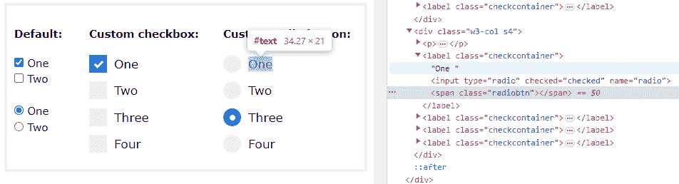
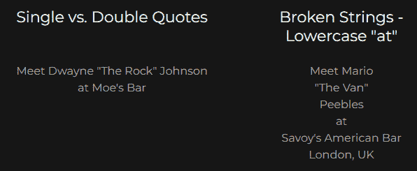
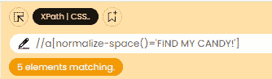
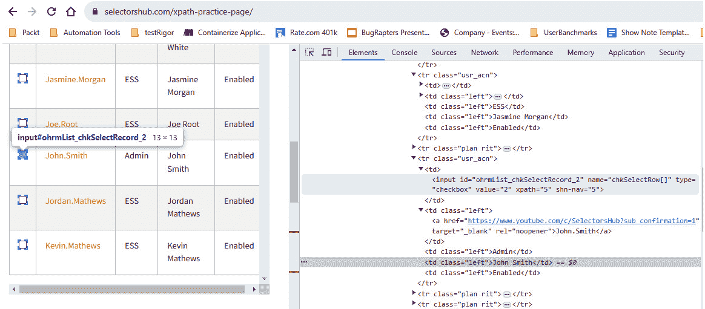
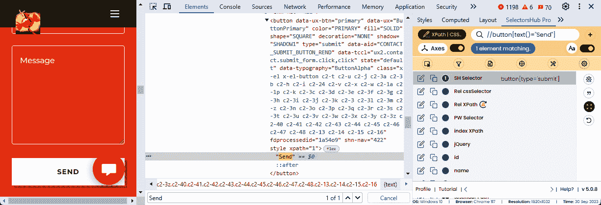
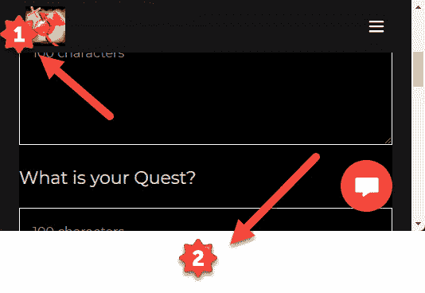
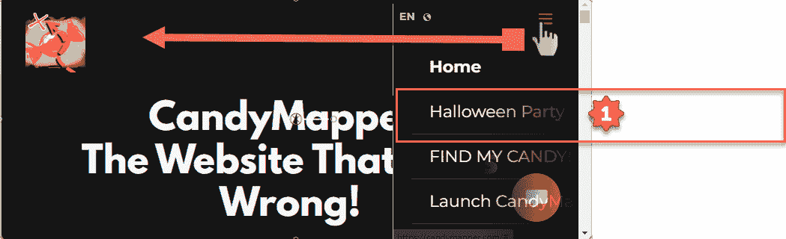
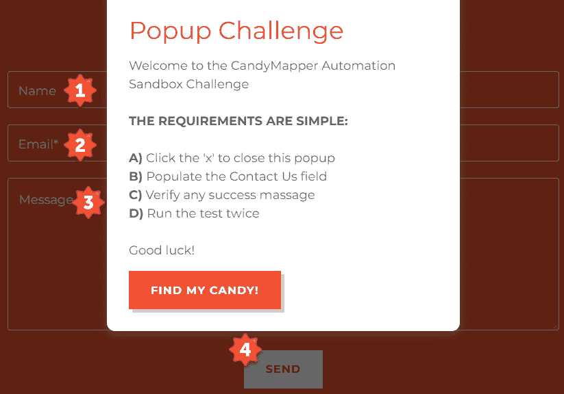

# 提高灵活性 - 编写健壮的选择器和减少维护

维护是测试自动化项目的永恒敌人。每个版本都包含更多的测试和可能过时的元素，导致测试失败。如果你是测试自动化领域的初学者，你可能没有意识到维护将如何越来越多地影响你的项目发布。我（保罗）想与你分享这个故事，它启发了几种独特的解决方案。

几年前，我的客户的开发团队决定改变测试应用所支持的整个底层架构。我们的自动化团队只有在发现我们近 100 个测试用例套件几乎全部失败时才意识到这个变化。事实上，唯一通过测试的是我们在项目第一天编写的 `LogIn` 测试用例。我们意识到数百个元素对象已经将它们的标签名称更改为不同类型并使用了不同的属性。我们面临着一项艰巨的任务，即逐个重写数百个元素选择器。我们估计页面对象的重新工作可能需要 2 天才能恢复到工作状态。

再加上客户已经习惯了在 2 小时内收到回归测试套件结果的详细总结，以及我们的烟雾测试在 15 分钟内检测到问题。我们面临解释发布结果将在另外 2 天或更长时间才可获得的任务。六个资源的手动团队可能需要那么长时间才能完成测试。

我的同事开始着手更新页面对象标签中的选择器。我有一个不同的想法。通过我的分析，我发现只有一个元素标签发生了变化。许多 `<a>` 链接锚点现在变成了 `<button>` 标签。幸运的是，用于定位元素的字符串没有变化，只是它们位于不同的对象属性中。我建议在我们的框架中添加一个薄层，以搜索不再找到的元素标签的替代标签。

代码更改在一小时内完成。执行测试用例的数量增加到 95%的完成度。两个测试用例在发布时失败，另外三个需要手动维护才能达到工作状态。这与之前发布迭代中的维护工作一致。我们的客户理解了架构变化带来的挑战，并且对我们能在 4 小时内提供可操作的结果感到非常高兴。

在类似的情况下，本章将涵盖以下主要主题：

+   使用通用选择器减少页面对象维护

+   XPath 选择器的结构

+   利用 `data-qa` 和 **可访问的富互联网应用** (**ARIA**) 属性

+   编写包含文本子串的 XPath 元素

+   第二次机会 - 从过时的选择器获取有效对象

# 技术要求

所有测试示例都可以在这个 GitHub 仓库中找到：[`github.com/PacktPublishing/Enhanced-Test-Automation-with-WebdriverIO`](https://github.com/PacktPublishing/Enhanced-Test-Automation-with-WebdriverIO)

# 使用通用选择器减少页面对象维护

在我们深入探讨如何使我们的对象像塑料一样灵活的先进概念之前，让我们先看看几种我们可以编写更好的选择器的方法。一个健壮的选择器对于减少你的测试自动化框架的维护至关重要。我们将超越精确匹配，使用子串匹配以确保我们可以在元素略有变化的情况下找到它。

我们从一个简单的问题开始。XPath 和 CSS 哪个更好？有一种普遍的观点认为，CSS 是编写选择器的首选方法，因为它执行得更快。虽然这可能是对的，但今天的速度差异微乎其微。我宁愿花几毫秒找到元素，也不愿花几分钟重复更新对象选择器。此外，CSS 选择器的语法编写更困难。而且，当我们需要根据另一个元素找到某个元素时，CSS 选择器不够灵活——例如，定位许多通用 `label` 对象中的一个：



图 10.1 – 相对于 DOM 中名为“One”的 Label 元素的通用单选按钮

在前面的例子中，没有方法可以唯一地通过文本识别任何单选按钮。这是因为唯一可识别的文本包含在相对于 **Span** **单选**按钮的 `Label` 元素中。

我们必须利用父元素和子元素的 XPath 轴，通过相对位置唯一地定位这些元素。我们为具有文本 `One` 的父对象编写一个选择器：

```js
//label[text()='One']
```

然后我们跟随通用子单选按钮：

```js
span[@class='radiobtn']
```

然后我们将它们结合起来：

```js
//label[text()='One']/span[@class='radiobtn']
```

那是一个容易解决的问题。但如果我们有包含额外空格、强制换行符，甚至混合引号和单引号的文本怎么办？为了解决这类问题，我们将更深入地探讨更多我们可以定位和识别元素的方法：



图 10.2 – 额外的空格，混合单引号和双引号，以及嵌入的换行符

到目前为止，我们已经看到了 XPath 和 CSS 选择器的示例。让我们花点时间进一步探索 WebdriverIO 中检索元素集合的组件。

# XPath 选择器的结构

选择器由一个或多个节点标签类型组成，后面跟着方括号中的可选 `[谓词]`。谓词有运算符和函数来过滤特定的节点匹配。最后，它们包括路径分隔符，带有双冒号的通用 *轴*，以进一步细化元素的路径。这使得无论元素在 DOM 中的位置如何，都更有可能找到该元素。

XPath 选择器被编写为*绝对*或*相对*。这是一个指向*Candymapper*网站上**Find My Candy**按钮的绝对样式选择器的示例：

```js
public get myElement() {
  const selector: string = "/html[1]/body[1]/div[1]/div[1]/div[1]/div[13]/div[1]/div[1]/div[1]/div[2]/div[2]/a[1]";
  return $(selector);
}
```

现在你已经看到了绝对选择器，只将其用作一个红旗。这个练习的目的是方括号内数字索引的流动性。确切的位置将随着版本的不同而动态变化，导致无尽的维护。如果你在代码库中看到很多这种格式的选择器，几乎可以肯定你的选择器不是健壮的。此外，对于其他开发者来说，这是一个难以解开的谜题，因为“Find My Candy”这个文本没有出现在选择器字符串中。让我们寻找更好的编写选择器的方法。

经验法则

总是花额外的时间将绝对选择器替换为相对选择器，并使用描述性的元素名称。前一个示例中的`myElement`名称没有帮助，应该重命名为`findMyCandy`或更好，`btnFindMyCandy`。

## 相对选择器

大多数相对选择器以双斜杠（`//`）开头，后面跟单斜杠，表示路径中的下一个元素。让我们更详细地看看这个：

+   `//` `//div`选择文档中任何位置的`<div>`元素。

+   `/` `/html/body/div`选择所有是`<html>`根内部`<body>`元素的直接子元素的`<div>`元素。

+   `*` **（星号）**：表示通配符匹配。

首先，我们将使用`*`通配符匹配器获取页面上所有节点的集合：

```js
const allElementsByXPath: ElementArrayType = await browser.$$('//*');
```

## 节点测试函数 – text() 与 normalize-space()

这里显示的几个元素选择器标签，包括锚点、按钮和列表，可以使用`text()`节点测试函数进行精确匹配：

```js
//a[text()=`FIND MY CANDY!`]
```

这是一个简单的示例，但如果文本中嵌入了一些奇怪的格式呢？

## 破碎的字符串

有时候多余的空格或换行符会使选择器匹配变得困难。在这种情况下，建议使用`normalize-space()`而不是`text()`：

```js
//a[normalize-space()=`FIND MY CANDY!`]
```

我们可以使用`SelectorsHub` Chrome 扩展程序来检查此选择器是否有效：



图 10.3 – SelectorsHub 显示多个元素将匹配该选择器

XPath 选择器是有效的，但它匹配屏幕上的四个额外元素。另一种方法是相对于容器页面获取按钮元素：

```js
//*[contains(@class,"popup")]//following::a
```

此元素可以通过父类定位，并使用点（`.`）作为类名的快捷方式转换为 CSS 选择器：

```js
.widget-popup a
```

类似地，我们可以通过类名上的`popup`进行近似匹配，以找到使用这种方式的 CSS 包含`*=`快捷方式的锚点链接子元素：

```js
[class*="popup"] a
```

我们还可以将父元素缩小到特定的标签类型：

```js
div[class*="popup"] a
```

我们将寻找五种常见的网页元素：链接、按钮、列表、字段和文本元素。

这里是使用精确字符串以及 XPath 中的子字符串匹配来查找这些元素的常见方法：

+   链接：

    ```js
    //a[normalize-space()='Link Text']
    //a[contains(normalize-space(),'Link')]
    //a[@href='https://example.com']
    ```

+   按钮：

    ```js
    //button[normalize-space()='Click Me']
    //button[contains(normalize-space(),'Click')]
    //button[@id='submit-button']
    ```

+   列表（无序列表和有序列表）：

    ```js
    //ul/li[normalize-space()='Item']
    //ul/li[contains(normalize-space(),'Item')]
    //ol/li[position()=2]  // Not recommended
    ```

+   字段和多行文本区域：

    ```js
    //input[@type='text']
    //input[contains(@id,'input')]
    //textarea[@placeholder='Enter text']
    ```

+   文本：

    ```js
    //span[normalize-space() ='Some Text']
    //span[contains(normalize-space(),'Text')]
    //*[starts-with(normalize-space(),'Hello')]
    ```

# 利用 data-qa 和 ARIA 属性

在网站设计中，已经出现了两个新的发展，开发者可以帮助 SDETs 维护稳健且低维护的选取器。考虑以下网页元素片段：

```js
<div data-qa="product-card" role="article" aria-label="Product Details">
      <a href="#" data-qa="add-to-cart">Add to Cart </a> </div>
```

这可以通过添加唯一的静态`data-qa`属性来实现。或者，如果开发团队遵循 ARIA 标准，许多文本元素可以通过`aria-label`属性来识别：

```js
//div[contains(@aria-label, 'Product Details')]
//a[contains(@data-qa, 'Add to Cart')]
```

这里是一个利用`data-qa`和 ARIA 属性来确保您的 Web 应用程序元素可访问和可交互的例子：

```js
describe("Accessibility Testing", function () {
  // Simulate loading a web page or application
  beforeAll(function () {
    // Load your web page or application
  });
 it("should have proper ARIA attributes", function () {
    // Find an element by its data-qa attribute
    const buttonWithQA = element(by.css('[data-qa="login-button"]'));
   // Verify that the ARIA role is set to "button"
    expect(buttonWithQA.getAttribute('role')).toEqual('button');
   // You can also check other ARIA attributes like "aria-label", "aria-describedby", etc.
    // Example: expect(buttonWithQA.getAttribute('aria-label')).toBe('Login Button');
  });
 it("should be keyboard accessible", function () {
    // Find an element by its ARIA label
    const buttonWithARIA = element(by.css('[aria-label="Login Button"]'));
   // Trigger a click event using Protractor
    buttonWithARIA.click();
   // Verify that the element is focused after the click
    expect(browser.driver.switchTo().activeElement().getAttribute('aria-label')).toEqual('Login Button');
  });
});
```

在这个例子中，我们有两个测试用例。第一个测试用例验证具有`data-qa`属性的元素是否具有正确的 ARIA 角色。第二个测试用例检查具有特定 ARIA 标签的元素的键盘可访问性。这只是一个基本示例，您可以根据您特定应用程序的需求进行修改，以确保您的元素正确可访问并且具有正确的属性。

规则要点 – CSS 选取器的替代方案

不幸的是，CSS 选取器没有提供直接根据文本内容过滤元素的方法，就像 XPath 中的`text()`和`normalize-space()`函数一样。

因此，虽然 CSS 选取器被誉为更快，但在测试自动化中它们的功能可能有限。下一个例子利用 CSS 快速收集页面上的所有元素：

```js
const allElementsByCss: ElementArrayType = await browser.$$('*');
```

对于获取特定类型的元素，可以结合使用 XPath 和 CSS。以下是一些补充的元素选取器类型：

+   文本：

    ```js
    //span[text()='Vital Signs']
    ```

+   链接：

    ```js
    a[href='https://example.com']
    //a[@href='https://example.com']
    ```

+   按钮：

    ```js
    button#submit-button
    //button[text()='Login']
    ```

+   列表：

    ```js
    ol li:nth-child(2)
    ```

+   字段：

    ```js
    input[type='text']
    input[id*='input']
    textarea[placeholder='Enter text']
    ```

## 仅通过文本查找元素

可以使用 XPath 选取器通过精确匹配字符串来找到元素。例如，一个精确匹配的**Next**按钮将格式化为如下：

```js
//a[text()='Next >']
```

然而，尽管文本很可能是恒定的，但角度括号和间距可能会改变。我们可以通过具有子字符串的选取器来减少未来维护的机会。

# 编写包含文本子串的 XPath 元素

通过在选取器中添加`contains()`，只需文本的一小部分就可以找到对象：

```js
//a[contains(text(),'Next']
```

这适用于许多元素，但复选框和单选按钮比较棘手。

## 相对于另一个元素查找元素

在下一个例子中，我们想要点击名字*约翰·史密斯*旁边的复选框。我们有几个复选框，但没有一个具有独特的名称标识符：



图 10.4 – 约翰·史密斯的名字及其关联的复选框是两个独立的元素

这个选取器将识别所有复选框：

```js
//input[contains(@name,'chkSelect')]
```

要定位这个复选框元素，我们需要使用链接并找到它前面的输入复选框。以下是我们可以这样做的方法：

```js
//a[normalize-space()='John.Smith']//preceding::input[@id='ohrmList_chkSelectRecord_2']
```

## 不区分大小写的部分匹配

如果我们了解到有时开发者会更改文本的大小写怎么办？解决这个问题的方法是为`translate`选项添加一个，并将文本转换为匹配大写或小写：

```js
//a[translate(normalize-space(), 'ABCDEFGHIJKLMNOPQRSTUVWXYZ', 'abcdefghijklmnopqrstuvwxyz')='john.smith']//preceding::input[@id='ohrmList_chkSelectRecord_2']
```

现在的问题是，选择器返回的元素并不总是可见的。以下是我们的处理方法。

## 仅查找可见元素

自动化测试中最大的挑战之一是返回一个可见元素的集合。这让我们想起了迈克尔·基顿（Michael Keaton）的一个非常著名的引言：“*想要疯狂？那就让我们疯狂吧！*”

这个广泛的选择器作为示例提供。它将以多种方式消除大多数不可见的对象。我们解决了不透明度为`0`、溢出或可见性被隐藏、显示为`none`以及宽度或高度设置为`0`的情况：

```js
(//a | //input | //select | //textarea)[
not (
contains(@style,'opacity: 0;') or contains(@style,'visibility: hidden;') or contains(@style,'display: none;') or contains(@style,'overflow: hidden;') or contains(@style,'width: 0') or
contains(@style,'height: 0')) and
not(ancestor::*[contains(@style,'opacity: 0;') or
contains(@style,'visibility: hidden;') or
contains(@style,'display: none;') or
contains(@style,'overflow: hidden;') or
contains(@style,'width: 0') or
contains(@style,'height: 0')])]
```

此选择器还会消除任何具有隐藏祖先的元素。这是 80/20 规则适用的另一个地方。即使这个选择器只能消除大约 80%的非可见元素，我们仍然需要解析元素集合以找到第一个可见的元素。那么，为什么不让 XPath 或 CSS 处理超过一半的工作，以获取我们的可见元素呢？

我们想要这样做是为了给我们的方法第二次机会，尝试找到如果它已经从其类中更改的元素。找到元素的第二或第三次机会永远不会太晚。

# 第二次机会 – 从过时的选择器中获取有效对象

现在我们有了四个主要的方法包装器，让我们通过自我修复的代码使它们更加健壮。自动化最大的缺点是需要维护来修复**页面对象模型**（**POM**）中的元素，当选择器变得过时时。在本节中，我们探讨自我修复技术以找到已更改其节点类型的元素。

## 自我修复技术

让我们在这个子节中回顾一些自我修复技术。

### 减少不区分大小写的匹配代码

所有这些函数都需要转换为不区分大小写的匹配。我们首先创建两个常量以减少大写和小写字母的重复使用：

```js
const A_Z = 'ABCDEFGHIJKLMNOPQRSTUVWXYZ';
const a_z = 'abcdefghijklmnopqrstuvwxyz';
```

接下来，我们需要一个函数，该函数将从一个过时的定位器中提取唯一文本。

### 提取选择器文本

此函数将尝试返回任何唯一文本的第一个匹配项，该文本被双引号或单引号包围。这将注入到一个接近匹配定位器中：

```js
function extractSelectorText(selector: string): string {
const singleQuoteCount = (selector.match(/'/g) || []).length;
  let newSelector = selector;
```

首先，我们检查选择器字符串中嵌入的单引号，例如所有格撇号。例如，`"Moe's Bar"`会导致单引号的数量为奇数：

```js
if (singleQuoteCount === 1 || singleQuoteCount === 3){
  const parts = selector.split("'");
  if (singleQuoteCount === 1) {
```

处理只有一个单引号的情况，通过将其包裹在一个`concat`函数中：

```js
      newSelector = `concat('${parts[0]}', "'", '${parts[1]}')`;
```

这将`"Moe's bar"`转换为`"concat("Moe","'","'s bar")`以支持单引号匹配。

```js
    } else if (singleQuoteCount === 3) {
```

在任何其他语言中，都不可能在单个定位器中同时有一个单引号和引号字符串。但是，因为 JavaScript 允许使用反引号表示字面字符串，所以可能会有这样的字符串：

```js
 `//*[text()=Meet Dwayne "The Rock" Johnson at Moe's Bar]`
```

因此，我们处理了有三个单引号的情况，只有第二个单引号应该被转义，如下所示：

```js
      newSelector = `concat('${parts[0]}${parts[1]}', "'", '${parts[2]}')`;
    }
  }
```

这会提取为以下内容：

```js
`concat(Meet Dwayne "The Rock" Johnson at Moe","'"'s Bar"`
```

按如下方式提取两个双引号或单引号之间的文本：

```js
  let match = newSelector.match(/"([^"]+)"$/) || newSelector.match(/'([^']+)'$/);
```

如果没有找到匹配项，或者匹配的组无效，则返回原始选择器。实际上，传递的定位器字符串可能不够健壮，不足以给予第二次机会。我们返回一个清楚地标识问题的字符串，因为返回`Null`值会引发错误，而空字符串可能会匹配所有元素：

```js
  if (!match || match.length < 2) {
    return "NO TEXT FOUND IN LOCATOR";
  }
```

否则，如果检测到单引号，则返回单引号或双引号之间的捕获组进行修改：

```js
return match[1];
}
```

现在我们已经提取了定位器的文本，我们可以将其注入到每个元素类的一个类似定位器中。

### 从链接到按钮

在*Candymapper*沙盒网站的主页上，恰好有一个`<Button>`元素。它是一个`<A>`锚链接，就像页面上的其他链接一样。并且它是全大写的。我后来修复了这个问题，但我需要花时间修复代码中的定位器吗？



图 10.5 – Candymapper 网站上的发送按钮元素

这是以前曾经工作过的原始定位器：

```js
//a[text()='SEND']
```

如果我们能够将文本提取出来并注入到像这样的按钮类中呢？

```js
//button[normalize-space()='SEND']
```

如果它仍然不起作用，我们进行了第三次尝试，进行不区分大小写的匹配：

```js
//button[translate (normalize-space(), 'ABCDEFGHIJKLMNOPQRSTUVWXYZ', 'abcdefghijklmnopqrstuvwxyz') = 'send']
```

现在，我们有一个解决方案，允许我们找到我们的元素，无论大小写敏感与否。现在我们可以继续使用突变合并功能来优化它。

### 仅通过文本查找元素

这可以作为一个函数一起使用，由`getValidElement()`调用，以给我们的按钮第二次被识别的机会，而无需重构代码：

```js
function transformLink(selector: string): string {
let extractedText = extractSelectorText(selector)
// Create the new selector string
const newSelector = `//button[contains(translate (normalize-space(),'${A_Z}','${a_z}'), '${extractedText.toLowerCase()}')]`;
return newSelector;
}
```

现在，即使**发送**按钮更改了大小写和类，也可以到达它。

```js
public get sendLink () {
    return $(`//a[text()='Send']`);
}
await helpers.clickAdv(await this.sendLink)
```

### 字段和列表

字段可以从`<input>`变为`<textarea>`对象。要找到它们，可以使用`@placeholder`属性进行此更改：

```js
function transformField(selector: string): string {
let extractedText = extractSelectorText(selector)
// Create the new selector string
const newSelector = `//textarea [contains (@placeholder, '${A_Z}','${a_z}'), '${extractedText.toLowerCase()}')]`;
return newSelector;
}
```

当然，`<select>`对象可能会变为`<input>`组合框：

```js
function transformList(selector: string): string {
let extractedText = extractSelectorText(selector)
// Create the new selector string
const newSelector = `//input[contains (@placeholder, '${A_Z}','${a_z}'), '${extractedText.toLowerCase()}')]`;
return newSelector;
}
```

### 短字符串

在离开这个兔子洞之前，还有一个技巧。有时，小的文本变化仍然可以准确找到。`"Select all active files"`变为`"Select all activated files"`。将文本分为三部分。如果剩余长度大于五个字符，中间字符串`"all activ"`匹配的可能性很大，只要它是一个唯一的匹配：

```js
function getMiddle(s: string): string {
  const len = s.length;
  // Return the string as it is if its length is less than or equal to 5
  if (len <= 5) {
    return s;
  }
  // Divide the string into three parts
  const oneThird = Math.floor(len / 3);
  const twoThirds = 2 * oneThird;
  // Extract the middle part
  return s.substring(oneThird, twoThirds);
}
console.log(getMiddle("Select all active files")); // Output: "all active fi"
console.log(getMiddle("small")); // Output: "small"
```

统计上，这大约 40%的时间会返回一个唯一的元素。

## 在薄冰上

滚动元素提出了一个特别困难的挑战。偶尔，它们会部分超出浏览器的视图区域。让我们看看这个例子：



图 10.6 – 位于浏览器视图区域上方的左上角 0,0 的文本区域对象；位于浏览器底部之外的第二个文本区域对象的中心

如果你的网站支持侧滑元素动画，又会怎样？如果你的框架激活了一个滑动菜单，然后立即尝试点击内部的元素，很可能会得到一些奇怪的结果：



图 10.7 – 点击滑动菜单项中心的示例

更让人沮丧的是，如果出现这个问题，测试结束时的屏幕截图很可能会在滑动动画完成后出现。你可能会得到的唯一线索是一条消息，表明元素在点 2050, 250 时不可点击，这个点位于一个 1920 x 1080 像素分辨率的显示器的右边缘之外。

内置的 WebdriverIO `.click()` 方法在与屏幕外的元素交互时不应有任何问题。`clickAdv()` 包装函数滚动元素进入浏览器视图区域的主要原因是为了在发生错误时有更好的机会在屏幕截图中显示元素。

如果元素不在视口中，尝试使用花哨的 JavaScript 点击可能会抛出错误。这取决于点击是在对象的左上角执行还是在计算出的中心执行。以下是一个使用 `browser.execute` 方法执行 `arguments[0].click();` 代码字符串的 JavaScript 点击调用示例：

```js
async function jsClick(element: WebdriverIO.Element): Promise<void> {
await browser.execute("arguments[0].click();", element); }
// Usage example
  await jsClick('#some-button-id');
```

另一个很好的原因是这种做法可能会引起问题。在 GUI 自动化中，我们总是希望尽可能地模拟用户。如果我们在这里显示的模态弹出窗口覆盖了所需的元素，会发生什么呢？



图 10.8 – 调用 jsclick() 强制与模态弹出窗口下方的元素交互将会存在问题

如果我们正在寻找的元素是从屏幕外滑入控制，我们通常会得到一个错误，表明元素点击超出了范围。如果元素是一个仍在动画中的展开列表中的项，这种情况可能会发生。有时，当对象滚动了几像素出视口时，可能会发生错误。为了解决这个问题，我们需要知道错误抛出时元素是否在移动，以及移动何时停止。以下是我们如何做到这一点的方法：

```js
async function scrollOneClickUp(): Promise<void> {
await browser.execute(() => { const event = new
WheelEvent("wheel", { deltaY: -50 });
document.dispatchEvent(event); });
}
```

滚动一个鼠标滚轮并点击，如下所示：

```js
async function scrollOneClickDown(): Promise<void> {
await browser.execute(() => { const event = new
WheelEvent("wheel", { deltaY: 50 });
document.dispatchEvent(event); });
}
```

### 编写 isMoving() 方法

通过 *x* 或 *y* 坐标点击元素的日子已经离我们远去。这并不意味着元素的坐标没有价值。令人惊讶的是，在某些情况下，点击操作有时是相对于元素的屏幕位置进行的。有了坐标，我们可以确定元素是否在移动，以确保我们的框架有更高的精度。考虑以下这段代码：

```js
const currentLocation: WebdriverIO.LocationReturn = await element.getLocation();
```

这将返回一个包含元素当前 *x* 和 *y* 屏幕坐标位置的对象。通过循环并暂停几毫秒，我们可以实现一个动态等待，确保我们的对象滚动动画已经完成：

```js
export async function waitForElementToStopMoving(element: WebdriverIO.Element, timeout: number): Promise<void>
  const initialLocation = await element.getLocation();
  return new Promise((resolve, reject) => {
    let intervalId: NodeJS.Timeout;
    const checkMovement = () => {
      element.getLocation().then((currentLocation) => {
        if (
            currentLocation.x === initialLocation.x &&
            currentLocation.y === initialLocation.y
        ) {
          clearInterval(intervalId);
          resolve();
        }
      });
    };
    intervalId = setInterval(checkMovement, 100);
    setTimeout(() => {
      clearInterval(intervalId);
      reject(new Error(`Timeout: Element did not stop moving within ${timeout}ms`));
    }, timeout);
  });
}
```

最佳实践是在任何 `browser.execute` 滚动之后和任何类似基于点击的方法之前实现这一点。

# 摘要

在我们超级英雄编码传奇的这次激动人心的篇章中，我们穿越了元素定位的神秘世界，掌握了在网络的荒野中定位难以捉摸的 HTML 实体的艺术。我们的探索之旅使我们征服了 `<a>` 锚点的变化形态，将它们转化为强大的 `<button>` 守卫，并将简单的 `<input>` 字段进化成广阔的 `<textarea>` 元素。我们航行在变换的迷宫中，下拉菜单变成了组合框，我们运用我们的力量，忽略大小写匹配文本，甚至寻找字符串中的隐藏含义。

我们的工具包扩展了，我们拥抱了自我修复定位器的神秘艺术，编织咒语以应对数字风的变化。当元素在屏幕上翩翩起舞，快速穿梭时，我们坚定地站立，动画的幻影让一个低级的科技法师都感到困惑。

当我们站在发现的边缘时，我们提出了一个挑战我们工艺现实的问题：如果页面对象定位器的需求只是一个幻觉呢？如果在 UI 的阴影深处，我们只需对框架低语一声，就能召唤一个 **发送** 按钮？答案在召唤我们——我们敢跃入未知吗？下一章等待着，承诺着超越我们想象力的奇迹。
