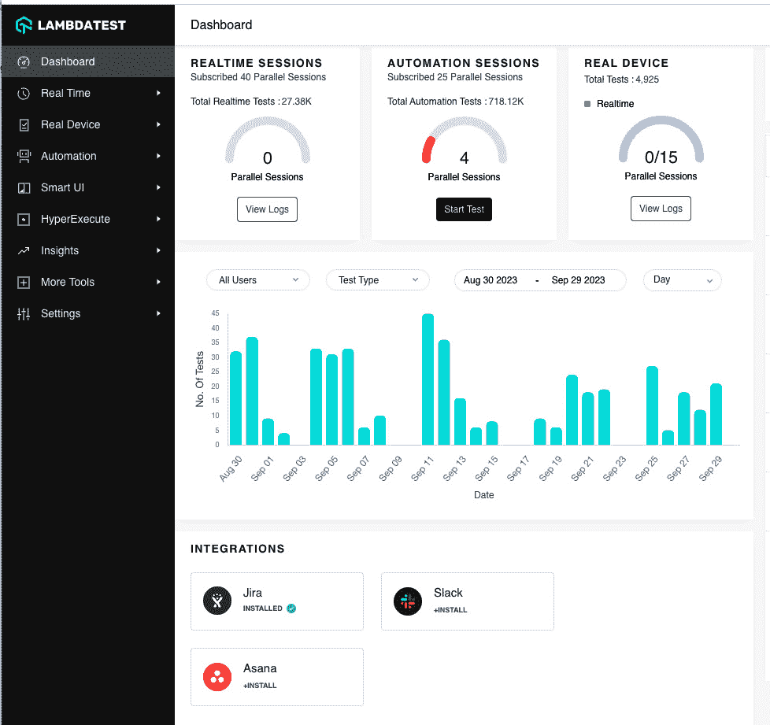
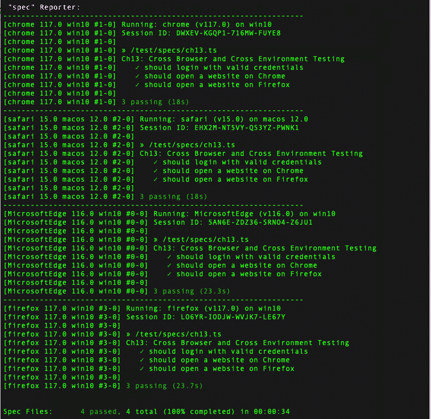

# 多宇宙 - 跨浏览器测试和跨环境测试

在本章中，我们将开始向浏览器操作系统和其他平台添加水平扩展的突变力量。这与垂直扩展形成对比，垂直扩展涉及向我们的套件添加更多测试，例如向一个隐藏在普通视线中的超级英雄基地添加更多楼层。水平扩展就像在城市街区上下扩展更多建筑。我们的测试可以在多个浏览器、版本、操作系统和其他平台上运行。这意味着如果我们使用 Mac 而不是 Windows PC，那么我们将有信心我们的应用程序和测试在我们选择的浏览器上运行良好。Chrome 通常是目标浏览器，因为 Windows 和 Mac 上的用户数量都很多。但许多 Mac 用户更喜欢 Safari，而 Windows 用户更喜欢 Edge。那么，我们如何确保这些组合得到测试？

正是在这里，独立的 Selenium WebDriver 服务变得非常有用。此服务用于在各个浏览器和平台上自动化测试过程，有助于识别可能在特定环境中出现的问题。利用此服务可以是一个创造性的解决方案，以简化测试自动化框架，因为它允许以更少的手动工作实现更全面的测试覆盖。然而，它也可能很快变得令人不知所措。

将其视为多个超级英雄宇宙之间的交叉。我们将扩展测试，从 Windows 机器上的 Chrome 扩展到 Edge，以及从 Mac 上的 Chrome 扩展到 Safari。然后，我们将使用基于云的解决方案来处理各种组合。

本章的主要内容包括：

+   水平扩展

+   通过`wdio`配置文件使用内置功能

+   使用 LambdaTest 在线自动化浏览器测试网格

+   使用 Selenium Standalone 服务器在本地构建测试网格

+   避免水平扩展的兔子洞

+   处理特定环境的逻辑

# 水平扩展 - 跨浏览器测试

有三种方法可以进行项目跨浏览器测试：

+   通过`wdio`配置文件使用内置功能

+   使用 LambdaTest 在线自动化浏览器测试网格

+   使用 Selenium Standalone 服务器在本地构建测试网格

虽然我们将在本书中讨论所有三种方法，但我们的示例将使用`wdio`配置文件提供的内置功能来完成。

# 通过 wdio 配置文件使用内置功能

跨浏览器测试涉及设置测试环境，使用 TypeScript 中的 Jasmine 语法编写测试，并在不同的浏览器上运行测试。这是在 WebdriverIO 的配置文件中的能力部分完成的。我们将从 Chrome 扩展到 Edge 的能力部分。这也控制了将使用**maxInstances**参数并行启动多少个并发浏览器。

## 扩展 wdio 配置文件以支持多个浏览器

设置`wdio.conf.ts`以确保它定义了您的测试设置和浏览器功能：

```js
   // wdio.conf.ts
   exports.config = {
     specs: ['./tests/**/*.spec.ts'],
maxInstances: 2,
capabilities: [
       {
         browserName: 'chrome',
       },
       {
         browserName: 'safari',
       },
       {
         browserName: 'edge',
       },
     ],
     framework: 'jasmine',
     jasmineOpts: {
       defaultTimeoutInterval: 60000,
     },
     Services:[
"chromedriver",
"safaridriver",
"edgedriver"
     ]
   };
```

在“服务”部分，我们必须提供与浏览器交互的驱动程序。`chromedriver`运行 Chrome 浏览器，这是我们一直在使用的。要驱动 Safari，将使用`safaridriver`。请注意，可以使用的并发浏览器数量受本地机器可用资源的限制。

以下是一个可以运行的测试类型示例：

```js
   // test/example.spec.ts
   import { browser } from '@wdio/globals';
   describe('Example Test', () => {
     it('should open a website', async () => {
       await browser.url('https://example.com');
       const title = await browser.getTitle();
       expect(title).toContain('Example Domain');
     });
   });
Yarn
```

最后，我们必须通过运行以下命令在多个浏览器中执行测试：

```js
yarn wdio wdio.conf.ts --spec ./test/example.spec.ts
```

这将在`wdio.conf`文件的能力部分配置的所有浏览器上执行前面的示例测试，即 Chrome、Safari 和 Edge。

## 处理浏览器特定问题

如果您的应用程序有浏览器特定的代码或问题，您可以使用条件检查或功能检测来优雅地处理它们。

## 测试响应性

除了功能测试外，确保您的应用程序在不同屏幕尺寸和设备上具有响应性并且运行良好。这需要一些高级平台支持。像 LambdaTest、Browser Stack 和 Sauce Labs 这样的公司提供定制环境配置，以确保我们的应用程序在不同的架构下正确运行。这包括 iOS 和 Android 移动设备、平板电脑和不同屏幕尺寸的笔记本电脑。在这里，尝试维护所有这些物理设备并保持最新更新可能变得不可行。

# 使用 LambdaTest 在线自动化浏览器测试网格

使用 LambdaTest 进行跨浏览器测试允许您在广泛的浏览器和操作系统上测试您的 Web 应用程序或网站。LambdaTest 是一个基于云的平台，它提供在虚拟机上运行的实时浏览器，使您能够在不设置本地物理设备或虚拟机的情况下进行全面的测试。

要使用 LambdaTest 进行跨浏览器测试，请按照以下步骤操作：

1.  首先，您需要注册一个 LambdaTest 账户。一旦注册成功，您就可以访问 LambdaTest 仪表板：



图 13.1 – LambdaTest 仪表板

1.  在 LambdaTest 仪表板上，您可以选择要测试网站上的浏览器和操作系统。提供大量浏览器和版本，包括 Windows 和 macOS 等不同操作系统上的 Chrome、Safari 和 Edge，以及 iOS 和 Android 移动设备：


图 13.2 – LambdaTest 浏览器、操作系统和屏幕分辨率选择

1.  您可以选择在*实时交互测试*环境或*自动化截图测试*环境中运行测试。

## 实时交互测试

在此模式下，您可以实时与浏览器交互，就像使用物理设备一样：


图 13.3 – LambdaTest 为手动测试人员提供的实时交互式测试

您可以浏览您的网站，执行操作，并手动检查多个问题。交互式实时测试是现代测试自动化框架中的一个关键特性，与在执行过程中检查测试的关注点相吻合。

LambdaTest 提供的实时交互式测试功能允许测试人员在实时环境中与网站或网络应用程序进行交互。这反映了用户在物理设备上可能拥有的体验。

## 自动截图测试

在此模式下，LambdaTest 会自动在不同浏览器和操作系统上对您的网站进行截图。这对于快速检查以及查看您的网站在各种配置下的外观非常有用：


图 13.4 – 自动截图测试

一旦您选择了浏览器和测试模式，您可以在 LambdaTest 中输入您的网站 URL 并开始测试过程。平台将打开带有所选浏览器的虚拟机，并加载您的网站进行测试。

在测试过程中，您可以检查元素，使用开发者工具，并调试您遇到的任何问题。您还可以截图并保存以供进一步分析和报告。

LambdaTest 提供详细的测试报告，包括截图和日志，这可以帮助您识别跨浏览器和操作系统配置中的任何差异。您可以将这些报告与您的团队分享，以便讨论和解决在跨浏览器测试过程中发现的问题。

他们还提供与各种测试和协作工具的集成，使将跨浏览器测试无缝集成到现有的开发工作流程中变得更加容易。通过使用 LambdaTest 进行跨浏览器测试，您可以确保您的网络应用程序在不同浏览器和操作系统上表现一致且优化。

# 使用 Selenium 独立服务器在本地构建测试网格

使用 Selenium 独立服务器进行跨浏览器测试允许您使用 Selenium WebDriver API 在多个浏览器和操作系统上测试网络应用程序或网站。独立服务器充当枢纽，连接到不同的浏览器并在其上执行测试脚本。

要使用 Selenium 独立服务器执行跨浏览器测试，请按照以下步骤操作：

1.  从官方 Selenium 网站下载 Selenium 独立服务器 JAR 文件，并在您的机器或专用服务器上运行它。此服务器充当中央枢纽，管理浏览器会话并从您的测试脚本接收测试命令。

1.  在 Selenium Standalone 服务器运行的机器上安装您想要测试的浏览器。确保您为每个浏览器安装了必要的浏览器驱动程序（例如，ChromeDriver 用于 Chrome，GeckoDriver 用于 Edge），并且它们已被添加到您的系统 PATH 中。

1.  使用您首选的编程语言和 Selenium WebDriver 绑定（例如，JavaScript、Python、C#等）开发您的测试脚本。在您的测试脚本中，设置所需的配置能力以指定您想要测试的浏览器和操作系统配置。所需的配置能力定义了 Selenium Standalone 服务器应使用哪个浏览器、浏览器版本和操作系统进行测试。使用 Selenium WebDriver API 从 Selenium Standalone 服务器请求新的浏览器会话，指定所需的配置能力。然后，服务器将在配置的机器上启动指定的浏览器。

一旦建立了浏览器会话，您的测试脚本可以通过使用 WebDriver 命令与 Web 元素交互。您可以导航页面、点击按钮、填写表单以及执行其他操作来测试 Web 应用程序的功能和用户界面。在测试执行过程中，服务器将收集测试结果、日志以及在跨浏览器测试过程中遇到的任何错误。

## 使用共享配置文件的跨环境测试

跨环境测试涉及配置 WebdriverIO 在不同的环境中运行测试，例如测试和预发布环境。偶尔，这还可能包括开发和生产环境。这种方法允许您确保不同环境之间的兼容性和功能，帮助您在开发过程中早期发现潜在问题：


图 13.5 – 三个 wdio conf 文件共享一个公共配置文件

但我们不想在多个文件中重复所有设置。幸运的是，WebdriverIO 允许我们在所有环境中共享值。我们创建了一个`shared.conf`文件，其中包含所有跨所有环境共享的设置。如果需要更改任何设置，我们可以在单个位置进行必要的更改。

实现这一点的做法是为每个操作系统和环境创建单独的文件，例如`windows.conf`和`mac.conf`。我们将在云环境中使用`lambdatest.conf`进行此操作。

在`wdio.shared.conf.ts`配置文件中，定义多个环境（例如，开发、测试和生产）并为每个环境设置适当的配置。以下是一个示例：

```js
  // wdio.shared.conf.ts
/**
*  The baseUrl will only be used if you don't specify a url in your script
*  loadPage('/')
*  if you specify on then its ignored
*  loadPage('https://candymapper.com/')
*/
let baseUrl: string
let env = process.env.Env
let urls = {
    uat: 'https://the-internet.herokuapp.com',
    dev: 'https://candymapperr2.com/',
    prod: 'https://candymapper.com/'
}
baseUrl = urls[env]
   exports.config = {
     // ... other configurations ...
     baseUrl: baseUrl,
     // ... other configurations ...
   };
```

不论操作系统如何，每个浏览器都将导航到相同的 URL，而无需多次复制信息。

对于在本地机器上具有不同资源和配置的项目来说，这可能相当复杂。因此，下一步是利用云资源以确保所有测试配置的一致性，例如在 LambdaTest 上。这就是`shared.conf`文件在`windows.conf`、`mac.conf`以及像`lambdatest.conf`这样的基于云的服务中使用的方式。

以下是一个使用`shared.conf.ts`文件创建的`windows.conf.ts`或`mac.conf.ts`文件的示例：

```js
import { config as sharedConfig } from './wdio.shared.conf'
export const config: WebdriverIO.Config = {
    ...sharedConfig,
    ...{
        capabilities: [
            {
                browserName: 'chrome',
                'goog:chromeOptions': {
                    args: ['--disable-gpu']
 },
      acceptInsecureCerts: true,
      },
      {
       browserName: 'safari'
      }
      ]
    }
}
```

然而，`LambdaTest.conf.ts`或其他基于云的服务（SauceLabs、BrowserStack 等）将需要不同的配置集。

以下是一个使用`shared.conf`文件创建的基于云的服务示例：

```js
import { config as sharedConfig } from './wdio.shared.conf';
export const config = {
    ...sharedConfig,
    ...{
        services: [
            ["lambdatest",
                {
                    tunnel: false,
                    lambdatestOpts: {
                        logFile: "tunnel.log"
                    }
                }
            ]
        ],
        user: process.env.LT_USERNAME,
        key: process.env.LT_ACCESS_KEY,
        capabilities: [
            {
                "LT:Options": {
                    browserName: "Edge",
                    version: "latest",
                    name: "Test WebdriverIO Single",
                    build: "WebDriver Selenium Sample"
                }
            },
        ],
        logLevel: "info",
        coloredLogs: true,
        screenshotPath: "./errorShots/",
        waitforTimeout: 100000,
        connectionRetryTimeout: 90000,
        connectionRetryCount: 1,
        path: "/wd/hub",
        hostname: process.env.LT_HOST_URL,
        port: 80
    }
}
```

在这个例子中，我们使用`baseUrl`变量根据在运行测试时设置的`"Env=uat"`环境变量来选择适当的环境：

使用配置中的`baseUrl`导航到每个环境的不同 URL：

```js
   // tests/ch13.spec.ts
   describe('Cross-Environment Test', () => {
     it('should open the website', () => {
       browser.url('/');
       const title = browser.getTitle();
       expect(title).toContain('Example Domain');
     });
   });
```

在命令行中，我们可以更改测试运行的环境。在这个例子中，我们正在针对`uat`运行，它是`the-internet`，以及`dev`，在 Windows 上的 Chrome 和 Edge 浏览器中对应的是`candymapperr2.com`。最后，`prod`示例在 Mac 上的 Chrome 和 Safari 中针对`candymapper.com`：

```js
   Env=uat wdio wdio.conf.ts --spec ./test/specs/ch13.ts
   Env=dev wdio wdio.dev.conf.ts
   Env=prod wdio wdio.prod.conf.ts
   Env=uat wdio wdio.lambdatest.conf.ts --spec ./test/specs/ch13.ts
```

从这里，我们可以看到我们可能开始达到一个点，即我们试图支持大量操作系统、浏览器甚至旧版本的组合。仅此级别的架构支持本身将不可持续，因此下一步合乎逻辑的步骤是将测试迁移到云端。这为我们带来了一些独特的优势。当在云端环境中运行时，测试的控制台输出仍然可用：



图 13.6 – LambdaTest 终端窗口中的结果

在云端，测试用例可以被分配到在多个浏览器、版本和操作系统上运行，但无需配置和支持底层架构：


图 13.7 – 云端多个操作系统和浏览器中的测试用例结果

以下示例显示了我们可以针对的多个浏览器和操作系统。现在，如果我们点击一个单独的项目，我们可以深入了解特定系统的详细信息并运行结果：


图 13.8 – 在云端 Mac Monteray 上运行 Safari V.15 的测试

虽然屏幕截图很棒，但观看整个录制视频更好。这可以清楚地了解测试运行的交互：


图 13.9 – LambdaTest 中运行的测试用例的视频截图

再次，视频存储空间和清理工作不太耗时。成本可以与有一个或两个团队成员专门负责开发、增强和维护在现场生成的大型文件相比，当这些团队成员本可以花更多时间编写更多测试用例、分析结果和编写缺陷时，这种成本变得难以承受。

# 避免陷入水平扩展的兔子洞

需要牢记 80/20 法则和三法则。当我们的客户只使用 20%的浏览器和操作系统组合时，我们不想尝试支持 80%的流行组合。当我们的客户只在 Windows 上使用 Chrome 时，尝试支持 Mac 上的 Safari 可能听起来很积极主动。在每一个环境中尝试在新的浏览器上进行回归测试，这变得对数级地不可能。你可能没有时间在所有浏览器和所有环境中执行所有测试用例。我们只想在更多用户使用的浏览器上进行测试，这可能是一个最多三组合：两个操作系统中的一个浏览器或一个操作系统中的两个浏览器。此外，如果我们试图确定为什么某个测试在一个浏览器或操作系统中运行而另一个失败的根本原因，那么时间可能会被用于创建新的测试。

# 处理特定环境的逻辑

如果你的应用程序有特定环境的代码或问题，请使用条件检查或功能检测来优雅地处理它们：

```js
If (process.platform === 'mac'){
  // do something specific thats mac only
} else {
 // contine as usual
}
```

经验法则

尝试不要陷入在每一个浏览器和操作系统中都达到全通过的困境。扩展到额外的一个浏览器，然后是额外的一个操作系统。最好只对边缘配置进行烟雾测试。这很容易消耗你的时间，支持对数级地。

如果我们在测试环境中添加了一个新字段，但在生产环境中不存在，我们该怎么办？我们能构建一个支持两者的测试吗？在这个时候，我们可以引入一组新的`IfExist()`自定义命令。每个基本方法，包括`click()`、`setValue()`和`select()`，都将有一个相应的函数：`clickIfExist()`、`setValueIfExist()`和`selectIfExist()`，分别。我们还可以添加一个`verifyIfExist()`方法。目标是，而不是为每个环境有单独的测试版本，我们有一套测试，它高度可能达到旅程的终点，即使沿途有细微的差异。

# 多宇宙 – 一个测试，两个环境

优点是这些 `IfExist()` 方法如果对象不存在，则不会停止测试。我们的测试现在可以在存在新功能的新测试环境中执行，以及在功能尚未推送的生产环境中执行。例如，一个页面可能要求从长调查导航路径上的列表中选择一个月。在预发布环境中，这需要明确点击**下一步**按钮才能转到页面。然而，在质量保证（QA）中，**下一步**按钮被移除，一旦用户从列表中选择一个项目，页面就会隐式地继续：

```js
Helpers.clickIfExists(await this.btnNext);
```

此实现有两种方法。首先，我们可以通过一个可选属性来增强 `clickadv()` 方法：

```js
export async function clickAdv(element: WebdriverIO.Element, ifExists: boolean = false) {
// isExist code branch here ...
}
```

然而，这会导致代码在意图上不够清晰，可能会使用一个魔法布尔参数：

```js
await Helpers.clickAdv(this.btnNext, true); // may not exist
```

相反，让我们创建一个带有附加 `ifExists` 的替代函数。此函数使用自动化交换机板告诉初始包装器，如果元素不存在，则采取不同的行动：

```js
const IF_EXISTS = "IF_EXISTS";
export async function clickAdvIfExists(element: WebdriverIO.Element) {
ABS(IF_EXISTS) = true;
let result = await this.clickAdv(element);
ASB(IF_EXISTS) = false;
return result;
}
```

第二种方法是在检查元素是否有效时存储元素的状态。如果元素尚未在 `beforeCommand` 钩子中保存，我们还将保存元素的定位器：

```js
export async function getValidElement(
  element: WebdriverIO.Element,
  elementType: string
): Promise<WebdriverIO.Element> {
...
  if (!found) {
    ABS.set ("ELEMENT_SELECTOR") = element.selector)
    await log(`  ERROR: Unable to find ${selector}`);
  }
  ASB.set ("ELEMENT_EXISTS") = found;
  return newElement;
}
```

最后，我们从 `clickAdv()` 方法立即返回：

```js
if (ASB.get("ELEMENT_EXISTS") == false){
await log(`  IfExist: Skipping clicking
${ASB.get("ELEMENT_SELETOR")}`);
return true;
}
```

现在，我们只需添加 `IfExists` 就可以添加这个功能：

```js
await Helpers.clickAdvIfExists(this.btnNext); // may not exist
```

我们可以用同样的方法来增强 `setValueAdv()` 方法：

```js
export async function setValueAdvIfExists(
element: WebdriverIO.Element),
text: string
)
ABS(IF_EXISTS) = true;
let result = await this.setValueAdv(element, text);
c;
return result;
}
export async function setValueAdv(
  inputField: WebdriverIO.Element,
  text: string
) {
If (ABS(IF_EXISTS) == true)
return true;
}
```

我们必须做同样的事情来创建 `selectValueAdvIfExists`：

```js
export async function selectAdvIfExists(
element: WebdriverIO.Element),
text: string
)
ABS(IF_EXISTS) = true;
let result = await this.clickAdv(element);
ASB(IF_EXISTS) = false; // Reset for next element
return result;
}
```

现在，我们可以有足够健壮的测试，在略微不同的测试环境中运行，并且仍然到达端到端测试的结论。

例如，在下面的图中，我们有两个网站：


图 13.10 – 移除按钮元素的生产环境与预生产环境

左侧的生产网站有一个**联系我们**按钮，该按钮将页面滚动到客户详情输入支持页面。

右侧是网站的新版本。请注意，此网站不包括**进入** **联系** **我们**按钮。

如果按钮存在，则可以点击按钮而不使测试失败，我们可以开始拥有在略微不同的环境中更加灵活的测试。如果按钮只存在于一个环境中，测试可以继续执行而不会在两个环境中失败。这改变了我们的关注点，从维护测试案例到提高达到最终路径的机会。最后，即使方法因为定位器不同而失败，接下来的几个步骤将在错误的页面上执行，但仍然会停止测试以进行维护。

# 摘要

在我们史诗般的旅程中，通过整合自动化控制台，我们为脚本解锁了新的超级能力。这种新发现的能力确保了我们的脚本能够像不断进化的超级英雄世界一样灵活适应。现在，它们可以在各种浏览器和操作系统上无缝运行，变得像超级英雄的工具箱一样多才多艺。

当我们翻到下一章激动人心的篇章时，准备好见证我们的网络英雄 WebdriverIO 飞向云端，进入基于云的测试自动化和排程的领域。就像超级英雄在天空中翱翔一样，我们将深入探索在云端执行测试的非凡领域。这一章节承诺将是一场扣人心弦的冒险，展示我们超级英雄脚本在征服测试世界的新的高度和挑战时所展现出的惊人潜力。
