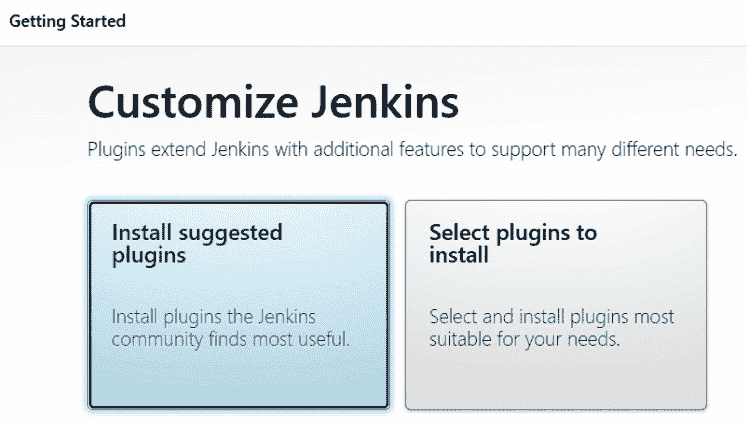
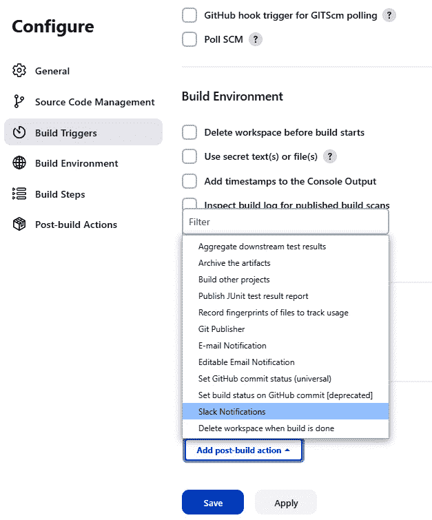

# 15

# 感知斗篷——使用 Jenkins 和 LambdaTest 在 CI/CD 管道中运行测试

你是否曾好奇一些超级英雄是如何白天成为法庭律师，晚上成为犯罪斗士的？他们何时才能小憩片刻？

在本章的最后，我们将通过安排测试执行来使我们的 WebdriverIO 脚本得以执行。这可以通过在持续执行环境中使用执行管道来运行我们的作业来实现，这些作业在虚拟化的云环境中运行，而不是在我们的本地**操作系统**（**OS**）中运行。想象一下，这是一个似乎有自己的思想的配件——一个永远警觉的沉默助手，其唯一目的是通过从你的工作中移除耗时任务来帮助你，通常在你睡觉的时候。这就是我们将介绍 Jenkins 和 LambdaTest **持续集成**（**CI**）以及跨操作系统使用的地方。

在我们开始之前，让我们回顾一下在 *第一章* 中提到的内容——自动化需要比平均计算资源更多。虚拟化需要更多。我们在这本书中使用了两个机器来编写代码：一个 Windows 11 系统——即一个**微星国际**（**MSI**）雷神 GE76 12UE 游戏机，专门配备 2 TB 的 SSD 硬盘空间和 64 GB 的 RAM。它配备了 12 代英特尔 i9-12900H 核心 CPU，基速为 2.90 GHz。CPU 配备了 14 个核心，支持 20 个线程。我们还使用了两个配备 M1 芯片的 Apple MacBook Pro，使用 Parallels 虚拟化了一个 Windows 操作系统，硬盘容量为 1TB。

快速提示——如何对你的 PC 进行剖析

没有一个工具能在一个方便的位置给你系统洞察力，你不可能成为一个好的侦探。我们在 Windows 上使用了超过 15 年的剖析器是 Belarc Advisor 个人版。

我们这样做只是为了确保资源耗尽的可能性很小，从而避免随机瞬态问题，这些问题可能会导致假阳性。如果你的 RAM 可用性低于 15%，你很可能会遇到问题。如果你的 Windows 机器有一个表示需要升级的红点，请给它应有的优先级。

本章将涵盖以下主要主题：

+   什么是 Jenkins 和 Slack

+   安装 Jenkins

+   使用 Jenkins 创建 WebdriverIO 项目

+   从 Jenkins 报告 Slack

+   按需和计划套件运行

+   Jenkins 上的调试运行类型

+   CI/CD 管道

# 技术要求

为了完成本章，你必须满足以下技术要求：

+   安装和配置 Jenkins

+   配置 Slack 以接收消息

+   修改 `wdio.config.ts` 文件

+   创建一个 Jenkins 作业运行单个测试并向 Slack 报告

+   将测试组织到类别中

+   创建一个 Jenkins 作业来运行每个类别

+   将测试组织到 Sanity、Smoke 和 Regression 套件中

+   创建一个 Jenkins 作业来运行每个套件

+   设置和配置作业以每晚运行

+   手动测试人员可以按需运行参数化作业

所有测试示例都可以在本书的 GitHub 仓库中找到，地址为 [`github.com/PacktPublishing/Enhanced-Test-Automation-with-WebdriverIO`](https://github.com/PacktPublishing/Enhanced-Test-Automation-with-WebdriverIO)。

# 什么是 Jenkins 和 Slack？

在测试自动化的领域中，尤其是在使用 WebdriverIO 等框架时，Jenkins 和 Slack 由于其功能而占据重要位置，这些功能简化并增强了测试部署过程。它们可以被配置为在测试运行完成后向 Slack 频道发送更新消息。Jenkins 可以安排测试套件的运行，或者任何团队成员都可以按需启动。

我们将以此章的最终部分开始，为 Jenkins 安装做准备。

# 为 Jenkins 安装 OpenJDK

在安装 Jenkins 之前，我们需要确保我们拥有正确的 Java 开发工具包版本。应使用 OpenJDK 版本 17，并建议使用最新版本。Java 17 SDK 可以从 [`www.oracle.com/java/technologies/downloads/#java17`](https://www.oracle.com/java/technologies/downloads/#java17) 下载。

在 Windows 上安装 Java 17 最简单的方法是下载并执行 MSI 文件，并将其保存到 `Program Files` 文件夹下的默认路径。复制路径并将其添加到 `JAVA_HOME` 环境系统变量路径中：


图 15.1 – 在 Windows 系统变量中添加路径

然后，将 `%JAVA_HOME%/bin` 添加到 `Path` 变量中：


图 15.2 – 将 JAVA_HOME\bin 添加到 Windows 路径变量

接下来，我们必须确认 Java 已安装。

从命令提示符，输入以下内容：

```js
> java -version
```

您将看到以下输出：


图 15.3 – 验证已安装 Java 版本 17

现在，我们可以开始安装 Jenkins。

# 将 Jenkins 作为独立应用程序安装

*重要提示*：Jenkins 将为管理员账户提供一个临时密码。在安装完成后，我们需要保存此信息。

# 安装 Jenkins

安装 Jenkins 相对直接。从 [`www.jenkins.io/download/`](https://www.jenkins.io/download/) 下载适用于您的 Mac、Windows 或 Linux 操作系统的最新版本的 Jenkins，并使用默认路径进行安装。

下载完成后，将 `jenkins.war` 文件拖到桌面。从命令提示符，导航到桌面并输入以下内容：

```js
> java –jar jenkins.war
```

您将看到以下输出：


图 15.4 – 在此示例中选择 LocalSystem。在现实世界中，IT DevOps 团队会为安全起见安装管理员域用户账户

当服务以 LocalSystem 身份安装时，建议更改为本地或域用户凭据。接下来，我们必须设置端口号。使用默认端口号`8080`并测试我们是否得到分配端口号的绿色勾选标记：


图 15.5 – 使用默认端口号 8080 并测试我们是否得到绿色勾选标记

如果端口被阻止，则需要将其打开；否则，必须分配另一个开放的端口号。

下一页指定自定义设置功能。保持原样并点击我们在 Windows 中之前设置的`JAVA_HOME`环境变量。否则，设置 JRE 安装的路径：


图 15.6 – 点击安装，Jenkins 将准备就绪

我们的服务器 Jenkins 现在可通过`https://localhost:8080/`访问，并需要我们之前提供的临时管理员密码进行输入，然后为了安全起见进行更改。生成的凭据所在的日志文件路径列在网页上。

Jenkins 将询问您是否希望安装建议的插件：



图 15.7 – 安装建议的插件

继续安装建议的插件：


图 15.8 – 建议的插件

最后，我们必须创建第一个管理员用户的账户凭据：


图 15.9 – 创建第一个管理员用户

点击**保存并继续**。Jenkins 将再次提供其 URL。最后一次点击**保存并继续**。点击**开始使用 Jenkins**将被重定向到主页面。我们建议您将此链接保存到浏览器书签栏。我们忠诚的 Sentient Cape 现在准备好执行我们的命令：


图 15.10 – Jenkins 主页面

在这里，我们可以创建新的项目和作业，并按需或按预定的时间表运行它们。有了这个，现在是时候运行我们的第一个测试作业了。

# 使用 Jenkins 创建 WebdriverIO 项目

从主仪表板视图，点击**+新建项目**按钮。Jenkins 为我们提供了几个项目选项和组织工具。**Freestyle 项目**是一种简化的构建作业方法，而**Pipeline**则允许使用 Groovy 编程语言进行更细致的定制：


图 15.11 – 创建 Freestyle 项目

对于我们的目的，**Freestyle 项目**就足够了。将显示几个选项。我们只需要几个选项就能从*第二章*将我们的 GitHub**源代码管理器**（**SCM**）中的内容检出并运行：


图 15.12 – 添加构建步骤

在**构建步骤**部分，选择**添加构建步骤**以执行终端命令。对于 Mac，选择**执行 shell**，对于 Windows，选择**执行 Windows 批处理命令**选项。使用命令提示符，我们将导航到工作区路径。

接下来，添加一个`运行 npm 命令`构建步骤。当我们运行 LambdaTest 中的测试时，这是必需的。在本节中，我们将执行`package.json`文件中列出的命令。在此示例中，我们将使用`npm ch2`运行*第二章*中的测试。

但在那之前，我们需要添加一个最后的附加组件来支持工作通知。

# 安装 LambdaTest 的 Jenkins 插件

要安装 LambdaTest 的 Jenkins 插件，请按照以下步骤操作：

1.  点击**管理 Jenkins**，然后**管理插件**。

1.  点击**可用**选项卡。

1.  在`LambdaTest`。

1.  您将看到一个插件列表；选择**LambdaTest**。

1.  要安装**LambdaTest** Jenkins 插件，您必须选中**LambdaTest**前面的复选框。一旦插件安装完成，并且 Jenkins 已重新启动，您将在**已安装插件**下找到 LambdaTest Jenkins 插件：


图 15.13 – 搜索 LambdaTest Jenkins 插件

## 使用 Jenkins 配置 LambdaTest

按照以下步骤配置 LambdaTest 与 Jenkins：

1.  在 Jenkins 主页上，点击**凭据**。

1.  在**凭据**下，点击**系统**。

1.  在**系统**页面上，点击**全局凭据（不受限制）域**。将打开**全局凭据**页面。

1.  点击**添加凭据**。将打开**添加凭据**页面。

1.  在字段中输入相关数据，然后点击**验证凭据**。验证后，点击**确定**按钮。Jenkins 将生成一个 ID，该 ID 在**凭据**页面上可见。

1.  保存您的更改：


图 15.14 – 向 LambdaTest 插件添加必要的凭据

一旦添加了您的凭据，Jenkins 将生成一个 ID。要为 LambdaTest 凭据检索此 ID，您必须转到 Jenkins 主页并点击左侧导航菜单中的**凭据**。

从 Jenkins 主页，点击左侧菜单中的**凭据**。您可以复制 LambdaTest 凭据的 ID。

# 创建一个自由式项目和作业

从 Jenkins 仪表板，点击`使用 WebdriverIO 增强测试自动化`作为名称，并选择**自由式项目**。

这将显示几个选项卡，包括**常规**、**源代码管理**、**构建触发器**、**构建环境**、**构建**和**构建后操作**。我们将选择使用本地机器上的代码进行运行。高级用户可以使用基于云的企业 Jenkins 从私有仓库检出代码：


图 15.15 – 为手动测试人员设置基于状态的定制测试运行

要运行构建，我们需要测试名称和项目目录的路径。

## 参数化

在作业配置中，我们将添加一个参数，我们将从 Jenkins 传递到我们的自动化框架中，命名为 `JOURNEY`。这将成为一个我们的框架期望并解析以确定托管或参加万圣节派对路径的系统变量。此外，我们还有一个选择参数，允许我们将 `dev` 或 `prod` 传递到 Env 系统变量中。这将改变此测试的着陆页 URL：


图 15.16 – 为手动测试人员设置基于状态的定制旅程测试

接下来，我们将拥有一个精简版的状态驱动自动化测试，这是我们之前章节中构建的：

```js
import LoginPage from "../pageObjects/login.page";
// Host or Attend a party in Ghostville or Zombieton
import stateDrivenUtils from "../utilities/stateDriven.utils";
describe("Ch15: State-drive Automation from Jenkins", () => {
    it("should loop around until the final or first page is found", async () => {
        // Get the test data from the JOURNEY environment variable
        let env = process.env.ENV || "prod";
        await LoginPage.open(env);
        let testData = process.env.JOURNEY || ""; // Get test data from JOURNEY environment variable set by Jenkins
        stateDrivenUtils.partyPath(testData); // Attend path through the party
    });
});
```

注意，即使测试人员将旅程清空到空字段，测试仍然会默认使用在 Zombieton 举办派对的快乐路径运行：


图 15.17 – 使用旅程决策点建议构建带有参数的测试

我们的手动测试人员现在可以打开 Jenkins 并使用参数启动此测试。他们可以选择他们想要走的路径类型，以及从 **Env** 下拉菜单中更改要运行的测试环境。

一旦此测试用例完成，我们将在 LambdaTest 仪表板上看到结果：


图 15.18 – LambdaTest 结果屏幕

通过利用基于云的自动化构建平台，我们获得了许多优势。首先，我们不需要管理底层 OS 配置。其次，我们不需要跟踪浏览器的版本。最后，我们得到了一个测试执行的精彩视频记录，这比单个屏幕截图要好得多。

所有这些神秘的魔法都是通过我们在*第十三章*中描述的 LambdaTest 配置文件实现的。

在此处添加 LambdaTest 凭据：


图 15.19 – 添加 LambdaTest 凭据

现在，让我们看看 Slack 中的报告是如何工作的。

# 从 Jenkins 在 Slack 中报告

成为超级英雄的最终问题之一是保持超级警觉。在不间断运行大量测试时的问题是我们必须记得偶尔检查它们是否已完成。设置提醒可能会打断我们对其他工作的注意力。我们可能被其他任务完全占据，以至于我们可能要在任务完成后几小时后才能回到结果。为了提高效率，我们可以将警报消息发送到我们的电子邮件收件箱，但如果收件箱被大量 incoming 消息轰炸，它们可能会被忽略。更好的解决方案是将更新发送到团队消息平台，如 Slack。这是一个三步过程——也就是说，添加 Jenkins 插件，添加 Slack 应用，以及添加 Jenkins 构建后步骤。第一步是在 Slack 和 Jenkins 中安装必要的附加组件，以指示消息将显示的 Slack 频道。

## 将 Slack 通知插件添加到 Jenkins

导航到**管理 Jenkins** | **插件** | **可用**。然后，搜索并安装**Slack 通知**插件：


图 15.20 – 搜索 Slack 通知插件

一旦插件安装完成，重启 Jenkins 并登录。现在**Slack 通知**插件将出现在**已安装插件**标签页中。我们的下一步是设置 Slack 集成。

## 将 Jenkins CI 应用添加到 Slack

因此，我们必须添加 Slack Jenkins CI 应用。浏览**应用**并搜索并添加**Jenkins CI**：


图 15.21 – Slack 的 Jenkins CI 插件，将接收来自 Jenkins 的消息

此应用将要求您创建一个 Slack 频道或选择一个现有的频道。在这个例子中，我们将创建一个`jenkins-jobs`频道，以便通知显示。

我们的最后一步是获取令牌，以便这两个产品能够通信。导航到 Slack 应用目录并添加 Jenkins CI 集成：


图 15.22 – Slack 频道中的通知，确认集成已完成

集成添加后，点击消息中的**Jenkins**链接以获取令牌。

此令牌可在 Jenkins 仪表板中的**管理 Jenkins** | **管理插件**下找到，位于**可用**标签页：


图 15.23 – Slack 设置

将令牌和工作区复制到 Jenkins 应用的设置中，然后点击**保存设置**。

接下来，返回 Slack。在**仪表板** | **系统**页面进入工作区。

然后，添加凭据和一些秘密文本。输入秘密。ID 是可选的。最后，点击**测试连接**：


图 15.24 – 示例消息将出现在 Slack 中

我们现在已连接完成并进行了测试。我们的最后一步是让 Jenkins 向 Slack 发送信息。

## 添加构建后 Slack 操作

在我们的工作**构建后操作**区域中选择**Slack 通知**：



图 15.25 – 选择 Slack 通知

选择**通知成功**和**每次失败时通知**。然后，点击**保存**：


图 15.26 – 在 Jenkins 中报告给 Slack 的完成作业的通过和失败状态

一旦构建完成，更新将自动发送到指定的 Slack 频道。这最小化了作业完成和结果分析开始之间的延迟。反过来，这种效率优化了所有自动化团队成员的时间使用。

# 按需和计划套件运行

我们尽量让测试尽可能频繁地运行。有时，这可能会影响我们的环境，从而阻止手动测试团队进行工作。

有时，这个过程很安静，没有发生任何事情。曾经有一个项目经理问我们是否可以比在冲刺发布周期结束时更频繁地运行自动化测试套件。我高兴地展示了我们的 Allure 报告的直方图，并确保每个人都知道测试是每晚运行的。我们每天早上审查这些结果，以寻找意外的失败和状态变化。当我们编写新的测试并维护其他测试时，我们还注意到几乎每个测试每天都会执行多次，以确保它们相互影响。

# 使用 Jenkins 的调试运行类型

我们需要一个测试来检查我们在这本书中编写的自动化框架功能的可靠性。我过去把它称为框架功能性的单元测试。然而，这与应用开发者团队产生了混淆。他们听到“单元”这个词，认为我是在提议承担他们代码中的单元测试，这是一个他们始终负责的工作。因此，为了避免进一步的混淆，我们将一个测试称为框架的 Sanity 测试。

最常见的作业类型是**Sanity**、**Smoke**和**Regression**：

+   通过将来自密钥存储的凭据输入到输入字段元素中，使用`SetValueAdv()`，并通过点击`pageSync()`并从列表中选择`SelectAdv()`来执行`ClickAdv()`。它必须至少包含一个使用`AssertAdv()`的验证。

    这不应该是一个漫长的端到端测试，但它可以是其中一个的初始步骤。虽然这个工作可以在每次新的框架提交后运行，但测试本身也应该包含在每个套件中。如果它失败了，这将表明有某些基本的东西已经损坏，需要立即进行调查。

+   **烟雾**测试包括大约覆盖整个套件 10%的测试集合。

+   **回归** 是套件中剩余的 90% 测试，不包括烟雾测试。

然而，还有其他类别的测试，我们通常设置为每晚或每周运行。

## 额外的套件类别

让我们看看额外的套件类别：

+   **构建验证套件**：过去针对它们编写了缺陷的测试子集。通常，这是烟雾套件的十分之一。

+   **API 套件**：一种快速验证 API 调用（带有有效载荷）、验证响应和响应代码的方法。同样，这是一组小型快速测试，没有 GUI 交互。

+   **长测试套件**：有些测试需要较长时间才能完成。让他们自己玩得开心，以便尽早完成烟雾和回归测试。

+   **单个测试套件**：这允许用户请求所有测试组合的定制子集。这可能包括产品退货、搜索和保存购物车。这允许测试团队只关注一个区域，而无需在多个 BVS、烟雾和回归运行中搜索。如果它包含 Jira 编号，它还可以按测试用例名称运行测试。

+   **失败**：一个标记为最近失败的测试列表，并从其他套件中移除。这个套件可以快速查看单个修复是否解决了多个失败的测试。

## 将 Allure 报告链接到 Jenkins 运行

在你的 Jenkins 作业配置中，在 **构建后操作** 下，添加一个 **发布 Allure 报告** 操作。

适当地配置 **报告版本** 和 **报告目录** 字段。**报告目录** 应指向生成 Allure 报告文件的目录。

# CI/CD 管道

**CI/CD** 代表 **持续集成和持续部署**（或 **持续交付**）。它是一组用于软件开发的实践和工具，用于自动化构建、测试和部署软件更改的过程。CI 是开发者频繁将代码合并到中央仓库，而不是等待长时间后再合并代码。这种方法有助于他们尽早识别集成问题，并确保代码库始终处于功能状态。

持续部署（或持续交付）通过自动化将软件更改部署到生产环境的概念扩展了 CI。目标是拥有一个可靠且自动化的管道，该管道从仓库中提取代码更改，构建它，测试它，并将其部署到生产环境，而无需人工干预。

CI/CD 流程通常涉及以下步骤：

1.  **代码集成**：开发者频繁地将更改提交到版本控制系统（如 Git）。

1.  **构建和测试**：CI/CD 系统自动构建应用程序并运行各种自动化测试，以确保更改按预期工作。

1.  **自动化部署**：一旦构建和测试成功通过，CI/CD 系统会自动将其部署到预发布或生产环境（即云平台、容器化环境等）。

1.  **持续监控**：一旦部署，CI/CD 系统可以监控应用程序的性能并记录任何错误或问题。

## 什么是持续测试？

持续测试是在整个软件开发生命周期中执行自动化测试的实践，以提供对代码质量的快速和频繁的反馈。

传统上，测试通常被认为是一个独立的阶段，发生在开发周期的末尾。然而，随着敏捷和 DevOps 实践的采用，测试已经转向整合到开发过程的每个阶段。

持续测试涉及以下五个关键方面：

+   **自动化测试**：持续测试依赖于自动化测试，包括单元测试、集成测试和功能测试。这些测试是脚本化的，并且每当代码库发生变化时都会自动执行，目的是确保软件功能按预期工作并帮助早期捕捉到错误。

+   **早期和频繁的测试**：持续测试强调我们早期和频繁地进行测试。一旦代码更改合并到仓库中，就会触发测试以验证更改的完整性。

+   **测试环境**：持续测试涉及多个测试环境，包括本地开发、测试和预发布环境。这些环境用于在尽可能接近生产环境的设置中运行测试。

+   **测试数据管理**：这全部关于有效地管理测试数据。这些数据应该能够覆盖广泛的情况和用户场景。测试数据还应该易于提供和重置，以确保可靠的和可重复的测试执行。

+   **持续反馈**：这全部关于提供对代码更改质量的即时反馈。测试结果会自动生成，突出显示任何失败或问题。这种反馈帮助开发者快速处理失败/问题，确保代码库保持稳定和可靠。

现在我们已经了解了什么是持续集成以及如何进行它，我们需要检查我们的管道以执行我们的测试套件。

## CI/CD 管道看起来是什么样子？

CI/CD 管道是一组自动化步骤和工具，它使 CI、测试和软件更改的部署成为可能。虽然 CI/CD 管道的具体实现可能因项目和组织的不同而有所差异，但以下小节提供了一个 CI/CD 管道可能看起来的一般概述。

## 代码仓库

管道从代码仓库开始，通常使用 Git 等版本控制系统。自动化工程师将他们的代码更改提交到 GitHub 或 GitLab 仓库。这可能包括添加或维护现有测试用例或增强自动化框架功能。

## CI

CI 是一种软件开发实践，开发者定期将他们的代码更改合并到中央仓库，最好是每天多次。合并后，自动构建和测试运行以尽早发现错误并确保新更改与现有代码库兼容。CI 的主要目标是提高代码质量、尽早发现问题并促进快速、可靠的发布。CI 通常与其他 DevOps 实践和工具（如 CD）集成，以简化从编码到部署的开发生命周期。Jenkins 等工具通常用于编排 CI 过程：

+   **代码编译**：当提交更改时，CI 系统从仓库拉取最新代码并将其编译成可执行代码。

+   **自动化测试**：CI 系统运行一系列自动化测试，包括单元测试、集成测试和其他类型的测试，以验证代码更改的正确性和功能。

+   **代码质量检查**：CI 系统可能执行代码质量检查，如代码检查或静态代码分析，以确保遵守编码标准和最佳实践。

+   **测试报告和通知**：CI 系统生成测试报告并向开发团队发送通知。

## 艺术品生成

艺术品生成涉及通过自动化或计算机辅助过程创建数字或物理对象、数据或内容。如果代码通过了测试和质量检查，CI 系统会生成构建工件，如编译的二进制文件、库或容器镜像。这些工件是成功编译和测试过程的结果，包括 Allure 报告和屏幕截图。

## 部署

如果构建和测试成功通过，CI/CD 系统会自动将更改部署到预发布或生产环境。这一步骤可能涉及部署到云平台、容器化环境或其他基础设施配置。

+   **预发布环境**：工件被部署到与生产环境相似的预发布环境。

+   **额外测试**：在预发布环境中可能进行更全面的测试，例如性能测试、安全测试或用户验收测试。

+   **审批流程**：根据组织的政策，在部署到生产环境之前，可能会有一个审批流程或手动审查。

## CD

CD 通过自动化将软件更改部署到生产环境的过程扩展了 CI 的概念。使用 CD，目标是拥有一个可靠且自动化的管道，该管道从代码库中提取代码更改，构建它们，运行测试，并将它们部署到生产环境，无需人工干预：

+   **生产环境**：如果预演测试和批准成功，则工件将自动或手动部署到生产环境，具体取决于组织的部署策略。

+   **部署后测试**：在生产环境中可能进行额外的监控和测试（业务验证），以确保新的更改按预期工作。

+   **持续监控**：CI/CD 管道通常包括监控工具，这些工具跟踪应用程序的性能、日志和指标。

## 持续反馈

持续测试对代码更改的质量提供即时反馈。测试结果自动生成，突出显示任何失败或问题。这个反馈循环帮助开发者快速识别和修复问题，确保代码库保持稳定和可靠：

+   **通知和报告**：在整个管道中，会生成通知、报告和日志，并可供开发团队和利益相关者查看，提供对进度、测试结果和部署状态的可见性。

+   **迭代开发**：CI/CD 管道促进了迭代开发过程，开发者可以快速收到对代码更改的反馈，并做出必要的调整，确保持续改进。

## Jenkins 用于 CI/CD

Jenkins 是设置 CI/CD 管道的优秀工具，它允许您自动化测试生命周期的各个阶段。在动态测试环境中，尤其是在使用 WebdriverIO 的情况下，一个配置良好的 CI/CD 管道可以显著提高测试过程的效率。

Jenkins 可以配置为在代码推送后自动触发测试套件，这确保了测试套件始终与最新的代码库保持同步，减少了潜在问题滑过并进入生产的风险。

Jenkins 允许并行执行测试，这显著减少了测试执行时间。这对于任何旨在在当今快节奏的开发环境中保持敏捷性和速度的测试框架来说是一个必备功能。

Docker 有助于创建一个标准化的测试环境，这对于确保测试结果的可信度至关重要。拥有一致的环境意味着您的测试将更加可靠，并且不太可能受到环境不一致性引起的错误的影响。

Docker 容器为您的测试提供了一个隔离的环境，这是避免不同依赖项和系统配置之间冲突的创造性解决方案。它绕过了臭名昭著的“在我的机器上它工作”问题，确保测试自动化框架强大且可靠。

# 摘要

通过实施 CI/CD，开发团队能够简化软件开发流程，减少人为错误，并确保更快、更可靠地交付新功能和错误修复。它促进了团队成员之间的协作，提高了代码质量，并使快速和频繁的发布成为可能。

通过将持续测试纳入开发过程，团队能够及早识别和解决问题，降低缺陷到达生产的风险，并确保软件符合质量标准。它促进了整个开发团队的质量文化，并支持更快、更可靠的软件交付。

需要注意的是，CI/CD 管道中涉及的具体工具、技术和步骤可能因项目需求、技术堆栈和组织偏好而异。管道可以根据需要定制和扩展，包括额外的阶段，如安全扫描、性能优化，甚至在出现问题时自动回滚。

总体而言，Jenkins 和 LambdaTest 简化了设置和管理 CI/CD 管道的过程，使团队能够更快、更可靠、更有信心地交付软件，并确保代码更改的质量。

# 附录

# TypeScript 错误消息、原因和解决方案的终极指南

本附录涵盖了作者在撰写本书时遇到的所有问题，包括（但不限于）安装、配置和运行时错误。每个问题后面都跟着一个或多个原因，每个原因都有一个解决方案。具有相同解决方案的问题被分组在一起。使用本附录的好方法是搜索从终端窗口复制的错误详情的小片段，例如`检查` `端口`。

# 问题：通过传递“--yes”参数安装默认 WDIO 设置仍会询问配置问题

命令提示符中的`--`参数：

```js
> npm init wdio . --yes
```

将参数传递给`wdio`的`--`：

```js
> npm init wdio . -- --yes
```

# 问题：缺少脚本“wdio”

`scripts:`部分或`Package.json`中缺少`wdio`脚本。

在`Package.json`文件中的`scripts:`部分添加`wdio`：

```js
"scripts": {
    "wdio": "wdio run test/wdio.conf.ts"
},
```

# 问题：“node”不是 cmdlet、函数、脚本文件或可操作的程序的名称。检查名称的拼写，如果包含路径，请验证路径是否正确，然后重试。

**原因**：Node 尚未安装。

**解决方案**：安装 Node。

# 问题：“wdio”不是内部或外部命令”

**原因 #1**：控制台不在正确的文件路径文件夹中。

**原因 #2**：支持包尚未安装。

`npm i`：

```js
> npm i packageName
> yarn add packageName
```

# 问题：

+   浏览器启动后立即关闭

+   “此版本的 ChromeDriver 尚未与 Chrome 版本进行测试”

+   “必须使用 import 来加载 ES 模块”或“不支持 ES 模块的 require()”（项目中没有 require 代码）

`chromedriver.exe`版本过时。

**解决方案**：安装缺失的包。

```js
yarn add packageName
```

# 问题：在新的 WDIO 项目文件夹中安装时，没有创建\node_modules 文件夹。

# 问题：新项目安装失败，目录为空。

# 问题：测试突然失败，包括\specs\test.e2e.ts 的示例测试。

`\node_modules`文件夹、一个`package.json`和一个`wdio.conf.ts`文件。当在子文件夹中执行子安装时，它将检查父文件夹中预先存在的共享资源。这将跳过创建`\node_modules`文件夹，并可能覆盖父`package.json`和配置文件。示例`\specs\test.e2e.js`可能最初在新子文件夹中运行。然而，二级子项目安装可以进一步覆盖父`\node_modules`文件夹和配置文件，可能破坏所有引用共享资源的项目，以及安装过程无法完成。

从父文件夹将`\node_modules`文件夹、`package.json`、`wdio.conf.ts`文件和`\test`文件夹移动到新的子项目文件夹中。从 GitHub 恢复父文件夹中最后已知可工作的`package.json`和`wdio.conf.ts`文件到测试不再运行的子文件夹中。使用 yarn install 重建以创建缺失的`\node_modules`文件夹。现在测试应该可以运行。在子子文件夹中的新项目安装也应成功完成。

# 问题：“WARN webdriver: 请求遇到一个过期的元素 - 终止请求”

# 问题：“TypeError: elem[prop]不是一个函数”

# 问题：语句执行顺序错误

`await`命令：

```js
setValueAdv(this.fldUsername, "username")
```

**解决方案**：添加 await 命令

```js
await setValueAdv(await this.fldUsername, "username")
```

# 问题：“ERROR @wdio/runner: 错误：describe 期望一个函数参数；收到[object AsyncFunction]”

`async`位于`describe()`块中：

```js
describe("async here causes troubles", async () => {
```

`async`从`describe()`块中：

```js
describe("no more troubles", () => {
```

# 问题：“不支持的引擎”


图 A.1 – npm 包管理器显示所需的和当前的 node/npm 版本


图 A.2 – yarn 包管理器显示预期的和过时的当前 node/npm 版本

**原因**：当前版本的 Node 与所需版本不匹配。

**解决方案**：将 Node 更新到正确版本。在此示例中，Node 版本 14 不受 WDIO 包支持，必须更新到 16.13、18.x 或更高版本：

```js
> nvm use 18
```

# 问题：JavaScript 调试终端跳过断点

`import`语句路径


图 A.3 – 移除未使用的辅助导入项阻止了断点的跳过

**解决方案 #1**：删除未使用的导入。

**原因 #2**：导入的资源中缺少 async 和 await 语句

**解决方案 #2**：添加 async 和 await 语句

**原因 #3**：缓存的导入路径从“pageobjects”更改为“pageObjects”

**解决方案 #3**：重启 VSCode

# 问题：浏览器启动后锁定

**原因**：与 Node 版本 16.0.0 不兼容。

**解决方案**：升级到 Node 版本 18：

```js
> nvm install 18
```

# 问题：“SevereServiceError：无法启动 Chromedriver：超时。请检查端口号 [<端口号>] 是否被占用”

`chromedriver` 失败已锁定端口。

`chromedriver` 会话。

这是使用 Windows CMD 命令提示符的操作方法：

```js
> Taskkill /IM chromedriver.exe /F
```

# 这是使用 macOS 的操作方法：`lsof -i :<端口号> : kill -9 <进程 ID>`

# 问题：MODULE_NOT_FOUND

`Path` 环境变量。

**解决方案**：将节点路径添加到系统变量中。

**原因 #2**：使用命令提示符安装且没有本地管理员权限的包

**解决方案**：使用管理员权限从 PowerShell 安装（仅限 Windows）：


图 A.4 –VS Code 终端窗口中的不同类型壳

获取节点路径类型，如下代码和后续图所示：

```js
npm config get prefix
```


图 A.5 –如何获取节点程序管理器的路径

将路径添加到 `path` 系统变量中（仅限 Windows）：


图 A.6 –检查 npm 路径是否在 Windows 环境变量中

不要忘记重新启动 Visual Studio Code！

# 问题：错误：由于缺少配置，无法执行“运行”，找不到文件“C:\repos\wdio\test\wdio.conf.ts”！您希望创建一个吗？

此错误在此处显示：


图 A.7 –TypeScript 和 JavaScript 项目在不同的文件夹中存储 wdio.config 文件

在 `package.json` 文件中的 `scripts` 下的 `wdio.conf.js` 路径不正确。

**解决方案**：检查测试是否使用错误的路径或扩展名启动：

```js
npx wdio run test/wdio.conf.ts
npx wdio run wdio.conf.ts
```

`package.json` 文件。在此示例中，分号将生成错误，但双 ampersands 不会：

```js
"allure":
 "wdio run test/wdio.conf.ts; allure generate report –clean; allure open"
```

**解决方案**：将分号替换为双 ampersands

```js
"allure":
 "wdio run test/wdio.conf.ts && allure generate report --clean && allure open"
```

# 问题：运行 Allure 报告时出现“report does not exist”

`allure-results` 路径。

**解决方案**：添加结果路径。

```js
> allure generate report allure-results
```

`package.json` 和/或 `wdio.conf.ts` 文件。

`package` 和 `wdio.conf.ts`。

将报告快捷方式添加到 `package.json` 文件中：

```js
"report": "wdio run test/wdio.conf.ts && allure generate report allure-results --clean && allure open"
```

将 Allure 配置为 `reporters`：

```js
reporters: ['spec',['allure', {
        outputDir: 'allure-results',
        disableWebdriverStepsReporting: true,
        disableWebdriverScreenshotsReporting: true,
}]],
```

# 问题：“[P]lugin “allure” reporter，既不是 wdio 作用域包 “@wdio/allure-reporter” 也不是社区包 “wdio-allure-reporter”。请确保您已安装！”

**原因**：未先添加 Allure 插件而进行的 Allure 配置。

**解决方案**：安装 Allure：

```js
npm install @wdio/allure-reporter --save-dev
yarn add @wdio/allure-reporter
```

# 问题：TypeError：无法读取未定义的属性（读取“open”）

**原因**：TypeScript 安装失败。这发生在您尝试访问存储未定义值的变量的属性或方法时。

**解决方案**：添加缺失的包

```js
yarn add package-name
```

# 问题：Cannot read properties of undefined (reading ‘setWindowSize’)

在从 CommonJS 迁移到 ESNext 时，`webdriverio` 中的 `browser` 引用更改为 `Browser`。

`wdio.conf.ts`，替换以下内容：

```js
import { browser } from "webdriverio";
```

# 问题：在‘onPrepare’钩子中服务失败 SevereServiceError：无法启动 Chromedriver：超时。请检查端口号 9515 是否被占用！

**原因**：JavaScript 调试 Shell 在断点处停止，阻止另一个 shell 使用该端口。

**解决方案**：使用 Ctrl+C 停止正在运行的调试 Shell。

# 问题：“找不到名称‘describe’”并以下划线标红

# 问题：“找不到名称‘it’”

# 问题：“找不到名称‘expect’。您需要为测试运行器安装类型定义吗？”但测试仍然运行。

**原因**：Jasmine 类型定义缺失或不正确。

在`tsconfig.json`文件中，将`jasmine`改为`jasmine-framework`并重新启动 IDE：

```js
"compilerOptions": {
        "types": [
            "@wdio/jasmine-framework"
```

`jasmine`到编译器选项|类型在`tsconfig.json`文件中：

```js
> yarn add @types/jasmine jasmine
```

**原因 #2**：ESLint 或 TypeScript 调试器过时或已禁用。

**解决方案**：激活或更新**扩展**。

**原因 #3**：框架未正确安装。

**解决方案**：重新安装 Jasmine、Mocha 或 Jest。

# 问题：“当启用`allowImportingTsExtensions`时，导入路径只能以`.ts`扩展名结束.ts(5097)”

`tsconfig.json`文件必须指示允许导入具有`.ts`扩展名的文件。

`tsconfig.json`文件：

```js
{"compilerOptions":{
"allowImportingTsExtensions": true
"noEmit": true,
...
}}
```

# 问题：browser.debug()生成“无法从节点连接读取描述符：连接到系统的设备未正常工作。”

**原因**：良性问题。

将`logLevel`从`info`更改为`warn`。

# 问题：元素隐式具有‘any’类型，因为类型‘typeof globalThis’没有索引签名

`any`类型

`:any`。

# 问题：找不到‘jasmine’的类型定义文件

`File` `类型缺失`

**解决方案 #1**：在终端中运行以下命令安装 Node 类型：

```js
> yarn add @types/node
> yarn add @types/jasmine
```

删除`node-modules`文件夹和`yarn.lock`，然后按以下方式重新运行：

```js
> yarn install
```

# 问题：“执行 0 个工作者”没有测试被执行。

`capabilities:`在`wdio.config.ts`中。

**解决方案**：确保能力设置正确：

```js
    capabilities: [{
        maxInstances: 5
```

# 问题：找不到名称‘browser’和找不到名称‘$’

`$`快捷键未添加到类中。

**解决方案**：将浏览器和$对象添加到**类**

`import {browser, $}` `from wdio/globals`

# 问题：属性‘toBeExisting’在类型中不存在

`@wdio/globals`缺失或在`tsconfig.json`中未列为第一项（WDIO 版本 8+）：

```js
"types": [
"@wdio/globals",
"jasmine",
           "node",
           "@wdio/jasmine-framework",
           "expect-webdriverio"
        ],
```

`@wdio/sync`与`@wdio/types`。

**原因 #2**：缺少括号：

```js
const ASB = switchboardFactory // No Parenthesis
ASB.set("DEBUG", true) // Throws error
```

**解决方案 #2**：添加括号：

```js
const ASB = switchboardFactory() // No error
ASB.set("DEBUG", true) // No error
```

# 问题：ERR！[错误：EACCES：权限被拒绝（Mac OSX）

`npm`没有访问权限。

**解决方案**：使用以下命令给予用户访问权限：

```js
> sudo chown –R $USER /usr/local
```

# 问题：在`wdio/selenium-standalone-service`中错误：未找到：java

`selenium-standalone-service`但 Java SDK 未安装。

**解决方案**：安装 Java SDK 的最新版本并重新启动 shell。

# 问题：“ECONNREFUSED 127.0.0.1:9515”在‘onPrepare’钩子中服务失败 tcp-port-used

**原因 #1**：当连接到未运行的 localhost 时可能会发生这种情况。

**解决方案 #1**：关闭 Bash shell 并重新启动。

**解决方案 #2**：尝试使用 ZSH shell。

**可能原因 #2**：安全客户端连接已断开。

**解决方案**：重新连接到客户端应用程序。

**可能原因 #3**：依赖项过时。

**解决方案**：更新依赖项：

```js
> npm update
> yarn upgrade
```

# 问题：错误：找不到模块‘C:\Program Files\nodejs\node_modules\npm\bin\npm-cli.js’。

`import` 语句缺少文件扩展名：

**解决方案**：添加导入语句。

```js
import loginPage from '../pageobjects/login.page'
```

# 问题：“注意：package.json 必须是实际的 JSON，而不仅仅是 JavaScript”。

在项目列表末尾添加 ``,`）。

**解决方案**：删除列表末尾的额外逗号。

# 问题：协议错误（Runtime.callFunctionOn）目标已关闭。

`await`。在元素交互期间浏览器关闭。

使用 `await` 调用 `async` 方法。

# 问题：在 tsconfig.json 中出现“意外的标记”。

**原因**：括号不匹配。整个文件可能在 VS Code（macOS）中被标记为无效。

**解决方案**：修复不匹配的括号并保存文件。

# 问题：“TypeError：elem[prop] 不是一个函数”。

**原因**：像这个例子中一样，输入了自定义方法。

```js
browser .addCommand("clickAdv", async function () {...}
await this.Submit.clickadv(); //Lowercase 'a' in clickAdv
```

**解决方案**：修复输入错误的方法名：

```js
await this.Submit.clickAdv();
```

# 问题：“在“onPrepare”中发生 ServerServiceError：找不到包‘chromedriver’”。

`chromedriver` 和 `wdio-chromedriver-service` 已安装。

从 `package.json` 文件中获取 `chromedriver` 服务。

`"chromedriver": "^x.x.x"`，以及 `wdio.conf.ts` 文件：

```js
"services": ["chromedriver"]
```

# 问题：属性‘{functionName}’在类型‘({functionType<{argName>}) => void’上不存在。

这里有一个例子：

```js
Property 'toBeExisting' does not exist on type 'FunctionMatchers<any>'.ts
```

`expect` 库未从源导入。

**解决方案**：添加导入语句。

`import {expect} from 'expect-webdriverio';`

# 问题：“属性‘addCommand’在类型‘Browser’上不存在。”（macOS）。

**原因**：良性的 VS Code 错误。代码可能仍然可以工作。

`// @ts-ignore` 指令。

# 问题：ConfigParser：模式 ./test/specs/**/*.ts 未匹配任何文件。

`tsconfig` 或 `wdio.config` 文件存在于 `/test` 文件夹中。

将 `tsconfig` 和 `wdio.config` 文件添加到项目根工作目录，其中包含 `package.json` 文件。

如果从 `npm` 调用 `wdio`，模式相对于 `package.json` 所在的目录。

确保 tsNodeOpts 具有正确的`project`路径：

```js
tsNodeOpts: {
            transpileOnly: true,
            project: './specs/**/*.ts'
        }
```

# 问题：错误：超时 - 异步函数未在 10000ms 内完成（由 jasmine.DEFAULT_TIMEOUT_INTERVAL 设置）。

`wdio.conf.ts` 包含 `jasmineNodeOpts`。

`jasmineOpts`。

# 问题：错误：找不到页面句柄。

**原因**：Jasmine 超时了测试。

**解决方案**：将 Jasmine 默认超时间隔设置为高于 10,000：

```js
defaultTimeoutInterval: 9_999_999,
```

# 问题：此表达式不可调用。类型‘void’没有调用签名.ts 你是否遗漏了分号？

**原因**：未知。

**解决方案**：添加分号：

```js
console.log(`timeout = ${Math.ceil(timeout / 60_000)} min.`);
```

# 问题：“文件不是模块”。

模块文件中的 `export` 关键字：

```js
function log(message: any) {…}
```

**导出** 关键字：

```js
export function log(message: any) {…}
```

# 问题：“找不到页面句柄”。

**原因**：浏览器关闭。

在调用 `async()` 方法时使用 `await`。

# 问题：“错误：{pageName} 未定义”。

`class` 和 `export default new` 不匹配。

错误：“SecurePage 未定义”。

```js
class TyposPage extends Page{
        public get typoText () {
        return $(`//p[contains(text(),'random')]`);
    }
export default new SecurePage();
```

**解决方案**：将类和导出名称更改为匹配。

```js
class SecurePage extends Page{
        public get typoText () {
        return $(`//p[contains(text(),'random')]`);
    }
export default new SecurePage();
```

# 问题：类型为‘ChainablePromiseElement<Element>’的参数不能分配给类型为‘Element’的参数。

`await`：

```js
await helpers.clickAdv (this.btnTypos);
```

`await` 用于 `Element`：

```js
await helpers.clickAdv (await this.btnTypos);
```

# 问题：无法删除或修改 WebdriverIO 项目的文件或文件夹

**原因**：项目是用管理员权限创建的，而用户账户没有获得权限。


图 A.8 – 仓库权限

**解决方案**：给用户账户完全控制文件和文件夹的权限（仅限 Windows）。

# 问题：在解析 JSON 时遇到意外的令牌 EJSONPARSE

`package.json` 文件。

`json` 文件用于良好的格式化。

# 问题：在 Windows 的 JavaScript 调试终端中运行时，wdio.config.ts 文件中添加了一长串乱码垃圾字符


图 A.9 – 乱码字符字符串

**原因**：在 wdio.config.ts 文件中使用后声明的全局日志函数。

**解决方案**：在调用任何初始调用之前，将任何全局函数声明移动到 wdio.config.ts 文件的顶部。

**Windows 警告**：注意长文件路径的限制：


图 A.10 – 警告

**原因**：项目深度路径：

```js
C:\users\darkartswizard\git\github\repos\webdriverio-book-project\test\wdio.conf.ts
```

**解决方案**：遵循 **KISS** 示例并 **保持** **简单**：

`C:\repos\wdio\test\wdio.conf.ts`

# Yarn 和 Node 包管理器 (npm)、Node 版本管理器 (nvm) 和 Node 包执行器 (npx) Shell 命令速查表

这是如何安装 `yarn` 和 Node.js 的：

```js
> brew install yarn
```

Node.js 的路径是什么？

```js
> npm config get prefix
> yarn global dir
```

这是如何安装新的 Node 版本的：

```js
> nvm install node version.number
```

这是如何切换到不同的 Node 版本的：

```js
> nvm use version.number
```

安装了哪些版本的 Node？

```js
> nvm list
```

当前激活的 Node.js、npm 和 nvm 版本是什么？

```js
> node -v
> npm –v
> nvm version
```

可用的 Node.js 版本有哪些？npm 有一个未记录的 `show` 命令：

```js
> npm show node versions
```

可用的 WebdriverIO 包版本有哪些？

```js
> npm show webdriverio versions
```

可用的 Jasmine 包版本有哪些？

```js
> npm show jasmine versions
```

已安装哪些 Node 包以及哪些是多余的或无效的？

```js
> cd path-to-project
> npm list
```

这是如何删除多余的 node 包的：

```js
> npm prune
> yarn install
```

在全局级别安装了哪些 node 包？

```js
> npm list -g --depth=0
```

这是如何初始化 WebdriverIO 的：

```js
> cd path/to/project
> npm wdio .
> yarn wdio init
```

这是如何显式执行所有 `wdio` 测试的：

```js
> npx wdio run test/wdio.conf.ts
> yarn wdio wdio.conf.ts
```

这是如何从 `package.json` 文件中隐式执行脚本的：

```js
> npm run wdio
> yarn wdio
```

这是如何显式执行一个 `wdio` TypeScript 测试的：

```js
> npx wdio run ./wdio.conf.js --spec example.e2e.ts
> yarn wdio wdio.conf.ts --spec example.e2e.ts
```

# 参考链接

这本书的成功开发在很大程度上归功于几个关键资源的宝贵贡献。这些提供了构建全面且有洞察力的作品所需的基础知识、见解和关键数据，该作品是该领域的宝贵补充。他们在本书创作中的作用确实是关键的，反映了将此项目付诸实践的合作努力：

+   WebdriverIO：

    [`webdriver.io/`](https://webdriver.io/)

+   yarn：

    [`classic.yarnpkg.com/en/`](https://classic.yarnpkg.com/en/)

+   npm：

    [`www.npmjs.com/`](https://www.npmjs.com/)

+   node：

    [`nodejs.org/en`](https://nodejs.org/en)

+   nvm：

    [`github.com/nvm-sh/nvm/blob/master/README.md`](https://github.com/nvm-sh/nvm/blob/master/README.md)

+   Allure:

    [`allurereport.org/`](https://allurereport.org/)

+   Jenkins:

    [`www.jenkins.io/download/`](https://www.jenkins.io/download/)

+   Lambdatest:

    [`www.lambdatest.com/`](https://www.lambdatest.com/)

+   Circle CI:

    [`circleci.com/`](https://circleci.com/)

+   klassi-js:

    [`github.com/klassijs/klassi-js`](https://github.com/klassijs/klassi-js)

+   SelectorsHub: [`selectorshub.com/`](https://selectorshub.com/)

+   测试网站：

    +   [`candymapper.com/`](https://candymapper.com/)

    +   [`candymapperr2.com/`](https://candymapperr2.com/)

    +   [`the-internet.herokuapp.com/`](https://the-internet.herokuapp.com/)

    +   [`www.telerik.com/kendo-react-ui`](https://www.telerik.com/kendo-react-ui)

+   VS Code:

    [`code.visualstudio.com/`](https://code.visualstudio.com/)

+   IntelliJ/Aqua:

    [`www.jetbrains.com/`](https://www.jetbrains.com/)

+   Belarc Advisor:

    [`www.belarc.com/`](https://www.belarc.com/)

# 结语

作者向您，亲爱的读者，致以最诚挚的祝福，愿您在从凡人成长为超级自动化工程师的道路上取得突破。我们相信，您不仅从这本书中学到了技术知识，而且也享受了探索自动化工程充满活力的世界的乐趣。

这里许多想法的哲学基础可以追溯到阿尔伯特·爱因斯坦的智慧。他的智慧始终是我们的灵感之源，激励我们拥抱实验精神。爱因斯坦曾著名地建议，一个人不应害怕失败，因为每一次失败的实验都是向成功迈进的一步。他的理念贯穿了本书的篇章，鼓励您在工作中不断测试、适应和创新。

随着您在职业道路上的前进，愿您拥抱“玩耍和发现”的乐趣——也就是说，即修补、实验，有时甚至失败——以发现那些通向真正精通的意外发现。我们希望您在这持续的探索中找到极大的乐趣和成就感，从而不断丰富您的职业和个人发展。

祝愿您在自动化工程这个不断发展的领域中不仅成为精通者，而且真正出类拔萃。干杯！

“去创造生产力！”——保罗·M·格罗斯曼

“适应并繁荣，因为变化是生活的真正常数”——拉里·C·戈达德

问题：“[P]lugin “allure” reporter，既不是 wdio 作用域包“@wdio/allure-reporter”，也不是社区包“wdio-allure-reporter”。请确保您已安装它！”

问题：“只有当启用“allowImportingTsExtensions”时，导入路径才能以‘.ts’扩展名结束.ts(5097)”

问题：在 Windows 的 JavaScript 调试终端中运行时，wdio.config.ts 文件中会添加一长串乱七八糟的垃圾字符

Yarn 和 Node 包管理器 (npm)、Node 版本管理器 (nvm) 以及 Node 包执行器 (npx) Shell 命令速查表
