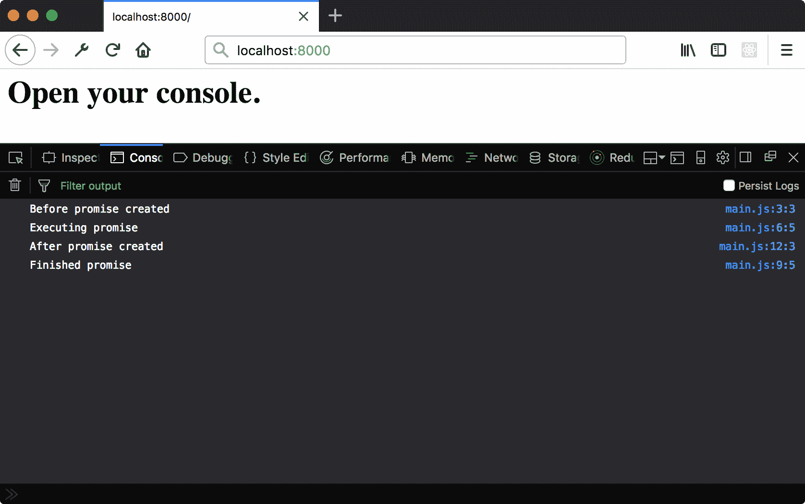
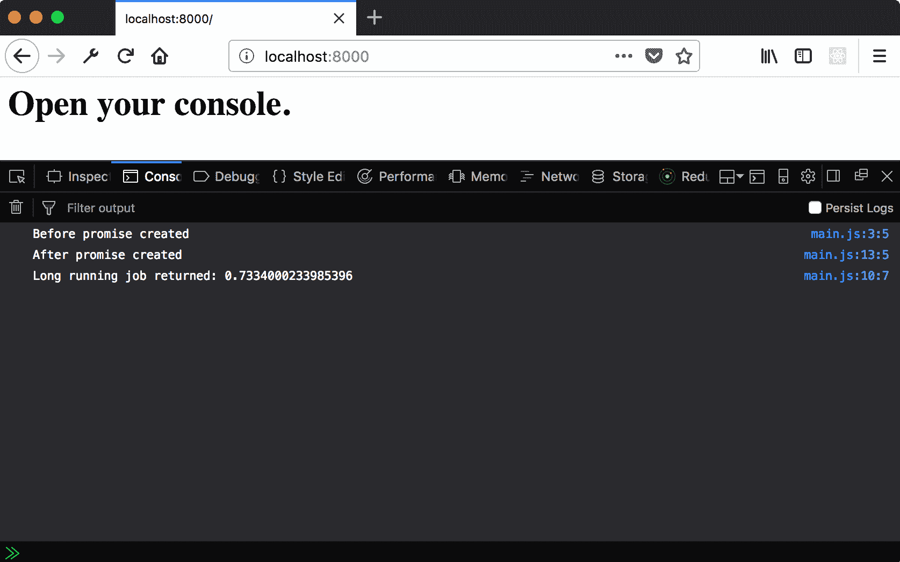
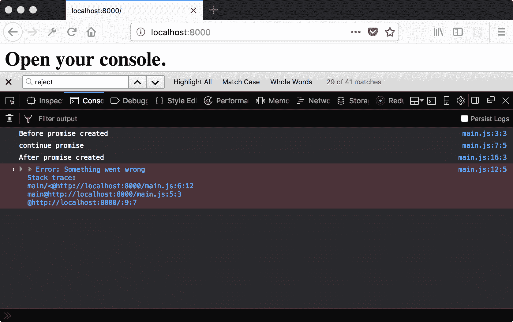
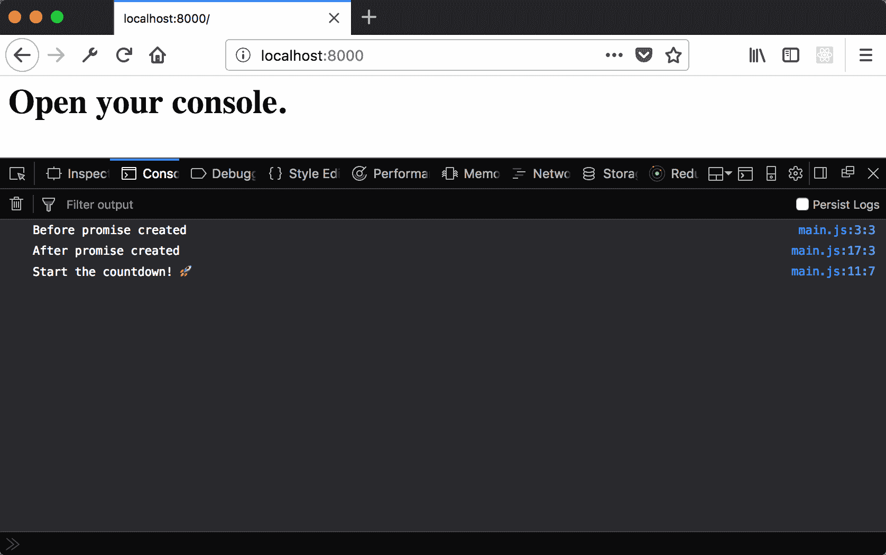
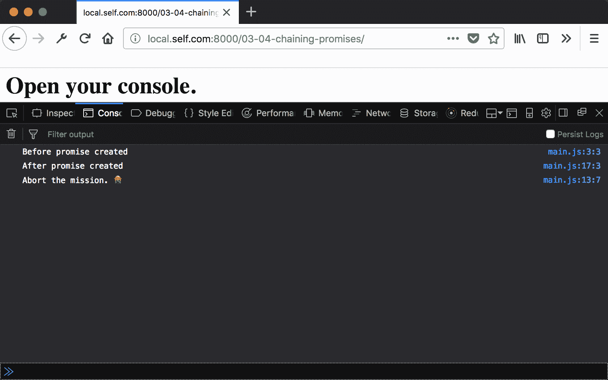
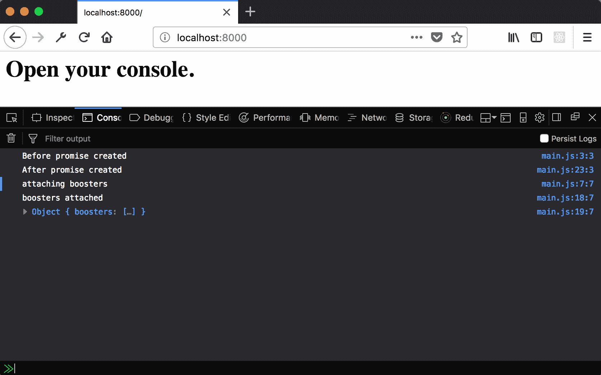
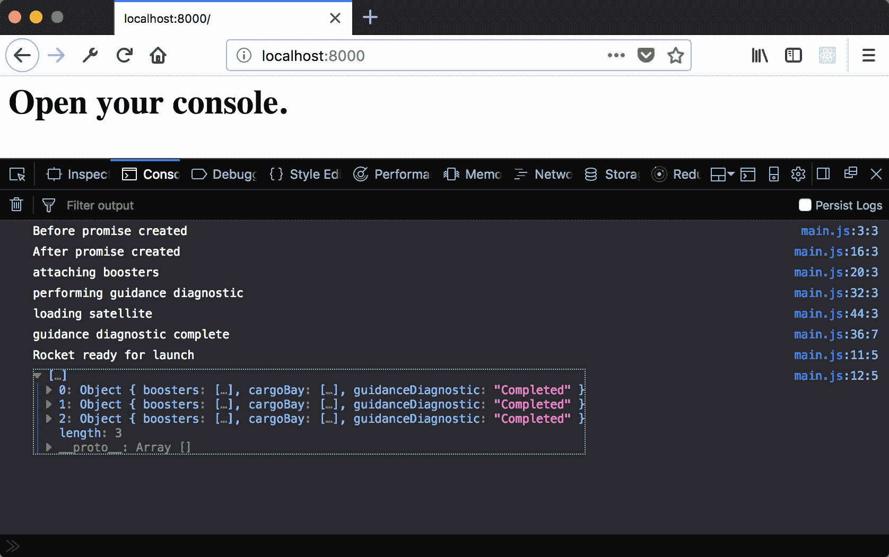
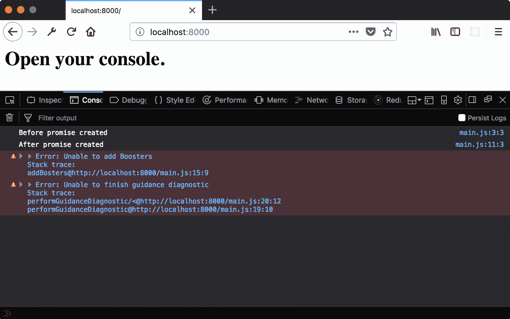
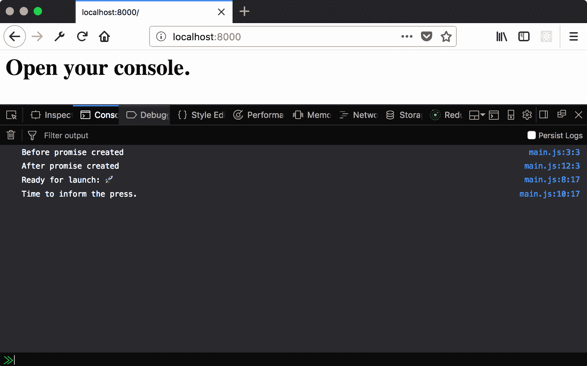
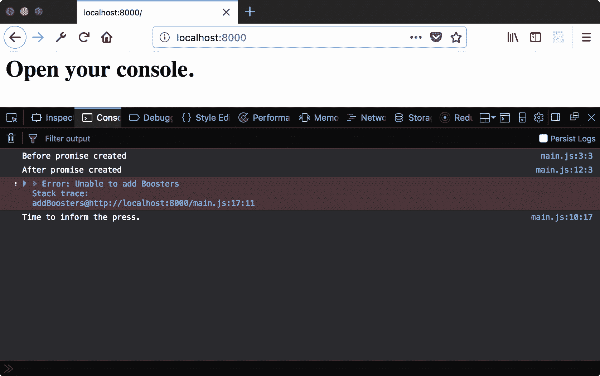

# 第三章：与承诺一起工作

在本章中，我们将介绍以下配方：

+   创建并等待承诺

+   解决承诺结果

+   拒绝承诺错误

+   链式调用承诺

+   使用 Promise.resolve 开始承诺链

+   使用 Promise.all 解析多个承诺

+   使用 Promise.catch 处理错误

+   使用 Promise API 模拟 finally

# 简介

在 JavaScript 的早期版本中，回调模式是最常见的组织异步代码的方式。它完成了工作，但扩展性不好。随着更多异步函数的添加，代码变得更加嵌套，添加、重构和理解代码变得更加困难。这种情况通常被称为 **回调地狱**。

承诺被引入以改善这种情况。承诺允许异步操作之间的关系以更多自由和灵活性进行重新排列和组织。

本章中的配方展示了如何使用承诺创建和组织异步函数，以及如何处理错误情况。

# 创建并等待承诺

承诺提供了一种以有组织和易于阅读的方式组合和组合异步函数的方法。此配方演示了承诺的非常基本的使用。

# 准备工作

此配方假设您已经有一个允许您在浏览器中创建和运行 ES 模块的开发空间。如果您没有，请参阅前两章。

# 如何操作...

1.  打开您的命令行应用程序并导航到您的开发空间。

1.  创建一个名为 `03-01-creating-and-waiting-for-promises` 的新文件夹。

1.  复制或创建一个 `index.html` 文件，该文件加载并运行来自 `main.js` 的 `main` 函数。

1.  创建一个 `main.js` 文件，该文件创建一个承诺并在创建承诺前后以及承诺执行期间和解决后记录消息：

```js
// main.js 
export function main () { 

  console.log('Before promise created'); 

  new Promise(function (resolve) { 
    console.log('Executing promise'); 
    resolve(); 
  }).then(function () { 
    console.log('Finished promise'); 
  }); 

  console.log('After promise created'); 
} 
```

1.  启动您的 Python 网络服务器并在浏览器中打开以下链接：

    `http://localhost:8000/`.

1.  您将看到以下输出：



# 它是如何工作的...

通过查看日志消息的顺序，您可以清楚地看到操作顺序。首先，执行初始日志。接下来，使用执行器方法创建承诺。执行器方法将 `resolve` 作为参数。`resolve` 函数实现承诺。

承诺遵循名为 **thenable** 的接口。这意味着我们可以链式调用 `then` 回调。我们使用此方法附加的回调在调用 `resolve` 函数之后执行。此函数异步执行（不是在承诺解决后立即执行）。

最后，在创建承诺后有一个日志记录。

日志消息出现的顺序揭示了代码的异步性质。所有日志都按其在代码中出现的顺序显示，除了“承诺完成”消息。该函数在 `main` 函数退出后异步执行！

在本章后面的示例中，我们将更详细地探讨 `resolve`、`then` 以及承诺 API 的其他部分。

# 解决承诺结果

在上一个示例中，我们看到了如何使用承诺来执行异步代码。然而，这段代码相当基础。它只是记录一条消息然后调用 `resolve`。通常，我们希望使用异步代码执行一些长时间运行的操作，然后返回该值。

本示例演示了如何使用 `resolve` 来返回长时间运行操作的结果。

# 准备工作

本示例假设您已经有一个允许您在浏览器中创建和运行 ES 模块的开发空间。如果您没有，请参阅前两章。

# 如何操作...

1.  打开您的命令行应用程序并导航到您的开发空间。

1.  创建一个名为 `3-02-resolving-promise-results` 的新文件夹。

1.  复制或创建一个 `index.html` 文件，该文件加载并运行来自 `main.js` 的 `main` 函数。

1.  创建一个 `main.js` 文件，该文件创建一个承诺并在创建承诺前后记录消息：

```js
// main.js 
export function main () { 

  console.log('Before promise created'); 

  new Promise(function (resolve) { 
  }); 

  console.log('After promise created'); 
} 
```

1.  在承诺内部，在 5 秒超时后解决一个随机数：

```js
    new Promise(function (resolve) { 
setTimeout(function () {
 resolve(Math.random()); }, 5000); 
    }) 
```

1.  在承诺上链式调用一个 `then` 调用。传递一个函数，该函数输出其唯一参数的值：

```js
   new Promise(function (resolve) { 
      setTimeout(function () { 
        resolve(Math.random()); 
      }, 5000); 
 }).then(function (result) { console.log('Long running job returned: %s', result); });
```

1.  启动您的 Python 网络服务器并在浏览器中打开以下链接：

    `http://localhost:8000/`.

1.  您应该看到以下输出：



# 工作原理...

正如上一个示例中所示，承诺直到 `resolve` 执行（这次是在 5 秒后）才得到解决。然而，这次我们立即传递一个随机数作为 `resolve` 的参数。当这种情况发生时，该参数被提供给后续 `then` 函数的回调。我们将在未来的示例中看到如何继续创建 *承诺链*。

# 拒绝承诺错误

在上一个示例中，我们看到了如何使用 `resolve` 从成功解决的承诺中提供结果。不幸的是，代码并不总是按预期运行。网络连接可能会断开，数据可能会损坏，以及无法计数的其他错误可能会发生。我们需要能够处理这些情况。

本示例演示了当出现错误时如何使用 `reject`。

# 准备工作

本示例假设您已经有一个允许您在浏览器中创建和运行 ES 模块的开发空间。如果您没有，请参阅前两章。

# 如何操作...

1.  打开您的命令行应用程序并导航到您的开发空间。

1.  创建一个名为 `3-03-rejecting-promise-errors` 的新文件夹。

1.  复制或创建一个 `index.html` 文件，该文件加载并运行来自 `main.js` 的 `main` 函数。

1.  创建一个 `main.js` 文件，该文件创建一个承诺，并在创建承诺前后以及承诺解决时记录消息：

```js
   new Promise(function (resolve) { 
     resolve(); 
      }).then(function (result) { 
     console.log('Promise Completed'); 
   }); 
```

1.  向承诺回调添加一个名为 `reject` 的第二个参数，并使用新的错误调用 `reject`：

```js
    new Promise(function (resolve, reject) { 
 reject(new Error('Something went wrong'); 
    }).then(function (result) { 
    console.log('Promise Completed'); 
   }); 
```

1.  在承诺上链式调用一个 `catch` 调用。传递一个函数，该函数输出其唯一的参数：

```js
    new Promise(function (resolve, reject) { 
 reject(new Error('Something went wrong'); 
     }).then(function (result) { 
     console.log('Promise Completed'); 
 }).catch(function (error) { console.error(error); });
```

1.  启动你的 Python 网络服务器，并在浏览器中打开以下链接：

    `http://localhost:8000/`.

1.  你应该看到以下输出：



# 它是如何工作的...

在之前的例子中，我们看到了如何在承诺成功履行的情况下使用 `resolve` 返回一个值。在这种情况下，我们在 `resolve` 之前调用了 `reject`。这意味着承诺在能够 `resolve` 之前就已经因为错误而结束了。

当承诺在错误状态下完成时，`then` 回调函数不会执行。相反，我们必须使用 `catch` 来接收承诺拒绝的错误。你也会注意到，`catch` 回调函数只有在 `main` 函数返回之后才会执行。像成功的履行一样，对不成功的履行者的监听器也是异步执行的。

# 参见

+   使用 `Promise.catch` 处理错误

+   使用 `Promise.then` 模拟 `finally`

# 链式调用承诺

到目前为止，在本章中，我们已经看到了如何使用承诺来运行单个异步任务。这很有帮助，但与回调模式相比并没有带来显著改进。承诺真正的优势在于它们可以组合使用。

在这个菜谱中，我们将使用承诺来串联异步函数。

# 准备工作

这个菜谱假设你已经有一个工作区，允许你在浏览器中创建和运行 ES 模块。如果你没有，请参阅前两章。

# 如何做...

1.  打开你的命令行应用程序，导航到你的工作区。

1.  创建一个名为 `3-04-chaining-promises.` 的新文件夹

1.  复制或创建一个 `index.html`，它从 `main.js` 加载并运行一个 `main` 函数。

1.  创建一个 `main.js` 文件，该文件创建一个承诺。从承诺中解析一个随机数：

```js
   new Promise(function (resolve) { 
     resolve(Math.random()); 
   }); 
);  
```

1.  从承诺中链式调用一个 `then` 调用。如果随机值大于或等于 `0.5`，则从回调函数返回 `true`：

```js
    new Promise(function (resolve, reject) { 
         resolve(Math.random()); 
 }).then(function(value) {
 return value >= 0.5; });
```

1.  在前一个 `then` 调用之后链式调用一个最终的 `then` 调用。如果参数是 `true` 或 `false`，则输出不同的消息：

```js
  new Promise(function (resolve, reject) { 
    resolve(Math.random()); 
  }).then(function (value) { 
    return value >= 0.5; 
 }).then(function (isReadyForLaunch) { if (isReadyForLaunch) { console.log('Start the countdown! '); } else { console.log('Abort the mission. '); } });
```

1.  启动你的 Python 网络服务器，并在浏览器中打开以下链接：

    `http://localhost:8000/`.

1.  如果你很幸运，你会看到以下输出：



1.  如果你运气不好，我们会看到以下输出：



# 它是如何工作的...

我们已经看到了如何使用 `then` 等待承诺的结果。在这里，我们连续多次做同样的事情。这被称为承诺链。在启动新的承诺后，承诺链中的所有后续链接也返回承诺。也就是说，每个 `then` 函数的回调就像另一个承诺一样是 `resolve`。

# 参见

+   使用 `Promise.all` 解析多个承诺

+   使用 `Promise.catch` 处理错误

+   使用最终的 `Promise.then` 调用来模拟 `finally`

# 使用 Promise.resolve 开始一个 Promise 链

在本章前面的食谱中，我们一直在使用构造函数创建新的`promise`对象。这完成了工作，但同时也产生了一个问题。承诺链中的第一个回调与后续的回调形状不同。

在第一个回调中，参数是触发后续`then`或`catch`回调的`resolve`和`reject`函数。在后续的回调中，返回值沿着链向下传播，抛出的错误被`catch`回调捕获。这种差异增加了心理负担。如果链中的所有函数都以相同的方式表现，那就太好了。

在这个食谱中，我们将看到如何使用`Promise.resolve`来启动承诺链。

# 准备工作

这个食谱假设你已经有一个工作区，允许你在浏览器中创建和运行 ES 模块。如果你没有，请参阅前两章。

# 如何做...

1.  打开你的命令行应用程序并导航到你的工作区。

1.  创建一个名为 `3-05-starting-with-resolve`的新文件夹。

1.  复制或创建一个`index.html`，该文件从`main.js`加载并运行一个`main`函数。

1.  创建一个名为`main.js`的文件，该文件使用空对象作为第一个参数调用`Promise.resolve`：

```js
export function main () { 
 Promise.resolve({}) 
} 
```

1.  从`resolve`链中添加一个`then`调用，并将火箭助推器附加到传递的对象上：

```js
export function main () { 
  Promise.resolve({}).then(function (rocket) {
 console.log('attaching boosters'); rocket.boosters = [{ count: 2, fuelType: 'solid' }, { count: 1, fuelType: 'liquid' }]; return rocket; })
} 
```

1.  在链中添加一个最终的`then`调用，以便知道何时添加了`boosters`：

```js
export function main () { 
  Promise.resolve({}) 
    .then(function (rocket) { 
      console.log('attaching boosters'); 
      rocket.boosters = [{ 
        count: 2, 
        fuelType: 'solid' 
      }, { 
        count: 1, 
        fuelType: 'liquid' 
      }]; 
      return rocket; 
    }) 
 .then(function (rocket) { console.log('boosters attached'); console.log(rocket); })
} 
```

1.  启动你的 Python 网络服务器，并在浏览器中打开以下链接：`http://localhost:8000/`。

1.  你应该看到以下输出：



# 它是如何工作的...

`Promise.resolve`创建一个新的承诺，该承诺解析传递给它的值。后续的`then`方法将接收该解析值作为其参数。这个方法可能看起来有点绕，但可以非常有助于组合异步函数。实际上，承诺链的组成部分不需要意识到它们在链中（包括第一步）。这使得从不需要承诺的代码过渡到需要承诺的代码变得更加容易。

# 使用 Promise.all 解决多个承诺

到目前为止，我们已经看到了如何使用承诺（promises）来按顺序执行异步操作。当单个步骤是长时间运行的操作时，这很有用。然而，这并不总是更有效的配置。很多时候，我们可以同时执行多个异步操作。

在这个食谱中，我们将看到如何使用`Promise.all`来启动多个异步操作，而无需等待前一个操作完成。

# 准备工作

这个食谱假设你已经有一个工作区，允许你在浏览器中创建和运行 ES 模块。如果你没有，请参阅前两章。

# 如何做...

1.  打开你的命令行应用程序并导航到你的工作区。

1.  创建一个名为 `3-06-using-promise-all`的新文件夹。

1.  复制或创建一个`index.html`，该文件从`main.js`加载并运行一个`main`函数。

1.  创建一个`main.js`文件，创建一个名为`rocket`的对象，并将空数组作为第一个参数调用`Promise.all`：

```js
export function main() { 
  console.log('Before promise created'); 

  const rocket = {}; 
  Promise.all([]) 

  console.log('After promise created'); 
}  
```

1.  创建一个名为`addBoosters`的函数，该函数将`boosters`对象添加到另一个对象中：

```js
function addBoosters (rocket) { 
  console.log('attaching boosters'); 
  rocket.boosters = [{ 
    count: 2, 
    fuelType: 'solid' 
  }, { 
    count: 1, 
    fuelType: 'liquid' 
  }]; 
  return rocket;  
}   
```

1.  创建一个名为`performGuidanceDiagnostic`的函数，该函数返回一个成功完成的任务的承诺：

```js
function performGuidanceDiagnostic (rocket) { 
  console.log('performing guidance diagnostic'); 

  return new Promise(function (resolve) { 
    setTimeout(function () { 
      console.log('guidance diagnostic complete'); 
      rocket.guidanceDiagnostic = 'Completed'; 
      resolve(rocket); 
    }, 2000); 
  }); 
}    
```

1.  创建一个名为`loadCargo`的函数，该函数向`cargoBay`添加有效载荷：

```js
function loadCargo (rocket) { 
  console.log('loading satellite'); 
  rocket.cargoBay = [{ name: 'Communication Satellite' }] 
  return rocket; 
}  
```

1.  使用`Promise.resolve`将这些函数中的`rocket`对象传递给`Promise.all`：

```js
export function main() { 

  console.log('Before promise created'); 

  const rocket = {}; 
 Promise.all([ Promise.resolve(rocket).then(addBoosters), Promise.resolve(rocket).then(performGuidanceDiagnostic), Promise.resolve(rocket).then(loadCargo) ]); 

  console.log('After promise created'); 
} 
```

1.  将一个`then`调用附加到链中，并记录火箭已准备好发射：

```js
  const rocket = {}; 
  Promise.all([ 
    Promise.resolve(rocket).then(addBoosters), 
    Promise.resolve(rocket).then(performGuidanceDiagnostic), 
    Promise.resolve(rocket).then(loadCargo) 
 ]).then(function (results) { console.log('Rocket ready for launch'); console.log(results); });
```

1.  启动你的 Python 网络服务器并在浏览器中打开以下链接：

    `http://localhost:8000/`。

1.  你应该看到以下输出：



# 它是如何工作的...

`Promise.all`与`Promise.resolve`类似；参数被解析为承诺。区别在于，`Promise.all`接受一个**可迭代**参数，每个成员都单独解决。

在前面的示例中，你可以看到每个承诺都是立即启动的。其中两个在`performGuidanceDiagnostic`继续进行时已经完成。当所有组成部分的承诺都已解决时，`Promise.all`返回的承诺得到满足。

承诺的结果被组合成一个数组并向下传播。你可以看到三个对`rocket`的引用被打包到`results`参数中。你可以看到每个承诺的操作都已在对结果对象上执行。

# 还有更多

如你所猜，组成部分的承诺不需要返回相同的值。这可能在执行多个独立的网络请求时很有用。每个承诺的结果索引对应于`Promise.all`参数中操作的索引。在这些情况下，使用数组解构来命名`then`回调的参数可能很有用：

```js
 Promise.all([ 
  findAstronomers, 
  findAvailableTechnicians, 
  findAvailableEquipment 
]).then(function ([astronomers, technicians, equipment]) { 
  // use results for astronomers, technicians, and equipment 
}); 
```

# 使用 Promise.catch 处理错误

在之前的配方中，我们看到了如何使用`reject`来满足具有错误状态的承诺，并看到这触发了承诺链中的下一个`catch`回调。由于承诺相对容易组合，我们需要能够处理以不同方式报告的错误。幸运的是，承诺能够无缝地处理这些问题。

在这个配方中，我们将看到`Promises.catch`如何处理通过抛出或拒绝报告的错误。

# 准备工作

此配方假设你已经有一个工作区，允许你在浏览器中创建和运行 ES 模块。如果你没有，请参阅前两章。

# 如何做到...

1.  打开你的命令行应用程序并导航到你的工作区。

1.  创建一个名为`3-07-handle-errors-promise-catch`的新文件夹。

1.  复制或创建一个`index.html`，该文件从`main.js`加载并运行一个`main`函数。

1.  创建一个包含`main`函数的`main.js`文件，该函数创建一个名为`rocket`的对象：

```js
export function main() { 

  console.log('Before promise created'); 

  const rocket = {}; 

  console.log('After promise created'); 
} 
```

1.  创建一个会抛出错误的`addBoosters`函数：

```js
function addBoosters (rocket) { 
  throw new Error('Unable to add Boosters'); 
} 
```

1.  创建一个返回拒绝错误的`performGuidanceDiagnostic`函数：

```js
function performGuidanceDiagnostic (rocket) { 
  return new Promise(function (resolve, reject) { 
    reject(new Error('Unable to finish guidance diagnostic')); 
  }); 
} 
```

1.  使用`Promise.resolve`将这些函数传递火箭对象，并在每个函数后面链式添加一个`catch`：

```js
export function main() { 

  console.log('Before promise created'); 

  const rocket = {}; 
 Promise.resolve(rocket).then(addBoosters) .catch(console.error); Promise.resolve(rocket).then(performGuidanceDiagnostic)
 .catch(console.error);

  console.log('After promise created'); 
}  
```

1.  启动你的 Python 网络服务器，并在浏览器中打开以下链接：

    `http://localhost:8000/`。

1.  你应该看到以下输出：



# 它是如何工作的...

正如我们之前看到的，当一个承诺在拒绝状态下被履行时，`catch`函数的回调会被触发。在先前的配方中，我们看到这会在调用`reject`方法时发生（例如，使用`performGuidanceDiagnostic`）。当链中的某个函数抛出错误时（例如`addBoosters`），也会发生这种情况。

这与`Promise.resolve`如何使异步函数正常化有类似的益处。这种处理允许异步函数不知道承诺链，并以一种对新手承诺的开发者来说熟悉的方式宣布错误状态。

这使得扩展承诺的使用变得更加容易。

# 使用承诺 API 模拟 finally

在先前的配方中，我们看到了如何使用`catch`来处理错误，无论是承诺被拒绝，还是回调抛出错误。有时，我们希望无论是否检测到错误状态都执行代码。在`try`/`catch`块的情况下，`finally`块可以用于此目的。当与承诺一起工作时，我们必须做更多的工作才能获得相同的行为。

在这个配方中，我们将看到如何通过承诺 API 模拟最终的`then`调用，以在成功和失败履行状态下执行一些代码。

# 准备工作

这个配方假设你已经有一个工作区，允许你在浏览器中创建和运行 ES 模块。如果你没有，请参阅前两章。

# 如何做到这一点...

1.  打开你的命令行应用程序，导航到你的工作区。

1.  创建一个名为`3-08-simulating-finally`的新文件夹。

1.  复制或创建一个`index.html`，它加载并运行来自`main.js`的`main`函数。

1.  创建一个包含`main`函数的`main.js`文件，该函数在承诺创建前后记录消息：

```js
export function main() { 

  console.log('Before promise created'); 

  console.log('After promise created'); 
} 
```

1.  创建一个名为`addBoosters`的函数，如果其第一个参数为`false`则抛出错误：

```js
function addBoosters(shouldFail) { 
  if (shouldFail) { 
    throw new Error('Unable to add Boosters'); 
  } 

  return { 
    boosters: [{ 
      count: 2, 
      fuelType: 'solid' 
    }, { 
      count: 1, 
      fuelType: 'liquid' 
    }] 
  }; 
} 
```

1.  使用`Promise.resolve`传递一个布尔值给`addBoosters`，如果随机数大于`0.5`则为`true`：

```js
export function main() { 

  console.log('Before promise created'); 

 Promise.resolve(Math.random() > 0.5) .then(addBoosters) 

  console.log('After promise created'); 
} 
```

1.  在链中添加一个记录成功信息的`then`函数：

```js
export function main() { 

  console.log('Before promise created'); 
  Promise.resolve(Math.random() > 0.5) 
    .then(addBoosters) 
 .then(() => console.log('Ready for launch: ')) 

  console.log('After promise created'); 
} 
```

1.  在链中添加一个`catch`，如果抛出错误则记录下来：

```js
export function main() { 
  console.log('Before promise created'); 
  Promise.resolve(Math.random() > 0.5) 
    .then(addBoosters) 
    .then(() => console.log('Ready for launch: ')) 
 .catch(console.error) 
  console.log('After promise created'); 
} 
```

1.  在`catch`之后添加一个`then`，并记录我们需要发布公告：

```js
export function main() { 

  console.log('Before promise created'); 
  Promise.resolve(Math.random() > 0.5) 
    .then(addBoosters) 
    .then(() => console.log('Ready for launch: ')) 
    .catch(console.error)
    .then(() => console.log('Time to inform the press.')); 
  console.log('After promise created'); 
} 
```

1.  启动你的 Python 网络服务器，并在浏览器中打开以下链接：

    `http://localhost:8000/`。

1.  如果你运气好并且成功添加了助推器，你会看到以下输出：



1.  如果你运气不好，你会看到如下错误信息：



# 它是如何工作的...

我们可以在前面的输出中看到，无论异步函数是否在错误状态下完成，最后的 `then` 回调都会被执行。这是可能的，因为 `catch` 方法不会停止承诺链。它只是捕获链中先前链接的任何错误状态，然后将新的值向前传播。

最后的 `then` 通过这个 `catch` 被保护，防止被错误状态绕过。因此，无论链中先前链接的履行状态如何，我们都可以确信这个最后的 `then` 回调将被执行。
