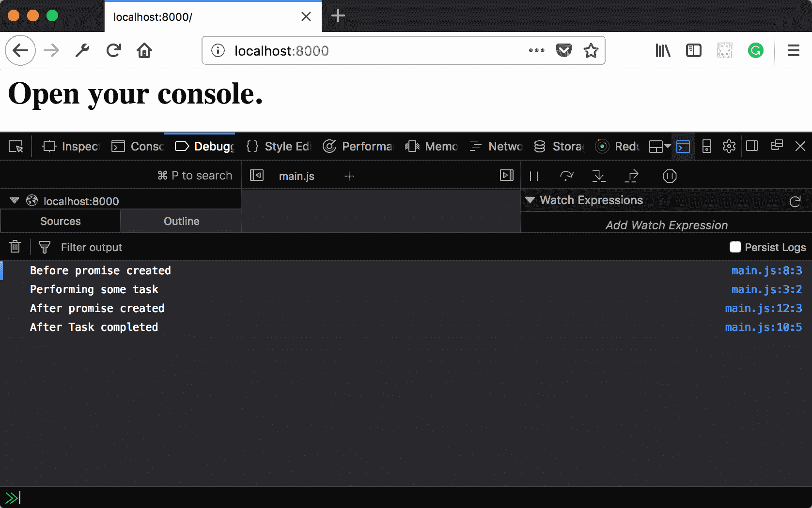
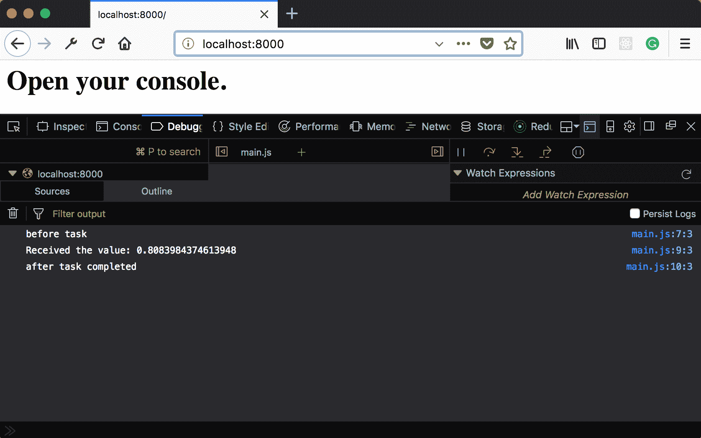
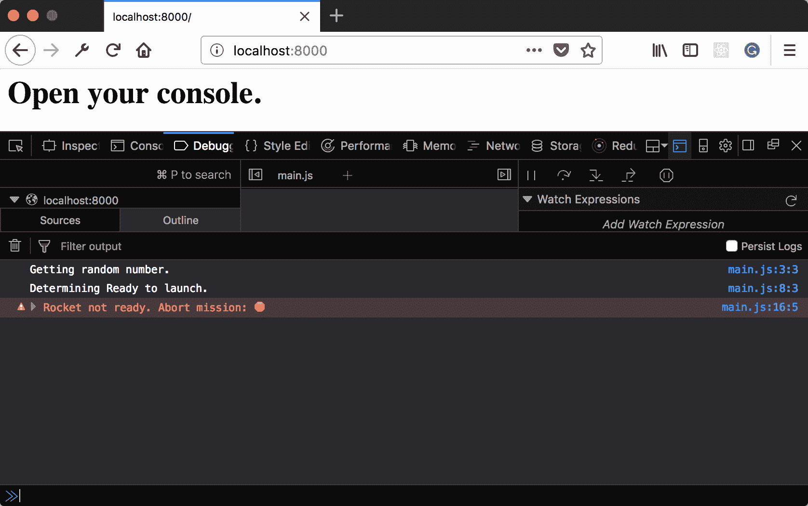
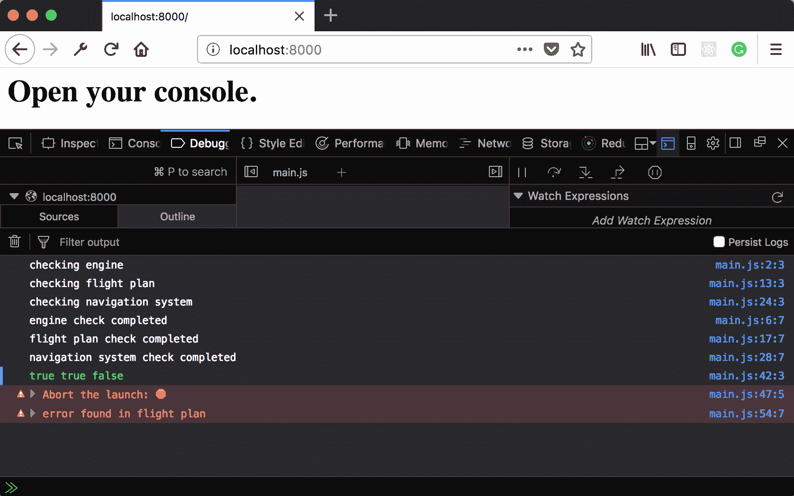
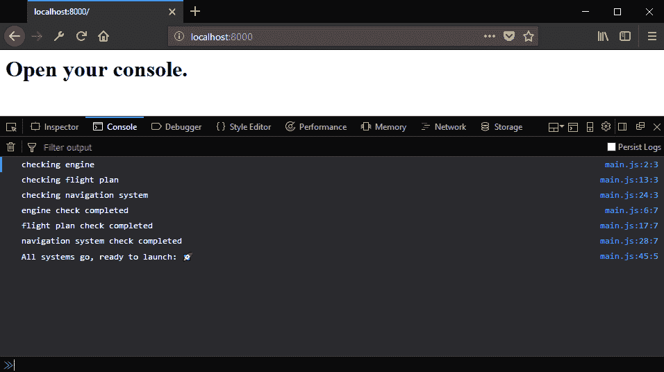
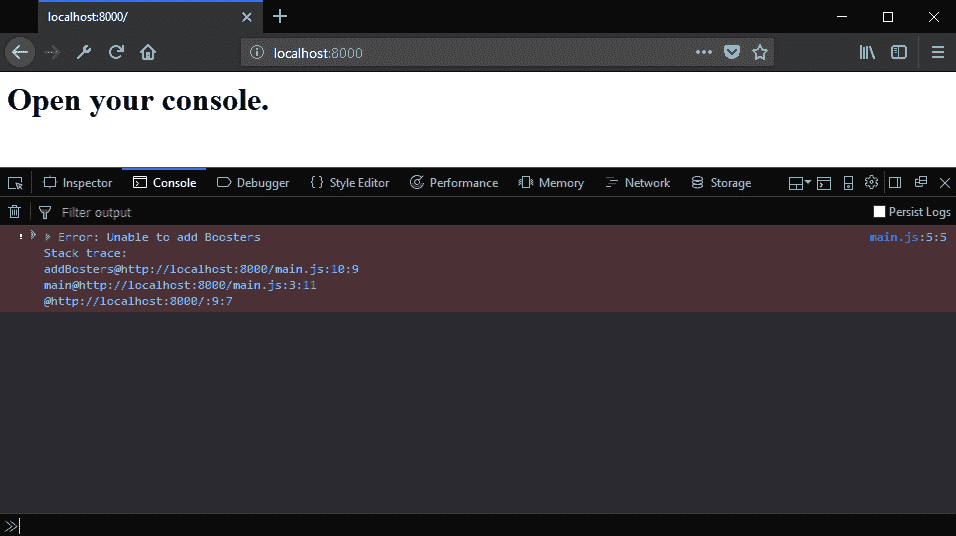
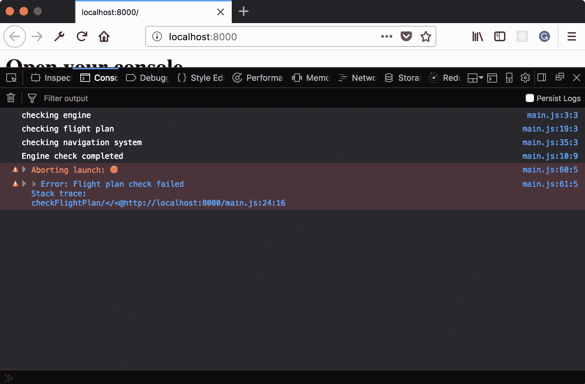
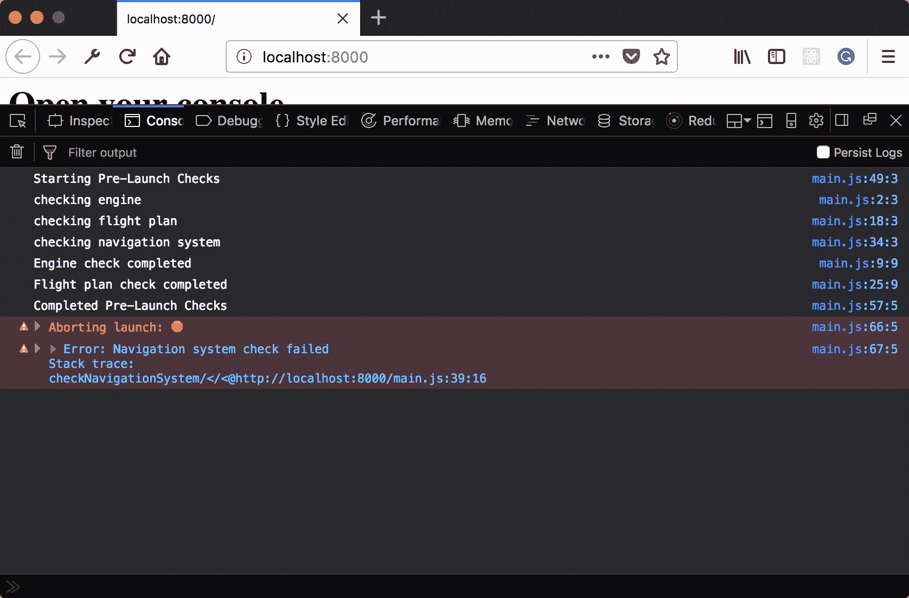

# 第四章：使用 async/await 和函数进行操作

在本章中，我们将介绍以下食谱：

+   使用异步函数创建 Promise

+   等待异步函数的结果

+   在 Promise 链中使用异步结果

+   等待一系列中的多个结果

+   并发等待多个结果

+   使用 `Promise.all` 收集异步结果数组

+   等待异步函数时处理错误

+   处理 `Promise.all` 内部抛出的错误

+   使用 `finally` 确保执行操作

# 简介

在上一章中，我们看到了 Promise 相比回调模式是一个巨大的改进。但我们还看到了在组合方面仍然存在一些粗糙的边缘。直接创建 Promise 需要不同的形状函数，这些函数被放置在链的后面。错误和成功的结果以不同的方式提供，这取决于 Promise 的创建方式。而且仍然有一些不便的嵌套。

`async` 和 `await` 操作符是在 ES8 中引入的。它们建立在 Promise 的基础上，使得处理和创建 Promise 更加流畅。在本章中，我们将看到如何使用 `async` 和 `await` 以更优雅的方式创建和处理 Promise。

# 使用异步函数创建 Promise

`async` 函数是创建和操作 Promise 的简单方法。在本食谱中，我们将看到这种基本形式。

# 准备工作

本食谱假设你已经有一个允许你在浏览器中创建和运行 ES 模块的 workspace。如果你没有，请参阅前两章。

# 如何做到这一点...

1.  打开你的命令行应用程序，导航到你的 workspace。

1.  创建一个名为 `04-01-creating-Promise-with-async` 的新文件夹。

1.  复制或创建一个 `index.html` 文件，该文件从 `main.js` 加载并运行一个 `main` 函数。

1.  创建一个包含名为 `someTask` 的 `async` 函数的 `main.js`：

```js
// main.js 
async function someTask () { 
   console.log('Performing some task'); 
} 
```

1.  创建一个调用 `someTask` 并在 `someTask` 执行前后记录信息的 `main`：

```js
export function main () { 
  console.log('before task'); 
  someTask(); 
  console.log('after task created'); 
}  
```

1.  在 `someTask` 上链式调用 `then` 并在回调函数中记录一条信息：

```js
export function main () { 
  console.log('Before Promise created'); 
  someTask().then(function () { 
    console.log('After Task completed'); 
  }); 
  console.log('After Promise created');}  
```

1.  启动你的 Python 网络服务器，并在你的浏览器中打开以下链接：`http://localhost:8000/`。

1.  你应该看到以下输出：



# 它是如何工作的...

`async` 关键字指示运行时该函数返回一个 Promise，而不是直接的结果。通过查看日志信息，你可以清楚地看到操作顺序。第一条信息是在调用 `async` 函数之前记录的。接下来，记录 `async` 函数内的信息。然后是调用 `async` 函数后的信息。最后，记录 `then` 回调函数内的信息。这个顺序与直接使用 Promise API 的代码中可看到的执行顺序相同。

之前的代码已经比直接创建承诺的代码有所改进。在接下来的示例中，我们将看到如何利用 `await` 从这些函数中检索结果，而不使用 Promise API。我们还将探讨其他情况下 `async` 函数如何比直接使用 Promise API 提供优势。

# 等待异步函数的结果

在上一个示例中，我们看到了如何使用 `async` 创建解析承诺的函数。然而，我们使用了 Promise API 的 `then` 回调来等待结果。在许多情况下，我们可以使用 `await` 关键字来等待这些值。这可以完成任务，但有一种更干净的方式来从异步函数中检索结果。

本示例演示了如何使用 `await` 来返回长时间运行操作的结果。

# 准备工作

本示例假设你已经有一个允许你在浏览器中创建和运行 ES 模块的 workspace。如果你没有，请参阅前两章。

# 如何操作...

1.  打开你的命令行应用程序并导航到你的工作区。

1.  创建一个名为 `4-02-await-async-results` 的新文件夹。

1.  复制或创建一个 `index.html` 文件，该文件加载并运行来自 `main.js` 的 `main` 函数。

1.  创建一个名为 `main.js` 的文件，其中包含一个名为 `getRandomNumber` 的 `async` 函数，该函数返回一个随机数：

```js
// main.js 
async function getRandomNumber () { 
   return Math.random(); 
} 
```

1.  创建一个名为 `main` 的 `async` 函数，该函数调用 `getRandomNumber`，等待结果，并输出值：

```js
export async function main () { 
  console.log('before task'); 
  const result = await getRandomNumber(); 
  console.log('Received the value: %s', result); 
  console.log('after task completed'); 
}  
```

1.  启动你的 Python 网络服务器并在浏览器中打开以下链接：

    `http://localhost:8000/`.

1.  你应该看到以下输出：



# 工作原理...

在 `async` 函数中使用 `await` 等同于在 Promise 链中使用 `then`。区别在于，结果不是作为回调函数的参数传递，而是作为表达式解析。这个表达式可以被分配给常量 `result`。然后，这个值就可以在整个块中使用，而不仅限于回调函数的体内。

这非常酷！以前从异步代码中获取结果需要使用回调和 Promise API 中的方法。现在，有了 `async` 和 `await` 关键字，我们可以编写无需嵌套的代码，这使得代码更容易阅读和理解，同时保持与 Promise API 的兼容性。

# 在 Promise 链中使用异步结果

在上一个示例中，我们看到了如何使用 `async` 和 `await` 来替换 Promise API 的一部分。然而，仍然会有一些情况下使用 Promise API 更为可取，无论是为了清晰度、结构还是逐步替换。

在本示例中，我们将看到 `async` 函数如何无缝地集成到 Promise 链中。

# 准备工作

本示例假设你已经有一个允许你在浏览器中创建和运行 ES 模块的 workspace。如果你没有，请参阅前两章。

# 如何操作...

1.  打开你的命令行应用程序并导航到你的工作区。

1.  创建一个名为 `04-03-async-function-Promise-chain` 的新文件夹。

1.  复制或创建一个 `index.html` 文件，该文件加载并运行来自 `main.js` 的 `main` 函数。

1.  创建一个名为 `getRandomNumber` 的 `async` 函数，它返回一个随机数：

```js
async function getRandomNumber() { 
  console.log('Getting random number.'); 
  return Math.random(); 
} 
```

1.  创建一个名为 `determinReadyToLaunch` 的 `async` 函数，如果其第一个参数大于 `0.5`，则返回 `true`：

```js
async function deteremineReadyToLaunch(percentage) { 
  console.log('Determining Ready to launch.'); 
  return Math.random() > 0.5; 
}  
```

1.  创建一个名为 `reportResults` 的第三个 `async` 函数，如果其第一个参数是 `true` 或 `false`，则输出不同的结果：

```js
async function reportResults(isReadyToLaunch) { 
  if (isReadyToLaunch) { 
    console.log('Rocket ready to launch. Initiate countdown: '); 
  } else { 
    console.error('Rocket not ready. Abort mission: '); 
  } 
}  
```

1.  创建一个 `main` 函数，调用 `getRandomNumber`，并创建一个 Promise 链来依次调用 `determineReadyToLaunch` 和 `reportResults`：

```js
export function main() { 
  console.log('Before Promise created'); 
  getRandomNumber() 
    .then(deteremineReadyToLaunch) 
    .then(reportResults) 
  console.log('After Promise created'); 
}   
```

1.  启动你的 Python 网络服务器并在浏览器中打开以下链接：`http://localhost:8000/`。

1.  你应该看到以下输出：


# 它是如何工作的...

如前所述，`async` 函数使用 Promise 解析其结果，而不是直接返回一个值。这意味着，无论 `async` 函数是用于启动还是继续 Promise 链，其形状都可以是相同的。

# 还有更多...

事实上，因为结果总是通过 Promise 解析，所以可以使用 `Promise.all` 将 `async` 函数作为一个组来解析。你可以看到使用 `Promise.all` 将 `async` 函数及其结果连接的示例：

```js
async function checkEngines(threshold = 0.9) { 
  return Math.random() < threshold; 
} 

async function checkFlightPlan(threshold = 0.9) { 
  return Math.random() < threshold; 
} 

async function checkNavigationSystem(threshold = 0.9) { 
  return Math.random() < threshold; 
} 

Promise.all([ 
    checkEngines(), 
    checkFlightPlan(0.5), 
    checkNavigationSystem(0.75) 
]).then(function([enginesOk, flighPlanOk, navigationOk]) { 
  if (enginesOk) { 
    console.log('engines ready to go'); 
  } else { 
    console.error('engines not ready'); 
  } 

  if (flighPlanOk) { 
    console.log('flight plan good to go'); 
  } else { 
    console.error('error found in flight plan'); 
  } 

  if (navigationOk) { 
    console.log('navigation systems good to go'); 
  } else { 
    console.error('error found in navigation systems'); 
  } 
}) 
```

上述代码按预期工作。函数甚至可以直接使用参数调用，而无需将它们包裹在 `Promise.resolve` 的调用中。

# 系列中等待多个结果

有时候有必要按顺序安排异步操作。在之前的菜谱中，我们看到了如何使用 `Promise.then` 来做这件事。在这个菜谱中，我们将看到如何使用 `await` 操作符来完成同样的任务。

# 准备工作

本菜谱假设你已经有一个工作区，允许你在浏览器中创建和运行 ES 模块。如果你没有，请参阅前两章。

# 如何操作...

1.  打开你的命令行应用程序并导航到你的工作区。

1.  创建一个名为 `04-03-async-function-Promise-chain` 的新文件夹。

1.  复制或创建一个 `index.html` 文件，该文件加载并运行来自 `main.js` 的 `main` 函数。

1.  创建一个 `async` 函数，名为 `getRandomNumber`，它返回一个随机数：

```js
async function getRandomNumber() { 
  console.log('Getting random number.'); 
  return Math.random(); 
} 
```

1.  创建一个名为 `determineReadyToLaunch` 的 `async` 函数，如果其第一个参数大于 `0.5`，则返回 `true`：

```js
async function deteremineReadyToLaunch(percentage) { 
  console.log('Determining Ready to launch.'); 
  return Math.random() > 0.5; 
} 
```

1.  创建第三个 `async` 函数，名为 `reportResults`，如果它的第一个参数是 `true` 或 `false`，则输出不同的结果：

```js
async function reportResults(isReadyToLaunch) { 
  if (isReadyToLaunch) { 
    console.log('Rocket ready to launch. Initiate countdown: '); 
  } else { 
    console.error('Rocket not ready. Abort mission: '); 
  } 
}  
```

1.  创建一个 `main` 函数，调用 `getRandomNumber`，等待结果，将其传递给 `determineReadyToLaunch`，并在等待启动准备就绪后调用 `reportResults`：

```js
export async function main() { 
  const randomNumber = await getRandomNumber();
  const ready = await deteremineReadyToLaunch(randomNumber);
  await reportResults(ready); 
}  
```

1.  启动你的 Python 网络服务器并在浏览器中打开以下链接：

    `http://localhost:8000/`。

1.  你应该看到以下输出：



# 它是如何工作的...

因为我们的`main`函数被标记为`async`，所以我们能够在它的主体中使用`await`运算符。这个运算符使得函数等待表达式解析的结果。在我们的例子中，这意味着我们调用的`async`函数创建的 Promise 得到了满足。

一旦结果得到满足，控制流将继续到下一个语句。如果我们没有使用`await`运算符，`randomNumber`的值将是一个承诺，它将解析为返回的值。我们可以使用承诺接口来处理这个问题，但由于我们使用了`await`，我们能够编写出更类似于同步代码的代码。

# 参见

+   *同时等待多个结果*

# 同时等待多个结果

有时可以同时启动多个异步操作。这可能是有益的，例如，如果需要多个网络请求来获取给定页面的所有数据。在开始下一个请求之前等待每个请求完成会浪费时间。

在这个配方中，我们将看到如何使用`await`来并发地启动和等待多个结果。

# 准备工作

这个配方假设你已经有一个工作区，允许你在浏览器中创建和运行 ES 模块。如果你没有，请参阅前两章。

# 如何做...

1.  打开你的命令行应用程序，导航到你的工作区。

1.  创建一个名为`04-05-await-concurrently`的新文件夹。

1.  创建三个函数，`checkEngines`、`checkFlightPlan`和`checkNavigationSystem`，当它们开始时记录一条消息，并在某些超时后返回一个解析为`true`的`Promise`，如果随机数高于阈值：

```js
function checkEngines() { 
  console.log('checking engine'); 

  return new Promise(function (resolve) { 
    setTimeout(function() { 
      console.log('engine check completed'); 
      resolve(Math.random() < 0.9) 
    }, 250) 
  }); 
} 

function checkFlightPlan() { 
  console.log('checking flight plan'); 

  return new Promise(function (resolve) { 
    setTimeout(function() { 
      console.log('flight plan check completed'); 
      resolve(Math.random() < 0.9) 
    }, 350) 
  }); 
} 

function checkNavigationSystem() { 
  console.log('checking navigation system'); 

  return new Promise(function (resolve) { 
    setTimeout(function() { 
      console.log('navigation system check completed'); 
      resolve(Math.random() < 0.9) 
    }, 450) 
  }); 
}  
```

1.  创建一个`async`作为`main`函数，该函数调用之前步骤中创建的每个函数。将每个函数返回的值分配给一个局部变量。然后等待 Promise 的结果，并输出结果：

```js
  export async function main() { 
  const enginePromise = checkEngines(); 
  const flighPlanPromise = checkFlightPlan(0.5); 
  const navSystemPromise = checkNavigationSystem(0.75); 

  const enginesOk = await enginePromise; 
  const flighPlanOk = await flighPlanPromise; 
  const navigationOk = await navSystemPromise; 

  if (enginesOk && flighPlanOk && navigationOk) { 
    console.log('All systems go, ready to launch: '); 
  } else { 
    console.error('Abort the launch: '); 

    if (!enginesOk) { 
      console.error('engines not ready'); 
    } 

    if (flighPlanOk) { 
      console.error('error found in flight plan'); 
    } 

    if (navigationOk) { 
      console.error('error found in navigation systems'); 
    } 
  } 
} 
```

1.  启动你的 Python 网络服务器，并在你的浏览器中打开以下链接：

    `http://localhost:8000/`.

1.  你应该看到以下输出：



# 它是如何工作的...

你将在输出中看到`checking`消息立即被记录。因为所有函数都是在第一次`await`使用之前被调用的，所以操作是在`await`时启动的。这允许在任何一个完成之前，所有超时都开始。

一旦使用`await`，`main`函数将阻塞，直到结果解析。代码再次同步。每个函数的结果按顺序解析，但代码的长时间运行部分（`setTimeout`）是并发的。

由于我们使用了`setTimeout`，三个检查函数必须手动返回 Promise。因为这个函数使用回调，所以我们不能使用`async`/`await`。

# 使用 Promise.all 收集异步结果数组

在之前的菜谱中，我们看到了如何在等待结果之前触发多个异步函数。我们也看到了 Promise API 和 `asyc`/`await` 操作符是如何一起工作的。在某些情况下，使用 Promise API 是更可取的。

在这个菜谱中，我们将看到如何使用 `Promise.all` 来收集多个异步操作的结果。

# 准备工作

这个菜谱假设你已经有一个工作区，允许你在浏览器中创建和运行 ES 模块。如果你没有，请参阅前两章。

# 如何做到...

1.  打开你的命令行应用程序，导航到你的工作区。

1.  创建一个名为 `04-06-Promise-all-collect-concurrently` 的新文件夹。

1.  创建三个函数，`checkEngines`、`checkFlightPlan` 和 `checkNavigationSystem`，当它们开始时记录一条消息，并在某些超时后返回一个解析为 `true` 的 `Promise`，如果随机数高于阈值：

```js
function checkEngines() { 
  console.log('checking engine'); 

  return new Promise(function (resolve) { 
    setTimeout(function() { 
      console.log('engine check completed'); 
      resolve(Math.random() < 0.9) 
    }, 250) 
  }); 
} 

function checkFlightPlan() { 
  console.log('checking flight plan'); 

  return new Promise(function (resolve) { 
    setTimeout(function() { 
      console.log('flight plan check completed'); 
      resolve(Math.random() < 0.9) 
    }, 350) 
  }); 
} 

function checkNavigationSystem() { 
  console.log('checking navigation system'); 

  return new Promise(function (resolve) { 
    setTimeout(function() { 
      console.log('navigation system check completed'); 
      resolve(Math.random() < 0.9) 
    }, 450) 
  }); 
}  
```

1.  创建一个 `async` 作为 `main` 函数，调用之前步骤中创建的每个函数。使用 `Promise.all` 收集结果，将结果缩减为一个单一的 ok to launch 值，并记录结果：

```js
export async function main() { 
  const prelaunchChecks = [ 
    checkEngines(), 
    checkFlightPlan(0.5), 
    checkNavigationSystem(0.75) 
  ]; 

  const checkResults = await Promise.all(prelaunchChecks); 
  const readyToLaunch = checkResults.reduce((acc, curr) => acc && 
  curr); 

  if (readyToLaunch) { 
    console.log('All systems go, ready to launch: '); 
  } else { 
    console.error('Something went wrong, abort the launch: '); 
  } 
} 
```

1.  启动你的 Python 网络服务器，并在你的浏览器中打开以下链接：

    `http://localhost:8000/`。

1.  你应该看到以下输出：



# 它是如何工作的...

`Promise.all` 返回一个解析为从多个值解析出的值的数组的一个 Promise。在我们的情况下，这些是我们创建在 *步骤 3* 中的异步函数。一旦创建了该 Promise，我们就可以等待结果。

一旦我们得到这个结果，我们可以使用 `Array.prototype.reduce` 方法来创建一个单一的布尔值，这个值可以用在条件语句中。

如果我们将这个菜谱与之前的菜谱进行比较，我们可以看到优势。添加另一个预启动检查就像向函数数组中添加另一个异步函数一样简单。实际上，我们不需要提前知道需要执行多少预启动检查。如果它们都解析为布尔值，它们将与 `Promise.all` 一起工作。我们失去了关于哪个步骤失败的信息，但我们将看到在未来的菜谱中如何通过错误处理来恢复这些信息。

# 更多...

有可能重构 `main` 函数，使得预检查函数可以隐式执行。我们可以使用 `Array.prototype.map` 函数来完成这个任务：

```js
 export async function main() { 
  const prelaunchChecks = [ 
    checkEngines, 
    checkFlightPlan, 
    checkNavigationSystem 
  ]; 
 const checkResults = await Promise.all(prelaunchChecks.map((check) => 
  check()); 
  const readyToLaunch = checkResults.reduce((acc, curr) => acc && 
  curr); 

  if (readyToLaunch) { 
    console.log('All systems go, ready to launch: '); 
  } else { 
    console.error('Something went wrong, abort the launch: '); 
  } 

```

突出的部分显示了异步函数是在 map 中调用的。

# 参见

+   使用 `Array.reduce` 转换数据

+   *处理 `Promise.all` 内部抛出的错误*

# 等待异步函数时处理错误

到目前为止，在本章中，我们看到了如何处理成功完成的 `async` 函数。但是，正如我们所知，这并不总是情况。我们需要能够处理异步函数或它们调用的任何函数抛出的错误。

在这个菜谱中，我们将看到 `try-catch` 块如何处理由 `async` 函数抛出的错误。

# 准备工作

这个菜谱假设你已经有一个工作区，允许你在浏览器中创建和运行 ES 模块。如果你没有，请参阅前两章。

# 如何做...

1.  打开你的命令行应用程序并导航到你的工作区。

1.  创建一个名为 `4-07- async-errors-try-catch` 的新文件夹。

1.  复制或创建一个 `index.html`，它从 `main.js` 加载并运行一个 `main` 函数。

1.  创建一个 `async` 函数，`addBoosters`，它抛出一些错误：

```js
async function addBoosters() { 
  throw new Error('Unable to add Boosters'); 
} 
```

1.  创建一个 `async` 函数，`performGuidanceDiagnostic`，它也会抛出错误：

```js
async function performGuidanceDiagnostic (rocket) { 
  throw new Error('Unable to finish guidance diagnostic')); 
} 
```

1.  创建一个 `async` 作为 `main` 函数，该函数调用 `addBosters` 和 `performGuidanceDiagnostic` 并处理错误：

```js
 export async function main() { 
    console.log('Before Check'); 

  try { 
    await addBosters(); 
    await performGuidanceDiagnostic(); 
  } catch (e) { 
    console.error(e); 
  } 
} 

  console.log('After Check'); 
```

1.  启动你的 Python 网络服务器并在浏览器中打开以下链接：`http://localhost:8000/`。

1.  你应该看到以下输出：



# 它是如何工作的...

当我们从异步函数等待一个以错误状态满足的结果时，会抛出一个错误。为了继续程序，我们需要捕获这个错误。在前面的菜谱中，第一个异步函数抛出错误，因此第二个操作没有执行，然后在退出 `try-catch` 块之前将错误记录到控制台。

这与 Promise 链错误处理相比有优势，它使用与同步代码相同的 `try-catch` 机制来处理错误。我们不需要将同步代码包装在承诺中，以便它们可以与 `Promise.catch` 一起工作；我们可以使用语言级别的 `try-catch` 块。

在下一个菜谱中，我们将看到 `try-catch` 如何与多个并发操作的多异步操作一起工作。

# 处理 `Promise.all` 内抛出的错误

在先前的菜谱中，我们看到了如何使用 `Promise.all` 来收集多个异步函数的结果。在错误状态下，`Promise.all` 更加有趣。通常，当我们处理多个可能错误条件时，如果我们想显示多个错误消息，我们必须编写布尔逻辑日志。但在本菜谱中，我们将看到如何使用 `Promise.all` 和 `try-catch` 块来同时处理多个错误条件，而不需要复杂的布尔逻辑。

# 准备中

这个菜谱假设你已经有一个工作区，允许你在浏览器中创建和运行 ES 模块。如果你没有，请参阅前两章。

# 如何做...

1.  打开你的命令行应用程序并导航到你的工作区。

1.  创建一个名为 `04-06-Promise-all-collect-concurrently` 的新文件夹。

1.  创建三个 `async` 函数，`checkEngines`、`checkFlightPlan` 和 `checkNavigationSystem`，当它们开始时记录一条消息，如果随机数高于阈值则返回一个拒绝错误的 `Promise`，或者在超时后解析：

```js
function checkEngines() { 
  console.log('checking engine'); 

  return new Promise(function (resolve, reject) { 
    setTimeout(function () { 
      if (Math.random() > 0.5) { 
        reject(new Error('Engine check failed')); 
      } else { 
        console.log('Engine check completed'); 
        resolve(); 
      } 
    }, 250) 
  }); 
} 

function checkFlightPlan() { 
  console.log('checking flight plan'); 

  return new Promise(function (resolve, reject) { 
    setTimeout(function () { 
      if (Math.random() > 0.5) { 
        reject(new Error('Flight plan check failed')); 
      } else { 
        console.log('Flight plan check completed'); 
        resolve(); 
      } 
    }, 350) 
  }); 
} 

function checkNavigationSystem() { 
  console.log('checking navigation system'); 

  return new Promise(function (resolve, reject) { 
    setTimeout(function () { 
      if (Math.random() > 0.5) { 
        reject(new Error('Navigation system check failed')); 
      } else { 
        console.log('Navigation system check completed'); 
        resolve(); 
      } 
    }, 450) 
  }); 
} 

```

1.  创建一个 `async` 作为 `main` 函数，该函数调用上一步创建的每个函数。等待结果，并捕获并记录抛出的任何错误。如果没有错误抛出，则记录成功：

```js
 export async function main() { 
  try { 
    const prelaunchChecks = [ 
      checkEngines, 
      checkFlightPlan, 
      checkNavigationSystem 
    ]; 
    await Promise.all(prelauchCheck.map((check) => check()); 
; 
    console.log('All systems go, ready to launch: '); 
  } catch (e) { 
    console.error('Aborting launch: '); 
    console.error(e); 
  } 
   }    
```

1.  启动你的 Python 网络服务器并在浏览器中打开以下链接：`http://localhost:8000/`.

1.  你应该看到以下输出：



# 它是如何工作的...

正如我们之前看到的，`Promise.all`返回一个解析为多个值数组的 Promise，并且当它们被解析时我们可以`await`这些值。当我们`await`一个在错误状态下解析的 Promise 时，会抛出一个异常。

前面代码有趣的地方在于三个异步承诺正在并发执行。如果其中之一或多个以错误状态完成，那么将抛出一个或多个错误。

你会注意到只有一个错误被捕获并记录。与同步代码一样，我们的代码可能抛出多个错误，但只有一个是被`catch`块捕获并记录的。

# 使用`finally`确保操作执行

错误处理可能相当复杂。可能存在你想要允许错误继续向上冒泡到调用堆栈以在更高级别处理的情况。在这些情况下，你可能还需要执行一些清理任务。通常这意味着重置一些共享资源，但也可能是简单地记录应用程序的当前状态。

在这个菜谱中，我们将看到如何使用`finally`来确保某些代码无论错误状态如何都会被执行。

# 准备工作

这个菜谱假设你已经有一个工作区，允许你在浏览器中创建和运行 ES 模块。如果你没有，请参阅前两章。

# 如何做...

1.  打开你的命令行应用程序并导航到你的工作区。

1.  创建一个名为`04-06-Promise-all-collect-concurrently`的新文件夹。

1.  创建三个`async`函数，`checkEngines`、`checkFlightPlan`和`checkNavigationSystem`，当它们开始时记录一条消息，并返回一个`Promise`，如果随机数高于阈值则拒绝错误，或者在超时后解析：

```js
 function checkEngines() { 
  console.log('checking engine'); 

  return new Promise(function (resolve, reject) { 
    setTimeout(function () { 
      if (Math.random() > 0.5) { 
        reject(new Error('Engine check failed')); 
      } else { 
        console.log('Engine check completed'); 
        resolve(); 
      } 
    }, 250) 
  }); 
} 

function checkFlightPlan() { 
  console.log('checking flight plan'); 

  return new Promise(function (resolve, reject) { 
    setTimeout(function () { 
      if (Math.random() > 0.5) { 
        reject(new Error('Flight plan check failed')); 
      } else { 
        console.log('Flight plan check completed'); 
        resolve(); 
      } 
    }, 350) 
  }); 
} 

function checkNavigationSystem() { 
  console.log('checking navigation system'); 

  return new Promise(function (resolve, reject) { 
    setTimeout(function () { 
      if (Math.random() > 0.5) { 
        reject(new Error('Navigation system check failed')); 
      } else { 
        console.log('Navigation system check completed'); 
        resolve(); 
      } 
    }, 450) 
  }); 
}  
```

1.  创建一个`asyncperformCheck`函数，调用之前步骤中创建的每个函数。等待结果，并使用`finally`记录一条完整的消息：

```js
async function performChecks() { 
  console.log('Starting Pre-Launch Checks'); 
  try { 
    const prelaunchChecks = [ 
      checkEngines, 
      checkFlightPlan, 
      checkNavigationSystem 
    ]; 

    return Promise.all(prelauchCheck.map((check) => check()); 

  } finally { 
    console.log('Completed Pre-Launch Checks'); 
  } 
   }  
```

1.  创建一个`async`作为`main`函数，调用`performCheck`函数。等待结果，使用`try-catch`处理任何错误，并记录发射是否可以继续：

```js
export async function main() { 
  try { 
    await performChecks(); 
    console.log('All systems go, ready to launch: '); 
  } catch (e) { 
    console.error('Aborting launch: '); 
    console.error(e); 
  } 
   }  
```

1.  启动你的 Python 网络服务器并在浏览器中打开以下链接：

    `http://localhost:8000/`.

1.  你应该看到以下输出：



# 它是如何工作的...

正如前面的菜谱中所示，错误被`main`函数捕获，并显示发射继续或中止的消息。在这个菜谱中，我们将`check`函数组合成一个单独的异步函数`performChecks`，这样我们就可以知道它们何时全部完成。

因为`performChecks`在等待的 Promise 结果上没有`catch`块，所以调用堆栈中较低级别的错误会冒泡到`main`函数。然而，`finally`块确保有一个消息让我们知道`performChecks`已经完成。

你可以想象这个组织可以扩展到包含多个层级和其他运营分支。在大型程序中处理错误是一项重要任务，而`async`/`await`允许我们使用`try-catch`块以相同的方式处理异步和同步代码中的错误。
