# 第五章：Web Workers、共享内存和 Atomics

在本章中，我们将涵盖以下食谱：

+   使用 Web Workers 在单独的线程上执行工作

+   向 Web Workers 发送和接收消息

+   向 Web Workers 发送数据

+   使用 terminate 停止工作线程

+   创建 SharedArrayBuffer

+   将 SharedArrayBuffer 发送到 Web Worker

+   从多个 Web Workers 读取 SharedArray

+   使用 Atomics 协调共享内存的使用

+   使用承诺为工作提供一个简单的接口

# 简介

每天 JavaScript 和 Web 应用程序的能力和期望都在不断扩大。这种扩展最令人兴奋的领域之一是并行编程，它与异步和并发编程相关，但并不相同。并行编程允许同时进行多个操作，而不是交错进行。

这种区别可能看起来很小，但意义重大。在本章中，我们将探讨如何使用网络平台上的工具来创建并行执行程序。我们将使用 Web Workers 来创建并行任务，`SharedMemoryBuffer` 来共享信息，以及 Atomic API 来协调它们之间的工作。

# 在 Firefox 中启用 SharedArrayBuffers

2018 年初，发现了 Spectre 和 Meltdown 漏洞。作为回应，浏览器制造商默认禁用了 `SharedArrayBuffer`。本章中的一些食谱需要此功能。本食谱演示了如何在 Firefox 中启用它们。

# 准备工作

本食谱假设您已安装了最新版本的 Firefox。

# 如何操作...

1.  打开 Firefox。

1.  导航到 `about:config`。

1.  点击“我接受风险！”

1.  搜索“shared”。

1.  双击 `javascript.options.shared_memory`。

1.  此选项现在应具有值 true：

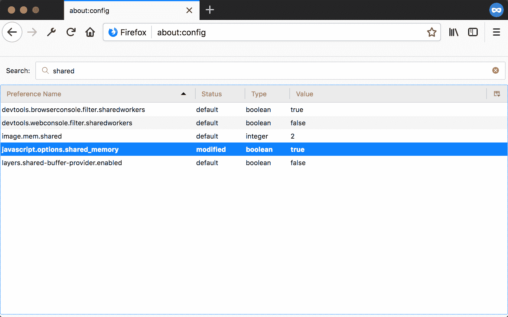

# 如何工作...

默认情况下，Firefox 中禁用了共享内存，但选项允许开发者在不向普通用户暴露的情况下激活这些（可能不安全）的功能。您可以在以下链接中了解更多关于 Meltdown 和 Spectre 的信息：

[`meltdownattack.com/`](https://meltdownattack.com/).

在您完成实验后，不应保留此功能启用。

# 在 Chrome 中启用 SharedArrayBuffers

2018 年初，发现了 Spectre 和 Meltdown 漏洞。作为回应，浏览器制造商默认禁用了 `SharedArrayBuffer`。本章中的一些食谱需要此功能。本食谱演示了如何在 Chrome 中启用它们。

# 准备工作

本食谱假设您已安装了最新版本的 Chrome。

# 如何操作...

1.  打开 Chrome。

1.  导航到 `chrome://flags/`。

1.  点击“我接受风险！”

1.  搜索“shared”。

1.  将选项“实验性启用 JavaScript 中的 SharedArrayBuffer 支持”设置为“启用”。

1.  点击“立即重新启动”：

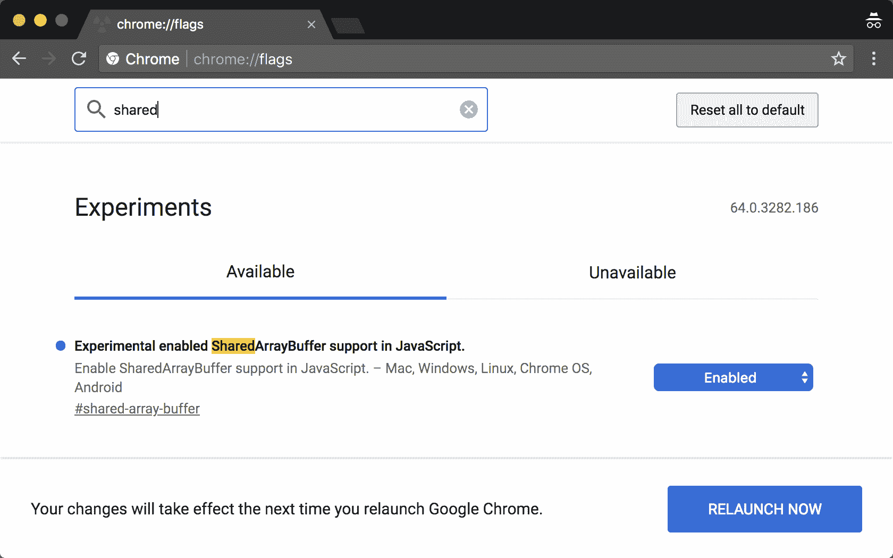

# 如何工作...

默认情况下，Firefox 中禁用了共享内存，但选项允许开发者在不向普通用户暴露的情况下激活这些（可能不安全）功能。你可以在以下位置了解更多关于 Meltdown 和 Spectre 的信息：

[`meltdownattack.com/`](https://meltdownattack.com/).

在你完成实验后，不应启用此功能。

# 使用 Web Workers 在单独的线程上执行工作

Web Workers 允许浏览器操作在主线程之外进行。一旦创建，线程间的通信通过传递消息来实现。在这个示例中，我们将看到如何创建一个非常简单的工作者，并从主线程向其发送消息。

# 准备工作

这个示例假设你已经有一个工作区，允许你在浏览器中创建和运行 ES 模块。如果你没有，请参阅前两章。

# 如何操作...

1.  打开你的命令行应用程序并导航到你的工作区。

1.  创建一个名为`05-01-performing-work-with-web-workers`的新文件夹。

1.  复制或创建一个名为`index.html`的文件，该文件加载并运行来自`main.js`的`main`函数。

1.  创建一个包含`main`函数的`main.js`文件，该函数从一个名为`worker.js`的文件创建工作者。然后向`worker`发送一个类型为`hello-message`的消息：

```js
// main.js 
export function main() {  
  console.log('Hello, from main.'); 
  const worker = new Worker('./worker.js'); 
  worker.postMessage({ type: 'hello-message' }); 
}  
```

1.  创建一个名为`worker.js`的文件，该文件记录一个`Hello`消息：

```js
// worker.js 
console.log('Hello, from the worker.');  
```

1.  在`worker.js`文件中，在全局作用域上设置`onmessage`回调函数。这个函数应该记录接收到的消息的类型：

```js
// worker.js 
console.log('Hello, from the worker.'); 

this.onmessage = function (message) {
 console.log('Message Recieved: (%s)', message.data.type); }
```

1.  启动你的 Python 网络服务器并在浏览器中打开以下链接：

    `http://localhost:8000/`.

1.  你应该看到以下输出显示：

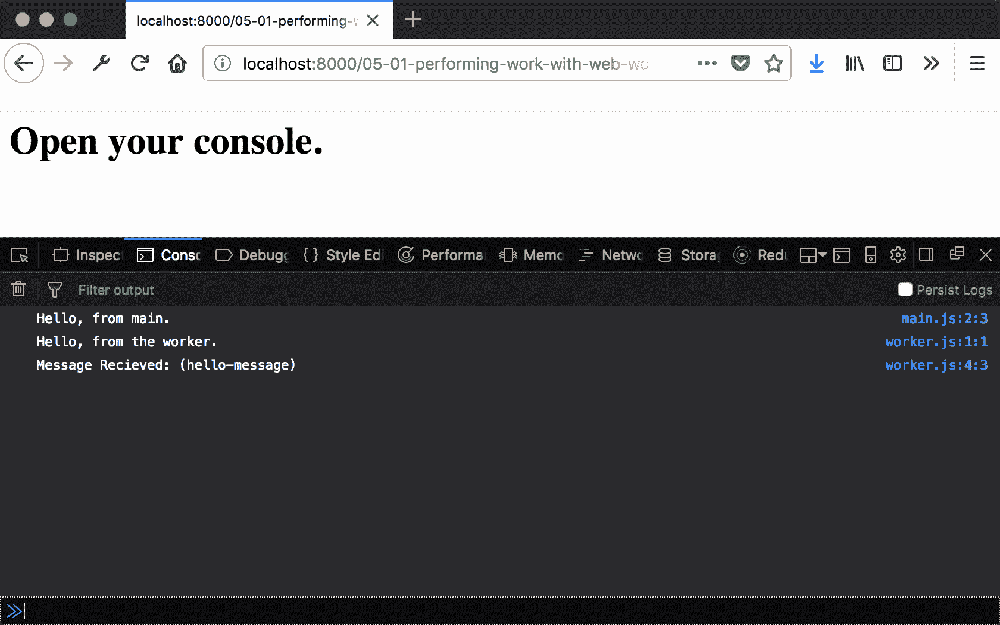

# 工作原理...

使用名为工作文件名的工作者名称创建工作者将在新线程上创建一个工作者。通过在工作者全局上下文中设置`onmessage`事件监听器，我们能够从主线程接收消息。

创建工作者后，`main`函数可以使用该引用向新工作者发送消息。`postMessage`方法的参数作为接收到的`message`属性的`data`属性传递给工作者。

# 向 Web Workers 发送和接收消息

在前面的示例中，我们看到了如何创建并向后台线程上的工作者发送消息。这非常棒！在 Web Workers 之前引入之前，JavaScript 无法与主线程以外的任何东西一起工作。然而，如果我们无法获取任何信息，这并不是很有用。

在这个示例中，我们将看到如何等待 Web Worker 的响应，并从 Web Worker 发送响应。

# 准备工作

这个示例假设你已经有一个工作区，允许你在浏览器中创建和运行 ES 模块。如果你没有，请参阅前两章。

# 如何操作...

1.  打开你的命令行应用程序并导航到你的工作区。

1.  创建一个名为`05-02-send-messages-to-and-from-web-workers`的新文件夹。

1.  复制或创建一个名为`index.html`的文件，该文件加载并运行来自`main.js`的`main`函数。

1.  创建一个名为 `main.js` 的文件，其中包含一个名为 `onMessage` 的函数，该函数接受一个名为 `message` 的参数并输出 `type` 和 `index` 属性：

```js
// main.js 
function onMessage(message) { 
  const { type, index } = message.data; 
  console.log('Main recieved a messge (%s) from index: (%s)',  
              type, index); 
}  
```

1.  设置 `WORKER_COUNT` 常量：

```js
// main.js 
const WORKER_COUNT = 5; 
```

1.  创建一个 `main` 函数，该函数创建 `WORKER_COUNT` 个工作器，设置 `onMessage` 属性，并将 `index` 发送到工作器：

```js
export function main() { 
  for (let index = 0; index < WORKER_COUNT; index++) { 
    const worker = new Worker('./worker.js'); 

    worker.onmessage = onMessage; 
    worker.postMessage({ type: 'ping', index }); 
  } 
}  
```

1.  创建一个 `worker.js` 文件，将当前上下文分配为 `global` 常量：

```js
// worker.js 
const global = this;  
```

1.  在全局上下文中将 `onmessage` 事件监听器设置为 `global`。该函数应接受一个消息参数并输出 `index` 和 `type` 属性。然后它应该调用 `global.postMessage` 并传递其 `index`：

```js
// worker.js 
global.onmessage = (message) => { 
  const { type, index } = message.data; 
  console.log('Worker (%s) recieved a messge (%s)', index, type); 

  global.postMessage({ index, type: 'pong' }) 
  global.postMessage({ index, type: 'another-type' }) 
}; 
```

1.  启动你的 Python 网络服务器并在浏览器中打开以下链接：

    `http://localhost:8000/`。

1.  你应该看到以下输出显示：

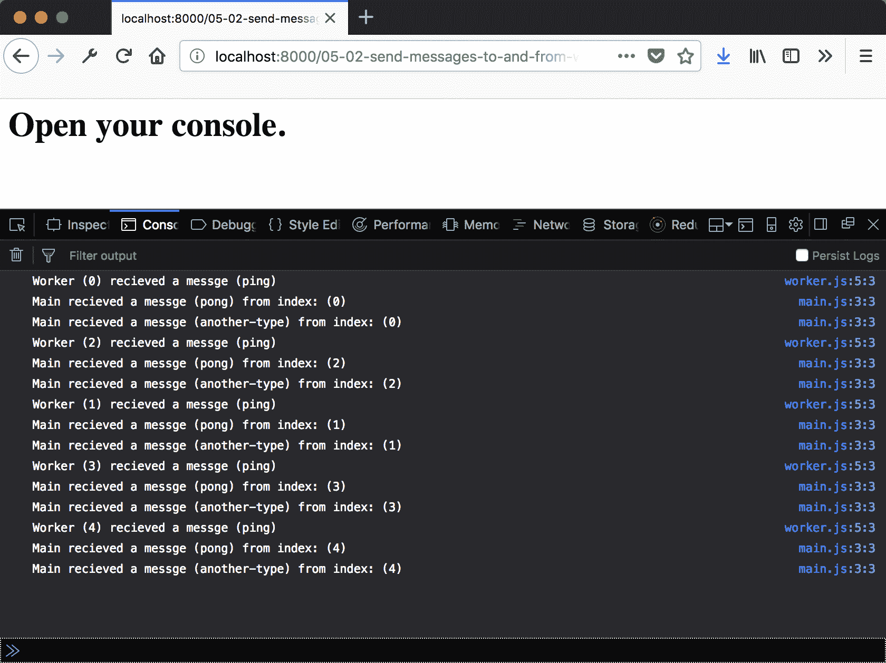

# 它是如何工作的...

我们已经看到如何使用 `onmessage` 监听器来监听从主线程发布的消息。现在我们可以看到，当在 `main` 函数中的工作器引用上绑定时，相同的监听器可以监听来自工作器的消息。我们还可以看到，这个监听器与被引用的个别工作器是隔离的。每个工作器都有一个独特的事件监听器；这对于组织工作器之间的通信很有用。

# 向 Web Worker 发送数据

现在我们已经看到如何发送和接收消息，我们可以开始真正使用这些 Web Workers。在这个配方中，我们将看到你可以向 Web Worker 发送和接收数据。

# 准备工作

此配方假设你已经有了一个工作区，允许你在浏览器中创建和运行 ES 模块。如果没有，请参阅前两章。

# 如何操作...

1.  打开你的命令行应用程序并导航到你的工作区。

1.  创建一个名为 `05-03-send-data-to-and-from-web-workers` 的新文件夹。

1.  复制或创建一个 `index.html` 文件，该文件加载并运行来自 `main.js` 的 `main` 函数。

1.  创建一个名为 `main.js` 的文件，其中包含一个名为 `onMessage` 的函数，该函数接受一个名为 `message` 的参数并输出 `type` 和 `index` 属性：

```js
// main.js 
function onMessage(message) { 
  const { result, type } = message.data; 
  console.log('Result for operation (%s): (%s)', type, result); 
}  
```

1.  创建一个 `main` 函数，该函数创建一个工作器，设置 `onMessage` 属性，创建一个随机数字数组，并向工作器发送两条消息，一条用于求和某些数字，另一条用于计算平均值：

```js
export function main() { 
  const worker = new Worker('./worker.js'); 
  worker.onmessage = onMessage; 

  const numbers = (new Array(100)).fill().map(Math.random) 
  worker.postMessage({ type: 'average', numbers}); 
}  
```

1.  创建一个 `worker.js` 文件，将当前上下文分配为 `global` 常量：

```js
// worker.js 
const global = this; 
```

1.  在 `global` 上设置 `onmessage` 事件监听器，该函数应接受一个消息参数并对 `message.data` 的 `numbers` 属性执行求和或平均操作：

```js
// worker.js 
global.onmessage = (message) => { 
  const { type, numbers } = message.data; 

  switch (type) { 
    case 'sum': 
      const sum = numbers.reduce((acc, curr) => acc + curr, 0); 
      global.postMessage({ result: sum, type }) 
      break; 
      case 'average': 
      const average = numbers.reduce((acc, curr) => acc + curr, 
       0) /numbers.length; 
      global.postMessage({ result: average, type }) 
      break; 
  } 
};  
```

1.  启动你的 Python 网络服务器并在浏览器中打开以下链接：`http://localhost:8000/`。

1.  你应该看到以下输出：

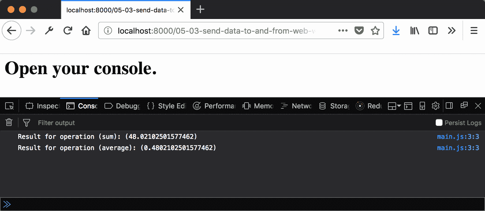x

# 它是如何工作的...

我们已经看到了如何在工作器之间发送和接收简单的字符串。现在我们可以看到，更复杂的对象也可以发送。实际上，可以通过 `postMessage` 传递大量类型的对象。

要查看有效类型的完整列表，请访问以下链接：

[`developer.mozilla.org/en-US/docs/Web/API/Web_Workers_API/Structured_clone_algorithm`](https://developer.mozilla.org/en-US/docs/Web/API/Web_Workers_API/Structured_clone_algorithm)[.](https://developer.mozilla.org/en-US/docs/Web/API/Web_Workers_API/Structured_clone_algorithm)

通过使用`postMessage`，我们已经将数据复制到了工作线程。这个操作成本较高，因为每次将消息发布到新线程时，数据都必须被复制才能可用。对于小型数据集，这不是问题，但对于大型数据集，它可能会很慢且占用大量内存。在本书的后续菜谱中，我们将使用共享内存来避免这种复制。

# 使用`terminate`停止工作线程

并非所有问题都是累积的。有些有一个期望的目标状态；一旦找到，程序就可以退出。我们已经看到，工作线程通过发送消息来传达结果。现在我们的程序已经完成，我们希望防止未来的消息被接收，以免污染我们的结果。

在这个菜谱中，我们将看到如何使用`Worker.terminate`立即停止一个`Worker`。

# 准备中

这个菜谱假设你已经有一个工作区，允许你在浏览器中创建和运行 ES 模块。如果你没有，请参阅前两章。

# 如何操作...

1.  打开你的命令行应用程序，导航到你的工作区。

1.  创建一个名为`05-04-stop-workers-with-terminate`的新文件夹。

1.  复制或创建一个`index.html`文件，该文件从`main.js`加载并运行一个`main`函数。

1.  创建一个`main.js`文件，其中包含一个名为`onMessage`的函数，该函数接受`message`和`workers`参数**，**记录`message.data`的`type`和`timeout`属性，并对所有`workers`调用`terminate`：

```js
// main.js 
function onComplete(message, workers) { 
  const { index, timeout } = message.data; 
  workers.map((w) => w.terminate()); 

  console.log( 
    'Result from worker (%s) after timeout (%s): %s', 
    index, 
    timeout 
  ); 
}  
```

1.  创建一个`main`函数，该函数创建多个工作线程，将带有函数的`onMessage`属性设置为将所有`workers`作为第二个参数传递，然后向每个工作线程发送带有`index`的消息：

```js
  export function main() { 
  const totalWorkers = 10; 
  const workers = []; 

  for (let i = 0; i < totalWorkers; i++) { 
    const worker = new Worker('./worker.js'); 
    worker.onmessage = (msg) => onComplete(msg, workers); 
    workers.push(worker); 
  } 

  workers.map((worker, index) => { 
    workers[index].postMessage({ index }); 
  }); 
}  
```

1.  创建一个`worker.js`文件，将当前上下文作为`global`常量：

```js
// worker.js 
const global = this;  
```

1.  设置一个`timeout`常量，其值在*0*到*10,000*之间的随机数：

```js
// worker.js 
const timeout = Math.floor(Math.random() * 10000); 
```

1.  在`global`上下文中设置`onmessage`事件监听器。该函数应接受一个`message`参数，并在给定的超时后发送一个包含此工作线程的`index`和`timeout`的响应消息：

```js
// worker.js 
global.onmessage = (message) => { 
  const data = JSON.parse(message.data); 
  const data = { 
    index: data.index, 
    timeout: timeout 
  }; 

  setTimeout(() => global.postMessage(data), timeout) 
};   
```

1.  启动你的 Python 网络服务器，并在浏览器中打开以下链接：

    `http://localhost:8000/`.

1.  你应该看到以下输出显示：

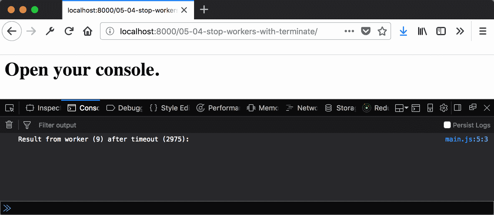

# 它是如何工作的...

所有 10 个工作线程都被指示在给定的超时后发送消息，但正如你所看到的，只有一个工作线程实际上向主线程发送了消息。这是因为，在这个第一个工作线程发送消息后，我们对所有工作线程调用了`terminate`。这意味着它们将立即停止，除非另一个工作线程已经发送了消息，否则它永远不会发送。所以，我们几乎总是看到只有一个消息被发送。有可能在终止之前，一两个其他工作线程会发送消息。

# 创建 SharedArrayBuffer

到目前为止，我们已经看到了如何在主线程和工作线程之间发送数据。我们目前所做的方法的缺点是数据被复制。这意味着随着数据量和工作者数量的增加，需要复制的数量也会增加。幸运的是，有一种方法可以在线程之间以更少的开销共享数据。

`SharedArrayBuffer` 可以在数组之间共享，而不需要复制数据。在本例中，我们将看到如何创建、读取和写入 `SharedArrayBuffer` 中的数据。

# 准备工作

本例假设你已经有一个工作区，允许你在浏览器中创建和运行 ES 模块。如果你没有，请参阅前两章。

# 如何做到这一点...

1.  打开你的命令行应用程序，导航到你的工作区。

1.  创建一个名为 `05-05-creating-shared-array-buffer` 的新文件夹。

1.  复制或创建一个 `index.html` 文件，该文件加载并运行来自 `main.js` 的 `main` 函数。

1.  创建一个包含主方法的 `main.js` 文件，该方法定义了 `NUM_COUNT`、`BYTES_FOR_32_BIT`、`ARRAY_SIZE` 和 `MAX_NUMBER` 的常量：

```js
export function main() { 
  const NUM_COUNT = 2048; 
  const BYTES_FOR_32_BIT = 4; 
  const ARRAY_SIZE = NUM_COUNT * BYTES_FOR_32_BIT; 
  const MAX_NUMBER = 1024; 
} 
```

1.  接下来，创建一个大小为 `ARRAY_SIZE` 的 `SharedArrayBuffer`，并创建一个将其转换为 `Int32Array` 的实例：

```js
export function main() { 
  // ... 
 const sab = new SharedArrayBuffer(ARRAY_SIZE);
 const intBuffer = new Int32Array(sab);
}  
```

1.  用介于 *0* 和 `MAX_NUMBER` 之间的随机数填充 `intBuffer`：

```js
export function main() { 
  // ... 
 // fill with random numbers  // fill with random numbers
  intBuffer.forEach((value, index) => {
    intBuffer[index] = Math.random() * MAX_NUMBER;
  }); } 
```

1.  计算并打印数组中值的总和：

```js
 export function main() { 
  // ... 
 // sum the ints
  const sum = intBuffer.reduce((acc, number) =>
    acc + number
  , 0);
} 
```

1.  启动你的 Python 网络服务器，并在浏览器中打开以下链接：

    `http://localhost:8000/`.

1.  你应该看到以下输出：

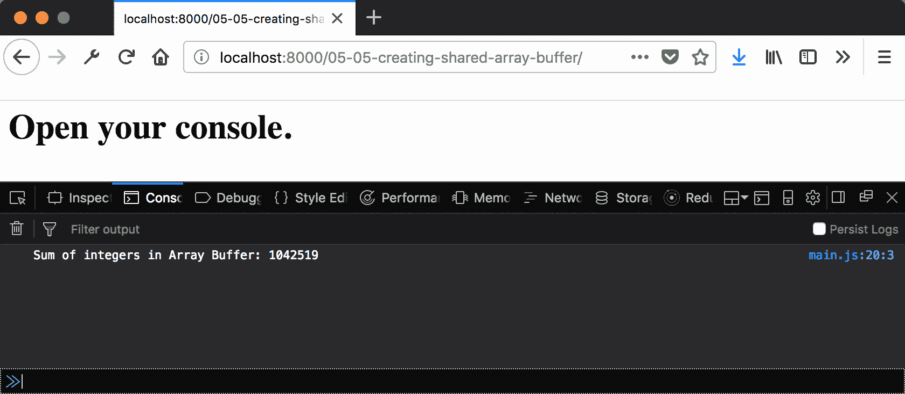

# 它是如何工作的...

在 JavaScript 中工作时考虑字节大小似乎有些不自然，但与 `SharedArrayBuffer` 一起工作却是必要的。前面的示例创建了一个包含 2,048 个 32 位整数的数组。因此，为了创建 `SharedArray` 缓冲区，我们必须计算 2,048 个 32 位整数将占用多少内存。这是通过简单的乘法完成的。一旦我们有了 `ARRAY_SIZE`，我们就可以分配内存。

现在我们有了数组，我们需要将其转换为某种类型，以便从中读取和写入。我们使用 `Int32Array`，因此当我们执行数组访问操作时，值将被转换为 32 位整数。

当填充数组时，我们只需遍历每个数字，将随机数乘以 `MAX_NUMBER`；得到的结果被转换为 32 位整数（十进制值丢失）。接下来，使用数组的 `reduce` 函数进行求和，并将结果输出。

`Int32Array` 的一个优点是它具有所有数组方法。因此，我们可以使用新数据类型执行 map、join、index、includes 等操作。

# 将 SharedArrayBuffer 发送到 Web Worker

现在我们知道了如何创建和使用 `SharedArrayBuffer`，我们可以使用它来在主线程和工作线程之间共享数据。如前所述，这比发布 JavaScript 对象有优势，因为数据不需要复制；它是共享的。

在这个菜谱中，我们将看到如何与工作线程共享`SharedArrayBuffer`，并将结果回传到主线程。

# 准备工作

本菜谱假设您已经有一个工作区，允许您在浏览器中创建和运行 ES 模块。如果您没有，请参阅前两章。它还假设您已在浏览器中启用了共享内存。如果您还没有，请参阅本章开头的菜谱。

# 如何操作...

1.  打开您的命令行应用程序，并导航到您的工作区。

1.  创建一个名为`05-06-sending-shared-array-to-worker`的新文件夹。

1.  复制或创建一个`index.html`，它加载并运行来自`main.js`的`main`函数。

1.  创建一个包含`onMessage`函数的`main.js`文件，该函数将接收到的消息数据的`result`和`type`成员打印出来：

```js
function onMessage(message) { 
  const { result, type } = message.data; 
  console.log('result from worker operation: %s', type, result); 
} 
```

1.  创建一个包含主方法的`main.js`文件，定义`NUM_COUNT`、`BYTES_FOR_32_BIT`、`ARRAY_SIZE`和`MAX_NUMBER`常量：

```js
export function main() { 
  const NUM_COUNT = 2048; 
  const BYTES_FOR_32_BIT = 4; 
  const ARRAY_SIZE = NUM_COUNT * BYTES_FOR_32_BIT; 
  const MAX_NUMBER = 1024; 
} 
```

1.  接下来，创建一个大小为`ARRAY_SIZE`的`SharedArrayBuffer`，并使用`worker.js`中的源创建一个工作线程：

```js
export function main() { 
  // ... 
 const sab = new SharedArrayBuffer(ARRAY_SIZE); const worker = new Worker('./worker.js'); 
} 
```

1.  将工作线程的消息事件监听器设置为`onMessage`函数，并向工作线程发送包含数组缓冲区的消息：

```js
export function main() { 
  // ... 
 worker.onmessage = onMessage; worker.postMessage({ type: 'load-array', array: sab });; 
} 
```

1.  使用介于*0*和`MAX_NUMBER`之间的随机值填充数组缓冲区以 32 位整数：

```js
export function main() { 
  // ... 
 const intBuffer = new Int32Array(sab); // fill with random numbers intBuffer.forEach((value, index) => { intBuffer[index] = Math.random() * MAX_NUMBER; }); 
} 
```

1.  向工作线程发送消息，请求计算`sum`和`average`：

```js
export function main() { 
  // ... 
 worker.postMessage({ type: 'calculate-sum' }); worker.postMessage({ type: 'calculate-average'}); 
} 
```

1.  创建一个`worker.js`文件，将当前上下文赋值给变量`global`，声明一个名为`sharedIntArray`的变量，并将一个函数赋值给`onmessage`事件：

```js
// worker.js 
const global = this; 
let sharedIntArray; 

global.onmessage = (message) => {};  
```

1.  在`onmessage`监听器中获取`message`参数的数据组件，并`switch`在`type`属性上：

```js
global.onmessage = (message) => { 
 const { data } = message; switch (data.type) {} 
};  
```

1.  添加一个`'load-array'`的情况，我们将数据数组的属性转换为`Int32Array`后赋值给`sharedIntArray`：

```js
global.onmessage = (message) => { 
  const { data } = message; 
  switch (data.type) { 
 case 'load-array': sharedIntArray = new Int32Array(data.array); break; 
    } 
  }; 
```

1.  添加一个`'calculate-sum'`的情况，计算数组中所有数字的总和并将结果回传到主线程：

```js
global.onmessage = (message) => { 
  const { data } = message; 
  switch (data.type) { 
    case 'load-array': 
      sharedIntArray = new Int32Array(data.array); 
      break; 
 case 'calculate-sum': const sum = sharedIntArray.reduce((acc, number) => acc +
      number, 
      0); global.postMessage({ type: 'sum', result: sum }); break; 
    } 
  };  
```

1.  添加一个`'calculate-average'`的情况，计算数组中所有数字的平均值并将结果回传到主线程：

```js
global.onmessage = (message) => { 
  const { data } = message; 
  switch (data.type) { 
    case 'load-array': 
      sharedIntArray = new Int32Array(data.array); 
      break; 
    case 'calculate-sum': 
      const sum = sharedIntArray.reduce((acc, number) =>  
        acc + number, 
      0); 
      global.postMessage({ type: 'sum', result: sum }); 
      break;     

 case 'calculate-average': const total = sharedIntArray.reduce((acc, number) => acc + number , 0); const average = total / sharedIntArray.length; global.postMessage({ type: 'average', result: average }); break; 
    } 
  }; 
```

1.  启动您的 Python 网络服务器，并在浏览器中打开以下链接：`http://localhost:8000/`。

1.  您应该看到以下输出：

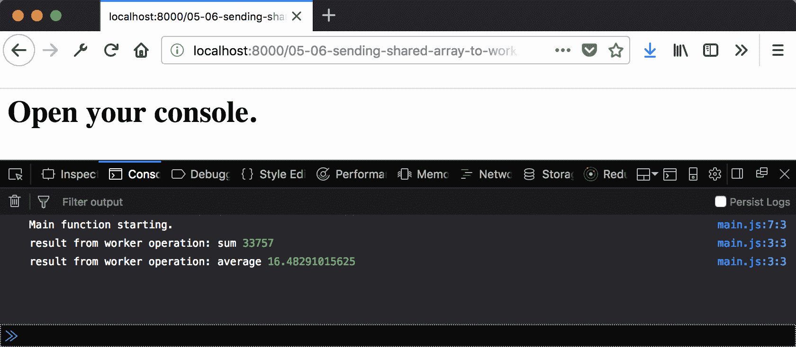

# 工作原理...

如前所述，`SharedArrayBuffer`在线程之间不是复制的，它是共享的。因此，当我们创建共享数组缓冲区并将该引用传递给工作线程时，主线程插入到数组中的值在工作线程中也是可用的。

在工作线程接收到执行计算的指令后，值可以像任何其他数组一样累积，回传的值是一个简单的消息。

# 从多个 Web Workers 读取 SharedArray

在前面的菜谱中，我们看到了如何在主线程和一个单独的工作器之间共享数据。这对于在主线程上执行长时间运行的操作很有帮助，这有助于保持用户界面的响应性。然而，它并没有充分利用并行处理。对于非常大的数据集，在许多工作器之间分割计算可能是优势。

在这个菜谱中，我们将看到如何使用多个工作器生成结果的部分。

# 准备工作

这个菜谱假设你已经有一个工作区，允许你在浏览器中创建和运行 ES 模块。如果你没有，请参阅前两章。

# 如何操作...

1.  打开你的命令行应用程序并导航到你的工作区。

1.  创建一个名为 `05-07-reading-shared-buffer-from-multiple-workers` 的新文件夹。

1.  复制或创建一个 `index.html`，它加载并运行来自 `main.js` 的 `main` 函数。

1.  创建一个 `main.js` 文件，其中包含一个 `onMessage` 函数，用于记录消息数据中的以下成员：`workenIndex`、`type`、`result`、`workerIndex`、`startIndex`、`endIndex` 和 `windowSize`：

```js
// main.js
function onMessage(message) {
const { 
    type, 
    result, 
    workerIndex, 
    startIndex, 
    endIndex, 
    windowSize 
  } = message.data; 
  console.log(`Result from worker operation { 
    type: ${type}, 
    result: ${result}, 
    workerIndex: ${workerIndex}, 
    startIndex: ${startIndex}, 
    endIndex: ${endIndex}, 
    windowSize: ${windowSize} 
  }`); 
} 
```

1.  创建一个名为 `main.js` 的文件，其中包含一个主方法，用于定义 `NUM_COUNT`、`BYTES_FOR_32_BIT`、`ARRAY_SIZE`、`WORKER_COUNT` 和 `MAX_NUMBER` 的常量：

```js
export function main() { 
  console.log('Main function starting.'); 
  const NUM_COUNT = 2048; 
  const BYTES_FOR_32_BIT = 4; 
  const ARRAY_SIZE = NUM_COUNT * BYTES_FOR_32_BIT; 
  const MAX_NUMBER = 32; 
  const WORKER_COUNT = 10; 
  } 
```

1.  接下来，创建一个大小为 `WORKER_COUNT` 的工作器数组：

```js
export function main() { 
  // ... 
 // create workers let workers = []; console.log('Creating workers.'); for (let i = 0; i < WORKER_COUNT; i++) { const worker = new Worker('./worker.js'); worker.onmessage = onMessage; workers = workers.concat(worker); } 
} 
```

1.  接下来，创建一个大小为 `ARRAY_SIZE` 的 `SharedArrayBuffer`，并用随机整数填充它：

```js
export function main() { 
  // ... 
 // create buffer and add data const sab = new SharedArrayBuffer(ARRAY_SIZE); const intBuffer = new Int32Array(sab); // fill with random numbers console.log('Filling Int buffer'); intBuffer.forEach((value, index) => { intBuffer[index] = (Math.random() * MAX_NUMBER) + 1; }); 
} 
```

1.  将这些消息发布到每个工作器：`'load-array'`、`'load-indices'`、`'calculate-sum'` 和 `'calculate-average'`：

```js
export function main() { 
  // ... 
 workers.forEach((worker, workerIndex) => { worker.postMessage({ type: 'load-array', array: sab }); worker.postMessage({ type: 'load-indices', workerIndex,
    workerCount: WORKER_COUNT }); worker.postMessage({ type: 'calculate-sum' }); worker.postMessage({ type: 'calculate-average' }); });; 
} 
```

1.  创建一个 `worker.js` 文件，将当前上下文赋值给变量 `global`，并声明名为 `sharedIntArray`、`sharedInArraySlice`、`workerIndex`、`workerCount`、`startIndex` 和 `endIndex` 的变量。此外，将一个函数赋值给 `onmessage` 事件：

```js
// worker.js 
const global = this; 
let sharedIntArray; 
let sharedIntArraylSlice; 
let workerIndex; 
let workerCount; 
let startIndex; 
let endIndex; 

global.onmessage = (message) => {};  
```

1.  在 `onmessage` 监听器中，获取 `message` 参数的数据组件并基于 `type` 属性进行切换：

```js
global.onmessage = (message) => { 
 const { data } = message; switch (data.type) {} };  
```

1.  添加一个针对 `'load-array'` 的用例，在该用例中，我们将数据数组的属性转换为 `Int32Array` 后赋值给 `sharedIntArray`：

```js
global.onmessage = (message) => { 
  const { data } = message; 
  switch (data.type) { 
 case 'load-array': sharedIntArray = new Int32Array(data.array); break; 
    } 
  };  
```

1.  添加一个针对 `'load-indices'` 的用例，根据当前索引和总工人数计算当前工作器应处理的值窗口：

```js
global.onmessage = (message) => { 
  const { data } = message; 
  switch (data.type) { 
    case 'load-array': 
      sharedIntArray = new Int32Array(data.array); 
      break; 
 case 'load-indices':
 workerIndex = data.workerIndex;
 workerCount = data.workerCount;

 const windowSize = Math.floor(sharedIntArray.length /
      workerCount)
 startIndex = windowSize * workerIndex;
 const isLastWorker = workerIndex === workerCount - 1;
 endIndex = (isLastWorker) ? sharedIntArray.length : 
      startIndex+windowSize;
 sharedIntArraySlice = sharedIntArray.slice(startIndex,
      endIndex);
 break;
  }; 
```

1.  添加一个针对 `'calculate-sum'` 的用例，该用例计算数组中的所有数字并将结果回传到主线程：

```js
global.onmessage = (message) => { 
  const { data } = message; 
  switch (data.type) { 
   // ... 
 case 'calculate-sum':
      const sum = sharedIntArraySlice.reduce((acc, number) =>
        acc + number
      , 0);
      sendResult('sum', sum);
      break; 
    } 
  };  
```

1.  添加一个针对 `'calculate-average'` 的用例，该用例计算数组中的所有数字并将结果回传到主线程：

```js
global.onmessage = (message) => { 
  const { data } = message; 
  switch (data.type) { 
    //...     
    case 'calculate-average':
      const total = sharedIntArraySlice.reduce((acc, number) =>
        acc + number
      , 0);
      const average = total / sharedIntArraySlice.length
      sendResult('average', average);
      break;     
    } 
  };  
```

1.  创建一个 `sendResult` 函数，用于将 `result`、结果类型和有关当前线程的信息发布到主线程：

```js
function sendResult(type, result) { 
  global.postMessage({ 
    type, 
    result, 
    workerIndex, 
    startIndex, 
    endIndex, 
    windowSize: endIndex - startIndex - 1 
  }); 
} 
```

1.  启动你的 Python 网络服务器并在浏览器中打开以下链接：

    `http://localhost:8000/`。

1.  你应该看到以下输出：

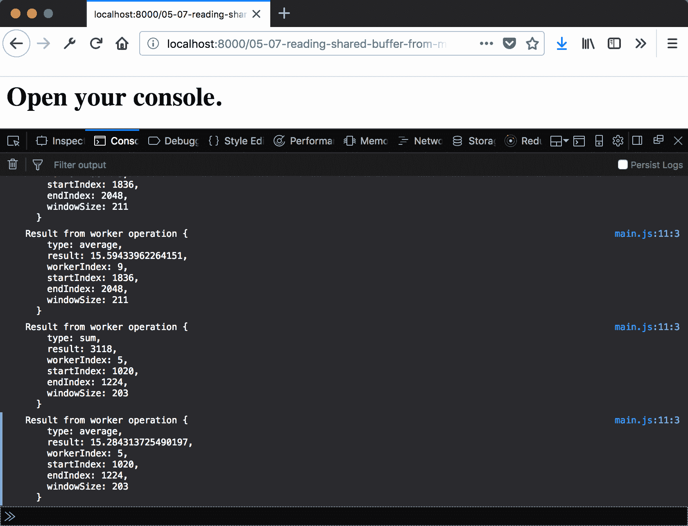

# 工作原理...

共享数组缓冲区可以在任何数量的工作线程之间共享。为了计算结果的部分，我们需要在线程之间公平地分配结果。这就是工作线程 `onMessage` 监听器的 `'load-indices'` 情况所做的事情。

我们可以使用数组的大小和总工作线程数来获取窗口大小。我们取整数部分，这样就不会超过数组的索引。这也是因为不能有部分索引：它们是整数。

接下来，我们使用当前工作线程的索引来获取 `startIndex`（基本上是从上一个工作线程离开的地方继续）。为了获取结束索引，我们需要知道这是否是最后一个工作线程。如果不是，我们使用窗口大小。如果是，我们需要取所有剩余的值。

一旦我们有了数组切片，每个工作线程就像处理整个数组一样计算这些部分的和与平均值。然后，将结果和工作线程信息发布到主线程。

# 使用 Atomics 协调共享内存的使用

在上一个菜谱中，我们使用了多个工作线程来生成结果的一部分。我们可以在主线程中合并这些结果。虽然这种方法是有效的，但它并没有充分利用并行处理的优势。如果工作线程能够自己累积结果，那就更好了。

在多个并行线程中修改共享内存会暴露出竞争条件。这是当几个操作需要按照特定顺序发生，而这种顺序没有被强制执行时。幸运的是，我们可以使用 Atomics API 来协调这些操作。

在这个菜谱中，我们将看到如何使用 Atomics API 来累积结果，同时避免竞争条件。

# 准备工作

这个菜谱假设你已经有一个工作区，允许你在浏览器中创建和运行 ES 模块。如果你没有，请参阅前两章。

# 如何操作...

1.  打开你的命令行应用程序，导航到你的工作区。

1.  创建一个名为 `05-08-use-atomics-to-coordinate` 的新文件夹。

1.  复制或创建一个 `index.html`，它加载并运行来自 `main.js` 的 `main` 函数。

1.  创建一个 `main.js` 文件。创建三个共享数组缓冲区：一个输入缓冲区和两个输出缓冲区（一个 `safe`，另一个 `unsafe`）。输出缓冲区的大小应为 32 位：

```js
// main.js
const NUMBER_COUNT = Math.pow(2, 10); 
const BYTES_FOR_32_BIT = 4;
const ARRAY_SIZE = NUMBER_COUNT * BYTES_FOR_32_BIT; 
const sab = new SharedArrayBuffer(ARRAY_SIZE); 
const intBuffer = new Int32Array(sab); 
const outSab = new SharedArrayBuffer(BYTES_FOR_32_BIT); 
const unsafeSab = new SharedArrayBuffer(BYTES_FOR_32_BIT); 
const workerCount = 256; 
```

1.  声明一个变量 `workersFinishedCount` 并将其设置为 `0`：

```js
// main.js
let workersFinishedCount = 0; 
```

1.  创建一个名为 `onMessage` 的函数。这个函数增加 `workersFinished`。如果所有工作线程都已完成，则记录两个输出数组的结果，并记录本地计算的求和结果：

```js
//main.js
function onMessage(message) { 
  workersFinishedCount++;  
  if (workersFinishedCount === WORKER_COUNT) { 
    const outIntBuffer = new Int32Array(outSab); 
    const unsafeIntBuffer = new Int32Array(unsafeSab); 
    console.log('Unsafe Sum: %s', unsafeIntBuffer[0]); 
    console.log('Merged sum: %s', outIntBuffer[0]); 
    const localSum = intBuffer.reduce((acc, curr) => acc + curr, 
    0); 
    console.log('Local sum: %s', localSum); 
  } 
} 
```

1.  创建一个主函数，声明一个 `MAX_NUMBER`：

```js
export function main() { 
  const MAX_NUMBER = 32; 
} 
```

1.  接下来，创建一个大小为 `WORKER_COUNT` 的工作线程数组。

```js
export function main() { 
  // ... 
 // create workers
</strong>  let workers = [];
 console.log('Creating workers.'); for (let i = 0; i < WORKER_COUNT; i++) { const worker = new Worker('./worker.js'); worker.onmessage = onMessage; workers = workers.concat(worker); } 
} 
```

1.  接下来，将输入共享数组缓冲区填充随机整数：

```js
export function main() { 
  // ... 
 // fill with random numbers console.log('Filling Int buffer'); intBuffer.forEach((value, index) => { intBuffer[index] = (Math.random() * MAX_NUMBER) + 1; }); 
} 
```

1.  将这些消息发送给每个工作线程：`'load-shared-input'`，`'load-shared-output'`，`'load-indices'` 和 `'calculate-sum'`：

```js
export function main() { 
  // ... 
 workers.forEach((worker, workerIndex) => { worker.postMessage({ type: 'load-shared-input', input: sab 
    }); worker.postMessage({ type: 'load-shared-output', safe: 
    outSab,
    unsafe: unsafeSab }); worker.postMessage({ type: 'load-indices', workerIndex, 
    workerCount: WORKER_COUNT }); worker.postMessage({ type: 'calculate-sum' }); }); 
} 
```

1.  创建一个 `worker.js` 文件，将当前上下文分配给一个 `global` 变量，声明名为 `sharedIntArray`、`resultArray`、`unsafeResultArray` 和 `sharedInArraySlice` 的变量，并将一个函数分配给 `onmessage` 事件：

```js
// worker.js 
const global = this; 
let sharedIntArray; 
let resultArray; 
let unsafeResultArray; 
let sharedIntArraylSlice; 

global.onmessage = (message) => {};  
```

1.  在 `onmessage` 监听器中，获取 `message` 参数的数据组件，并使用 `switch` 在 `type` 属性上：

```js
global.onmessage = (message) => { 
 const { data } = message; switch (data.type) {} 
};  
```

1.  为 `'load-shared-input'` 添加一个案例，我们将数据对象的 `input` 属性分配给 `sharedIntArray`，在将其转换为 `Int32Array` 后：

```js
global.onmessage = (message) => { 
  const { data } = message; 
  switch (data.type) { 
 case 'load-shared-input': sharedIntArray = new Int32Array(data.input); break; 
  } 
};  
```

1.  为 `'load-shared-output'` 添加一个案例，我们将数据对象的 `safe` 和 `unsafe` 属性分配给相应的结果数组，在将它们转换为 `Int32Array` 后：

```js
 global.onmessage = (message) => { 
  const { data } = message; 
  switch (data.type) { 
 case 'load-shared-output': resultArray = new Int32Array(data.safe); unsafeResultArray = new Int32Array(data.unsafe); break; 
    } 
  }; 
```

1.  为 `'load-indices'` 添加一个案例，根据当前索引和工作者总数计算当前工作者应该处理的价值范围：

```js
global.onmessage = (message) => { 
  const { data } = message; 
  switch (data.type) { 
    case 'load-array': 
      sharedIntArray = new Int32Array(data.array); 
      break; 
 case 'load-indices': const { workerIndex, workerCount } = data; const windowSize = Math.floor(sharedIntArray.length / 
      workerCount); const startIndex = windowSize * workerIndex; const lastWorker = workerIndex === workerCount - 1; const endIndex = (lastWorker) ? sharedIntArray.length :
      startIndex + windowSize; sharedIntArraySlice = sharedIntArray.slice(startIndex,
      endIndex); break; } 
  }; 
```

1.  为 `'calculate-sum'` 添加一个案例，该案例将数组中的所有数字相加，直接更新 `unsafeResultArray`，使用 `Atomics.add` 更新 `resultArray`，并将结果发送回主线程：

```js
global.onmessage = (message) => { 
  const { data } = message; 
  switch (data.type) { 
   // ... 
 case 'calculate-sum': const sum = sharedIntArraySlice.reduce((acc, number) => acc + number , 0); sendResult('sum', sum); break; 
    } 
  }; 
```

1.  启动你的 Python 网络服务器并在浏览器中打开以下链接：

    `http://localhost:8000/`.

1.  你应该看到以下输出：

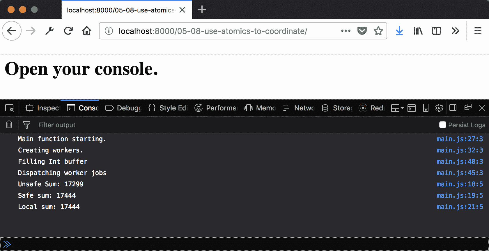

# 它是如何工作的...

从结果中我们可以看出，`unsafeResultArray` 的值已经被竞争条件破坏。看起来好像有些值丢失了。然而，从工作者的角度来看，我们似乎将结果作为一个单一操作添加。

这并不完全正确。`*+**=*` 运算符实际上是三个单独的操作，一个读取操作、一个加法操作和一个写入操作。如果你想象多个工作者同时到达这个段（我们一次有 256 个在工作），那么你可以想象竞争条件是如何发生的。

原子操作防止这些错误发生。例如，`Atomic.add` 操作就像 *+*, *=* 是一个单一操作。当一个工作者使用 `Atomics.add` 或 API 中的任何其他方法时，他们可以确信，直到操作完成，值不会被另一个线程写入或读取。这就是为什么安全的总和总是与主线程上计算的总和相匹配，而不安全的总和可能会更少。

由于竞争条件是非确定性的，你可能需要多次运行这个菜谱，才能看到安全和不可安全总和之间的差异。

# 使用承诺为工作者提供一个简单的接口

到目前为止，我们已经看到了如何使用工作者（workers）来执行各种任务，但我们也已经看到它们的使用可能会很繁琐。这在某种程度上是不可避免的。然而，我们可以通过我们在前几章中已经看到的工具为使用工作者的操作提供良好的接口。

在这个菜谱中，我们将看到如何使用承诺（promises）来创建更熟悉的接口。

# 准备工作

这个菜谱假设你已经有一个工作区，允许你在浏览器中创建和运行 ES 模块。如果你没有，请参阅前两章。

# 如何操作...

1.  打开你的命令行应用程序，并导航到你的工作区。

1.  创建一个名为 `05-09-using-promise-for-simple-interfaces` 的新文件夹。

1.  复制或创建一个 `index.html` 文件，该文件加载并运行来自 `main.js` 的 `main` 函数。

1.  创建一个名为 `main.js` 的文件，其中包含一个名为 `sumOnWorker` 的 `async` 函数：

```js
// main.js
async function sumOnWorker(array) {}
```

1.  在 `sumOnWorker` 内部，返回一个新的承诺，其中你创建一个新的工作器，绑定 `onmessage` 事件监听器，并向工作器发送消息以计算总和：

```js
// main.jsfunction sumOnWorker(array) { 
  return new Promise(function (resolve) { 
    const worker = new Worker('./worker.js'); 
 worker.onmessage = (message) => {}; worker.postMessage({ type: 'calculate-sum', array }); 
  }); 
} 
```

1.  在 `onmessage` 监听器内部，记录消息数据的 `type` 和 `result` 属性，并解析 `result`：

```js
// main.js
async function sumOnWorker(array) { 
  return new Promise(function (resolve) { 
    const worker = new Worker('./worker.js'); 
    worker.onmessage = (message) => { 
 const { type, result } = message.data; console.log('Completed operation (%s), result: %s', type, result ); return resolve(result); 
    }; 

    worker.postMessage({ type: 'calculate-sum', array }); 
  }); 
} 
```

1.  创建一个 `async` 的主函数，该函数创建三个随机数字的数组：

```js
export function main() { 
  const array0 = (new Array(10000)).fill().map(Math.random); 
  const array1 = (new Array(1000)).fill().map(Math.random); 
  const array2 = (new Array(100)).fill().map(Math.random); 
} 
```

1.  对每个数组调用 `sumOnWorker`，并记录结果：

```js
export function main() { 
  // ... 
 sumOnWorker(array0).then((sum) => console.log('Array 0 sum: 
  %s', sum)); sumOnWorker(array1).then((sum) => console.log('Array 1 sum: 
  %s', sum)); sumOnWorker(array2).then((sum) => console.log('Array 2 sum: 
  %s', sum));; 
} 
```

1.  创建一个 `worker.js` 文件，将当前上下文分配给变量 `global`，并将一个函数分配给 `onmessage` 事件：

```js
// worker.js 
const global = this;  
global.onmessage = (message) => {};  
```

1.  在 `onmessage` 监听器中，获取 `message` 参数的数据组件，并根据 `type` 属性进行 `switch`：

```js
global.onmessage = (message) => { 
 const { data } = message; switch (data.type) {} 
};  
```

1.  添加一个针对 `'calculate-sum'` 的用例，计算已发布的数组的总和。响应类型或操作，以及结果值：

```js
global.onmessage = (message) => { 
  const { data } = message; 
  switch (data.type) { 
 case 'calculate-sum': const sum = data.array.reduce((acc, number) => acc + 
      number,0); global.postMessage({ type: 'sum', result: sum }); break;
  } 
}; 
```

1.  启动你的 Python 网络服务器，并在浏览器中打开以下链接：

    `http://localhost:8000/`.

1.  你应该看到以下输出：

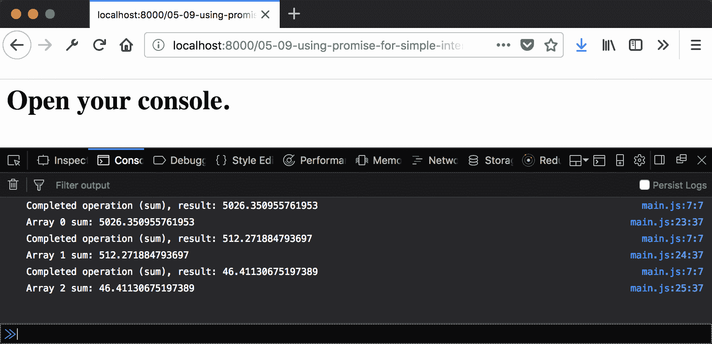

# 它是如何工作的...

我们在前几章中看到了如何灵活地组合承诺和 `async` 函数。使用工作器这样做是一个自然的扩展。考虑一个异步 AJAX 请求。这可以被认为是在工作器中发生的。毕竟，它是在不同的执行线程中进行的，但由浏览器管理。

只要正确处理成功和错误条件，承诺和 `async` 函数就可以用来为 Web Workers 提供熟悉的接口。当将新技术与现有代码库集成时，拥有熟悉和简单的接口至关重要。
