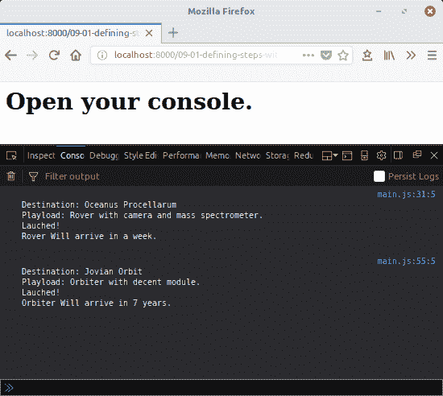
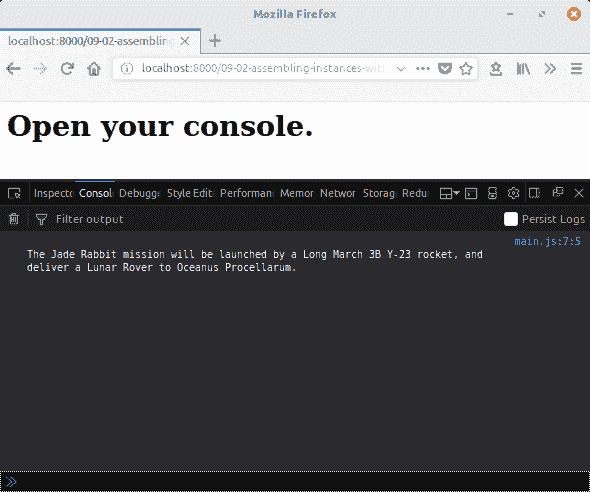
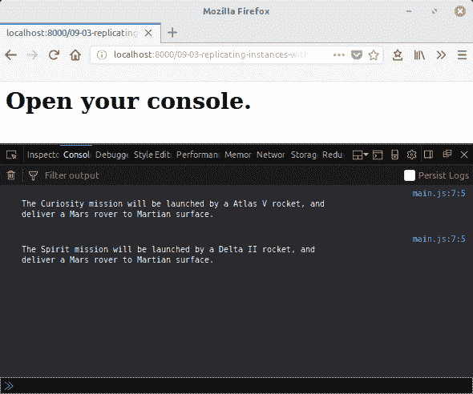
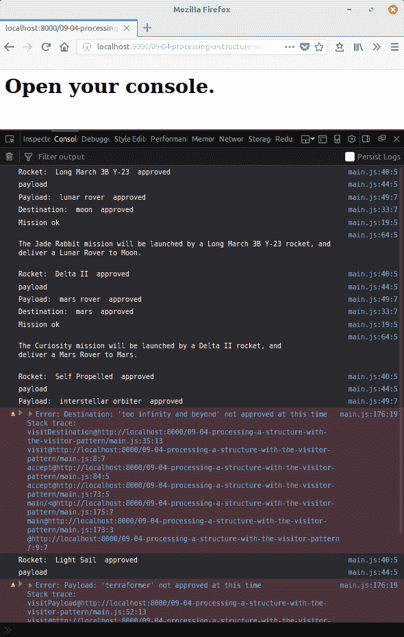
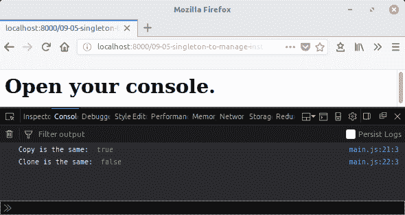
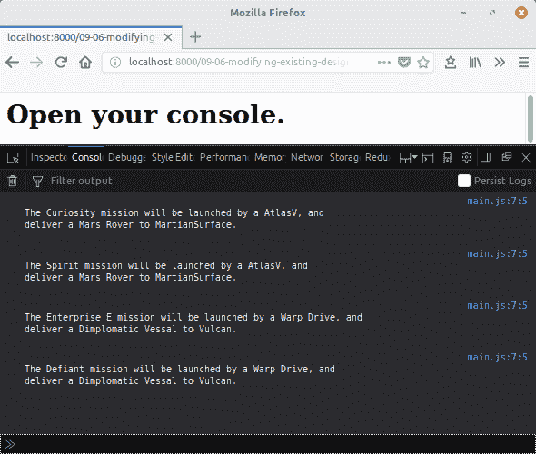
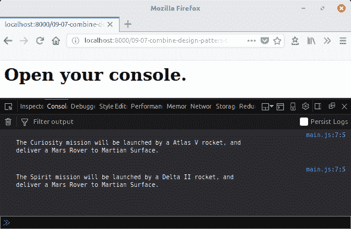

# 第九章：使用设计模式构建更大的结构

在本章中，我们将介绍以下食谱：

+   使用模板函数定义步骤

+   使用构建器组装自定义实例

+   使用工厂复制实例

+   使用访问者模式处理结构

+   使用单例管理实例

+   修改现有设计模式以适应不同的用例

+   将现有设计模式组合起来以适应不同的用例

# 简介

类，就像对象和函数一样，是我们创建程序的基本构建块。随着程序的扩展，定义实体之间关系变得越来越困难，且需要高效和系统地定义。当数据与功能之间的关系变得复杂时，我们可以使用类和其他对象来组织它们。但是，当类和对象大量增加时，我们该怎么办？

设计模式可以是一个有用的指南。有用的设计模式是从实际实现中提炼出来的。这些模式旨在以可预测的方式解决给定形状的模式。当正确实现时，它们形成了一个预期的行为契约。这种可预测性和规律性（与其他模式的实现）有助于推理代码和更高层次的抽象。

在本章中，我们将了解如何使用常见的设计模式作为组织更大结构的蓝图。

# 使用模板函数定义步骤

模板是一种设计模式，它详细说明了给定操作集应执行的顺序；然而，模板本身并不概述步骤。当行为被划分为具有某些概念或副作用依赖性，需要按特定顺序执行的阶段时，此模式非常有用。

在这个食谱中，我们将了解如何使用模板函数设计模式。

# 准备工作

本食谱假设您已经有一个工作区，允许您在浏览器中创建和运行 ES 模块。如果您没有，请参阅前两章。

# 如何做到这一点...

1.  打开您的命令行应用程序并导航到您的 workspace。

1.  创建一个名为 `09-01-defining-steps-with-template-functions` 的新文件夹。

1.  复制或创建一个 `index.html` 文件，该文件从 `main.js` 加载并运行 `main` 函数。

1.  创建一个定义名为 `Mission` 的新抽象 `class` 的 `main.js` 文件：

```js
// main.js 
class Mission { 
  constructor () { 
    if (this.constructor === Mission) { 
      throw new Error('Mission is an abstract class, must 
      extend'); 
    } 
  } 
}  
```

1.  添加一个名为 `execute` 的函数，该函数调用三个实例方法——`determineDestination`、`determinPayload` 和 `launch`：

```js
// main.js 
class Mission { 
  execute () { 
    this.determinDestination(); 
    this.determinePayload(); 
    this.launch(); 
  } 
} 
```

1.  创建一个扩展 `Mission` 类的 `LunarRover` 类：

```js
// main.js 
class LunarRover extends Mission {} 
```

1.  添加一个构造函数，将 `name` 分配给实例属性：

```js
// main.js 
class LunarRover extends Mission 
  constructor (name) { 
    super(); 
    this.name = name; 
  } 
}  
```

1.  实现 `Mission.execute` 调用的三个方法：

```js
// main.js 
class LunarRover extends Mission {} 
  determinDestination() { 
    this.destination = 'Oceanus Procellarum'; 
  } 

  determinePayload() { 
    this.payload = 'Rover with camera and mass spectrometer.'; 
  } 

  launch() { 
    console.log(` 
Destination: ${this.destination} 
Playload: ${this.payload} 
Lauched! 
Rover Will arrive in a week. 
    `); 
  } 
}  
```

1.  创建一个也扩展 `Mission` 类的 `JovianOrbiter` 类：

```js
// main.js 
class LunarRover extends Mission {} 
constructor (name) { 
    super(); 
    this.name = name; 
  } 

  determinDestination() { 
    this.destination = 'Jovian Orbit'; 
  } 

  determinePayload() { 
    this.payload = 'Orbiter with decent module.'; 
  } 

  launch() { 
    console.log(` 
Destination: ${this.destination} 
Playload: ${this.payload} 
Lauched! 
Orbiter Will arrive in 7 years. 
    `); 
  } 
} 
```

1.  创建一个 `main` 函数，该函数创建具体的任务类型并执行它们：

```js
// main.js 
export function main() { 
  const jadeRabbit = new LunarRover('Jade Rabbit'); 
  jadeRabbit.execute(); 
  const galileo = new JovianOrbiter('Galileo'); 
  galileo.execute(); 
} 
```

1.  启动您的 Python 网络服务器并在浏览器中打开以下链接：

    `http://localhost:8000/`.

1.  输出应如下所示：



# 它是如何工作的...

`Mission`抽象类定义了`execute`方法，该方法以特定顺序调用其他实例方法。你会注意到被调用的方法并非由`Mission`类定义。这个实现细节是扩展类的责任。这种抽象类的使用允许子类被利用抽象类定义的接口的代码所使用。

在模板函数模式中，定义步骤的责任在于子类。当它们被实例化，并调用`execute`方法时，这些步骤就会按照指定的顺序执行。

理想情况下，我们应该能够确保`Mission.execute`方法不会被任何继承类覆盖。覆盖此方法与模式相悖，并破坏了与之相关的契约。

这种模式对于组织数据处理管道非常有用。这些步骤以给定顺序发生的保证意味着，如果消除了副作用，实例可以更灵活地组织。实现类可以据此以最佳方式组织这些步骤。

# 使用构建器组装定制实例

之前的配方展示了如何组织类的操作。有时，对象初始化也可能很复杂。在这些情况下，利用另一个设计模式：构建器，可能很有用。

在这个配方中，我们将看到如何使用构建器来组织更复杂对象的初始化。

# 准备工作

此配方假设你已经有了一个工作区，允许你在浏览器中创建和运行 ES 模块。如果你没有，请参阅前两章。

# 如何实现...

1.  打开你的命令行应用程序并导航到你的工作区。

1.  创建一个名为`09-02-assembling-instances-with-builders`的新文件夹。

1.  创建一个`main.js`文件，定义一个名为`Mission`的新`class`，它接受一个`name`构造函数参数并将其分配给实例属性。同时，创建一个`describe`方法，打印出一些详细信息：

```js
// main.js 
class Mission { 
  constructor (name) { 
    this.name = name; 
  } 

  describe () { 
    console.log(`
      The ${this.name} mission will be launched by a
       ${this.rocket.name}
      rocket, and deliver a ${this.payload.name} to
      ${this.destination.name}. 
    `); 
  } 
   } 
```

1.  创建名为`Destination`、`Payload`和`Rocket`的类，这些类接收一个`name`属性作为构造函数参数并将其分配给实例属性：

```js
// main.js 

class Destination { 
  constructor (name) { 
    this.name = name; 
  } 
} 

class Payload { 
  constructor (name) { 
    this.name = name; 
  } 
} 

class Rocket { 
  constructor (name) { 
    this.name = name; 
  } 
} 
```

1.  创建一个`MissionBuilder`类，它定义了`setMissionName`、`setDestination`、`setPayload`和`setRocket`方法：

```js
// main.js 
class MissionBuilder { 

  setMissionName (name) { 
    this.missionName = name; 
    return this; 
  } 

  setDestination (destination) { 
    this.destination = destination; 
    return this; 
  } 

  setPayload (payload) { 
    this.payload = payload; 
    return this; 
  } 

  setRocket (rocket) { 
    this.rocket = rocket; 
    return this; 
  } 
} 
```

1.  创建一个`build`方法，该方法使用适当的属性创建一个新的`Mission`实例：

```js
// main.js 
class MissionBuilder { 
  build () { 
    const mission = new Mission(this.missionName); 
    mission.rocket = this.rocket; 
    mission.destination = this.destination; 
    mission.payload = this.payload; 
    return mission; 
  } 
}  
```

1.  创建一个`main`函数，使用`MissionBuilder`创建一个新的任务实例：

```js
// main.js 
export function main() { 
  // build an describe a mission 
  new MissionBuilder() 
    .setMissionName('Jade Rabbit') 
    .setDestination(new Destination('Oceanus Procellarum')) 
    .setPayload(new Payload('Lunar Rover')) 
    .setRocket(new Rocket('Long March 3B Y-23')) 
    .build() 
    .describe(); 
}  
```

1.  启动你的 Python 网络服务器并在浏览器中打开以下链接：`http://localhost:8000/`。

1.  你的输出应该如下所示：



# 它是如何工作的...

构建器定义了分配所有相关属性的方法，并定义了一个`build`方法，确保每个方法都被适当地调用和分配。构建器类似于模板函数，但它们确保在返回实例之前，实例被正确配置。

因为`MissionBuilder`的每个实例方法都返回`this`引用，所以这些方法可以被链式调用。`main`函数的最后一行在`build`方法返回的新`Mission`实例上调用`describe`方法。

# 使用工厂复制实例

与构建器一样，工厂是组织对象构造的一种方式。它们在组织方式上与构建器不同。通常，工厂的接口是一个单一的功能调用。这使得工厂比构建器更容易使用，尽管可定制性较低。

在这个配方中，我们将看到如何使用工厂轻松复制实例。

# 准备工作

这个配方假设你已经有一个工作区，允许你在浏览器中创建和运行 ES 模块。如果你没有，请参阅前两章。

# 如何做...

1.  打开你的命令行应用程序，导航到你的工作区。

1.  创建一个名为`09-03-replicating-instances-with-factories`的新文件夹。

1.  复制或创建一个`index.html`，它加载并运行来自`main.js`的`main`函数。

1.  创建一个名为`main.js`的文件，定义一个名为`Mission`的新`class`。添加一个构造函数，它接受一个`name`构造函数参数并将其分配给实例属性。同时，定义一个简单的`describe`方法：

```js
// main.js 
class Mission { 
  constructor (name) { 
    this.name = name; 
  } 

  describe () { 
    console.log(` 
The ${this.name} mission will be launched by a ${this.rocket.name} rocket, and 
deliver a ${this.payload.name} to ${this.destination.name}. 
    `); 
  } 
} 
```

1.  创建三个名为`Destination`、`Payload`和`Rocket`的`class`，它们接受`name`作为构造函数参数并将其分配给实例属性：

```js
// main.js 
class Destination { 
  constructor (name) { 
    this.name = name; 
  } 
} 

class Payload { 
  constructor (name) { 
    this.name = name; 
  } 
} 

class Rocket { 
  constructor (name) { 
    this.name = name; 
  } 
} 
```

1.  创建一个具有单个`create`方法的`MarsMissionFactory`对象，该方法接受两个参数：`name`和`rocket`。此方法应使用这些参数创建一个新的`Mission`：

```js
// main.js 

const MarsMissionFactory = { 
  create (name, rocket) { 
    const mission = new Mission(name); 
    mission.destination = new Destination('Martian surface'); 
    mission.payload = new Payload('Mars rover'); 
    mission.rocket = rocket; 
    return mission; 
  } 
}  
```

1.  创建一个`main`方法，创建并描述两个相似的使命：

```js
// main.js 

export function main() { 
  // build an describe a mission 
  MarsMissionFactory 
    .create('Curiosity', new Rocket('Atlas V')) 
    .describe(); 
  MarsMissionFactory 
    .create('Spirit', new Rocket('Delta II')) 
    .describe(); 
} 
```

1.  启动你的 Python 网络服务器，并在浏览器中打开以下链接：

    `http://localhost:8000/`.

1.  你的输出应该如下所示：



# 它是如何工作的...

`create`方法接受创建新使命所需属性的一个子集。其余值由该方法本身提供。这使得工厂可以简化创建类似实例的过程。在`main`函数中，你可以看到创建了两个火星使命，它们只在名称和`Rocket`实例上有所不同。我们已经将创建实例所需值的数量减半。

这种模式可以帮助减少实例化逻辑。在这个配方中，我们通过识别共同属性，将这些属性封装在工厂函数体中，并使用参数提供剩余的属性，简化了不同类型使命的创建。这样，可以创建常用的实例形状，而无需额外的样板代码。

# 使用访问者模式处理结构

到目前为止我们所看到的模式组织了对象的构建和操作的执行。接下来我们将要查看的模式是专门用来遍历和执行层次结构上的操作的。

在这个菜谱中，我们将查看访问者模式。

# 准备工作

这个菜谱假设你已经有了一个允许你在浏览器中创建和运行 ES 模块的工作区。如果没有，请参阅前两章。

此外，这个菜谱假设你已经完成了之前的菜谱，*使用构建器组装自定义实例*。如果没有，请先完成那个菜谱。

# 如何做到...

1.  打开你的命令行应用程序，导航到你的工作区。

1.  将 `09-02-assembling-instances-with-builders` 文件夹复制到新的 `09-04-processing-a-structure-with-the-visitor-pattern` 目录。

1.  将名为 `MissionInspector` 的类添加到 `main.js` 中。创建一个 `visitor` 方法，该方法为以下类型调用相应的方法：`Mission`、`Destination`、`Rocket` 和 `Payload`：

```js
// main.js 
/* visitor that inspects mission */ 
class MissionInspector { 
  visit (element) { 
    if (element instanceof Mission) { 
      this.visitMission(element); 
    } 
    else if (element instanceof Destination) { 
      this.visitDestination(element); 
    } 
    else if (element instanceof Rocket) { 
      this.visitRocket(element); 
    } 
    else if (element instanceof Payload) { 
      this.visitPayload(element); 
    } 
  } 
} 
```

1.  创建一个 `visitMission` 方法，输出一个 `ok` 消息：

```js
// main.js 
class MissionInspector { 
  visitMission (mission) { 
    console.log('Mission ok'); 
    mission.describe(); 
     } 
} 
```

1.  创建一个 `visitDestination` 方法，如果目的地不在批准的列表中则抛出错误：

```js
// main.js 
class MissionInspector { 
  visitDestination (destination) { 
    const name = destination.name.toLowerCase(); 

    if ( 
      name === 'mercury' || 
      name === 'venus' || 
      name === 'earth' || 
      name === 'moon' || 
      name === 'mars' 
    ) { 
      console.log('Destination: ', name, ' approved'); 
    } else { 
      throw new Error('Destination: '' + name + '' not approved      
      at this time'); 
    } 
     } 
} 
```

1.  创建一个 `visitPayload` 方法，如果 `payload` 无效则抛出错误：

```js
// main.js 
class MissionInspector { 
  visitPayload (payload) { 
    const name = payload.name.toLowerCase(); 
    const payloadExpr = /(orbiter)|(rover)/; 

    if ( payloadExpr.test(name) ) { 
      console.log('Payload: ', name, ' approved'); 
    } 
    else { 
      throw new Error('Payload: '' + name + '' not approved at 
      this time'); 
    } 
  } 
} 
```

1.  创建一个 `visitRocket` 方法，输出一个 `ok` 消息：

```js
// main.js 
class MissionInspector { 

  visitRocket (rocket) { 
    console.log('Rocket: ', rocket.name, ' approved'); 
  } 
} 
```

1.  在 `Mission` 类中添加一个 `accept` 方法，先对其组成部分调用 `accept`，然后告诉 `visitor` 访问当前实例：

```js
// main.js 
class Mission { 

  // other mission code ... 

  accept (visitor) { 
    this.rocket.accept(visitor); 
    this.payload.accept(visitor); 
    this.destination.accept(visitor); 
    visitor.visit(this); 
  } 
  } 
```

1.  在 `Destination` 类中添加一个 `accept` 方法，告诉 `visitor` 访问当前实例：

```js
// main.js 
class Destination { 

  // other mission code ... 

  accept (visitor) { 
    visitor.visit(this); 
    } 
  } 
```

1.  在 `Payload` 类中添加一个 `accept` 方法，告诉 `visitor` 访问当前实例：

```js
// main.js 
class Payload { 

  // other mission code ... 

  accept (visitor) { 
    visitor.visit(this); 
    } 
  } 
```

1.  在 `Rocket` 类中添加一个 `accept` 方法，告诉 `visitor` 访问当前实例：

```js
// main.js 
class Rocket { 

  // other mission code ... 

  accept (visitor) { 
    visitor.visit(this); 
    } 
  } 
```

1.  创建一个 `main` 函数，使用构建器创建不同的实例，使用 `MissionInspector` 实例访问它们，并记录任何抛出的错误：

```js
// main.js 
export function main() { 
  // build an describe a mission 
  const jadeRabbit = new MissionBuilder() 
    .setMissionName('Jade Rabbit') 
    .setDestination(new Destination('Moon')) 
    .setPayload(new Payload('Lunar Rover')) 
    .setRocket(new Rocket('Long March 3B Y-23')) 
    .build(); 

  const curiosity = new MissionBuilder() 
    .setMissionName('Curiosity') 
    .setDestination(new Destination('Mars')) 
    .setPayload(new Payload('Mars Rover')) 
    .setRocket(new Rocket('Delta II')) 
    .build(); 

  // expect error from Destination 
  const buzz = new MissionBuilder() 
    .setMissionName('Buzz Lightyear') 
    .setDestination(new Destination('Too Infinity And Beyond')) 
    .setPayload(new Payload('Interstellar Orbiter')) 
    .setRocket(new Rocket('Self Propelled')) 
    .build(); 

  // expect error from payload 
  const terraformer = new MissionBuilder() 
    .setMissionName('Mars Terraformer') 
    .setDestination(new Destination('Mars')) 
    .setPayload(new Payload('Terraformer')) 
    .setRocket(new Rocket('Light Sail')) 
    .build(); 

  const inspector = new MissionInspector(); 

  [jadeRabbit, curiosity, buzz, terraformer].forEach((mission) => 
   { 
    try { 
      mission.accept(inspector); 
    } catch (e) { console.error(e); } 
  }); 
} 
```

1.  启动你的 Python 网络服务器，并在你的浏览器中打开以下链接：

    `http://localhost:8000/`.

1.  你的输出应该如下所示：



# 它是如何工作的...

访问者模式有两个组件。访问者处理主题对象，而主题告诉其他相关主题关于访问者的信息，以及当前主题何时应该被访问。

对于每个主题，`accept` 方法是必需的，以便接收有访问者存在的通知。然后该方法执行两种类型的方法调用。第一种是其相关主题上的 `accept` 方法。第二种是访问者上的 `visitor` 方法。通过这种方式，访问者通过主题之间的传递来遍历结构。

`visitor` 方法用于处理不同类型的节点。在某些语言中，这由语言级别的**多态性**处理。在 JavaScript 中，我们可以使用运行时类型检查来完成此操作。

访问者模式是处理对象分层结构的好选择，其中结构在事先未知，但已知主题的类型。

# 使用单例来管理实例

有时，存在一些资源密集型的对象。它们可能需要时间、内存、电池功率或网络使用，而这些资源可能不可用或不方便。管理实例的创建和共享通常很有用。

在这个菜谱中，我们将看到如何使用单例来管理实例。

# 准备工作

这个菜谱假设您已经有一个工作空间，允许您在浏览器中创建和运行 ES 模块。如果您没有，请参阅前两章。

# 如何操作...

1.  打开您的命令行应用程序，导航到您的开发空间。

1.  创建一个名为`09-05-singleton-to-manage-instances`的新文件夹。

1.  复制或创建一个`index.html`文件，该文件从`main.js`加载并运行`main`函数。

1.  创建一个名为`Rocket`的新`class`，**构造函数**接受一个`name`构造参数并将其分配给实例属性：

```js
// main.js 
class Rocket { 
  constructor (name) { 
    this.name = name; 
  } 
}  
```

1.  创建一个具有`rockets`属性的`RocketManager`对象。添加一个`findOrCreate`方法，通过`name`属性索引`Rocket`实例：

```js
// main.js 
const RocketManager = { 
  rockets: {}, 
  findOrCreate (name) { 
    const rocket = this.rockets[name] || new Rocket(name); 
    this.rockets[name] = rocket; 
    return rocket; 
  } 
} 
```

1.  创建一个`main`函数，该函数使用和没有使用管理器来创建实例。比较这些实例，看看它们是否相同：

```js
// main.js 
export function main() { 
  const atlas = RocketManager.findOrCreate('Atlas V'); 
  const atlasCopy = RocketManager.findOrCreate('Atlas V'); 
  const atlasClone = new Rocket('Atlas V'); 

  console.log('Copy is the same: ', atlas === atlasCopy); 
  console.log('Clone is the same: ', atlas === atlasClone); 
} 
```

1.  启动您的 Python 网络服务器，并在浏览器中打开以下链接：

    `http://localhost:8000/`。

1.  您的输出应如下所示：



# 它是如何工作的...

该对象存储了对实例的引用，通过`name`提供的字符串值进行索引。此映射在模块加载时创建，因此它贯穿整个程序的生命周期。然后单例能够查找对象，并返回与`findOrCreate`具有相同名称的实例。

节约资源和简化通信是使用单例的主要动机。为多个用途创建单个对象，在空间和时间需求方面比创建多个对象更有效。此外，为消息的传递拥有单个实例，使得程序不同部分之间的通信更容易。

如果单例依赖于更复杂的数据，可能需要更复杂的索引。

# 修改现有设计模式以适应不同的用例

模式并非来自更高层面的命令，它们的起源在于，并且是从现实世界的工程项目中提炼出来的。模式可以根据新的情况更好地进行修改。

在这个菜谱中，我们将看到如何修改工厂模式以简化创建任务。

# 准备工作

这个菜谱假设您已经有一个工作空间，允许您在浏览器中创建和运行 ES 模块。如果您没有，请参阅前两章。

# 如何操作...

1.  打开您的命令行应用程序，导航到您的开发空间。

1.  创建一个名为 `09-06-modifying-existing-design-pattern-to-fit-differet-use-cases` 的新文件夹。

1.  复制或创建一个 `index.html` 文件，该文件加载并运行来自 `main.js` 的 `main` 函数。

1.  创建一个 `main.js` 文件，该文件定义了一个名为 `Mission` 的新 `class`。添加一个构造函数，它接受一个名为 `name` 的构造函数参数并将其分配给实例属性。此外，定义一个简单的 `print` 方法：

```js
// main.js 
class Mission { 
  constructor (name) { 
    this.name = name; 
  } 

  describe () { 
    console.log(` The ${this.name} mission will be launched by a  
    ${this.rocket.name}, and deliver a ${this.payload.name} to 
    ${this.destination.name}. 
    `); 
  } 
}  
```

1.  创建一个名为 `Destination` 的类。添加一个构造函数，它接受一个名为 `name` 的构造函数参数并将其分配给实例属性：

```js
// main.js 
class Destination { 
  constructor (name) { 
    this.name = name; 
  } 
} 
```

1.  创建一个名为 `Payload` 的类。添加一个构造函数，它接受一个名为 `name` 的构造函数参数并将其分配给实例属性：

```js
// main.js 
class Payload { 
  constructor (name) { 
    this.name = name; 
  } 
} 
```

1.  创建一个名为 `Rocket` 的类。添加一个构造函数，它接受一个 `name` 构造函数参数并将其分配给实例属性：

```js
// main.js 
class Rocket { 
  constructor (name) { 
    this.name = name; 
  } 
} 
```

1.  创建一个名为 `MissionProgramFactoryFn` 的函数，它接受 `rocketName`、`destinationName` 和 `payloadName` 参数。这个函数应该返回一个函数，该函数接收一个 `name` 参数并返回一个新的 `mission`，包含所有以下属性：

```js
// main.js 

function MissionProgramFactoryFn(rocketName, destinationName, payloadName) { 
  return (name) => { 
    const mission = new Mission(name); 
    mission.rocket = new Rocket(rocketName); 
    mission.destination = new Destination(destinationName); 
    mission.payload = new Payload(payloadName); 
    return mission; 
  } 
} 
```

1.  创建一个名为 `main` 的函数，该函数创建两个程序工厂。使用实例创建并描述多个任务：

```js
// main.js 
export function main() { 
  const marsRoverProgram = MissionProgramFactoryFn('AtlasV',
  'MartianSurface', 'Mars Rover'); 
  marsRoverProgram('Curiosity').describe(); 
  marsRoverProgram('Spirit').describe(); 

  const interstellarProgram = MissionProgramFactoryFn('Warp 
  Drive',
  'Vulcan', 'Dimplomatic Vessal'); 
  interstellarProgram('Enterprise E').describe(); 
  interstellarProgram('Defiant').describe(); 
} 
```

1.  启动你的 Python 网络服务器并在浏览器中打开以下链接：

    `http://localhost:8000/`.

1.  你的输出应如下所示：

# 它是如何工作的...

在前面的例子中，我们修改了工厂模式以使其更加灵活。而不是直接调用工厂函数，我们使用 `MissionProgramFactoryFn` 函数创建了新的工厂。实际上，我们创建了一个工厂的工厂！

JavaScript 函数内的变量对该函数包含的任何块都可用。因此，`rocketName`、`destinationName` 和 `payloadName` 的值可用于从 `MissionProgramFactoryFn` 返回的工厂函数的主体。这样，我们可以在不重复的情况下重用新实例的常见值。

从一个函数中返回一个函数称为二阶函数；这种模式在 JavaScript 中很常见。

# 将现有设计模式组合以适应不同的用例

修改和扩展模式并不意味着我们必须进入未知的领域。在解决新问题时，仍然建议使用已知模式。

在这个菜谱中，我们将看到如何结合两种模式以更好地适应给定的用例。

# 准备工作

这个菜谱假设你已经有一个工作区，它允许你在浏览器中创建和运行 ES 模块。如果你没有，请参阅前两章。

# 如何做到这一点...

1.  打开你的命令行应用程序并导航到你的工作区。

1.  创建一个名为 `09-07-combine-design-patters-to-fit-new-use-case` 的新文件夹。

1.  复制或创建一个 `index.html` 文件，该文件加载并运行来自 `main.js` 的 `main` 函数。

1.  创建一个 `main.js` 文件，该文件定义了一个名为 `Mission` 的新 `class`。创建一个将 `name` 参数分配给实例变量的构造函数。添加一个简单的 `print` 函数：

```js
// main.js 
class Mission { 
  constructor (name) { 
    this.name = name; 
  } 

  describe () { 
    console.log(` 
The ${this.name} mission will be launched by a ${this.rocket.name} rocket, and 
deliver a ${this.payload.name} to ${this.destination.name}. 
    `); 
  } 
}  
```

1.  创建一个名为`Destination`的类。创建一个构造函数，将`name`参数分配给实例变量：

```js
// main.js 
class Destination { 
  constructor (name) { 
    this.name = name; 
  } 
}  
```

1.  创建一个名为`Payload`的类。创建一个构造函数，将`name`参数分配给实例变量：

```js
// main.js 
class Payload { 
  constructor (name) { 
    this.name = name; 
  } 
} 
```

1.  创建一个名为`Rocket`的类。创建一个构造函数，将`name`参数分配给实例变量：

```js
// main.js 
class Rocket { 
  constructor (name) { 
    this.name = name; 
  } 
} 
```

1.  创建一个`MissionBuilder`类，该类定义了任务`name`、`payload`和`rocket`属性的设置器：

```js
// main.js 
class MissionBuilder { 
  setMissionName (name) { 
    this.missionName = name; 
    return this; 
  } 

  setDestination (destination) { 
    this.destination = destination; 
    return this; 
  } 

  setPayload (payload) { 
    this.payload = payload; 
    return this; 
  } 

  setRocket (rocket) { 
    this.rocket = rocket; 
    return this; 
  } 
}  
```

1.  添加一个`build`函数，组装所有这些属性：

```js
// main.js 
class MissionBuilder { 
  build () { 
    const mission = new Mission(this.missionName); 
    mission.rocket = this.rocket; 
    mission.destination = this.destination; 
    mission.payload = this.payload; 
    return mission; 
  } 
} 
```

1.  创建一个`MarsMissionFactory`对象，该对象接受`name`和`rocket`参数，并使用`MissionBuilder`来组装一个新的任务：

```js
// main.js 

const MarsMissionFactory = { 
  create (name, rocket) { 
    return new MissionBuilder() 
      .setMissionName(name) 
      .setDestination(new Destination('Martian Surface')) 
      .setPayload(new Payload('Mars Rover')) 
      .setRocket(rocket) 
      .build() 
  } 
} 
```

1.  创建一个`main`函数，创建并描述几个火星任务的实例：

```js
// main.js 
export function main() { 
  // build an describe a mission 
  MarsMissionFactory 
    .create('Curiosity', new Rocket('Atlas V')) 
    .describe(); 
  MarsMissionFactory 
    .create('Spirit', new Rocket('Delta II')) 
    .describe(); 
} 
```

1.  启动您的 Python 网络服务器，并在浏览器中打开以下链接：

    `http://localhost:8000/`.

1.  您的输出应如下所示：

# 它是如何工作的...

`MarsMissionFactory`接收`mission`的`name`和`rocket`属性的值，然后将剩余的值提供给一个构建器实例。这缩小了创建新`mission`所需属性的范围，同时仍然使用构建器接口。

这种组合模式而不是修改模式的方法在许多用例中更可取。与更成熟的库代码一样，更知名的模式比自定义模式有更好的定义的契约和更可预测的行为。它们的熟悉性使得新来者更容易理解。
