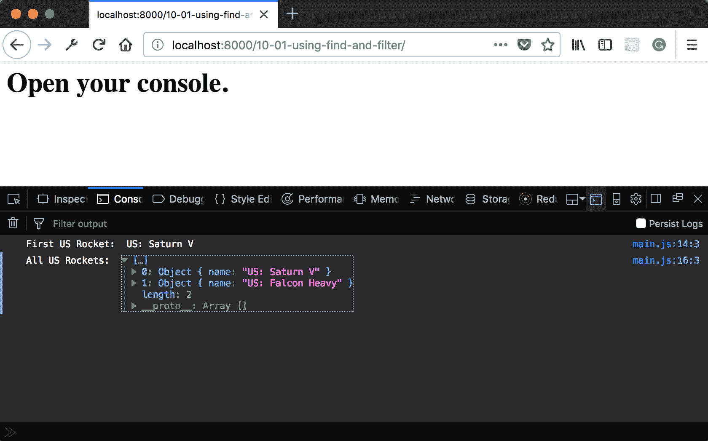
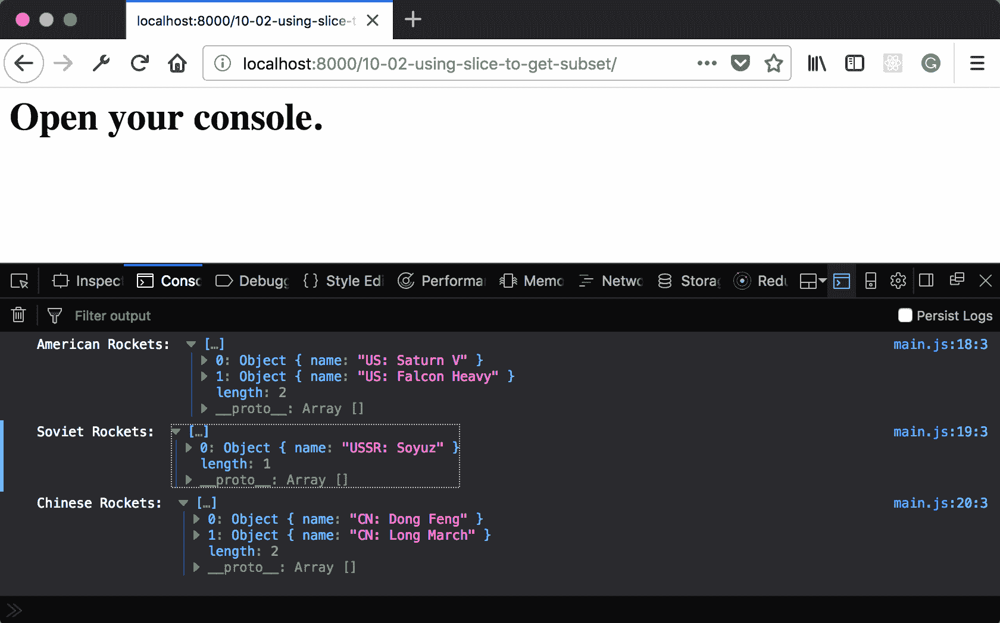
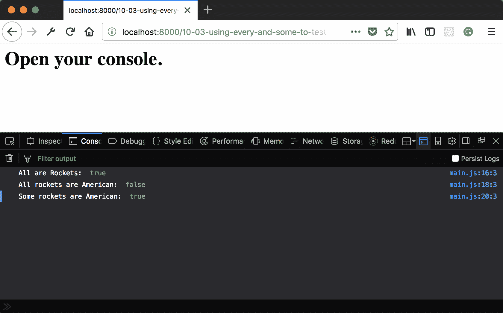
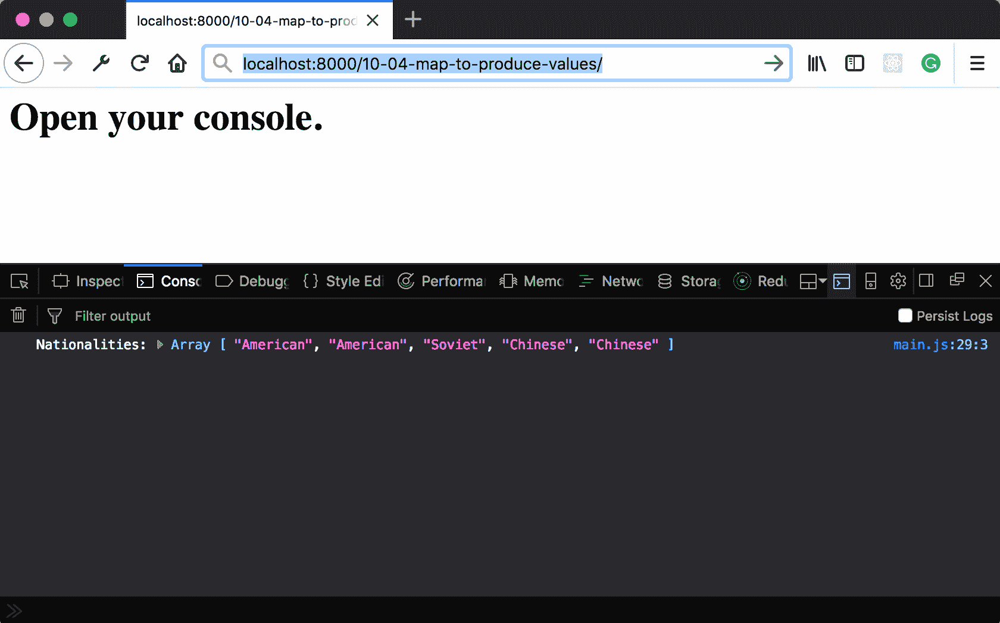
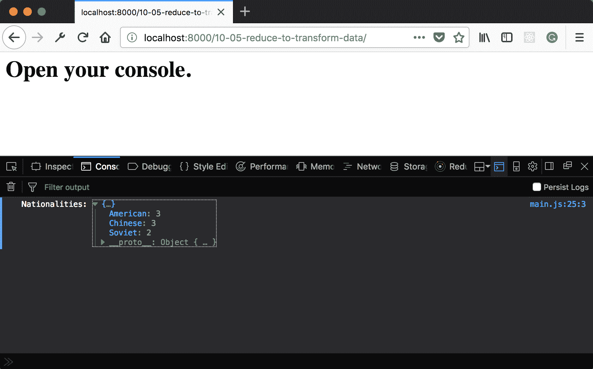
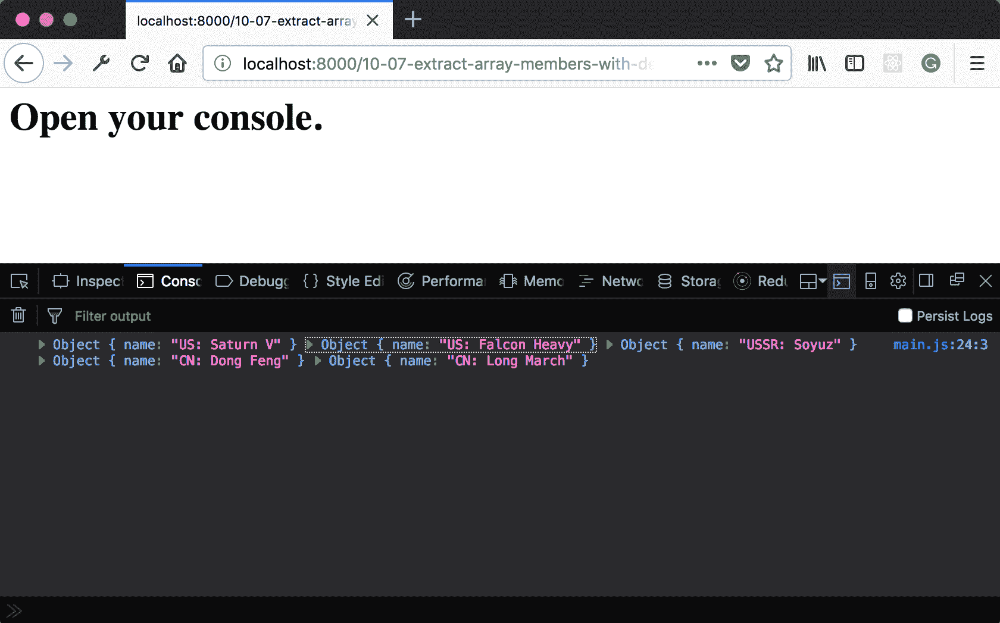
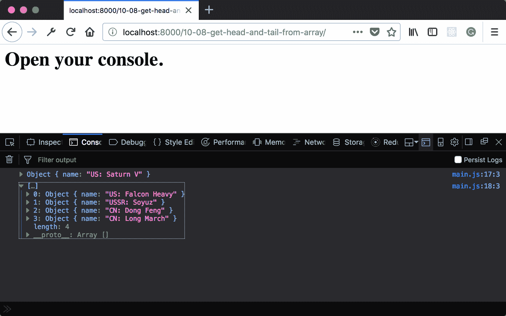

# 第十章：与数组一起工作

在本章中，我们将介绍以下食谱：

+   使用 Array#find 和 Array#filter 在数组中查找值

+   使用 Array#slice 获取数组的子集

+   使用 Array#every 和 Array#some 测试数组值

+   使用 Array.map 生成值

+   使用 Array.reduce 转换数据

+   使用解构提取数组成员

+   使用 rest 运算符获取数组的头和尾

+   使用扩展运算符合并数组

# 简介

数组几乎是每种语言的基本数据结构，JavaScript 也不例外。这些集合的常见任务包括搜索、分割和合并等。直到最近，这意味着要编写很多循环，或者包括实现这些循环的大型库。然而，ES6 包括对 Array API 的扩展，这使得这些任务变得更加容易。

# 使用 Array#find 和 Array#filter 在数组中查找值

在数组中搜索项目时，有时我们搜索单个项目，有时我们搜索符合某些标准的多项项目。Array#find 和 Array#filter 函数旨在简化这一点。

在本食谱中，我们将探讨如何使用这两个函数在数组中定位元素。

# 准备中

本食谱假设您已经有一个允许您在浏览器中创建和运行 ES 模块的 workspace。如果您没有，请参阅前两章。

# 如何做...

1.  打开您的命令行应用程序，并导航到您的 workspace。

1.  创建一个名为 `10-01-using-find-and-filter` 的新文件夹。

1.  复制或创建一个 `index.html`，它从 `main.js` 加载并运行一个 `main` 函数。

1.  创建一个名为 `main.js` 的文件，定义一个新的抽象 `class`，命名为 `Rocket`。在构造时分配一个 `name` 实例属性：

```js
// main.js 
class Rocket { 
  constructor(name) { 
    this.name = name; 
  } 
} 
```

1.  创建一个 `main` 函数，构建几个 `Rocket` 实例：

```js
// main.js 
export function main() { 
  const saturnV = new Rocket('US: Saturn V'); 
  const falconHeavy = new Rocket('US: Falcon Heavy'); 
  const longMarch = new Rocket('CN: Long March'); 
  const rockets = [saturnV, falconHeavy, longMarch]; 
} 
```

1.  使用 `find` 方法定位第一个美国 `Rocket`：

```js
// main.js 
export function main () { 
  // ... 
  const firstUSRocket = rockets.find((rocket) => 
  rocket.name.indexOf('US') === 0); 
  console.log('First US Rocket: ', firstUSRocket.name); 
} 
```

1.  使用 `filter` 方法查找所有 `American Rockets` 实例：

```js
// main.js 
export function main () { 
  // ... 
  const allUSRockets = rockets.filter((rocket) => 
  rocket.name.indexOf('US') === 0); 
  console.log('All US Rockets: ',allUSRockets); 
} 
```

1.  启动您的 Python 网络服务器，并在浏览器中打开以下链接：

    `http://localhost:8000/`.

1.  您将看到以下输出显示：



# 它是如何工作的...

`find` 和 `filter` 方法都接受一个具有单个参数（数组中的项）的函数，并返回一个布尔值。如果函数返回 `true`，则当前项是匹配项。如果返回 `false`，则不是。`find` 方法在找到第一个匹配项后终止并返回该值。`filter` 方法从当前数组创建一个包含所有匹配项的新数组。

在上述食谱中，我们看到 `find` 方法返回第一个被识别为美国的 `Rocket`，而 `filter` 方法返回所有被识别为美国的 `rockets`。

# 使用 Array#slice 获取数组的子集

有时，我们希望根据数组索引而不是数组索引处的数组内容来获取数组的子集。在本菜谱中，我们将探讨如何使用 slice 获取数组的子集。

# 准备工作

本菜谱假设您已经有一个工作空间，允许您在浏览器中创建和运行 ES 模块。如果您没有，请参阅前两章。

# 如何操作...

1.  打开您的命令行应用程序，并导航到您的开发空间。

1.  创建一个名为 `10-02-using-slice-to-get-subset` 的新文件夹。

1.  创建一个 `main.js` 文件，定义一个名为 `Rocket` 的新 `class`，它接受一个构造函数参数 `name` 并将其分配给实例属性：

```js
// main.js 
class Rocket { 
  constructor(name) { 
    this.name = name; 
  } 
   } 
```

1.  创建一个 `main` 函数，创建几个 `Rocket` 实例并将它们放入数组中：

```js
// main.js 
export function main() { 
  const saturnV = new Rocket('US: Saturn V'); 
  const falconHeavy = new Rocket('US: Falcon Heavy'); 
  const soyuz = new Rocket('USSR: Soyuz'); 
  const dongFeng = new Rocket('CN: Dong Feng'); 
  const longMarch = new Rocket('CN: Long March'); 
  const rockets = [saturnV, falconHeavy, soyuz, dongFeng, 
  longMarch]; 
} 
```

1.  根据国家将 `Rockets` 数组划分为三个子集：

```js
// main.js 
export function main() { 
  //....
  const americanRockets = rockets.slice(0, 2); 
  const sovietRockets = rockets.slice(2, 3); 
  const chineseRockets = rockets.slice(3, 5); 
  console.log('American Rockets: ', americanRockets); 
  console.log('Soviet Rockets: ', sovietRockets); 
  console.log('Chinese Rockets: ', chineseRockets); 
}  
```

1.  启动您的 Python 网络服务器并在浏览器中打开以下链接：

    `http://localhost:8000/`。

1.  您应该看到以下输出：



# 工作原理...

**slice** 方法接受两个参数，一个起始索引和一个结束索引。结束索引是非包含的。这意味着新集合将包括从起始索引到结束索引之间的元素，包括起始索引处的元素，但不包括结束索引处的元素。

这可能有点令人困惑，但可以这样考虑。假设起始索引是 2，结束索引是 3。这两个数字之间的差是 1，结果子集中只有一个元素。对于索引 0 和 2，差是 2，结果子集中将有两个元素。

# 使用 Array#every 和 Array#some 测试数组值

有时，我们需要了解整个数组的信息，而不仅仅是单个元素的信息，例如“是否有任何元素满足某些标准？”或“所有元素是否满足某些标准？”。

在本菜谱中，我们将探讨如何使用 `some` 和 `every` 方法来测试数组。

# 准备工作

本菜谱假设您已经有一个工作空间，允许您在浏览器中创建和运行 ES 模块。如果您没有，请参阅前两章。

# 如何操作...

1.  打开您的命令行应用程序，并导航到您的开发空间。

1.  创建一个名为 `10-03-using-every-and-some-to-test-values` 的新文件夹。

1.  创建一个 `main.js` 文件，定义一个名为 `Rocket` 的新 `class`，它接受一个构造函数参数 `name` 并将其分配给实例属性：

```js
// main.js 
class Rocket { 
  constructor(name) { 
    this.name = name; 
  } 
   } 
```

1.  创建一个 `main` 函数，创建几个 `Rocket` 实例并将它们放入数组中：

```js
// main.js 
export function main() { 
  const saturnV = new Rocket('US: Saturn V'); 
  const falconHeavy = new Rocket('US: Falcon Heavy'); 
  const soyuz = new Rocket('USSR: Soyuz'); 
  const dongFeng = new Rocket('CN: Dong Feng'); 
  const longMarch = new Rocket('CN: Long March'); 
  const rockets = [saturnV, falconHeavy, soyuz, dongFeng, 
  longMarch]; 
} 
```

1.  使用 `every` 方法来确定所有成员是否是 `Rocket` 类的实例：

```js
// main.js 
export function main() { 
  //... 
  const allAreRockets = rockets.every((rocket) => rocket 
  instanceof Rocket); 
  console.log('All are Rockets: ', allAreRockets) 
} 
```

1.  使用 `every` 方法来确定所有成员是否是 `American Rockets`：

```js
// main.js 
export function main() { 
  //... 
  const allAmerican = rockets.every((rocket) => 
  rocket.name.indexOf('US:') === 0); 
  console.log('All rockets are American: ', allAmerican); 
} 
```

1.  使用 `some` 方法来确定是否有任何成员是 `American Rockets`：

```js
// main.js 
export function main() { 
  //... 
  const someAmerican = rockets.some((rocket) =>
  rocket.name.indexOf('US:') === 0); 
  console.log('Some rockets are American: ', someAmerican); 
} 
```

1.  启动您的 Python 网络服务器并在浏览器中打开以下链接：

    `http://localhost:8000/`。

1.  您应该看到以下输出：



# 工作原理...

`every` 和 `some` 方法与 `filter` 和 `find` 方法类似。它们接受一个函数，该函数接收一个数组元素作为参数并返回一个布尔值。这个布尔值的真值被 `every` 和 `some` 方法用来减少到一个单一值。`some` 方法在任何一个回调返回 `true` 时立即返回 `true`。`every` 方法遍历所有元素，只有当所有回调都返回 `true` 时才返回 `true`。

# 使用 Array.map 生成值

其他数组操作旨在生成新值。这可以是数组元素的属性或为每个元素计算的其他任何值。`map` 方法遍历每个元素并将值收集到一个新数组中。

在本食谱中，我们将探讨如何使用 `map` 创建一个包含新值的新数组。

# 准备工作

本食谱假设您已经有一个允许您在浏览器中创建和运行 ES 模块的开发空间。如果您没有，请参阅前两章。

# 如何操作...

1.  打开您的命令行应用程序，并导航到您的开发空间。

1.  创建一个名为 `10-04-map-to-produce-values` 的新文件夹。

1.  创建一个名为 `main.js` 的文件，定义一个名为 `Rocket` 的新 `class`，它接受一个构造函数参数 `name` 并将其分配给实例属性：

```js
// main.js 
class Rocket { 
  constructor(name) { 
    this.name = name; 
  } 
   } 
```

1.  创建一个 `main` 函数，创建几个 `Rocket` 实例并将它们放入一个数组中：

```js
// main.js 
export function main() { 
  const saturnV = new Rocket('US: Saturn V'); 
  const falconHeavy = new Rocket('US: Falcon Heavy'); 
  const soyuz = new Rocket('USSR: Soyuz'); 
  const dongFeng = new Rocket('CN: Dong Feng'); 
  const longMarch = new Rocket('CN: Long March'); 
  const rockets = [saturnV, falconHeavy, soyuz, dongFeng, 
  longMarch]; 
} 
```

1.  使用 `map` 方法，并返回每个元素的国籍的字符串表示：

```js
// main.js 
export function main() { 
  //... 
  const nationalities = rockets.map((rocket) => { 
    if (rocket.name.indexOf('USSR:') === 0) { 
      return 'Soviet'; 
    } 
    if (rocket.name.indexOf('CN:') === 0) { 
      return 'Chinese'; 
    } 
    if (rocket.name.indexOf('US:') === 0) { 
      return 'American'; 
    } 

    return 'unknown'; 
  }); 

  console.log('Nationalities:', nationalities) 
} 
```

1.  启动您的 Python 网络服务器，并在浏览器中打开以下链接：

    `http://localhost:8000/`.

1.  您应该看到以下输出：



# 工作原理...

Map 方法与我们所看到的几个其他方法类似。它接受一个函数，该函数接收一个数组元素作为参数并返回某个值。这些值被收集到一个新数组中，该新数组由 map 方法返回。

# 使用 Array.reduce 转换数据

`map` 方法非常适合创建直接映射到现有数组元素的数组。然而，有时所需的结果具有不同的形状。为此，我们可以使用 `reduce` 方法将值累积到新的形式中。

在本食谱中，我们将探讨如何使用 `reduce` 方法来转换数据。

# 准备工作

本食谱假设您已经有一个允许您在浏览器中创建和运行 ES 模块的开发空间。如果您没有，请参阅前两章。

# 如何操作...

1.  打开您的命令行应用程序，并导航到您的开发空间。

1.  创建一个名为 `10-05-reduce-to-transform-data` 的新文件夹。

1.  创建一个名为 `main.js` 的文件，定义一个名为 `Rocket` 的新 `class`，它接受一个构造函数参数 `name` 并将其分配给实例属性：

```js
// main.js 
class Rocket { 
  constructor(name) { 
    this.name = name; 
  } 
   } 
```

1.  创建一个包含国籍字符串数组的 `main` 函数：

```js
// main.js 
export function main() { 
  const nationalities = [ 
    'American', 
    'American', 
    'Chinese', 
    'American', 
    'Chinese', 
    'Chinese', 
    'Soviet', 
    'Soviet' 
  ]; 
} 
```

1.  使用 `reduce` 方法来统计不同的国籍：

```js
// main.js 
export function main() { 
  //... 
const nationalityCount = nationalities.reduce((acc, nationality) => { 
    acc[nationality] = acc[nationality] || 0; 
    acc[nationality] ++; 
    return acc; 
  }, {}); 

  console.log('Nationalities:', nationalityCount); 
} 
```

1.  启动你的 Python 网络服务器，并在浏览器中打开以下链接：

    `http://localhost:8000/`.

1.  你应该看到以下输出：



# 它是如何工作的...

与我们之前看到的其他方法一样，`reduce`方法遍历数组中的每个元素。然而，它接受一组不同的参数。第一个参数是一个接收两个参数的函数，一个累加器和当前元素。这个函数的结果是新的累加值。

第二个参数是累加器的初始值。

在这个菜谱中，累加器被初始化为一个空对象。然后函数使用当前数组值作为键，并增加该键的计数器。这样，我们统计每个键出现的次数。

我们可以看到，与`map`不同，结果数据形状与初始数组不同。

# 使用解构提取数组成员

直接索引数组相对简单。语法对所有但最新手开发者来说都很熟悉。然而，同样熟悉的是*索引错误*。这意味着数组或集合被错误地索引了一个位置。在某些情况下，这会导致立即可识别的错误。其他时候，它会导致更微妙错误。

在这个菜谱中，我们将探讨如何使用解构语法提取数组的成员。

# 准备工作

这个菜谱假设你已经有一个工作区，允许你在浏览器中创建和运行 ES 模块。如果你没有，请参考前两章。

# 如何操作...

1.  打开你的命令行应用程序，并导航到你的工作区。

1.  创建一个名为`10-06-extract-array-members-with-destructuring`的新文件夹。

1.  创建一个`main.js`文件，定义一个名为`Rocket`的新`class`，它接受一个构造函数参数`name`并将其分配给实例属性：

```js
// main.js 
class Rocket { 
  constructor(name) { 
    this.name = name; 
  } 
   } 
```

1.  创建一个包含火箭数组的`main`函数：

```js
// main.js 
export function main() { 
  const rockets = [ 
    new Rocket('US: Saturn V'), 
    new Rocket('US: Falcon Heavy'), 
    new Rocket('USSR: Soyuz'), 
    new Rocket('CN: Dong Feng'), 
    new Rocket('CN: Long March') 
  ] 
}  
```

1.  使用解构语法将每个成员分配给局部变量：

```js
// main.js 
export function main() { 
  //... 
  const [ 
    saturnV, 
    falconHeavy, 
    soyuz, 
    dongFeng, 
    longMarch 
  ] = rockets; 

  console.log(saturnV, falconHeavy, soyuz, dongFeng, longMarch); 
} 
```

1.  启动你的 Python 网络服务器，并在浏览器中打开以下链接：

    `http://localhost:8000/`.

1.  你应该看到以下输出：



# 它是如何工作的...

上述菜谱展示了如何使用解构语法为数组中的元素创建单个变量。解构语法反映了相应数组的索引。因此，变量名将与数组中相应位置的元素关联。零^(th)位置的名称将在数组的开始处分配一个值。位置 1 的名称将分配下一个值，依此类推。

因此，我们可以看到上面我们为`rockets`数组中的每个元素命名。提取的每个元素的值与相应的火箭相匹配。

# 使用剩余操作符获取数组的头和尾

使用解构来挑选元素很方便，但我们并不总是想要取出每个元素。一个常用的模式是将数组的零元素分配给一个变量，其余的元素分配给另一个变量。这通常被称为数组的头和尾。

在这个食谱中，我们将看看如何使用剩余操作符来获取数组的头和尾。

# 准备工作

这个食谱假设你已经有一个允许你在浏览器中创建和运行 ES 模块的工作区。如果没有，请参考前两章。

# 如何做...

1.  打开你的命令行应用程序，并导航到你的工作区。

1.  创建一个名为 `10-07-get-head-and-tail-from-array` 的新文件夹。

1.  创建一个 `main.js` 文件，定义一个名为 `Rocket` 的新 `class`，它接受一个构造函数参数 `name` 并将其分配给实例属性：

```js
// main.js 
class Rocket { 
  constructor(name) { 
    this.name = name; 
  } 
   } 
```

1.  创建一个包含火箭数组的 `main` 函数：

```js
// main.js 
export function main() { 
  const rockets = [ 
    new Rocket('US: Saturn V'), 
    new Rocket('US: Falcon Heavy'), 
    new Rocket('USSR: Soyuz'), 
    new Rocket('CN: Dong Feng'), 
    new Rocket('CN: Long March') 
  ] 
}  
```

1.  使用解构语法和剩余操作符来获取数组的头和尾：

```js
// main.js 
export function main() { 
  //... 
  const [saturnV, ...otherRockets] = rockets; 
  console.log(saturnV); 
  console.log(otherRockets) 
} 
```

1.  启动你的 Python 网络服务器，并在浏览器中打开以下链接：

    `http://localhost:8000/`.

1.  你应该看到以下输出：



# 它是如何工作的...

第一个元素 `saturnV` 的工作方式与前面的食谱相同。剩余操作符表示剩余的元素应该分配给 `otherRockets` 变量。由于它不一定是单个元素，这将是一个数组。

应该注意的是，剩余操作符必须是解构语法的最后一个成员。如果它后面跟着一个逗号，你将收到一个解析错误。

# 使用展开操作符合并数组

我们已经看到了如何使用一些新的语法来从数组中提取元素。同样，也有一些新的工具用于合并数组。如我们所见，展开操作符的使用与剩余操作符类似。

在这个食谱中，我们将看看如何使用展开操作符来合并数组。

# 准备工作

这个食谱假设你已经有一个允许你在浏览器中创建和运行 ES 模块的工作区。如果没有，请参考前两章。

# 如何做...

1.  打开你的命令行应用程序，并导航到你的工作区。

1.  创建一个名为 `10-08-combine-arrays-using-spread` 的新文件夹。

1.  创建一个 `main.js` 文件，定义一个名为 `Rocket` 的新 `class`，它接受一个构造函数参数 `name` 并将其分配给实例属性：

```js
// main.js 
class Rocket { 
  constructor(name) { 
    this.name = name; 
  } 
   } 
```

1.  创建一个 `main` 函数，包含多个按国籍划分的火箭数组，以及一个独立的 `Rocket` 变量：

```js
// main.js 
export function main() { 
  const usRockets= [ 
    new Rocket('US: Saturn V'), 
    new Rocket('US: Falcon Heavy') 
  ]; 

  const sovietRocket = new Rocket('USSR: Soyuz'); 

  const chineseRockets = [ 
    new Rocket('CN: Dong Feng'), 
    new Rocket('CN: Long March') 
  ]; 
}  
```

1.  使用解构语法和展开操作符将火箭合并成一个单独的数组：

```js
// main.js 
export function main() { 
  //... 
  const rockets = [...usRockets, sovietRocket, 
  ...chineseRockets]; 
  console.log(rockets); 
} 
```

1.  启动你的 Python 网络服务器，并在浏览器中打开以下链接：

    `http://localhost:8000/`.

1.  你应该看到以下输出：


# 它是如何工作的...

我认为剩余操作符的方式是将其集合的成员 *展开* 到当前集合中。在先前的菜谱中，这意味着 `usRockets` 和 `chineseRockets` 的成员被展开到新数组 `rockets` 中。

这种扩展意味着它们可以在创建新数组时与独立的 `sovietRocket` 在相同的语法级别上进行引用。这种将元素组合成新结构的过程有时被称为 *结构化*，与 *解构化* 术语相对应。
