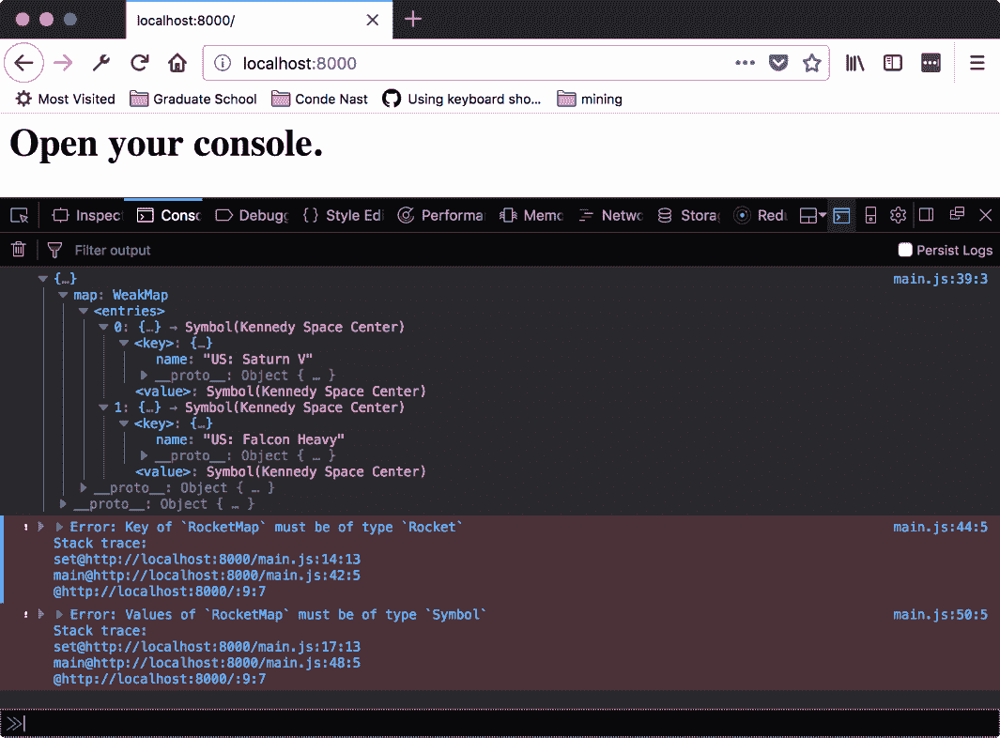

# 与 Maps 和 Symbols 一起工作

在本章中，我们将介绍以下配方：

+   使用 Symbol 创建局部实例

+   使用 `Symbol.for` 创建全局实例

+   使用 Symbol 模拟枚举

+   从 Map 中设置和删除条目

+   从现有数据创建 Map

+   创建一个包装 Map 以与特定复杂类型一起工作的类

+   从 WeakMap 中设置和删除条目

+   从现有数据创建 WeakMap

+   创建一个使用 WeakMap 与特定复杂类型一起工作的类

# 简介

我们看到了如何使用 ECMAScript 经典语义简洁地表达数据与操作之间更复杂的关系。我们还看到了如何利用现有类型（对象和数组）的扩展 API。然而，ECMAScript 还有更多要提供。在新的类型中包括 `Symbol`、`Map` 以及 `Map` 的表亲 `WeakMap`。这些类型在一定程度上可以在 JavaScript 的早期版本中模拟，但现在它们是现成的并且有原生支持。

本章中的配方将展示这些类型的一些用法，包括一起使用和单独使用。

# 使用 Symbol 创建局部实例

单独使用 `Symbol` 并不是特别有用，但它们作为其他数据结构的键非常有用。它们非常适合作为键，因为可以限制对其值的访问。这些比较有两种工作方式。我们可以创建局部符号，它们是唯一的，可以在初始化后重新创建，以及全局符号，可以通过其构造函数值进行引用。

在这个配方中，我们将看看如何使用 `Symbol` 作为函数来创建局部符号。这意味着即使使用相同的参数，每个实例也将是新的。

# 准备工作

此配方假设您已经有一个工作区，允许您在浏览器中创建和运行 ES 模块。如果您没有，请参阅前两章。

# 如何做到这一点...

1.  打开您的命令行应用程序并导航到您的 workspace。

1.  创建一个名为 `11-01-local-symbols` 的新文件夹。

1.  复制或创建一个 `index.html` 文件，该文件加载并运行来自 `main.js` 的 `main` 函数。

1.  创建一个 `main.js` 文件，该文件定义一个 `main` 函数，使用相同的参数创建几组符号。按照以下方式打印出它们的相等性：

```js
// main.js 
export function main() {
    const usLaunchLocation = Symbol.for('Kennedy Space Center');
    const duplicateLaunchLocation = Symbol.for('Kennedy Space 
    Center');
    console.log(usLaunchLocation, duplicateLaunchLocation);
    console.log('Identical launch locations: ', usLaunchLocation 
    === duplicateLaunchLocation);
    const rocketNumber = Symbol.for(5);
    const duplicateRocketNumber = Symbol.for(5);
    const stringDuplicateRocketNumber = Symbol.for("5");
    console.log(rocketNumber, duplicateRocketNumber, 
    stringDuplicateRocketNumber);
    console.log('Identical rocket numbers: ', rocketNumber === 
    duplicateRocketNumber);
    console.log(
        'Identical string rocket numbers: ',
        rocketNumber ===    stringDuplicateRocketNumber
    );
}
```

1.  使用 `Symbol.keyFor` 记录火箭数字 `Symbol` 的 `key`：

```js
// main.js
export function main() {
    // ...
    console.log(Symbol.keyFor(rocketNumber), 
    Symbol.keyFor(stringDuplicateRocketNumber));
    // print type
    console.log(
        typeof Symbol.keyFor(rocketNumber),
        typeof Symbol.keyFor(stringDuplicateRocketNumber)
    )
}
```

1.  启动您的 Python 网络服务器，并在您的浏览器中打开以下链接：

    `http://localhost:8000/`。

1.  您应该看到以下输出：


# 它是如何工作的...

当使用 `Symbol.for` 方法创建一个 `Symbol` 时，返回的实例可能是一个预存在的实例。当我们使用相同的字符串和数字值创建一个 `Symbol` 时，我们可以看到这一点。当提供一个数字作为字符串时，我们甚至可以看到相同的实例。

当打印出键的类型时，我们可以看到为什么数字匹配，即使参数是字符串也是如此。当我们检索一个数值键时，它会被转换为字符串，因此与数字的字符串表示形式等效。

# 使用 Symbol.for 创建全局实例

我们已经看到了如何创建唯一的符号，用作局部上下文中的键。然而，有时我们希望能够与数据结构进行交互。在这种情况下，符号也可以被用来工作。

# 准备工作

本食谱假设您已经有一个工作区，允许您在浏览器中创建和运行 ES 模块。如果您没有，请参考前两章。

# 如何操作...

1.  打开您的命令行应用程序并导航到您的工作区。

1.  创建一个名为 `11-02-symbol-for-global` 的新文件夹。

1.  复制或创建一个 `index.html`，该文件加载并运行来自 `main.js` 的 `main` 函数。

1.  创建一个 `main.js` 文件，该文件定义了一个创建几组 Symbols 的 `main` 函数，使用 `Symbol.for`，带有字符串和数字参数。比较数字符号与字符串形式的数字：

```js
// main.js 
export function main() { 
  const usLaunchLocation = Symbol.for('Kennedy Space Center'); 
  const duplicateLaunchLocation = Symbol.for('Kennedy Space 
  Center'); 
  console.log(usLaunchLocation, duplicateLaunchLocation); 
  console.log('Identical launch locations: ', usLaunchLocation 
  === duplicateLaunchLocation); 

  const rocketNumber = Symbol.for(5); 
  const duplicateRocketNumber = Symbol.for(5); 
  const badDuplicateRocketNumber = Symbol.for('5'); 
  console.log(rocketNumber, duplicateRocketNumber, 
  badDuplicateRocketNumber); 
  console.log('Identical rocket numbers: ', rocketNumber === 
  duplicateRocketNumber); 
  console.log('Identical bad rocket numbers: ', rocketNumber 
  === duplicateRocketNumber); 
}  
```

1.  启动您的 Python 网络服务器并在浏览器中打开以下链接：

    `http://localhost:8000/`.

1.  您应该看到以下输出：


# 它是如何工作的...

`slice` 方法接受两个参数，一个起始索引和一个结束索引。结束索引是非包含的。这意味着新集合将包括起始索引和结束索引之间的元素，包括起始索引处的元素，但不包括结束索引处的元素。

这可能看起来有点令人困惑，但可以这样想，考虑起始索引是两个，结束索引是三个。这两个数字之间的差值是一，结果子集中只有一个元素。对于索引 *0* 和 *2*，差值是两个，结果子集中将有两个元素。

# 使用 Symbol 模拟枚举

我们已经看到了如何创建可以在全局访问的 `Symbol`，以及那些不能在初始上下文之外访问的 `Symbol`。现在，我们将看到如何使用它们来创建在 JavaScript 早期版本中实际上不可能实现的功能。

在这个食谱中，我们将使用局部 `Symbol` 来模拟许多其他语言中可用的类型，枚举。

# 准备工作

本食谱假设您已经有一个工作区，允许您在浏览器中创建和运行 ES 模块。如果您没有，请参考前两章。

# 如何操作...

1.  打开您的命令行应用程序并导航到您的工作区。

1.  创建一个名为 `11-03-symbols-simulate-enums` 的新文件夹。

1.  创建一个名为 `main.js` 的文件，该文件定义了一个名为 `LaunchSite` 的新 `object`，对象的属性值应该是本地的 `Symbols`：

```js
// main.js 
const LaunchSite = { 
  KENNEDY_SPACE_CENTER: Symbol('Kennedy Space Center'), 
  WHITE_SANDS: Symbol('White Sands Missile Range'), 
  BAIKONUR: Symbol('Baikonur Cosmodrome'), 
  BROGLIO: Symbol('Broglio Space Center'), 
  VIKRAM_SARABHAI: Symbol('Vikram Sarabhai Space Centre') 
}   
```

1.  创建一个 `main` 函数并比较枚举条目的值：

```js
// main.js 
export function main() { 
  console.log("Kennedy Space Center Site: ", LaunchSite.KENNEDY_SPACE_CENTER); 
  console.log("Duplicate String: ", LaunchSite.KENNEDY_SPACE_CENTER === 'Kennedy Space Center'); 
  console.log("Duplicate Symbol: ", LaunchSite.KENNEDY_SPACE_CENTER === Symbol('Kennedy Space Center')); 
  console.log("Duplicate Global Symbol: ", LaunchSite.KENNEDY_SPACE_CENTER === Symbol.for('kennedy Space Center')); 
}  
```

1.  启动您的 Python 网络服务器并在浏览器中打开以下链接：

    `http://localhost:8000/`.

1.  您应该看到以下输出：


# 它是如何工作的...

如前所述，局部 `Symbol` 实例每次创建时都是唯一的。因此，我们无法在 `main` 函数中重新创建 `Symbol` 值。这意味着任何期望从该枚举中获取值的代码都不能用等效值强制转换。

枚举类型的一个有用用途是作为选项。想象一个选项对象，其中一个选项需要能够接受多个值（比如动画缓动）。字符串值可以完成这项工作，但很容易出错。使用枚举，函数的用户必须引用该枚举；这在阅读时更不脆弱且更清晰。

# 在映射中设置和删除条目

本章的其余部分将专注于 ECMAScript 中添加的新数据结构。在一定程度上，它们可以在 ES5 中模拟。然而，原生的支持和明确的命名使得利用这些特性的代码更高效且更清晰。

在这个菜谱中，我们将查看使用 `set` 和 `delete` 方法添加和删除 `Map` 条目的基本方法。

# 准备工作

这个菜谱假设你已经有一个允许你在浏览器中创建和运行 ES 模块的 workspace。如果你没有，请参考前两章。

# 如何做到这一点...

1.  打开你的命令行应用程序并导航到你的 workspace。

1.  创建一个名为 `11-04-set-and-delete-from-map` 的新文件夹。

1.  创建一个名为 `main.js` 的文件，定义一个名为 `Rocket` 的新 `class`，它接受一个构造函数参数 `name` 并将其分配给实例属性：

```js
// main.js 
class Rocket { 
  constructor(name) { 
    this.name = name; 
  } 
   } 
```

1.  创建一个包含不同发射站的枚举：

```js
// main.js 
const LaunchSite = { 
  KENNEDY_SPACE_CENTER: Symbol('Kennedy Space Center'), 
  JUIQUAN: Symbol('Jiuquan Satellite Launch Center'), 
  WHITE_SANDS: Symbol('Jiuquan Satellite Launch Center'), 
  BAIKONUR: Symbol('Baikonur Cosmodrome') 
}  
```

1.  创建一个 `main` 函数。在该函数中，使用 `set` 和 `delete` 方法来操作发射站到火箭的条目：

```js
// main.js 
export function main() { 
  const rocketSiteMap = new Map(); 

  rocketSiteMap.set(LaunchSite.KENNEDY_SPACE_CENTER, new Rocket('US: 
  Saturn V')); 
  const falconHeavy = new Rocket('US: Falcon Heavy'); 
  rocketSiteMap.set(LaunchSite.WHITE_SANDS, falconHeavy); 
  console.log(rocketSiteMap.get(LaunchSite.KENNEDY_SPACE_CENTER)); 
  console.log(rocketSiteMap.get(LaunchSite.WHITE_SANDS)); 

  rocketSiteMap.set(LaunchSite.KENNEDY_SPACE_CENTER, new Rocket('US: 
  Space Shuttle')); 
  rocketSiteMap.delete(LaunchSite.WHITE_SANDS); 
  console.log(rocketSiteMap.get(LaunchSite.KENNEDY_SPACE_CENTER)); 
  console.log(rocketSiteMap.get(LaunchSite.WHITE_SANDS));} 

```

1.  启动你的 Python 网络服务器并在你的浏览器中打开以下链接：

    `http://localhost:8000/`.

1.  你应该看到以下输出：


# 它是如何工作的...

映射是一个 `key` 和 `value` 的配对。当调用 `Map` 实例方法时，键引用值。这种配对是一对一的；这意味着每个键只能有一个值。因此，当我们设置另一个火箭到 `KENNEDY_SPACE_CENTER` 键时，旧值将被替换。

`delete` 方法删除与 `key` 对应的条目。因此，在 `delete` 之后，该特定条目是未定义的。

# 从现有数据创建映射

我们刚刚看到了如何逐个向映射中添加值。然而，这可能会很繁琐。例如，如果我们正在处理一个可能非常大或事先未知的数据集，那么用函数调用初始化映射而不是几百或几千个值会更好。

在这个菜谱中，我们将查看如何使用预存数据创建一个新的映射。

# 准备工作

这个菜谱假设你已经有一个允许你在浏览器中创建和运行 ES 模块的 workspace。如果你没有，请参考前两章。

# 如何做到这一点...

1.  打开您的命令行应用程序并导航到您的 workspace。

1.  创建一个名为 `11-05-create-map-from-data` 的新文件夹。

1.  创建一个名为 `main.js` 的文件，该文件定义了一个名为 `Rocket` 的新 `class`，它接受一个构造函数参数 `name` 并将其分配给实例属性：

```js
// main.js 
class Rocket { 
  constructor(name) { 
    this.name = name; 
  } 
   } 
```

1.  创建一个各种发射场的枚举：

```js
// main.js 
const LaunchSite = { 
  KENNEDY_SPACE_CENTER: Symbol('Kennedy Space Center'), 
  JUIQUAN: Symbol('Jiuquan Satellite Launch Center'), 
  WHITE_SANDS: Symbol('Jiuquan Satellite Launch Center'), 
  BAIKONUR: Symbol('Baikonur Cosmodrome') 
}  
```

1.  创建一个 `main` 函数。在该函数中，创建一个包含发射场和火箭键值对的映射：

```js
// main.js 
export function main() { 
  const rocketSites = [ 
    [ LaunchSite.KENNEDY_SPACE_CENTER, new Rocket('US: Saturn 
    V'),], 
    [ LaunchSite.WHITE_SANDS, new Rocket('US: Falcon Heavy') ], 
    [ LaunchSite.BAIKONUR, new Rocket('USSR: Soyuz') ], 
    [ LaunchSite.JUIQUAN, new Rocket('CN: Long March') ] ] 

  const rocketSiteMap = new Map(rocketSites); 
  console.log(rocketSiteMap) 
} 
```

1.  启动您的 Python 网络服务器并在浏览器中打开以下链接：

    `http://localhost:8000/`。

1.  您应该看到以下输出：


# 它是如何工作的...

如前所述，映射是 `key` 和 `value` 之间的配对。`Map` 构造函数期望一个可迭代的键值对集合。在前面的配方中，我们传递了一个二维数组。外部维度是包含多个条目的可迭代。

内部维度是键值对。键值对的第一成员是发射场。第二成员是 `value`（在我们的情况下，是一个 `Rocket`）。`Map` 构造函数遍历提供的条目并在每个之间创建配对。

# 创建一个包装 `Map` 以处理特定复杂类型的类

当处理大量集合时，了解在挑选成员时可以期望哪种类型的对象是很不错的。通常，JavaScript 集合是异构的，这意味着可以使用任何类型。在 `Map` 的情况下，这意味着 `key` 或 `value` 可以采用任何类型。

在这个配方中，我们将看看如何创建 `Map` 的包装类，以便控制 `Map` 中使用的类型。

# 准备工作

此配方假设您已经有一个工作区，允许您在浏览器中创建和运行 ES 模块。如果您没有，请参阅前两章。

# 如何做...

1.  打开您的命令行应用程序并导航到您的 workspace。

1.  创建一个名为 `11-06-create-class-to-wrap-map` 的新文件夹。

1.  创建一个名为 `main.js` 的文件，该文件定义了一个名为 `Rocket` 的新 `class`，它接受一个构造函数参数 `name` 并将其分配给实例属性：

```js
// main.js 
class Rocket { 
  constructor(name) { 
    this.name = name; 
  } 
   } 
```

1.  创建一个名为 `RocketSiteMap` 的类文件，该文件创建一个新的映射并将其作为构造函数中的实例属性分配：

```js
// main.js 
class RocketSiteMap { 
  constructor () { 
    this.map = new Map(); 
     }    
   } 
```

1.  添加一个检查 `key` 和 `value` 参数类型的 `set` 方法。如果参数类型不正确，则该方法应抛出错误，否则将键值对作为映射上的条目设置：

```js
// main.js 
class RocketSiteMap { 
  set (site, rocket) { 
    if (!(rocket instanceof Rocket)) { 
      throw new Error('Value of `RocketMap` must be of type 
      `Rocket`'); 
    } 
    else if (typeof site !== 'symbol') { 
      throw new Error('Key of `RocketMap` must be of type 
      `Symbol`'); 
    } 

    this.map.set(site, rocket); 
  }   
   } 
```

1.  添加一个返回映射中 `key` 的条目的 `get` 方法：

```js
// main.js 
class RocketSiteMap { 
  get (key) { 
    return this.get(key); 
   } 
```

1.  创建一个各种发射场的枚举：

```js
// main.js 
const LaunchSite = { 
  KENNEDY_SPACE_CENTER: Symbol('Kennedy Space Center'), 
  JUIQUAN: Symbol('Jiuquan Satellite Launch Center'), 
  WHITE_SANDS: Symbol('Jiuquan Satellite Launch Center'), 
  BAIKONUR: Symbol('Baikonur Cosmodrome') 
}  
```

1.  创建一个 `main` 函数。尝试将各种 `key` 和 `value` 对设置到 `RocketMap` 的实例中：

```js
// main.js 
export function main() { 
  const rocketSiteMap = new RocketSiteMap(); 
  rocketSiteMap.set(LaunchSite.KENNEDY_SPACE_CENTER, new Rocket('US: 
  Saturn V')); 
  rocketSiteMap.set(LaunchSite.WHITE_SANDS, new Rocket('US: Falcon 
  Heavy')); 
  console.log(rocketSiteMap) 

  try { 
    rocketSiteMap.set(LaunchSite.KENNEDY_SPACE_CENTER, 'Buzz 
    Lightyear'); 
  } catch (e) { 
    console.error(e); 
  } 

  try { 
    rocketSiteMap.set('Invalid Lanch Site', new Rocket('Long 
    March')); 
  } catch (e) { 
    console.error(e); 
  } 
} 
```

1.  启动您的 Python 网络服务器并在浏览器中打开以下链接：

    `http://localhost:8000/`。

1.  您应该看到以下输出：


# 它是如何工作的...

从 `set` 方法的实现中，我们可以看到正在检查参数的类型。`Symbol` 作为一种类型，没有构造函数，所以我们不能使用 `instanceof` 操作符，但 `typeof` 操作符返回一个 `symbol` 字符串，我们可以检查它。`Rocket` 实例的行为类似于我们在其他食谱中看到的其他实例，并且可以像它们一样进行检查。

当将错误类型作为参数传递给 `set` 时，其中一个条件将触发并抛出错误。

# 从 WeakMap 中设置和删除条目

我们已经看到了如何在各种情况下使用 Maps。在 ECMAScript 中还有一个新的类，其行为非常相似，但有一些有用的属性。`WeakMap`，就像 `Map` 一样，是一个键值数据结构。

在本食谱中，我们将探讨如何使用 `set` 和 `delete` 方法向 `WeakMap` 添加和删除元素。我们还将看到它们与 `Map` 类的区别。

# 准备工作

本食谱假设您已经有一个允许您在浏览器中创建和运行 ES 模块的 workspace。如果您没有，请参阅前两章。

# 如何操作...

1.  打开您的命令行应用程序并导航到您的 workspace。

1.  创建一个名为 `11-07-set-and-delete-from-weakmap` 的新文件夹。

1.  创建一个 `main.js` 文件，定义一个名为 `Rocket` 的新 `class`，它接受一个构造函数参数 `name` 并将其分配给实例属性：

```js
// main.js 
class Rocket { 
  constructor(name) { 
    this.name = name; 
  } 
   } 
```

1.  创建一个各种发射场的 `enum`：

```js
// main.js 
const LaunchSite = { 
  KENNEDY_SPACE_CENTER: Symbol('Kennedy Space Center'), 
  JUIQUAN: Symbol('Jiuquan Satellite Launch Center'), 
  WHITE_SANDS: Symbol('Jiuquan Satellite Launch Center'), 
  BAIKONUR: Symbol('Baikonur Cosmodrome') 
} 
```

1.  创建一个 `main` 函数。在该函数中，使用 `set` 和 `delete` 方法来操作发射场到火箭的条目。尝试使用 `Symbol` 作为键：

```js
// main.js 
export function main() { 
  const falconHeavy = new Rocket('US: Falcon Heavy'); 
  const rocketSiteMap = new WeakMap(); 

  rocketSiteMap.set(new Rocket('US: Saturn V'), 
  LaunchSite.KENNEDY_SPACE_CENTER); 
  rocketSiteMap.set(falconHeavy, 
  LaunchSite.KENNEDY_SPACE_CENTER); 
  console.log(rocketSiteMap) 

  rocketSiteMap.delete(falconHeavy); 
  console.log(rocketSiteMap) 

  // try to set with a symbol; expect error 
  rocketSiteMap.set(LaunchSite.KENNEDY_SPACE_CENTER, falconHeavy); 
} 
```

1.  启动您的 Python 网络服务器并在浏览器中打开以下链接：

    `http://localhost:8000/`.

1.  您应该看到以下输出：


# 它是如何工作的...

与 `Map` 的实例类似，`WeakMap` 实例是 `key` 和 `value` 之间的配对。然而，关键的区别在于可以用于键的类型。`Map` 可以使用任何类型作为键。`WeakMap` 只能将 `Object` 类型的值作为键。这有助于 `WeakMap` 更高效。

`WeakMap` 可以更高效的原因与内存管理和垃圾回收有关。考虑一下，Map 条目必须保留在程序的整个生命周期内。由于它们可以使用原始类型作为键（布尔值、字符串、数字和符号），这些值可以被重新创建，并且那些 Map 条目可以在任何时间被引用。

与之相比，`WeakMap` 的键只能为 `Object` 类型。`Object` 值不能被重新创建；具有相同值的对象仍然是不同的实例。这意味着 `WeakMap` 的条目只能在使用键的引用可用时访问；一旦该引用丢失，条目就再也无法访问。

由于键值没有任何现有的引用，因此条目不再可访问。这意味着条目可以从内存中释放（保留未使用的值没有意义）。这允许垃圾回收器释放该内存。

请参阅 Mozilla 文档以获取有关 `WeakMap` 的更多信息：

[`developer.mozilla.org/en-US/docs/Web/JavaScript/Reference/Global_Objects/WeakMap`](https://developer.mozilla.org/en-US/docs/Web/JavaScript/Reference/Global_Objects/WeakMap).

# 从现有数据创建 WeakMap

我们刚刚看到了如何将值逐个添加到 `WeakMap` 中，以及为什么它与 `Map` 不同。然而，逐个创建 `WeakMap` 可能会很繁琐。

在这个配方中，我们将看看如何创建一个新的 `Map`，其中包含现有的数据。

# 准备工作

这个配方假设你已经有一个允许你在浏览器中创建和运行 ES 模块的 workspace。如果你没有，请参阅前两章。

如果你还不熟悉 `WeakMap` 类，请参阅 *从 WeakMap 中设置和删除条目* 的配方。

# 如何操作...

1.  打开你的命令行应用程序并导航到你的 workspace。

1.  创建一个名为 `11-08-create-weakmap-from-data` 的新文件夹。

1.  创建一个 `main.js` 文件，定义一个名为 `Rocket` 的新类，该类接受一个构造函数参数 `name` 并将其分配给实例属性：

```js
// main.js 
class Rocket { 
  constructor(name) { 
    this.name = name; 
  } 
   } 
```

1.  创建一个各种发射站的枚举：

```js
// main.js 
const LaunchSite = { 
  KENNEDY_SPACE_CENTER: Symbol('Kennedy Space Center'), 
  JUIQUAN: Symbol('Jiuquan Satellite Launch Center'), 
  WHITE_SANDS: Symbol('Jiuquan Satellite Launch Center'), 
  BAIKONUR: Symbol('Baikonur Cosmodrome') 
}  
```

1.  创建一个 `main` 函数。在该函数中，创建一个包含发射站和火箭键值对的映射：

```js
// main.js 
export function main() { 
  const rocketSites = [ 
    [ new Rocket('US: Saturn V'), LaunchSite.KENNEDY_SPACE_CENTER 
    ], 
    [ new Rocket('US: Falcon Heavy'), LaunchSite.WHITE_SANDS ], 
    [ new Rocket('USSR: Soyuz'), LaunchSite.BAIKONUR ], 
    [ new Rocket('CN: Dong Feng'), LaunchSite.JUIQUAN ], 
    [ new Rocket('CN: Long March'), LaunchSite.JUIQUAN ] ]; 

  const rocketSiteMap = new WeakMap(rocketSites); 
  console.log(rocketSiteMap); 
} 
```

1.  启动你的 Python 网络服务器并在浏览器中打开以下链接：

    `http://localhost:8000/`.

1.  你应该看到以下输出：


# 它是如何工作的...

没有惊喜，`WeakMap` 构造函数遵循与 `Map` 相同的接口。唯一的区别是对 `key` 的类型限制。构造函数的参数是一个二维数组，其中外维是条目列表。内维表示键值对。内维的第一个成员是 `key`，第二个是 `value`。

# 创建一个使用 WeakMap 与特定复杂类型一起工作的类

就像 `Map` 一样，了解 `WeakMap` 集合中预期的类型可能会有所帮助。`key` 类型受到轻微的限制，但仍然相当宽松，对值的类型没有限制。

在这个配方中，我们将看看如何创建一个包装类来控制 `WeakMap` 中使用的类型。

# 准备工作

这个配方假设你已经有一个允许你在浏览器中创建和运行 ES 模块的 workspace。如果你没有，请参阅前两章。

如果你还不熟悉 `WeakMap` 类，请参阅 *从 WeakMap 中设置和删除条目* 的配方。

# 如何操作...

1.  打开你的命令行应用程序并导航到你的 workspace。

1.  创建一个名为 `11-09-create-class-to-wrap-weakmap` 的新文件夹。

1.  创建一个 `main.js` 文件，该文件定义了一个名为 `Rocket` 的新 `class`，它接受一个构造函数参数 `name` 并将其分配给实例属性：

```js
// main.js 
class Rocket { 
  constructor(name) { 
    this.name = name; 
  } 
} 
```

1.  创建一个名为 `RocketSiteMap` 的类文件，该文件创建一个新的映射并将其作为实例属性分配给构造函数：

```js
// main.js 
class RocketSiteMap { 
  constructor () { 
    this.map = new WeakMap(); 
     }    
   } 
```

1.  添加一个检查 `key` 和 `value` 参数类型的 `set` 方法。如果参数类型不正确，则该方法应抛出异常，否则将键值对作为映射的条目设置：

```js
// main.js 
class RocketSiteMap { 
set (rocket, site) { 
    if (!(rocket instanceof Rocket)) { 
      throw new Error('Key of `RocketMap` must be of type 
      `Rocket`'); 
    } 
    else if (typeof site !== 'symbol') { 
      throw new Error('Values of `RocketMap` must be of type 
      `Symbol`'); 
    } 

    this.map.set(rocket, site); 
  } 

  get (key) { 
    return this.get(key); 
     } 
   } 
```

1.  添加一个 `get` 方法，该方法从映射中返回 `key` 的条目：

```js
// main.js 
class RocketSiteMap { 
  get (key) { 
    return this.get(key); 
   } 
```

1.  创建一个包含各种发射场枚举：

```js
// main.js 
const LaunchSite = { 
  KENNEDY_SPACE_CENTER: Symbol('Kennedy Space Center'), 
  JUIQUAN: Symbol('Jiuquan Satellite Launch Center'), 
  WHITE_SANDS: Symbol('Jiuquan Satellite Launch Center'), 
  BAIKONUR: Symbol('Baikonur Cosmodrome') 
}  
```

1.  创建一个 `main` 函数。尝试将各种 `key` 和 `value` 对设置到 `RocketMap` 的实例中：

```js
// main.js 
export function main() { 
  const rocketSiteMap = new RocketSiteMap(); 
  rocketSiteMap.set(LaunchSite.KENNEDY_SPACE_CENTER, new 
  Rocket('US: 
  Saturn V')); 
  rocketSiteMap.set(LaunchSite.WHITE_SANDS, new Rocket('US: 
  Falcon 
  Heavy')); 
  console.log(rocketSiteMap) 

  try { 
    rocketSiteMap.set(LaunchSite.KENNEDY_SPACE_CENTER, 'Buzz 
    Lightyear'); 
  } catch (e) { 
    console.error(e); 
  } 

  try { 
    rocketSiteMap.set('Invalid Lanch Site', new Rocket('Long 
    March')); 
  } catch (e) { 
    console.error(e); 
  } 
} 
```

1.  启动你的 Python 网络服务器并在浏览器中打开以下链接：

    `http://localhost:8000/`.

1.  你应该看到以下输出：



# 它是如何工作的...

从 `set` 方法的实现中，我们可以看到正在检查参数的类型。`Symbol` 作为一种类型，没有构造函数，所以我们不能使用 `instanceof` 操作符，但 `typeof` 操作符返回一个可以检查的符号字符串。`Rocket` 实例的行为类似于我们在其他菜谱中看到的其他实例，可以像它们一样进行检查。

当将错误类型作为参数传递给 `set` 方法时，其中一个条件将触发，并抛出错误。
