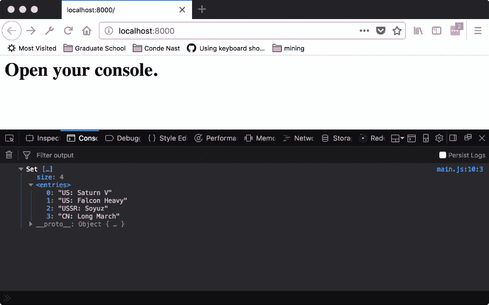
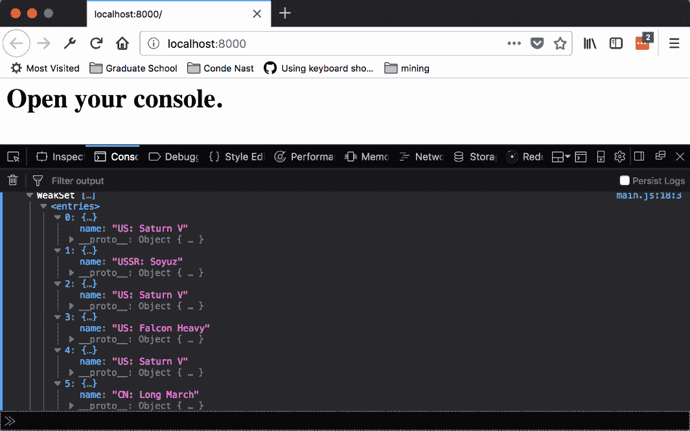

# 使用集合

本章将涵盖以下食谱：

+   向集合中添加和删除项

+   从现有数据创建一个 Set

+   从 WeakSet 中添加和删除项

+   从现有数据创建一个 WeakSet

+   查找两个集合的并集

+   查找两个集合的交集

+   查找两个集合之间的差异

+   创建一个包装 Set 的类以处理更复杂的数据类型

# 简介

对于我们的最后一章，我们将探讨两种更多的新相关类型。`Set`和`WeakSet`，像`Map`和`WeakMap`一样，是其他值的集合。然而，`Set`和`WeakSet`不是在值对之间创建关系，而是在集合的所有条目之间创建关系。这些数据结构确保没有重复的条目。如果一个新项评估为与另一个成员相等，它将不会被添加到`Set`中。

本章中的食谱将展示如何使用集合类实现不同的行为。

# 向集合中添加和删除项

我们将从涉及`Set`的最简单任务开始。在本食谱中，我们将探讨如何使用相应实例方法向`Set`中添加和删除项。

# 准备工作

本食谱假设你已经有一个工作区，允许你在浏览器中创建和运行 ES 模块。如果你没有，请参考前两章。

# 如何操作...

1.  打开你的命令行应用程序，导航到你的工作区。

1.  创建一个名为`12-01-add-remove-from-set`的新文件夹。

1.  复制或创建一个`index.html`，它从`main.js`加载并运行一个`main`函数。

1.  创建一个`main.js`文件，定义一个`main`函数。在该函数中，创建一个新的`Set`实例，然后从中添加和删除一些项：

```js
// main.js
export function main() {
    const rocketSet = new Set();
    rocketSet.add('US: Saturn V');
    rocketSet.add('US: Saturn V');
    rocketSet.add('US: Falcon Heavy');
    console.log(rocketSet);
    rocketSet.delete('US: Falcon Heavy');
    console.log(rocketSet);
}
```

1.  启动你的 Python 网络服务器，并在浏览器中打开以下 URL：

    `http://localhost:8000/`.

1.  你将看到以下输出：


# 它是如何工作的...

集合是一组数据。但它的行为与更熟悉的`Array`类型不同。像数学集合一样，`Set`实例旨在只包含一个元素副本。也就是说，如果你有一个数字的`Array`和一个数字的`Set`，`Array`可以包含数字`138`多次，但`Set`只能包含一个副本。

集合的成员资格评估方式类似于`===`运算符。在我们的例子中，你可以看到`US: Saturn V`只被添加到集合中一次，尽管它被作为`add`的参数提供了两次。接下来，你可以看到`US: Falcon Heavy`在被最初添加后就被移除了。随后，集合中只有一个成员。

要了解更多关于集合的信息，请访问以下链接的 Mozilla 开发者文档：

[`developer.mozilla.org/en-US/docs/Web/JavaScript/Reference/Global_Objects/Set`](https://developer.mozilla.org/en-US/docs/Web/JavaScript/Reference/Global_Objects/Set).

# 从现有数据创建一个 Set

我们刚刚看到了如何将值逐个添加到集合中。然而，这可能会很繁琐。例如，如果我们正在处理一个可能非常大或事先未知的数据集，使用函数调用初始化映射会比数百或数千个映射更方便。

在本食谱中，我们将探讨如何使用现有数据创建一个新的 Set。

# 准备工作

本食谱假设你已经有一个工作区，允许你在浏览器中创建和运行 ES 模块。如果你没有，请参考前两章。

# 如何操作...

1.  打开你的命令行应用程序，导航到你的工作区。

1.  创建一个名为 `12-02-create-set-from-data` 的新文件夹。

1.  复制或创建一个 `index.html` 文件，该文件加载并运行来自 `main.js` 的 `main` 函数。

1.  创建一个 `main.js` 文件，定义一个名为 `main` 的函数，它有一个字符串数组作为参数。使用该数组作为构造函数参数创建一个新的集合：

```js
// main.js 
export function main() { 
  const rockets = [ 
    'US: Saturn V', 
    'US: Falcon Heavy', 
    'USSR: Soyuz', 
    'CN: Long March', 
    'US: Saturn V', 
    'US: Saturn V' 
  ];

  const rocketSet = new Set(rockets); 
  console.log(rockets); 
}  
```

1.  启动你的 Python 网络服务器，并在浏览器中打开以下 URL：

    `http://localhost:8000/`.

1.  你应该看到以下输出：



# 工作原理...

在前面的食谱中，我们看到如何使用现有数据创建一个 `Set`。`Set` 的构造函数接受一个 `iterable` 作为参数。最熟悉的 `iterable` 是一个数组。在 `Set` 的情况下，`iterable`（数组）中的每个元素按顺序添加到集合中。正如我们在前面的食谱中提到的，`Set` 的成员资格是通过与 `===` 操作符类似的比较来确定的。集合不允许重复值。因此，我们只看到输出 `<entries>` 部分中的单个 `US: Saturn V`。

# 从 WeakSet 中添加和删除项目

现在，我们将查看相应的弱数据结构，`WeakSet`。在本食谱中，我们将探讨如何使用相应实例方法向 `WeakSet` 添加和删除项目，以及一些关于成员资格的限制。

# 准备工作

本食谱假设你已经有一个工作区，允许你在浏览器中创建和运行 ES 模块。如果你没有，请参考前两章。

# 如何操作...

1.  打开你的命令行应用程序，导航到你的工作区。

1.  创建一个名为 `12-03-add-remove-from-weak-set` 的新文件夹。

1.  复制或创建一个 `index.html` 文件，该文件加载并运行来自 `main.js` 的 `main` 函数。

1.  创建一个 `main.js` 文件，定义一个名为 `Rocket` 的新类，它接受一个构造函数参数 `name` 并将其分配给实例属性：

```js
// main.js 
class Rocket { 
  constructor(name) { 
    this.name = name; 
  } 
}    
```

1.  创建一个 `main` 函数，包含一些 `Rocket` 实例和一个 `WeakMap` 实例。将实例添加到集合中并从中删除：

```js
// main.js 
export function main() {
const saturnV = new Rocket('US: Saturn V');
const falconHeavy = new Rocket('US: Falcon Heavy');
const rocketSet = new WeakSet();
rocketSet.add(saturnV);
rocketSet.add(saturnV);
rocketSet.add(falconHeavy);
console.log(rocketSet);
rocketSet.delete(falconHeavy);
console.log(rocketSet);
// throw error
rocketSet.add('Saturn V');
}
```

1.  启动你的 Python 网络服务器，并在浏览器中打开以下 URL：

    `http://localhost:8000/`.

1.  你将看到以下输出：


# 工作原理...

`WeakSet`的成员资格评估方式类似于`===`运算符。查看前面的内容，我们可以看到名为`US: Saturn V`的两个`Rocket`实例被添加到集合中。这当然是因为集合不是比较名称属性，而是对象实例。因此，我们将看到两个而不是一个（唯一的名称）或三个（添加次数）`US: Saturn V`条目。

接下来，你可以看到`US: Falcon Heavy`在最初添加后被移除。随后，集合中不再有那个成员。

当尝试向`WeakSet`添加字符串时，会抛出错误。像`WeakMap`的键一样，`WeakSet`的元素必须是对象。这样，`WeakSet`只能对其条目保持弱引用。因此，当其他引用超出作用域时，可以为条目分配的内存被释放。

# 从现有数据创建 WeakSet

我们刚刚看到了如何从现有数据创建 Set。相关的类`WeakSet`可以以类似的方式创建，但对其成员资格有限制。在这个配方中，我们将查看如何从现有数据创建`WeakSet`以及对其成员资格的限制。

# 准备工作

这个配方假设你已经有一个工作区，允许你在浏览器中创建和运行 ES 模块。如果你没有，请参考前两章。

# 如何操作...

1.  打开你的命令行应用程序，并导航到你的工作区。

1.  创建一个名为`12-04-create-weak-set-from-data`的新文件夹。

1.  创建一个名为`main.js`的文件，定义一个名为`Rocket`的新类，该类接受一个构造函数参数`name`并将其分配给实例属性：

```js
// main.js 
class Rocket { 
  constructor(name) { 
    this.name = name; 
  } 
}    
```

1.  创建一个包含火箭实例数组的`main`函数。从数组中创建一个新的`WeakSet`。尝试向`WeakSet`添加一个字符串：

```js
// main.js 
export function main() { 
  const rockets = [ 
    new Rocket('US: Saturn V'), 
    new Rocket('US: Saturn V'), 
    new Rocket('US: Saturn V'), 
    new Rocket('USSR: Soyuz') , 
    new Rocket('CN: Long March') 
  ] 

  const rocketSet = new WeakSet(rockets); 
  console.log(rockets);
}  
```

1.  启动你的 Python 网络服务器，并在浏览器中打开以下 URL：

    `http://localhost:8000/`.

1.  你应该看到以下输出：



# 它是如何工作的...

就像 Set 构造函数一样，`WeakSet`构造函数也接受一个可迭代对象。数组中的每个元素依次被添加。我们将注意到多个实例具有相同的`name`属性。这当然是因为它们是独立的`Rocket`实例，尽管它们具有相同的名称值。

# 查找两个集合的并集

现在我们已经很好地掌握了集合，是时候开始执行一些集合操作了。集合是无序的事物组；你可能想要做的是将两个组合并成一个。这个操作称为两个集合的`并集`。如果一个元素存在于两个集合中的任何一个中，那么它就在两个集合的并集中。

在这个配方中，我们将查看如何创建两个`Set`实例的并集。

# 准备工作

这个配方假设你已经有一个工作区，允许你在浏览器中创建和运行 ES 模块。如果你没有，请参考前两章。

# 如何操作...

1.  打开你的命令行应用程序，并导航到你的工作区。

1.  创建一个名为`12-05-set-union`的新文件夹。

1.  创建一个 `main.js` 文件，定义一个名为 `Rocket` 的新类，该类接受一个构造函数参数 `name` 并将其分配给实例属性：

```js
// main.js 
class Rocket { 
  constructor(name) { 
    this.name = name; 
  } 
   }  
```

1.  创建一个名为 `union` 的函数，该函数接受两个集合参数：

```js
// main.js 
function union (set1, set2) {}  
```

1.  创建一个 `result` 集合。遍历两个集合实例，并将每个 `entry` 添加到结果集合中：

```js
// main.js 
function union (set1, set2) { 
  const result = new Set(); 

  set1.forEach((entry) => result.add(entry)); 
  set2.forEach((entry) => result.add(entry)); 

  return result; 
} 
```

1.  创建一个 `main` 函数。创建几个具有重叠成员的集合。从两个集合的并集中退出：

```js
// main.js 
export function main() { 
  const usRockets = [ 
    new Rocket('US: Saturn V'), 
    new Rocket('US: Falcon Heavy') 
  ]; 
  const americanSet = new Set(usRockets); 
  console.log('American Set', americanSet); 

  const allRockets = usRockets.concat([ 
    new Rocket('USSR: Soyuz'), 
    new Rocket('CN: Long March') 
  ]); 

  const fullSet = new Set(allRockets); 
  console.log('Full Set', fullSet); 

  console.log('Union', union(americanSet, fullSet)); 
}  
```

1.  启动您的 Python 网络服务器，并在浏览器中打开以下 URL：

    `http://localhost:8000/`.

1.  您应该看到以下输出：


# 它是如何工作的...

在前面的食谱中，我们依赖于 `Set` 的属性来实现 `union` 操作。如前所述，集合不存储重复条目。因此，在创建并集时，我们不必担心将重复项添加到结果集合中，因为这一点由类为我们处理。只需遍历所有成员并添加它们就足以创建并集集合。

# 查找两个集合的交集

接下来，我们将看看如何找出两个集合共有的元素。这个操作称为两个集合的 `intersection`。如果一个元素存在于两个集合的交集中，那么它就存在于这两个集合中。

在本食谱中，我们将了解如何创建两个 `Set` 实例的交集。

# 准备工作

本食谱假设您已经有一个工作区，允许您在浏览器中创建和运行 ES 模块。如果您没有，请参考前两章。

# 如何操作...

1.  打开您的命令行应用程序，并导航到您的 workspace。

1.  创建一个名为 `12-06-set-intersection` 的新文件夹。

1.  创建一个 `main.js` 文件，定义一个名为 `Rocket` 的新类，该类接受一个构造函数参数 `name` 并将其分配给实例属性：

```js
// main.js 
class Rocket { 
  constructor(name) { 
    this.name = name; 
  } 
   }  
```

1.  创建一个名为 `intersection` 的函数，该函数接受两个 `set` 参数：

```js
// main.js 
function intersection (set1, set2) {}  
```

1.  创建一个 `result` 集合。遍历第一个 `set` 实例。如果它也出现在第二个 `set` 中，则将每个 `entry` 添加到结果 `set` 中：

```js
// main.js 
function intersection (set1, set2) { 
  const result = new Set(); 

  set1.forEach((entry) => { 
    if (set2.has(entry)) { 
      result.add(entry); 
    } 
  }); 

  return result; 
} 
```

1.  创建一个 `main` 函数。创建几个具有重叠成员的集合。输出两个集合的交集：

```js
// main.js 
export function main() { 
  const usRockets = [ 
    new Rocket('US: Saturn V'), 
    new Rocket('US: Falcon Heavy') 
  ]; 
  const americanSet = new Set(usRockets); 
  console.log('American Set', americanSet); 

  const allRockets = usRockets.concat([ 
    new Rocket('USSR: Soyuz'), 
    new Rocket('CN: Long March') 
  ]); 

  const fullSet = new Set(allRockets); 
  console.log('Full Set', fullSet); 

  console.log('Intersetion', intersection(americanSet, fullSet)); 
  }  
```

1.  启动您的 Python 网络服务器，并在浏览器中打开以下 URL：

    `http://localhost:8000/`.

1.  您应该看到以下输出：


# 它是如何工作的...

两个集合的交集定义为同时出现在两个集合中的所有元素。在本食谱中，我们使用 `has` 方法来实现 `intersection` 操作。我们遍历第一个 `Set` 的元素，并检查第二个集合是否包含每个元素。如果第二个 `Set` 包含该元素，则 `has` 方法将返回 true。如果此方法返回 true，则我们知道该元素存在于两个 `Set` 实例中，并将其添加到新的交集。

# 查找两个集合之间的差异

我们已经看到了如何使用并集操作组合两个集合，以及如何使用交集操作找到它们的共同元素。下一个逻辑步骤是看看如何找出一个集合中另一个集合没有的元素。这个操作称为两个集合的`difference`。如果一个元素在两个集合的差集中，那么它位于第一个集合中，但不位于第二个集合中。

在本配方中，我们将探讨如何找到两个`Set`实例之间的差异。

# 准备中

本配方假设你已经有一个工作区，允许你在浏览器中创建和运行 ES 模块。如果你没有，请参阅前两章。

# 如何做...

1.  打开你的命令行应用程序，并导航到你的工作区。

1.  创建一个名为`12-07-set-difference`的新文件夹。

1.  创建一个名为`main.js`的文件，该文件定义了一个名为`Rocket`的新类，它接受一个构造函数参数`name`并将其分配给实例属性：

```js
// main.js 
class Rocket { 
  constructor(name) { 
    this.name = name; 
  } 
   }  
```

1.  创建一个名为`difference`的函数，该函数接受两个`set`参数：

```js
// main.js 
function intersection (set1, set2) {}  
```

1.  创建一个`result`集合。遍历第一个集合实例。如果每个条目不在第二个`set`中，则将其添加到结果集合中：

```js
// main.js 
function difference(set1, set2) { 
  const result = new Set(); 

  set1.forEach((entry) => { 
    if (!set2.has(entry)) { 
      result.add(entry) 
    } 
  }); 

  return result; 
} 
```

1.  创建一个`main`函数。创建几个具有重叠成员的集合。记录两个集合的差异：

```js
// main.js 
export function main() { 
  const usRockets = [ 
    new Rocket('US: Saturn V'), 
    new Rocket('US: Falcon Heavy') 
  ]; 
  const americanSet = new Set(usRockets); 
  console.log('American Set', americanSet); 

  const allRockets = usRockets.concat([ 
    new Rocket('USSR: Soyuz'), 
    new Rocket('CN: Long March') 
  ]); 

  const fullSet = new Set(allRockets); 
  console.log('Full Set', fullSet); 

  console.log('Difference 1', difference(americanSet, fullSet)); 
  console.log('Difference 2', difference(fullSet, americanSet)); 
}  
```

1.  启动你的 Python 网络服务器，并在浏览器中打开以下 URL：

    `http://localhost:8000/`。

1.  你应该看到以下输出：


# 它是如何工作的...

在前面的配方中，我们依赖于`Set`类上的`has`方法来实现`difference`操作。差分的元素必须出现在第一个集合中，但不出现在第二个集合中。在遍历第一个集合时，我们知道该元素是第一个集合的一部分。接下来，我们只需使用`has`方法检查它是否在第二个集合中。如果此方法返回 false，则我们知道该元素在差集中。

差分与其他两个操作（并集和交集）的一个重要区别是它不是交换的，也就是说，参数的顺序很重要。你可以在前面的配方中看到，差分函数的结果取决于哪个集合被从另一个集合中区分出来。

# 创建一个包装 Set 的类以处理更复杂的数据类型

了解我们正在处理的数据类型是有价值的。`WeakSet`对成员资格有一些限制，但正如你可能知道的，对象可能会有很大的变化。

在本配方中，我们将探讨如何创建`Map`的包装类，以控制`Map`中使用的类型。

# 准备中

本配方假设你已经有一个工作区，允许你在浏览器中创建和运行 ES 模块。如果你没有，请参阅前两章。

如果你不太熟悉`WeakMap`类，请参阅*从 WeakMap 中设置和删除条目*配方。

# 如何做...

1.  打开你的命令行应用程序，并导航到你的工作区。

1.  创建一个名为 `12-08-create-class-to-wrap-set` 的新文件夹。

1.  创建一个 `main.js` 文件，该文件定义了一个名为 `Rocket` 的新类，该类接受一个构造函数参数 `name` 并将其分配给实例属性：

```js
// main.js 
class Rocket { 
  constructor(name) { 
    this.name = name; 
  } 
   } 
```

1.  创建一个名为 `RocketSet` 的类文件，该文件创建一个新的映射并将其作为实例属性分配给构造函数：

```js
// main.js 
class RocketSet { 
  constructor () { 
    this.set = new WeakSet(); 
     }    
   } 
```

1.  添加一个 `add` 方法，该方法检查 `key` 和 `value` 参数的类型。如果参数类型不正确，则抛出异常；否则，将这对作为映射条目设置：

```js
// main.js 
class RocketSet { 
  add (rocket) { 
    if (!(rocket instanceof Rocket)) { 
      throw new Error('Members of `RocketSet` must be of type 
      `Rocket`'); 
    } 

    this.set.add(rocket); 
      } 
   } 
```

1.  添加一个 `has` 方法，如果包含的集合中有该条目，则返回 `true`：

```js
// main.js 
class RocketSiteMap { 
  has (rocket) { 
    return this.set.has(rocket); 
     } 
   }
} 
```

1.  创建一个 `main` 函数。尝试将各种键值对设置到 `RocketSet` 实例中：

```js
// main.js 
export function main() { 
  const rocketSet = new RocketSet(); 
  const saturnV = new Rocket('US: Saturn V');
  const falconHeavy = new Rocket('US: Falcon Heavy');
  const longMarch = new Rocket('Long March') ;
  rocketSet.add(saturnV); 
  rocketSet.add(falconHeavy); 
  rocketSet.add(longMarch); 
  console.log(rocketSet) ;

  console.log('Set has Saturn V ',rocketSet.has(saturnV));
  console.log('Set has Falcon Heavy 
  ',rocketSet.has(falconHeavy));
  console.log('Set has Long March ',rocketSet.has(longMarch));

  try { 
    rocketSet.add('Buzz Lightyear'); 
  } catch (e) { 
    console.error(e); 
  } 
} 
```

1.  启动你的 Python 网络服务器并在浏览器中打开以下 URL：

    `http://localhost:8000/`。

1.  你应该看到以下输出：


# 它是如何工作的...

从 `add` 方法的实现中，我们可以看到正在检查参数的类型。`Rocket` 实例的行为类似于我们在其他菜谱中看到的其他实例，并且可以像其他实例一样进行检查。当将不正确的类型作为 `add` 的参数传递时，其中一个条件将触发并抛出错误。

我们不需要为 `has` 方法检查类型；它不会修改集合，并且如果参数不是 `Rocket`，它将返回 `false`。
