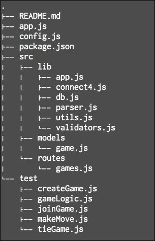
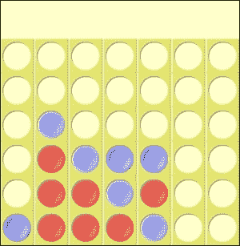

# 第三章. 多人游戏 API – 连接 4

连接 4 是一个回合制的两人游戏，每个玩家会向下投掷一个棋子，目标是让同一颜色的四个棋子连成一线。可以是垂直、水平或对角线。

在本章中，我们将构建 Connect4-as-a-Service。一个 API，允许你在任何客户端上构建一个 Connect 4 游戏，无论是网站、移动应用，还是从命令行玩；为什么不呢？

在第一章，*构建基本的 Express 网站*和第二章，*MMO 文字游戏*中，我们介绍了 Express 支持的 API 最通用的用例，即从数据库中服务和持久化数据。在本章中，我们将介绍一些更有趣的内容。我们将构建一个多人游戏 API！

我们将涵盖的一些主题包括身份验证、游戏状态建模和验证中间件。此外，我们将使用测试驱动开发构建一个具有最大代码覆盖率的 app。

为了您的参考，这是我们应用文件夹的结构，我们将在本章中构建它：



你如何创建一个游戏？你如何加入一个游戏？你如何移动？以及你如何将游戏状态持久化到数据库中？

总是先从数据结构开始是一个好主意。那么，让我们开始吧！

# 使用 Mongoose 建模游戏状态

我们将用二维数组来表示棋盘，其中的值是 `'x'`、`'o'` 或 `' '`，代表网格上每个位置的三个可能状态。以下是一个示例，其中玩家 2 赢得了游戏：



这个游戏状态将如下所示表示为一个数组：

```js
 [ [' ',' ',' ',' ',' ',' ',' ',' '],
  [' ',' ',' ',' ',' ',' ',' ',' '],
  [' ','o',' ',' ',' ',' ',' ',' '],
  [' ','x','o','o','o',' ',' ',' '],
  [' ','x','x','o','x',' ',' ',' '],
  ['o','x','x','x','o',' ',' ',' '] ]
```

如果游戏是在本地进行，并且状态存储在内存中，那么这将是足够的。在我们的情况下，我们想在互联网上玩游戏，所以我们需要一种方法来识别我们在玩哪个游戏，以及你是哪个玩家，以及轮到谁了。一个游戏文档将如下所示：

```js
{
  boardId: '<id>',
  p1Key: '<p1key>',
  p1Name: 'express',
  p2Key: '<p2key>',
  p2Name: 'koa',
  columns: 7,
  rows: 6,
  status: 'Game in progress',
  winner: undefined,
  turn: 1,
  board: [...]
}
```

这里是参数：

| 参数 | 描述 |
| --- | --- |
| `boardId` | 如果你想要查看当前游戏状态，这将是一个唯一的 ID。 |
| `p1Key` | 这是一个用于识别玩家 1 的秘密令牌；我们当然想避免作弊的可能性 |
| `p1Name` | 这是玩家 1 的名字 |
| `p2Key` | 这是一个用于识别玩家 2 的秘密令牌 |
| `p2Name` | 这是玩家 2 的名字 |
| `turn` | 这是这个棋盘上玩过的总回合数 |
| `rows` | 这是游戏板的行数 |
| `columns` | 这是游戏板的列数 |
| `board` | 这是一个存储在二维数组中的游戏状态 |
| `status` | 这将是“游戏进行中”或“游戏结束”。 |
| `winner` | 游戏结束后，这是获胜者的名字 |

让我们使用与第二章第二章。构建一个基本的 Express 网站中介绍相同的 app 文件夹结构，并在 `src/models/game.js` 中定义前面的内容作为一个 Mongoose 模型：

```js
var mongoose = require('mongoose');

var gameSchema = new mongoose.Schema({
    type: String,
    required: true
  },
  p2Key: {
    type: String,
    required: true
  },
  p1Name: {
    type: String,
    required: true
  },
  p2Name: {
    type: String
  },
  turn: {
    type: Number,
    required: true
  },
  boardId: {
    type: String,
    required: true,
    index: {
      unique: true
    }
  },
  board: {
    type: Array,
    required: true
  },
  rows: {
    type: Number,
    required: true
  },
  columns: {
    type: Number,
    required: true
  },
  status: {
    type: String
  },
  winner: {
    type: String
  }
});

module.exports = mongoose.model('Game', gameSchema);
```

# 创建新游戏

现在我们已经定义了游戏的数据结构，让我们开始实现创建和持久化新游戏文档到数据库的逻辑，同时遵循测试驱动开发实践。

为了创建一个新的游戏，我们需要接受一个 POST 请求到 `/create`，并在 POST 主体中包含你的名字：

```js
{ name: 'player1' }
```

我们应该考虑以下几点：

+   我们需要将棋盘信息返回给用户，以及游戏创建是否成功

+   我们需要确保玩家可以访问他们刚刚创建的游戏，因此我们必须发送给他们 `boardId`

+   为了让玩家能够识别自己，我们还需要确保我们发送给他们 `p1Key`，这将用于玩家一未来想要在此棋盘上进行的所有移动

由于我们正在构建游戏，我们有权力改变游戏的规则。所以让我们允许玩家 1 可选地配置游戏棋盘的大小！尽管如此，我们应该有一个最小尺寸为 6x7。

因此，让我们从创建游戏和获取游戏信息的测试开始：

```js
var expect = require('chai').expect,
    request = require('supertest');

var app = require('../src/lib/app');
describe('Create new game | ', function() {
  var boardId;

  it('should return a game object with key for player 1', function(done) {
    request(app).post('/create')
      .send({name: 'express'})
      .expect(200)
      .end(function(err, res) {
        var b = res.body;
        expect(b.boardId).to.be.a('string');
        expect(b.p1Key).to.be.a('string');
        expect(b.p1Name).to.be.a('string').and.equal('express');
        expect(b.turn).to.be.a('number').and.equal(1);
        expect(b.rows).to.be.a('number');
        expect(b.columns).to.be.a('number');

        // Make sure the board is a 2D array
        expect(b.board).to.be.an('array');
        for(var i = 0; i < b.board.length; i++){
          expect(b.board[i]).to.be.an('array');
        }

        // Store the boardId for reference
        boardId = b.boardId;
        done();
      });
  });
})
```

### 注意

在本章中，我们将使用 `expect` 断言库。与 `should` 的唯一区别是语法，以及它处理 `undefined` 的方式更为优雅。`should` 库修补了对象原型，这意味着如果对象是 `undefined`，它将抛出 TypeError: Cannot read property 'should' of undefined。

测试将使用 supertest 模拟向 `/create` 端点发送 POST 数据，并且我们描述了我们期望从响应中获取的所有内容。

1.  现在让我们在 `src/routes/games.js` 中创建一个 `POST` 路由来在数据库中创建游戏，并使第一个测试通过：

    ```js
    var Utils = require('../lib/utils');
    var connect4 = require('../lib/connect4');
    var Game = require('../models/game');

    app.post('/create', function(req, res) {
        if(!req.body.name) {
          res.status(400).json({
            "Error": "Must provide name field!"
          });
        }

        var newGame = {
          p1Key: Utils.randomValueHex(25),
          p2Key: Utils.randomValueHex(25),
          boardId: Utils.randomValueHex(6),
          p1Name: req.body.name,
          board: connect4.initializeBoard(req.body.rows, req.body.columns),
          rows: req.body.rows || app.get('config').MIN_ROWS,
          columns: req.body.columns || app.get('config').MIN_COLUMNS,
          turn: 1,
          status: 'Game in progress'
        };

        Game.create(newGame, function(err, game) {
          if (err) {
            return res.status(400).json(err);
          }
          game.p2Key = undefined;
          res.status(201).json(game);
        });
      });
    ```

    ### 注意

    注意，API 应该处理所有可能的输入，并确保在输入验证未通过时返回 `400` 错误；关于这一点将在以下内容中详细介绍。

1.  `Utils.randomValueHex()` 方法将返回一个随机字符串，我们用它来生成令牌以及 `boardId`。而不是在前面文件中定义它，让我们在 `src/lib/utils.js` 中将其包装得更好：

    ```js
    var crypto = require('crypto');

    module.exports = {
      randomValueHex: function(len) {
        return crypto.randomBytes(Math.ceil(len/2))
            .toString('hex')
            .slice(0,len);
      }
    }
    ```

    Connect4 的所有游戏逻辑都在 `src/lib/connect4.js` 中，你可以在附录中找到它。我们将使用这个库来初始化棋盘。

1.  注意，行和列是可选参数。我们不希望在代码中硬编码默认值，因此我们在根目录中有一个 `config.js` 文件：

    ```js
    module.exports = {
      MIN_ROWS: 6,
      MIN_COLUMNS: 7
    };
    ```

1.  当我们在 `src/lib/app.js` 中初始化应用程序时，我们可以将这个 `config` 对象附加到 `app` 对象上，这样我们就可以在应用程序范围内访问配置：

    ```js
    var express = require('express'),
        app = express(),
        config = require('../../config'),
        db = require('./db');

    app.set('config', config);
    db.connectMongoDB();
    require('./parser')(app);
    require('../routes/games')(app);

    module.exports = app;
    ```

    到现在为止，你的第一次尝试应该通过了——恭喜！我们现在可以放心，`POST`端点是正常工作的，并且会按预期继续工作。这种感觉很好，因为如果我们将来破坏了某些东西，测试将会失败。现在你不再需要担心它了，可以专注于你的下一个任务。

1.  你确实需要勤奋地获取尽可能多的代码覆盖率。例如，我们允许客户端自定义棋盘大小，但我们还没有编写测试来测试这个功能，所以让我们立即着手：

    ```js
     it('should allow you to customize the size of the board', function(done) {
        request(app).post('/create')
          .send({
            name: 'express',
            columns: 8,
            rows: 16
          })
          .expect(200)
          .end(function(err, res) {
            var b = res.body;
            expect(b.columns).to.equal(8);
            expect(b.rows).to.equal(16);
            expect(b.board).to.have.length(16);
            expect(b.board[0]).to.have.length(8);
            done();
          });
      });
    ```

1.  我们还应该强制棋盘的最小尺寸；否则，游戏无法进行。还记得我们在`config.js`文件中定义了`MIN_ROWS`和`MIN_COLUMNS`吗？我们可以在测试中重用它，而无需硬编码测试。现在，如果我们想更改游戏的最小尺寸，我们可以在一个地方完成！如下所示：

    ```js
      it('should not accept sizes < ' + MIN_COLUMNS + ' for columns', function(done) {
        request(app).post('/create')
          .send({
            name: 'express',
            columns: 5,
            rows: 16
          })
          .expect(400)
          .end(function(err, res) {
            expect(res.body.error).to.equal('Number of columns has to be >= ' + MIN_COLUMNS);
            done();
          });
      });

      it('should not accept sizes < ' + MIN_ROWS + ' rows', function(done) {
        request(app).post('/create')
          .send({
            name: 'express',
            columns: 8,
            rows: -6
          })
          .expect(400)
          .end(function(err, res) {
            expect(res.body.error).to.equal('Number of rows has to be >= ' + MIN_ROWS);
            done();
          });
      });
    ```

如前述测试用例所述，我们应该确保如果玩家正在自定义棋盘大小，那么大小不能小于最小尺寸。我们还将进行更多验证检查，所以让我们开始变得更加有条理。

## 输入验证

我们应该始终检查从`POST`请求接收到的输入是否确实是我们预期的，如果不是，则返回`400`输入错误。这需要尽可能多地考虑边缘情况。当一个 API 被成千上万的用户使用时，可以保证一些用户会滥用或误用它，无论是故意的还是无意的。然而，你的责任是尽可能使 API 对用户友好。

在前述`/create`路由中，我们唯一覆盖的输入验证是确保`POST`体中有一个名称。现在我们只需添加两个额外的`if`块来覆盖棋盘大小的情况，以便通过测试。

在真正的 TDD（测试驱动开发）哲学中，你应该首先编写最少的代码来使测试通过。他们称之为红-绿-重构。首先，编写失败的测试（红色），尽可能快地使其通过（绿色），然后重构。

我们敦促你首先尝试上述代码。以下是在重构后的结果。

1.  许多输入验证检查可以在多个路由中使用，所以让我们将其优雅地打包成`src/lib/validators.js`中的中间件集合：

    ```js
    // A collection of validation middleware

    module.exports = function(app) {
      var MIN_COLUMNS = app.get('config').MIN_COLUMNS,
          MIN_ROWS = app.get('config').MIN_ROWS;

      // Helper to return 400 error with a custom message
      var _return400Error = function(res, message) {
        return res.status(400).json({
          error: message
        });
      };

      return {
        name: function(req, res, next) {
          if(!req.body.name) {
            return _return400Error(res, 'Must provide name field!');
          }
          next();
        },
        columns: function(req, res, next) {
          if(req.body.columns && req.body.columns < MIN_COLUMNS) {
            return _return400Error(res, 'Number of columns has to be >= ' + MIN_COLUMNS);
          }
          next();
        },
        rows: function(req, res, next) {
          if(req.body.rows && req.body.rows < MIN_ROWS) {
            return _return400Error(res, 'Number of rows has to be >= ' + MIN_ROWS);
          }
          next();
        }
      }
    }
    ```

    上述代码以可重用的方式打包了三个验证检查器。它返回一个包含三个中间件的对象。注意我们如何使用`private _return400Error`辅助函数来 DRY（Don't Repeat Yourself）代码，使其更加简洁。

1.  现在，我们可以按照以下方式重构`/create`路由：

    ```js
    module.exports = function(app) {
      // Initialize Validation middleware with app to use config.js
      var Validate = require('../lib/validators')(app);

      app.post('/create', [Validate.name, Validate.columns, Validate.rows], function(req, res) {

        var newGame = {
          p1Key: Utils.randomValueHex(25),
          p2Key: Utils.randomValueHex(25),
          boardId: Utils.randomValueHex(6),
          p1Name: req.body.name,
          board: connect4.initializeBoard(req.body.rows, req.body.columns),
          rows: req.body.rows || app.get('config').MIN_ROWS,
          columns: req.body.columns || app.get('config').MIN_COLUMNS,
          turn: 1,
          status: 'Game in progress'
        };
        Game.create(newGame, function(err, game) {
          if (err) return res.status(400).json(err);

          game.p2Key = undefined;
          return res.status(201).json(game);
        });
      });
    }
    ```

这将创建一个很好的关注点分离，其中我们将定义的每个路由都将接受一个（可重用的！）验证中间件数组，它必须通过这些中间件，才能到达路由的控制逻辑。

### 小贴士

在继续进行下一个端点之前，请确保你的测试仍然通过。

## 获取游戏状态

两位玩家都需要一种方式来检查他们感兴趣的游戏的状况。为此，我们可以向`/board/{boardId}`发送`GET`请求。这将返回游戏的当前状态，允许玩家看到棋盘的状态，以及下一个轮到谁。

我们将创建另一个端点来获取棋盘，所以让我们首先为它编写测试：

```js
  it('should be able to fetch the board', function(done) {
    request(app).get("/board/" + boardId)
      .expect(200)
      .end(function(err, res) {
        var b = res.body;
        expect(b.boardId).to.be.a('string').and.equal(boardId);
        expect(b.turn).to.be.a('number').and.equal(1);
        expect(b.rows).to.be.a('number');
        expect(b.columns).to.be.a('number');
        expect(b.board).to.be.an('array');
        done();
      });
  });
```

注意，我们想要确保我们不会意外地泄露玩家令牌。响应应该基本上与最近移动的玩家收到的响应相同，如下所示：

```js
 app.get('/board/:id', function(req, res) {
    Game.findOne({boardId: req.params.id}, function(err, game) {
      if (err) return res.status(400).json(err);

      res.status(200).json(_sanitizeReturn(game));
    });
  });
```

在这里，`_sanitizeReturn(game)`是一个简单的辅助函数，它只是复制游戏对象，除了玩家令牌。

```js
// Given a game object, return the game object without tokens
function _sanitizeReturn(game) {
  return {
    boardId: game.boardId,
    board: game.board,
    rows: game.rows,
    columns: game.columns,
    turn: game.turn,
    status: game.status,
    winner: game.winner,
    p1Name: game.p1Name,
    p2Name: game.p2Name
  };
}
```

## 加入游戏

如果只有一个人玩这个游戏，那就没有意思了，所以我们需要允许第二个玩家加入游戏。

1.  为了加入一个游戏，我们需要接受`POST`到`/join`，并在`POST`体中包含玩家 2 的名字：

    ```js
    { name: 'player2' }
    ```

    ### 注意

    为了使这可行，我们需要实现一个基本的匹配系统。一个简单的方法是简单地有一个可加入状态的游戏队列，当`/join` API 被调用时从中弹出。我们选择使用 Redis 作为我们的队列实现来跟踪可加入的游戏。

    一旦加入游戏，我们将向玩家发送`boardId`和`p2Key`，这样他们就可以与玩家 1 在这个板上玩游戏。这将内在地避免游戏被多次加入。

1.  我们需要做的只是添加这一行，将`boardId`推入队列，一旦游戏在数据库中创建并存储：

    ```js
          client.lpush('games', game.boardId);
    ```

1.  当我们展示`app.js`时，我们浏览了数据库连接。在第二章中介绍了设置 MongoDB 连接的方法，*一个健壮的电影 API*。以下是我们将在`src/lib/db.js`中连接到`redis`数据库的方式：

    ```js
    var redis = require('redis');
    var url = require('url');

    exports.connectRedis = function() {
      var urlRedisToGo = process.env.REDISTOGO_URL;
      var client = {};

      if (urlRedisToGo) {
        console.log('using redistogo');
        rtg = url.parse(urlRedisToGo);
        client = redis.createClient(rtg.port, rtg.hostname);
        client.auth(rtg.auth.split(':')[1]);
      } else {
        console.log('using local redis');
        // This would use the default redis config: { port 6347, host: 'localhost' }
        client = redis.createClient();
      }

      return client;
    };
    ```

    ### 注意

    注意，在生产环境中，我们将连接到 Redis To Go（你可以从免费的 2MB 实例开始）。对于本地开发，你所需要做的就是`redis.createClient()`。

1.  现在我们可以编写测试来加入游戏，TDD 风格：

    ```js
    var expect = require('chai').expect,
        request = require('supertest'),
        redis = require('redis'),
        client = redis.createClient();

    var app = require('../src/lib/app');

    describe('Create and join new game | ', function() {
      before(function(done){
        client.flushall(function(err, res){
          if (err) return done(err);
          done();
        });
      });
    ```

1.  注意，我们每次运行这个测试套件时都会刷新`redis`队列，只是为了确保栈是空的。一般来说，编写可以独立运行的原子测试是一个好主意，而不依赖于外部状态。

    ```js
      it('should not be able to join a game without a name', function(done) {
        request(app).post('/join')
          .expect(400)
          .end(function(err, res) {
            expect(res.body.error).to.equal("Must provide name field!");
            done();
          });
      });

      it('should not be able to join a game if none exists', function(done) {
        request(app).post('/join')
          .send({name: 'koa'})
          .expect(418)
          .end(function(err, res) {
            expect(res.body.error).to.equal("No games to join!");
            done();
          });
      });
    ```

1.  总是记得要覆盖输入的边缘情况！在前面的测试中，我们确保覆盖了没有剩余游戏可加入的情况。如果没有，我们可能会使服务器崩溃或返回`500`错误（我们应该尝试消除，因为这意味着这是你的责任，而不是用户的错误！）现在让我们编写以下代码：

    ```js
      it('should create a game and add it to the queue', function(done) {
        request(app).post('/create')
          .send({name: 'express'})
          .expect(200)
          .end(function(err, res) {
            done();
          });
      });

      it('should join the game on the queue', function(done) {
        request(app).post('/join')
          .send({name: 'koa'})
          .expect(200)
          .end(function(err, res) {
            var b = res.body;
            expect(b.boardId).to.be.a('string');
            expect(b.p1Key).to.be.undefined;
            expect(b.p1Name).to.be.a('string').and.equal('express');
            expect(b.p2Key).to.be.a('string');
            expect(b.p2Name).to.be.a('string').and.equal('koa');
            expect(b.turn).to.be.a('number').and.equal(1);
            expect(b.rows).to.be.a('number');
            expect(b.columns).to.be.a('number');
            done();
          });
      });
    });
    ```

1.  这些测试描述了创建游戏和加入游戏的核心逻辑。足够的测试来描述这个端点。现在让我们编写相应的代码：

    ```js
    app.post('/join', Validate.name, function(req, res) {
        client.rpop('games', function(err, boardId) {
          if (err) return res.status(418).json(err);

          if (!boardId) {
            return res.status(418).json({
              error: 'No games to join!'
            });
          }

          Game.findOne({ boardId: boardId }, function (err, game){
            if (err) return res.status(400).json(err);

            game.p2Name = req.body.name;
            game.save(function(err, game) {
              if (err) return res.status(500).json(err);
              game.p1Key = undefined;
              res.status(200).json(game);
            });
          });
        });
      });
    ```

我们在这里重用`Validate.name`中间件来确保我们为玩家 2 有一个名字。如果是这样，我们将寻找队列中的下一个可加入的游戏。当没有可加入的游戏时，我们将返回一个适当的`418`错误。

如果我们成功检索到下一个可加入的 `boardId`，我们将从数据库中获取棋盘，并在其中存储玩家 2 的名字。我们还要确保我们不将玩家 1 的 Token 与游戏对象一起返回。

现在两位玩家都已经获取了各自的 Token，游戏可以开始了！

## 进行游戏

游戏状态存储在数据库中，可以通过对 `/board/{boardId}` 的 `GET` 请求检索。移动的本质是对游戏状态的更改。在熟悉的 CRUD 术语中，我们将会更新文档。尽可能遵循 REST 规范，对 `/board/{boardId}` 发送 `PUT` 请求将是进行移动的合逻辑选择。

为了进行有效的移动，玩家需要在他们的请求头中包含一个 X-Player-Token，该 Token 与对应玩家的 Token 匹配，以及一个请求体，指明要在哪个列进行移动：

```js
{ column: 2 }
```

然而，并非所有移动都是合法的，例如，我们需要确保玩家只能在他们的回合进行移动。对于每一次移动，还需要检查一些其他的事情：

+   移动是否有效？列参数是否指定了一个实际的列？

+   这列还有空间吗？

+   X-Player-Token 是否是当前游戏的合法 Token？

+   轮到你了？

+   这一步是否创造了胜利条件？这位玩家是否通过这一步赢得了比赛？

+   这一步是否填满了棋盘并导致了平局？

现在我们将模拟所有这些场景。

1.  让我们用以下测试进行一整场游戏：

    ```js
    var expect = require('chai').expect,
        request = require('supertest'),
        redis = require('redis'),
        client = redis.createClient();

    var app = require('../src/lib/app'),
        p1Key, p2Key, boardId;

    describe('Make moves | ', function() {
      before(function(done){
        client.flushall(function(err, res){
          if (err) return done(err);
          done();
        });
      });

      it('create a game', function(done) {
        request(app).post('/create')
          .send({name: 'express'})
          .expect(200)
          .end(function(err, res) {
            p1Key = res.body.p1Key;
            boardId = res.body.boardId;
            done();
          });
      });

      it('join a game', function(done) {
        request(app).post('/join')
          .send({name: 'koa'})
          .expect(200)
          .end(function(err, res) {
            p2Key = res.body.p2Key;
            done();
          });
      });
    ```

    第一个测试创建游戏，第二个测试加入游戏。接下来的六个测试是验证测试，以确保请求是有效的。

1.  确保 X-Player-Token 存在：

    ```js
      it('Cannot move without X-Player-Token', function(done) {
        request(app).put('/board/' + boardId)
          .send({column: 1})
          .expect(400)
          .end(function(err, res) {
            expect(res.body.error).to.equal('Missing X-Player-Token!');
            done();
          });
      });
    ```

1.  确保 X-Player-Token 是正确的：

    ```js
      it('Cannot move with wrong X-Player-Token', function(done) {
        request(app).put('/board/' + boardId)
          .set('X-Player-Token', 'wrong token!')
          .send({column: 1})
          .expect(400)
          .end(function(err, res) {
            expect(res.body.error).to.equal('Wrong X-Player-Token!');
            done();
          });
      });
    ```

1.  确保你移动的棋盘存在：

    ```js
      it('Cannot move on unknown board', function(done) {
        request(app).put('/board/3213')
          .set('X-Player-Token', p1Key)
          .send({column: 1})
          .expect(404)
          .end(function(err, res) {
            expect(res.body.error).to.equal('Cannot find board!');
            done();
          });
      });
    ```

1.  确保在移动时发送了列参数：

    ```js
      it('Cannot move without a column', function(done) {
        request(app).put('/board/' + boardId)
          .set('X-Player-Token', p2Key)
          .expect(400)
          .end(function(err, res) {
            expect(res.body.error).to.equal('Move where? Missing column!');
            done();
          });
      });
    ```

1.  确保列没有超出棋盘范围：

    ```js
      it('Cannot move outside of the board', function(done) {
        request(app).put('/board/' + boardId)
          .set('X-Player-Token', p1Key)
          .send({column: 18})
          .expect(200)
          .end(function(err, res) {
            expect(res.body.error).to.equal('Bad move.');
            done();
          });
      });
    ```

1.  确保错误的玩家不能移动：

    ```js
      it('Player 2 should not be able to move!', function(done) {
        request(app).put('/board/' + boardId)
          .set('X-Player-Token', p2Key)
          .send({column: 1})
          .expect(400)
          .end(function(err, res) {
            console.log(res.body);
            expect(res.body.error).to.equal('It is not your turn!');
            done();
          });
      });
    ```

1.  现在我们已经涵盖了所有验证案例，让我们测试整个游戏流程：

    ```js
    it('Player 1 can move', function(done) {
        request(app).put('/board/' + boardId)
          .set('X-Player-Token', p1Key)
          .send({column: 1})
          .expect(200)
          .end(function(err, res) {
            var b = res.body;
            expect(b.p1Key).to.be.undefined;
            expect(b.p2Key).to.be.undefined;
            expect(b.turn).to.equal(2);
            expect(b.board[b.rows-1][0]).to.equal('x');
            done();
          });
      });
    ```

1.  在玩家 2 移动之前，快速检查玩家 1 不能再次移动：

    ```js
      it('Player 1 should not be able to move!', function(done) {
        request(app).put('/board/' + boardId)
          .set('X-Player-Token', p1Key)
          .send({column: 1})
          .expect(400)
          .end(function(err, res) {
            expect(res.body.error).to.equal('It is not your turn!');
            done();
          });
      });

      it('Player 2 can move', function(done) {
        request(app).put('/board/' + boardId)
          .set('X-Player-Token', p2Key)
          .send({column: 1})
          .expect(200)
          .end(function(err, res) {
            var b = res.body;
            expect(b.p1Key).to.be.undefined;
            expect(b.p2Key).to.be.undefined;
            expect(b.turn).to.equal(3);
            expect(b.board[b.rows-2][0]).to.equal('o');
            done();
          });
      });
    ```

1.  本测试套件的剩余部分将进行一整场的游戏。我们不会在这里展示所有内容，但你可以参考源代码。尽管如此，最后三个测试仍然很有趣，因为我们涵盖了最终的游戏状态并阻止了任何更多的移动。

    ```js
      it('Player 1 can double-check victory', function(done) {
        request(app).get('/board/' + boardId)
          .set('X-Player-Token', p1Key)
          .expect(200)
          .end(function(err, res) {
            var b = res.body;
            expect(b.winner).to.equal('express');
            expect(b.status).to.equal('Game Over.');
            done();
          });
      });

      it('Player 2 is a loser, to be sure', function(done) {
        request(app).get('/board/' + boardId)
          .set('X-Player-Token', p2Key)
          .expect(200)
          .end(function(err, res) {
            var b = res.body;
            expect(b.winner).to.equal('express');
            expect(b.status).to.equal('Game Over.');
            done();
          });
      });

      it('Player 1 cannot move anymore', function(done) {
        request(app).put('/board/' + boardId)
          .set('X-Player-Token', p1Key)
          .send({column: 3})
          .expect(400)
          .end(function(err, res) {
            expect(res.body.error).to.equal('Game Over. Cannot move anymore!');
            done();
          });
      });
    });
    ```

既然我们已经描述了预期的行为，让我们开始实现移动端点。

1.  首先，让我们覆盖验证部分，使前 8 个测试通过。

    ```js
    app.put('/board/:id', [Validate.move, Validate.token], function(req, res) {

        Game.findOne({boardId: req.params.id }, function(err, game) {
    ```

1.  我们获取移动发送到的棋盘。如果我们找不到棋盘，我们应该返回一个 400 错误。这将使测试 'Cannot move on unknown board' 通过。

    ```js
          if (!game) {
            return res.status(400).json({
              error: 'Cannot find board!'
            });
          }
    ```

1.  如果游戏结束了，你不能进行任何移动。

    ```js
          if(game.status !== 'Game in progress') {
            return res.status(400).json({
              error: 'Game Over. Cannot move anymore!'
            });
          }
    ```

1.  以下代码将确保 Token 要么是 `p1Key`，要么是 `p2Key`。如果不是，返回带有相应信息的 `400` 错误：

    ```js
          if(req.headers['x-player-token'] !== game.p1Key && req.headers['x-player-token'] !== game.p2Key) {
            return res.status(400).json({
              error: 'Wrong X-Player-Token!'
            });
          }
    ```

现在我们已经验证了 Token 确实是有效的，我们仍然需要检查是否轮到你了。

`game.turn()` 方法将在每个回合中递增，所以我们必须取模来检查是谁的回合。递增回合，而不是切换，将有一个好处，即可以记录已进行的回合数，这在稍后检查棋盘是否已满并结束平局时也会很有用。

现在我们知道要比较令牌的哪个键了。

1.  如果你的令牌不匹配，那么就不是你的回合：

    ```js
          var currentPlayer = (game.turn % 2) === 0 ? 2 : 1;
          var currentPlayerKey = (currentPlayer === 1) ? game.p1Key : game.p2Key;
          if(currentPlayerKey !== req.headers['x-player-token']){
            return res.status(400).json({
              error: 'It is not your turn!'
            });
          }
    ```

1.  我们为这个路由添加了两个额外的验证中间件，移动和令牌，我们可以将它们添加到 `src/lib/validators.js` 中的验证库中：

    ```js
        move: function(req, res, next) {
          if (!req.body.column) {
            return _return400Error(res, 'Move where? Missing column!');
          }
          next();
        },
        token: function(req, res, next) {
          if (!req.headers['x-player-token']) {
            return _return400Error(res, 'Missing X-Player-Token!');
          }
          next();
        }
    ```

1.  在前面的代码中，我们发送了四次 `400` 错误，让我们简化代码并重用 `validators.js` 中的同一个辅助函数，通过将这个辅助函数提取到 `src/lib/utils.js` 中：

    ```js
    var crypto = require('crypto');

    module.exports = {
      randomValueHex: function(len) {
        return crypto.randomBytes(Math.ceil(len/2))
            .toString('hex')
            .slice(0,len);
      },
      // Helper to return 400 error with a custom message
      return400Error: function(res, message) {
        return res.status(400).json({
          error: message
        });
      }
    }
    ```

1.  不要忘记更新 `src/lib/validators.js` 以使用这个 `utils`，通过替换以下行：

    ```js
      var _return400Error = require('./utils').return400Error;
    ```

1.  现在，我们可以重构移动路由，按照以下方式执行移动：

    ```js
    app.put('/board/:id', [Validate.move, Validate.token], function(req, res) {

        Game.findOne({boardId: req.params.id }, function(err, game) {
          if (!game) {
            return _return400Error(res, 'Cannot find board!');
          }

          if(game.status !== 'Game in progress') {
            return _return400Error(res, 'Game Over. Cannot move anymore!');
          }

          if(req.headers['x-player-token'] !== game.p1Key && req.headers['x-player-token'] !== game.p2Key) {
            return _return400Error(res, 'Wrong X-Player-Token!');
          }

          var currentPlayer = (game.turn % 2) === 0 ? 2 : 1;
          var currentPlayerKey = game['p' + currentPlayer + 'Key'];
          if(currentPlayerKey !== req.headers['x-player-token']){
            return _return400Error(res, 'It is not your turn!');
    ```

清洁多了，不是吗！

对于控制器逻辑的其余部分，我们将使用 `connect4.js` 库（见附录），该库实现了 `makeMove()` 和 `checkForVictory()` 方法。

`makeMove()` 方法将返回移动后的新棋盘，或者如果移动无效则返回 `false`。这里的无效意味着该列已满，或者列超出范围。这里没有进行回合验证。

```js
    // Make a move, which returns a new board; returns false if the move is invalid
      var newBoard = connect4.makeMove(currentPlayer, req.body.column, game.board);
      if(newBoard){
        game.board = newBoard;
        game.markModified('board');
      } else {
        return _return400Error(res, 'Bad move.');
      }
```

需要特别指出的一点是这一行代码 `game.markModified('board')`。由于我们使用二维数组作为棋盘，Mongoose 无法自动检测任何更改。它只能对基本字段类型进行操作。因此，如果我们没有明确地将棋盘标记为已更改，那么在调用 `game.save` 时，它将不会持久化任何更改！

```js
      // Check if you just won
      var win = connect4.checkForVictory(currentPlayer, req.body.column, newBoard);
      if(win) {
        game.winner = game['p'+ currentPlayer + 'Name'];
        game.status = 'Game Over.';
      } else if(game.turn >= game.columns*game.rows) {
        game.winner = 'Game ended in a tie!';
        game.status = 'Game Over.';
      }
```

`checkForVictory()` 方法是一个谓词，它将根据最后一位玩家的最后一步移动来检查胜利。我们不需要每次都检查整个棋盘。如果最后一步是胜利的一步，这个方法将返回 `true`；否则，它将返回 `false`。

```js
      // Increment turns
      game.turn++;

      game.save(function(err, game){
        if (err) return res.status(500).json(err);
        return res.status(200).json(_sanitizeReturn(game));
      });
    });
  });
```

保持控制器逻辑尽可能简单，并将尽可能多的业务逻辑委托给库或模型是一个好主意。这种解耦和关注点的分离提高了可维护性、可测试性，以及模块化和可重用性。考虑到当前的架构，很容易在我们的 Express 项目中重用应用程序的核心组件。

## 测试平局情况

在我们的测试套件中，我们还没有涵盖到平局游戏。我们可以创建另一个测试套件，手动使用 42 个单独的步骤填满整个棋盘，但这会非常繁琐。所以，让我们通过程序来填充棋盘。

这听起来可能很简单，但用 JavaScript 的异步控制流来做可能会有些棘手。如果我们简单地将移动请求包裹在一个 `for` 循环中，会发生什么？

简而言之，这将是一团糟。所有请求将同时发出，并且没有任何顺序。您如何知道所有移动都已完成？您需要维护一个全局状态计数器，每次回调时都会增加。

这就是为什么从 Github 来的`async`库变得不可或缺。

Async 是一个实用模块，它提供了直接且强大的函数来处理异步 JavaScript。

使用 async 您可以做很多事情，这会让您的生活更轻松；绝对是一个您应该熟悉并添加到您的工具箱中的库。

在我们的情况下，我们将使用`async.series`，它允许我们串行发送一系列请求。每个请求将等待先前的请求返回。

### 注意

按顺序运行任务数组中的函数，每个函数在先前的函数完成后运行一次。如果系列中的任何函数将其错误传递给回调，则无法运行更多函数，并且回调立即以错误值调用；否则，当任务完成时，回调接收一个结果数组。

因此，为了准备传递给`async.series`的移动，我们将使用以下辅助函数来创建 thunk：

```js
function makeMoveThunk(player, column) {
  return function(done) {
    var token = player === 1 ? p1Key : p2Key;
    request(app).put('/board/' + boardId)
      .set('X-Player-Token', token)
      .send({column: column})
      .end(done);
  };
}
```

Thunk 只是一个子程序；在这种情况下，调用 API 进行移动，它被封装在一个函数中，稍后执行。在这种情况下，我们创建了一个接受回调参数的 thunk（如 async 所需），它通知 async 我们已经完成。

现在我们可以通过编程填充棋盘并检查平局状态：

```js
it('Fill the board! Tie the game!', function(done) {
    var moves = [],
        turn = 1,
        nextMove = 1;

    for(var r = 0; r < rows; r++) {
      for(var c = 1; c <= columns; c++) {
        moves.push(makeMoveThunk(turn, nextMove));
        turn = turn === 1 ? 2 : 1;
        nextMove = ((nextMove + 2) % columns) + 1;
      }
    }

    async.series(moves, function(err, res) {
      var lastResponse = res[rows*columns-1].body;
      console.log(lastResponse);
      expect(lastResponse.winner).to.equal('Game ended in a tie!');
      expect(lastResponse.status).to.equal('Game Over.');
      done();
    });
  });
```

# 摘要

恭喜！到目前为止，所有您的测试都应该通过，您的游戏应该已经完成。您已经掌握了开发一个健壮且经过良好测试的 API，并使用可重用的中间件处理验证。在这个过程中，您还学会了如何使用 Redis 进行简单的队列。

现在，您可以部署您的 API，并且 Connect4-as-a-Service 将可供全世界使用，他们可以在自己的平台上构建自己的四子棋游戏。无论是 HTML5 界面、移动应用还是命令行界面，这一切都将由您的后端提供支持！

在下一章中，我们将把游戏开发提升到另一个层次——它将是一个实时大规模多人在线游戏！
