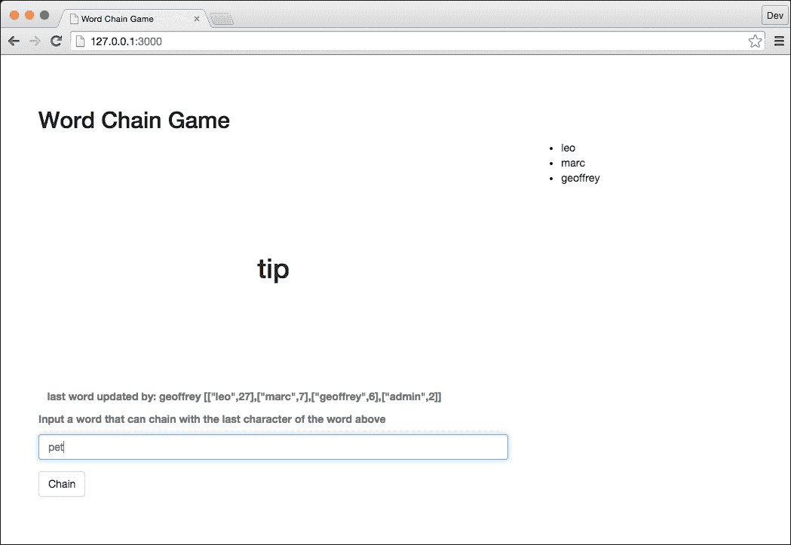
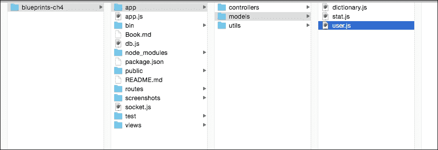
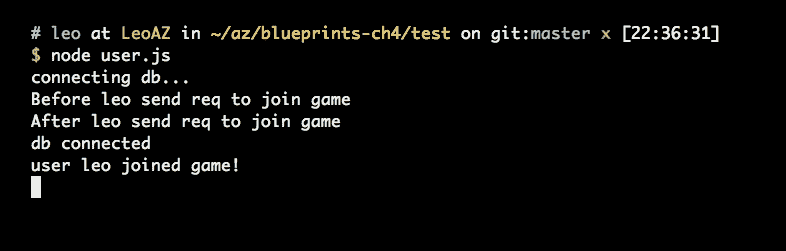
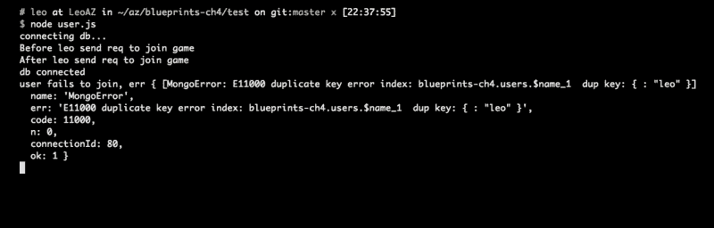
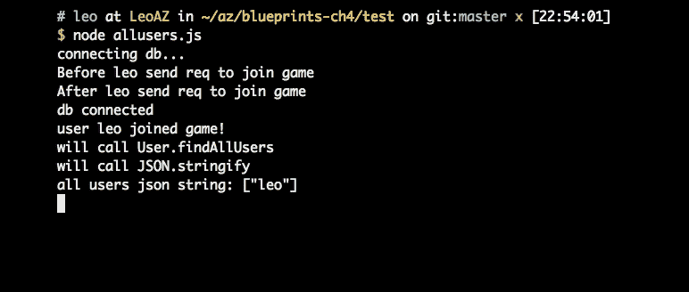
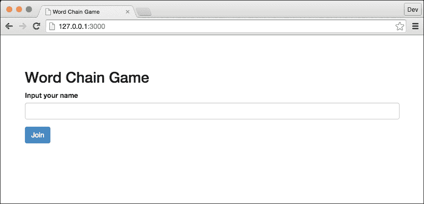
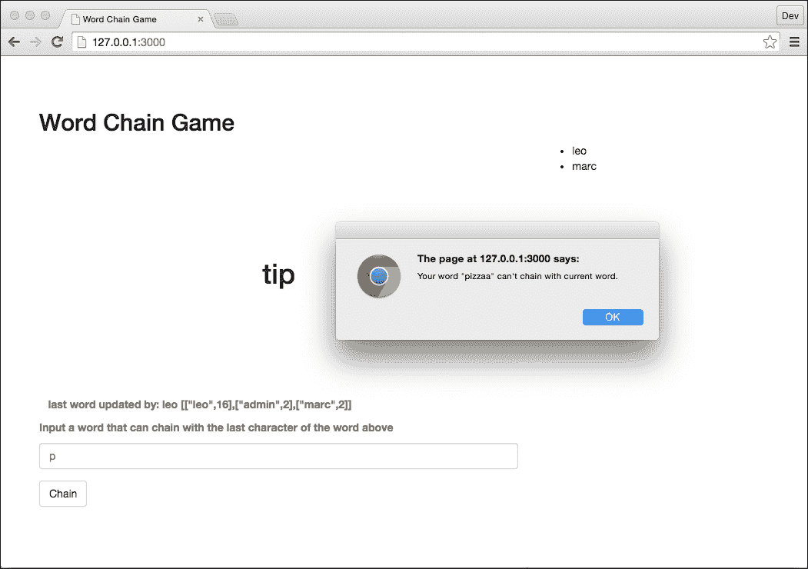
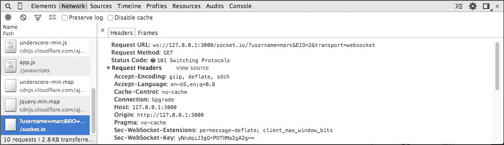
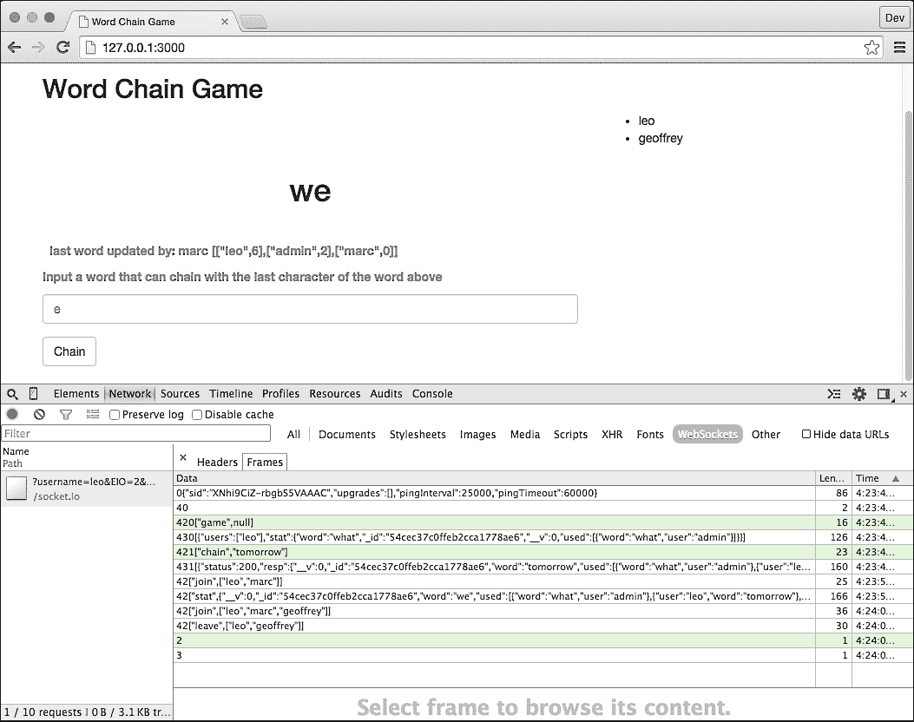

# 第四章 MMO 单词游戏

单词链游戏是一个实时、大规模多人在线游戏。在玩游戏时，每位玩家都将能够看到其他在线玩家，以及一个分数排行榜。在本章中，我们将介绍 Promise 模式，并解释 Promises 如何简化异步操作。你将学习如何使用 Express 和 SocketIO 构建实时应用程序，在套接字握手期间进行身份验证，以及如何使用 MongoDB 的原子更新处理竞争条件。你还将学习如何构建游戏客户端以通过套接字连接到游戏服务器，以及如何使用 Chrome 开发者工具在客户端上调试 WebSocket。

一旦你掌握了这个技巧，你就可以构建类似在线问答比赛的游戏。

# 游戏玩法

游戏从随机选择的英语单词开始，每位玩家都尝试提交一个单词，其中提交的第一个字母与当前单词的最后一个字母匹配；我们称这为与当前单词的链式连接。例如，如果游戏从单词`Today`开始，那么玩家可以发送单词如`Yes`或`Yellow`。

首位提交有效单词的人，其单词将成为下一轮的起始单词，并获得该轮的分数。一旦新单词被接受，服务器将向所有在线玩家广播这一变化。玩家将看到新单词，并提交另一个单词与它相连。

例如，如果玩家 1 发送`Yes`来与`Today`相连，服务器将接受这个单词并将当前单词`Yes`广播给所有其他玩家。如果玩家提交的单词根据我们拥有的字典无效，或者之前已被其他玩家提交，游戏服务器将忽略该请求。如果多个玩家同时提交有效单词，服务器将只接受第一个提交的单词。



## 实时应用程序概述

在这个游戏中，我们将介绍 Promise 模式，并解释 Promise 如何简化异步操作。

尽管这是一个实时游戏，但我们不会一开始就急于实现实时功能。相反，我们首先构建一个游戏模型，其中包含所有游戏逻辑。

在游戏逻辑中，我们首先介绍如何跟踪活跃用户，然后解释我们如何验证用户的输入。在更新游戏状态阶段，我们通过利用 MongoDB 的原子操作来处理竞争条件。我们还探讨了如何通过测试用例来覆盖竞争条件。

游戏逻辑完成后，我们将介绍如何使用 Socket.IO 向所有玩家广播游戏状态变化。

最后，我们将创建一个 Express 应用、一个 Socket.IO 服务器和一个游戏客户端，该客户端可以使用`socket.io-client`库与我们的服务器通信。

## 跟踪活跃用户

由于游戏是多人游戏，玩家可以看到玩家的数量和他们的用户名。为了跟踪活跃用户，我们需要跟踪玩家何时加入游戏以及何时离开游戏。

# 模式设计

每个玩家可以简单地用一个包含单个名称字段的文档来表示：

```js
{ name: 'leo' }
```

## 用户模式

我们将使用 Mongoose 进行数据建模。让我们从设计我们的用户模式开始。模式放在应用中的`models`文件夹中。下面的截图显示了文件夹结构。该模式将有一个必填字段`name`，这是通过在模式中的名称对象中添加`required: true`来实现的。



为了快速通过名称查询用户，我们可以在`name`上添加索引。默认情况下，只有 MongoDB 生成的`_id`字段会被索引。这意味着，为了通过名称进行搜索，数据库需要遍历集合中的所有文档以找到匹配的名称。当你为`name`添加索引时，你可以像查询`_id`一样快速地通过名称进行查询。现在，当用户离开时，我们可以直接通过名称找到该用户并删除该用户。

此外，我们还在索引中添加了`unique : true`属性，以避免有多个用户拥有相同的名称，如下面的代码所示：

```js
var mongoose = require('mongoose');
var schema = new mongoose.Schema({
  name: {
    type: String,
    required: true,
    index: {
      unique: true
    }
  }
});

var User = mongoose.model('user', schema);
module.exports = User;

```

## 用户加入

当用户加入游戏时，我们创建一个具有`name`键的用户，并将此用户保存到 MongoDB 中，如下所示：

```js
schema.statics.join = function(name, callback) {
  var user = new User({
    name: name
  });

  user.save(function(err, doc) {
    if (!callback) { return ; }
    if (err) { return callback(err); }

    callback(null, doc);
  });
};

```

前面代码中的`save()`方法使用了回调模式，这也被称为回调地狱。如果发生错误，我们调用回调函数并将错误作为参数传递；否则，操作成功并返回更新后的文档。

前面的回调模式涉及大量的逻辑和条件检查。JavaScript 的嵌套回调模式可以迅速变成意大利面般的噩梦。一个好的替代方案是使用 Promises 来简化问题。

Mongoose 的`model.create()`方法([`mongoosejs.com/docs/api.html#model_Model.create`](http://mongoosejs.com/docs/api.html#model_Model.create))可以在数据库中创建并保存一个新的文档，如果有效。函数和文档，如对象和数组，是`model.create()`方法的有效参数。`create`方法返回一个 Promise。

使用这个 Promise，`join`方法的调用者可以定义成功和失败的回调，从而简化代码：

```js
schema.statics.join = function(name) {
  return User.create({
    name: name
  });
};

```

# Promises

Promise 是异步操作最终的结果，就像给人一个承诺一样。Promises 帮助处理错误，这导致编写没有回调的更干净的代码。你不需要为每个函数传递一个额外的函数，该函数接受错误和结果作为参数，只需简单地调用你的函数并传递其参数即可获得一个 Promise：

```js
 getUserinfo('leo', function(err, user){
   if (err) {
    // handle error
     onFail(err);
     return;
   }

  onSuccess(user);
 });

```

与之相对的是

```js
var promiseUserInfo = getUserinfo('leo');

promiseUserInfo.then(function(user) {
  onSuccess(user);
});

promiseUserInfo.catch(function(error) {
  // code to handle error
  onFail(user);
});

```

如果只有一个异步操作，使用 Promise 的好处并不明显。如果有许多异步操作，其中一个依赖于另一个，回调模式会迅速变成一个深层嵌套的结构，而 Promise 可以使你的代码更浅显，更容易阅读。

Promise 可以集中处理你的错误，当发生异常时，你会得到引用实际函数名称而不是匿名函数名称的堆栈跟踪。

在我们的文字游戏中，你可以使用 Promise 将这个：

```js
var onJoinSuccess = function(user) {console.log('user', user.name, 'joined game!');
  return user;
};

var onJoinFail = function(err) {console.error('user fails to join, err', err);
};

User.join('leo', function(err, user) {if (err) {return onJoinFail(err);
  }

  onJoinSuccess(user);
});
```

变成这样：

```js
User.join('leo')
.then(function(user) {onJoinSuccess(user);})
.catch(function(err) {onJoinFail(err);
});
```

或者甚至更简单：

```js
User.join('leo')
.then(onJoinSuccess)
.catch(onJoinFail);
```

为了理解前面的执行流程，让我们创建一个完整的示例，调用用户模型的 `join()` 方法，然后添加一些日志语句来查看输出：

```js
var User = require('../app/models/user.js');
var db = require('../db');

var onJoinSuccess = function(user) {
  console.log('user', user.name, 'joined game!');
  return user;
};

var onJoinFail = function(err) {
  console.error('user fails to join, err', err);
};

console.log('Before leo send req to join game');

User.join('leo')
.then(onJoinSuccess)
.catch(onJoinFail);

console.log('After leo send req to join game');
```

如果用户成功加入游戏，`User.join()` 方法返回的 Promise 将被解决。一个新创建的用户文档对象将被传递给 `onJoinSuccess` 回调，输出结果如下所示：



如果我们再次运行此脚本，我们会看到用户未能加入游戏，错误被打印出来。它失败是因为用户模型已经在名称属性上有一个索引，因为当我们第一次运行脚本时创建了一个名为 `leo` 的用户。当我们再次运行它时，我们无法创建另一个具有相同名称 `leo` 的用户，因此 Promise 失败，错误传递到 `onJoinFail`。



Promise 有三种状态：挂起、已解决或被拒绝；Promise 的初始状态是挂起，然后它承诺它将要么成功（已解决）要么失败（被拒绝）。一旦它被解决或被拒绝，它就不能再改变。这个的主要好处是你可以将多个 Promise 连接起来，并定义一个错误处理器来处理所有错误。

由于 `join()` 方法返回一个 Promise，我们可以定义成功和失败回调如下。

## `then` 和 `catch` 方法

`then` 和 `catch` 方法用于定义成功和失败回调；你可能想知道它们实际上何时被调用。当调用 `User.create()` 方法时，它将返回一个 Promise 对象，并同时向 MongoDB 发送一个异步查询。成功回调 `onJoinSuccess` 然后被传递到 `then` 方法，并在异步查询成功完成时调用，解决 Promise。

一旦 Promise 被解决，它就不能再次被解决，因此 `onJoinSuccess` 不会再次被调用，最多只会被调用一次。

## 连接多个 Promise

你可以通过在先前的 `then()` 函数返回的 Promise 上调用它们来连接 Promise 操作。当我们想要对 Promise 的结果（一旦 *x* 解决，然后做 *y*）做些什么时，我们使用 `.then()` 方法，如下所示：

```js
var User = require('../app/models/user.js');
var db = require('../db');

var onJoinSuccess = function(user) {
  console.log('user', user.name, 'joined game!');
  return user;
};

var onJoinFail = function(err) {
  console.error('user fails to join, err', err);
};

console.log('Before leo send req to join game');
User.join('leo')
.then(onJoinSuccess)
.then(function(user) {
  return User.findAllUsers();
})
.then(function(allUsers) {
  return JSON.stringify(allUsers);
})
.then(function(val) {
  console.log('all users json string:', val);
})
.catch(onJoinFail);

console.log('After leo send req to join game');
```

我们可以在最后集中处理错误。使用 Promise 链处理错误要容易得多。如果我们运行代码，我们会得到以下结果：



现在我们已经通过了创建新用户的逻辑和错误处理，让我们看看我们将如何确保具有相同名称的多个用户不能加入。

## 防止重复

在我们定义用户模式时，我们已经在名称字段上添加了 `index` 并将其唯一集设置为 `true`：

```js
var schema = new mongoose.Schema({
  name: {
    type: String,
    required: true,
    index: {
      unique: true
    }
  }
});

```

MongoDB 将发出一个查询以查看是否存在具有相同唯一属性值的另一个记录，如果该查询返回空，则允许保存或更新操作进行。如果另一个用户以相同的名称加入，Mongo 将抛出错误：重复键错误。这阻止了用户被保存，玩家必须选择另一个名称加入。

为了确保我们的代码按预期工作，我们需要创建测试；我们将使用 Mocha 创建一个测试用例。测试用例将向 `User.join` 方法传递一个用户名，并期望新创建的用户名是有效的。`User.join` 方法返回一个 Promise。如果成功，Promise 返回的对象将被发送到 `then` 方法；否则它将失败，Promise 将通过 `.reject` 方法返回一个错误，该错误将被 `catch` 方法捕获。

在成功回调的情况下，我们有新创建的用户，我们可以通过期望 `user.name` 返回 `leo` 来检查它是否正确，因为 `leo` 被输入为用户名（如下面的代码所示）。

在失败回调的情况下，我们可以将错误对象传递给 Mocha，`done(error)`，以失败测试用例。由于我们第一次创建了一个名为 `leo` 的用户，我们预计这个测试会通过。由于 Mocha 测试是同步的，而 Promises 是异步的，我们需要等待函数执行完成。当代码成功时，它将调用 `done()` 函数并向 Mocha 报告成功；如果失败，`catch` 方法将捕获错误并将错误返回给 `done` 方法，这将告诉 Mocha 测试用例失败。

```js
var User = require('../../app/models/user');

  describe('when leo joins', function() {
    it('should return leo', function(done) {
      User.join('leo')

        .then(function(user) {
          expect(user.name).to.equal('leo');
          done();
        })
        .catch(function(error) {
          done(error);
        });
    });
  });

```

Mocha 1.18.0 或更高版本允许你在测试用例中返回一个 Promise。如果 Promise 失败而不需要显式捕获错误，Mocha 将失败测试用例，如下所示：

```js
  describe('when leo joins', function() {
    it('should return leo', function() {
      return User.join('leo')
        .then(function(user) {
          expect(user.name).to.equal('leo');
        });
    });
  });

```

现在我们已经测试了提交具有唯一名称的第一个用户可以正常工作，我们想要测试当另一个具有相同名称的用户加入时会发生什么：

```js
 describe('when another leo joins', function() {
    it('should be rejected', function() {
      return User.join('leo')
        .then(function() {
          throw new Error('should return Error');
        })
        .catch(function(err) {
          expect(err.code).to.equal(11000);
          return true;
        });
    });
  });

```

当我们再次提交 `leo` 作为用户名时，`Game.join` 的 Promise 被拒绝并进入 `.catch` 方法。`return true` 将失败的 Promise 转换为成功，这告诉我们它成功拒绝了第二个 `leo`，并且我们成功捕获了错误；我们基本上吞下了错误，告诉 Mocha 这是我们期望的正确行为。

## 用户离开游戏

当用户离开游戏时，我们需要从数据库中删除他们的记录；这也会释放他们的用户名，以便新用户可以取用。Mongoose 有一个名为 `findOneAndRemove` 的 `delete` 方法，可以通过名称找到该玩家，然后将其删除，如下面的代码所示。

对于我们的 Promises，我们使用 Bluebird ([`github.com/petkaantonov/bluebird`](https://github.com/petkaantonov/bluebird)) (规范：PromiseA)，因为它具有更好的性能、实用性和普及度（支持）。

我们调用 `Promise.resolve` 方法，该方法创建一个已解析的 Promise，其值为内部值：`Promise.resolve(value)`。因此，我们可以将不通常返回 Promise 的方法用 Bluebird 的 `Promise.resolve` 方法包装，以获取一个 Promise，然后如果成功则使用 then 链接，如果失败则使用 catch。从我们的方法接收 Promises 将确保我们高效地处理成功和错误，并允许调用者在其运行时处理错误（.exec()）。

```js
schema.statics.leave = function(name) {
  return Promise.resolve(this.findOneAndRemove({name: name
  })
  .exec());
};
```

## 显示所有活跃用户

到目前为止，我们已经演示了如何添加和删除用户，现在我们将深入了解如何向已加入的用户展示游戏数据。为了显示总活跃用户数，我们可以简单地返回所有用户，因为离线用户已经被移除。为了返回仅包含用户名的数组，而不是整个用户对象的数组，我们可以使用 `Promise.map()` 方法将数组中的每个用户对象转换为用户名。

由于 `User.find` 返回用户数组，我们使用 `Promise.map()` 方法从名称键返回值。这有效地将用户对象数组转换为用户名数组。再次注意，我们使用 `promise.resolve()` 方法从我们的输入中获取一个 Promise。这将允许我们通过用户名显示当前登录用户列表。

```js
schema.statics.findAllUsers = function() {
  return Promise.resolve(User.find({}).exec())
    .map(function(user) {
      return user.name;
    });
};

```

## 单词 - 子文档

我们已经了解了涉及创建、显示和删除用户的游戏逻辑，但关于游戏本身的实质——单词呢？

在 `app/models/stat.js` 文件中，我们可以看到我们如何对单词数据进行建模。`word` 字段显示当前单词，而 `used` 字段保存游戏的历史记录。

我们将 `used` 列作为子文档嵌入到 Stat 文档中，这样我们就可以原子性地更新统计数据。我们将在稍后解释这一点。

```js
{
  'word': 'what',
  'used': [
    { 'user': 'admin', 'word': 'what' },
    { 'user': 'player1', 'word': 'tomorrow' },
    { 'user': 'player2', 'word': 'when' },
    { 'user': 'player2', 'word': 'nice' },
    { 'user': 'player1', 'word': 'egg' },
  ]
}

```

上述代码概述了我们将存储在数据库中的内容。

我们首先为单词输入创建一个模型，新单词（word）和已使用单词（used），与用户模型类似的方法，通过定义类型（新单词为字符串，旧单词为数组）。旧单词存储在数组中，以便在检查新单词是否已被使用之前可以访问。

```js
var schema = new mongoose.Schema({word: {type: String,required: true},
  used: {type: Array
  },
});
```

在创建新游戏之后，我们将描述有关验证单词输入和计分的进一步逻辑。

当我们创建一个新游戏时，我们想确保没有旧游戏数据存在，并且我们数据库中的所有值都被重置，因此我们将首先删除现有的游戏，然后创建一个新的，如下面的代码所示：

```js
schema.statics.newGame = function() {return Promise.resolve(Stat.remove().exec())
  .then(function() {return Stat.create({word: 'what',used: [{word: 'what',user: 'admin'}]
    });
  });
};
```

在前面的例子中，我们使用 `Stat.remove()` 删除所有旧的游戏数据，当 Promise 被满足时，我们通过传递一个新单词 `'what'` 来使用 `Stat.create()` 创建一个新的游戏，以开始新的一轮，并将单词和提交单词的用户提交到 `used` 数组中。我们希望除了单词外还提交用户，这样其他用户可以看到谁提交了当前单词，并利用这些信息来计算分数。

## 验证输入

我们不能接受用户可能输入的任何单词；用户可能输入一个无效的单词（根据我们的内部词典确定），一个不能与当前单词链式连接的单词，或者一个在此游戏中之前已经使用过的单词。

我们的内词典模型位于 `models/dictionary.js` 中，由词典 `json` 组成。对于包含无效单词的请求应被忽略，并且不应改变游戏状态（见 `app/controllers/game.js`）；如果单词不在词典中，Promise 将被拒绝，并且不会进入 `Stat.chain()`。

在以下代码示例中，我们说明了如何检查提交的单词是否与当前单词链式连接：

```js
schema.statics.chain = function(word, user) {var first = word.substr(0, 1).toLowerCase();

  return Promise.resolve(Stat.findOne({}).exec())
  .then(function(stat) {var currentWord = stat.word;
    if (currentWord.substr(-1) !== first) {throw Helper.build400Error('not match');
    }

    return currentWord;
  })
  .then(function(currentWord ) {return Promise.resolve(Stat.findOneAndUpdate({word: currentWord,}, {$push: {used: { 'word': word, 'user': user }}
    }, {upsert: false}).exec();
  });
});
```

第一步是查询 `Stat` 集合以获取当前游戏状态。从游戏状态中，我们可以通过调用 `stat.word` 并将其分配给变量 `currentWord` 来知道需要匹配的当前单词。

然后我们比较当前单词与用户的输入。首先，我们使用 `calling substr(0, 1)` 确定提交单词的第一个字母，然后通过调用 `substr(-1)` 将其与当前单词的最后一个字母（`currentWord`）进行比较。如果用户输入的第一个字符与游戏当前单词的最后一个字符不匹配，我们将抛出一个 `400` 错误。Promise 将捕获这个错误，并调用 `catch` 回调来处理错误。

在模型的方法中，我们让模型对象返回一个 `Promise` 对象。稍后，我们将介绍如何在控制器的方法中捕获这个错误，并向用户返回一个 `400` 响应。

```js
throw Helper.build400Error('not match');

```

`Helper.build400Error()` 函数是一个实用函数，它返回一个带有错误信息的 `400` 错误：

```js
exports.build400Error = function(message) {var error = new Error(message);
  error.status = 400;
  return error;
};
```

如果单词可以与当前单词链式连接，则这是一个有效的请求。我们将得到一个成功的 Promise，这允许我们使用下一个 `then` 链式连接并将单词以及玩家的用户名保存到数据库中。

为了将数据保存到数据库中，我们使用 Mongoose 的 `findOneAndUpdate` 方法，它接受三个参数。第一个是一个查询对象，用于找到要更新的文档。我们找到 `Stat.findOnequery` 获取的 `currentWord` 对应的 stat 文档。第二个参数是 `update` 对象。它定义了要更新什么。

我们使用 Mongo 的修饰符 `$push` 将单词链式历史记录推送到 `used` 字段，它是一个数组。最后一个参数是选项。

我们使用`{ upsert: false }`选项，这意味着如果我们无法找到第一个参数中定义的查询的文档，我们不会更新或插入一个新文档。这确保在找到文档和更新文档之间没有其他操作发生，也就是说，如果当前单词找不到，我们不会插入一个新单词。因此，游戏状态不会改变，因为当前单词被分配给`word`并且仍然是相同的。

如果我们成功找到单词，我们将在使用单词数组中添加一个新的已使用单词对象，包括新的有效单词和提交它的用户名。

```js
Stat.findOneAndUpdate({word: currentWord,}, {$push: {used: { 'word': word, 'user': user }
  }
}, {upsert: false
}).exec();
```

## 处理竞态条件

你可能对前面的代码有疑问。查找文档和更新文档看起来像是两个独立的操作；如果两个用户发送相同的请求怎么办？它可能会导致竞态条件。

例如，如果当前单词是`Today`，玩家 1 提交`yes`，玩家 2 提交`yellow`；两位玩家都链出了一个有效的单词。虽然这两个单词都是有效的，但我们不能接受它们，有两个原因；每个回合只有一个玩家可以获胜，而且如果有两个或更多获胜的单词，这些单词可能以不同的字母结尾，这会影响下一个单词链。

如果`yes`首先到达服务器并被接受，那么下一个单词应该以`s`开头，并且玩家 2 的`yellow`将变得无效并被拒绝。这被称为竞态条件。

我们如何解决这个问题？我们需要将两个数据库操作，查找文档和更新文档，合并为一个操作。我们可以使用 Mongoose 模型的`findOneAndUpdate`方法。实际上，这个方法会调用 MongoDB 的`findAndModify`方法，这是一个隔离的更新和返回操作。由于它变成了一个数据库操作，MongoDB 将原子性地更新文档。

```js
schema.statics.chain = function(word, user) {var first = word.substr(0, 1);

  return Promise.resolve(Stat.findOne({}).exec())
  .then(function(stat) {var currentWord = stat.word;

    if (currentWord.substr(-1).toLowerCase() !== first.toLowerCase()) {throw Helper.build400Error('not match');
    }

    return currentWord;
  })
  .then(function(currentWord) {return Promise.resolve(Stat.findOneAndUpdate({word: currentWord,'used.word': { $ne: word }
    }, {word: word,$push: {used: { 'word': word, 'user': user }}
    }, {upsert: false,
    })
    .exec());
  })
  .then(function(result) {if (!result) {throw Helper.build404Error('not found');
    }

    return result;
  });
};
```

当用户提交一个单词时，我们首先查询当前游戏状态，当 Promise 解析并成功后，然后检查我们提交的单词的第一个字母（first）和当前单词的最后一个字母（currentWord）是否相同。

如果它们相同，我们调用`findOneAndUpdate()`来搜索提交的单词并确保它不在先前使用的单词数组中。`used.word: { $ne: word }`然后返回一个 Promise 对象。

如果 Promise 得到满足，那么我们将提交的单词和用户推送到已使用单词数组中。

如果 Promise 被拒绝和/或条件不满足，则不会将任何数据推送到数组中（`upsert: false`）。

最后的`then`语句返回新的结果；如果没有返回，则抛出`not found`错误。

## 测试用例以测试竞态条件

现在我们实现了逻辑，我们想要测试它。测试用例如下所示：

```js
 describe('when player1 and player2 send different valid word together', function() {it('should accept player1\'s word, and reject player2\'s word', function(done) {Game.chain('geoffrey', 'hello')
        .then(function(state) {expect(state.used.length).to.equal(4);
          expect(state.used[3].word).to.equal('hello');
          expect(state.used[3].user).to.equal('geoffrey');

          expect(state.word).to.equal('hello');
        });

      Game.chain('marc', 'helium')
        .then(function(state) {done(new Error('should return Error'));
        })
        .catch(function(err) {expect(err.status).to.equal(400);
          done();
        });

    });
  });
```

由于玩家 1 的单词先进入，玩家 1 的`hello`单词应该增加使用数组的长度到`4`，当前单词在数组中的位置应该等于`hello`，并且成功提交的用户的名称应该更新为`geoffrey`。

当 marc 提交以`h`开头的单词时，应该返回一个错误，因为当前单词的最后一个字母是`o`，而氦气不以`o`开头。

# Socket.IO

当我们提交用户信息或单词时，我们可以向服务器发送信息，但我们如何让服务器在不手动请求更新的情况下更新我们？我们使用 Socket.IO 来启用基于事件的实时双向通信。Socket.IO 的文档可在`socket.io/docs`找到。我们通过执行以下代码来安装它：

```js
npm install --save socket.io

```

## 套接字握手，用户加入

首先，我们在`socket.js`中引入`socket.io`和我们的游戏：

```js
var socketIO = require('socket.io');
var Game = require('./app/controllers/game');
```

授权发生在握手过程中，这是套接字连接建立的时候。如果没有握手，我们就不知道哪个套接字连接属于哪个 Express 会话。如下面的代码所示：

```js
module.exports = function(server) {
  var io = socketIO(server, {transports: ['websocket']});

  io.use(function(socket, next) {var handshakeData = socket.request;
    console.log('socket handshaking', handshakeData._query.username);
    socket.user = handshakeData._query.username;

    Game.join(socket.user)
    .then(function(users) {console.log('game joined successfully', socket.user);
      socket.broadcast.emit('join', users);
      next();
    })
    .catch(function(err) {console.log('game joined fail', socket.user);
      next(err);
    });
  });

};
```

`io.use()`方法允许你在套接字创建后运行 Socket.IO 服务器函数。

客户端发送的请求（由 URL 和名称组成）将被存储在`handshakeData`中。控制台将输出用户名并确保套接字正在握手。

接下来，它将用户名分配给`socket.user`，以便可以传递给`join()`函数。套接字将调用`Game.join()`函数，如果用户能够加入，控制台将显示一条消息，内容为`game joined successfully`以及用户的姓名。

`Socket.broadcast.emit`方法将消息发送给所有其他客户端，除了新创建的连接，告诉他们有一个新用户加入了。

如果用户没有成功创建（即，有两个用户具有相同的名称），错误将被发送到`catch`方法，控制台将记录用户无法加入游戏。然后，`next(err)`将错误消息发送回连接的客户端，这样在客户端我们就可以显示一个弹出消息，告诉用户该名称正在被使用。

## 添加并推送更新到客户端

使用 Socket.IO，你可以发送和接收任何你想要的任何事件以及任何你想要的 JSON 格式的数据。

我们的游戏需要三个额外的套接字事件（在连接之后）：断开连接、链（将新单词添加到上一个单词），以及游戏状态。

在`socket.js`中添加这三个套接字事件：

```js
 io.sockets.on('connection', function(socket) {console.log('client connected via socket', socket.user);

    socket.on('disconnect', function() {console.log('socket user', socket.user, 'leave');
      Game.leave(socket.user)
      .then(function(users) {socket.broadcast.emit('leave', users);
      });
    });

    socket.on('chain', function(word, responseFunc) {console.log('socket chain', word);
      Game.chain(socket.user, word)
      .then(function(stat) {console.log('successful to chain', stat);
        if (responseFunc) {responseFunc({status: 200,
            resp: stat
          });
        }
        console.log('broadcasting from', socket.user, stat);
        socket.broadcast.emit('stat', stat);
      })
      .catch(function(err) {console.log('fail to chain', err);
        if (responseFunc) {responseFunc(err);
        }
      });
    });

    socket.on('game', function(query, responseFunc) {console.log('socket stat', socket.user);
      Game.state()
      .then(function(game) {console.log('socket stat end', game);
        if (responseFunc) {responseFunc(game);
        }
      });
    });

    socket.on('error', function(err) {console.error('error', err);
    });
  });
```

我们订阅的第一个套接字事件`connection`将在用户与服务器建立套接字连接时触发。一旦客户端连接，我们记录该事件并在控制台上显示他们的名字，这样我们就知道谁连接了。

当用户与服务器断开连接时，将触发第二个事件 `disconnect`。这发生在他们离开游戏或网络连接中断时。一旦此事件被触发，我们就通过 `socket.broadcast.emit` 向所有其他套接字广播用户已离开的消息，这样其他用户就可以看到断开连接的用户不再在活跃玩家列表中。

最后两个套接字事件，链和游戏，是游戏动作。

链接接收用户的提交单词并调用 `Game.chain()` 函数；如果成功，则记录链接成功并将状态广播给所有其他用户。

`game` 响应最新的游戏状态。

## 启动 Socket.IO 应用程序

要启动我们的游戏，让我们创建一个名为 `www` 的启动脚本，并将其放置在 `bin` 文件夹下。以下是我们 `./bin/www` 的代码，如下所示：

```js
#!/usr/bin/env node
var app = require('../app');
var socket = require('../socket');

app.set('port', process.env.PORT || 3000);

var server = app.listen(app.get('port'), function() {console.log('Express server listening on port ' + server.address().port);
});
socket(server);
```

第一行告诉 shell 应使用哪个解释器来执行此脚本。在这里，我们告诉 shell 解释器是 node。然后，我们可以使用以下命令在本地启动服务器：

```js
./bin/www

```

接下来，在 `bin/www` 中，我们将设置一个监听端口的 Express 应用程序，该端口由环境变量定义，如果没有则默认为 `3000`。

我们然后将套接字绑定到我们的 HTTP 服务器，该服务器由我们的 Express 应用程序创建。由于 Socket.IO 服务器需要附加到 HTTP 服务器，我们将服务器对象传递给套接字函数，在那里我们初始化套接字服务器。

因此，我们现在已经设置了启动脚本。如果我们本地启动服务器，我们将在控制台看到以下消息打印出来：

```js
$ ./bin/www
connecting db...
Express server listening on port 3000
db connected

```

## 使用 Socket.IO 客户端测试 Socket.IO 应用程序

我们将编写客户端前端应用的 JavaScript 代码，我们将用这个游戏进行测试。

您可以在 `public/javascripts/app.js` 下找到 JavaScript 文件，在 `app/views/index.jade` 下找到视图。在这本书中，我们不会涵盖前端组件，如 `jade` 和 `stylus/css`。

我们首先设置我们的游戏变量，这些变量是 `index.jade` 文件中的类，我们将引用它们。我们还使用 `init()` 函数初始化我们的游戏，该函数将在下一个代码块中描述：

```js
$(function() {var game = new Game({$viewLogin: $('.view-login'),$viewGame: $('.view-game'),$username: $('.username'),$wordInput: $('.word-input'),$word: $('.word'),$bywho: $('.bywho'),$users: $('.users'),});
});

var Game = function(views) {this.views = views;

  this.init();
};
```

`Game.prototype` 向 `app/controllers/game.js` 中的 `Game` 方法添加函数。我们将将其拆分为几个较小的代码块，以展示我们正在处理的客户端逻辑。

`init()` 函数首先将用户名输入框置于焦点，然后当提交按钮被按下时，获取用户输入的值并将其分配给变量 `username`。

然后，我们将用户名发送到以下列出的 `join()` 函数，在下一个代码块中。

我们还设置了一个函数，该函数将获取提交按钮的输入 `chain`（这是您输入要与前一个单词链接的单词的地方），将其存储在链变量中，然后将它发送到链函数（稍后讨论）并清除文本输入框。

```js
Game.prototype = {init: function() {var me = this;

    this.views.$username.focus();

    this.views.$viewLogin.submit(function() {var username = me.views.$username.val();me.join(username);
      return false;
    });

    this.views.$viewGame.submit(function() {var word = me.views.$wordInput.val();
      me.chain(word);
      me.views.$chain.val('');
      return false;
    });
  };
```

登录用户界面将看起来像这样：



当用户提交用户名时，它会被传递到 `join` 函数，该函数首先建立套接字连接，然后在服务器（`game.js`）上调用 `User.join()`（前面已介绍）并初始化套接字握手（配置为仅使用 WebSocket 作为传输协议）与提交的用户名和一个由 `/?username= + username` 组成的 URL。

当连接建立时，套接字会发出游戏状态和用户列表（`updateStat()` 和 `updateUsers()` 函数，我们将在后面讨论）并调用 `showGameView()` 函数。

`showGameView()` 函数（见以下代码块）隐藏登录表单，显示可以输入 `word` 进行链式反应的视图游戏表单，并聚焦于链式输入框。

```js
 join: function(username) {var socket = io.connect('/?username=' + username, {transports: ['websocket'],
    });

    this.socket = socket;

    var me = this;
    this.socket.on('connect', function() {console.log('connect');
      me.socket.emit('game', null, function(game) {console.log('stat', game);
        me.updateStat(game.stat);
        me.updateUsers(game.users);
      });

      me.showGameView();
    });

    this.socket.on('join', function(users) {me.updateUsers(users);
    });

    this.socket.on('leave', function(users) {me.updateUsers(users);
    });

    this.socket.on('stat', function(stat) {me.updateStat(stat);
    });
  },

  showGameView: function() {this.views.$viewLogin.hide();
    this.views.$viewGame.show();
    this.views.$wordInput.focus();
  },
```

当用户加入或离开游戏时，它会被传递到套接字服务器（`game.js`）的 `join` 或 `leave` 函数，并调用客户端的 `updateUsers()` 函数。

`updateUsers()` 函数将服务器返回的用户数组映射到以列表形式显示的用户名。

类似地，当对服务器进行状态调用时，`updateStat()` 方法被调用，它从服务器接收当前单词（`stat.word`）并显示它。

此外，输入框将包含该单词的最后一个字母作为占位符，并且可以通过访问用户数组并弹出最后一个用户来显示提交当前单词的用户。

```js
  updateStat: function(stat) {this.views.$word.html(stat.word);

    this.views.$wordInput.attr('placeholder', stat.word.substr(-1));
    this.views.$bywho.html('current word updated by: ' + stat.used.pop().user);
  },

  updateUsers: function(users) {this.views.$users.html(users.map(function(user) {return '<li>' + user + '</li>';
    }).join(''));
  },
```

以下警告中给出的 `chain` 函数会在用户尝试提交未输入单词时提醒用户；然后它向服务器的 `chain` 函数发送调用，输入的单词和回调函数，该回调函数将输出从服务器接收到的数据（即响应单词和使用的数组）。

在服务器的套接字代码（`socket.js` 第 47 行）中查看，如果存在回调，并且函数执行成功，则发送状态 `200`。

如果客户端收到状态 `200`，则将调用 `updateStat()` 函数，其中 `data.resp` 是包含单词和使用的单词的统计对象；否则，如果没有从服务器接收到数据或链式反应失败并且返回的状态码不是 `200`，用户将看到一个警告，告诉他们他们的输入单词无法与当前单词链式反应。

```js
 chain: function(word) {if (!word) {return alert('Please input a word');
    }

    var me = this;
    this.socket.emit('chain', word, function(data) {console.log('chain', data);
      if (!data || data.status !== 200) {return alert('Your word "' + word + ' can\'t chain with current word.');
      }

      me.updateStat(data.resp);
    });
  }
};
```



## 使用 Chrome 开发者工具调试 Socket.IO

要调试 Socket.IO，我们想知道我们向服务器发送了什么套接字请求，请求的参数是什么，以及广播消息看起来像什么。Chrome 内置了一个强大的 WebSocket 调试工具；让我们看看如何使用它。

要打开 Chrome 开发者工具，请转到菜单，选择 **查看** | **开发者** | **开发者工具**。您也可以右键单击页面，并选择 **检查元素**。

从开发者工具中选择 **网络** 面板。



现在，当我们回到页面并加入游戏时，我们将在 Chrome 开发者工具的 **Network** 面板中看到一个 Socket.IO 请求。请求 URL 是 `ws://127.0.01:3000/socket.io/?username=marc&EIO=2&transport=websocket`，**状态码是 101 Switching Protocols**，这意味着我们通过了握手并与服务器的套接字连接建立。

现在，点击右侧面板上的 **Frames** 选项卡。我们将在表格中看到一些消息。白色行是我们客户端发送给服务器的消息，绿色行是服务器发送给客户端的消息。



让我们逐行查看并了解游戏中发生了什么。

**0{"sid":"XNhi9CiZ-rbgbS5VAAAC","upgrades":[],"pingInterval":25000,"pingTimeout":60000}:** 连接建立后，服务器向客户端返回了一些配置，例如套接字会话 ID (sid)、pingInterval 和 pingTimeout。

**420["game",null]:** 客户发送了一个套接字请求，以获取最新的游戏状态。

**430[{"users":["leo"],"stat":{"word":"what","_id":"54cec37c0ffeb2cca1778ae6","__v":0,"used":[{"word":"what","user":"admin"}]}}]**: 服务器响应了最新的游戏状态，显示当前单词是 **what**。

**421["chain","tomorrow"]:** 客户发送了一个请求，要将当前单词 **what** 与 **tomorrow** 链接起来。

**431[{"status":200,"resp":{"__v":0,"_id":"54cec37c0ffeb2cca1778ae6","word":"tomorrow","used":[{"word":"what","user":"admin"},{"user":"leo","word":"tomorrow"}]}}]**: 服务器接受了请求并返回了更新后的游戏状态。因此，现在的当前单词是 **tomorrow**

**42["join",["leo","marc"]]**: marc 加入游戏。现在游戏中我们有 leo 和 marc。

**42["stat",{"__v":0,"_id":"54cec37c0ffeb2cca1778ae6","word":"we","used":[{"word":"what","user":"admin"},{"user":"leo","word":"tomorrow"},{"user":"marc","word":"we"}]}]**: **marc** 将当前单词 **tomorrow** 与 **we** 链接起来。因此，服务器将游戏状态推送给客户端。

**42["join",["leo","marc","geoffrey"]]:** **geoffrey** 加入游戏。现在游戏中我们有三位玩家：**leo**、**marc** 和 **geoffrey**。

**42["leave",["leo","geoffrey"]]:** **marc** 离开了游戏，**leo** 和 **geoffrey** 仍然在游戏中。

现在，你已经有机会实际测试为这个应用开发的游戏，并可以看到不同方面是如何交织在一起的。

# 摘要

我们创建了一个 Express 应用程序、一个 Socket.IO 服务器和一个可以与我们的服务器通过 `socket.io-client` 库通信的游戏客户端，并接收来自服务器的推送更新。我们还经历了用户创建和单词链接逻辑，以便我们可以验证新用户和要链接的单词。在这个过程中，我们深入了解了 Promises 的世界；希望这能说明它们的通用性和如何简化你的代码。

在下一章中，我们将介绍如何构建一个用户匹配系统，并将其打造成一个服务。你还将学习如何使用 node-cron 设置周期性任务。
