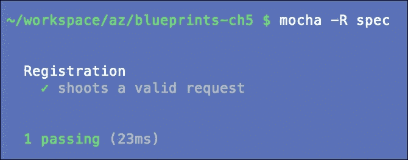
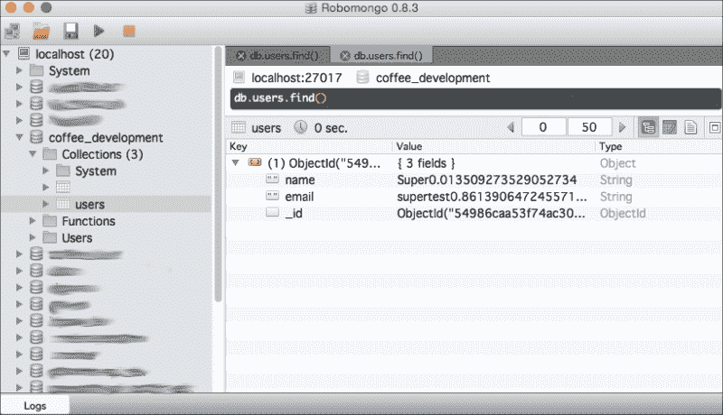
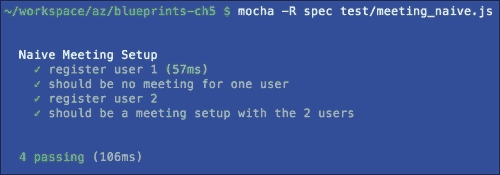
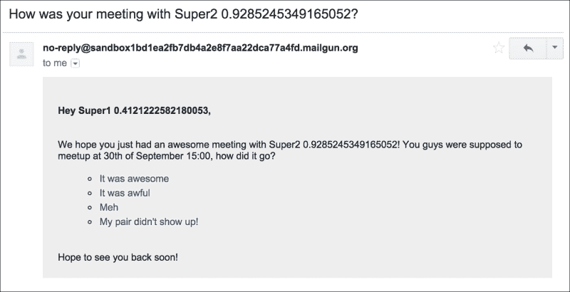

# 第五章. 与陌生人喝咖啡

在这一章中，我们将编写一个 API，允许用户去喝咖啡！这包括一个简单但可扩展的用户匹配系统。

初始时，我们只需让用户输入他们的姓名和电子邮件，这些信息将存储在 MongoDB 中。每当我们可以匹配到最近的其他用户时，就会给双方发送电子邮件，然后就是喝咖啡的时间。在设置好基础之后，我们需要确保我们记录匹配情况，以避免重复发生，从而提供更好的用户体验。

很快，让我们做好准备，使其全球化，并考虑他们的地理位置。

假设一切顺利（这是一个错误），我们已经进行了验证。所以是时候重构到一个更易于维护的架构中，其中配对本身成为一个服务。

最后，让我们允许我们的用户对他们的会议进行评分，并告诉我们它是否是一个成功的会议，在现实世界应用中，用户生成的反馈是无价的！

我们期望这种应用程序结构将为读者提供灵感，以创建现实世界的匹配应用程序。

# 代码结构

在进入实际代码之前，我们想要提供关于本章代码结构的提示，这比之前有所不同，我们希望它能为 Express 和 Node.js 的代码结构提供另一个视角。

有些人可能会称之为**工厂模式**；它由将每个文件的代码包裹在一个可以用来配置或测试它的函数中组成。虽然这需要更多的脚手架，但它使我们的代码摆脱了对静态状态的依赖。它通常会看起来如下：

```js
'''javascript
module.exports = function (dependency1){
  // these will be public
  var methods = {}

  // individual for each instance
  var state = 0

  // some core functionality of this file
  methods.addToState = function(x) {
    state += x
  };

  methods.getResult = function() {
    return dependency1.getYforX(state)
  };

  return methods
}
'''
```

这种结构的推论是，这个文件的每次调用都将有自己的状态，就像类的实例一样，但我们不依赖于它，而是依赖于永远不会丢失的作用域。

再进一步，我们将尝试将每个文件夹的组件结构集中化，每个文件夹都有一个相应的`index.js`，其主要职责是在需要时初始化实例，保留将被传递下来的依赖项的引用，并仅返回公共方法。

# 定义路由

让我们先定义我们需要的第一个路由以及我们希望它们如何表现，并按照 TDD 风格，先构建严格必要的简单逻辑步骤。

1.  第一件事是我们需要让用户能够注册；注册我们的用户的最小测试用例如下：

    ```js
    '''javascript
    var dbCleanup = require('./utils/db')
    var expect = require('chai').expect;
    var request = require('supertest');
    var app = require('../src/app');

    describe('Registration', function() {
      it("shoots a valid request", function(done){
        var user = {
          'email': 'supertest'+Math.random()+'@example.com',
          'name': 'Super'+Math.random(),
        };

        request(app)
          .post('/register')
          .send(user)
          .expect(200, done);
      })
    })
    ```

1.  假设你已经通过`npm i -g mocha`安装了 Mocha，执行`mocha`。

1.  看到 404 了吗？这是个好开始！现在让我们扩展并创建一个文件，`src/route/index.js`，它将声明应用所知道的所有路由。它使用控制器来处理每个关注点。

1.  从`user.js`开始，它实现了一个创建动作，如下面的代码所示：

    ```js
    '''javascript
    // src/routes/index.js
    module.exports = function() {
      var router = require('express').Router();
      var register = require('./user)();
      router.post("/user", user.create);
      return router;
    };

    // src/routes/user.js
    module.exports = function() {
      var methods = {};

      methods.create = function(req,res,next) {
        res.send({});
      }

      return methods;
    };
    ```

1.  这段代码应该足以让 Mocha 通过测试。

1.  对于这个应用，我们将所有的路由定义放在一个地方，即`routes/index.js`。

在这个阶段，我们知道测试设置是有效的。接下来，让我们转向持久性和一些业务逻辑！

# 持久化数据

在库中添加一些多样性，让我们尝试 Mongojs ([`github.com/mafintosh/mongojs`](https://github.com/mafintosh/mongojs))，这是一个旨在尽可能接近原生客户端的简单 MongoDB 库。

1.  首先，让我们创建一个小的配置文件，`./config.js`，用于存储所有常用数据，并返回一个包含每个环境相关配置的简单对象。现在让我们确保我们有一个 Mongojs 接受的 URL 格式。

1.  此文件应能够存储应用的所有全局配置。它确保我们根据环境有不同的设置。

    ```js
    module.exports = function(env) {
      var configs = {};
      configs.dbUrl = "localhost/coffee_"+env;
      return configs;
    };
    ```

1.  此文件需要位于`app.js`中，这是一个初始化和收集依赖项的中心位置，它将被传递给我们的数据库，然后返回公共方法。让我们在以下代码中看看这是如何发生的：

    ```js
    '''javascript
    //..
    var config  = require('../config')(app.get('env'));
    var models  = require('./models')(config.dbUrl);
    app.set('models', models);
    //..
    ```

1.  对于我们的模型，让我们定义一个文件来管理所有模型`s`rc/models/index.js`，其主要职责是实例化数据库并公开公共方法给其他模块，以便存储细节保持封装，使代码保持清洁和松耦合。

    ```js
    '''javascript
    module.exports = function(dbUrl) {
      var mongojs = require('mongojs');
      var db = mongojs(dbUrl);
      var models = {
        User: require('./user')(db)
      };
      return models;
    };
    ```

1.  我们的第一个模型，`user`，具有创建一个用户的能力。请注意，在这个模型中我们没有进行任何验证以保持简单。在没有对模型进行双重检查的情况下不要投入生产。

    ```js
    '''javascript
    module.exports = function (db) {
      var methods = {};
      var User = db.collection('users');

      methods.create = function(name,email,cb) {
        User.insert({
          name: name,
          email: email
        }, cb)
      };

      return methods;
    }
    ```

1.  让我们更新我们的`user.js`路由以使用我们的数据库：

    ```js
    '''javascript
    module.exports = function(Model) {
      var methods = {};

      methods.create = function(req,res,next) {
        Model.User.create(req.param('name'), req.param('email'), function(err, user) {
          if(err) return next(err);
          res.send(user);
        });
      }
    ```

1.  通过这个简单的更改，我们应该在我们的数据库中创建了一个用户。

让我们打开 Robomongo ([`robomongo.org/`](http://robomongo.org/))来查看创建了哪些用户数据；无论我们使用什么库，查找我们在 MongoDB 中的数据都非常方便。



## 异常处理

让我们在这里打开一个括号，并讨论`if(err) return next(err);`。这是一个用于在单个操作中抽象错误处理的模式，该操作应该在 Express 的后续堆栈中进一步处理，通过`app.use`。

1.  为了保持整洁，我们可以将错误处理抽象到一个单独的文件中，我们将为每种类型的错误定义特定的处理程序`src/routes/errorHandler.js`。

1.  让我们先定义一个`catchAll()`方法。Express 将知道这个函数的用途，因为它的功能是 4。

    ```js
    '''
    module.exports = function() {
      var methods = {};

      methods.catchAll = function(err, req, res, next) {
        console.warn("catchAll ERR:", err);
        res.status(500).send({
          error: err.toString ? err.toString() : err
        });
      }

      return methods;
    };
    '''
    ```

1.  最后，它在`routes/index.js`中被激活。错误处理应该是最后一个中间件（s）：

    ```js
    //..
      router.use(errorHandler.catchAll);

      return router;
    };
    ```

# 简单配对

我们可以实现的 simplest 配对系统是，当有人注册时，简单地查找是否有其他未配对的可用用户。

为了做到这一点，我们将开始一个新的集合和模型：Meeting，它将成为我们将扩展的基本匹配结构。基本思想是每个文档将代表一个会议；无论是请求阶段、已经设置或发生，最后也会存储反馈。

我们将随着进展详细阐述并定义其结构。对于初始实现，让我们在用户决定配对时立即运行调度逻辑。策略将是查找一个只有第一个用户被设置的会议文档，并更新它。如果没有这样的文档，让我们创建一个新的。

可能会触发一些竞争条件，我们当然希望避免。具体如下：

+   正在尝试找到安排对象的用户在过程中被安排。

+   可用于安排的用户被选中，但随后被其他人保留。

幸运的是，MongoDB 提供了 `findAndModify()` 方法，它可以在单个文档上自动查找和更新，同时返回更新后的文档。请注意，它还提供了一个 `update()` 方法来更新多个方法。

### 备注

请查看以下链接的文档：[`docs.mongodb.org/manual/reference/method/db.collection.findAndModify/#comparisons-with-the-update-method`](http://docs.mongodb.org/manual/reference/method/db.collection.findAndModify/#comparisons-with-the-update-method)

让我们从一个新的集合 `Meeting` 开始，我们将跟踪用户寻找配对的兴趣以及跟踪会议，如下所示：

1.  此文档将包含用户到该时间点的所有信息，因此我们可以将其用作历史记录，同时也可以使用其内容发送电子邮件和设置审查。

1.  让我们看看 `src/models/meeting.js` 中的代码是什么样的：

    ```js
    '''javascript
      var arrangeTime = function() {
        var time = moment().add(1,'d');
        time.hour(12);
        time.minute(0);
        time.second(0);
        return time.toDate();
      };

      methods.pairNaive = function(user, done) {
        /**
         * Try to find an unpaired User in Meeting collection,
         * at the same time, update with an pair id, it either:
         * 1\. Add the new created user to  Meeting collection, or
         * 2\. The newly created user was added to a Meeting document
         */
        Meeting.findAndModify({
          new: true,
          query: {
            user2: { $exists: false },
          },
          update: {
            $set: {
              user2: user,
              at: arrangeTime()
            }
          }
        }, function(err, newPair) {
          if (err) { return done(err) }

          if (newPair){
            return done(null, newPair);
          }

          // no user currently waiting for a match
          Meeting.insert({user1: user}, function(err,meeting) {
            done();
          })
        });
      };
    '''
    ```

1.  在成功配对的情况下，`user2` 将被设置在 `Meeting` 对象中，以便第二天中午进行会面，正如您在属性 `at` 中所看到的，我们通过 `aux` 的 `arrangeTime()` 函数和轻量级库 moment.js ([`momentjs.com/`](http://momentjs.com/)) 来设置。以这种方式处理日期非常易于阅读。建议您查看并熟悉它。

此外，请注意作为参数的 `new: true`。它确保 MongoDB 返回对象的更新版本，因此我们不需要在应用程序中重复逻辑。

需要创建一个新的对象 `Meeting`，因为它携带了当时用户的信息，并且可以用来为双方编写电子邮件/通知。

这是一个定义我们后续测试的基本结构的好机会，这些测试将遵循对端点进行多次调用并断言响应的模式。有关立即实施测试的决定有详细的解释，如下面的代码所示：

```js
'''
describe('Naive Meeting Setup', function() {
  // will go over each collection and remove all documents
  before(dbCleanup);

  var userRes1, userRes2;

  it("register user 1", function(done){
    var seed = Math.random()
    var user = {
      'name': 'Super'+seed,
      'email': 'supertest'+seed+'@example.com',
    }

    request(app)
      .post('/register')
      .send(user)
      .expect(200, function(err,res){
        userRes1 = res.body
        done(err)
      })
  });

  it('should be no meeting for one user', function(done) {
    models.Meeting.all(function(err,meetings) {
      expect(meetings).to.have.length(1);
      var meeting = meetings[0];
      expect(meeting.user1).to.be.an("object");
      expect(meeting.user2).to.be.an("undefined");
      done(err);
    });
  });

  it("register user 2", function(done){
    var seed = Math.random();
    var user = {
      'name': 'Super'+seed,
      'email': 'supertest'+seed+'@example.com',
    };

    request(app)
      .post('/register')
      .send(user)
      .expect(200, function(err,res){
        userRes2 = res.body
        done(err)
      });
  });

  it('should be a meeting setup with the 2 users', function(done) {
    models.Meeting.all(function(err,meetings) {
      expect(meetings).to.have.length(1)
      var meeting = meetings[0]
      expect(meeting.user1.email).to.equal(userRes1.email)
      expect(meeting.user2.email).to.equal(userRes2.email)
      done(err)
    });
  });
});
'''
```

（来源：git checkout e4fbf672d409482028de7c7427eab769ab0a20d2）



## 测试笔记

当使用 Mocha 时，测试就像任何 JavaScript 文件一样，按预期执行，允许进行任何常规 Node.js require 操作。

`describe()`方法是我们测试执行的上下文；在我们的情况下，它是一定功能性的完整运行。`before()`方法将只运行一次；在这种情况下，我们的逻辑是清理所有的 MongoDB 集合。

它代表了一个简单的期望得以实现。它将以声明的相同顺序运行，我们将尽可能使断言小而可预测。这些函数中的每一个都定义了步骤，在这种情况下，因为我们正在进行端到端测试，我们向 API 发送请求并检查结果，有时将其保存到稍后用于断言的变量中。

有建议说测试不应该依赖于之前的状态，但这些通常不是测试应用程序流程，而是逻辑的各个部分。对于这个特定的测试场景，如果发生失败，重要的是从第一个失败的`it`中解释错误；修复它可能会修复之后的错误。您可以通过使用`-b`标志来配置 Mocha 在第一个错误时停止。

在测试时，最重要的要点是确保我们的测试用例检查了所有预期的案例，并且不会发生不良行为。当然，我们永远无法预测可能出错的所有事情，但测试我们确信的常见问题点仍然是我们的责任。

# 考虑用户历史

我们的用户可能希望始终配对以结识新朋友，因此我们必须避免重复的会议。我们该如何处理这种情况？

首先，我们需要允许设置新会议的方法。想象一下，它就像一个应用中的按钮，会触发对`POST/meeting/new`路由的请求。

当请求被允许并且找到一对或没有一对但现在附属于一个`meeting`对象并且可以与另一个用户匹配时，此端点将以状态`200`回复；如果用户已经安排在另一个会议中，则回复`412`，如果用户期望的电子邮件未发送，则回复`400`；在这种情况下，它不能被满足，因为用户未指定。

### 小贴士

状态码的使用有些主观，（在维基百科上查看更全面的列表：[`en.wikipedia.org/wiki/List_of_HTTP_status_codes`](http://en.wikipedia.org/wiki/List_of_HTTP_status_codes)）。然而，拥有不同的响应是很重要的，这样客户端就可以向用户显示有意义的消息。

让我们实现一个 Express.js 中间件，该中间件要求所有代表用户提出的请求都提供电子邮件。它还应加载他们的文档并将其附加到`res.locals`，这可以在后续的路由中使用。

我们的`src/routes/index.js`将看起来像这样：

```js
'''javascript
//...
  app.post("/register", register.create);
  app.post("/meeting", [filter.requireUser], meeting.create);
//...
'''

The filter in 'src/routes/filter.js' is:

'''javascript
module.exports = function(Model) {
  var methods = {};

  methods.loadUser = function(req,res,next) {
    var email = req.query.email || req.body.email
    if(!email) return res.status(400).send({error: "email missing, it should be either in the body or querystring"});
    Model.User.loadByEmail(email, function(err,user) {
      if(err) return next(err);
      if(!user) return res.status(400).send({error: "email not associated with an user"});
      res.locals.user = user;
      next();
    })
  }

  return methods;
};
```

这个中间件的目标是对于每个没有用户电子邮件的请求停止并返回错误消息。这是一个通常需要用户名和密码或秘密令牌的验证。

让我们为这个中间件设置一个小型但重要的测试套件：

+   清空数据库

+   尝试不使用电子邮件获取我并失败

+   创建一个有效的用户；它成功了

+   尝试使用另一个电子邮件获取我；它失败了

+   使用我们注册的电子邮件访问我，它成功了！

现在我们有了一种加载请求用户的方法，让我们回到不重复匹配人的目标。作为先决条件，他们的过去会议时间必须已经过去，否则它将返回`412`代码。

如果我们想为我们的用户安排会议，但任何安排的会议都将定在明天，我们如何测试它？时间记录器([`github.com/vesln/timekeeper`](https://github.com/vesln/timekeeper))，一个具有简单界面的 Node.js 库，可以更改系统日期；这对于测试特别有用。仔细查看以下测试片段：

```js
'''javascript
describe('Meeting Setup', function() {
  before(dbCleanup);

  after(function() {
    timekeeper.reset();
  });

  // ...

  it('should try matching an already matched user', function(done) {
    request(app)
      .post('/meeting')
      .send({email:userRes1.email})
      .expect(412, done);
  });

  it('should be able match the user again, 2 days later', function() {
    var nextNextDay = moment().add(2,'d');
    timekeeper.travel(nextNextDay.toDate());
    request(app)
      .post('/meeting')
      .send({email:userRes1.email})
      .expect(200, function(err,res){
        done(err);
      });
  });
```

设置一个`after`钩子来重置时间记录器非常重要，这样在场景成功或失败完成后，日期才能恢复正常；否则，有可能改变其他测试的结果。还值得检查如何使用`moment()`方法轻松地进行日期操作，一旦使用`timekeeper.travel()`函数，时间就会扭曲到那个日期。对于所有 Node.js 来说，新的扭曲时间实际上是实际时间（尽管它不会影响任何其他应用程序）。我们也可以根据需要来回切换。

执行此检查的`Meeting`方法（在`models/meeting.js`中定义）如下：

```js
  methods.isUserScheduled = function(user, cb) {
    Meeting.count({
      $or:[
        {'user1.email': user.email},
        {'user2.email': user.email}
      ],
      at: {$gt: new Date()}
    }, function(err,count) {
      cb(err, count > 0);
    });
  };
```

`$or`运算符是必要的，因为我们不知道我们正在寻找的用户将是`user1`还是`user2`，所以我们利用 MongoDB 的查询功能，可以在文档中的对象内部查找，并将`email`作为`String`匹配，以及前面提到的`at`字段。

我们新创建的`src/routes/meeting.js`如下所示：

```js
'''javascript
module.exports = function(Model) {
  var methods = {};

  methods.create = function(req,res,next) {
    var user = res.locals.user;
    Model.Meeting.isUserScheduled(user, function(err,isScheduled) {
      if(err) return next(err);
      if(isScheduled) return res.status(412).send({error: "user is already scheduled"});
      Model.Meeting.pair(user, function(err,result) {
        // we don't really expect this function to fail, if that's the case it should be an internal error
        if(err) return next(err);
        res.send({});
      })
    })
  }

  return methods;
};
```

接下来，我们将定义一个非常重要的辅助函数，该函数用于查找涉及请求用户的先前会议，并返回他们匹配到的每个人的电子邮件，这样我们就可以避免再次将这两位用户匹配在一起。

这样的辅助函数在处理复杂的逻辑时非常有用，可以保持代码的可理解性。一般来说，当一大块代码可以抽象成一个概念时，总是将其分离成更小的函数。

```js
  /**
   * the callback returns an array with emails that have previously been
   * matched with this user
   */
  methods.userMatchHistory = function(user,cb) {
    var email = user.email;
    Meeting.find({
      $or:[
        {'user1.email': email},
        {'user2.email': email}
      ],
      user1: {$exists: true},
      user2: {$exists: true}
    }, function(err, meetings) {
      if(err) return cb(err);
      var pastMatches = meetings.map(function(m) {
        if( m.user1.email != email) return m.user1.email;
        else return m.user2.email;
      });
      // avoid matching themselves!
      pastMatches.push(user.email);
      cb(null, pastMatches);
    })
  }
```

`userMatchHistory`对象的键是通过 MongoDB 的`$nin`运算符实现的，它在元素不匹配数组中的内容时执行匹配。匹配逻辑与我们在简单配对中使用的逻辑完全相同。

在我们的`Meeting`模型中，我们用`pair`方法替换了之前的`pairNaive`方法，它做的是类似的事情，但首先构建一个先前匹配的列表，以确保我们不会再次匹配这些用户。

```js
  methods.pair = function(user,done) {
    // find the people we shouldn't be matched with again
    methods.userMatchHistory(user, function(err, emailList) {
      if(err) return done(err);

      Meeting.findAndModify({
        new: true,
        query: {
          user2: { $exists: false },
          'user1.email': {$nin: emailList}
        },
        update: {
          $set: {
            user2: user,
            at: arrangeTime()
          }
        }
      }, function(err, newPair) {
        if (err) { return done(err); }

        if (newPair){
          return done(null, newPair);
        }

        Meeting.insert({user1: user}, function(err,meeting) {
          done();
        })
        return;
      });
    })
  }
```

# 优化距离

让我们用一个接地气的地理位置方法（啊！我真是太有趣了）来匹配。我们必须现实。我们的服务起源于小城，但正在走向全球，我们不能匹配距离太远的人。

由于我们的会议在`Meeting`集合上没有竞态条件，我们希望保持这种状态，因此让我们调整现有的`pair`方法以包含用户的位置。我们可以假设在注册时，他们将提供他们的位置（或者我们也可以很容易地更新会议文档，一旦他们提供位置）。在我们的现有策略中，有一个用户创建会议文档；在这种情况下，让我们也设置他们的位置，这样下一个寻找匹配的用户就必须在相似的位置，作为额外的约束，如下面的代码所示：

```js
'''javascript
  Meeting.ensureIndex({location1: "2dsphere"});

  //..

  methods.pair = function(user,done) {
    methods.userMatchHistory(user, function(err, emailList) {
      if(err) return done(err);

      Meeting.findAndModify({
        new: true,
        query: {
          user2: {$exists: false},
          'user1.email': {$nin: emailList},
          'location1': {$nearSphere:{
            $geometry :
              { type : 'Point',
              coordinates : user.location } ,
              $maxDistance : 7*1000
          }}
        },
        update: {
          $set: {
            user2: user,
            at: arrangeTime()
          }
        }
      }, function(err, newPair) {
        if (err) { return done(err); }

        if (newPair){
          return done(null, newPair);
        }

        Meeting.insert({
          user1: user,
          location1: user.location
        }, function(err,meeting) {
          done();
        })
        return;
      });

    });
  }
'''
```

我们的`Meeting`集合现在将`location1`索引为`2dsphere`。可以使用操作符`$nearSphere`轻松地将此字段的 geo 查询与之前的查询集成，以匹配球对象中的地理位置。`$maxDistance`是匹配的最大半径。它以米为单位表示，在这种情况下，我们使用`Point`与坐标相交，`Point`是一个之前注册的用户。`7km`是任意选择的，因为它似乎是一个足够合理的半径来与人见面。

如果我们将`$maxDistance`改为相当小的值，一些测试将失败，因为匹配不会发生；请参阅`test/meeting_near.js`。

+   清空数据库

+   在圣地亚哥创建用户 1

+   在瓦尔帕莱索创建用户 4

+   检查是否有匹配

+   在圣地亚哥创建用户 2

+   检查 1 和 2 之间是否有匹配

+   在温哥华创建用户 3

+   检查 3 是否有匹配

+   在瓦尔帕莱索创建用户 5

+   检查 4 和 5 之间是否有匹配

（来源：git checkout 52e8f80b7fe3b9482ff27ea1bcc410270752a796）

# 邮件跟进

用户现在可以进行匹配。会议是独特的，并且是在附近的人之间进行的，这真是太棒了！匹配系统可能的改进没有尽头；因此，现在让我们收集一些关于他们的会议如何进行的数据！

为了做到这一点，我们将向每位与会者发送一封电子邮件，其中包含一些简单的选项来促进参与。其中一些如下列出：

+   真棒

+   真糟糕

+   嘿...

+   我的搭档没有出现！

这些值被添加到`src/models/meeting.js`中作为键值对，我们可以存储它们以供评分，并使用它们向用户传达信息。

```js
  methods.outcomes = function() {
    return {
      awesome : "It was awesome",
      awful   : "It was awful",
      meh     : "Meh",
      noshow  : "My pair didn't show up!"
    }
  }
```

我们可以将这些响应存储在相应的`meeting`对象中，将其与回复的用户关联起来。

为了这个目的，我们将主要依赖包`Nodemailer`([`github.com/andris9/Nodemailer`](https://github.com/andris9/Nodemailer))。它被广泛使用，并提供了对许多集成（包括传输提供者和模板）的支持，这样我们就可以使我们的电子邮件动态化。

来到设置决策，正如你可能意识到的，Node.js 和 Express 在如何设置代码方面没有约定，因为这些应用程序可能做非常不同的事情，没有一种适合所有情况的解决方案。让我们将邮件作为一个单独的关注点，就像持久性和路由一样，它们是分离的关注点，集成到`src/app.js`中。

`src/mailer/index.js`将是我们的入口点，其主要责任是实例化`nodemailer`变量并提供其他文件可以引用的公共方法。

```js
'''
var nodemailer = require('nodemailer')

module.exports = function (mailConfig){
  var methods = {};
  var transporter;

  // Setup transport
  if(process.env.NODE_ENV == 'test'){
    var stubTransport = require('nodemailer-stub-transport');
    transporter = nodemailer.createTransport(stubTransport());
  } else if( mailConfig.service === 'Mailgun'){
    transporter = nodemailer.createTransport({
        service: 'Mailgun',
        auth: {
            user: mailConfig.user,
            pass: mailConfig.password
        }
    });
  } else {
    throw new Error("email service missing");
  }

  // define a simple function to deliver mails
  methods.send = function(recipients, subject, body, cb) {
    // small trick to ensure dev & tests emails go to myself
    if(process.env.NODE_ENV !== 'production') {
      recipients = ["my.own.email@provider.com"];
    }
    transporter.sendMail({
      to: recipients,
      from: mailConfig.from,
      subject: subject,
      generateTextFromHTML: true,
      html: body
    }, function(err, info) {
      // console.info("nodemailer::send",err,info)
      if(typeof cb === 'function'){
        cb(err,info);
      }
    })
  }

  return methods;
}
```

当涉及到测试环境时，我们绝对不希望发送真实的电子邮件，这就是为什么我们注册了存根传输。对于其他环境，我们决定使用`Mailgun`，但我们也可以选择任何通过 SMTP 集成的服务（记住使用 Gmail，因为存在发送电子邮件失败的风险，因为它们有一系列启发式方法来防止垃圾邮件）。

当涉及到测试时，这个部分是较难测试的部分之一，我们将在`test/send_mail.js`中实现一些非常基本的测试。

```js
var dbCleanup = require('./utils/db');
var app = require('../src/app');
var mailer = app.get('mailer');

describe('Meeting Setup', function() {

  it('just send one.', function(done) {
    this.timeout(10*1000);
    mailer.send(
      "my.own.email@provider.com",
      "Test "+(new Date()).toLocaleString(),
      "Body "+Math.random()+"<br>"+Math.random()
    , done);
  })
})
```

将其添加到`config.js`中，并定义相应的环境变量，因为将我们的秘密保留在代码中不是一个好主意。

```js
  var ENV = process.env;
  configs.email = {
    service: "Mailgun",
    from: ENV.MAIL_FROM,
    user: ENV.MAIL_USER,
    password: ENV.MAIL_PASSWORD
  };
```

当我禁用`test`环境时，我实际上可以在我的收件箱中看到电子邮件。胜利！为了让服务看起来更好，让我们尝试一些模板，这正是 email-templates ([`github.com/niftylettuce/node-email-templates`](https://github.com/niftylettuce/node-email-templates))所关注的。

这使得实现动态电子邮件变得容易，包括将 CSS 内联打包；许多电子邮件客户端要求这些内容必须内联。

在`src/mailer/followUp.js`中

```js
'''javascript
module.exports = function(sendMail, models) {
  //..

  function sendForUser (user1, user2, id, date, cb) {
    emailTemplates(templatesDir, function(err,template) {
      if(err) return cb(err);

      template('followup', {
        meetingId: id.toString(),
        user1    : user1,
        user2    : user2,
        date     : date,
        outcomes : Meeting.outcomes()
      }, function(err,html) {
        if(err) return cb(err);
        sendMail(
          user1.email,
          "How was your meeting with "+user2.name+"?",
          html,
          cb
        )
      });
    });
  }

  // call done() when both emails are sent
  return function followUp(meeting, done) {
    async.parallel([
      function(cb) {
        sendForUser(meeting.user1, meeting.user2, meeting._id, meeting.at, cb);
      },
      function(cb) {
        sendForUser(meeting.user2, meeting.user1, meeting._id, meeting.at, cb);
      },
    ], done)
  }
}
```

实际上，我们发送两封相同的电子邮件，以便从两个用户那里获得反馈。这里有一些复杂性，我们将通过使用`async.parallel()`方法来管理。它允许我们启动两个异步操作和回调（完成），当两者都完成时。请参阅[`github.com/caolan/async#parallel`](https://github.com/caolan/async#parallel)。

电子邮件的实际打印由两个文件创建，分别是`src/mailer/templates/followup/followUp.html.swig`和`style.css`，它们分别通过我们的传输解决方案组合和设置：

```js
'''html
<h4 class="title">
  Hey {{user1.name}},
</h4>
<div class="text">
  We hope you just had an awesome meeting with {{user2.name}}!
  You guys were supposed to meetup at {{date|date('jS \o\f F H:i')}}, how did it go?
</div>
<ul>
  
  <li><a href="http://127.0.0.1:8000/followup/{{meetingId}}/{{user2._id.toString()}}/{{id}}">{{text}}</a></li>
  
</ul>
<div class="text">
  Hope to see you back soon!
</div>
'''

'''css
body{
  background: #EEE;
  padding: 20px;
}
.text{
  margin-top: 30px;
}
ul{
  list-style-type: circle;
}
ul li{1
  line-height: 150%;
}
a{
  text-decoration: none;
}
```

我们可以从许多模板解决方案中选择。swig ([`paularmstrong.github.io/swig/docs/`](http://paularmstrong.github.io/swig/docs/))提供了方便的辅助工具，使得处理列表变得容易，并且具有熟悉的 HTML 视觉。以下是一些见解：

+   `{{string}}`是通用的插值方法

+   `|`用于辅助工具（也称为过滤器）；您可以使用内置的或定义自己的

+   `for k,v in obj`是一个标签，用于遍历键值对



当涉及到跟进链接的逻辑时，我们让用户提供反馈变得非常简单；通常，摩擦越少，对卓越的用户体验越好。他们只需点击链接，他们的评论就会立即记录！在 Express.js 方面，这意味着我们必须设置一个路由，将所有数据片段连接起来；在这种情况下，在`src/routes/index.js`中：

```js
  app.get("/followup/:meetingId/:reviewedUserId/:feedback", meeting.followUp);
```

要有一个实际更改数据的`GET`端点，这是 HTTP & REST 约定的例外，但原因是电子邮件客户端将请求作为`GET`发送；我们对此无能为力。

方法在`src/routes/meeting.js`中定义如下：

```js
  methods.followUp = function(req,res,next) {
    var meetingId = req.param("meetingId");
    var reviewedUserId = req.param("reviewedUserId");
    var feedback = req.param("feedback");
    // validate feedback
    if(!(feedback in Model.Meeting.outcomes())) return res.status(400).send("Feedback not recognized");
    Model.Meeting.didMeetingHappened(meetingId, function(err, itDid) {
      if(err){
        if(err.message == "no meeting found by this id"){
          return res.status(404).send(err.message);
        } else {
          return next(err);
        }
      }
      if(!itDid){
        return res.status(412).send("The meeting didn't happen yet, come back later!");
      }
      Model.Meeting.rate(meetingId, reviewedUserId, feedback, function(err, userName, text) {
        if(err) return next(err);
        res.send("You just rated your meeting with "+userName+" as "+text+". Thanks!");
      });
    });

  }
```

此方法进行了相当多的检查，这是因为有相当多的输入需要验证，并提供适当的响应。首先，我们检查提供的`feedback`是否有效，因为我们只接受定量数据。`didMeetingHappened`返回关于会议的两条重要信息；ID 可能完全错误，或者它可能还没有发生。这两种情况都应该提供不同的结果。最后，如果一切看起来都很好，我们尝试评分会议，这应该会正常工作并返回一些数据以响应，并以隐含的`200`状态完成请求。

上述方法的实现可在`src/models/meeting.js`中找到

```js
'''
  // cb(err, itDid)
  methods.didMeetingHappened = function(meetingId, cb) {
    if(!db.ObjectId.isValid(meetingId)) return cb(new Error("bad ObjectId"));
    Meeting.findOne({
      user1: {$exists: true},
      user2: {$exists: true},
      _id: new db.ObjectId(meetingId)
    }, function(err, meeting) {
      if(err) return cb(err);
      if(!meeting) return cb(new Error('no meeting found by this id'));
      if(meeting.at > new Date()) return cb(null,false);
      cb(null,true);
    })
  }

  // cb(err, userName, text)
  methods.rate = function(meetingId, reviewedUserId, feedback, cb) {
    Meeting.findOne({
      _id: new db.ObjectId(meetingId),
    }, function(err,meeting) {
      if(err) return cb(err)
        var update = {};
        // check the ids present at the meeting object, if user 1 is being reviewed then the review belongs to user 2
        var targetUser = (meeting.user1._id.toString() == reviewedUserId) ? '1' : '2';
        update["user"+targetUser+"review"] = feedback;
        Meeting.findAndModify({
          new: true,
          query: {
            _id: new db.ObjectId(meetingId),
          },
          update: {
            $set: update
          }
        }, function(err, meeting) {
          if(err) return cb(err);
          var userName = (meeting["user"+targetUser].name);
          var text = methods.outcomes()[feedback];
          cb(null, userName, text);
        })
    })
  }
'''
```

实现方法应该是相当易读的。`didMeetingHappened()`方法寻找最多一个带有`_id`的文档，其中`user1`和`user2`被填写。当找到这个文档时，我们查看`at`字段并与当前时间比较，以检查它是否已经发生。

速率略长，但同样简单。我们找到`meeting`对象，并确定哪个用户正在被评分。这种属于相反用户的反馈存储在原子操作中，设置字段`user1reviewed`或`user2reviewed`与反馈的键。

我们为这种情况实现了一个详尽的测试套件，我们关注成功和失败的情况。可以通过简单地调用带有`NODE_ENV=development mocha test/meeting_followup.js`的测试来检查电子邮件，这将覆盖测试环境为开发模式，并将电子邮件发送到我们的提供商，这样我们就可以看到它的样子并进行微调。

我们对这个整个场景的测试略长，但我们需要测试几个事情！

+   清理数据库

+   设置会议

+   注册用户 1

+   在相同位置注册用户 2

+   测试不存在会议无法被审查

+   状态 412 在尚未发生的会议审查中

+   提前两天计算旅行时间

+   发送电子邮件

+   选择有意义的复习内容

+   用户 1 应该能够审查会议

+   用户 2 也应该能够审查会议

看起来我们现在可以发送电子邮件并接收评论，这很好，但我们如何以时间敏感的方式发送电子邮件？会议开始后几分钟，电子邮件应该发送给双方。

(来源：git checkout 7f5303ef10bfa3d3bfb33469dea957f63e0ab1dc)

# 使用 node-cron 进行周期性任务

也许你熟悉 cron ([`en.wikipedia.org/wiki/Cron`](http://en.wikipedia.org/wiki/Cron))。它是一个基于 Unix 的任务调度系统，使得运行任务变得容易。它的问题之一是与你的平台相关联，从代码中开启和关闭它并不简单。

认识一下`node-cron`（[`github.com/ncb000gt/node-cron`](https://github.com/ncb000gt/node-cron)）。它基本上是一个相同的任务调度器，但它直接从您的 Node 应用程序运行，因此只要它运行，您的作业就应该运行。

我们的策略很简单：定期选择所有需要邮寄的会议，调用我们的邮件发送者，并针对这些会议中的每一个，将其标记为已邮寄。

按照此应用程序的约定，让我们将关注点分离到它们自己的文件夹中，从以下代码中的`src/tasks/index.js`开始：

```js
var CronJob = require('cron').CronJob;

module.exports = function(models, mailer) {
  var tasks = {};

  tasks.followupMail = require('./followupMail')(models,mailer);

  tasks.init = function() {
    (new CronJob('00 */15 * * * *', tasks.followupMail)).start();
  };

  return tasks;
}
```

它需要将`models`和`mailer`作为参数，这些参数可以在任务中使用。`followupMail`是目前唯一定义的用户，因为我们只需要它。导出的`init`方法将启动 cron 作业，定时器分别表示：`00`定义为秒，意味着它将在每`*/15`分钟的第`00`秒运行，任何小时，任何月份的任何一天，任何月份，任何星期的任何一天。关于实际任务，请参阅`src/mailer/followUp.js`

```js
'''
module.exports = function(Model, mailer) {
  return function() {
    Model.Meeting.needMailing(function(err,meetings) {
      if(err) return console.warn("needMailing", err);
      if(!meetings || meetings.length < 1) return;
      meetings.forEach(function(meeting) {
        mailer.followUp(meeting, function(err) {
          if(err) return console.warn("needMailing followup failed "+meeting._id.toString(), err);
          Model.Meeting.markAsMailed(meeting._id);
        });
      });
      Model.Meeting.markAsMailed(meetings);
    });
  };
};
'''
```

它返回一个函数，当执行时，查找所有仍需要邮寄的会议文档，并对每个文档使用我们之前定义的`mailer.followUp`，完成后，将每封电子邮件标记为已发送。请注意，这里的失败没有地方可以通信，因为这是一个自动化的任务。对于 Web 服务器来说，有意义的日志报告很重要，因此在这种情况下，警告消息应该被报告。

当然，这需要我们在`src/models/meeting.js`中添加两个方法，你现在应该能够轻松理解：

```js
  // all meetings that are due and not mailed yet
  methods.needMailing = function(cb) {
    Meeting.find({
      at: {$lt: new Date},
      mailed: {$exists: false}
    },cb);
  };

  // mark a meeting as mailed
  methods.markAsMailed = function(id,cb) {
    Meeting.findAndModify({
      query: {
        _id: id
      },
      update:{
        $set: {mailed: new Date()}
      }
    },cb);
  };
```

在我们的最终测试中，我们将创建四个用户，意味着有 2 个会议，提前 2 天旅行，并通过任务尝试发送电子邮件，它应该工作并标记两封电子邮件为已发送。

+   清空数据库

+   在同一地点注册用户 1、2、3 和 4

+   会议结束后，旅行时间

+   任务应发送电子邮件

+   验证电子邮件是否已发送

# 摘要

在本章中，我们创建了一个 API，该 API 可以在考虑用户的匹配历史和经纬度对的情况下为用户安排会议，同时给他们提供机会对会议进行反馈——这些信息可以以多种方式使用，以进一步改进算法！

我们希望您了解了许多有趣且实用的概念，例如进行地理查询、测试时间敏感的代码、以风格发送电子邮件以及定期运行的任务。

除了技术细节之外，希望您玩得开心，也许能够激发一些关于匹配应用框架的洞察！

接下来，我们将通过利用生成器的力量来了解`Koa.js`的工作原理，将同步代码的可读性置于 Node.js 的异步功能之上。
