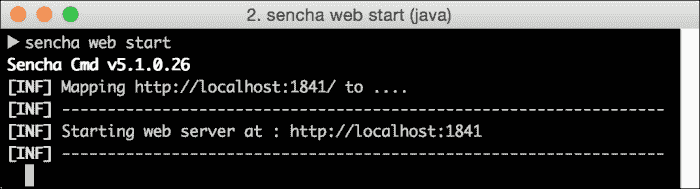
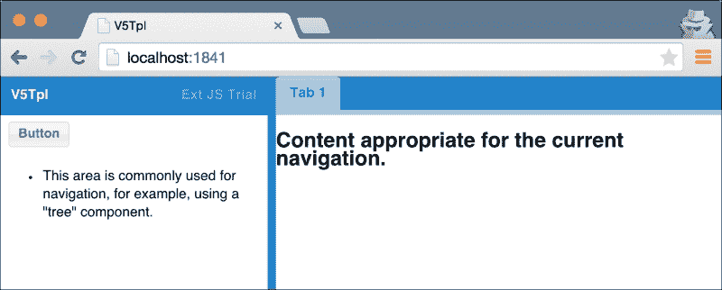

# 第四章. Sencha Cmd

在第三章中，我们描述了 Ext JS 应用程序的本质，即 HTML、JavaScript 和 CSS 的集合。本质上就是一个网页。然而，仅仅从这个角度来看不仅过于简化了问题，而且也意味着你的应用程序无法达到其全部潜力；你将忽略诸如依赖管理、代码优化以及许多其他高质量应用程序应该包含的问题。

### 小贴士

记住，应用程序架构，就像建筑架构一样，不仅仅是将整体的部分拼凑在一起。它关乎砖石和建筑材料，以及构建最终产品的方法。

Sencha Cmd 可以是构建你的项目的重要部分。它为你提供了一个强大的基础，流畅的工作流程，以及精致的最后产品。在本章中，我们将探讨：

+   Sencha Cmd 实际上是什么

+   为什么 Sencha Cmd 在开发过程中很重要

+   它帮助你构建初始应用程序模板，然后协助添加新功能块的方式

+   它如何提供有用的工具来支持持续的开发过程

+   部署过程——为各种平台生成优化的构建，并为更具体的需求定制构建过程

在本章结束时，你将了解为什么使用 Sencha Cmd 构建的应用程序开发部署会显著更容易。你将对 Sencha Cmd 的各个部分以及如何配置和增强它以适应你的需求有一个深入的理解。

# 什么是 Sencha Cmd？

简而言之，Sencha Cmd 是一个可执行文件，它提供了一系列进一步命令来帮助你进行 Sencha 应用程序开发。在底层，它包含了一系列第三方实用工具和脚本，它们组合起来提供这种功能。以下是它安装中包含的一些内容：

+   **PhantomJS**：这是一个用于在不使用浏览器界面的情况下操作网页的工具

+   **VCDIFF**：这是一个用于计算一组文件之间差异的工具

+   **Closure Compiler**：这是一个用于优化和压缩 JavaScript 代码的工具

+   **Jetty**：这是一个提供简单 HTTP 服务器的工具

所有这些都被 Sencha 的一些自定义胶水连接在一起，由 Apache Ant 支持——这是一个在 Java 世界中常用的构建工具。

结果是一个复杂但功能强大的可定制工具。使用 Ant 几乎可以调整和扩展 Sencha Cmd 的所有功能，而 Sencha 的添加提供了一个直接的命令行界面来访问这些功能。

对于应用架构师来说，Sencha Cmd 为你的开发者提供了一个集中的工作流程和一个可重复的构建过程。它可以加快开发时间，并为你的团队工具集添加客户或业务特定的部署任务提供了一种方式。

# 为什么它很重要？

虽然 Ext JS 是在假设其用户很可能会使用 Sencha Cmd 的情况下开发的，但并没有硬性规定它必须使用。

### 注意

我们在这里不会介绍 Sencha Cmd 的安装。最新的安装程序可在 Sencha 网站上找到（[`www.sencha.com/`](http://www.sencha.com/)），应该是一个简单的流程。

在接下来的几页中，我们将创建一个不使用 Sencha Cmd 的小型应用程序，并检查我们在路上会遇到的一些难题。

## 创造的行为

其中一个难题立即出现。使用 Sencha Cmd，创建一个新应用程序就像以下命令一样简单：

```js
sencha -sdk ~/<path-to-ext-sdk> generate app MyApp ./my-app

```

几秒钟内，Sencha Cmd 就会创建一个名为 `my-app` 的新目录，包含以下内容：

+   指定的 Ext JS SDK

+   包含模型、控制器、存储和视图目录的应用程序目录

+   `app.js`、`app.json` 和 `Application.js` 文件

+   `index.html` 文件

+   Bootstrap 文件

+   一个包含配置文件的 sass 目录

+   `.sencha` 目录和 `build.xml`

现在，其中大部分是 Sencha Cmd 支持基础设施的一部分，我们可以将其丢弃。我们将不得不手动创建前面详细说明的大多数项目。让我们开始吧。

让我们创建应用程序目录并将 Ext JS SDK 复制到这里：


纯粹的应用程序目录

接下来是 `index.html` 页面。我们可以创建一个标准的 HTML5 页面，并需要连接 Ext JS 的 JavaScript 和 HTML。在由 Sencha Cmd 生成的应用程序中，我们会有一组 Bootstrap 文件来帮助我们。它们遍历您应用程序的依赖关系树并相应地自动加载文件。没有 Sencha Cmd，我们必须手动包含这些文件。因此，我们最终得到以下代码：

```js
<!DOCTYPE HTML>
<html>
<head>
    <title>NoCMD</title>
    <link rel="stylesheet" type="text/css" href="ext/build/packages/ext-theme-neptune/build/resources/ext-theme-neptune-all.css">
    <script type="text/javascript" src="img/ext-all.js"></script>
    <script type="text/javascript" src="img/ext-theme-neptune.js"></script>
    <script type="text/javascript" src="img/Application.js"></script>
</head>
<body></body>
</html>
```

我们现在可以开始构建我们的应用程序，从一个显示消息框的简单“Hello World”开始：

```js
// Application.js
Ext.application({
    name: 'NoCMD',
    launch: function() {
        Ext.Msg.alert('Welcome', 'To our Command-free application!');
    }
});
```

下一步是将它转换成一个 MVVM 应用程序。一旦我们通过添加 `app`、`app/model`、`app/store` 和 `app/view` 来构建目录结构，我们就可以添加我们的第一个视图。记住，到目前为止我们所做的一切都将是通过 Sencha Cmd 的单个调用创建的。

这是我们的视图类代码；视图模型首先：

```js
Ext.define('NoCMD.view.main.MainModel', {
    extend: 'Ext.app.ViewModel',
    alias: 'viewmodel.main',
    data: {
        introText: 'Welcome to the Command-free MVVM application!',
        buttonText: 'Click Me!'
    }
});
```

这完全是标准的，紧随其后的是视图本身：

```js
Ext.define('NoCMD.view.main.Main', {
    extend: 'Ext.Panel',
    requires: ['NoCMD.view.main.MainModel', 'NoCMD.view.main.MainController'],
    viewModel: 'main',
    controller: 'main',
    items: [
        { xtype: 'component', bind: { html: '{introText}' } },
        { xtype: 'button', bind: { text: '{buttonText}', handler: 'onClickButton' } }
    ]
});
```

注意，与我们的前几个应用程序相比，我们必须显式地要求视图模型和视图控制器。我们稍后会回到这个问题。最后，这是视图控制器：

```js
Ext.define('NoCMD.view.main.MainController', {
    extend: 'Ext.app.ViewController',

    requires: [
        'Ext.MessageBox'
    ],

    alias: 'controller.main',

    onClickButton: function () {
        Ext.Msg.alert('Confirm', 'Are you sure?');
    }
});
```

让我们回到 `requires` 选项。当使用 Sencha Cmd 时，`viewModel` 和控制器配置选项被解析为自动依赖项。当我们运行元命令（或调用元命令的其他命令，如构建）时，它会编译您的代码并生成 Bootstrap 文件，告诉 Ext JS 如何加载您的应用程序。

没有 Sencha Cmd，我们没有自动依赖项，因此必须使用`requires`选项显式指定。这又避免了我们本可以避免的几行代码。

不提及其他所有与视图相关的文件都可以只用一个命令生成的事实：

```js
sencha generate view main.Main

```

我们已经看到使用 Sencha Cmd 设置应用程序和添加新功能是如何简化的。让我们简要看看流程的另一端：部署。

我们希望确保我们的用户拥有尽可能瘦的生产构建，以最小化下载时间。使用 Sencha Cmd，我们可以使用`build`命令创建一组满足我们要求的部署文件。Sencha Cmd 将解析我们的 JavaScript 文件和元数据，并创建一个仅包含我们在应用程序中实际使用的类的最小化 JS 文件。它是通过检查每个类的要求并构建一个可以组合成单个下载的依赖关系树来做到这一点的。

没有 Sencha Cmd，我们将何去何从？以下是我们在每个生产构建中需要采取的步骤：

1.  列出我们应用程序使用的所有文件（包括 Ext JS 框架本身中的文件）。

1.  将它们组合在一起，然后最小化。用这个新文件替换`index.html`中引用的 JavaScript 文件。

记住，这仅适用于 JavaScript！Sencha Cmd 可以为 CSS 执行类似的过程，并将应用程序的 Sass 文件编译成一个单独的下载。

### 注意

Ext JS 使用`Ext.Loader`，这是一个确保所需的类被加载的类，如果没有，则使用 Ajax 请求相关文件并解析它们——这一切都是即时的。这也意味着文件可以从代码的任何需要它的地方加载——没有单一的参考点。

事实上，Ext JS 应用程序的本质使得进行这种类型的生产优化变成一个漫长的过程，并且容易出错。在本章的剩余部分，我们将展示如何使您的构建和整个工作流程变得更加快速、易于重复，并最终产生更高品质的最终产品。

# 设置您的应用程序

Sencha Cmd 支持一个称为工作区的先进概念。在复杂的项目中，可能需要多个页面或部分，本质上是在更大的应用程序中的应用程序。工作区允许您共享常用代码（例如会话管理、自定义 UI 组件和辅助类跨这些各种子应用程序）。它还避免了在子应用程序中重复框架代码（即 Ext JS 源代码）的需要。

### 注意

Sencha Cmd 文档在[`docs.sencha.com/cmd/5.x/workspaces.html`](http://docs.sencha.com/cmd/5.x/workspaces.html)有关于工作区的详细文档。

可以使用以下命令生成工作区：

```js
sencha generate workspace ./my-workspace

```

这只是为工作区添加了一些配置文件。当您为该工作区生成应用程序时，额外的魔力就会出现：

```js
sencha -sdk ~/<path-to-sdk>/ext generate app MyApp ./my-workspace/my-app

```

这里的关键区别是 SDK 将位于工作区根目录而不是应用程序根目录。因此，所有子应用程序都将使用相同的 SDK。

或者，你可以使用 Sencha Cmd 生成一个应用程序，这我们已经提到过：

```js
sencha -sdk ~/<path-to-sdk>/ext generate app MyApp ./my-app

```

这将基于我们之前多次使用过的标准应用程序模板。

虽然工作区是组织代码和促进代码重用的有用方法，但我们将在本书的剩余部分专注于单个应用程序。我们讨论的所有想法都可以在应用程序级别实现，而不会受到工作区的干扰。

# 生成游戏

从这里，我们可以快速构建我们应用程序的骨架。关键的 MVVM 类包括控制器、模型和视图（及其关联的视图控制器和视图模型）。Sencha Cmd 可以帮助我们快速创建所有这些类。

### 注意

使用命令行工具生成代码通常被称为“脚手架”，并由 Ruby On Rails 流行起来。有关更多内容，请参阅[`en.wikipedia.org/wiki/Scaffold_(programming)`](http://en.wikipedia.org/wiki/Scaffold_(programming))。

对于控制器，很简单：

```js
sencha generate controller MyController

```

前一个命令会产生以下结果：

```js
// app/controller/MyController.js
Ext.define('MyApp.controller.MyController', {
    extend: 'Ext.app.Controller'
});
```

然后，模型生成器调用如下所示：

```js
sencha generate model MyModel fullName:string,age:int

```

`MyModel` 是模型名称的直接表示。下一个参数允许在模型中生成字段（以逗号分隔的 `name:type` 字段对列表提供）。在这种情况下，我们创建了两个字段：`fullName` 类型为字符串和 `age` 类型为整数。这给我们以下代码：

```js
// app/model/MyModel.js
Ext.define('MyApp.model.MyModel', {
    extend: 'Ext.data.Model',
    fields: [
        { name: 'name', type: 'string' },
        { name: 'age', type: 'int' }
    ]
});
```

最后，以下是一个视图生成器：

```js
sencha generate view my.MyView

```

这将为我们创建几个文件，如下所示：

```js
// app/view/my/MyView.js
Ext.define("MyApp.view.my.MyView",{
    "extend": "Ext.panel.Panel",
    "controller": "my-myview",
    "viewModel": {
        "type": "my-myview"
    },
    "html": "Hello, World!!"
});

// app/view/my/MyViewController.js
Ext.define(MyApp.view.my.MyViewController', {
    extend: 'Ext.app.ViewController',
    alias: 'controller.my-myview'
});

// app/view/my/MyViewController.js
Ext.define('MyApp.view.my.MyViewModel', {
    extend: 'Ext.app.ViewModel',
    alias: 'viewmodel.my-myview',
    data: {
        name: 'MyApp'
    }
});
```

使用此命令，由于我们正在创建多个文件，我们有创建目录和相应命名空间来包含它们的机遇。在这种情况下，我们在 `app/view/my` 创建了 `my` 目录以存放这三个文件。

### 注意

在这里请注意你模型、视图和控制器名称的大小写。Sencha Cmd 并不会对大小写做特殊处理以保持预期的命名约定。因此，你输入的任何内容都将直接传递到类中。

我们还可以使用 generate 运行两个额外的命令：`theme` 和 `package`，但我们将更详细地介绍这些内容，在第九章，*购物应用程序*中，当我们使用自定义主题构建打包组件时。

# 以风格开发

现在我们已经使用 Sencha Cmd 驱动的应用程序启动并运行，我们可以开始探讨 Sencha Cmd 可以如何简化我们的持续开发过程。这些包括从生成应用程序元数据到编译主题文件。

## 这里提供 – 一个网站

一个标准的 HTML 网页可以直接从你的电脑上运行，无需 Web 服务器。浏览器直接从你的本地驱动器读取文件。随着基于 JavaScript 的 Web 应用的日益流行，浏览器已经引入了各种安全限制，以防止恶意网站读取你的本地文件系统。

这导致了 Ext JS 的问题，因为在开发时，`Ext.Loader`会从你的应用目录动态加载和解析你的应用所依赖的 JavaScript 文件。

解决这个问题的最好方法是将你的代码通过 Web 服务器运行，因为浏览器通常期望这样做。幸运的是，为了避免在开发机器上配置完整的 Web 服务器，Sencha Cmd 为你提供了一个简单的方法来在当前目录中启动一个轻量级服务器。只需运行以下命令：

```js
sencha web start

```

你应该得到类似以下的输出：



确实，在你的网络浏览器中访问`http://localhost:1841`，你的应用将准备就绪并等待：



注意，我们可以覆盖服务器使用的端口。为了在端口`1999`上启动它，我们将发出以下命令：

```js
sencha web -port 1999 start

```

## Bootstrap 过程

Sencha Cmd 的 JavaScript 编译器不仅仅是合并和压缩。它理解你的代码，并将处理某些部分以简化依赖管理。

例如，一个通配符`requires`选项，如`Ext.grid.*`将被展开，以便包括`Ext.grid`下的所有文件和类。某些配置选项，如控制器或 ViewModel，将被转换为它们的完整类引用。这就是 Bootstrap 过程——将依赖信息转换为实际要加载的文件列表的方式。

这种元数据技巧需要付出一点代价。在某些情况下，你需要刷新 Bootstrap 数据，以便 Ext JS 能够成功加载你的应用。一种方法是通过运行以下命令：

```js
sencha app refresh

```

这将快速重建启动你的应用所需的文件。然而，我们可以更进一步，通过运行一个在需要时刷新应用的开发 Web 服务器来一石二鸟。这就像运行以下命令一样简单：

```js
sencha app watch

```

通过这种方式，我们拥有了与 Web Start 相同的功能，并结合了一个监视元数据更改和 Sass 文件变更的过程。当它检测到变化时，它会自动重建 Bootstrap 数据和 CSS。

# 关心环境

Sencha Cmd 支持环境的概念，允许根据工作流程的阶段有不同的行为。我们已经提到，Sencha Cmd 利用 Ant 构建系统的力量来允许自定义过程。不同的环境只是定义了 Ant 消费并传递到构建过程中的变量，以启用、禁用或修改构建的一部分。

您可以通过运行以下命令来查看默认的构建变量：

```js
sencha ant .props

```

这会产生一些代码，其中包括以下代码以及成千上万个其他变量：

```js
[INF] [echoproperties] app.output.js=app.js
[INF] [echoproperties] app.output.js.compress=false
[INF] [echoproperties] app.output.js.enable=true
[INF] [echoproperties] app.output.js.optimize=false

```

这里变量`app.output.js`的值为`app.js`。

### 注意

注意，构建变量和配置变量是两件不同的事情。配置变量由 Sencha Cmd 整体使用，而不仅仅是构建过程。我们只将讨论配置变量，因为它们最常用，并且提供了最多的“物有所值”。我们只是没有空间涵盖每个变量。

现在，我们将更仔细地查看环境。它们与`app build`子命令一起使用，为我们提供了大量自定义生产代码的权力。

## 最终产品

在创建生产构建时，我们希望使我们的代码尽可能精简，删除日志、调试，并确保压缩 JavaScript 和 CSS，并使用所有可用的优化。让我们看看产品环境的覆盖设置：

```js
// Defined in .sencha/app/production.defaults.properties
build.options.logger=no
build.options.debug=false
build.compression.yui=1
build.optimize=true
enable.cache.manifest=true
enable.resource.compression=true
build.embedded.microloader.compressor=-closure
```

让我们逐一查看每个选项，忽略第一行的注释：

1.  禁用 Ext JS 框架日志。

1.  告诉编译器删除标记为调试代码的部分。

1.  使用 YUI Compressor 压缩 JavaScript 代码。

1.  启用自定义优化（例如删除`requires`选项），当依赖树已知时不再需要。这可能会导致代码库略微减小。

1.  生成一个 HTML 缓存清单文件。这指示浏览器缓存应用程序的`index.html`文件以减少网络活动。

1.  压缩 CSS 文件和其他资源。

1.  压缩启动我们应用程序的"microloader" JavaScript。

除了大量的其他配置选项之外，我们还有一个机制来定制我们的最终构建以满足我们的需求。为了跟踪生产问题，您可能希望启用将日志记录到浏览器控制台，以便您可以切换此选项。

您甚至可以创建一个自定义环境，跳过构建的部分以加快过程。查看`sencha ant .props`创建的输出，以了解您可以为团队的需求定制过程的地方是值得的。

# 在构建之前

回到第三章，*应用程序结构*，我们提到了 Sencha Cmd 作为应用程序模板的一部分生成的`build.xml`文件。现在，我们将更仔细地查看，看看我们如何使用此文件来挂钩构建过程并利用它来实现我们的目的。

我们已经提到 Sencha Cmd 使用 Ant，这是一个基于 XML 的构建系统，作为其核心。Ant 的一个关键概念是“目标”，这是一个术语，描述了一组执行构建过程一部分的任务，如 Ant 手册中所述：

> *"目标是在构建过程中协同完成任务以达到期望状态的容器。"*

在我们的案例中，Sencha Cmd 附带了一套预存在的目标，我们可以使用它们来挂钩到构建过程的各个部分。`build.xml`文件包含这些目标的占位符以及一些关于它们做什么的注释。我们将挂钩到其中之一，并实现一个任务，如果某些条件未满足，将停止构建过程。

当我们讨论架构师的角色时，我们推测可能需要强制开发团队遵守编码标准。我们可以使用自动化工具来确保代码库中使用最佳实践。在这里，我们将使用 JSHint：一个 JavaScript 代码质量工具。

Ant 被广泛使用，因此有许多社区创建的附加功能。对于 JSHint，开发者 Phil Mander 创建了一个任务，使其在 Ant 目标中使用。有关更多信息，请参阅[`github.com/philmander/ant-jshint`](https://github.com/philmander/ant-jshint)。

首先，我们需要下载包含新任务的 Java JAR 文件，地址为[`git.io/VSZvRQ`](http://git.io/VSZvRQ)。

我只是简单地将其放置在应用程序根目录中，与`build.xml`文件一起，但如果你有许多额外的任务，创建一个新的目录绝对是值得的。

现在，我们可以配置我们的`build.xml`文件以使用此新任务，如下所示：

```js
<?xml version="1.0" encoding="utf-8"?>
<project name="MyApp" default=".help">

    <import file="${basedir}/.sencha/app/build-impl.xml"/>

    <!-- Expose the new task using the ant-jshint jar file -->
    <taskdef name="jshint" classname="com.philmander.jshint.JsHintAntTask" 
        classpath="${basedir}/ant-jshint-0.3.6-SNAPSHOT-deps.jar" />

    <!-- Hook into the before-init target -->
    <target name="-before-init">
        <!-- JSHint is now fully exposed via XML -->
        <jshint dir="${basedir}/app" includes="**/*.js" globals="Ext:true" options="strict=false">
            <!-- Output a report to a file called jshint.out -->
            <report type="plain" destFile="${basedir}/jshint.out" />
        </jshint>
    </target>
</project>
```

连接这个新任务有几个步骤：

+   添加一个`taskdef`元素，让 Ant 了解`ant-jshint`任务

+   添加名为`–before-build`的目标元素

+   添加一个配置为 GitHub 上文档的`jshint`元素

关于我们配置 JSHint 任务的方式，唯一真正特别的事情是要注意需要在`globals`设置中添加 Ext。由于`ant-jshint`尚未被告知 Ext JS 框架的位置，我们告诉它假设一个名为 Ext 的全局变量在别处定义。

现在，我们可以再次运行`sencha app build`，JSHint 将解析我们的代码，并对照其规则集进行检查。如果我们的代码未通过，整个构建将失败，并在我们应用程序的根目录中创建一个名为`jshint.out`的文件，将显示任何 JSHint 错误的详细信息及其发生的行。

只需十分钟的工作，我们就已经创建了一种低摩擦的方法，以确保有缺陷或低质量的代码不太可能达到生产环境。

这只是预构建检查的一个例子。你也可以：

+   运行测试套件

+   运行代码复杂度检查

通过阻止在检查未通过时创建构建，你正在强制执行一种标准的工作方式，并迫使开发者检查所有有助于创建高质量产品的细节。

# 代码完成

一旦我们的质量检查通过，我们希望查看部署应用程序。同样，我们有机会将一些实践规范化，以确保你的团队能够一次又一次地执行相同的操作。

让我们制定一个典型的流程，代表将应用程序部署到生产环境：

1.  质量检查，如测试和编码标准。

1.  压缩和其他优化。

1.  提高应用程序版本号。

1.  推送到生产服务器。

第一步是由我们的`before-init`步骤处理的。压缩和优化由 Sencha Cmd 的内置任务处理。我们剩下三个任务需要在推送到生产之前完成，所以我们将依次查看它们，但首先，让我们有一个简短的休息，并谈谈 Ant。

## Ant 的应用程序

实际上，接下来的几页是 Ant 的教程，而不是 Sencha Cmd 或应用程序架构。网上和印刷形式中有很多关于 Ant 的资源，那么为什么还要重复旧的内容呢？

记住，这本书不是事实和数字的列表或逐行输入的代码列表。它旨在从自上而下的角度思考应用程序，并了解你如何帮助你的团队为客户构建一个强大的产品。

一个建筑师不仅仅是为了画房子的图片。他们是为了确保建造了一座美丽的房子，房主离开时感到高兴。

## 版本号

返回 Ant。你想要用构建或版本号标记应用程序的多个原因之一是让利益相关者知道他们正在审查的版本，以查看它是否包含他们预期的错误修复。

应用程序版本化是一个两步过程：

1.  生成一个新的构建号。

1.  将其插入 JavaScript 文件以在 UI 上显示。

Ant 提供了一个任务，使第一步变得相当简单：

```js
<propertyfile  file="app.properties">
            <entry key="build.number" type="int" operation="+" value="1"/>
</propertyfile>
```

我们使用`propertyfile`任务指定一个名为`app.properties`的文件将包含一个名为`build.number`的条目。每次我们运行任务时，它都会触发一个操作，将`thisentry`增加一，如下所示：

```js
<property file="app.properties"/>
<replace file="${build.classes.file}" token="{VERSION}" value="${build.number}"/>
```

接下来，我们读取`app.properties`文件，了解如何使用属性任务，该任务使它包含的属性可用于后续任务。

最后，我们在生成的 JS 文件中对`{VERSION}`令牌进行搜索和替换，并将其替换为`build.number`属性。让我们看看完整的`build.xml`：

```js
<?xml version="1.0" encoding="utf-8"?>
<project name="MyApp" default=".help">

    <import file="${basedir}/.sencha/app/build-impl.xml"/>

    <target name="-after-page">
        <propertyfile  file="app.properties">
            <entry key="build.number" type="int" operation="+" value="1"/>
        </propertyfile>

        <property file="app.properties"/>
        <replace file="${build.classes.file}" token="{VERSION}" value="${build.number}"/>
    </target>
</project>
```

注意，我们正在使用`after-page`目标作为钩子。这个钩子在 Sencha Cmd 组装完所有应用程序的依赖项并创建一个包含它们的单个文件之后触发。这是我们进行搜索和替换的文件，这意味着我们的原始源文件保持完好。你可以有一个像这样的 JavaScript 文件：

```js
// app/Application.js
Ext.define('MyApp.Application', {
    extend: 'Ext.app.Application',
    name: MyApp',
    version: '{VERSION}'
});
```

此外，`{VERSION}`令牌将被替换，使你能够在整个应用程序中使用版本号，也许在页脚或**关于**屏幕上。

## 从发布到生产

我们的代码整洁有序，我们知道我们正在发布哪个版本。下一步是将它推送到生产服务器。我们将使用 SFTP 将文件传输到远程服务器：

```js
<target name="-after-build">
    <input
        message="Please enter SFTP username:"
        addproperty="scp.user" />
    <input
        message="Please enter SFTP password:"
        addproperty="scp.password" />
    <scp remoteTodir="${scp.user}@sftp.mysite.com:/path/to/myapp/dir" password="${scp.password}">
        <fileset dir="build/production"/>
    </scp>
</target>
```

我们使用`afterbuild`目标，这意味着构建的所有其他方面都已完成，最终的生产文件也已构建。由于硬编码安全凭证是一个非常糟糕的主意，我们使用输入任务从命令行请求用户输入。结果输入被分配给`addproperty`中指定的属性。

`scp`任务的`remoteToDir`属性应根据您的需求进行定制，但`scp.username`和`scp.password`的值将填充之前用户输入的内容。在`fileset`任务中，我们指定将整个`build/production`目录推送到远程服务器。

我们已经展示了如何利用 Ant 的力量钩入 Sencha Cmd 构建过程的关键方面，将容易出错的手动任务转换为可以轻松与开发团队共享的自动化任务。

# 其余最佳选择

我们只是触及了 Sencha Cmd 能做什么的表面。我们从一个高度感兴趣的架构师的角度来看 Sencha Cmd，但架构师需要对其开发者可用的完整工具栈有强烈的认识。让我们快速浏览一下 Ext JS 开发者可以使用的一些功能，以简化他们在应用程序细节上的工作。

## 包

包是在项目之间重用代码的一种方式。Sencha Cmd 和 Ext JS 将包视为 Sencha 生态系统中的具体概念，因此开发者应该意识到它们可供使用。我们之前讨论的工作空间概念有助于包的开发，但它们可以在应用级别进行消费，为应用提供一个整洁的 CSS、JavaScript 和其他资源的捆绑包，以便从本地或远程源使用。

### 注意

在[`docs.sencha.com/cmd/5.x/cmd_packages/cmd_creating_packages.html`](http://docs.sencha.com/cmd/5.x/cmd_packages/cmd_creating_packages.html)的 Sencha 文档提供了创建包的说明。

在企业层面，包是提供可重用逻辑和用户界面元素的关键方法，这些元素可以在团队之间共享。代码重用需要在架构层面考虑，以避免重复造轮子，因此当考虑大局时，包可以是一个重要的工具。

## 主题

在 Ext JS 中处理 CSS 和图像有两种方法：首先是有完整主题选项，您创建一个包含图像、Sass 文件和 JavaScript 定制的包，为您的应用程序构建一个完全定制的视觉和感觉。在许多情况下，只需要对标准 Ext JS 组件进行一些微调，以及为您的 UI 元素添加一些额外样式就足够了。在这种情况下，Sencha Cmd 提供`sencha compass compile`将 Sass 文件转换为包含在您的应用程序中的 CSS。别忘了`sencha app watch`也会自动处理这一步骤。

## 编译

命令的构建过程依赖于一个名为 compile 的子命令，该子命令负责解析构成您应用程序的文件。这个子命令可以独立调用，并且可以用来创建一个应用程序依赖项列表，该列表可以被 Sencha Cmd 以外的工具进一步处理。

在更大的 JavaScript 生态系统内，开发者可能更熟悉的构建工具（如 Grunt 和 Gulp）的数量正在增长。通过使用 Sencha Cmd 的一小部分功能，您的团队可以在使用 Ext JS 框架的同时继续利用这些工具。

# 摘要

标准和流程是软件架构师的关键职责，而 Sencha Cmd 是帮助履行这些职责的不可或缺的工具。我们看到了它如何触及应用程序生命周期的各个部分，从快速使用模板启动到将开发代码库的各个部分连接起来，再到创建一个最终优化的产品。

不仅如此，Sencha Cmd 提供的各种钩子提供了灵活性。它与您和您的团队合作，帮助简化开发过程并节省本可以浪费在手动任务上的时间。

在接下来的几章中，我们将探讨如何将我们迄今为止关于 Ext JS 应用程序架构所学的所有内容拼凑起来，并使用一些实际例子进一步展示如何为客户构建出色的产品。
