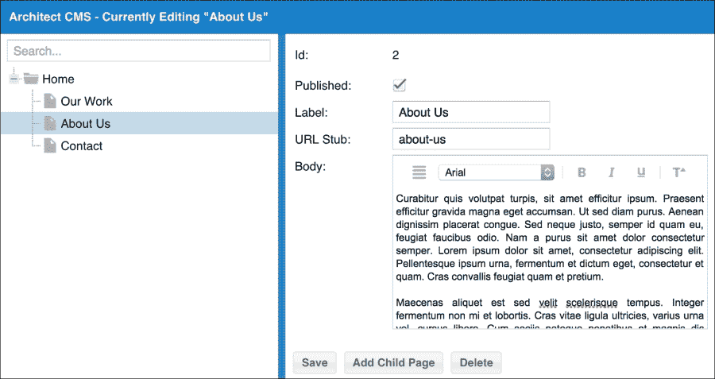
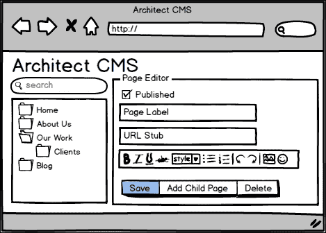
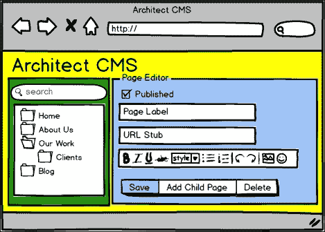
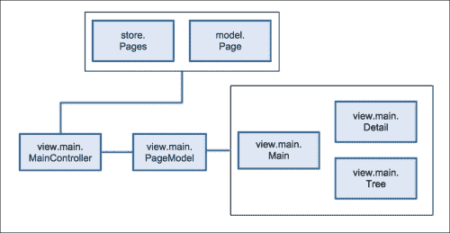
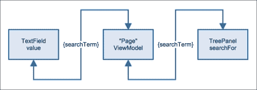

# 第五章：实践 - 一个 CMS 应用

在前面的章节中，我们探讨了应用架构的理论方面以及我们将使用的工具来支持我们。我们已经回顾了设计模式，以及我们应用的结构化方法。现在，是时候了解这些如何组合在一起以创建一个结构良好的应用了。

在本章中，我们将创建一个内容管理系统（**CMS**）的基本用户界面。虽然许多企业将使用现成的 CMS（如 Joomla!或 Drupal），但企业间需求的巨大差异意味着定制内容管理系统是一个相当常见的项目。

这也是一个具有欺骗性的复杂提议。由于业务特定的需求范围很广，基本的 CMS 可以迅速变成一个复杂的应用，具有针对特定问题的模块和界面元素。这使得确保基础得到妥善处理变得尤为重要，例如代码结构和命名约定。

反映这一点，我们只会创建一个基本的入门级 CMS。我们将：

+   设计数据结构和相应的 Ext JS 模型和存储实现

+   构建完整的类结构并映射它们之间的交互

+   为一些更复杂的交互绘制伪代码

+   将我们的设计扩展到完整的实现

这也是接下来几章的一般模式。在本章中，我们的应用将包含：

+   网站结构的分层树形视图

+   搜索功能

+   显示页面详情的表单面板

+   创建、更新、读取和删除功能

到本章结束时，我们将使用 Ext JS 5 的 MVVM 架构将我们的知识应用于一个基本的现实世界应用，以使我们的代码结构整洁且易于理解。

# 内容管理系统

我们将生产一个基本但可用的 CMS 实现，它使用我们已经接触过的某些 Ext JS 架构概念，例如视图模型和视图控制器、事件监听器和数据绑定。以下是期望的最终产品：



架构 CMS：我们的第一个示例应用

在我们达到这个点之前，我们需要审查应用的需求，设计其各种应用层，并提出一个设计。只有这样，我们才能开始谈论代码层面。让我们从检查客户的请求开始。

# 需求

我们从客户那里收到两个项目概要文件：一个线框图和一组需要满足的标准。线框图是我们应用的大致布局，如下所示：



“架构 CMS”的线框图

立刻，我们知道这是一个非常简单的单页应用，具有树形视图、编辑面板和搜索栏。标准如下：

+   提供 REST 后端 API

+   显示所有页面的树形视图

+   搜索功能，将在树形视图中突出显示匹配的页面

+   所需的 HTML 编辑器

+   必须可定制的 URL

+   可以发布或取消发布的页面

+   用户必须能够创建、查看、更新和删除页面

让我们以 Ext JS 的角度来评估这些准则。首先，我们知道 REST 支持通过`Ext.data.proxy.Rest`在 Ext JS 中可用，我们可以通过我们的模型和存储来使用它。然而，请注意，第二点需要一个表示层次结构的树形视图。虽然 Ext JS 提供了一个`TreePanel`组件，并且有一个专门的`TreeStore`来处理层次数据，但通过 REST API 加载这种嵌套数据可能存在一些复杂性。

### 小贴士

在这一点上，我们可以与我们的团队协商，甚至编写一些原型代码来调查这个 REST 问题，然后再全面开始开发。在前进之前解决任何不确定性是很重要的。

在澄清了这一点之后，我们现在来看一下搜索的要求。我们知道`Ext.data.NodeInterface`，这个类为`TreePanel`中的节点提供动力，有一个`findChildBy`方法，允许我们从根节点遍历树，并在找到所需内容时执行任意操作。

客户指定需要一个 HTML 编辑器，这是可以接受的，因为 Ext JS 自带了一个功能齐全的 WYSIWYG HTML 编辑器，位于`Ext.form.field.HtmlEditor`。对于 URL 定制，我们不需要做任何特别的事情，只需意识到客户要求在编辑时包含此字段；同样，发布/取消发布标志也是如此。

最后，我们知道了客户希望在页面上执行的操作，这决定了我们的应用程序如何与现有的后端交互。鉴于我们可用的 REST API，通过`Ext.data.Model`的实现，支持所需的**创建、读取、更新和删除**（**CRUD**）操作应该是微不足道的。

## 接受挑战

在我们将客户的准则与我们可用的工具进行了审查之后，我们可以自信地接受摆在我们面前的挑战。如果不进行充分的客户需求尽职调查，我们可能会在没有 100%确定能否完成的情况下开始一个项目，这可能会危及项目的成功，并浪费宝贵的时间和金钱。

# 从底部开始

客户表示我们有一个 REST API 可用。实际上，他们还有其他需要在上面构建的 Ext JS 应用程序，因此我们很幸运。数据以 JSON 格式返回，可以很容易地被`Ext.data`消费。客户提供了关于 API 如何操作的文档：

```js
API Endpoint: http://localhost:3000

GET /pages
Accepts: n/a
Returns: [{ id: 1, text: 'label', children: [] }, { id: 2, text: '', children: [] }]

PUT /page
Accepts: {"published":true,"stub":"our-work","body":"Our Work.","id":"5e30c0a3-729a-4719-a17f-7e2286576bda"}
Returns: {"success":true}

POST /page
Accepts: {"label":"New Page","text":"New Page","leaf":true,"id":"Unsaved-1","parentId":"5e30c0a3-729a-4719-a17f-7e2286576bda","published":true,"stub":"new-page","body":"A New Page."}
Returns: [{"clientId":"Unsaved-1","id":"2ae28c61-cc6e-4a98-83ee-f527f4b19f1e","text":"New Page","body":"A New Page.","published":true,"stub":"new-page","leaf":true}]

DELETE /page
Accepts: {"id":2}
Returns: {"success":true}
```

在这一点上，你的开发者将会跳一小段舞，因为不仅你有文档，而且 API 非常直接，只支持少数操作。

我们的数据实现部分现在变得简单了。我们知道我们想要实现一个树形视图。从`/pages`返回的数据已经以具有子数组和 ID 及文本属性的正确格式进行了格式化。我们只需要一个模型来表示一个页面，所以它在伪 UML 中看起来可能像这样：

```js
ArchitectureCms.model.Page: extends Ext.data.TreeModel
- id
- stub
- published
- body
- [] children
```

然后，我们将有一个非常简单的存储来收集这些模型：

```js
ArchitectureCms.store.Pages: extends Ext.data.TreeStore
```

店中没有挂载任何自定义逻辑，所以这实际上就是我们的完整定义，尽管我们知道我们的实现将配置为使用我们的`ArchitectureCms.model.Page`。

数据层是构建一切的基础。尽管我们为这个层的设计在这个应用中非常简单，但写下来还是有价值的，以防我们遇到任何明显的问题。现在我们可以看看这些数据类将如何与用户界面和应用程序其余部分的粘合类交互。

# 逐步提升

控制器是绑定应用程序的粘合剂；通常再次查看我们的线框图并分解代表视图类并需要控制器来协调其动作的方面是有用的。基本线框图可以在以下屏幕截图中看到：



线框图分解：黄色、绿色和蓝色都被识别为独立的视图

在这个应用程序中，由于我们有一个非常直接的布局和组件之间的交互集，我们可以使用一个非常简单的架构。

虽然在应用程序的早期阶段创建一个强大的起始结构很重要，但你应该始终努力构建一个设计清晰且不包含只是为了以防万一而添加的类的结构。

### 小贴士

**你不会需要它**（**YAGNI**）是某些软件开发者中流行的术语，他们认为少即是多——不要基于对你可能需要的某些遥远未来的假设来编写代码。相反，随着每一次添加迭代你的架构，并像在项目开始时一样对这些添加给予足够的关注。

在 Ext JS MVVM 架构中，顶级控制器用于调解其他控制器之间的交互。在这里，我们选择只创建一个控制器（一个名为`Main`的视图控制器），它将协调其命名空间内所有视图的动作。

让我们看看这些新类如何协同工作，以及它们如何与我们的数据层相关联：



上述图表清楚地显示了数据如何通过我们的应用程序流动（从与客户端 API 交互的数据层到控制器，然后通过视图模型下降到视图）。现在我们可以通过命名它们并指定它们的方法和属性来具体化这些类：

```js
ArchitectCms.view.main.MainController: extends Ext.app.ViewController
- onAddClick
- onDeleteClick
- onSaveClick
- onPageSelect
ArchitectCms.view.main.PageModel: extends Ext.app.ViewModel
- pages
- currentPage
- isUnsavedPage
- searchTerm
ArchitectCms.view.main.Main: extends Ext.panel.Panel
ArchitectCms.view.main.Detail: extends Ext.form.Panel
ArchitectCms.view.main.Tree: extends Ext.tree.Panel
- searchFor
```

让我们稍微分解一下，并讨论我们为什么以这种方式设计应用程序的原因。

## 细节决定成败

很明显，控制器是大多数有趣事情发生的地方，但重要的是要记住保持你的控制器精简。如果你发现自己有很多方法，那么这是一个很好的迹象，表明你需要另一个控制器——寻找可能分离开的逻辑位置。

在我们的案例中，应用的未来迭代可能需要为树和详细面板分别设置视图控制器，以及一个总控制器以实现两者之间的通信。然而，目前我们并不需要这个。在我们的 `MainController` 类中，只有四个方法将处理来自视图的操作。

### 小贴士

控制器的作用是支持其他一切。首先关注你的数据，然后是视图，并使用控制器将它们连接起来。因此，确定你的视图将要触发哪些事件，控制器基本上就会自己写出来——它所做的只是处理这些事件并将艰苦的工作传递到其他地方。

这是一个很好的机会，暂时将实现细节放在一边，思考如果这些类被设计成让我们的生活更轻松，它们会是什么样子。

例如，名为 `PageModel` 的视图模型有一个名为 `isUnsavedPage` 的方法，它允许你确保用户在保存新页面之前不会导航离开，从而确保他们不会丢失任何数据。

在一开始就采用这种设计方式，使我们能够思考所有那些构成良好用户体验的出色功能，而无需担心实现这些功能的代码。当然，每种情况都是不同的。我们需要确保我们不会让我们的想象力失控，开始梦想那些不必要的功能！

关于 `Tree` 类上的 `searchFor` 方法，有一些简短的讨论。在控制器中，我们汇集了我们应用的一些部分，并将实际工作交给它们，而不是控制器本身。这正是我们在这里所做的事情。你可以用与在 `Ext.tree.Panel` 基础上使用 `expandPath` 方法相同的方式思考这个方法——这是一个作用于树接口而不与其他任何东西交互的方法。它的逻辑位置是作为树 UI 的增强。

# 野性的地方在哪里

我们有自己的设计，所以让我们稍微靠近一点，检查一下应用中可能需要更多细节的部分。例如，我们有一个名为 `onAddClick` 的控制器方法，它将处理添加新记录的过程，但实际会涉及哪些内容，以及其中是否隐藏着任何痛点？当这个处理程序完成其工作时，需要发生以下情况：

+   向用户请求新页面的名称

+   创建一个新的空白记录，具有默认值和页面名称

+   将页面作为当前页面的子节点添加

+   在详细面板中加载记录

+   在树中显示新记录

单个控制器动作包含的内容很多。让我们看看我们如何编写它，以确定我们是否试图做太多。我们将编写一些伪代码（假代码）来深入细节：

```js
newPageName = promptUser 'Please enter a page name'

newPageModel = new Page {
    text = newPagename
}

pageTree.addAndSelect newPageModel
```

这里没有使用 JavaScript，也没有使用 Ext JS 类。我们只是在编写我们希望在没有任何语言或框架限制的情况下能够编写的代码。鉴于这一点，这段代码看起来不错——它清楚地表明了正在发生什么，我们也没有做太多。

有一点需要注意，`Ext.panel.Tree`没有原生的`addAndSelect`方法。我们需要编写这个方法，但如果它使我们的控制器代码更简洁、更短，那么这很好。

## 锐利且复杂

在软件开发中有一个普遍的真理，那就是代码的阅读难度大于编写难度。在没有理解背后的推理的情况下理解他人的代码可能会很困难。话虽如此，代码的难度在于它有点复杂、有点令人恐惧——这种代码没有通过注释、变量命名或方法命名来明确其意图，而代码则考虑到了未来的维护者。

在编写伪代码时，我们试图确保我们的代码背后的概念在真正开始工作之前就已经得到了充分的阐述，并且任何困难都在我们真正开始工作之前得到了解决。

在复杂的情况下，伪代码可能不足以解决问题。我们将不得不编写一些真正的代码，形式为尖峰。在*《更好的 Smalltalk 指南：有序集合》*中，*SIGS*谈到了这一点：

> *"有时我称之为“尖峰”，因为我们正在整个设计中钻一个尖峰。[…]

在创建尖峰时，我们正在克服任何假设，并在一个小型原型（我们能够构建的最小代码片段或应用程序）上测试我们的设计决策，以证明我们的想法。

通过消除进一步的未知因素，这巩固了我们的设计。我们可以确信 UI 组件将支持我们所需的功能，因为我们已经在实际示例中对其进行了测试。如果它是架构代码尖峰，我们可以看到我们的设计元素是否以一种“感觉正确”的方式组合在一起，如果它在使用的框架中工作，以及选择的设计模式。

我们可以对之前描述的`addAndSelect`方法进行尖峰测试，但我们知道`Ext.tree.Panel`已经有一个`add`方法，并且底层的`selectionModel`将允许我们标记一个节点为选中状态。因此，现在我们已经通过伪代码缓解了我们的担忧，就没有必要继续编写真正的代码，直到我们实现了真正的功能。作为在时间和金钱限制下工作的开发者，我们需要务实，只要我们确信已经完成了尽职调查。

# 真正的事情

我们已经设计了数据层和 UI 层，以及连接这两个层的粘合剂，并解决了可能引起麻烦的客户需求剩余部分。我们现在可以开始在我们的首选文本编辑器中敲击键盘，展示如何在 Ext JS 中实现设计。

## 数据绑定简短中断

随着 Ext JS 中视图模型的引入，数据绑定的概念也得到了突出。简而言之，数据绑定将一个值绑定到另一个值。当第一个值更改时，第二个值会自动更新。双向数据绑定意味着当任一值更改时，另一个值会相应地更新。

总体而言，Ext JS 通过视图模型实现了这个想法。一个 UI 组件可能将其标题绑定到一个值上，当这个值被应用程序的另一个部分更新时，标题会自动更改。这消除了开发者设置更改事件的必要性，并确保数据在整个应用程序中保持一致性。

在这个示例应用程序以及我们所有的实践章节中，我们将大量使用数据绑定。在许多情况下，一点点的绑定配置可以消除大量的样板事件连接，因此我们将充分利用这一点。

# 创建结构

使用我们之前章节的知识，我们将使用 Sencha Cmd 创建一个应用程序骨架，并将其作为我们工作的基础。现在我们已经熟悉这个过程：

```js
sencha generate app -ext ArchitectureCms ./architecture-cms

```

通过一个简单的命令，我们就可以使用模板启动并运行。让我们启动一个网络服务器并查看代码中的变化：

```js
cd architecture-cms
sencha app watch

```

现在，我们可以启动一个网络浏览器并导航到 `http://localhost:1841` 来查看模板的实际效果。我们不希望有任何生成的示例代码。因此，我们可以使用以下命令将其删除：

```js
rm app/view/main/*

```

现在，我们已经有一个干净的目录结构，我们可以在此基础上构建我们的内容管理系统。

# 数据驱动设计

与我们首先查看数据层来设计应用程序的方式相同，我们将首先编写 Ext JS 模型和存储代码。以下是模型，我们将逐步构建它来解释代码背后的思考过程：

```js
Ext.define('ArchitectureCms.model.Page', {
   extend: 'Ext.data.TreeModel',
fields: [
        { name: 'body' },
        { name: 'stub' },
        { name: 'text' },
        { name: 'published' }
    ]
});
```

让我们回顾一下这个类的设计。我们定义了与之前相同的字段，除了子字段，这是一个特殊情况，因为我们正在使用 `Ext.data.TreeModel`。

当然，这不足以驱动一个真实的 Ext JS 模型。这就是设计现在与实现不同的地方。让我们将模型连接到客户的 API：

```js
Ext.define('ArchitectureCms.model.Page', {
    extend: 'Ext.data.TreeModel',

    fields: [
        { name: 'body' },
        { name: 'stub' },
        { name: 'text' },
        { name: 'published' }
    ]
});
```

哇！设计基本上是语言无关的，但实现现在展示了非常 Ext JS 特定的配置选项。配置模型有两种方式。一种是通过其代理进行配置，另一种是通过其模式进行配置。代理配置运行良好，但在大型应用程序中，模式可以在模型之间共享，并提供一个中心位置来配置基本 API URL 和特定模型的获取路径。

由于这个原因，我们将从使用模式开始，尽管在这个应用程序中我们只处理一个模型。让我们看看各种配置选项：

+   `namespace`：这是模型类名中表示命名空间的段。这意味着 Ext JS 可以移除完整类名中的命名空间部分，只留下模型，然后它可以使用它来自动构建 URL。在这种情况下，我们将命名空间设置为 `ArchitectureCms.model`，这使得 Ext JS 能够推断出模型名称只是 `Page`。我们稍后会用到这个。

+   `urlPrefix`：这通常是主机名或与特定资源路径结合使用的 API 端点。

+   `proxy.type`：这是代理的类型，在处理服务器时很可能是 `ajax` 或 `rest`。我们知道我们的客户有一个 REST API，所以它被设置为 `rest`。

+   `proxy.url`：它使用所有前面的选项来构建一个 URL。花括号中的段将按顺序替换，以构建一个完整的 URL 到正在消耗的资源。`{prefix}` 是上面的 `urlPrefix`，`{entityName:uncapitalize}` 是从类名中解析出的模型名称，没有命名空间，且为小写。

哇！到目前为止，我们已经深入探讨了 Ext JS 的配置选项。这一章，以及整本书，本应关于架构。所以从现在开始，有些情况下我们会跳过这类细节，假设你已经使用过 Ext JS 并且理解这些配置选项。

我们正在尝试设计这个应用程序；我们不是在教 JavaScript 或 Ext JS。尽管如此，我们会看看 Ext JS 框架的各个方面，这些方面有助于成功应用，但我们不会重复 Sencha 文档的内容。考虑到这一点，让我们对我们的模型添加更多内容，并讨论它是如何帮助我们满足客户需求的：

```js
Ext.define('ArchitectureCms.model.Page', {
    extend: 'Ext.data.TreeModel',
    clientIdProperty: 'clientId',
    identifier: {
        type: 'sequential',
        prefix: 'Unsaved-'
    },
    schema: {
        namespace: 'ArchitectureCms.model',
        urlPrefix: 'http://localhost:3000',
        proxy: {
            type: 'rest',
            url: '{prefix}/{entityName:uncapitalize}'
        }
    },
    fields: [
        { name: 'body' },
        { name: 'stub' },
        { name: 'text' },
        { name: 'published' }
    ]
});
```

这是 `Page` 类的最终迭代版本，现在已配置了标识符。我们知道我们需要区分已保存和未保存的模型，也知道如果提供，服务器将返回 `clientId`，所以在这里我们明确指出，ID 将包含 `Unsaved-` 字符串，直到服务器提供一个自动递增的标识符来替换它。

## 模型存储

这个应用程序的存储相当简单：

```js
Ext.define('ArchitectureCms.store.Pages', {
    extend: 'Ext.data.TreeStore',
    model: 'ArchitectureCms.model.Page',
    alias: 'store.pages',
    root: {} // set empty root as using bind doesn't do this
});
```

这里的一切都是不言自明的，尽管有一个注意事项。在当前版本的 Ext JS（5.0.1）中，我们需要设置一个空的根节点，以便你可以使用数据绑定将此存储绑定到 UI 组件。如果不这样做，将会抛出错误，所以这是一个简单的解决方案。

# 有景观的房间

我们提到，设计你的应用程序（从数据层开始，然后移动到视图）是一个好主意，这样更容易理解控制器将必须处理的交互。当从设计到代码时，同样适用，因此我们将为这个应用程序编写用户界面，然后稍后通过控制器将其连接到数据。

首先，我们需要一个视口。在 CMS 中我们只有一个页面，所以视口是所有单个子视图（如树形图和详细面板）的容器。这个应用程序相当专注，因此我们将所有的视图和关联的类放在`ArchitectureCms.view.main.*`命名空间下。下面是`ArchictureCms.view.main.Main`视口的代码：

```js
// app/view/main/Main.js
Ext.define('ArchitectureCms.view.main.Main', {

    extend: 'Ext.panel.Panel',
 requires: [
        'ArchitectureCms.view.main.Detail',
        'ArchitectureCms.view.main.Tree'
    ],

    session: true,

    controller: 'main',
    viewModel: 'page',

    title: 'Architect CMS',
    bind: { title: 'Architect CMS - Currently Editing "{currentPage.text}"' },

    layout: 'border',

    items: [
        { xtype: 'page-detail', region: 'center', reference: 'detail' },
        { xtype: 'page-tree', region: 'west', width: 300, reference: 'tree', split: true }
    ]
});
```

这部分主要是直截了当的（我们扩展`Ext.Panel`而不是`Ext.Container`以提供标题栏的支持）。接下来，我们需要在视口中使用视图类。

`session`选项设置为`true`。我们稍后会详细讨论这个问题。

视图控制器和视图模型通过它们的别名指定；我们稍后会创建这些类。Sencha Cmd 知道这些是“自动依赖”，因此我们将自动加载它们，而无需在`requires`数组中包含它们。

我们创建了一个默认标题，即`Architect CMS`，但在下一行，我们首次使用了`bind`选项。让我们分析一下这里发生了什么。我们已为这个类指定了一个视图模型，并且总是必须绑定到视图模型中的某个值。不仅如此，`bind`选项仅在视图模型值变化时触发，这就是为什么我们需要通过标题配置指定一个默认值。对于绑定配置，我们指定我们想要绑定的值（在这种情况下是标题），然后提供一个绑定表达式。这里它只是一个字符串。花括号内的部分决定了要绑定到视图模型上的值。稍后，我们将查看`currentPage.text`并看到它是如何设置的，但现在的关键是意识到当这个值变化时，它会被纳入标题的值。我们会看到类似这样的：


注意，这将在不设置任何事件处理器的情况下发生。这是一点点魔法，可以减少我们必须编写的样板代码。

接下来，我们指定一个边框布局，然后将树形图和详细面板填充到项目数组中，通过它们的`xtype`引用。多亏了我们对`requires`选项的配置，Ext JS 已经知道这些类，因此我们可以使用别名作为简写。

除了绑定配置和一些自动加载的魔法之外，这里没有特别之处。从应用设计的关键来看，是引入了与视图模型和视图控制器关联的绑定概念。希望我们已经展示了如何几乎不添加额外代码的情况下引入这些想法。

## 树面板和搜索

现在我们已经得到了我们的视口容器，我们可以介绍视图本身。首先，我们将查看显示页面层次结构的树的代码：

```js
// app/view/main/Tree.js
Ext.define('ArchitectureCms.view.main.Tree', {
    extend: 'Ext.tree.Panel',
    xtype: 'page-tree',
    rootVisible: false,
     tbar: [
        { xtype: 'textfield', emptyText: 'Search...', width: '100%', bind: { value: '{searchTerm}'}}
    ],

    bind: { store: '{pages}', searchFor: '{searchTerm}' },

    config: {
        searchFor: null
    },

    applySearchFor: Ext.emptyFn
});
```

更多绑定表达式！一个重要的事情要意识到的是，在高级组件上声明的视图模型，在这种情况下是我们的`ArchitectureCms.view.main.Main`视口，将级联下来并可供子组件使用。这意味着我们的树中的绑定表达式将引用分配给主视口的`Page`视图模型。我们通过在树中使用绑定来满足哪些客户需求？

我们希望能够在树中搜索一个页面并高亮显示。为此，当我们输入`textfield`时，值必须传递给树。传统的方法是监听`textfield`上的变化事件或`keypress`，然后在树上触发`search`方法。而不是手动这样做，我们可以通过视图模型的数据绑定来实现相同的效果：



数据通过视图模型在 UI 组件之间流动

视图模型上的`searchTerm`值可以在树的`searchFor`配置和`textfield`的值之间来回流动。然而，在这种情况下，它只有一个方向（从`textfield`到树）。

此外，我们告诉树绑定到视图模型上的页面值；我们知道我们将在某个地方需要页面列表。

这个谜题中缺失的部分是实际在树上执行搜索的部分。多亏了 Ext JS 配置系统，任何指定的`config`选项也会在类实例上创建一个`applyConfigName`方法，并且每次`config`选项更改时都会调用它。这意味着通过在树上创建`applySearchFor`，每当`searchFor`通过其绑定更新时，我们就可以运行一段代码来处理新值。

注意，我们在最后一个代码片段（`Ext.emptyFn`部分）中放置了一个函数占位符。以下是我们要在这里使用的实际代码：

```js
applySearchFor: function(text) {
    var root = this.getRootNode();
    var match = root.findChildBy(function(child) {
        var txt = child.get('text');

        if(txt.match(new RegExp(text, 'i'))) {
            this.expandNode(child, true, function() {
                var node = this.getView().getNode(child);
                Ext.get(node).highlight();
            }, this);
        }
    }, this, true);
}
```

简而言之，使用正则表达式对搜索词与每个树节点文本进行不区分大小写的匹配。如果找到匹配项，则展开树到这一点并调用其`highlight`方法以产生视觉提示。

## 页面详情

树用于浏览 CMS 中的树结构，因此我们现在需要一种查看每个页面细节的方法。详情面板是一个包含多个表单字段的面板：

```js
Ext.define('ArchitectureCms.view.main.Detail', {
    extend: 'Ext.form.Panel',
    xtype: 'page-detail',
    defaultType: 'textfield',
    bodyPadding: 10,
    hidden: true,
    bind: {
        hidden: '{!currentPage}'
    },
    items: [
        { xtype: 'container', cls: 'ct-alert', html: 'This record is unsaved!', bind: { hidden: '{!isUnsavedPage}' } },
        { fieldLabel: 'Id', bind: '{currentPage.id}', xtype: 'displayfield'},
        { fieldLabel: 'Published', bind: '{currentPage.published}', xtype: 'checkboxfield' },
        { fieldLabel: 'Label', bind: '{currentPage.text}' },
        { fieldLabel: 'URL Stub', bind: '{currentPage.stub}' },
        { fieldLabel: 'Body', bind: { value: '{currentPage.body}' }, xtype: 'htmleditor' }
    ],
    bbar: [
        { text: 'Save', itemId: 'save' },
        { text: 'Add Child Page', itemId: 'addChild' },
        { text: 'Delete', itemId: 'delete' }
    ]
});
```

每个表单字段都有一个绑定表达式，它将字段值绑定到视图模型中`currentPage`对象的值。当用户更改字段时，视图模型将自动更新。请注意，我们不必明确指定要绑定的属性，因为表单字段已将`defaultBindProperty`设置为`value`。

整个表单面板的隐藏值绑定到`currentPage`，因此如果此值未设置，则面板将被隐藏。这允许您在未选择页面时隐藏表单。我们还在面板的第一项中有一个警告消息，当视图模型的`isUnsavedPage`值更改为`false`时，该消息将被隐藏。

我们在 UI 配置之外只编写了一小部分代码，但随着视图模型的添加，我们已经有了一个包含搜索功能并与详细面板关联的填充树面板。接下来，我们将查看视图模型代码本身。

## 魔法的页面视图模型

此视图模型使用一个简单的公式向视图提供计算值：

```js
// app/view/main/PageModel.js
Ext.define('ArchitectureCms.view.main.PageModel', {
    extend: 'Ext.app.ViewModel',
    alias: 'viewmodel.page',

    requires: ['Architecture.store.Pages'],

    stores: {
        pages: {
            type: 'pages',
            session: true
        }
    },

    formulas: {
        isUnsavedPage: function(get) {
            return get('page.id').toString().indexOf('Unsaved-') > -1;
        }
    }
});
```

考虑到这个类所启用的功能，代码非常少。存储定义相当直观，只需使用`ArchitectureCms.store.Pages`别名来指定视图模型有一个由这个存储支持的页面值。

公式定义有点更有趣。这是一种声明基于视图模型中的其他值返回值的声明方式。在这种情况下，正如我们在模型中指定的新创建的记录将使用`Unsaved-`前缀一样，我们可以查找这个前缀来确定记录是否已保存到服务器。因此，`isUnsavedPage`根据记录的 ID 是否包含此前缀返回`true`或`false`。

这里唯一缺少的是`currentPage`值。我们可以在视图模型上设置任意值。因此，这个值在其他控制器中被设置。在我们讨论这个之前，让我们回到讨论 Ext JS 5 中的新概念：`Ext.data.Session`。

## 此数据现在在会话中

`Ext.data.Session`是一种在应用程序中集中数据的方式，确保存储与同一组数据工作，从而避免重复加载数据。它还允许更轻松地进行批量更新和删除。

在我们的应用程序中，我们在顶级视图中设置`session`，将其设置为`true`，这告诉 Ext JS 自动创建一个会话并将其提供给任何请求它的其他代码。这是构建会话的最简单方法，尽管如果需要，我们还可以进行很多自定义。

我们在这个应用程序中使用会话的原因是允许我们将树和详细面板使用的数据链接起来。这也有助于数据绑定；我们可以在树和详细面板中使用完全相同的模型实例，这意味着在详细面板中进行的更新将通过视图模型流入树中的正确页面实例。当我们稍后查看我们的视图控制器时，我们将更多地使用会话，并了解它如何帮助管理您的数据。

## 控制所有内容的粘合剂

在前面的章节中，我们探讨了控制器如何使用事件域来挂钩应用程序中其他地方发生的任何有趣事件。在这里，我们使用相同的方法，我们之前讨论过，让控制器连接到一系列事件处理程序来处理用户界面中的用户操作：

```js
// app/view/main/MainController.js
Ext.define('ArchitectureCms.view.main.MainController', {
    extend: 'Ext.app.ViewController',
    alias: 'controller.main',

    requires: ['ArchitectureCms.model.Page'],

    init: function() {
        this.listen({
            component: {
                'treepanel': {
                   'select': 'onPageSelect'
                },
                'page-detail #save': {
                    click: 'onSaveClick'
                },
                'page-detail #addChild': {
                    click: 'onAddClick'
                },
                'page-detail #delete': {
                    click: 'onDeleteClick'
                }
            }
        });
    },

 onPageSelect: function(tree, model) {
        this.getViewModel().setLinks({
            currentPage: {
                type: 'Page',
                id: model.getId()
            }
        });
    },

    onAddClick: function() {
        var me = this;

        Ext.Msg.prompt('Add Page', 'Page Label', function (action, value) {
            if (action === 'ok') {
                var session = me.getSession(),
                    selectedPage = viewModel.get('currentPage'),
                    tree = me.lookupReference('tree');

                var newPage = session.createRecord('Page', {
                    label: value,
                    text: value,
                    leaf: true
                });

                selectedPage.insertChild(0, newPage);
                tree.setSelection(newPage);
                tree.expandNode(selectedPage);
            }
        });
    },

    onDeleteClick: function() {
        var me = this;

        Ext.Msg.confirm('Warning', 'Are you sure you'd like to delete this record?', function(btn) {
            if(btn === 'yes') {
                me.getViewModel().get('currentPage').erase();
                me.getViewModel().set('currentPage', null);
                Ext.toast('Page deleted');
            }
        }, this)

    },

    onSaveClick: function() {
        this.getViewModel().get('currentPage').save();
        Ext.toast('Page saved');
    }
});
```

这个视图控制器处理以下四个事件：

+   由 `onPageSelect` 方法处理的树上的 `select` 事件

+   详细面板保存按钮的 `click` 事件由 `onSaveClick` 处理

+   详细面板添加子按钮的 `click` 事件由 `onAddChildClick` 处理

+   详细面板删除按钮的 `click` 事件由 `onDeleteClick` 处理

其中一些将是自解释的，一些与数据绑定相关，一些与会话相关。让我们分解重要的部分。

### 选择页面

当树触发 `select` 事件时，视图控制器的 `onPageSelect` 方法会接收到所选树节点的模型。我们之前提到过，我们可以在视图模型上设置任意值，特别是 `currentPage` 值，所以我们在这里这样做，但有一个转折。

而不是仅仅设置数据，我们通过使用链接配置来给 Ext JS 一个提示，我们想要设置一个模型实例。通过提供模型类的名称及其 ID，Ext JS 将会使用当前 `Ext.data.Session` 中已存在的匹配实例，如果有的话，或者它会自动从服务器加载它。这是一个方便的快捷方式，可以减少对后端 API 的请求数量，也是如何使用会话的另一个例子。

### 添加页面

视图控制器监听一个具有项目 ID `#addChild` 的按钮的事件。当它触发时，我们会询问用户新页面的名称，接下来的步骤是实际创建一个页面记录。我们不是使用 `Ext.create`，而是在当前的 `Ext.data.Session` 上调用 `createRecord`，这允许你继续让 Ext JS 知道我们正在管理的记录。这也允许你维护对已保存和未保存记录的全局理解。这在需要批量更新记录的应用程序中会更有用。

在创建模型实例之后，我们遵循本章前面编写的伪代码，但将其与实际的 Ext JS 方法绑定，并在树 UI 中选择它之前将其添加到树数据结构中。

### 删除页面

这相当直接（处理 `#delete` 按钮的 `click` 事件，然后从视图模型中获取 `currentPage`）。我们还从视图模型中移除了多余的页面，这样详细面板会自动清除自己，而不是留下一个可编辑的死记录。我们使用 `Ext.toast` 向用户显示通知。

### 保存页面

这甚至更简单（处理点击#save 按钮，从视图模型中获取`currentPage`，然后调用其`save`方法）。这里没有发生什么特别的事情。唯一需要注意的是，如果这是一个新记录，服务器将响应一个新的 ID 并替换 Ext JS 自动分配的那个。多亏了视图模型上对`isUnsavedPage`的绑定，这将导致“未保存”消息从详细面板中消失。

# 摘要

通过我们的首次实际应用，我们将前几章中讨论的理论思想应用于创建一个有用的代码库。从分析客户真正需要看到的内容，到我们能否满足他们的需求进行草图设计，再到通过视图模型及其支持的基础设施应用 MVVM 模式，我们首先构建了应用的大脑部分，而不是代码部分。

在下一章中，我们将创建一个更复杂、更贴近现实世界的应用，但这次我们不必如此详细地讨论数据绑定的基础知识。我们将运用我们不断增长的知识来构建一个更复杂的应用程序，一个日志分析器，它可以被系统管理员用来监控他们的基础设施。这需要我们更多地思考如何设计构成我们第二个应用程序的各个部分。
