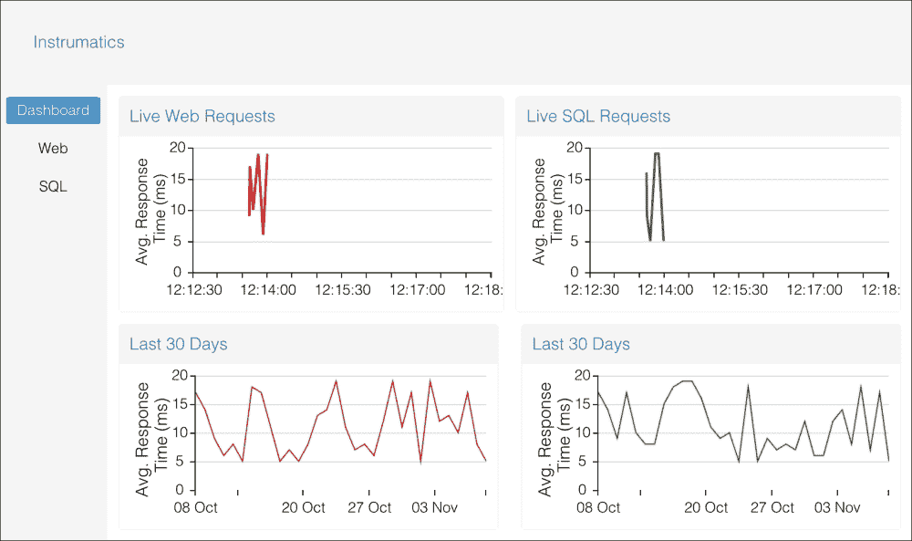
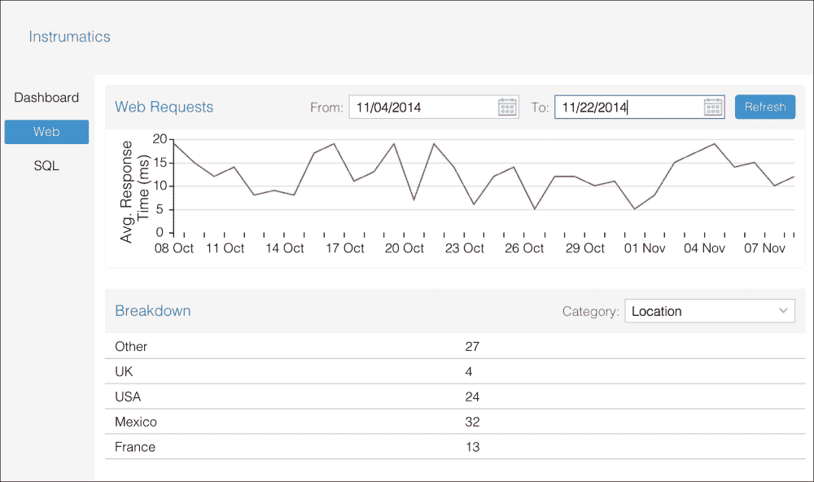
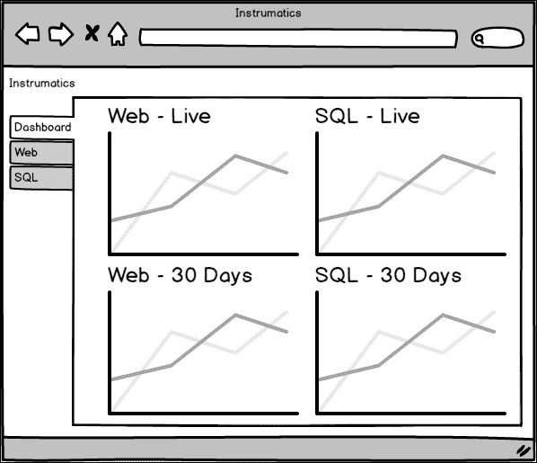
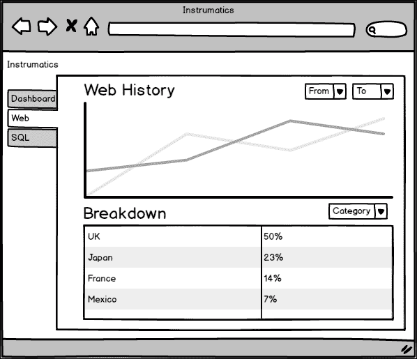
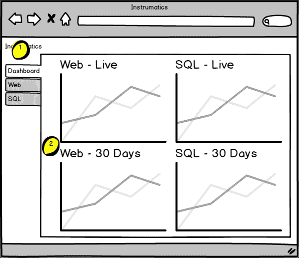
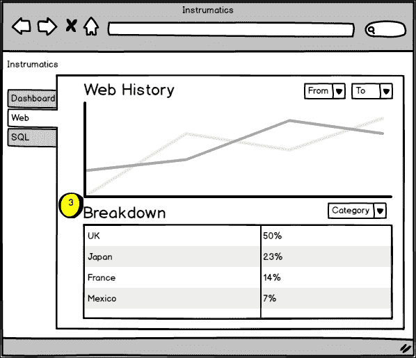
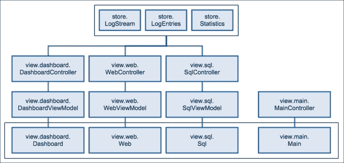

# 第六章：实践 - 监控仪表板

现在我们已经开始将所学应用到实际应用中，我们将逐步增加我们构建的项目复杂性。通过设计和创建一个模仿实际客户可能付费的代码库，我们不是编写孤立存在的抽象示例代码。我们正在构建一些可以展示作为软件架构师你可能会面临的一些设计决策的东西。

在本章中，我们将构建一个监控仪表板，可以用来查看应用程序服务器的指标。开发人员和系统管理员将使用此类应用程序来可视化其服务器的性能，并在任何给定时间监控负载。

这样的应用可以用于内部监控，或者它可以作为**软件即服务**（**SaaS**）部署，可以被其他用户转售。无论哪种方式，它都将作为视图模型强大功能的绝佳展示；我们将扩展我们已知的内容，并以更高级的方式使用它来塑造我们从服务器接收到的数据。在本章中，我们将涵盖以下内容：

+   设计用户界面

+   从`Ext.data.Model`到支持我们 UI 所需的视图模型的数据层设计

+   使用多个视图控制器

+   构建跨视图可重用的组件

+   添加路由以允许用户将应用程序的每一屏添加到书签

+   使用视图模型过滤器来聚焦我们对底层数据的视图

到本章结束时，我们将完善我们已经开始介绍的概念，并引入一些新功能（例如路由）。这些在为应用程序设计用户体验时非常重要。

我们将像设计一个内部程序一样来处理这个问题，这个程序监控我们理论上的软件开发店中的另一个应用程序。虽然这意味着我们不受外部客户需求约束，但遵循我们已学到的所有设计指南仍然很重要。这可能是一个内部应用，但它仍然需要健壮，满足利益相关者的期望，并在未来得到维护。

# 应用程序设计

这个应用将有几个屏幕来查看被监控应用程序的各种属性。我们将有一个仪表板屏幕，显示正在监控的重要指标概览。然后，对于这些指标中的每一个，我们将有单独的屏幕，允许用户深入挖掘和筛选数据。由于这些屏幕将是同一主题的变体，我们只构建几个来展示概念，但这个应用我们将构建的框架意味着添加更多将变得非常简单。以下截图显示了**仪表板**选项卡：



**网络**选项卡如下：



作为用户，我们希望在监控应用程序中看到什么？我们希望一目了然的信息，但同时又能够轻松获取详细信息。我们主要关注的是 Web 请求和数据库查询的响应时间，因此我们希望这两个指标都可用。让我们考虑提供这些信息的用户界面及其可能的外观：



在**仪表板**选项卡上，我们使用图表来传达趋势信息——关于短期和长期的趋势——这为我们提供了数据的快速查看。前两个图表实时更新以显示平均响应时间，而底部的图表显示历史趋势以供比较。关于这些数据的详细信息如何？

此外，我们在屏幕左侧添加了标签页，允许您在日志类型之间切换。在这个应用程序中，我们除了初始的**仪表板**视图外，还有**SQL**和**Web**，如下面的截图所示：



在屏幕的主要部分，我们有一组控件来过滤数据。下面的图表和网格将根据过滤结果进行更新。这使用户能够查看特定日期范围内的数据。它还使用户能够选择要深入查看的详细类别。

有哪些类别？未来可能会扩展，但以下是当前**Web**标签页的列表：

+   位置

+   浏览器

+   设备类型

我们在我们的日期范围内显示 Web 请求的信息，以提供更多关于谁访问我们应用程序的洞察。我们是否有很多来自日本的访客？他们是否遇到了无法接受的响应时间？也许我们需要在亚洲某处添加服务器以满足他们的需求。我们是否看到了很多平板用户？我们是否需要改进我们的响应式设计以更好地应对平板屏幕大小？

在 SQL 方面，我们有：

+   查询类型（选择、插入、更新等）

+   最慢的查询

+   查询来源

第一项是基本信息；您可以看到应用程序是读多写少还是写多读少，这将告知您的技术堆栈如何随时间变化。其他两项相辅相成，显示了最慢的查询以及应用程序中哪些页面发出最多的查询。

这些指标有助于提高应用程序的透明度。在某些情况下，它们可能不足以诊断微妙的问题，但它们在显示应用程序和用户行为趋势方面将非常有价值。

# 需求

我们已经为我们的应用程序确定了理想的用户界面，但这是如何转化为技术要求的？

+   我们希望折线图显示趋势

+   我们希望这些图表能够在接收到新数据时更新

+   我们希望能够选择日期范围，并相应地更新图表和网格

+   我们希望能够选择数据类别，并相应地更新网格

让我们在 Ext JS 的背景下看看这些：

+   Ext JS 图表具有区域、线、散点系列等，因此我们可以以允许您可视化趋势的方式绘制数据。

+   `Ext.data.Store` 的 `load` 方法可以接受一个 `addRecords` 参数，当设置为 `true` 时，将导致新加载的记录被追加到存储中，而不是覆盖现有数据。这将使我们能够向图表提供更新数据。

+   Ext JS 提供了一个日期字段组件，可以链接到视图模型以根据日期范围筛选数据。

+   网格有一个重新配置的方法，允许你在必要时动态地更改网格的列。

看起来不错！

## 消息已接收并理解

我们已经为这个项目制定了我们自己的标准，但在开始编码之前，我们仍然在明确地列出我们需要的东西，并确保我们的技术框架将支持我们的需求。为什么不直接开始工作，把手指放在键盘上呢？

虽然这不是一个有明确付费客户的工作，但这仍然是需要问责的事情。作为一个专业的开发者，仅仅说“完成时完成”是不够的，因为这种态度不会得到支付你薪水的人的认可。我们必须尽可能详细地规划我们的项目，以便从时间和质量的角度对我们工作的交付有信心。

无论我们为谁构建软件，我们都必须始终努力创造一些稳健的东西，一些能够满足或超出期望的东西。

# 数据结构

在本章中，我们将做出一个假设，即我们团队有一个友好的后端开发者，他能够以我们需要的格式提供数据。让我们具体说明我们将为驱动我们应用程序的数据提出的要求。

另一个假设是我们在这里寻找趋势和统计数据，因此我们将基本上将日志聚合为更适合用户消费的东西。

## 实时图表

我们计划在仪表板上有两个“实时”图表（一个用于显示传入的 SQL 查询，另一个用于显示网络请求）。为了使这可行，我们需要一个每秒或大约一秒可以轮询的 URL。这将为我们提供关于过去一秒钟活动数据。类似于这样：

```js
GET /logStream
Accepts: n/a
Returns: [
    {
        "type":"web",
        "subType":"request",
        "time":"2014-11-04T12:10:14.465Z",
        "ms":10,
        "count":5
    },
    {
        "type":"sql",
        "subType":"query",
        "time":"2014-11-04T12:10:14.466Z",
        "ms":17,
           "count":34
    }
]
```

对 `/logs/all/live` 的 `GET` 请求给我们一个对象数组，每个日志类型一个。如前所述，我们只限制在 SQL 和网络。`ms` 属性是过去一秒钟发生的操作的平均响应时间。`count` 属性是发生的操作数量。我们设计这个 API 时考虑到了一点灵活性，所以它可以扩展，例如，将 URL 中的 `"all"` 替换为 `"sql"` 以过滤单个日志类型。

## 历史日志

在我们的应用程序的仪表板和子页面上，我们还需要显示历史数据的图表。在仪表板上，它将是过去 30 天的数据，但在子页面上，可能是一个任意的时间范围。这是我们的 API：

```js
GET /logEntry
Accepts: filter=[{"property":"propertyName","operator":"=","value":"value"}, …]
Returns: [{
    "type":"sql",
    "subType":"query",
    "time":"2014-11-04T12:10:14.466Z",
    "ms":17,
    "count":34
}, ...]
```

我们将依赖于`Ext.data.Store: remoteFilter`功能。当此设置为`true`时，Ext JS 将延迟过滤到服务器，并将过滤条件作为 JSON 数组传递。我们可以设置任意数量的过滤器，因此为了在日期范围内获取 SQL 数据，我们将传递类似以下内容：

```js
[
    { property: 'type', operator: '=', value: 'sql' },
    { property: 'time', operator: '<=', value: '2014-01-01' },
    { property: 'time', operator: '>=', value: '2014-02-01' }
]
```

我们那位友好的服务器端开发者会将这些过滤器组合成返回正确响应的东西。

## 日志统计

除了关于 Web 和 SQL 操作的一般聚合信息外，我们还想在我们的标签页上显示更详细的网格。同样，这些信息将可以根据日期范围以及我们想要查看的信息类别进行筛选：

```js
GET /statistic
Accepts:
filter=[
    { property: 'type', operator: '=', value: 'web' },
    { property: 'category', operator: '=', value: 'location' },
    { property: 'time', operator: '<=', value: '2014-01-01' },
    { property: 'time', operator: '>=', value: '2014-02-01' }
]
Returns: [{"category":"location","label":"Other","percentage":19.9}, ...]
```

我们再次使用`remoteFilter`功能，这意味着 Ext JS 将直接将 JSON 过滤器以及之前的`type`和`time`参数传递到服务器。这次，我们将添加一个`category`参数来指定我们想要检索的信息子集——例如，对于 Web 日志是位置，对于 SQL 是查询源。

作为回应，我们得到一个数组，其中包含所选类别中的所有项目以及它们在指定时间段内分配的百分比。

## 模型行为

我们已经有了我们的 API。这如何转化为我们需要的 JavaScript 数据模型？嗯，我们只需要两个——看看我们刚刚记录的 API 响应——`/logs`返回一种类型，`/statistics`返回另一种类型。它们看起来可能像这样：

```js
Instrumatics.model.LogEntry: extends Instrumatics.model.BaseModel
- type
- subType
- time
- ms
- count
```

这`BaseModel`究竟是怎么回事？为了在模型之间共享模式配置，我们可以使用一个基模型，其他所有模型都从这个基模型继承。它看起来像这样：

```js
Instrumatics.model.BaseModel: extends Ext.data.Model
- schema
```

现在，统计模型的如下所示：

```js
Instrumatics.model.Statistic: extends Instrumatics.model.BaseModel
- category
- label
- percentage
```

`percentage`字段表示由这个统计数字表示的操作比例。例如，如果`category`是`location`且`label`是`Japan`，那么百分比可能类似于`5 percent`（我们 5%的请求来自日本）。这足够灵活，可以用于我们想要查看的所有数据类别。

最后，我们还需要一个用于实时日志流：

```js
Instrumatics.model.LogStream: extends Instrumatics.model.LogEntry
```

日志流具有与`LogEntry`模型相同的字段，但我们将其作为一个单独的类，因此其类名可以影响模式配置。我们将在稍后详细介绍。

### 注意

对于这个理论上的 API，我们很幸运；在这里，我们可以塑造我们的需求。在现实世界中，事情可能不会那么简单，但有一个友好的后端开发者将始终使我们的前端开发者生活变得更加容易。

我们的 API 对我们的数据层产生了强烈的影响。虽然保持简单是很好的——正如我们在这里所做的那样——但重要的是不要将简单误认为是天真或缺乏灵活性。在这种情况下，我们的 UI 组件将愉快地与我们的数据层一起工作，而我们的数据层反过来又与我们的 API 一起工作，无需将任何单个组件强行与其他组件一起工作。

# 从高处看

我们为我们的应用程序提供了燃料；数据将为我们将要构建的编码引擎带来生命。我们现在需要建立构成这个引擎的控制器和将为我们提供用户界面以控制和可视化的视图。考虑以下截图：



对于标记为**1**的外部区域，我们有一个主要视图，为其他视图提供容器。这将有一个相应的视图控制器，用于管理主子组件的任何跨应用程序关注点。

对于标记为**2**的内部部分，我们有仪表板视图，四个图表的容器。其视图控制器将管理顶部两个图表的实时更新。

每个子页面都会添加一个额外的视图（见**3**），例如，一个**Web**视图和相关视图控制器。它将展示并控制历史日志图表、统计网格以及用户输入到过滤日期字段和按钮，如下所示：



这里展示了我们所有课程之间的交互方式：



我们已经了解了应用程序类的大致情况。让我们深入挖掘，依次查看每个类的详细信息：

```js
Instrumatics.view.main.Main: extends Ext.tab.Panel
- items[]
    - dashboard: extends Ext.panel.Panel
    - web: extends Instrumatics.view.web.Web
    - sql: extends Instrumatics.view.sql.Sql

```

主要视图是一个标签面板，包含所有子页面：

```js
Instrumatics.view.main.MainController: extends
Ext.app.ViewController
- onTabChange
- onNavigate
```

正如我们提到的，主要控制器处理与应用程序整体相关的事务。它负责在`onTabChange`时在仪表板和子页面之间切换，并在 URL 更改时决定采取什么行动`onNavigate`。四个`Ext.chart.CartesianChart`实例用于显示仪表板上所需的各类折线图，如下所示：

```js
Instrumatics.view.dashboard.Dashboard: extends Ext.panel.Panel
- items[]
- live-sql-requests: extends Ext.chart.CartesianChart
- live-web-requests: extends Ext.chart.CartesianChart
- historical-sql-requests: extends Ext.chart.CartesianChart
- historical-web-requests: extends Ext.chart.CartesianChart
```

我们需要一些代码来设置我们的实时更新图表，所以我们在这`initializeChartRefresh`中这样做：

```js
Instrumatics.view.dashboard.DashboardController: extends
Ext.app.ViewController
- initializeChartRefresh
```

`Ext.app.ViewModel`如下所示：

```js
Instrumatics.view.dashboard.DashboardModel: extends Ext.app.ViewModel
- store.webLogs
- store.sqlLogs
- store.historicalWebLogs
- store.historicalSqlLogs
```

仪表板的视图模型概述了四个独立的数据源，每个图表一个：

```js
Instrumatics.view.web.Web: extends Ext.panel.Panel
- filters: extends Ext.Container
- historical-web-requests: extends Ext.chart.CartesianChart
- statistics-grid: extends Ext.grid.Panel
```

相关的视图控制器如下所示：

```js
Instrumatics.view.web.WebController: extends Ext.app.ViewController
```

啊！这是一个相当稀疏的视图控制器，实际上它做了很多工作。让我们看看视图模型，事情可能会变得稍微清晰一些：

```js
Instrumatics.view.web.WebModel: extends Ext.app.ViewModel
- stores
    - logData
    - logStatistics
    - categories
- data
    - currentCategory
    - currentStartDate
    - currentEndDate
```

计划从几个存储中提取历史日志数据和关于此日志数据的统计信息。我们还将有一个存储用户可以使用来过滤网格视图的类别。

### 注意

有争议的是，类别可以存储在用户界面的一部分，该界面完全独立地过滤数据，在完全分开的存储中。然而，将视图的数据存储在一个地方——视图模型中——并且不通过添加另一个不必要的存储类来使事情复杂化也是有意义的。

当我们考虑应用程序的当前状态时，这个视图模型的关键部分出现了。对于这个子页面，它将存储在`currentCategory`、`currentStartDate`和`currentEndDate`变量中。

由于我们将在视图模型中保持所有状态，我们可以将 UI 控件绑定到设置此状态，并反过来将这些值绑定到一个`store`过滤器。这意味着使用 UI 更改值将自动更改过滤器值，而无需在控制器中添加任何粘合代码。

这个实现需要深刻理解视图模型的力量，以及对应用程序设计的深思熟虑。我们将在编写这一部分的代码时详细说明这一点。

应用程序的最后一部分是 SQL 子页面。这基本上与 Web 子页面相同，但显示不同的信息集，所以我们不会详细说明其设计。

# 灵活性和实用主义

我们尚未详细讨论的是设计如何随时间变化。我们正在阐述我们认为我们的应用程序应该是什么样子，但直到我们编写它，我们不会知道确切实现的全部细节。

对正在进行的工作进行持续的再评估非常重要，以确保所写内容的品质保持高标准。我们之前已经记录了我们的设计，但在一个关键的地方，我们也意识到子页面之间将非常相似。

根据这些相似性在代码中的具体实现，可能存在重构和重用的空间，这在设计文档绘制时并不明显。然而，如果实现确实足够相似，每个子页面之间只有细微的差异，那么我们需要考虑将此代码提取到一个可重用的类中。

代码重复——甚至更糟，复制和粘贴代码——是导致代码库混乱的非常好的方式。在你需要更改某些内容、调整行为、添加功能或修复错误的情况下，你必须在几个地方做同样的事情，这会增加更改的开销，并增加更多错误渗入代码的机会。

### 注意

复制和粘贴是代码库的祸害。通过盲目地复制代码，你的开发者没有进行任何批判性分析。他们正在不必要地增加代码库的大小，并且很可能会引入错误。

在本章的后面部分，我们将开始构建这个应用程序的代码。我们还将密切关注任何可能重复之前内容的迹象。在这些情况下，我们会花些时间看看是否可以封装和重用某些功能。

Ext JS 提供了多种方法来结构化代码——例如继承和混入——利用这些方法将导致一个易于维护和扩展的应用程序。

# 这会伤害吗？

我们的设计已经从上到下完成，现在是对其进行批判性审视的时候了。设计中是否有任何未知方面，或者是否有潜在的痛点？实时更新的图表现在有点像黑盒。虽然我们知道图表支持动画（通过`animate` **配置**选项），但我们想确保图表的轴可以随着新数据的到来而更新。进行一个非常简单的测试以确保它能工作是值得的。为此，我们将稍微回到过去。

我们将直接链接到所需的文件，并使用`Ext.onReady`来运行我们的代码，而不是使用 Sencha Cmd 和整个 Bootstrap 过程。以下是空模板：

```js
<!DOCTYPE HTML>
<html manifest="">
<head>
    <meta http-equiv="X-UA-Compatible" content="IE=edge">
    <meta charset="UTF-8">
    <title>Chart Test</title>
 <script type="text/javascript" src="img/ext-all-debug.js"></script>
    <script type="text/javascript" src="img/sencha-charts-debug.js"></script>
<link rel="stylesheet" type="text/css" href="ext/packages/ext-theme-neptune/build/resources/ext-theme-neptune-all-debug.css">
</head>
<body>
   <div id="chart"></div>

   <script type="text/javascript">
   Ext.onReady(function() {
         // Code goes here.
   });
   </script>
</body>
</html>
```

我们创建了一个 HTML 页面，其中链接到 Ext JS 和 Sencha Charts 的 JS 文件以及一个 Ext JS 主题的 CSS。在 HTML 的主体中，我们将创建一个 ID 为"chart"的 div 来渲染，然后是一个`Ext.onReady`块，我们将在这里放置大部分代码。首先，让我们在这里设置一个存储：

```js
var store = Ext.create('Ext.data.Store', {
   fields: [
          { name: 'value' },
          { name: 'time', type: 'date' }
   ]
});
```

当前时间“from”和图表轴的“to”时间变量在此处显示：

```js
var now = new Date();
      fromDate = Ext.Date.subtract(now, Ext.Date.MINUTE, 1),
      toDate = Ext.Date.add(now, Ext.Date.MINUTE, 5);
```

然后是图表本身：

```js
var chart = Ext.create('Ext.chart.Chart', {
    renderTo: 'chart',
    width: 500, height: 300,
    animate: true, store: store,
    axes: [
        { type: 'numeric', position: 'left', fields: 'value' }, 
        {
            type: 'time', fields: 'time', dateFormat: 'H:i:s',
            fromDate: fromDate.setSeconds(0),
            toDate: toDate.setSeconds(0)
        }
    ],
    series: [{ type: 'line', xField: 'time', yField: 'value' }]
});
```

现在，让我们向存储中添加一些数据：

```js
setInterval(function() {
    store.add({
        time: (new Date()).toISOString(),
        value: Ext.Number.randomInt(1, 30)
    });
}, 1000);
```

每秒钟，我们向存储中添加一条包含当前时间和随机值的记录。运行此代码后，我们得到一个每秒更新的折线图，非常棒！然而，虽然这已经很接近我们需要的了，但有一个问题。当线条接近图表的右侧时，它就消失在画布之外了。我们需要在更新数据时以某种方式更新图表的底部轴。

图表有一个`redraw`事件，我们可以用它来达到这个目的。我们将尝试将底部轴上的`from`日期和`to`日期向前移动`15`秒。由于我们的存储通过`setInterval`调用进行更新，`redraw`事件每秒会被触发一次，因此每当`redraw`事件被触发第 15 次时，我们就会更新轴。这就是代码中的样子：

```js
var redrawCounter = 0;

chart.on('redraw', function() {
    redrawCounter++;

    if(redrawCounter > 15) {
        redrawCounter = 0;

        var timeAxis = this.getAxes()[1],
            oldFrom = new Date(timeAxis.getFromDate()),
            oldTo = new Date(timeAxis.getToDate()),
            newFrom = Ext.Date.add(oldFrom, Ext.Date.SECOND, 15),
            newTo = Ext.Date.add(oldTo, Ext.Date.SECOND, 15);

        timeAxis.setFromDate(newFrom);
        timeAxis.setToDate(newTo);
    }
});
```

我们使用一个名为`redrawCounter`的变量来跟踪自上次轴调整以来`redraw`事件触发了多少次。其余的代码应该相当直接。获取底部并设置其日期为 15 秒之后。

这一切都很顺利，尽管在需要挂钩到`redraw`事件的过程中遇到了一些意外的障碍。现在我们已经确信这个问题可以解决，我们可以继续构建应用程序的其余部分。

# 奋进向前

就像我们所有的示例应用程序一样，我们将使用 Sencha Cmd 并按照以下方式构建一个应用程序模板：

```js
sencha generate app -ext Instrumatics ./instrumatics

```

移除生成器创建的所有冗余文件和示例文件，并使用`watch`命令启动一个网络服务器。然后我们可以继续创建我们应用程序的第一个真实代码：数据层。

# 数据先行

所有我们的模型都将继承自一个基础模型，该模型将用于指定以下命令：

```js
// app/model/BaseModel.js
Ext.define('Instrumatics.model.BaseModel', {
    extend: 'Ext.data.Model',

    schema: {
        namespace: 'Instrumatics.model',
        urlPrefix: 'http://localhost:3000',
        proxy: {
            type: 'ajax',
            url: '{prefix}/{entityName:uncapitalize}'
        }
    },
});
```

### 注意

我们假设我们有一个运行在本地的 `3000` 端口的 API 服务器，并提供了这个信息作为 URL 前缀。

我们在上一个章节中使用了 `schema` 配置，但现在我们即将在多个模型中使用它，它真正地发挥了作用。在从 `BaseModel` 继承的每个模型中，模型名称将被插入到代理 URL 中以替换 `entityName` 标记。这避免了在多个模型之间重复 URL 配置。现在我们可以根据我们的设计创建 `LogEntry` 模型：

```js
// app/model/LogEntry.js
Ext.define('Instrumatics.model.LogEntry', {
    extend: 'Instrumatics.model.BaseModel',

    fields: [
        { name: 'value' },
        { name: 'subType' },
        { name: 'type' },
        { name: 'time', type: 'date' }
    ]    
});
```

通过 schema，这将导致以下 URL：

```js
http://localhost:3000/logEntry
```

除了这个之外，我们只是在 `LogStream` 类上实现了我们在设计中指定的字段：

```js
// app/model/LogStream.js
Ext.define('Instrumatics.model.LogStream', {
    extend: 'Instrumatics.model.LogEntry',
});
```

这很简单。`LogStream` 类从 `LogEntry` 类继承了所有字段，但多亏了在 `BaseClass` 中使用 schema 配置，`LogStream` 将有一个这样的 URL：

```js
http://localhost:3000/logStream
```

最后，这是 `Statistics` 模型：

```js
// app/model/Statistic.js
Ext.define('Instrumatics.model.Statistic', {
    extend: 'Instrumatics.model.BaseModel',
    fields: [
        { name: 'category' },
        { name: 'label' },
        { name: 'percentage', type: 'number' }
    ]
});
```

这里只有设计中的三个字段，它给我们提供了一个生成此 URL 的模型：

```js
http://localhost:3000/statistic
```

在我们的数据层中，没有任何特别复杂的地方，因为我们已经在设计阶段深思熟虑了实现方式。在坐下来编写代码之前，我们对 Ext JS 提供的功能有所了解，这使得我们能够通过在基类中配置代理来减少代码重复。

我们应该始终寻找地方，无论是通过重构还是通过初始设计，来减少重复的代码。在这个例子中，我们可以在 `LogEntry`、`LogStream` 和 `Statistic` 的每个实例上设置相同的配置，但如果我们想要更改配置的某些部分，比如 API 的主机名，我们就需要在多个位置进行更改。通过以我们这样的方式集中化，我们将有更少的代码需要维护，并且更容易与之合作。

在早期的模型类中，有一点需要注意，那就是我们定义字段的方式。在 Ext JS 中有两种选择，一种是将字段定义作为一个对象字面量传递，就像我们在代码中所做的那样，另一种是将包含字段名称的字符串传递。以 `Statistic` 类为例，字段配置将如下所示：

```js
'category',
'label',
{ name: 'percentage', type: 'number' }
```

为什么选择其中一种而不是另一种？答案是保持一致性。这是一个非常适合作为团队编程风格指南的例子，所以我们不是让一个类使用一种方法声明，而另一个类使用另一种方法，而是采用统一的方法。对于打开你的模型文件并发现字段定义组织良好的新开发者来说，不会有任何警报和惊喜。

对于字段定义，还有一种第三种方法；不去管它们。Ext JS 允许你省略字段定义，并且会根据模型消耗的数据动态创建它们。

我们都支持减少维护的代码量，但有时，明确一些更好。如果我们需要在字段中使用其他配置选项，例如转换，那么我们无论如何都需要手动定义该字段，等等，然后我们会在模型中留下一些显式的字段，一些在运行时创建。

这是个人的偏好问题，但为了我们的目的，我们将始终定义完整的字段定义。这是连贯且自我说明的；当我们查看模型文件时，我们总是知道它正在消耗的字段。

# 存储数据

本项目中的存储库尽可能简单：

```js
// app/store/LogEntries.js
Ext.define('Instrumatics.store.LogEntries', {
    extend: 'Ext.data.Store',
    alias: 'store.logentries',
    model: 'Instrumatics.model.LogEntry',
    autoLoad: true,
    remoteFilter: true
});

// app/store/LogStream.js
Ext.define('Instrumatics.store.LogStream', {
    extend: 'Ext.data.Store',
    alias: 'store.logstream',
    model: 'Instrumatics.model.LogStream',
    autoLoad: true,
    remoteFilter: true
});

// app/model/Statistics.js
Ext.define('Instrumatics.store.Statistics', {
    extend: 'Ext.data.Store',
    alias: 'store.statistics',
    model: 'Instrumatics.model.Statistic'
});
```

这些类相当是模板化的（定义模型、定义别名，然后就是这些）。有人可能会提出，这些存储库实际上可以在单个视图模型中定义，从而减少我们的代码库中的文件数量。然而，在这个应用程序中，我们将在多个视图模型中重用存储库，因此将它们的配置保留在集中位置是有意义的。

让我们继续到我们应用程序的 UI 层。

# 针对控制器视图

在这个应用程序中，我们有一个“主”视图，它充当应用程序的视口，以及一个相关的控制器，它处理用户与该视口的交互并处理路由。让我们首先看看 UI 部分：`view`：

```js
// app/view/main/Main.js
Ext.define('Instrumatics.view.main.Main', {
    extend: 'Ext.tab.Panel',

    requires: [
        'Instrumatics.view.dashboard.Dashboard',
        'Instrumatics.view.web.Web',
        'Instrumatics.view.web.Sql',
    ],

    xtype: 'app-main',
    controller: 'main-main',

    header: {
        title: {
            text: 'Instrumatics', padding: 20
        }
    },

    tabPosition: 'left',
    tabRotation: 0,

    items: [
        { xtype: 'dashboard', title: 'Dashboard', reference: 'dash' },
        { xtype: 'web-logs', title: 'Web', reference: 'web' },
        { xtype: 'sql-logs', title: 'SQL', reference: 'sql' }
    ]
});
```

这段代码中有几个有趣的部分。我们使用`header`配置选项来精细控制面板的标题，允许我们在标题中添加一些格式化。

我们随后将面板标签的默认配置更改为将它们放置在屏幕的左侧（而不是屏幕顶部）。由于左侧的标签默认从上到下显示，我们也将`tabRotation`进行调整，使它们从左到右阅读。默认选中的标签自动是项目数组中的第一个组件，因此我们可以避免设置任何配置来指定这一点。

然后，我们设置将包含在这个标签面板中的项目，即仪表板、Web 日志子页面和 SQL 日志子页面，正如我们的设计所规定。这个配置中唯一有趣的部分是为每个组件添加`reference`，其效用将在我们查看视图控制器时变得清晰。

# 主要视图控制器

这个视图控制器中的代码并不多，但它所启用的功能非常重要。让我们看看：

```js
// app/view/main/MainController.js
Ext.define('Instrumatics.view.main.MainController', {
    extend: 'Ext.app.ViewController',
    alias: 'controller.main-main',

    routes: {
        ':controller': 'onNavigate'
    },

    listen: {
        component: {
            'tabpanel': {
                tabchange: 'onTabChange'
            }
        }
    },

    onTabChange: function(tab, newCmp, oldCmp) {
        this.redirectTo(newCmp.getReference());
    },

    onNavigate: function(controller) {
        var view = this.getView();

        view.setActiveTab(view.lookupReference(controller));
    }
});
```

当然，代码不多，但内容很多。这是处理路由的应用程序部分，所以让我们花点时间讨论一下路由实际上是什么。

## 根到顶

在 Ext JS 指南中有一份相当全面的关于路由的描述，但无论如何，我们在这里简要介绍一下。路由允许您通过 URL 的哈希（URL 中`#`符号之后的所有内容）在页面 URL 中保持应用程序的状态。例如：

```js
http://localhost/#banana
```

这表明我们正在一个关于香蕉的页面上。同样，看看以下示例：

```js
http://localhost/#cars/56
```

这表明我们正在一个关于车号`56`的页面上。使用哈希的优点在于，它可以不重新加载页面就用 JavaScript 进行操作。此外，对哈希符号所做的任何更改都将被浏览器的历史记录记住。这意味着我们可以在我们应用程序中导航，并使用后退按钮来追踪我们的步骤。这也意味着，如果我们可以在应用程序重新加载时将特定页面设置为书签，那么它将导航到哈希符号中指定的状态。

## 回到正事

我们如何在`Instrumatics`应用程序中实现路由？第一步是实际定义一个路由如下：

```js
routes: { ':viewReference: 'onNavigate' }
```

第一部分是我们试图匹配的哈希。除了`:viewReference`之外，没有指定任何内容，所以在这种情况下，哈希符号中的所有内容都会被捕获并传递给一个名为`onNavigate`的方法。`:viewReference`标记的名称是任意的，在这个例子中，它不影响其他任何东西，但在更复杂的路由中，用描述性的方式命名它是很有用的。

我们在这里试图实现什么？当哈希符号改变时，我们想要检测它并将用户重定向到正确的页面。路由定义执行检测部分，所以现在让我们看看我们如何将用户移动到正确的页面：

```js
onNavigate: function(viewReference) {
    var view = this.getView();
    view.setActiveTab(view.lookupReference(viewReference));
}
```

路由定义意味着所有匹配的路由都将被`onNavigate`消耗。在这个方法中，我们可以假设传入的标记是对视图控制器视图上组件的有效引用，所以我们只需使用这个引用查找组件并将其设置为“主”视图上的活动标签页。

我们似乎遗漏了某些东西，那就是，哈希是如何首先被设置的？

## 路由到无地

在视图控制器的监听配置中，我们使用`onTabChange`方法处理“主”标签面板的`tabchange`事件。这从用户更改到的标签中获取引用配置并将其传递给视图控制器的`redirectTo`方法：

```js
onTabChange: function(tab, newCmp, oldCmp) {
    this.redirectTo(newCmp.getReference());
}
```

`redirectTo`方法只是简单地更改 URL 中的哈希，在这种情况下，到新组件的引用。这是一个简单的方法，它为我们提供了一种强大的方式来改进用户体验。

# 仪表盘

我们已经建立了应用程序基础设施，所以现在是时候构建将建立在基础设施之上的组件了。首先是仪表盘，这需要我们仔细考虑如何实现我们应用程序的其余部分。

仪表盘由两个实时图表和两个历史图表组成。实时图表之间非常相似，历史图表也是如此（它们之间只有一些微小的格式化和绑定配置）。然而，为了构建图表，你还必须构建图表上的轴和绘制的系列，这导致了一个相当冗长的配置对象。以下是仪表板中的历史日志图表将看起来像这样：

```js
{ 
    xtype: 'cartesian',
    title: 'Last 30 Days',
    margin: 10, flex: 1
    bind: '{historicalWebLogs}'
    axes: [{
        type: 'numeric',
        position: 'left',
        fields: ['value'],
        title: {
            text: 'Avg. Response \nTime (ms)',
            fontSize: 15
        },
        grid: true,
        minimum: 0,
        maximum: 20
    }, {
        type: 'time',
        fields: 'time',
        dateFormat: 'd M'
    }],
    series: {
        type: 'line',
        xField: 'time',
        yField: 'value',
        style: { 'stroke': 'red' }
    }
}
```

极好！我们配置了一个带有数值左侧轴和时间基准底部轴的折线系列图表。这正是仪表板所需要的，那么问题在哪里？

复制是问题所在。这个配置对象的大部分内容都会被复制，一份用于 Web 日志，一份用于 SQL 日志。我们之前在本章中提到，我们希望在可能的情况下与复制作斗争，因此在这种情况下，我们将创建一个新的类，我们可以在需要从日志中绘制历史请求图表的地方重用它。

下面是这个类：

```js
// app/ux/chart/HistoricalRequestChart.js
Ext.define('Instrumatics.ux.chart.HistoricalRequestChart', {
    extend: 'Ext.chart.CartesianChart',
    xtype: 'historical-request-chart',
    frame: true,
    axes: [{
        type: 'numeric',
        position: 'left',
        fields: ['value'],
        title: {
            text: 'Avg. Response \nTime (ms)',
            fontSize: 15
        },
        grid: true,
        minimum: 0,
        maximum: 20
    }, {
        type: 'time',
        position: 'bottom',
        fields: ['time'],
        dateFormat: 'd M'
        style: {
            axisLine: false
        }
    }],

    series: {
        type: 'line',
        xField: 'time',
        yField: 'value',
        style: { 'stroke': 'red' }
    }
});
```

它结合了图表的基本定义，如坐标轴和系列，以及我们知道将在整个应用程序中重用的东西，如左侧轴上的标题。

注意，我们将这个类放在了我们示例应用程序中迄今为止所见到的任何地方之外，但我们讨论过的地方是第三章“应用结构”。`ux`命名空间和相应的目录是 Ext JS 社区中可重用类的相当标准的存放位置，因此我们将遵循这一惯例。

我们将创建另一个可重用的类，这次是为实时请求图表：

```js
// app/ux/chart/LiveRequestChart.js
Ext.define('Instrumatics.ux.chart.LiveRequestChart', {
    extend: 'Ext.chart.CartesianChart',
    xtype: 'live-request-chart',
    redrawCounter: 0,
    frame: true,
    axes: [{
        type: 'numeric',
        position: 'left',
        fields: ['value'],
        title: {
            text: 'Avg. Response \nTime (ms)',
            fontSize: 15
        },
        grid: true,
        minimum: 0,
        maximum: 20
    }, {
        type: 'time',
        position: 'bottom',
        step: [Ext.Date.SECOND, 1],
        fields: ['time'],
        dateFormat: 'H:i:s',
        fromDate: new Date(new Date().setMinutes( new Date().getMinutes() - 1)).setSeconds(0),
        toDate: new Date(new Date().setMinutes( new Date().getMinutes() + 5)).setSeconds(0)
    }],
    series: {
        type: 'line',
        xField: 'time',
        yField: 'value',
        style: {
            'stroke-width': 2
        }
    },

    constructor: function() {
        this.callParent(arguments);

        this.on('redraw', this.onRedraw, this);
    },

    onRedraw: function() {
        this.redrawCounter++;

        if(this.redrawCounter > 15) {
            this.redrawCounter = 0;

            var timeAxis = this.getAxes()[1],
                oldFrom = new Date(timeAxis.getFromDate()),
                oldTo = new Date(timeAxis.getToDate()),
                newFrom = Ext.Date.add(oldFrom, Ext.Date.SECOND, 15),
                newTo = Ext.Date.add(oldTo, Ext.Date.SECOND, 15);

            timeAxis.setFromDate(newFrom);
            timeAxis.setToDate(newTo);
        }
    }
});
```

你会注意到这段代码与本章前面代码调查中的代码有很多相似之处。只是我们将它封装成了一个可重用的类。

准备好这些新类后，创建仪表板只需将我们已编写的内容拼接在一起，如下面的代码所示：

```js
// app/view/dashboard/Dashboard.js
Ext.define("Instrumatics.view.dashboard.Dashboard", {
    extend: "Ext.panel.Panel",
    xtype: 'app-dashboard',
    title: 'hello',
    requires: [
        'Instrumatics.ux.chart.LiveRequestChart',
        'Instrumatics.ux.chart.HistoricalRequestChart'
    ],
    viewModel: {
        type: 'dashboard-dashboard'
    },
    controller: 'dashboard-dashboard',
    layout: {
        type: 'vbox',
        align: 'stretch'
    },
    items: [
        {
            xtype: 'container',
            flex: 1,
            layout: {
                type: 'hbox',
                align: 'stretch'
            },
            items: [
                {
                    xtype: 'live-request-chart',
                    title: 'Live Web Requests', bind: '{webLogs}',
                    series: { style: { 'stroke': 'red' } },
                    margin: '10 5 0 10', flex: 1
                },
                {
                    xtype: 'live-request-chart',
                    title: 'Live SQL Requests', bind: '{sqlLogs}',
                    series: { style: { 'stroke': 'green' } },
                    margin: '10 10 0 5', flex: 1
                }
            ]
        },
        {
            xtype: 'container',
            flex: 1,
            layout: {
                type: 'hbox',
                align: 'stretch'
            },
            items: [
                {
                    xtype: 'historical-request-chart',
                    title: 'Last 30 Days', bind: '{historicalWebLogs}',
                    series: { style: { 'stroke': 'red' } },
                    margin: '10 5 10 10', flex: 1
                },
                {
                    xtype: 'historical-request-chart',
                    title: 'Last 30 Days', bind: '{historicalSqlLogs}',
                    series: { style: { 'stroke': 'green' } },
                    margin: '10 10 10 5', flex: 1
                }
            ]
        }

    ]
});
```

而不是复制构成图表的配置，我们只需组合容器——这些容器使用`vbox`和`hbox`布局——并设置标题、格式和绑定。

这太好了。我们不是在仪表板视图中复制代码和有很多不必要的配置，而是将这段代码移动到了一个更合理的位置，促进了重用，并使代码库更加整洁。

## 持续评估

到目前为止，让我们看看我们构建的内容与我们的设计相比。它与我们的实现相匹配，但并没有提到这些可重用的类。对此有两种看法：

+   我们在设计上没有做得足够深入，错过了明确说明我们需要构建的内容的机会

+   我们在发现自己重复编写了已经编写过的内容后，看到了重构代码的机会

这两种观点都有其可取之处；然而，在第五章“实际应用 – CMS 应用”中，我们讨论了 YAGNI——你不会需要它——这规定，如果所讨论的组件永远不会被重用，那么为其规划重用几乎是没有意义的。

在这种情况下，实现过程揭示了我们会有些重复，所以我们进行了重构。虽然在设计阶段仔细考虑很重要，但重新评估我们的决策和代码应该是一个持续的过程，因此，认识到即使有在设计阶段应该注意到的感觉，也没有什么是固定不变的。只要我们理解为什么需要改变，并将其作为学习经验，我们就可以随时改变事物。

# 仪表板视图模型

仪表板中的四个图表各自有自己的数据源，这些源在各自的绑定配置中指定。这些源的定义在仪表板视图模型中：

```js
// app/view/dashboard/DashboardModel.js
Ext.define('Instrumatics.view.dashboard.DashboardModel', {
    extend: 'Ext.app.ViewModel',
    alias: 'viewmodel.dashboard-dashboard',

    stores: {
        webLogs: {
            type: 'logstream',
            filters: [{
                property: 'type',
                value: 'web'
            }]
        },

        sqlLogs: {
            type: 'logstream',
            filters: [{
                property: 'type',
                value: 'sql'
            }]
        },

        historicalWebLogs: {
            type: 'logentries',
            filters: [{
                property: 'type', 
                value: 'web'
            }]
        },

        historicalSqlLogs: {
            type: 'logentries',
            filters: [{
                property: 'type',
                value: 'sql'
            }]
        }
    }
});
```

我们正在设置仪表板的数据源。如果你回顾一下相关的存储定义，你会看到匹配的别名，以及`remoteFilter`选项设置为`true`。这使我们能够在视图模型中设置存储定义的过滤器，并将其作为 JSON 传递到服务器。

这为设置存储以从服务器端检索过滤数据提供了一个非常简单的方法（只需传递一个过滤器数组，让后端处理即可）。

我们几乎已经用除了视图控制器之外的所有部件拼凑了仪表板。现在让我们来看看这个视图控制器。

# 仪表板视图控制器

仪表板上没有交互性，所以视图控制器没有什么可做的。我们将用它来控制图表的实时刷新功能：

```js
// app/view/dashboard/DashboardController.js
Ext.define('Instrumatics.view.dashboard.DashboardController', {
    extend: 'Ext.app.ViewController',
    alias: 'controller.dashboard-dashboard',

    init: function() {
        var data = this.getViewModel().getData(),
            me = this;

        setInterval(function() {
            data.webLogs.load({ addRecords: true });
            data.sqlLogs.load({ addRecords: true });
        }, 1000);
    }
});
```

这很简单；每秒钟，获取驱动实时图表的存储，并调用其加载方法，将`addRecords`选项设置为`true`。这将导致新记录被追加到存储中，而不是覆盖旧记录。

虽然这里没有多少代码，但有几个讨论点。我们本可以完全避免在仪表板上使用视图控制器，并将这种刷新行为直接嵌入到`LiveRequestChart`类中，也许通过配置选项设置刷新率。

通过在控制器中这样做，我们有机会集中设置刷新率的位置。但这并不是一个巨大的胜利。确实有理由将此移动到 UI 类中。这是另一个没有正确或错误做法的情况；有多种选择，选择一个并继续比被提供的选项所瘫痪要好。

我们已经完成了应用程序的第一页，现在让我们继续到子页面，首先是网络日志页面。

# 网络日志子页面

我们已经构建了这部分屏幕的一部分。我们可以重用之前创建的`Instrumatics.ux.chart.HistoricalRequestChart`来显示指定日期范围的趋势。由于这些数据来自存储，我们可以简单地过滤存储，而无需在组件本身上做任何事情。考虑到这一点，**Web**视图看起来是这样的：

```js
// app/view/web/Web.js
Ext.define('Instrumatics.view.web.Web',{
    extend: 'Ext.panel.Panel',
    xtype: 'web-logs',

    viewModel: {
        type: 'web-web'
    },

    layout: {
        type: 'vbox',
        align: 'stretch'
    },
    items: [
        {
            header: {
                title: 'Web Requests',
                items: [
                    { xtype: 'datefield', fieldLabel: 'From', labelAlign: 'right', bind: '{currentStartDate}' },
                    { xtype: 'datefield', fieldLabel: 'To', labelAlign: 'right', bind: '{currentEndDate}', labelWidth: 30 },
                    { xtype: 'button', text: 'Refresh', margin: '0 0 0 10' }
                ]
            },
            margin: 10, xtype: 'historical-request-chart', bind: '{logData}', flex: 1
        },
        {
            xtype: 'grid',
            margin: 10,
            hideHeaders: true,
            viewConfig: {
              trackOver: false
            },
            disableSelection: true,
            header: {
                title: 'Breakdown',
                items: [
                    {
                        xtype: 'combo',
                        labelAlign: 'right', labelWidth: 60,
                        fieldLabel: 'Category',
                        bind: {
                            store: '{categories}',
                            value: '{currentCategory}'
                        },
                        queryMode: 'local',
                        editable: false,
                        forceSelection: true,
                        displayField: 'text',
                        valueField: 'value'
                    }
                ]
            },
            bind: '{logStatistics}',
            flex: 1,
            width: '100%',
            columns: [
                { name: 'Label', dataIndex: 'label', flex: 1 },
                { name: 'Percentage', dataIndex: 'percentage', flex: 1 }
            ]
        }
    ]
});
```

这里有相当多的代码，但这里发生的除了组件配置之外没有其他事情。让我们一步一步地分解它。

首先，是面板本身的配置，我们在其中设置了 `vbox` 布局。

然后我们添加了第一个项目，一个我们之前构建的 `HistoricalRequestChart` 的实例，并在其标题中添加了 `To` 和 `From` 日期字段。这些字段的值绑定到视图模型中的值（`currentStartDate` 和 `currentEndDate`），而图表本身绑定到视图模型中的 `logData`。

最后，我们有统计网格的配置。它的存储绑定到 `logStatistics`，在其标题中，我们添加了一个组合框，其值绑定到视图模型中的 `currentCategory`，其存储绑定到类别，以提供组合框选项。组合框允许用户选择他们想要查看的统计类别。

向上前进到视图模型！

# 对 Web 的一种看法

我们的 Web 视图模型遵循我们的设计，并使用一些实现细节来完善它：

```js
// app/view/web/WebModel.js
Ext.define('Instrumatics.view.web.WebModel', {
    extend: 'Ext.app.ViewModel',
    alias: 'viewmodel.web-web',
    stores: {
        logData: {
            type: 'logentries',
            filters: [
                { property: 'startDate', value: '{currentStartDate}' },
                { property: 'endDate', value: '{currentEndDate}' }
            ]
        },

        logStatistics: {
            type: 'statistics',
            filters: [
                { property: 'category', value: '{currentCategory}' },
                { property: 'startDate', value: '{currentStartDate}' },
                { property: 'endDate', value: '{currentEndDate}' }
            ]
        },

        categories: {
            fields: ['text', 'value'],
            data: [{
                text: 'Browser', value: 'browser'
            },{
                text: 'Location', value: 'location'
            },{
                text: 'Device Type', value: 'device'
            }]
        }
    },

    data: {
        currentCategory: '',
        currentStartDate: null,
        currentEndDate: null
    }
});
```

注意过滤器上的绑定。这使我们能够将过滤器与视图模型上的一个值链接起来，反过来又链接到视图中的表单控件上的值。这意味着一旦用户更新了一个表单控件，它将自动更新存储上的过滤器，重新加载存储，并重新绘制图表和网格。

我们还有一个 `categories` 存储，它只是用来保存类别组合框数据的一种方式，没有更多。

# 控制 Web

嗯，这里有一个问题，这个视图没有对应的视图控制器！在 Ext JS 的早期版本中，我们会监听日期字段和组合框上的更改事件，然后获取更改的值并使用它重新加载存储。

然而，在视图模型的新世界中，我们不需要这样做。当一个日期字段更新时，它会自动更新相应的视图模型值，反过来又更新存储的过滤器。

我们已经设置了存储和表单组件，所以通过在表单中添加一些魔法般的绑定配置，Ext JS 将为我们提供所有这些功能。这意味着我们需要编写的自定义代码更少，这只能是一件好事！

# 越来越多的子页面

我们知道我们应用程序中的另一个子页面，SQL 日志页面，将非常类似于 Web 日志页面。这应该会让我们对代码重复产生疑问。我们可以将网格和图表标题从 **Web** 视图中提取出来，并将它们转换为可重用的组件，但这是正确的事情吗？这些组件不会被重用！它们只在应用程序的一个位置有它们的位置，用于驱动子页面。与 `HistoricalRequestChart` 不同，它在仪表板和子页面中都被使用，这些组件只需要完成一项工作。

让我们考虑另一种方法：*继承*。我们可以创建一个新的组件，它包含来自**Web**视图的图表、表单字段和网格，并添加一些配置选项，以提供我们需要的定制化。这可能看起来像以下命令：

```js
// app/view/SubPage.js
Ext.define('Instrumatics.view.SubPage',{
    extend: 'Ext.Container',

    requires: [
        'Instrumatics.ux.chart.HistoricalRequestChart'
    ],

    xtype: 'subpage',

    config: {

        layout: {
            type: 'vbox',
            align: 'stretch'
        },

        chartCfg: {
            header: {
                items: [
                    { xtype: 'datefield', fieldLabel: 'From', labelAlign: 'right', bind: '{currentStartDate}' },
                    { xtype: 'datefield', fieldLabel: 'To', labelAlign: 'right', bind: '{currentEndDate}', labelWidth: 30 },
                    { xtype: 'button', text: 'Refresh', margin: '0 0 0 10' }
                ]
            },
            margin: 10, xtype: 'historical-request-chart', bind: '{logData}', flex: 1
        },

        gridCfg: {
            xtype: 'grid',
            margin: 10,
            hideHeaders: true,
            viewConfig: {
              trackOver: false
            },
            disableSelection: true,
            header: {
                title: 'Breakdown',
                items: [
                    {
                        xtype: 'combo',
                        labelAlign: 'right', labelWidth: 60,
                        fieldLabel: 'Category',
                        bind: {
                            store: '{categories}',
                            value: '{currentCategory}'
                        },
                        queryMode: 'local',
                        editable: false,
                        forceSelection: true,
                        displayField: 'text',
                        valueField: 'value'
                    }
                ]
            },
            bind: '{logStatistics}',
            flex: 1,
            width: '100%',
            columns: [
                { name: 'Label', dataIndex: 'label', flex: 1 },
                { name: 'Percentage', dataIndex: 'percentage', flex: 1 }
            ]
        }
    },

    initComponent: function(arguments) {
        this.callParent(arguments);
        this.add(this.getChartCfg());
        this.add(this.getGridCfg());
    }
});
```

我们已经将整个配置从**Web**视图拉取到这个名为`SubPage`的基类中，并将关键组件分离出来，即图表和网格。我们还通过将这些组件包裹在配置部分来利用 Ext JS 类系统的力量，这不仅为`gridCfg`和`chartCfg`生成了获取和设置方法，还为我们提供了覆盖这些配置对象部分内容的快捷方式。让我们通过展示由我们新的`SubPage`类驱动的**SQL**视图来演示：

```js
// app/view/sql/Sql.js
Ext.define("Instrumatics.view.sql.Sql",{
    extend: "Instrumatics.view.SubPage",
    xtype: 'sql-logs',
    viewModel: {
        type: "sql-sql"
    },
    chartCfg: {
        title: 'SQL Requests'
    }
});
```

嗯，就是这样！我们已经实现了与**Web**视图相同的功能，但重用了大量的代码。请注意，`chartCfg`被暴露出来供我们配置，这意味着我们只需要设置`viewModel`和图表的标题配置，一切就绪。

结果表明，我们也可以对视图模型做同样的事情：

```js
    // app/view/SubPageModel.js
Ext.define('Instrumatics.view.SubPageModel', {
    extend: 'Ext.app.ViewModel',
    stores: {
        logData: {
            type: 'logentries',
            autoLoad: true,
            remoteFilter: true,
            filters: [
                { property: 'startDate', value: '{currentStartDate}' },
                { property: 'endDate', value: '{currentEndDate}' }
            ]
        },

        logStatistics: {
            type: 'statistics',
            autoLoad: true,
            remoteFilter: true,
            filters: [
                { property: 'category', value: '{currentCategory}' },
                { property: 'startDate', value: '{currentStartDate}' },
                { property: 'endDate', value: '{currentEndDate}' }
            ]
        }
    },

    data: {
        currentStartDate: null,
        currentEndDate: null
    }
});
```

以下是一个 SQL 视图模型：

```js
Ext.define('Instrumatics.view.sql.SqlModel', {
    extend: 'Instrumatics.view.SubPageModel',
    alias: 'viewmodel.sql-sql',

    stores: {
        categories: {
            fields: ['text', 'value'],
            data: [{
                text: 'Query Source', value: 'source'
            },{
                text: 'Query Type', value: 'type'
            }]
        }
    },

    data: {
        currentCategory: 'source'
    }
});
```

现在，**Web**和**SQL**视图以逻辑方式共享代码，而没有用不属于那里的类污染我们的 UX 命名空间。在未来，我们可以轻松地添加更多类似这样的视图，但到目前为止，我们已经找到了一种避免代码重复并保持应用程序结构良好的绝佳方法。

# 摘要

在本章中，我们构建了第二个实际应用，并讨论了很多关于设计如何随着应用程序的发展而变化的内容。虽然我们带着最好的意图和手头拥有的知识来构建初始应用程序架构，但随着应用程序的发展，保持灵活性以生产成功的产品是很重要的。我们还介绍了路由、更多关于数据绑定，以及展示了代码可以以各种方式重用。

在下一章中，我们将构建一个大多数读者都熟悉的应用程序：电子邮件客户端。它将是一个响应式应用程序，适用于桌面和平板电脑，我们还将再次将我们已经讨论过的想法进一步发展。
