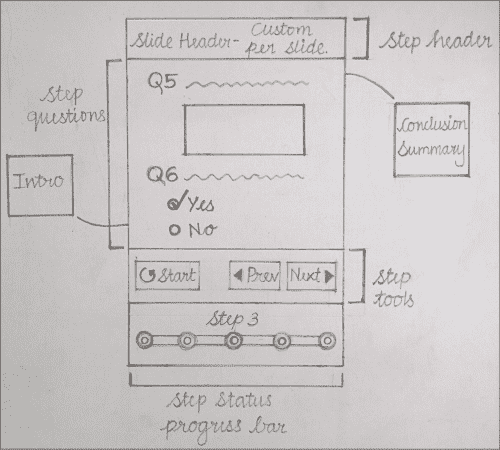
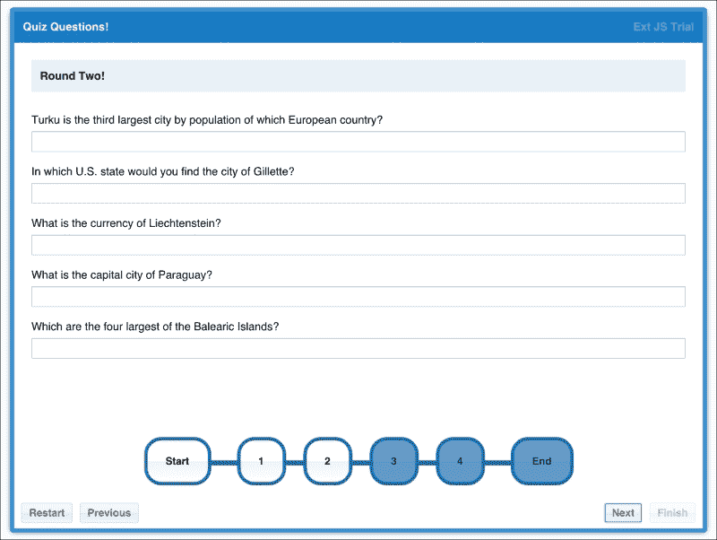
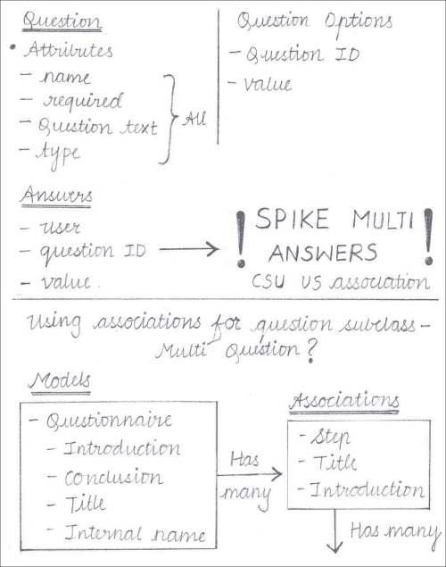
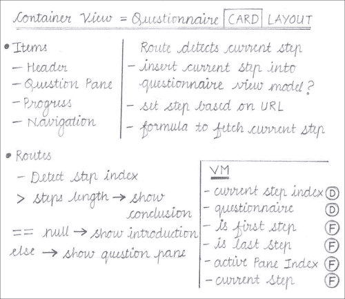
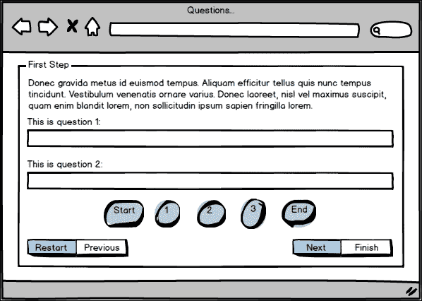

# 第八章. 实践 – 问卷组件

现在我们已经有了三个实际的应用程序。目标是展示设计应用程序的过程，并通过一系列谨慎的步骤来思考它，以清晰地描绘出我们将要构建的项目。这一次，我们将有所改变，而不是查看“我们”如何设计和构建应用程序，而是我将引导你通过我创建多步骤、动态问卷组件的自身过程。

这里列出了本章将要讨论的应用程序的功能：

+   一个可重用的包，可以包含在任何应用程序中

+   主题变量和混入，以允许在其他应用程序中进行视觉集成

+   将问卷拆分为多个步骤，每个步骤包含多个问题

+   从传入的服务器数据动态构建 UI

+   由问卷生成的 JSON 对象，表示步骤、问题和用户提供的答案

+   使用 Ext JS 关联来帮助结构化应用程序数据

为什么从包容性的“我们”转向审视我自己的架构过程？我希望这能让你更实际地了解应用程序设计中涉及的思想过程。你还可以看到建筑师总是有多个正确的路径可以选择。在编写任何代码之前绘制这些路径并调查它们，将避免许多项目遇到的“分析瘫痪”，当需要答案时，这会导致项目停滞不前。

# 应用程序设计 – 我的风格

当我思考一个应用程序时，我的第一步并不涉及花哨的工具或 IDE。一旦确立了客户需求，我会尽可能地远离电脑，从我的脑海中清除 JavaScript 和 Ext JS 的所有想法，并尽可能地消除所有干扰。

完成这些后，我拿起一个大笔记本和一支铅笔开始涂鸦。我从未找到过比一点手工劳动更好的快速草拟想法的方法，所以当我以我们在前几章中看到的方式设计时，我可以避免陷入绘图工具和 UML 图中的困境。

### 小贴士

所有这些都需要在后续的文档化设计决策中规范化。目的是快速测试想法并避免死胡同。

我是如何开始的？



嗯，它并不漂亮，但你可以看到这与我们在前几章中看到的 UI 视图图之间的关系。请注意，这些图像的意图并不是详细说明设计，而是简单地提供我对过程的洞察，包括所有瑕疵！最终，我会用这些草图构建类似的东西：



我从原始草图中挑选出了哪些功能？

+   随步骤变化的问卷标题

+   包含问卷引言和结论的窗格

+   应用中每个步骤的窗格

+   一个步骤可以有一个简介文本

+   一个问题需要解释文本

+   导航按钮，用于在步骤之间移动

+   一个进度条来显示已完成的步骤数量和剩余的数字

此外，这个组件需要能够验证在用户可以移动到下一步之前已经完成的步骤中的必填问题。

与其花大量时间在电脑前创建完美的 UI 设计，我能够快速地 flesh out 一个想法，看看它看起来如何，这让我对我的设计要求有了了解。

# 数据结构

这些初步的草图使我能够快速思考支撑组件的底层数据。在前几章中，我们在这里停下来讨论设计要求是否可以通过 Ext JS 来满足。相反，我们将继续前进，把技术放在一边，纯粹关注架构。

在某些方面——因为我们采用 MVVM——架构是技术无关的。我们可以创建我们想要构建的应用，而不会受到我们使用的框架的限制。这可能会很危险；在那儿，我们可能会失去对特定客户需求的关注，或者开始草拟一些可能无法实现的东西。为此，我们引入了新的检查和平衡措施，我们稍后会讨论。

现在，我继续用铅笔和纸来制定数据结构。和以前的情况一样，UI 设计决定了底层的数据需求。以下是我设计涂鸦的快速洞察：



和前几章一样，只是稍微乱一些！再次提醒，不要担心细节。看看粗略的笔记和涂鸦，你会意识到应用设计的初期是一个有机的过程，事情可能会（并且确实会）走一条蜿蜒的道路。以下是我涂鸦中关于数据结构的一些想法：

+   问卷

    +   标题

    +   简介

    +   结论

    +   步骤[]

        标题

        简介

        问题[]

        名称

        是否必需？

        问题文本

+   字段类型

在这个阶段，我还没有担心什么继承什么的问题。我只知道我想有一个包含许多步骤的单个问卷，每个步骤都会有许多问题。从这里，我只是 fleshed out 每个类需要的字段。

## 仔细考虑

在这一点上，我必须告诉你，我对你撒了谎。在纯粹的意义上，想象你可以在纸上绘制出完整的应用架构图是极好的，但现实中，你总是带着对现实世界的关注来做这件事。回顾我上一页的铅笔涂鸦，你会看到一些带有巨大下划线的笔记，比如“关联”。这是因为我知道之前描述的数据结构将使用 Ext JS 的关联来实现，这是我们在这本书中还没有使用过的功能，但它可以非常强大。

尽管如此，我尽可能地抛开细节的思考，并信任我对 Ext JS 的了解，使其在没有任何警告的情况下浮现出来。

# 数据流

考虑到之前的数据结构，我开始思考从 API 提供的信息如何通过视图模型流动，并允许我构建用户界面。

我有一种感觉，验证将会使应用程序复杂化，所以我开始勾勒出受影响的 UI 部分的想法。用户必须完成当前步骤的验证才能继续到下一步。在这个过程中，其强制性问题已经回答，因此“下一步”按钮需要在此发生之前禁用。我开始再次绘图，但很快，就出现了一种“分析瘫痪”的程度。这应该如何工作？有几个 Ext JS 特性可能有所帮助；模型验证绑定在这里是否适用，或者是否需要手动处理验证事件。早些时候，我提到了“制衡”以避免构建 Ext JS 不支持的东西；我决定抽出一些时间来调查在 Ext JS 中实现这一点的最佳方式。

就像我们在第五章中做的那样，称之为“原型”，或者称之为“原型”。我们是否编写并丢弃这段代码并不重要；如果它有助于过程，那么它是一项有价值的练习。我是独立构建的（在 MVC 或 MVVM 结构之外），而且很糟糕。看看这个代码片段：

```js
s.questions().each(function(q) {
   var input = stepForm.add({ 
          xtype: 'textfield', modelValidation: true,
          viewModel: {
                data: { question: q },
                formulas: {
                      isValid: {
                            bind: {
                                   bindTo: '{question}',
                                   deep: true
                            },
                            get: function() {
                                  return this.get('step').isValid();
                            }
                      }
                }
          },
          bind: '{question.answer}',
          fieldLabel: q.get('text')
   });
});
```

我不希望这段代码成为我的最大敌人。我们写的每一行代码不应该是纯净和经过深思熟虑的吗？在现实世界中，几乎没有人能看到这段代码。它是为了测试我的想法并找出什么感觉是对的，它不需要整洁或可维护。它是一次性的。这是我想要测试的内容：

+   `modelValidation` 功能与自动生成的表单字段一起使用会有用吗？

+   我能否绑定到问题以获取当前步骤的验证状态？

+   使用这些功能会感觉自然吗？或者有更简单的方法吗？

我们已经看到视图模型可以用来创建简单的声明性应用程序，并且当正确使用时它们可以非常强大。在这个应用程序中，字段是从 API 数据生成的，并且每个字段都有自己的问题模型。通过视图模型将这个模型的验证状态传播到用户界面的相关部分似乎可能很困难。我发现了什么？

+   一个视图模型绑定的技巧

+   与 Sencha 团队关于 `modelValidation` 行为的看法略有不同

+   一种将按钮状态绑定到关联状态的方法

这似乎是对这段肮脏代码的一个很好的结果。让我们逐一查看每个要点。

## 一个绑定技巧

这段代码片段来自一个问题表单视图模型：

```js
formulas: {
   isValid: {
          bind: {
                bindTo: '{question}',
                deep: true
          },
          get: function() {
                return this.get('step').isValid();
          }
   }
}
```

视图模型有一个问题模型，并从其父视图模型继承步骤模型。我们告诉 Ext JS 我们希望绑定到问题模型的变化，深层次的变化，因此任何属性的变化都会触发父步骤上的`isValid`方法。这很好，因为`isValid`方法可以反过来触发父步骤上的变化，将问题的状态传播到步骤。下面是`isValid`的代码：

```js
isValid: function() {
   var valid = true;
   this.questions().each(function(q) {
          if(q.isValid() === false) {
                valid = false;
          }
   });
   this.set('valid', valid);
   return valid;
}
```

它检查所有子问题的有效性，并相应地设置步骤的有效属性。然后我们可以绑定到这个有效值，并让它影响其他事物（例如 UI 中“下一步”按钮的禁用状态）。

这一点稍微有些反直觉，因为我们并不是直接绑定到`isValid`公式上。相反，我们使用它来监视问题上的变化，然后触发步骤模型上的变化。

## 不同的意见

5.0 和 5.0.1 之间有行为上的变化。`modelValidation`功能将模型中的验证与表单中的验证匹配，减少了代码的重复。在 Ext JS 5 中，当表单值改变时，这些变化将通过绑定同步到模型。在 Ext JS 5.0.1 中，这种同步只会发生在表单字段有效时。想法是模型不应该基于表单变化而处于无效状态，但问题发生如下：

+   用户完成表单字段，它变为有效

+   表单值传递到模型的字段，该字段随后变为有效

+   用户更改表单字段使其再次无效

+   变化没有传递到模型，模型仍然有效

这意味着当绑定到模型值时，你得到的东西并不反映 UI 的真实状态。模型会说一切有效，而实际上 UI 却表示不同。在这个应用程序的情况下，计划是将“下一步”按钮绑定到模型状态，这样在先前的情境中按钮会被错误地启用。我的解决方案是覆盖这个行为，并返回到 Ext JS 5.0 的行为，如下所示：

```js
Ext.form.field.Text.prototype.publishValue = function () {
    var me = this;

    // Don't check for errors when publishing the field value
    //if (me.rendered && !me.getErrors().length) {
    if (me.rendered) {
        me.publishState('value', me.getValue());
    }
}
```

另一个替代方案是将“下一步”按钮绑定到表单字段的值而不是模型值，但在我们的情况下，我们需要对模型值进行进一步的工作，所以这不是一个很好的解决方案。

## 一种达到目的的手段

所有这些允许你有一个从每个单独的问题字段到问题模型，再到步骤模型，以及依赖于它的用户界面更高层次配置的链。

当我写这一章时，我脑海中还有其他关于如何实现它的想法。一个处理验证事件并使用监听器通过应用程序传播状态的解决方案是另一种方法，但最终的想法虽然比我们之前的绑定代码稍微复杂一些，但最终并没有那么优雅。

Ext JS 允许您监视关联的深度变化，这会有所帮助，但在撰写本书时，这一变化尚未记录。希望它将在 5.0.1 版本之后出现！

### 注意

您可以在 5.0.1 版本说明中看到这一变化，作为 EXTJS-13933 在[`dev.sencha.com/extjs/5.0.1/release-notes.html`](http://dev.sencha.com/extjs/5.0.1/release-notes.html)的记录。

# 草图绘制

我对应用程序的最大担忧已经得到了满意的解决；我不会详细介绍我的代码激增，因为稍后我会重新使用其中的一些代码。

我继续研究在这个应用程序中控制器的作用。我们需要处理哪些由用户发起的事件？



控制器的初始草图；这里有一些东西没有进入最终版本

用户可以执行两个主要操作：完成问卷本身和在页面之间导航。控制器将关注的是导航。

在这一点上，我相当自信地认为我已经详细说明了应用程序的大部分难点。作为架构师，我绘制的每个图表和交互都需要转化为正式文档，以便为开发者提供参考点。以下是我为 UI 提出的方案：



没有必要重复我已经向您展示的工作，因此我不会逐一介绍这些正式化的图表，但应该强调的是，这不是一个可以跳过的步骤。作为开发者，在编写代码时有一个坚实的基础设计文档是必不可少的，同时也可以让架构师负责。下一步是从小纸条和笔回到电脑前，开始编写我们的问卷组件的代码。

# 准备就绪

本章我们将构建的问卷组件将在任何应用程序中可重用。为此，我们可以使用 Ext JS 包创建一个可以像正常 Ext JS 应用程序一样构建的代码包，但它可以作为一个组件纳入我们的未来应用程序中。我们已在第三章中讨论了包，但现在我们将看到它们在实际中的应用。

这是启动作为此组件及其测试应用程序基础的项目的方式：

```js
sencha generate workspace ./questionnaire-space
cd questionnaire-space
sencha generate package wizard
sencha -sdk ~/Downloads/ext-5.0.1 generate app Questions ./questions

```

创建一个包需要我们首先创建一个工作区，因此在使用我下载的最新版本的 SDK 之后，我转向 `workspace` 目录并发布了创建包本身的命令，我将其命名为 `wizard`。然后，我创建了一个测试应用程序，在开发期间将托管该包；我将其称为 `questions`。

我随后启动了测试应用程序，并使用以下命令：

```js
cd questions-space/questions
sencha app watch

```

现在 Web 服务器已经启动并运行在`http://localhost:1841/`。最后一步是告诉测试应用程序包含新的包。我编辑了`questions-package/questions/app.json`并修改了`requires`成员：

```js
// was "requires": []"requires": ["wizard"]
```

由于我们给包命名为`wizard`，只需将其添加到数组中，我们就可以开始了。

我们将要构建的包位于`questions-space/packages/wizard`，并且最初将包含与 Ext JS 应用程序相同的多数目录。我们现在可以移动到这个目录，并像过去几章中那样开始构建它。

# 数据层

在编写原型时，我部分构建了所需的数据类，因此现在让我们完全实现它们：

```js
// packages/wizard/src/model/Questionnaire.js
Ext.define('Wizard.model.Questionnaire', {
    extend: 'Ext.data.Model',
    fields: [
        { name: 'title' },
        { name: 'introduction' },
        { name: 'conclusion' }
    ],
    proxy: {
        type: 'rest',
        url: 'http://localhost:3000/questionnaire'
    },

    toJSON: function() {
        return this.getData(true);
    }
});
```

这里是标准操作，只有一个例外，那就是一个`toJSON`方法，应用程序可以覆盖它以获取他们可以用于进一步处理的 JSON 格式。默认实现返回问卷对象的数据及其关联数据。或者，他们可以覆盖代理配置以将问卷数据保存到他们自己的服务器。

让我们看看我在问卷中表示步骤所使用的模型：

```js
// packages/wizard/src/model/Step.js
Ext.define('Wizard.model.Step', {
    extend: 'Ext.data.Model',
    fields: [
        { name: 'title' },
        { name: 'introduction' },
        {
             name: 'questionnaireId',
             reference: {
                type: 'Wizard.model.Questionnaire',
                inverse: 'steps'
             }
         }
    ],

    isValid: function() {
        var valid = true;

        this.questions().each(function(q) {
            if(q.isValid() === false) {
                valid = false;
            }
        });

        this.set('valid', valid);

        return valid;
    }
});
```

在`Step`模型上有几点需要注意；首先，关联的使用，我意识到这将提供一种非常简单的方式来通过单个操作加载整个问卷的嵌套数据。

### 提示

关联是通过在具有`type`选项指定父模型完整类名和反向为在此父`Questionnaire`上创建的关联存储名称的字段上使用`reference`选项来创建的。Ext JS 5 的关联一开始可能会有些令人困惑，因为它们总是在子模型上定义，而不是在父模型上。

其次，`isValid`方法枚举属于此步骤的问题，并根据其问题的有效性设置步骤自己的有效字段。

最后，这是我所构建的`Question`模型：

```js
// packages/wizard/src/model/Question.js
Ext.define('Wizard.model.Question', {
    extend: 'Ext.data.Model',
    fields: [
        { name: 'name' },
        { name: 'required', type: 'boolean' },
        { name: 'questionText' },
        { name: 'type' },
        { name: 'answer' },
        {
             name: 'stepId',
             reference: {
                type: 'Wizard.model.Step',
                inverse: 'questions'
             }
         }
    ],

    validators: { answer: 'presence' },

    getValidation: function() {
        if(this.get('required')) {
            return this.callParent();
        } else {
            return new Ext.data.Validation();
        }
    }
});
```

再次，我以与`Questionnaire -> Steps`相同的方式定义了`Step -> Questions`关联的`child-side`。使用`validators`配置，我指定答案始终存在，但我在这里遇到了一个我从未想过的问题。

我真的很想能够在运行时添加验证器，这样我就可以检查`Step`模型的必填字段，并将`presence`检查添加到答案中。这使得最终用户可以切换特定问题是否必填。

不幸的是，在与 Ext JS 源代码一些亲密接触之后，发现验证器只能在模型类实例定义时定义，而不能在类的每个实例上定义。希望这将在稍后的版本中得到允许——在撰写本书时是 5.0.1 版本——但我设法找到了一些工作区，使得这个功能得以实现。

我们需要重写`Question`类的`getValidation`方法。如果`required`为`true`，我会调用超类的`getValidation`方法以正常进行验证。然而，如果它是`false`，我会返回一个新的`Ext.data.Validation`实例，但实际上并不运行其验证，提供与验证通过相同的结果。

虽然这样做是有效的，而且很简单，但这是那种应该随着每个新的 Ext JS 版本重新审视的问题之一，看看是否有更优雅的解决方案。我建议这样的代码应该添加注释，以便让其他人知道为什么需要这种解决方案以及它适用于哪个版本。

# 有效载荷

关联的一个有趣特性是它允许使用嵌套数据。通过将问卷及其步骤和问题作为单个 JSON 对象加载数据，子步骤和问题的关联也会被填充。例如，看看这个 JSON：

```js
{
    "id": 1,
    "title": "Quiz Questions!"
    "introduction": "Welcome!",
    "conclusion": "Thanks!",
    "steps": [
        {
            "id": 1,
            "title": "Round 1"
            "introduction": "Welcome to Round One!",
            "questionnaireId": 1,
            "questions": [{
                "id": 1,
                "questionText": "Turku is the third largest city by population of which European country?",
                "required": true,
                "stepId": 1,
                "type": "textfield"
            }],
        }
    ]
}
```

此对象包含问卷的数据，以及子步骤的数组。步骤有自己的问题数组，如下所示：

```js
Questionnaire.load(1, {
    success: function(q) {
        console.log(q.steps().first().get('title'));
    }
});
```

如果我们加载这个，我们会在控制台看到“round 1”被记录下来。有些人可能会质疑为什么我们甚至要使用模型；我们可以使用`Ext.Ajax`直接将 JSON 对象加载到视图模型中。模型允许我们使用验证，并让我们为每个`Model`实例添加实用方法。在父模型上自动创建的存储提供了枚举记录和查找单个子记录的快捷方法。

在设置和操作模型方面有一些开销，但从长远来看是值得的。

# 向导组件

我对自己构建的数据层感到相当满意。花费时间试图绕过我发现的验证器限制是令人沮丧的，但最终结果工作得很好。现在是时候转向用户界面，从问卷向导的主容器开始：

```js
// packages/wizard/src/view/Wizard.js
Ext.define('Wizard.view.wizard.Wizard', {
    extend: 'Ext.Panel',
    xtype: 'wizard',
    requires: [
        'Wizard.model.Questionnaire',
        'Wizard.model.Step',
        'Wizard.model.Question'
    ],
    ui: 'wizard',
    bodyCls: 'wizard-body',

    viewModel: 'wizard',
    controller: 'wizard',

    layout: 'card',

    config: {
        questionnaire: null
    },
    bind: {
        questionnaire: '{questionnaire}',
        activeItem: '{currentPosition}',
        title: '{questionnaire.title}'
    },

    applyQuestionnaire: function(questionnaire) {
        if(!questionnaire) {
            return;
        }

        var intro = questionnaire.get('introduction'),
            conclusion = questionnaire.get('conclusion');

        this.add({ html: intro });

        questionnaire.steps().each(this.addStepPane, this);

        this.add({ html: conclusion });

        return questionnaire;
    },

    setActiveItem: function() {   
        if(this.items.length > 0) {
            this.callParent(arguments);
        }
    },

    addStepPane: function(step, i) {
        this.add({
            xtype: 'wizard-step',
            viewModel: {
                data: { step: step }
            },
            bind: { step: '{step}' }
        });
    },

    load: function(id) {
        this.getViewModel().setLinks({
            questionnaire: {
                type: 'Wizard.model.Questionnaire',
                id: 1
            }
        });
    },

    dockedItems: [
        { xtype: 'wizard-navigation', dock: 'bottom' },
        {
            xtype: 'wizard-progress', dock: 'bottom',
            bind: '{questionnaire.steps}'
        }
    ]
});
```

我将分解这段代码的每个重要部分，并尝试解释其背后的设计决策。

`ui`和`bodyCls`选项被设置为一种方式，以便通过主题和 CSS 在以后将其与组件挂钩。特别是，`ui`选项是重用 Ext JS 主题系统部分的一个很好的方式。我们将在本章末尾重新审视这一点。

在配置了`viewModel`、`controller`和`layout`选项之后，我使用了一种之前看到过的策略，即创建一个新的自定义配置选项，该选项将被用于绑定。我创建了一个`questionnaire`配置，以便将视图模型值绑定到它，并且你可以看到绑定的值也被称为`questionnaire`。

配置难题的最后一部分是将问卷的标题绑定到向导面板本身的标题。

## 自己动手做

我喜欢创建自定义配置选项的一个原因是，你得到一个额外的钩子，即`applyOptionName`方法。它为每个配置选项自动创建，并在设置值之前由 Ext JS 调用。这让我们可以自定义或验证配置选项，如果我们将其绑定到视图模型值，它还允许我们在绑定的值更新时执行操作。

我使用`applyQuestionnaire`与它一起使用，当问卷绑定时用于构建向导面板的项目。它执行以下三个操作：

1.  为问卷介绍添加一个容器。

1.  为问卷结论添加一个容器。

1.  使用`addStepPane`方法为问卷中的每个步骤添加一个`wizard-step`组件。

在`addStepPane`中，新的`wizard-step`组件被提供一个包含`Step`模型本身的视图模型，并将其立即绑定到一个步骤配置选项。直接传递`Step`模型作为配置选项而不是使用视图模型会更简单，但这意味着我们无法在进一步的绑定公式中使用此步骤，并且对`Step`的变化（如验证）做出反应会更困难。

`apply`的第二个用途是通过`applyActiveItem`，它将在视图模型的`currentPosition`值每次更改时触发。它用于更新面板的`currentPosition`，以便在用户通过问卷时从卡片切换到卡片。但我添加了一个检查，以确保在执行此操作之前向导的项目已被初始化。如果没有这个检查，在项目设置之前更改`currentPosition`可能会引发错误。

## 工具向导

主向导面板的最后一块配置是创建导航按钮和进度指示器。我将这些作为`dockedItems`添加，并将停靠位置设置为“底部”，以便它们位于面板的页脚中。进度条绑定到视图模型中的问卷步骤，以构建其步骤图标。

# 向前迈出一步

导航栏不仅允许用户通过问卷，还可以返回到前面的步骤以进行审查。有一个“重启”按钮，可以将用户带回到介绍部分。而“完成”按钮将在所有问题完成后用于与主机应用程序通信。

每个这些按钮的启用或禁用都取决于每个步骤（因此每个问题）的验证状态以及用户在问卷中的位置。以下是代码：

```js
// packages/wizard/src/view/Navigation.js
Ext.define('Wizard.view.wizard.Navigation', {
    extend: 'Ext.Toolbar',
    xtype: 'wizard-navigation',
    items: [
        {
            text: 'Restart', itemId: 'restart',
            bind: { disabled: '{isIntroduction}' }
        },
        {
            text: 'Previous', itemId: 'prev',
            bind: { disabled: '{isIntroduction}' }
        },
        '->',
        { 
            text: 'Next', itemId: 'next',
            bind: { disabled: '{!isNextEnabled}' }
        },
        {
            text: 'Finish', itemId: 'finish',
            bind: { disabled: '{isNotLastStep}' }
        }
    ]
});
```

我已将启用和禁用这些按钮的责任委托给一个视图模型。由于还有其他组件会对这些值感兴趣，它们将位于向导的顶级视图模型中。我们稍后会查看此代码。

# 正在取得进展

进度条是一系列按钮，允许用户确定他们在问卷过程中的进度并跳转到前面的步骤。每个按钮都需要了解用户在问卷中的位置，以便确定它是否应该启用或禁用。"开始"和"结束"按钮是固定的，在每次问卷中都是可用的，但编号步骤按钮需要自动生成并绑定到当前加载的问卷的步骤。让我们看看代码：

```js
// packages/wizard/src/view/Progress.js
Ext.define('Wizard.view.wizard.Progress', {
    extend: 'Ext.Container',
    xtype: 'wizard-progress',

    config: {
        steps: null
    },
    defaultBindProperty: 'steps',
    defaultType: 'button',
    baseCls: 'wizard-progress',
    layout: {
        type: 'hbox',
        pack: 'center'
    },

    applySteps: function(steps) {

        var lineHtml = '<div class="wizard-progress-bar"></div>',
            stepArr = steps.getData().items,
            items = this.buildProgressIcons(stepArr),
            container;

        this.removeAll();

        items.unshift({ text: 'Start', stepIndex: 0 });
        items.push({ 
            text: 'End', bind: {
                disabled: '{isNotLastStep}'
            }
        });

        container = this.add({
            xtype: 'container', cls: 'wizard-progress-inner',
            defaultType: 'button', items: items
        });

        container.getEl().insertHtml('afterBegin',  lineHtml);

        return steps;
    },

    buildProgressIcons: function(steps) {
        return Ext.Array.map(steps, function(step, i){
            return {
                text: i + 1, stepIndex: i + 1,
                bind: { disabled: '{!isEnabled}' },
                viewModel: {
                    formulas: {
                        isEnabled: function(get) {
                            return get('currentPosition') > i;
                        }
                    }
                }
            };
        });
    }
});
```

在这个组件中有很多事情在进行。记住，在向导面板中，我将此进度组件的 `bind` 配置设置为问卷步骤，在前面的代码中，你可以看到自定义步骤配置选项——以及 `defaultBindProperty`——它启用了这一点。

### 小贴士

记住，`defaultBindProperty` 允许您避免显式设置要绑定的属性，并且 Ext JS 将自动使用默认值。

我会跳过 `layout`、`cls` 和 `defaultType` 选项，转到实现 `applySteps` 的方式。它构建了一个以下按钮的数组：

+   始终启用的开始按钮

+   每个步骤的数字按钮，只有当用户已经进入该步骤时才启用

+   结束按钮仅在用户处于问卷结论时启用

结束按钮的禁用状态被推迟到父视图模型上的绑定。对于单个步骤图标，使用一个简单的视图模型和 `isEnabled` 公式来根据当前活动步骤面板切换禁用状态。

当我研究第二章 *MVC 和 MVVM* 时，我发现了一段关于 Smalltalk 中 MVC 的描述以及单个 UI 组件将拥有自己的控制器，直到文本框等。虽然我们很少在我们的 Ext JS 应用程序中走那么远，但为步骤图标使用一个小型、单公式视图模型让我想起了这个概念。

我在编写时唯一的抱怨是，虽然功能很棒，但仅绑定一个属性这样的语法感觉有点冗长。另一方面，引入另一种简写语法意味着 Ext JS 开发者需要学习新功能；我认为我们已经足够多了！

关于这个组件的最后一个要点是，我在容器中附加了 `lineHtml` 并配置了几个样式钩子。这允许有一条细线连接进度按钮；这是一个微小的视觉元素，但效果很好。

# 逐步进行

下一个要检查的组件是代表问卷步骤并显示相关问题的组件：

```js
// packages/wizard/src/view/Step.js
Ext.define('Wizard.view.wizard.Step', {
    extend: 'Ext.form.Panel',
    xtype: 'wizard-step',
    cls: 'wizard-step',

    defaults: {
        labelSeparator: '', labelAlign: 'top',
        labelWidth: 250, msgTarget: 'side',
        width: '100%'
    },

    config: {
        step: null
    },

    modelValidation: true,

    applyStep: function(step) {

        this.add({
            xtype: 'container',
            cls: 'wizard-step-introduction',
            html: step.get('introduction')
        });

        step.questions().each(function(question) {
            this.add({
                xtype: question.get('type'),
                fieldLabel: question.get('questionText'),
                required: question.get('required'),
                bind: '{question.answer}',
                viewModel: 'progress-step'
            }).getViewModel().set('question', question);
        }, this);

        step.isValid();
    }
});
```

这里是 `Ext.form.Panel` 的标准设置，配置标签等。再次，我创建了一个自定义步骤配置，并在父 `Wizard` 面板的 `addStepPane` 方法中绑定，并使用匹配的 `apply` 方法构建表单的内容。

注意我如何将`modelValidation`配置设置为`true`。由于我在本章前面的原型中创建的验证，我知道这是通过在模型上创建验证并在表单 UI 中生效来避免代码重复的绝佳方式。在构建`applyStep`步骤中的问题，我确保将`question.answer`绑定到表单字段值。这意味着对问题模型答案字段的任何验证都将自动应用于表单字段 UI。

表单字段的其余属性都是根据问题数据动态构建的，例如标签和字段类型。这里需要特别注意的一点是，我使用了一个单独的视图模型，并立即用问题填充它。看看这个视图模型的代码：

```js
// packages/wizard/src/view/ProgressStepModel.js
Ext.define('Wizard.view.wizard.ProgressStepModel', {
    extend: 'Ext.app.ViewModel',
    alias: 'viewmodel.progress-step',

    data: {
        question: null
    },

    formulas: {
        isValid: {
            bind: {
                bindTo: '{question}',
                deep: true
            },
            get: function() {
                return this.get('step').isValid();
            }
        }
    }
});
```

这并不复杂；只是定义起来有点长，所以我将其移动到了一个单独的文件。这里的代码也应该看起来非常熟悉，因为它与我之前在本章标题为“一个绑定技巧”下展示的原型中的代码相同。我知道这会很有用！

# 问卷调查命令与控制

几乎所有的组件都已就绪。请注意，到目前为止，我在`Wizard`组件中使用了大量的绑定表达式，但我还没有展示顶层视图模型或向导如何处理用户交互。我总是喜欢保持控制器简洁，这里的视图控制器也不例外：

```js
// packages/wizard/src/view/WizardController.js
Ext.define('Wizard.view.wizard.WizardController', {
    extend: 'Ext.app.ViewController',
    alias: 'controller.wizard',
    listen: {
        component: {
            '#next': { click: 'onNextClick' },
            '#prev': { click: 'onPrevClick' },
            '#restart': { click: 'onRestartClick' },
            '#finish': { click: 'onFinishClick' },
            'wizard-progress button': { click: 'onStepClick' }
        }
    },

    onNextClick: function() {
        var current = this.getViewModel().get('currentPosition');
        this.getViewModel().set('currentPosition', current + 1);
    },

    onPrevClick: function() {
        var current = this.getViewModel().get('currentPosition');
        this.getViewModel().set('currentPosition', current - 1);
    },

    onRestartClick: function() {
        this.getViewModel().set('currentPosition', 0);
    },

    onFinishClick: function() {
        var q = this.getViewModel().get('questionnaire');
        this.fireEvent('wizardcomplete', q);
    },

    onStepClick: function(btn) {
        this.getViewModel().set('currentPosition', btn.stepIndex);
    }
}); 
```

视图控制器监听导航按钮和进度条上任何启用的按钮的点击事件，在除了`onFinishClick`之外的所有情况下，它都会在视图模型上操作`currentStepIndex`的值。它不需要与其他任何组件通信，只需与这个值通信。我真的非常喜欢这个解决方案的优雅性。当我们回顾向导的视图模型时，我们将看到`currentStepIndex`如何影响应用程序。

当用户点击完成按钮时，会调用`onFinishClick`方法，并引发一个名为`wizardcomplete`的`controller-level`事件，其唯一参数是完成的问卷调查。宿主应用程序可以处理此事件，检索完成的问卷数据，并根据需要处理向导组件。

这是将此组件与其宿主解耦的另一个很好的例子；向导不需要了解它嵌入的应用程序。它只需触发事件，然后忘记它。

# 向导模型

最后一部分，也是我认为最重要的部分，是顶层视图模型。这是向导面板直接使用的模型，并且由于视图模型继承，它对所有面板的子组件都可用。以下是代码：

```js
// packages/wizard/src/view/WizardModel.js
Ext.define('Wizard.view.wizard.WizardModel', {
    extend: 'Ext.app.ViewModel',
    alias: 'viewmodel.wizard',

    data: {
        currentPosition: 0
    },

    formulas: {
        currentStep: function(get) {   
            var pos = get('currentPosition') – 1;
            return get('questionnaire').steps().getAt(pos);
        },

        stepCount: function(get) {
            return get('questionnaire').steps().count();
        },

        isIntroduction: function(get) {
            return get('currentPosition') === 0;
        },

        isNotLastStep: function(get) {
            return get('currentPosition') < get('stepCount') + 1;
        },

        isNextEnabled: function(get) {
            // when current step is valid
            var stiv = get('currentStep') ? get('currentStep.valid') : true;

            // when not last step
            var last = get('isNotLastStep');

            return stiv && last;
        }
    }
});
```

注意`currentPosition`初始化为`0`，这代表 UI 中的问卷调查介绍页面和向导面板中的第一张卡片。

这个值可能是整个应用程序中最重要的，因为它不仅通过将其绑定到向导面板上的`activeItem`来驱动 UI 上显示的内容，而且还影响导航和进度按钮的状态。这既是直接的——进度组件继承并消耗`currentPosition`来设置其按钮的禁用状态——也是间接的，例如`isNextEnabled`使用它来获取`currentStep`模型的有效性，然后反过来绑定到“下一个”导航按钮。

通过构建几个依赖公式并允许它们级联到子组件，可以清楚地了解数据是如何从单个源（向导视图模型上的`questionnaire`和`currentPosition`）流动的。

# 一位令人愉悦的主办人

向导在功能上已经完成，现在是时候展示我们如何将其嵌入到应用程序中。回顾一下，你会发现主要向导组件有以下`load`方法：

```js
load: function(id) {
    this.getViewModel().setLinks({
        questionnaire: {
            type: 'Wizard.model.Questionnaire',
            id: id
        }
    });
}
```

这使用视图模型的`links`功能来触发使用其预配置代理加载问卷。考虑到这一点，调用代码可能看起来像这样：

```js
Ext.define('Questions.view.main.MainController', {
    extend: 'Ext.app.ViewController',
    requires: [
        'Wizard.view.wizard.Wizard'
    ],

    alias: 'controller.main',

    listen: {
        controller: {
            'wizard': {
                'wizardcomplete': function(q) {
                    console.log(q);
                }
            }
        }
    },

    onClickButton: function () {
        this.wizard = Ext.create('Ext.Window', {
            header: false, modal: true, layout: 'fit',
            autoShow: true, resizable: false,
            width: 800, height: 600, 
            items: [{ xtype: 'wizard' }],
        });

        this.wizard.down('wizard').load(1);
    }
});
```

当`onClickButton`处理程序触发时，会创建一个包含我们的向导组件的`Ext.Window`，然后我们在向导本身上调用`load`方法，传递要加载的问卷的 ID。

### 小贴士

记得在应用程序的`app.json`中包含向导包，正如本章前面所讨论的。

视图控制器还监听`wizardcomplete`事件，并可以使用此事件获取完成的问卷实例以进行进一步处理，也可以关闭向导窗口。这两个集成点是开发者在使用自己的应用程序中应用向导所需的所有内容，但我在构建此组件时还想要探索最后一件事：`主题化`。

# 混合夜晚

我想让向导组件的消费者能够自定义它，但这种情况在大多数情况下都非常简单。由于向导的主要容器是`Ext.Panel`的子类，因此可以覆盖这个类中所有相关的 SCSS 变量，并且它将对向导的容器也生效。

然而，我想要为进度条创建一个自定义的外观，并允许最终用户进行自定义。为此，我编写了一个自定义 mixin：

```js
// packages/wizard/sass/src/Wizard/view/wizard/Progress.scss
@mixin wizard-progress-ui(
    $ui: null,
    $ui-border-color: #2163A3,
    $ui-background-color: #ffffff,
    $ui-button-border-width: 4px,
    $ui-button-border-radius: 20px
) {
    .wizard-progress-#{$ui} {
        padding: 10px 0;

        .#{$prefix}btn:last-child {
            margin-left: 20px;
            margin-right: 0px;
        }

        .#{$prefix}btn {
            margin: 0 10px;
        }

        .#{$prefix}btn:first-child {
            margin-right: 20px;
            margin-left: 0px;
        }

        @include extjs-button-small-ui(
            $ui: 'default',
            $border-radius: $ui-button-border-radius,
            $border-width: $ui-button-border-width,
            $background-color: $ui-background-color,
            $background-color-disabled: mix($ui-border-color, $ui-background-color, 50%),
            $border-color: $ui-border-color,
            $color: black,
            $color-disabled: shade($ui-border-color, 50%),
            $opacity-disabled: 0.9999,
            $inner-opacity-disabled: 0.9999
        );

        .wizard-progress-bar {
            width: 100%;
            background: $ui-border-color;
            height: $ui-button-border-width * 1.5;
            position: absolute;
            top: 50%;
            margin-top: -(($ui-button-border-width * 1.5) / 2);
        }
    }
}

@include wizard-progress-ui(
    $ui: 'default'
);
```

这个 mixin 接受四个变量，每个都有一个默认值：

+   `$ui-border-color`: `#2163A3`

+   `$ui-background-color`: `#ffffff`

+   `$ui-button-border-width`: `4px`

+   `$ui-button-border-radius`: `20px`

通过这种方式，我不仅可以样式化组件，开发者也可以从自己的代码中调用此 mixin 并覆盖颜色和边框。由于 mixin 的许多其他样式都基于这些变量的计算值，因此各种颜色和大小应始终与这些变量保持一致。例如，以下自定义将导致具有更细、更不圆的边框和粉红色的进度条：

```js
@include wizard-progress-ui(
    $ui: 'default',
    $ui-border-color: #ff69b4,
    $ui-background-color: #ffffff,
    $ui-button-border-width: 1px,
    $ui-button-border-radius: 4px
);
```

# 摘要

在前面的章节中，我们以正式的方式逐步介绍了系列应用程序的设计和创建，使用一系列图表来展示这个过程。这次，我尝试展示一些我构建系统架构的方法和一些我日常使用的技巧。

此外，我们看到了视图模型如何成为数据在应用程序中流动的主要点，通过子视图模型和子组件级联，并通过绑定触发多个 UI 更新。

我们重新审视了样式设计，展示了 Ext JS 主题系统如何允许你构建可重用的混合，这使我们 SASS 代码中的模块化与 JavaScript 类中的模块化相同。

在下一章中，我们将编写一个平板设备上的购物应用程序，允许用户浏览和购买在线商店的商品。这将是我们迄今为止最复杂的应用程序，它结合了我们迄今为止讨论的所有不同想法和技术。
