# 第十章。调试和性能

在前面的章节中，我们讨论了架构师的多面角色。从理解客户需求到根据 UI 线框设计代码结构，再到编码标准和命名约定，架构师在项目生命周期中会戴许多帽子。

其中一个角色是利用现有技术的知识进行规划。为了确保软件平台的使用者获得响应式体验，不会导致挫败感，我们需要确保现有的设计能够快速加载，并能迅速响应用户输入。使用 Ext JS，这意味着要理解在正确的时间使用正确的组件，以高效的方式处理布局，设计视图模型层次结构以避免过度嵌套，等等。有许多事情需要考虑。

一旦设计完成，随着开发的进行，可能会出现意外的性能问题或错误。在这些情况下，架构师可能需要承担专家问题解决者的角色，跳入应用他们对技术的实际知识。与第三方开发工具一起逐步检查源代码和性能缓慢的区域是推动项目完成的要点。

在本章中，我们将从 Ext JS 和更多背景下涵盖这些主题：

+   使用浏览器工具进行调试和跟踪性能

+   检查 Ext JS 源代码

+   Ext JS 性能的要点和禁忌

+   Ext JS 开发的常见陷阱

到本章结束时，我们将具备作为项目救火员的能力，在情况失控之前，迅速跳入需要快速、权威解决方案的情境。

# 浏览器内调试

我们将检查 Google Chrome 浏览器开发者工具的几个功能（首先是逐步执行代码和调试）。为什么是 Google Chrome？除了它是我的首选浏览器之外，它的工具感觉比 Firefox 等浏览器更流畅。话虽如此，如果你更喜欢坚持使用 Mozilla，Firefox 也会让你完成本章中讨论的大部分内容。在撰写本书时，Chrome 的版本是 40，但这些功能中大多数至少已经存在一年了。

在开发过程中，不可避免地会遇到代码无法按预期工作的情况，无论是我们编写的代码，还是我们开发团队其他成员的代码，或者是第三方库（如 Ext JS）中的代码。

当这种情况发生时，能够直接停止代码执行并检查应用程序的状态是非常有用的。这正是 Chrome 调试器允许我们做到的。

### 注意

使用 Chrome 开发者工具调试 JavaScript 的文档可以在 [`developer.chrome.com/devtools/docs/javascript-debugging`](https://developer.chrome.com/devtools/docs/javascript-debugging) 找到。

我们将使用来自第九章的 Alcohology 应用，*购物应用程序*，来展示调试会话可能如何进行。

## 步入

让我们在 Chrome 中加载 Alcohology 项目并导航到一个产品，然后通过访问**视图**菜单，然后**开发者**，以及**开发者工具**来弹出 Chrome 开发者工具。选择开发者工具中的**源**选项卡，你应该会看到类似这样的内容：

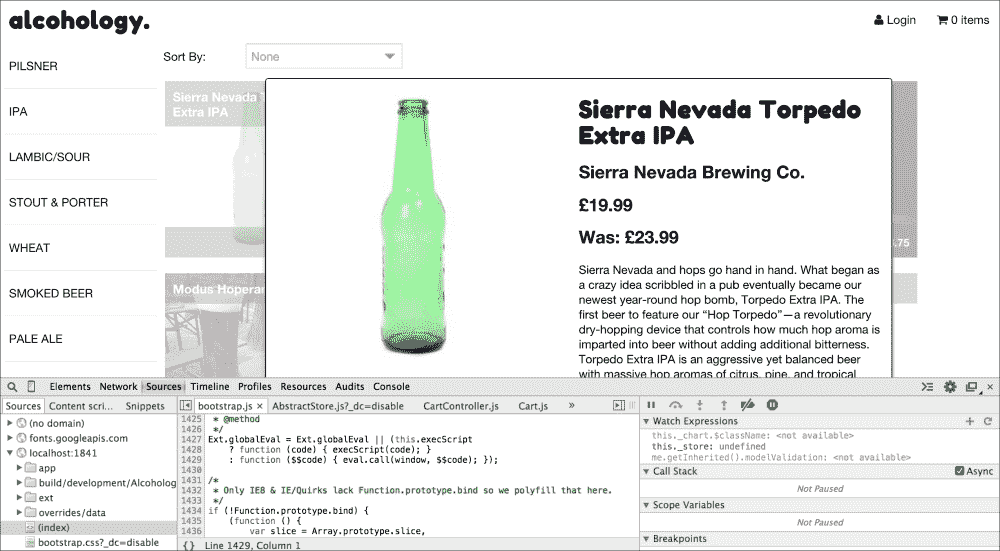

使用 Chrome 开发者工具的 Alcohology 应用

让我们想象一个理论情况，当我们将此产品添加到购物车时，可能有些不对劲。我们希望进入处理**添加到购物车**按钮**点击**事件的代码，因此我们在开发者工具的左侧面板中使用文件资源管理器导航到`/app/view/product/ProductController.js`并滚动到`onAddToCart`方法。

通过单击第**54**行的行号，将出现一个蓝色指示器，表示我们在`onAddToCart`方法的开头设置了“断点”。当代码执行到达第**54**行时，调试器将暂停执行，并给我们机会检查应用程序状态：

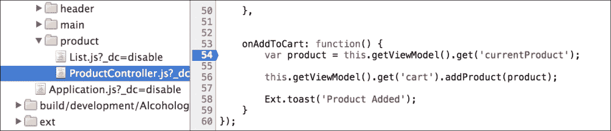

ProductController.js 在第 54 行设置了断点（以蓝色表示）

已经设置了断点，所以下一步是触发此代码的执行并检查`onAddToCart`。

## 断点

点击**添加到购物车**按钮将调用`onAddToCart`点击处理程序并在第 54 行暂停执行。整行将高亮显示为蓝色，以显示我们暂停的位置。这一行代码从视图模型中获取当前产品并将其存储在`product`变量中。

在这一点上，高亮显示的代码行尚未运行，因此`product`变量将是未定义的。让我们继续到下一行，通过点击右侧面板中的曲线箭头来检查`product`的内容：

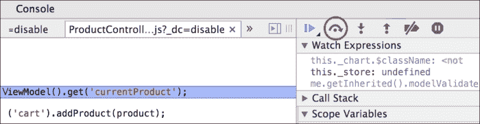

红圈中高亮显示的“跳过下一个函数调用”按钮

这将跳过当前行并移动到下一行，这次将第 56 行高亮显示为蓝色。

在这一点上，`product`变量将被设置，因此你可以将鼠标悬停在其上，将出现一个弹出窗口显示其各种属性和方法。由于它是一个`Alcohology.model.Product`的实例，而`Alcohology.model.Product`是`Ext.data.Model`，我们将看到继承链中所有类提供的对象上的所有属性和方法。

根据继承链的确切结构，一些属性和方法只能通过通过`__proto__`属性向下钻取并展开来揭示。

### 注意

`__proto__`属性是一个指向此对象原型的 JS 对象的内部属性。Ext JS 通过使用 JavaScript 的原型继承来复制经典继承。你可以在 MDN 上了解更多详细信息[`developer.mozilla.org/en-US/docs/Web/JavaScript/Guide/Inheritance_and_the_prototype_chain`](https://developer.mozilla.org/en-US/docs/Web/JavaScript/Guide/Inheritance_and_the_prototype_chain)。

第 56 行看起来是这样的：

```js
this.getViewModel().get('cart').addProduct(product);
```

假设我们想深入到`addProduct`方法中，调查这里发生了什么。**Step in to next function call**按钮将允许我们这样做（它位于**Skip over**按钮旁边的向下箭头）。问题是它确实做了它所说的，那就是进入下一个函数调用。第 56 行实际上由三个单独的函数调用组成：

+   一个调用`getViewModel`，它返回分配给这个视图控制器的视图模型

+   一个带有参数'cart'的`get`调用，它从视图中返回购物车

+   最后，带有产品变量作为参数的`addProduct`调用

结果是，我们第一次点击**Step In**时，会进入`getViewModel`的 Ext JS 框架代码。然后我们点击向上的箭头**Step Out**返回到第 56 行。再次点击**Step In**和**Step Out**会将我们带入`get`并再次退出。最后，在我们这个小舞蹈的第三部分，**Step In**会带我们进入`addProduct`方法的源代码：

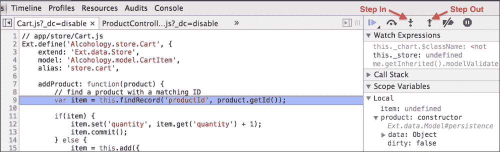

进入`addProduct`代码

我们现在可以检查产品在这个方法中的使用情况，并验证代码是否按预期运行，如果不是，原因是什么？

重复的进入/退出可能会很痛苦且令人困惑，尤其是对于想要使用这些高级工具的新开发者来说。作为问题解决架构师，我们需要为了我们自己以及帮助我们的团队在调试会话中理解这些怪癖。有几种方法可以解决这个问题；我们将在下一节中探讨这些方法。

## 黑盒化和直截了当

Chrome 有一个名为“黑盒化”的功能，它告诉 Chrome 在调试时跳过代码文件。这正是我们需要的，以避免我们之前看到的进入/退出舞蹈；通过黑盒化 Ext JS 源代码，Chrome 将不会进入此代码。

设置黑盒化很容易。只需使用左侧的文件导航器打开 Ext JS 源代码，在开发构建中可能类似于这样：

```js
/ext/build/ext-all-rtl-debug.js
```

我们在遍历代码时也打开了此文件，因此我们有一种替代方法在中央面板中打开它。当我们得到有问题的文件时，只需右键单击它并从菜单中选择**Blackbox Script**选项即可：

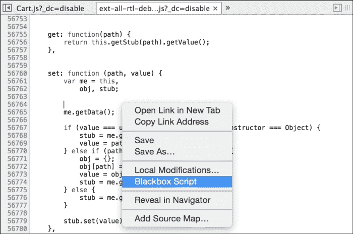

带有高亮 Blackbox Script 选项的源文件选项菜单

会在窗格顶部出现一个横幅，指示文件已被黑盒化。这是一种简化调试会话的好方法。由于 Ext JS 源代码超过 10 万行，这也可以大大加快过程。

### 注意

有多种方法可以将脚本黑盒化。有关 Chrome 开发者工具文档的更多信息，请参阅 [`developer.chrome.com/devtools/docs/blackboxing`](https://developer.chrome.com/devtools/docs/blackboxing)。

避免逐步进入/退出痛苦的第二种方法是完全绕过相关的代码。如果我们知道我们真正想要调试的方法的来源，那么为什么不在那里设置另一个断点呢？在我们的上一个例子中，在 Cart.js 的第 9 行设置断点，正好在 `addProduct` 方法中，会更有意义。通过点击表示为蓝色向右箭头的 **恢复脚本执行** 图标，我们可以立即从 `ProductController` 中的断点跳转到 `Cart` 类中的断点。

软件开发中有一个谚语：写代码比读代码容易。花时间去理解别人写的代码是一项所有开发者都应该掌握的关键技能，但对于经常处于评估现有代码和理解其如何融入更大图景的架构师来说，尤其有价值。

调试和逐步执行代码是这个过程中的关键部分，追踪不同路径的执行以构建应用程序行为的图景。

# 打破和破解

在项目的某个开发阶段，开发者不可避免地会面临一个晦涩的错误，这个错误是在应用程序加载时从 Ext JS 的深处抛出的。这引发了 Ext JS 设置其缓存机制的方式问题。例如，一个正常（如果稍微有些天真）的 JavaScript 文件请求可能看起来像这样：

```js
GET: /assets/javascripts/jquery.min.js
```

默认情况下，`Ext.Loader` 将拉取如下脚本：

```js
GET: /ext/build/ext-all-rtl-debug.js?_dc=1420215165267
```

它将时间戳查询变量附加到请求中。这是为了确保我们总是通过绕过浏览器缓存机制来获取脚本的最新版本。

这可能非常有用；然而，在我们的情况下，这意味着当页面重新加载时，我们代码中设置的任何断点都将被移除，因为 Chrome 认为文件是不同的，因为时间戳不同。

我们该如何解决这个问题？实际上非常简单；只需在 Ext JS 项目的根目录中打开 `app.json` 并搜索以 "this option is used to configure the dynamic loader" 开头的注释。该注释包含传递给加载器的各种选项，例如传递 `true`，这 "允许请求接收缓存的响应"。因此，我们可以添加以下代码：

```js
"loader": {
        "cache": true
},
```

此外，缓存破坏的时间戳也将被移除。注意尾随逗号。这是确保文件保持可解析 JSON 的必要条件。

## 被当场抓住

回到出现错误让我们感到惊讶的情况。错误可能发生在页面加载时，用户交互时，或者由于某些后台任务。能够捕捉到错误发生时的情况将非常棒，这样我们就可以用调试器四处探索并尝试确定出了什么问题。

幸运的是，Chrome 提供了一个正好做这件事的功能：“断点错误”，如下所示：

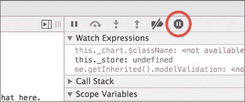

被红色圆圈高亮的“断点错误”图标

让我们尝试一个假设的例子。点击“断点错误”按钮，它变成蓝色，然后打开 Alcohology 项目的`Application.js`文件，并在启动方法中添加以下代码：

```js
Ext.create('Ext.Panel', {
    html: 'Break on error test!',
    renderTo: 'myElement'
});
```

保存并重新加载网页浏览器。Chrome 将立即跳转到 Ext JS 代码深处错误的源头：

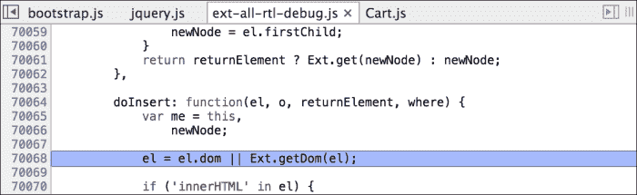

Chrome 调试暂停在抛出错误的代码行上

原始抛出的错误是`Uncaught TypeError: Cannot read property 'dom' of null`。在没有上下文的情况下，这没有太多意义。现在我们处于代码中，我们可以看到周围的变量并确定到底哪个变量为 null，在这个例子中，是`el`变量。

我们还可以使用右侧面板中的**调用栈**面板跳过调用栈，到最初发起这个代码路径的代码，并查看中间的所有代码调用。这在复杂场景中非常好，可以让我们追踪错误的根本原因：

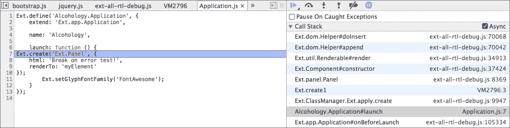

单独来看，这些都无法帮助我们解决问题。能够看到错误、错误发生时应用程序的状态以及通过代码到原始调用站的路径，所有这些结合对 Ext JS 的理解和一些直觉，给我们提供了解决这个问题的有力证据。

`el`变量，简称"元素"，为空，回顾我们在启动方法中的代码，我们发现我们将面板设置为`renderTo`一个名为`myElement`的元素。使用**调用栈**面板，我们可以向下到构造函数并做一些侦探工作：

+   `Ext.create`将调用面板的构造函数；我们可以通过在**调用栈**面板中点击`Ext.panel.Panel`来看到这一点。

+   这反过来又调用了`Ext.util.Renderable`混入的渲染方法。它传递了`renderTo`配置的值作为参数。

+   在渲染方法中，这个参数被称为容器。

+   渲染方法调用`Ext.DomHelper.append`并带有容器参数，调试器显示该参数为 null。

+   这表明容器变量在渲染方法中被其他地方操作。

+   追溯回去，我们发现罪魁祸首：`container = me.initContainer(container)`。

+   `initComponent`包含以下行`container.dom ? container : Ext.get(container)`。

所有这些最终都指向这个特定错误的根本原因：`将字符串 myElement 传递给 Ext.get`。由于我们没有在 HTML 页面上添加具有此 ID 的元素，Ext JS 无法找到它。这意味着面板没有有效的容器来渲染，从而导致抛出错误。

能够进行这种调查的能力可能是一个项目能否按时完成与因意外问题而停滞之间的区别。以这种方式深入代码是一种避免障碍并保持开发者前进的必要技能。

# Ext JS 中的性能

作为架构师，我们将从客户那里开始一个项目，客户会提供一个需要实现的长长的需求列表，以满足他们的需求。其中会有明确的事项，例如“登录功能”和“移动友好”，但还有一些需求并未包含在这个列表中，然而这些却是每个客户不可避免的需求。

其中之一是应用程序应该表现良好。这是一个包含以下内容的通用术语：

+   UI 元素的响应性

+   应用程序初始启动时间

+   远程请求，如加载/保存

慢速应用程序是用户沮丧的关键来源，诊断此类问题的第一步是收集信息。

让我们看看 Chrome 开发者工具如何帮助我们以各种方式解决使用 Ext JS 的常见问题。

## 网络性能

正如我们在示例中所看到的，许多 Ext JS 应用程序将通过与后端 API 服务进行通信来读取和写入数据。如果用户反馈显示远程请求无响应，我们需要首先诊断导致问题的调用。Chrome 在这里可以帮助我们。

在打开开发者工具的情况下，点击**网络**选项卡并刷新页面。我们得到了应用程序加载时请求的所有资源的列表；我们可以通过点击面板顶部的其中一个标题来过滤这些资源。以下是过滤到“XHR”或 Ajax 请求的 Alcohology 应用程序：

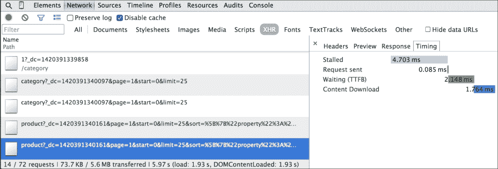

已选择 Ajax 请求的 Chrome 开发者工具

在这个例子中，已经选择了一个请求，并在右侧显示了时间细节的分解。虽然 Alcohology 应用程序的响应时间非常快，但它很好地说明了如何分析网络性能。

### 注意

更多关于**网络**面板的详细信息可以在[`developer.chrome.com/devtools/docs/network`](https://developer.chrome.com/devtools/docs/network)找到。

这对我们有什么帮助？如果远程服务器很慢，那么作为前端开发者，我们对此无能为力；除了将我们的远程请求保持在最低限度外，我们只能接受现有的情况。以下是我们可以采取行动来加快速度的一个例子。

注意“停滞”的条目在时间线中。这通常是由于浏览器对一次可以活跃到同一来源（如域名或子域名）的连接数所施加的限制。当这个数字超过时，浏览器将阻止任何新的请求，直到有连接可用。这种知识给我们提供了几个优化的机会。

### 减少请求数量

解决这个问题的简单方法是从服务器请求更少的东西，而 Ext JS 提供了几种方法来实现这一点。首先是一个我们在 Alcohology 应用中使用的技术（使用图标字体，如`FontAwesome`而不是图像图标）。这意味着我们只需要下载一个字体文件，而不是多个图标文件。菜单项和按钮上的`glyph`配置为我们提供了一个非常简单的方式来使用这个功能，并消除使用位图图像作为图标的需要。

接下来是嵌套数据。这是我们用于`Questionnaire`组件的方法，但需要谨慎使用。通过设置模型关联，我们可以一次性请求整个层次结构的数据，并填充我们的数据模型，而不是按模式类型逐个请求。

例如，对于`Questionnaire`组件，我们本可以分别通过三个单独的请求加载问卷、步骤和问题，但通过一次性下载所有内容，我们避免了两次远程请求。这个想法有两个注意事项；首先，服务器需要支持嵌套数据；其次，嵌套数据的大小可能更大，因此可能导致更慢的响应时间。多个单独的请求可能会带来更好的感知性能，因此这个概念的应用强烈依赖于具体情况，比如性能感知等。

### 感知性能

在某些情况下，我们无法提高应用程序某些方面的加载时间，例如，可能是报告生成，其中涉及的计算是一个长时间运行的操作。

在这种情况下，我们需要尽我们所能来提高用户对性能的认知，并确保他们正在执行的操作正在进行中，并且很快就会完成。

在 Ext JS 中，实现这一目标的一个关键机制是`Ext.LoadMask`。它在 Ext JS 内部在几种情况下被使用：

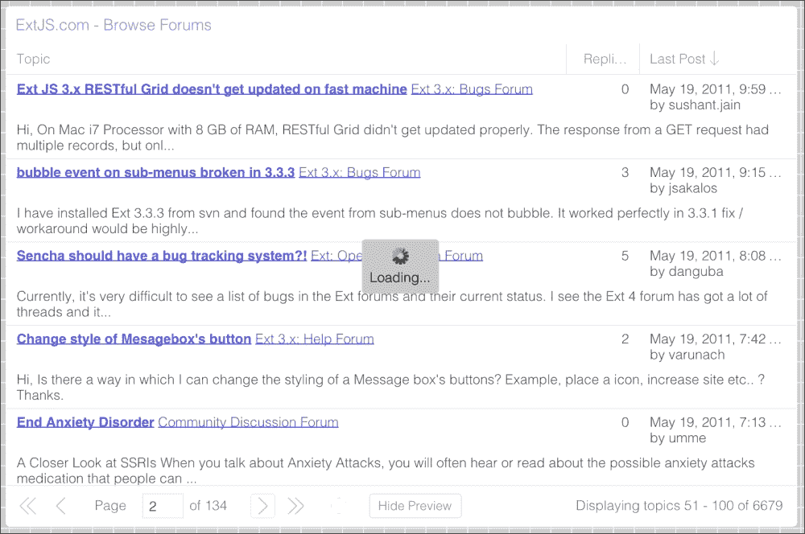

在 Ext JS Kitchen Sink 的先前示例中，一个带有分页工具栏的网格在等待服务器返回下一页时会自动使用`LoadMask`。

对于用户来说，优点是他们虽然必须等待，但至少被告知他们必须等待。如果没有`LoadMask`，他们可能会点击按钮，但不会收到服务器正在考虑请求的任何反馈。

我们可以通过在需要时创建一个新的实例来在我们的代码中利用`LoadMask`，但更有可能的是，我们会在现有的容器上使用它，并利用许多 Ext JS 组件内置的`LoadMask`功能。

我们可以使用事件域，这是我们之前在第二章中讨论的，作为钩入远程请求和屏蔽我们组件的一种方式：

```js
listen: {
    store: {
        'products': {
            'beforeload': function() {
                this.lookupReference('list').mask('Loading...');
            },
            'load': function() {
                this.lookupReference('list').mask(false);
            }
        }
    }
}
```

在我们添加到 Alcohology 的`ProductController`的这段代码中，我们告诉`listen`配置监视产品存储上的`beforeload`和`load`事件。监听器可以使用我们在产品`store`类上已经设置好的“products”别名。当`beforeload`事件触发时，我们获取产品列表视图并调用其 mask 方法来显示其`LoadMask`。当服务器响应返回并且`load`事件触发时，我们使用 false 参数调用 mask 方法来再次隐藏它。

这是一个简单且不引人注目的方法来连接加载机制，并给用户提供至关重要的反馈，显示他们的操作已经触发了效果。

### 加载较少

一种非常简单的方法来加快 Ajax 请求的响应速度是请求更少的东西！如果服务器支持分页，那么任何由存储支持的组件都可以通过请求单页数据而不是一次性拉取数据来立即提高性能。

`Ext.PagingToolbar`可以链接到存储并在应用程序的任何位置放置，以提供分页 UI：

```js
bbar: [{
        xtype: 'pagingtoolbar',
        store: { bind: '{products}' },
        displayInfo: true
}]
```

例如，以下是我们在 Alcohology 应用程序的产品列表视图中添加分页工具栏的开始。它自动采用我们使用的主题的触摸友好样式：

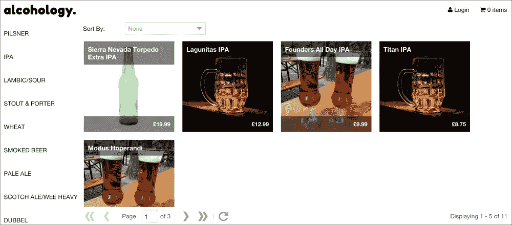

Alcohology 的产品列表，包括分页工具栏

这种技术的更高级版本涉及使用`Ext.data.reader.Reader.metaData`属性或`Ext.data.proxy.Proxy.metachange`事件。这可以用来从服务器传递数据到客户端，然后用于配置 Ext JS 应用程序；一个常见的例子是允许服务器在首次加载时指定网格包含的列。

这可能意味着在初始加载时，服务器省略了一个字段和匹配的网格列，例如描述，这可能包含大量数据。用户可以通过列标题 UI 自定义网格，在他们需要时显示它。

### 乐观更新

当将记录保存到服务器时，我们通常会看到以下操作：

+   用户点击按钮保存记录

+   Ext JS 显示“正在保存”消息

+   保存完成并显示“成功”消息

然而，在某些情况下，我们可以相信服务器将成功保存，并将操作简化为以下内容：

+   用户点击按钮保存记录

+   保存进行并显示“已保存”消息

在这种情况下，保存操作完全在后台进行，不会阻止用户执行其他操作。您可以在许多电子邮件应用程序中看到这种行为，服务器交互在幕后进行，并且有一个“发件箱”来存储第一次尝试发送失败的消息。

如果服务器确实抛出某种错误，我们可以显示一个错误消息并回滚用户所做的更改。Ext JS 网格包括用于此目的的 UI；它将以红色标记突出显示更改的值，当我们确信记录已成功提交到服务器时可以清除这些标记。

这是一个需要额外 UI 设计工作的高级技术，但它可以极大地改善用户体验。

# 快速反应

除了确保我们的应用程序与服务器交互的方式始终及时外，我们还需要关注用户界面的渲染速度以及浏览器绘制 UI 的速度。在这一点上，Ext JS 存在一些常见的陷阱：

## 过度使用面板

面板具有一些功能，例如包含工具图标的标题、可拖动、可折叠以及具有停靠项的能力。在许多情况下，这些功能根本不是必需的。在这种情况下，容器是一个更好的选择。它在内存中更轻量级，并且它生成的标记也更少。

## 过度嵌套

容器和面板的过度嵌套，尤其是那些实现边框布局的，是性能问题的一个非常常见来源，尤其是当用户需要在包含过度嵌套组件的各种屏幕之间移动时。Ext JS 需要进行大量的计算来构建视口，布局过程尤其昂贵。每次我们发现自己在层次结构中添加一个新的组件时，都应该让我们停下来重新评估。

我们还需要考虑一个深层层次结构可能如何影响我们查询组件结构的情况。随着组件树变得更加复杂和 DOM 更加复杂，从应用程序中获取组件或元素的操作将会变慢。在许多情况下，这种减速将是微不足道的；在某些情况下，当提高应用程序性能时，它将是一个关键的考虑因素。

## 延迟渲染

当创建具有卡片布局的容器或面板时，默认情况下，布局将立即渲染每个卡片内的所有组件。这通常是不必要的，因为用户一开始只会看到第一张卡片。相反，我们可以使用卡片布局上的 `deferredRender` 配置选项，仅在父卡片变为活动状态时渲染项目。这减少了初始渲染时间，因此，直到应用程序可以响应用户输入的时间。

另一种类似的方法涉及网格。Ext JS 允许你将大量的服务器响应加载到存储中，并尝试在网格上显示它，但在有数千条记录的情况下，存储会导致内存使用激增，浏览器将难以保持如此大量 DOM 节点组成的网格行的流畅性。

解决方案是替换为`Ext.data.BufferedStore`标准存储。这使用增强的分页机制预先加载数据页。同时，网格将自动使用`Ext.grid.plugin.BufferedRenderer`，当用户滚动网格条目时，后端的`BufferedStore`将自动加载新页面数据，同时删除旧页面。它这样做无缝，因此用户不会意识到行是从服务器即时加载的。`BufferedRenderer`还会在它们滚动过去时销毁旧节点中的 DOM 节点，从而减轻大量数据的内存负担。

所有这些技术都有其位置。它们也是架构过程开始时需要了解的有用工具。如果客户询问应用程序是否可以处理数据网格中的 10,000 条记录，我们现在知道缓冲存储可以提供所需的功能。另一方面，我们需要意识到过早优化；当我们只处理少量记录时，实现缓冲存储是没有意义的。

# 性能分析

处理性能问题最初是一个情报收集的问题。应用程序感觉缓慢可能有多个原因，用户的反馈往往无助于解决问题。将应用程序的一部分描述为“粘性”并不是诊断根本原因的好方法。在我们希望找到解决方案之前，我们需要将确凿的事实和数字摆在我们面前。虽然我们将查看渲染和响应时间等指标，但必须考虑许多因素，例如内存使用和用户感知。这些主题留作读者练习。

Chrome 开发者工具再次伸出援手。这次，我们将探讨两个有助于诊断性能问题的主要功能：配置文件和时序图。

### 注意

通常，当 Ext JS 应用程序感觉缓慢时，有两种情况：糟糕的设计决策和过度复杂的应用程序。话虽如此，当问题出现时，这些技术非常有价值，并且适用于任何 JavaScript 技术。

可以通过打开开发者工具并选择**配置文件**选项卡来找到分析器：

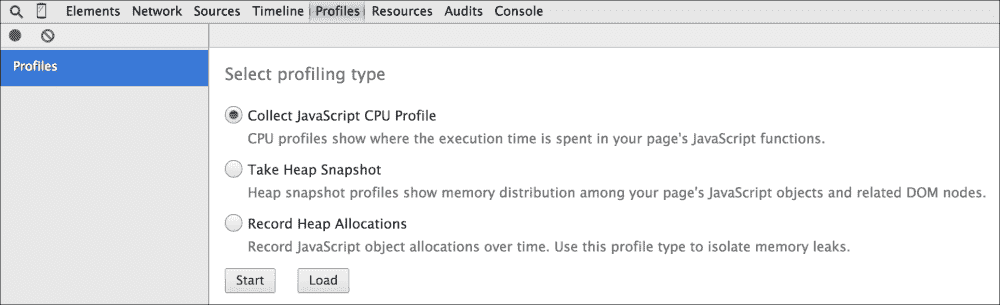

虽然可以发出多种类型的配置文件，但我们将查看 CPU 配置文件。在前面的屏幕截图中，我们会点击**开始**立即开始分析。以下是在 Alcohology 中点击产品时发生的情况：

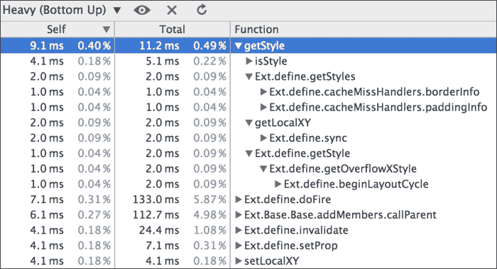

网格按耗时最长的函数调用从上到下排序，并且每一行都可以展开，以便我们可以看到依次调用的函数。**Self**列显示在该函数体内花费的时间百分比；**Total**列显示该函数以及它调用的所有函数所花费的时间。

虽然 Alcohology 应用的这部分运行得很好，但这个简单查看代码中频繁使用部分的视图是诊断严重性能问题的关键途径。然而，我们还能做更多。

我们已经使用 Chrome 开发者工具评估了远程请求的性能，现在我们使用它们来追踪代码中的热点。那么，有没有一个单一的视图可以帮助我们跟踪应用程序的一般行为，并帮助我们可视化那些减慢事情进展的交互类型？这正是**时间线**标签提供的。

### 注意

这是对**时间线**的快速浏览。有关更多详细信息及完整文档，请参阅[`developer.chrome.com/devtools/docs/timeline`](https://developer.chrome.com/devtools/docs/timeline)。

通过选择**时间线**标签并点击**记录**按钮，Chrome 会立即开始记录页面上当前发生的每个事件。再次点击**记录**按钮，您可以分析结果：

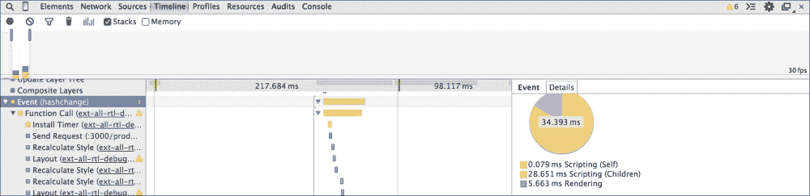

时间线允许您筛选事件的时间范围，并依次查看每个事件，从用户点击到 Ajax 请求，再到 URL 更改和浏览器重绘。从第一个事件开始，我们可以追踪每个后续事件，查看堆栈跟踪、详细的计时和有关问题行为的警告。

时间线是一个强大的工具，您需要时间和经验才能充分利用它。这是值得花费的时间；它可以揭示其他方式难以或无法发现的线索。这些线索可以帮助解决其他方式可能需要几天时间才能解决的问题。

# 摘要

本章为我们提供了多个角度来处理构建成功应用的两个最重要的部分：解决问题和添加润色。虽然明确的客户需求构成了我们工作的主体，但我们始终应努力确保我们的项目性能良好，尽可能无错误。

Chrome 开发者工具是我们武器库中的无价之宝。通过在调试和性能的黑暗世界中打开一个窗口，我们可以采取有针对性的步骤来快速解决问题。利用断点和调用堆栈探索器的力量，我们可以更容易地逐步执行我们的代码以及 Ext JS 框架的代码。

在下一章中，我们将迈出构建全面且稳健应用的最后一步。虽然我们一直在努力构建最佳架构，但自动化测试可以提供一种保证，将我们工作的稳定性提升到新的水平。

当我们的测试套件能够告诉我们是否因最新的修改而破坏了某些内容时，我们可以有信心地进行代码更改和重构。集成测试可以确保我们的最终应用满足客户需求，单元测试可以鼓励代码分离并确保我们的业务逻辑正确。

在下一章中，我们将探讨多种实现这些想法及更多内容的方法。
