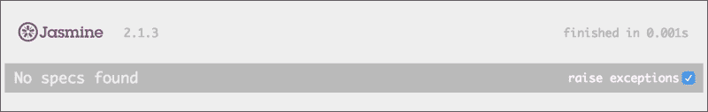
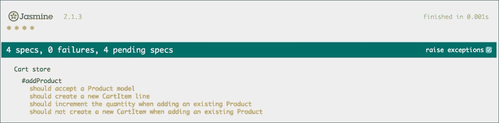
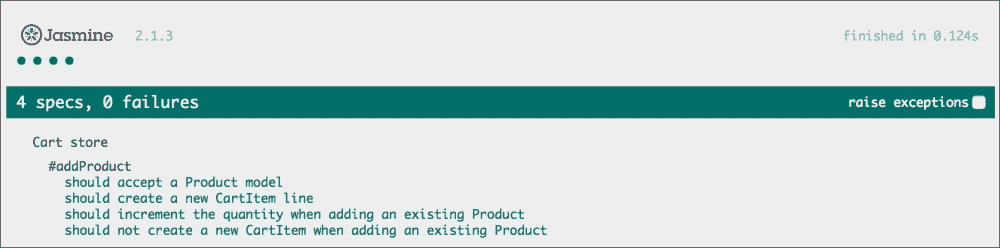
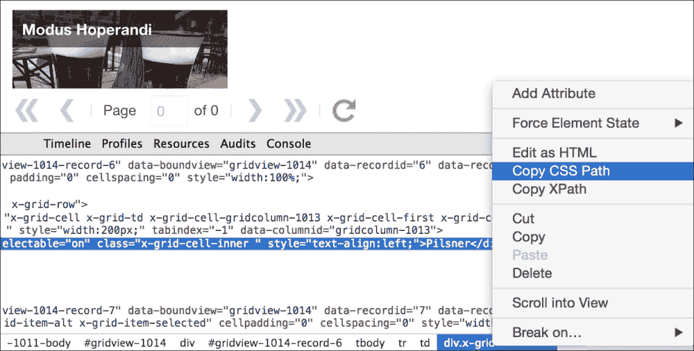
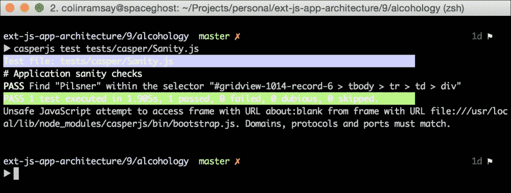
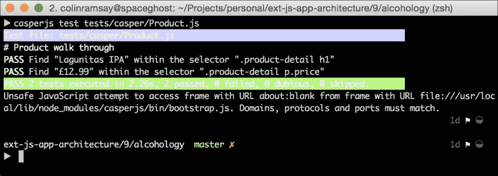

# 第十一章。应用程序测试

我们作为架构师的角色不仅仅是勾选框，将应用程序发送给客户，然后忘记它。从专业和商业的角度来看，我们有责任生产试图超越预期的软件。其中一部分在第十章中提到，即*调试与性能*，我们讨论了构建对用户操作反应迅速的应用程序的需求。现在，我们将讨论构建一个鲁棒的应用程序，一个在重压下经得起考验的应用程序。

应用程序要具备鲁棒性意味着什么？这意味着如果我们点击一个按钮，我们会看到预期的结果。如果我们尝试输入一个无效的电子邮件地址，我们会看到验证消息。如果我们刷新页面，我们会发现自己回到了之前的屏幕。如果网络连接断开，远程请求会在稍后重试。如果我们尝试破坏应用程序，等等，我们能否成功？

构建鲁棒应用程序的核心是应用程序应该始终按照用户的预期行为，即使在意外情况下也是如此。我们必须认识到开发者（和架构师）是会犯错的，并且不太可能考虑到即使是微小的代码更改的每一个可能的后果；这就是错误出现的原因，也是为什么对鲁棒性的追求是持续不断的。

我们需要安全网来应对编码的易出错性。如果我们更改产品列表视图中的一个特定方法，我们能否保证它不会影响购物车？我们可以在文本编辑器中使用查找和替换，但我们永远无法在没有刷新应用程序并检查产品列表和购物车的功能以证明客户需求仍然得到满足的情况下，达到 100%的确定性。

质量保证流程是一个安全网，其中自动化测试是其关键组成部分。当使用 Ext JS 时，我们有众多工具可以使用，以及一系列方法来确保我们的应用程序以有利于自动化测试的方式构建。为此，在本章中，我们将探讨：

+   不同的测试类型及其使用时机

+   将 Ext JS 代码关注点分离以促进单元测试

+   命名和编码规范以帮助进行集成测试

+   单元测试和集成测试的测试工具

+   Ext JS 特定的测试工具

本章的目标是建立对测试优势的理解，如何编写易于测试的 Ext JS 应用程序，以及如何选择和运用合适的测试工具。完成之后，我们将涵盖 Ext JS 架构师需要生产优秀产品所需的所有主题。

# 全面测试

在本章中，我们将介绍两种类型的测试，一种在细节层面，另一种在“大局”层面。第一种，单元测试，非常适合帮助处理通常构成业务逻辑的算法和计算；第二种，集成测试，帮助我们确保满足客户需求并且用户体验良好。让我们逐一查看。

## 单元测试

使用单元测试时，我们不出所料地测试一个单元，一个单元是一个单独的代码单元。这通常是一个完整的类，但会根据情况专注于单个方法。在单元测试中，我们可以说出如下内容：

```js
Create cart object
Add product #1 to cart
Add product #1 to cart
Assert that there is only one item in the cart
```

为了设置测试，我们将同一产品添加到购物车两次。这应该导致一个数量为两个的行项目，而不是两个数量各为一的行项目。在第一个测试中，我们断言购物车计数等于一个，这确保了添加到购物车不会添加重复项。下一个测试将检查数量是否按预期增加：

```js
Create cart object
Add product #1 to cart
Add product #1 to cart
Assert that first cart item has a quantity of two
```

它执行与上一个测试相同的设置，然后选择购物车中的第一行项目，并断言其数量等于两个，每个产品被添加到购物车一次。

## 断言自己

所有这些“断言”是什么意思？它只是说“如果这个条件不满足，就有问题”。在先前的例子中，如果实际值和预期值不相等，就有问题。在大多数单元测试库中，有许多不同的断言，例如：

+   等于

+   小于

+   大于

+   它是数字吗？

+   它是否包含指定的值？

每个测试库都有自己的断言方法风格。有些会使用稍微不同的术语（如期望或规范）。术语不如单元测试背后的原则重要，即对隔离的代码进行严格的审查。

## 集成测试

虽然单元测试关注的是一小块功能，但集成测试则走向了相反的极端。其目的是检查应用程序的所有移动部件是否正确协同工作，复制一些现实世界用户可能会采取的操作。

因此，集成测试通常被称为 UI 测试，因为它直接作用于界面。假设我们想验证当点击产品时，详细窗口是否会显示。我们可以这样做：

1.  找到问题产品的链接。

1.  在链接上模拟点击事件。

1.  验证问题产品所在的 DOM 元素是否按预期显示。

这与我们之前在单元测试中拥有的那种关注点完全不同。在单元测试中，我们是深入到代码中的单个函数或类。在这里，我们要测试的操作将跨越应用程序中的多个类，检查它们是否集成并正确协同工作。

### 积分和微分

集成测试的本质意味着它操作的是用户可以看到的相同应用程序；测试实际上加载了一个浏览器并模拟用户会采取的路径。然而，与用户手动移动鼠标光标的方式不同，集成测试框架通常通过在屏幕上选择 HTML 元素并允许您直接执行操作来工作。

这既有好的一面也有不好的一面。当用户协商网页时，他们通常可以相当快地找到他们感兴趣的用户界面组件，但当编写测试的人来挑选这个相同的组件时，他们需要一种引用它的方法。通常的做法是使用 CSS 或 XPath 选择器。例如，要使用 CSS 和 XPath 引用页面上具有 ID 的元素，请使用以下代码：

```js
#someElement
//*[@id="someElement"]
```

此外，获取容器中第一个按钮的另一个稍微复杂一些的代码如下：

```js
#container > button:nth-child(1)
//*[@id="container"]/button[1]
```

这在一定程度上展示了编写集成测试的潜在痛点。如果`someElement`的 ID 发生变化怎么办？这将破坏测试，但这是一个相当简单的修复。如果"container"的 ID 发生变化呢？嗯，这不仅会破坏前面的例子，还会破坏任何寻找此`div`内按钮或其他元素的测试。

这是在集成测试中持续存在的问题：测试的脆弱性。在本章的后面部分，我们将探讨一些在 Ext JS 中解决此问题的方法。

# 使用 Jasmine 的测试工具时间

理论已经足够了！让我们通过使用第九章中的 Alcohology 应用程序（第九章 {
    it('contains spec with an expectation', function() {
        expect(true).toBe(true);
    });
});
```

`describe`方法用`expect`方法声明的期望包围一个或多个规格，这些规格本身是在`it`方法中声明的。要将前面的代码翻译成普通语言，请使用以下命令：

```js
We have "a suite", which "contains spec with an expectation". This expectation expects "true" to be "true".
```

显然，这是一个虚构的套件，因为我们希望总是为真！然而，它应该作为一个有用的 Jasmine 测试通用语法的演示。在我们能够开始使用它并应用于我们自己的应用程序之前，我们需要花点时间下载并设置 Jasmine 库。

## Jasmine – 安装和配置

开始使用 Jasmine 的最简单方法是下载项目发布页面上的最新版本。在撰写本书时，当前版本是 2.1.3。有关更多信息，请参阅[`github.com/jasmine/jasmine/releases`](https://github.com/jasmine/jasmine/releases)。

解压缩 ZIP 文件，您会看到下载包括一些我们不需要的示例规范；让我们从新的 Jasmine 目录中清除这些内容：

```js
rm MIT.LICENSE spec/* src/*
```

现在，我们可以将 Jasmine 库移动到 Alcohology 项目的根目录，假设我们的当前目录现在位于 Alcohology 项目中：

```js
mkdir ./testsmv ~/Downloads/jasmine-2.1.3 ./tests/jasmine
```

现在，我们可以启动我们的应用程序；如果您已下载项目文件，则 readme 文件将告诉您运行`npm start`，这将启动 Ext JS 项目和 API 服务器。一旦完成，我们就可以在我们的浏览器中打开`http://localhost:1841/tests/jasmine/SpecRunner.html`来运行规范，如图所示：



编写规范之前的 Jasmine 规范运行器

在这个屏幕截图中，我们可以看到规范运行器，但它没有任何作用。在我们开始编写一些规范之前，我们还需要做一些配置。让我们在编辑器中打开`SpecRunner.html`文件，并调整它看起来像这样：

```js
<!DOCTYPE html>
<html>
<head>
  <meta charset="utf-8">
  <title>Jasmine Spec Runner v2.1.3</title>

  <link rel="stylesheet" href="lib/jasmine-2.1.3/jasmine.css">

  <script src="img/jasmine.js"></script>
  <script src="img/jasmine-html.js"></script>
  <script src="img/boot.js"></script>
  <script src="img/ext-all-debug.js"></script>

  <script type="text/javascript">
    Ext.Loader.setConfig({
      enabled: true,
      paths: {
        'Alcohology': '../../app'
      }
    });
  </script>

  <script src="img/Cart.js"></script>
</head>
<body></body>
</html>
```

这个 HTML 文件实际上只是 Jasmine 库的宿主，但它也是我们将 Ext JS 连接到应用程序上下文之外的地方。通过包含`ext-all`JavaScript 文件并重新配置`Ext.Loader`以从正确的目录获取任何 Alcohology 类，我们可以实例化用于测试的类，并且 Ext JS 将自动从我们的应用程序目录请求所需的文件。剩下的只是将实际的 JavaScript 规范文件包含在 head 元素的底部。在这里，我们已经添加了对`spec/Cart.js`的引用。

在完成所有设置后，我们可以继续编写一些测试！

## 让它发生

之前，我们编写了一些伪代码来展示如何测试购物车存储上的`addProduct`方法。现在，让我们构建一个真正的 Jasmine 规范，以实现这一目标。我们需要创建一个包含购物车存储的测试套件，该存储将用作测试对象：

```js
describe('Cart store', function() {

  var cart;

  beforeEach(function() {
    cart = Ext.create('Alcohology.store.Cart');
  });
});
```

我们的第一个套件简单地称为`Cart store`。我们有一个购物车变量，它在`beforeEach`规范运行之前被重新分配。它通过`Ext.create`分配一个购物车存储实例。多亏了上一节中的配置，`Ext.create`将自动拉入相关的源代码文件，包括任何依赖项。通过在每次测试之前重新实例化，我们可以确保套件中较晚的测试不会受到早期测试操纵购物车的方式的影响。

我们现在可以勾勒出我们想要测试的功能。以下代码跟在`beforeEach`调用之后：

```js
describe('#addProduct', function() {
    it('should accept a Product model');
    it('should create a new CartItem line');
    it('should increment the quantity when adding an existing Product');
    it('should not create a new CartItem when adding an existing Product');
  });
```

如果我们刷新`SpecRunner.html`页面，我们实际上能看到类似这样的内容：



这些规范只是占位符，但它们出现在运行器中对于练习测试优先开发的开发者来说很有用。我们可以编写一系列描述所需功能的规范语句，然后是规范，最后是代码本身。这样，我们指定了所需的行为，代码本身随后跟来，我们可以放心地知道它符合我们的要求。这对于架构师来说，可以是一个强大的方法，详细说明一个类应该如何表现。

让我们逐个过一遍每个规范：

```js
it('should accept a Product model', function() {
    expect(cart.addProduct.bind(cart, {})).toThrow();
});
```

我们期望如果`addProduct`传递的不是产品模型，而是其他东西，它将抛出一个异常。我们将方法传递给预填充空对象字面量的`expect`调用。正如预期的那样，这不是产品模型，因此它抛出一个异常，并如下满足测试：

```js
it('should create a new CartItem line', function() {
    var product = Ext.create('Alcohology.model.Product');

    cart.addProduct(product);

    expect(cart.count()).toBe(1);
});
```

当产品被添加到购物车时，我们期望这将在商店中创建一个新的行项目。我们简单地检查在添加产品后购物车数量是否符合预期：

```js
it('should increment the quantity when adding an existing Product', function() {
    var product = Ext.create('Alcohology.model.Product');

    cart.addProduct(product);
    cart.addProduct(product);

    expect(cart.first().get('quantity')).toBe(2);
});
```

在添加已经存在于购物车中的产品后，我们期望这将增加相应购物行项目的数量。我们传入相同的产品两次，并检查数量是否为预期的两个：

```js
it('should not create a new CartItem when adding an existing Product', function() {
    var product = Ext.create('Alcohology.model.Product');

    cart.addProduct(product);
    cart.addProduct(product);

    expect(cart.count()).toBe(1);
});
```

这与上一个测试的设置类似，但我们期望不会有一个重复的购物车行，而只会在购物车中有一个项目。

在编写完所有规范后，我们可以再次刷新规范运行器：



如您所见，所有规范都是绿色的，表明它们已成功通过。

这只是关于使用 Jasmine 进行单元测试的简要入门，但它展示了可用的功能和以这种方式测试的实用性。它让我们对我们的代码充满信心，并确保对`addProduct`方法的任何添加都不会破坏现有的功能。

# 使用机器人进行测试

现在我们已经介绍了一种测试代码细节的方法，接下来让我们看看一种完全不同的在整个应用程序中运行功能检查的方法。为此，我们需要一个新的工具：CasperJS。它允许你驱动一个“无头浏览器”——一个没有用户界面的浏览器——在应用程序中导航，并对我们找到的内容进行评估。第一步是安装，这取决于平台。有关说明，请参阅[`docs.casperjs.org/en/latest/installation.html`](http://docs.casperjs.org/en/latest/installation.html)。

完成后，我们将有一个可用的 CasperJS 命令来运行。

在使用 Jasmine 时，我们使用带有期望的行为驱动测试方法来验证代码。在 CasperJS 中，我们回归使用断言风格的测试。看看 CasperJS 文档中的一个最小测试脚本：

```js
casper.test.begin("Hello, Test!", 1, function(test) {
    test.assert(true);
    test.done();
});
```

这相当直接。真正的魔法出现在我们将它与 CasperJS 控制无头浏览器和与构成我们应用程序的网页交互的能力结合起来时。看看这个：

```js
casper.test.begin('Google search retrieves 10 or more results', 4, function suite(test) {
    casper.start('http://www.google.com/', function() {
        test.assertTitle('Google', 'google homepage title is the one expected');
        test.assertExists('form[action="/search"]', 'main form is found');
        casper.fill('form[action="/search"]', {
            q: 'casperjs'
        }, true);
    });

    casper.then(function() {
        test.assertUrlMatch(/q=casperjs/, 'search term has been submitted');
        test.assertEval(function() {
            return __utils__.findAll('h3.r').length >= 10;
        }, 'google search for \'casperjs\' retrieves 10 or more results');
    });

    casper.run(function() {
        test.done();
    });
});
```

这看起来更有趣！让我们分析一下这里发生了什么：

1.  创建一个新的 CasperJS 测试套件。

1.  导航到 Google 首页。

1.  断言页面标题与预期相符，并且我们可以找到搜索框。

1.  填充搜索框并提交表单。

1.  然后，当页面加载完成后，断言 URL 与预期相符，并且包含我们的搜索查询作为参数。

1.  断言页面上至少有十个搜索结果。

太棒了！这个例子展示了如何轻松使用 CasperJS 控制网页，以及它的测试功能如何允许我们评估页面内容和应用程序的行为。

下一步是看看如何使用这些功能来测试我们自己的应用程序，所以让我们将 CasperJS 集成到我们的 Alcohology 项目中并进行测试。

## 使用 CasperJS 启动

让我们在项目中的`tests/casper`子目录下创建一个新的子目录，然后在那里创建一个名为`Sanity.js`的新文件。我们将编写一些简单的检查以确保应用程序正确加载。以下是代码的起点：

```js
casper.test.begin('Alcohology Sanity Checks', 0, function suite(test) {
    casper.start('http://localhost:1841/', function() {
    });
    casper.run(function() {
        test.done();
    });
});
```

我们首先调用`casper.test.begin`方法，它启动一个新的测试套件并接受三个参数：套件的描述、我们期望运行的测试数量，以及当套件创建时被调用的回调函数。回调函数接收一个测试对象，我们可以调用各种断言方法。

然后，我们调用 CasperJS 的`start`方法并传入我们应用程序的 URL。为了触发测试运行，我们调用 CasperJS 的`run`方法，当一切完成后，我们在测试对象上调用`done`方法。

我们将要编写的第一个测试将检查应用程序左侧的类别菜单是否按预期填充。为此，我们将查找第一个菜单项并检查它是否包含我们期望的文本，但当我们使用 Ajax 加载此内容时，这会稍微复杂一些。我们需要能够等待页面加载，选择相关元素，并检查它是否包含我们期望的内容。

为了选择元素，我们将使用 CSS 选择器，等等，但我们需要一个机制来找到正确的选择器。幸运的是，Chrome 开发者工具将再次伸出援手；如果我们右键单击 Alcohology 顶部类别菜单项中的 **Pilsner** 文本，然后选择 **检查元素**，元素面板将显示并选中该菜单项的元素。

接下来，右键单击元素并点击 **复制 CSS 路径**选项：



这个 `div` 标签的 CSS 选择器将被复制到你的剪贴板，并应如下所示：

```js
#gridview-1014-record-6 > tbody > tr > td > div
```

我们现在可以使用 CasperJS 来做这件事：

```js
casper.test.begin('Application sanity checks', 0, function suite(test) {
    casper.start('http://localhost:1841/', function() {
        var selector = '#gridview-1014-record-6 > tbody > tr > td > div';

        casper.waitForSelector(selector, function() {
            test.assertSelectorHasText(selector, 'Pilsner');
        });
    });

    casper.run(function() {
        test.done();
    });
});
```

在告诉 CasperJS 开始并加载应用程序的网页后，我们将使用 `waitForSelector` 方法等待指定的选择器出现在页面上；默认情况下，它将在 5 秒后抛出失败消息。当选择器出现时，回调函数被触发，我们使用 `assertSelectorHasText` 方法来检查 `div` 标签是否有正确的文本：



运行我们的第一个 CasperJS 测试

这很简单，但很有效。如果我们因为对类别存储代码的修改而破坏了某些东西，错误地将数据绑定到视图模型，或者由于其他一些微小的更改而级联影响这个关键功能，那么这个测试将立即指出。

### 注意

CasperJS 依赖于另一个名为 PhantomJS 的库来驱动无头浏览器。在当前版本中，这两个库之间存在一个问题，导致你可以在前面的屏幕截图中看到的“不安全的 JavaScript 尝试...”消息；忽略它是可以的。

我们可以做更多的事情。尽管正确的文本显示出来了，但菜单不仅仅是为了显示目的，当用户点击菜单项时，它将加载这个类别的产品。我们能为此创建一个 CasperJS 测试吗？

当然可以！请查看 CasperJS API 文档[`docs.casperjs.org/en/latest/modules/casper.html#casper-prototype`](http://docs.casperjs.org/en/latest/modules/casper.html#casper-prototype)。

除了 `start` 方法之外，我们还有 `fill` 等方法，允许你填写表单字段：`scrollTo`，它让我们移动到页面上的特定位置，以及对我们当前目的：`click`，它提供了一个通过选择器指定元素进行点击的手段。让我们使用 `click` 构建另一个测试，以运行更高级的步骤集，类似于这样：

+   加载应用程序

+   点击 **IPA** 类别

+   选择**拉古尼塔斯 IPA**产品

+   检查产品窗口是否出现

+   检查是否正确显示了产品名称和价格

这是一个更全面的测试，它在一定程度上展示了 CasperJS 复制用户操作和验证我们应用程序行为的能力。以下是代码：

```js
casper.test.begin('Product walk through', 2, function suite(test) {
    casper.start('http://localhost:1841/', function() {
        var categorySelector = '.categories-body table:nth-child(2) td',
            productSelector = '.product-list .product:nth-child(2)',
            windowSelector = '.product-detail',
            headerSelector = '.product-detail h1',
            priceSelector = '.product-detail p.price';

        // Wait for the categories to load.
        casper.waitForSelector(categorySelector, function() {
            // Click the specified category.
            casper.click(categorySelector);
        });

        // Wait for the category products to load.
        casper.waitForSelector(productSelector, function() {
            // Click the specified product.
            casper.click(productSelector);
        });

        // Wait for the product window to appear.
        casper.waitForSelector(windowSelector, function() {
            // Assert text for heading and price.
            test.assertSelectorHasText(headerSelector, 'Lagunitas IPA');
            test.assertSelectorHasText(priceSelector, '£12.99');

            // Capture a screenshot.
            casper.capture('products-page.png');
        });
    });

    casper.run(function() {
        test.done();
    });
});
```

代码中的注释应该使其相当直观。在设置好所有需要的选择器后，我们等待类别出现并点击我们需要的那个。接下来，我们等待我们想要的产品出现并点击它，然后再等待产品窗口出现并对其内容进行断言。对于最后的技巧，我们指示 CasperJS 进行截图，这个功能对于调试或进一步评估可能很有用。

运行此代码会给我们以下截图：



成功！我们已经模拟并验证了 Alcohology 应用程序中一个小型用户路径，检查了我们的项目中的几个动态部分是否按预期协同工作。

留意细节的读者会注意到，这个例子中的选择器看起来比我们使用 Google Chrome 获取的第一个例子中的选择器友好一些。这有一个非常好的原因，并且与使你的应用程序更容易测试的一系列想法有关。

# 测试性

就像软件开发中的许多方面一样，有许多不同的测试方法。有些人会提倡测试优先的方法，即首先创建测试，然后编写代码以满足这些测试。无论使用哪种方法，我们都需要采取措施确保我们的代码可以测试。虽然这偶尔意味着添加一些仅用于测试的有用钩子和技巧，但我们应该尽量避免这种方法，并努力编写自然可测试的代码；这通常会有一个幸运的结果，那就是代码质量也会更好。

之前，我们讨论了选择器及其与测试性的关系。让我们看看 Chrome 开发者工具给我们提供的那个选择器：

```js
#gridview-1014-record-6 > tbody > tr > td > div 
```

这是一个非常具体的选择器，它的第一部分使用了一个由 Ext JS 自动生成的 ID。一旦我们添加或更改应用程序的组件层次结构或更改页面上显示的记录，这就会中断，我们的 CasperJS 测试将失败。

我们可以通过确保我们的测试代码不那么脆弱来提高我们应用程序的测试性。在这种情况下，我们可以利用我们用来样式化应用程序的 CSS 类。在第九章中，当我们构建类别列表视图时，我们将`bodyCls`配置选项设置为`categories-body`。这为我们提供了一个很好的方法来定位我们知道不会随机更改的列表。

结合使用`nth-child`伪选择器，我们可以得到一个更简单、更健壮的原始开发者工具选择器版本：

```js
.categories-body table:nth-child(2) td
```

用简单的话说，获取具有 `categories-body` 类的元素，找到第二个子表，它对应于第二行，然后获取其 `td` 单元格元素。

使用 Chrome 开发者工具仍然是一种查看页面 HTML 结构并为每种情况找到最佳选择器的好方法，但它很少能提供最健壮的选择器。

## 我应该做还是不应该做？

关于测试应该如何影响你的代码，如果有的话，有很多热烈的讨论。在上一个例子中，我们有一个有用的 CSS 选择器，它已经被用于样式化，但如果我们还没有将其放置在那里，是否应该专门添加它来支持样式化？

在这种情况下，这是一个非常小的改动，所以我们可能不必对此感到难过。我们甚至可以用 Sencha Cmd 指令将其包装起来，以确保它不会包含在生产构建中：

```js
//<debug>
bodyCls: 'categories-body',
//</debug>
```

然而，总的来说，任何仅仅为了提高可测试性而增加我们的主要代码库复杂性和维护开销的东西都应该避免。相反，我们可以考虑应用设计如何自然地促进可测试性的方法。

在本书早期，我们讨论了 MVC 和 MVVM 以及这种模式的一个好处是促进代码关注点的分离。在整个过程中，我们使用事件来确保组件可以“触发并忘记”并触发操作，而无需了解系统的其他部分。

这是一个关键特性，它提供了一个优雅、清晰的设计，同时附带组件分离的额外好处。我们可以提取单个视图，在简单的页面上单独渲染它们，并对单个组件进行隔离测试。正如我们在本章开头提到的 Jasmine 示例一样，我们可以取一个单独的模型并实例化它，而无需担心用户界面层。

好的应用程序架构之美在于它提供了一个易于理解的应用程序，它立即适合于测试。尽管集成测试是我们武器库中的重要武器，但在尝试启动整个系统之前，确保机器的各个部分都构建得很好要重要得多。

# 使用模拟来伪造

当它运行起来时，我们的应用程序仍然有一个巨大的依赖：服务器。在集成测试期间，这意味着服务器端数据库需要预先填充测试数据，测试套件将导致许多请求来回发送。在一个大型测试套件中，这可能会很慢，数据库设置可能会很痛苦。

解决这个问题的常见方法是完全绕过服务器 API。当我们的应用程序发出 Ajax 请求时，我们可以劫持 `XMLHttpRequest` 并向调用代码提供一些静态测试数据。

为了展示这一点并展示该技术的灵活性，我们将创建一个小型的 Jasmine 测试用例，展示如何向产品存储提供模拟 JSON 数据。尽管伪造 Ajax 请求在集成测试中非常有用，但这将以简洁的方式展示该技术，这种方式可以用于单元测试和集成测试。

我们将使用 Ext JS 中默认不包含的功能：`Simlets`。实现 `Simlets` 的类包含在 Ext JS 分发的 `examples` 目录中，所以我们只需要打开本章早些时候的 `SpecRunner.html` 文件，并修改它以指导 `Ext.Loader` 从正确的位置拉入文件：

```js
Ext.Loader.setConfig({
    enabled: true,
    paths: {
        'Alcohology': '../../app',
        'Ext.ux': '../../ext/examples/ux' // added
    }
});
```

我们添加的只是一行 `Ext.ux` 路径。现在，我们可以构建我们的 Jasmine 测试，让我们直接进入代码：

```js
describe('Mocking Ajax', function() {
    var productStore,
        fakeJsonData = [{
            "id":1,
            "name":"Test Product",
            "price":"19.99",
            "description":"Test Product Description"
        }];

    beforeEach(function() {

        Ext.syncRequire('Ext.ux.ajax.SimManager');
        Ext.syncRequire('Alcohology.model.Product');

        Ext.ux.ajax.SimManager.init().register({
            'http://localhost:3000/product': {
                type: 'json',
                data: fakeJsonData
            }
         });

        productStore = Ext.create('Ext.data.Store', {
            model: 'Alcohology.model.Product'
        });
    });

    it('Uses fake JSON data', function(done) {
        productStore.load({
            callback: function(records) {
                expect(records.length).toBe(1);
                expect(records[0].get('name')).toBe('Test Product');
                done();
            }
        });
    });
});
```

这里有很多事情在进行！首先，我们设置了一些变量，一个用于在测试之间包含 `productStore`，另一个包含我们的模拟 JSON。

在 `beforeEach` 函数调用中，我们加载了 Alcohology 中的 `SimletManager` 类和 `Product` 模型；`Ext.Loader` 将在允许执行继续到下一行之前为我们拉入文件。接下来，我们通过注册要拦截的 URL 和应该返回的数据而不是正常的服务器响应来设置 `SimletManager`。

实际上，这就是我们设置模拟请求所需的所有内容；其余的代码将像正常的 Jasmine 测试一样继续执行，其中我们在产品存储加载后设置两个期望，即将返回一条记录，其名称设置为 `Test Product`，就像在测试数据中一样。

通过规格运行器运行测试，所有预期的情况都通过了，并展示了该技术的强大功能。我们可以将所有测试与后端断开连接，独立于数据库运行；测试数据直接在测试中提供，而不是在服务器上某个数据库行中。

# 持续覆盖

你在本章中学习了如何使用几个不同的测试工具，但当你使用这些工具时怎么办？

当涉及到代码测试时，有一个称为“代码覆盖率”的度量标准，它告诉我们我们的代码中有多少百分比被测试覆盖。一个热情的建筑师在开始一个新项目时的第一个想法是，一切都应该被测试覆盖，到处都是测试！

实际上，有些事情我们根本不需要测试；像往常一样，我们应该采取实用主义的方法。组件的配置可能不需要测试；我们不需要测试第三方代码库的返回值；有很多例子。

话虽如此，代码覆盖率是确保项目中保持一定测试水平的有用方法。例如，我们可能希望我们的模型代码有 90% 的测试覆盖率，而控制器只有 50% 的覆盖率，因为控制器中包含更多不需要测试的样板代码。确切的比率将取决于项目、开发者和架构师。

### 注意

对于 JavaScript，有许多代码覆盖率工具，其中之一是 Istanbul。它提供了一套全面的特性，以多种方式检查代码覆盖率，并以多种格式报告覆盖率水平。你可以在 GitHub 上找到它：[`github.com/gotwarlost/Istanbul`](https://github.com/gotwarlost/Istanbul)。

当一个项目被单元测试很好地覆盖，并且有集成测试来确保用户体验保持一致时，我们只剩下拼图的一个部分：何时运行这些测试？

当然，开发者应该运行他们正在工作的代码部分的相应测试，但在现实中，一个完整的测试套件可能需要很长时间才能执行。在这种情况下，我们可以利用一种称为**持续集成**（**CI**）的东西。

### 注意

Jenkins CI 是一个开源的 CI 系统（[`jenkins-ci.org/`](http://jenkins-ci.org/)），而 Circle CI（[https://circleci.com/](https://circleci.com/））是付费的，但有一个免费计划。

每当开发者将新代码推送到源代码控制仓库时，CI 服务器就会抓取这些代码并运行测试。这使我们能够看到开发者提交了破坏当前构建的代码；这也让我们放心，成功的 CI 构建将是通过我们的自动化检查并且正在顺利进入生产的构建。

# 摘要

测试是一个庞大的主题，涉及许多不同的库、程序和技术，它们都在争夺软件架构师的关注。正如我们角色的许多方面一样，没有唯一的正确答案，最重要的是确定适合我们特定项目的方法。

在本章中，我们回顾了各种不同的测试 Ext JS 的想法和方法，并触及了确保我们的架构决策能够简化测试的方法。从单元测试到集成测试，测试的不同极端总会在我们将测试系统中的某些部分隔离出来时受益，从远程请求到代码关注点的分离。

测试是 Ext JS 应用程序架构的一个基本但常常被忽视的部分，而本章只是一个概述。这本书中涵盖的其他主题必须结合使用，并且要不断寻找新想法，才能真正掌握我们触及的概念。
