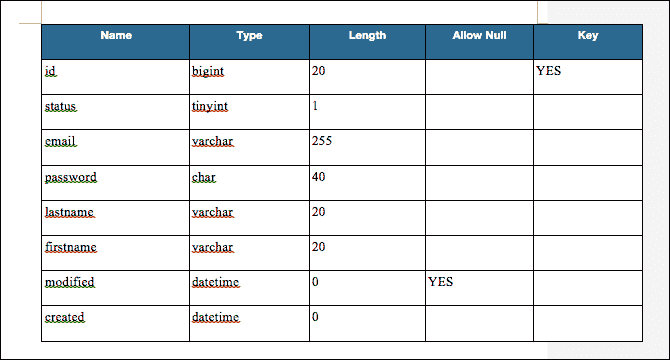
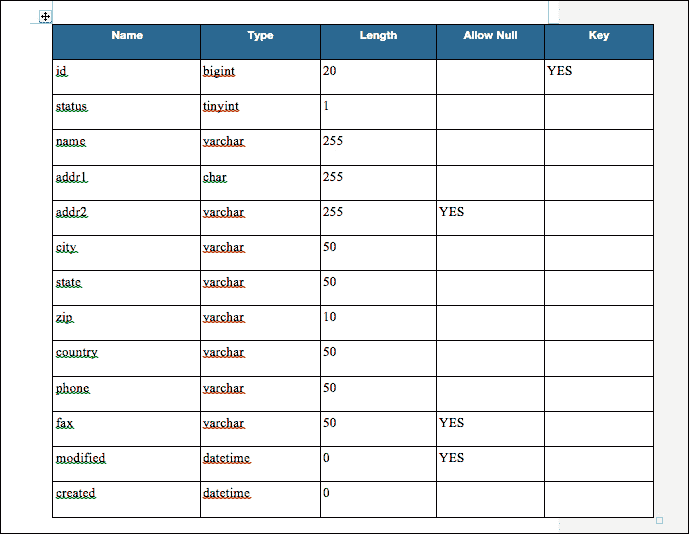
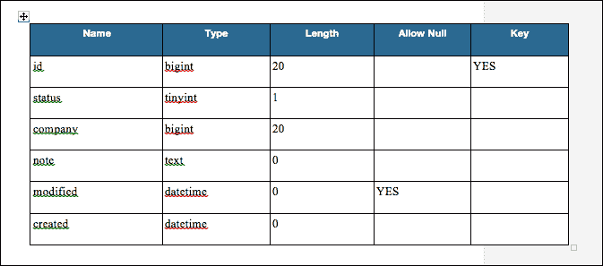
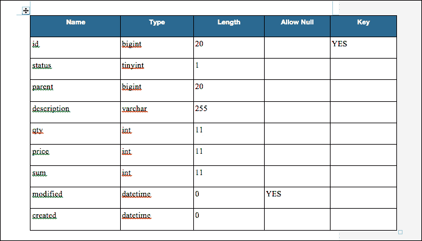
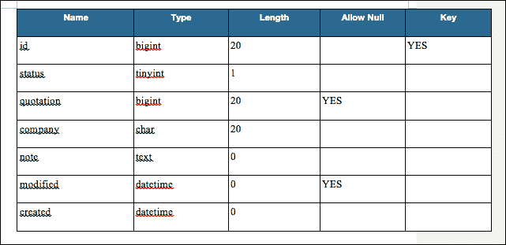
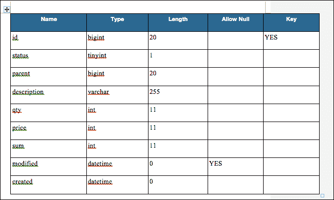

# 第一章：数据结构

本书将逐步引导您通过使用现有数据库中的信息，在 Ext JS 中构建一个清晰且用户友好的销售管理数据库的过程。

本书面向具有 MySQL 操作知识的中级 Ext JS 开发者，他们希望提高编程技能并创建更高级的应用程序。

完成的应用程序将为您提供可工作的销售管理数据库。然而，本书的真正价值在于创建应用程序的动手过程，以及将本书中介绍的功能轻松转移到您自己的未来应用程序中的机会。

在构建此应用程序时，我们将关注的突出功能如下：

+   **支持历史记录的返回按钮功能**：我们将自定义 Ext JS 函数，创建一种更轻量级的方法，在单页面上滚动前后，同时保持页面不变。

+   **更高效的屏幕管理**：我们将学习如何通过简单地注册屏幕和命名约定来帮助您减少屏幕切换过程；这意味着您可以更多地关注每个屏幕背后的实现。此外，只需遵循这种架构，与历史记录的交互也将变得更加容易。

+   **使用 Ext.Direct 的通信方法**：Ext.Direct 与 Ext 应用程序有紧密的亲和力，这使得连接、维护更加容易，并且消除了客户端需要更改 URL 的需求。此外，如果您使用 Ext.Direct，您还可以减少对服务器端的压力，因为它将多个服务器请求合并为一个请求。

+   **带有图表的数据显示方法**：在 Ext JS 中，通过简单地调整存储和设置在网格中显示的数据结构，我们可以在图表中以图形方式显示数据。

本章将为您提供数据库的基本构建块。在本章中，您将编写 SQL 代码并在 MySQL 中创建表。

# 应用程序的结构 – 用户、客户、报价、报价单、账单和账单

首先，让我们看看我们即将构建的应用程序的结构。这是一个为用户注册客户、发送订单报价以及最终向客户开具账单而构建的销售管理应用程序。

用户可以将数据输入到“客户”表中。客户可以是个人或公司，无论哪种方式，每个客户都会收到一个唯一的 ID。

“报价”表代表发送给客户的最终报价。报价表包含报价中订购的个别项目。

账单是发送给客户的最终发票。与“报价”表类似，“账单”表指的是客户订购的个别项目。

# 用户

用户数据是一个简单的结构，用于登录系统。它有一个电子邮件地址、密码和姓名。

不要删除用户数据，并使用标志进行物理管理。它与其他数据结构通过联合所有权连接，记录创建日期和时间以及更新日期和时间。

当我们设计一个基于 MySQL 的模型表时，它看起来类似于以下表格。在执行 MD5 之后，我们执行 SHA1。然后，我们将有 40 个字符可以存储密码。



# 客户

客户数据包含公司或客户的名称和地址。它允许`引用`和`账单`表执行此数据的关联并使用这些数据。作为主数据，目前用户界面中不可用添加和删除。然而，随着您开发应用程序，您最终应该能够编辑这些数据。

下面的截图显示了注册客户的输入字段。`名称`列下的部分是需要为每个客户填写的字段。`类型`列指的是要输入的数据类型，如文字、数字和日期。`键`列允许在不同表之间引用数据。



# 引用和引用

`引用`和`引用`表之间存在 1-N 关系。

在`引用`中，您可以保存文档的基本信息，而在`引用`中，您可以存储每个正在订购的项目。

## 引用

下面的截图显示了`引用`所需的字段。表格标题与之前解释的`客户`表中的相同，因此让我们相应地填写。



## 引用

这与之前相同，所以让我们继续填写。父级指的是`引用`（单个项目）表所属的整体报价。



# 账单和账单

`账单`表几乎与`引用`表相同。然而，`账单`表有时可以包含相关联的`引用`表的 ID。

## 账单

下面的截图显示了`账单`表：



## 账单

与`引用`类似，在`账单`中，您可以存储每个已订购的项目：



# 创建和处理客户结构表

我们将使用 MySQL，数据库字符集设置为`utf8`，校对设置为`utf8_bin`。当 SQL 描述我们之前定义的详细信息时，每个组件如下。

## 用户表

我们之前准备的`用户`表在执行以下代码后即可投入使用。重要的是要记住在`id`列中包含`AUTO_INCREMENT`；否则，您必须手动输入：

```js
SET NAMES utf8;
SET FOREIGN_KEY_CHECKS = 0;

DROP TABLE IF EXISTS 'users';
CREATE TABLE 'users' (
  'id' bigint(20) NOT NULL AUTO_INCREMENT,
  'status' tinyint(1) NOT NULL DEFAULT '1',
  'email' varchar(255) NOT NULL,
  'passwd' char(40) NOT NULL,
  'lastname' varchar(20) NOT NULL,
  'firstname' varchar(20) NOT NULL,
  'modified' datetime DEFAULT NULL,
  'created' datetime NOT NULL,
  PRIMARY KEY ('id')
) ENGINE=InnoDB DEFAULT CHARSET=utf8 ROW_FORMAT=DYNAMIC;

SET FOREIGN_KEY_CHECKS = 1;
```

## 客户表

执行以下代码后，`客户`表即可投入使用：

```js
SET NAMES utf8;
SET FOREIGN_KEY_CHECKS = 0;

DROP TABLE IF EXISTS 'customers';
CREATE TABLE 'customers' (
  'id' bigint(20) NOT NULL AUTO_INCREMENT,
  'status' tinyint(1) NOT NULL DEFAULT '1',
  'name' varchar(255) NOT NULL,
  'addr1' varchar(255) NOT NULL,
  'addr2' varchar(255) DEFAULT NULL,
  'city' varchar(50) NOT NULL,
  'state' varchar(50) NOT NULL,
  'zip' varchar(10) NOT NULL,
  'country' varchar(50) NOT NULL,
  'phone' varchar(50) NOT NULL,
  'fax' varchar(50) DEFAULT NULL,
  'modified' datetime DEFAULT NULL,
  'created' datetime NOT NULL,
  PRIMARY KEY ('id')
) ENGINE=InnoDB DEFAULT CHARSET=utf8 ROW_FORMAT=DYNAMIC;

SET FOREIGN_KEY_CHECKS = 1;
```

这是创建一组初始表的基石，这些表可以稍后填充数据。

## 引用表

这是 `报价` 表的对应代码。与 `Customer` 表一样，此代码片段将为我们的表奠定基础。

```js
SET NAMES utf8;
SET FOREIGN_KEY_CHECKS = 0;

DROP TABLE IF EXISTS 'quotation';
CREATE TABLE 'quotation' (
  'id' bigint(20) NOT NULL AUTO_INCREMENT,
  'status' tinyint(1) NOT NULL DEFAULT '1',
  'customer' bigint(20) NOT NULL,
  'note' text NOT NULL,
  'modified' datetime DEFAULT NULL,
  'created' datetime NOT NULL,
  PRIMARY KEY ('id')
) ENGINE=InnoDB DEFAULT CHARSET=utf8 ROW_FORMAT=DYNAMIC;

DROP TABLE IF EXISTS 'quotations';
CREATE TABLE 'quotations' (
  'id' bigint(20) NOT NULL AUTO_INCREMENT,
  'status' tinyint(1) NOT NULL DEFAULT '1',
  'parent' bigint(20) NOT NULL,
  'description' varchar(255) NOT NULL,
  'qty' int(11) NOT NULL,
  'price' int(11) NOT NULL,
  'sum' int(11) NOT NULL,
  'modified' datetime DEFAULT NULL,
  'created' datetime NOT NULL,
  PRIMARY KEY ('id'),
  KEY 'parent' ('parent')
) ENGINE=InnoDB DEFAULT CHARSET=utf8 ROW_FORMAT=DYNAMIC;

SET FOREIGN_KEY_CHECKS = 1;
```

## 账单表

与前两个代码片段类似，以下 `Bill` 表的代码与 `报价` 表非常相似，因此可以在 `04_bill_table.sql` 下的源文件中找到。

这些是我们数据库所需的所有表。现在，在每个操作创建后，让我们继续进行测试。

# 创建每个操作并测试

因为我们在后期阶段将使用 PHP，所以现在让我们为每个操作做好准备。在这里，我们将插入一些临时数据。

记得检查获取和更新操作是否正常工作。

## 用户认证

这些是一些你可以用来开发数据库的 SQL 代码。

你可以通过输入电子邮件地址和密码来查找用户。如果计数为 `1`，则可以假设操作成功。

为了提高密码安全性，在执行 MD5 加密后，你应该将密码存储为经过 SHA1 处理后的 40 个字符的字符串。

```js
SELECT
    COUNT(id) as auth
FROM
    users
WHERE
    users.email = 'extkazuhiro@xenophy.com'
AND
    users.passwd = SHA1(MD5('password'))
AND
    users.status = 1;
```

## 选择用户列表

这用于当你想要收集用于网格中的数据时。请注意，我们不会使用 `PagingToolbar` 执行限制操作：

```js
SELECT
    users.id,
    users.email,
    users.lastname,
    users.firstname
FROM
    users
WHERE
    users.status = 1;
```

## 添加用户

要添加用户，将当前时间放入 `created` 和 `modified`：

```js
INSERT INTO users (
    email,
    passwd,
    lastname,
    firstname,
    modified,
    created
) VALUES (
    'someone@xenophy.com',
    SHA1(MD5('password')),
    'Kotsutsumi',
    'Kazuhiro',
    NOW(),
    NOW()
);
```

## 更新用户信息

每次修改文件时，应将其设置为 `NOW()` 以用作时间戳。其他字段应根据需要更新。

```js
UPDATE
    users
SET
    email='extkazuhiro@xenophy.com',
    passwd=SHA1(MD5('password')),
    lastname='Kotsutsumi',
    firstname='Kazuhiro',
    modified=NOW()
WHERE
    id=1
```

## 删除用户

从此系统中删除不是永久删除用户数据的硬删除。相反，我们将使用软删除，即删除后用户数据不再显示但仍然保留在系统中。因此，请注意我们将使用 `UPDATE` 而不是 `DELETE`。在以下代码中，`status=9` 表示用户已被删除但未显示。（`status=1` 将表示用户是活跃的）。

```js
UPDATE
    users
SET
    status=9
WHERE
    id=1
```

# 客户表

虽然 `Add`、`Update` 和 `Delete` 是必要的操作，但我们将在后面的章节中介绍这些操作，所以现在我们可以省略它们。

## 客户信息列表

这里我们正在准备 SQL 代码，以便稍后提取有关客户的信息：

```js
SELECT
    customers.id,
    customers.name,
    customers.addr1,
    customers.addr2,
    customers.city,
    customers.state,
    customers.zip,
    customers.country,
    customers.phone,
    customers.fax
FROM
    customers
WHERE
    customers.status = 1;
```

## 选择报价列表

接下来是选择 `报价` 列表的代码。这与我们看到的客户信息列表类似。对于代码，请参阅 `11_s_electing_quotation_list.sql` 下的源文件。

## 项目

项目代码将从数据库中选择报价项。这将选择 `quotations.status` 为 `1` 且 `quotation.parent` 为 `1` 的项：

```js
SELECT quotations.description, 
  quotations.qty, 
  quotations.price, 
  quotations.sum
FROM
  quotations
WHERE
  quotations.'status' = 1
AND
  quotations.parent = 1
```

由于这与 `Customers` 类似，你现在可以省略 `Add`、`Update` 和 `Delete`。

# 账单表

同样，现在让我们省略 `Add`、`Update` 和 `Delete`，因为 `Bill` 表与之前的类似。

一旦引用被接受，就会产生账单，这一点说得简单明了。因此，在我们的数据结构中，`引用`和`账单`是相关的。唯一的区别是`账单`包含额外的`引用`ID，以在两者之间建立联系。

此外，记住客户信息列表几乎与报价列表相同。

# 摘要

在本章中，我们定义了本书中将使用的数据库结构。

你可能有自己的数据库，你希望在 Ext JS 中展示。这只是一个我们可以在接下来的章节中构建的示例数据库。

在下一章中，我们将开始构建整个应用程序的过程。别担心，我们会解释每一步。
