# 第二章. 应用程序设计规划

在本章中，我们将介绍 Sencha Cmd 的同时设置项目的开发环境。

在本章中，你将学习如何：

+   设计一个简单的应用程序

+   优化 Ajax 请求以使用 Ext Direct 和`Ext.util.History`通过 URL 控制屏幕

# 设置 Sencha Cmd 和本地开发环境

通过使用 Sencha Cmd 设置本地开发环境，最终部署应用程序时，Sencha Cmd 将仅选择使用的组件。因此，这将优化最终应用程序。

使用 Sencha Cmd，你可以运行 Sencha Touch 的原生包，包括脚手架和构建主题。让我们开始使用 Sencha Cmd 生成你的项目。

1.  安装可在[`www.oracle.com/technetwork/java/javase/downloads/index.html`](http://www.oracle.com/technetwork/java/javase/downloads/index.html)或 JRE 上找到的最新 JAVA 运行环境。

1.  在[`compass-style.org/`](http://compass-style.org/)安装 Compass。

1.  安装可在[`www.sencha.com/products/sencha-cmd/download`](http://www.sencha.com/products/sencha-cmd/download)找到的 Sencha Cmd。

1.  下载可在[`www.sencha.com/products/extjs/download/`](http://www.sencha.com/products/extjs/download/)找到的 Ext JS SDK。

1.  提取 Ext JS SDK 并将其定位在你选择的本地目录中。例如，你可以创建一个名为`ext`的顶级目录。

将创建如以下截图所示的目录结构。这次，我们将使用 Ext JS 4.2.2 GPL。

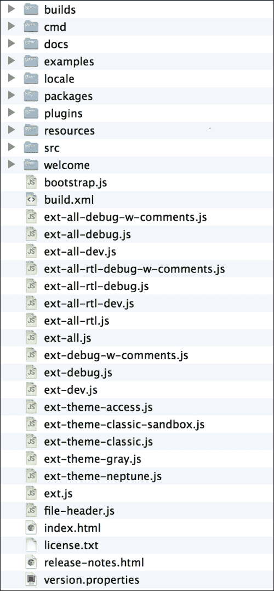

示例在 Mac OS X 上。安装后，Sencha Cmd 位于以下路径，`~/bin/Sencha/Cmd/4.0.0.203/`。

对于 Windows，Sencha Cmd 位于以下路径，`C:/Users/(你的用户名)/bin`。

如果路径设置正确，你应该能够在 Sencha 下执行以下命令，并且以下列表中的选项、类别和命令应该出现在你的屏幕上。

```js
# sencha
Sencha Cmd v4.0.0.203

```

通过在 Sencha Cmd 中使用以下定义的组合，我们可以使用 Sencha Cmd。

例如，要创建一个项目，使用我们提供的选项和类别，我们可以输入，`sencha -sdk [/sdk/path] generate app App [/project/path]`。

要构建一个项目，我们可以使用类别和命令进入：`sencha app build`。

## 选项

这里有一些你可以使用的选项：

+   `* --debug, -d -` : 这将设置日志级别为更高的详细程度

+   `* --plain, -p -` : 这将启用纯日志输出（无高亮）

+   `* --quiet, -q -` : 这将设置日志级别为仅警告和错误

+   `* --sdk-path, -s -` : 这将设置目标框架的路径

## 类别

这里有一些你可以使用的类别：

+   `*app -` : 使用这个，我们可以执行各种应用程序构建过程

+   `*compile -` : 这允许我们将源代码编译成连接输出和元数据

+   `*fs -` : 这是一组用于处理文件的实用操作

+   `*generate -` : 这将生成模型、控制器等，或者整个应用程序

+   `*manifest -` : 这将提取类元数据

+   `*package -` : 这将为 Sencha Touch 应用程序打包，以便在原生应用商店中发布

+   `*theme -` : 这将从给定的 HTML 页面生成一组主题图像

## 命令

这里有一些你可以使用的命令：

+   `* ant -` : 这将调用 Ant 并将一些有用的属性传回 Sencha Command

+   `* build -` : 这将从 JSB3 文件构建一个项目。

+   `* config -` : 这将加载一个配置文件或设置一个配置属性

+   `* help -` : 这将显示命令的帮助信息

+   `* js -` : 这将执行任意 JavaScript 文件（s）

+   `* which -` : 这将显示当前 Sencha Cmd 版本的路径

## 使用 Sencha Cmd 创建项目

首先，让我们使用 Sencha Cmd 生成一个项目。首先，将当前目录移动到项目目录中，并执行以下命令：

```js
# sencha -sdk ./ext generate app MyApp ./

```

应该出现以下日志。它非常长，所以这是一个简化的版本，即日志的开始和结束部分：

```js
[INF]    init-properties:
[INF]    init-sencha-command:
[INF]    init:
.
.
.
[INF]    app-refresh:
[INF]    -after-generate-app:
[INF]    generate-app:
```

然后，将生成以下目录：

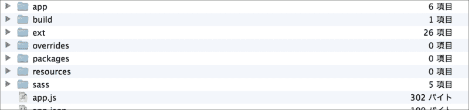

让我们用浏览器查看它；它应该如下所示。无论如何，通过 Web 服务器显示它。

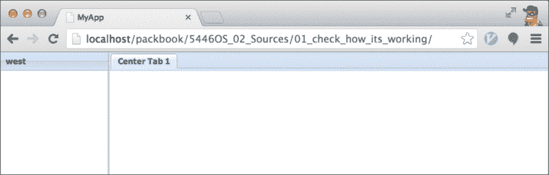

通过执行命令，Sencha Cmd 创建一个临时的视图和控制台，以便快速启动整个项目。我们可以根据我们自己的应用程序对其进行更改或添加。

## 创建组件测试

Sencha Cmd 生成了一个临时应用程序。然而，你不应该立即对其进行自定义。在你这样做之前，让我们做一个**组件测试**（**CT**），以方便开发。一般来说，它测试源代码和组件之间的关系。CT 在视口中以及单独的测试视图中显示正在测试的源代码，而不移动整个源代码。通过使用 CT，开发团队可以同时平滑地构建应用程序，并在开发过程中早期发现问题。

## 查看其工作情况

首先，你可以检查自动生成的应用程序的工作情况，并查看 `index.html` 的详细信息（源文件：`01_check_how_its_working/index.html`）。

唯一可以读取的 CSS 文件是 `ext/packages/ext-theme-neptune/build/resources/ext-theme-neptune-all-debug.css`。至于 JS 文件，以下三个被读取。

+   `ext/ext-dev.js`

+   `bootstrap.js`

+   `app/app.js`

要运行 `app.js`，你需要 `ext-dev.js` 和 `bootstrap.js`。这些对于你的应用程序是必要的，并且其他 Ext JS 文件在 Ext Loader 中动态读取。如下面的截图所示，在 Google Chrome 浏览器开发工具的“网络”标签下，许多文件都是动态读取的：

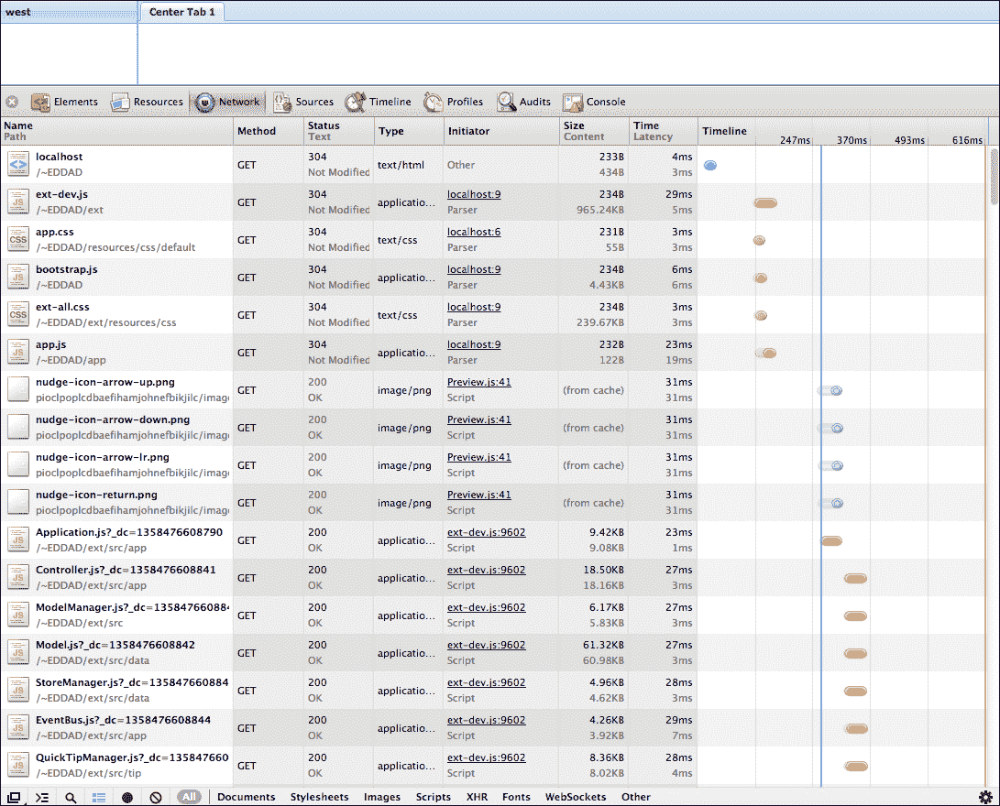

这次我们将使用 Ext JS Neptune 主题来构建应用程序。

当你创建一个新的应用程序时，默认主题是 `ext-theme-classic`。让我们将其更改为 `ext-theme-neptune`。

要修改的目标文件如下：

`.sencha/app/sencha.cfg – L32`

```js
# The name of the package containing the theme scss for the app
app.theme=ext-theme-classic

```

将上一行更改为以下内容：

```js
# The name of the package containing the theme scss for the app
app.theme=ext-theme-neptune

```

在进行此更改后继续到下一节，主题应更改为以下截图所示：

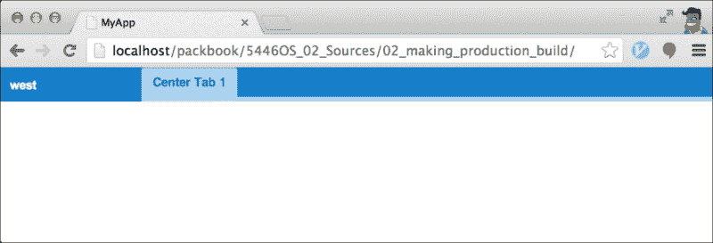

## 制作生产构建

当你使用 Ext Loader 时，在屏幕显示之前需要花费很多时间。随着应用程序规模的增长和文件数量的增加，它将变得更慢。这可能对于产品来说太慢了。

但不必担心，你手头已经有了解决方案——使用 Sencha Cmd 构建。首先，将当前项目移动到项目目录，并执行以下命令：

```js
# sencha app build

```

执行以下命令时将创建以下目录：

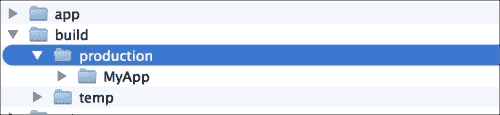

在这里生成的 `app.js` 文件是一个压缩的 JavaScript 文件，它将你编写的代码与 Ext JS SDK 的代码合并。启用 `app.js` 是有效的，因为代码已经被读取，Ext Loader 不需要再次读取代码，从而提高速度。此 `app.js` 文件是在压缩状态下生成的，去除了不必要的空行。

`./build/production/MyApp/` 目录已生成并存储。让我们用浏览器检查生成的生产应用程序。

如果你想要调试，压缩 `app.js` 是一个非常糟糕的主意。相反，你应该执行以下命令进行测试：

```js
# sencha app build testing

```

`testing` 目录随后在 `production` 目录中创建，如下截图所示。此目录下创建的 `app.js` 文件未压缩。

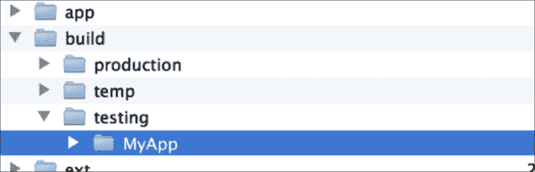

## 单个视图中的 CT

如果你按常规方式执行 CT，你必须同时测试所有组件。然而，如果我们将 CT 拆分为单个视图，我们可以在各自的 HTML 中单独测试每个组件。

首先，我们创建一个名为 `ct` 的目录，并编写组件列表的 HTML。这仅仅是源文件中的 `index.html` 代码：`03_ct_in_individual_views/ct/index.html`。

在这里，你将创建一个标题组件。首先让我们创建其外观。你可以为 `header` 组件创建一个 `ct` 目录，如下截图所示：

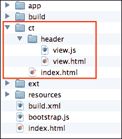

在 `header` 文件中创建 `view.html` 和 `view.js`。代码如下：

```js
view.html
<html>
<head>
<meta charset="utf-8" />
<title>[View]Header - Component Test</title>
<link rel="stylesheet" href="../../bootstrap.css" type="text/css">
<script language="JavaScript" type="text/javascript" src="img/ext-all.js"></script>
</head>
<body>
<script type="text/javascript" src="img/view.js"></script>
</body>
</html>

view.js
Ext.Loader.setConfig({
    enabled: true,
    paths: {
        MyApp: '../../app/'
    }
});

Ext.onReady(function() {
    Ext.create('MyApp.view.Header', {
        renderTo: Ext.getBody()
    });
});
```

## 视图组件

让我们创建 `MyApp.view.Header` 的标题组件。你应该在 `app/view` 目录下创建 `Header.js` 并创建 `Header` 组件（源文件：`04_view_component/app/view/Header.js`）。

```js
Ext.define('MyApp.view.Header', {
    extend: 'MyApp.toolbar.Toolbar',
    alias: 'widget.myapp-header',
    height: 35,
    items: [{
        text: 'MyApp',
        action: 'dashboard'
    }, '->', {
        text: 'MyAccount',
        action: 'myaccount'
    }, {
        text: 'Log Out',
        action: 'logout'
    }]
});
```

当你创建 `MyApp.toolbar.Toolbar` 类时，`MyApp` 中的面板组件将工作。因此，在 `app` 目录下（源文件：`04_view_component/app/toolbar/Toolbar.js`）创建一个面板目录。

```js
Ext.define('MyApp.toolbar.Toolbar', {
    extend: 'Ext.toolbar.Toolbar'
});
```

当你用浏览器显示它时，将出现以下截图：


在这一点上，即使你点击按钮，也不会发生任何事情，因为你仍然需要实现事件处理器；但别担心，我们很快就会做到这一点。

## 添加控制器

外观已经制作好了。所以现在，让我们添加一个控制器。为此，在`app/controller`目录下创建`Abstract.js`，然后创建`MyApp.controller.Abstract`类（源文件：`05_adding_controller/app/controller/Abstract.js`）。

```js
Ext.define('MyApp.controller.Abstract', {
    extend: 'Ext.app.Controller'
});
```

添加控制器非常简单，它只是扩展到`Ext.app.Controller`。这个类将实现所有控制器将创建的常见功能。所以，让我们为标题创建一个控制器。在同一个目录下创建`Header.js`，并定义为`MyApp.controller.Header`。在以下代码中，从我们之前创建的`MyApp.controller.Abstract`类中实现了`init`方法（源文件：`05_adding_controller/app/controller/Header.js`）。

```js
Ext.define('MyApp.controller.Header', {
    extend: 'MyApp.controller.Abstract',
    init: function() {
        var me = this;
        me.control({
            'myapp-header [action=dashboard]': {
                click: function() {
                    console.log('dashboard');
                }
            },
            'myapp-header [action=myaccount]': {
                click: function () {
                    console.log('myaccount');
                }
            },
            'myapp-header [action=logout]': {
                click: function() {
                    console.log('logout');
                }
            }
        });
    }
});
```

以下是从上一段代码中获取的组件查询。这些查询获取位于标题中的按钮。有了这个，你现在已经完成了控制器的创建。

```js
'myapp-header [action=dashboard]'
'myapp-header [action=myaccount]'
'myapp-header [action=logout]'
```

应该创建一个如下所示的文件：

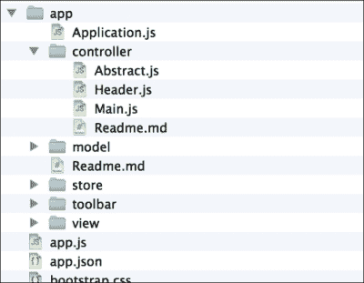

让我们操作你成功创建的控制器。在目录中，你创建了`view.html`和`view.js`的地方，你现在应该创建`app.html`和`app.js`。`app.html`的 CT 大部分与`view.html`相同。你可以在这里看到源代码：`06_app_test/ct/header/app.html`。

对于`app.js`，请参阅以下代码（源文件：`06_app_test/ct/header/app.js`）。

```js
Ext.application({
    autoCreateViewport: false,
    name: 'MyApp',
    appFolder: '../../app',
    controllers: [
        'Header'
    ],
    launch: function() {
        var panel = Ext.create('MyApp.view.Header', {
            renderTo: Ext.getBody()
        });
        Ext.util.Observable.capture(panel, function() {
            console.log(arguments);
        });
    }
});
```

你应该在`ct`目录中为`app.html`添加一个链接到`index.html`。在`app.js`中调用`Ext.application`并仅启动标题应用程序。因为`autoCreateViewport`的默认值设置为`true`，你应该将其设置为`false`。这是因为`Viewport`对于这个测试是不必要的。

第二，将控制器中的标题设置为读取`MyApp.controller.Header`。你应该设置函数以创建视图。`Ext.util.Observable.capture`调用捕获了在第一个参数中设置的对象中触发的事件。

我们可以通过视觉确认，当点击按钮时，事件会做出反应。

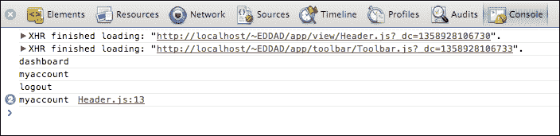

我们只是创建了一个没有控制器的视图。原因是如果我们在这个阶段在控制器和视图之间建立关系，这将使测试视图变得非常困难。

我们创建了包含控制器逻辑的`app.html`。我们需要`app.html`以便能够同时测试视图和控制器。

此外，为了避免不正确的代码直接引用对象，将每个可以在 CT 中组合并稍后在视图中开发的组件和屏幕分开。

现在，让我们学习按顺序创建组件和 CT。

## 创建视图

我们需要创建应用程序的外观。您已经创建了头部。让我们将应用程序的导航菜单放在屏幕的左侧。定位您之前创建的头部在屏幕顶部。将中间区域但位于右侧的屏幕命名为屏幕。将屏幕放在这个中间区域。

屏幕分为四个部分：

+   仪表板

+   MyAccount

+   Quotation

+   Bill

将这四个部分连接起来，形成一个如以下图表所示的粗略视图结构：

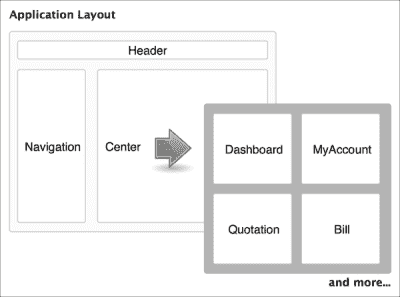

## 导航

让我们创建导航部分。该组件扩展了树面板。通过使用树面板，可以由服务器处理显示菜单选项的流程，而不是手动输入菜单选项。将菜单选项分组的过程可以简化。

树面板需要一个树存储。所以现在让我们创建它（源文件：`07_creating_views/app/store/Navigation.js`）。

```js
Ext.define('MyApp.store.Navigation', {
    extend: 'Ext.data.TreeStore',
    storeId: 'Navigation',
    root: {
        expanded: true,
        children: [{
            text: 'Dashboard',
            leaf: true
        }, {
            text: 'Quotation',
            leaf: true
        }, {
            text: 'Bill',
            leaf: true
        }, {
            text: 'MyAccount',
            leaf: true
        }]
    }
});
```

现在已经创建了一个存储，您可以定义树面板（源文件：`07_creating_views/app/view/Navigation.js`）。

```js
Ext.define('MyApp.view.Navigation', {
    extend: 'Ext.tree.Panel',
    alias: 'widget.myapp-navigation',
    title: 'Navigation',
    store: 'Navigation',
    rootVisible: false,
    animate: false
});
```

现在，让我们创建一个 CT 来检查我们创建的内容。`07_creating_views/ct/navigation/view.html` 的代码与之前的 `view.html` 代码非常相似，所以如果您想查看此代码，请参阅源文件。以下代码是 `view.js`（源文件：`07_creating_views/ct/navigation/view.js`）。

```js
Ext.onReady(function() {
    Ext.create('MyApp.store.Navigation', {
        storeId: 'Navigation'
    });
    Ext.create('MyApp.view.Navigation', {

    });
});
```

我们之前创建了一个存储，因为它是显示导航视图所必需的。当我们在浏览器中查看时，**Navigation** 视图显示如下截图所示：

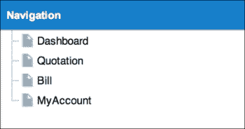

让我们以同样的方式创建剩余的组件。

### 仪表板

我们想要创建一个仪表板的面板（从现在起我们将创建许多类似的面板）。因此，应用程序将在 `MyApp.panel.Screen` 抽象类中创建。`MyApp.panel.Screen` 抽象类是整个应用程序的基本模具（源文件：`07_creating_views/app/panel/Screen.js`）。

```js
Ext.define('MyApp.panel.Screen', {
    extend: 'Ext.panel.Panel',
    initComponent: function() {
        var me = this;
        me.callParent(arguments);
    }
});
```

我们能够创建抽象类。现在，让我们创建一个继承自该抽象类的仪表板类（源文件：`07_creating_views/app/view/DashBoard.js`）。

```js
Ext.define('MyApp.view.DashBoard', {
    extend: 'MyApp.panel.Screen',
    alias: 'widget.myapp-dashboard'
});
```

现在，准备 CT 来检查外观。`07_creating_views/ct/dashboard/view.html` 和 `07_creating_views/ct/dashboard/view.js` 都与 `ct/header` 类似，所以请参考源文件中的代码。

### MyAccount

让我们创建用户的个人账户页面。让我们称它为“MyAccount”，并以我们创建仪表板相同的方式创建它。除了别名属性和标题属性外，它与仪表板完全相同。有关代码，请参阅源文件：`07_creating_views/app/view/MyAccount.js`。

### 报价和账单

继续以同样的方式创建报价和账单。同样，除了别名属性和标题属性外，它与仪表板相同。请参阅源文件中的代码：

+   `07_creating_views/app/view/Quotation.js`

+   `07_creating_views/app/view/Bill.js`

## 视口

让我们在视口中组合我们迄今为止制作的组件。修改由 Sencha Cmd 自动生成的文件。尽管我们可以通过所有方式创建 CT，但有了视口，CT 就不再必要了。HTML 本身与 CT 索引相同。

首先，必须修改`app/Application.js`以使用导航存储（源文件：`08_create_viewport/app/Application.js`）。

```js
Ext.define('MyApp.Application', {

    stores: [
        'Navigation'
    ]
});
```

对于在视口中设置的`xtype`类，在读取源代码之前必须完成读取。因此，我们将类名添加到`application.js`文件中。

为了反映新添加组件的 CSS，我们将使用 Sencha Cmd 构建应用程序一次。这将确保任何新组件的 CSS 都包含在`sencha app build`中。

通过这种方式，分配给`bootstrap.css`的组件样式将被更新。当我们访问位于文档路由下的`index.html`时，它将显示如下截图。我们制作的文件由 Ext Loader 动态读取。

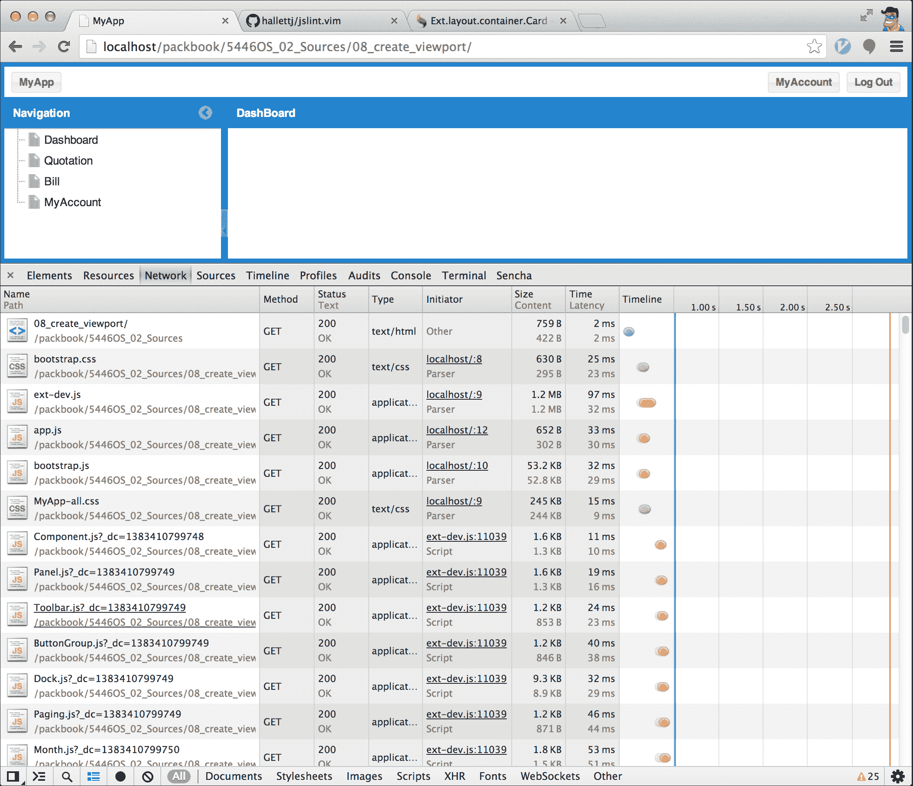

现在视图已经完成！

# 创建控制器

现在，我们将为我们的数据创建控制器。

## Main

通常，每个视图组件都有一个具有相同前缀的对应控制器类。

但我们首先必须处理的控制器是名为 Main 的控制器。这个控制器已经被 Sencha Cmd 自动生成。如果我们需要为整个应用程序添加更多处理或逻辑，我们应该实现这个类。通常，`view`类和控制器类名称匹配，但这是一个特殊情况，它们不匹配，因为 Sencha Cmd 生成了 Main 类。所以，最好是让它保持原样，不要更改名称。

对于`app/controller/Main.js`代码，请参阅源文件：`09_create_controller\app\controller`。

虽然我们谈了很多关于 Main 的内容，但我们目前不会使用它。

## 导航

现在，让我们将`hrefTarget`添加到导航存储中的数据（源文件：`09_create_controller/app/store/Navigation.js`）。

```js
Ext.define('MyApp.store.Navigation', {
    …
    root: {
        children: [{
            text: 'Dashboard',
            hrefTarget: '#!/dashboard',
            leaf: true
        }, {
            text: 'Quotation',
            hrefTarget: '#!/quotation',
            leaf: true
        }, {
            text: 'Bill',
            hrefTarget: '#!/bill',
            leaf: true
        }, {
            text: 'MyAccount',
            hrefTarget: '#!/myaccount',
            leaf: true
        }]
    }
});
```

现在，创建一个导航控制器并描述`itemclick`事件处理程序，当选择菜单时捕获事件（源文件：`09_create_controller/app/controller/Navigation.js`）。

```js
Ext.define('MyApp.controller.Navigation', {
    extend: 'MyApp.controller.Abstract',
    init: function() {
        var me = this;
        me.control({
            'myapp-navigation': {
                itemclick: function(row, model) {
                    if (!model.isLeaf()) {
                        if (model.isExpanded()) {
                            model.collapse();
                        } else {
                            model.expand();
                        }
                    } else {
                        if (model.data.hrefTarget) {
                            console.log('select:' + model.data.
                            hrefTarget);
                        }
                    }
                }
            }
        });
    }
});
```

将此添加到`app/Application.js`中，以便在视口中显示时使用。

```js
Ext.define('MyApp.Application', {

    controllers: [
        'Main',
        'Header',
        'Navigation',
        'DashBoard',
        'MyAccount',
        'Quotation',
        'Bill'
    ],

});
```

此外，记住 CT 会从控制器自行准备操作。以下代码将执行 CT 进行导航（源代码：`09_create_controller/ct/navigation/app.js`）。

```js
Ext.application({
    ...
    stores: [
        'Navigation'
    ],
    controllers: [
        'Navigation'
    ],
    launch: function() {
        var panel = Ext.create('MyApp.view.Navigation', {
            width: 300,
            height: 600,
            renderTo: Ext.getBody()
        });
        Ext.util.Observable.capture(panel, function() {
            console.log(arguments);
        });
    }
});
```

当我们执行此操作时，当我们从菜单中选择任何选项时，控制台会显示一条消息。

## 仪表板

让我们继续并创建仪表板的控制器。这里我们不描述任何特殊过程，这只是准备。只需实现以下代码（源文件：`09_create_controller/app/controller/DashBoard.js`）：

```js
Ext.define('MyApp.controller.DashBoard', {
    extend: 'MyApp.controller.Abstract',
    init: function() {
        var me = this;
        me.control({
        });
    }
});
```

## MyAccount

MyAccount 与仪表板相同，只需将 `Dashboard` 替换为 `MyAccount`。对于代码，请参阅源文件：`09_create_controller/app/controller/M` `yAccount.js`。

## 报价和账单

对于报价和账单也是如此。没有特殊处理，只是准备，这和仪表板也相同。对于代码，请参阅以下位置的源文件：

+   `09_create_controller/app/controller/Quotation.js`

+   `09_create_controller/app/controller/Bill.js`

到目前为止，你已经创建了多个文件。随着它们的创建，它们按照以下截图所示填充了目录：

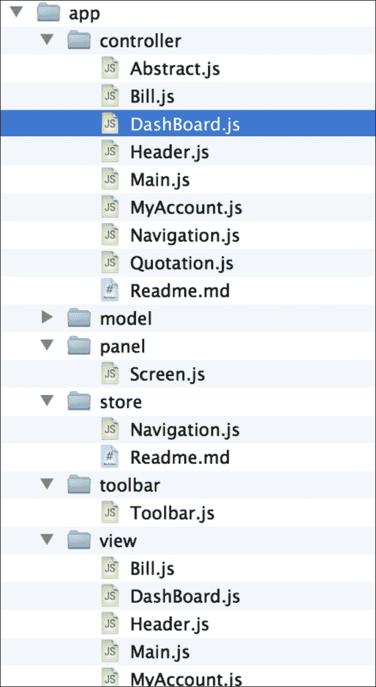

# 使用 Ext.util.History 直接访问屏幕

`Ext.util.History` 管理历史记录。当页面发生变化时，应用程序会捕捉到这个变化，然后 `Ext.util.History` 触发一个事件。使用这个特性，我们可以控制应用程序中的操作。例如，通过使用 `Ext.util.History`，每次访问应用程序时都会显示仪表板 URL。

有时，当用户在 URL 中输入错误的哈希值时，应用程序将难以找到页面。然而，使用 `Ext.util.History`，它会跳转到开发者指定的屏幕。例如，当我们实现 `Ext.util.History` 时，用户可以直接访问报价页面，而不会出现异常屏幕行为。使用 `Ext.util.History` 还允许我们将 URL 附带到电子邮件中，以便直接访问文档。

首先，您需要创建 `MyApp.util.History` 类。当您看到它时，您可能会认为它是一个抽象类，实际上并非如此。`MyApp.util.History` 是一个用于在我们的应用程序中使用 `Ext.util.History` 集成 URL 控制的类。在这里要小心不要出错，否则 `MyApp.util.History` 将无法工作。`Ext.util.History` 类是一个单例类，`MyApp.util.History` 也会创建一个单例类。首先，让我们创建 `MyApp.util.History` 类。它非常简单（源文件：`10_util_history/app/util/History.js`）。

```js
Ext.define('MyApp.util.History', {
    singleton: true,
    uses: ['Ext.util.History'],
    controllers: {},
    init: ... (implement)
    initNavigate: ... (implement)
    navigate: ... (implement)
    parseToken: ... (implement)
    push ... (implement)
    cleanUrl ... (implement)
    back: ... (implement)
    location: ... (implement)
});
```

### 小贴士

**下载示例代码**

您可以从您在 [`www.packtpub.com`](http://www.packtpub.com) 的账户下载您购买的所有 Packt 书籍的示例代码文件。如果您在其他地方购买了这本书，您可以访问 [`www.packtpub.com/support`](http://www.packtpub.com/support) 并注册，以便将文件直接通过电子邮件发送给您。

让我们通过以下列表实现方法：

+   `init`

+   `initNavigate`

+   `navigate`

+   `parseToken`

+   `push`

+   `cleanUrl`

+   `back`

+   `location`

请将它们实现为 `MyApp.util.History` 类的方法（源文件：`10_util_history/app/util/History.js`）。由于实现此列表的代码太长，无法包含在此文本中，因此请参阅源文件以获取代码。

当我们使用`MyApp.util.History`时，我们必须调用`init`方法。我将在稍后描述`init`方法的用法。我们不需要对这些方法进行太多解释，因为这会花费太多时间。重要的是要知道，这些方法对于浏览器导航非常重要。

## 在控制器中添加逻辑

添加`MyApp.util.History`和构造函数到`MyApp.controller.Abstract`（源文件：`11_adding_controller/app/controller/Abstract.js`）。

```js
Ext.define('MyApp.controller.Abstract', {
    extend: 'Ext.app.Controller',
    uses: ['MyApp.util.History'],
    aliasPrefix: 'myapp-',
    constructor: function() {
        var me = this,
            screenName = me.screenName;

        Ext.apply(me, {
            history: MyApp.util.History
        });
        if (screenName) {
            me.history.controllers[screenName] = me;
            me.baseUrl = '#!/' + screenName;
            me.aliasName = me.aliasPrefix + screenName;
        }
        me.callParent(arguments);
    },
    loadIndex: function(url) {
        var me = this, url = url || me.baseUrl;
        if (url.substr(0, 2) !== '#!') {
            url = me.baseUrl + '/' + url;
        }
        me.history.push(url, {
            navigate: true,
            callback: function() {
                var self = Ext.ComponentQuery.query(me.aliasName)[0];
                self.fireEvent('myapp-show', self);
            }
        });
    },
    init: function() {
        var me = this, o = {};
        o[me.aliasName] = {
            'myapp-show': me.onShow,
            'myapp-hide': me.onHide
        };
        me.control(o);
    },
    onShow: function() {
        // Nothing todo
    },
    onHide: function() {
        // Nothing todo
    }
});
```

设置一个名为`MyApp.util.History.init`的匿名函数，这是我们之前制作的，并初始化它以启动。在参数中指定要使用的屏幕序列。指定源文件（`11_adding_controller/app/Application.js`）。

```js
Ext.define('MyApp.Application', {

    stores: [
        'Navigation'
    ],

    screens: [
        'dashboard',
        'myaccount',
        'quotation',
        'bill'
    ],
    launch: function() {
        MyApp.util.History.init({
            screens: this.screens
        });
    }
});
```

之后，将`screenName`属性添加到每个类中（源文件：`11_adding_controller/app/controller/DashBoard.js`）。

```js
Ext.define('MyApp.controller.DashBoard', {
    extend: 'MyApp.controller.Abstract',
    screenName: 'dashboard',

});
```

与仪表板相同，我们将为 MyAccount、报价和账单添加一个`screenName`属性。请检查源文件以获取代码：

+   `11_adding_controller/app/controller/MyAccount.js`

+   `11_adding_controller/app/controller/Quotation.js`

+   `11_adding_controller/app/controller/Bill.js`

修复导航控制器。我们应该通过删除控制台并更改`MyApp.util.History`中的调用位置来更改区域设置（源文件：`11_adding_controller/app/controller/Navigation.js`）。

```js
Ext.define('MyApp.controller.Navigation', {
    extend: 'MyApp.controller.Abstract',
    init: function() {
        var me = this;
        me.control({
            'myapp-navigation': {
                itemclick: function(row, model) {
                    …
                        if (model.data.hrefTarget) {
                            console.log('select:' + model.data.                 
                            hrefTarget);
                            me.history.location(model.data.
                            hrefTarget);
                        }

});
```

最后，如果我们对每个视图进行区分，那么获取该视图会变得更容易。所以让我们为每个视图添加`itemId`。首先，让我们添加到仪表板（源文件：`11_adding_controller/app/view/DashBoard.js`）。

```js
Ext.define('MyApp.view.DashBoard', {
    …
    itemId: 'screen-dashboard',
    title: 'DashBoard'
});
```

再次，让我们以相同的方式为 MyAccount、报价和账单添加`itemId`。请检查以下源文件以获取代码：

+   `11_adding_controller/app/view/MyAccount.js`

+   `11_adding_controller/app/view/Quotation.js`

+   `11_adding_controller/app/view/Bill.js`

因此，为了确认，我们在使用`init`设置后点击导航菜单时应该看到带有附加 hash 的 URL。

+   `#!/dashboard`

+   `#!/quotation`

+   `#!/bill`

+   `#!/myaccount`

# 设置 Ext Direct

这是漫长准备列表中的最后一项。大多数 Sencha Ext JS 应用程序都与服务器通信，获取数据和发送消息。在这种情况下，使用`Ext.Ajax`类进行通信非常简单和容易。

然而，这次让我们使用 Ext Direct。Ext Direct 通过包装 Ajax 通信、轮询和执行**远程过程调用**（RPC）来执行。

RPC 是 Ext Direct 的主要功能。然而，由于空间有限，我这里不会详细讨论它。如果您想了解具体细节，请访问 Sencha 主页[`www.sencha.com/products/extjs/extdirect`](http://www.sencha.com/products/extjs/extdirect)。

Ext Direct 简化了与服务器的通信。因此，JavaScript 代码减少了。此外，除了减少浏览器读取和负担外，通信通过组合请求函数自动优化。

当我们通过 Ext Direct 在 10 毫秒的间隔内同时执行 Ajax 通信并传递初始值时，我们可以将发送给路由器的请求合并为一次通信。但对我们来说，这和单独发送每个请求是一样的。

### 小贴士

对于许多开发者来说，这仍然不是常识，尤其是那些不了解 Ext Direct 优点的人。这真是个遗憾，因为这是你应用中一个非常方便的功能。

虽然一开始需要做很多准备工作，但如果在这里学习并保持准备就绪，未来的 Sencha Ext JS 开发将会变得简单，就像一个模板一样。

## 创建 Ext Direct 路由器

首先，我们需要创建路由器并在 PHP 中实现它。实际上，路由器是在一个示例中实现的。我们只需要定位它并使用它来启动。首先，从示例页面复制 PHP 代码。你可以在 Ext SDK 路径中找到示例页面，路径为 `/examples/direct/`。换句话说，就是 `(Ext SDK path)/examples/direct/`。

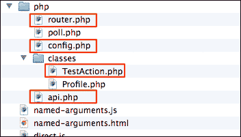

在文档路由中创建一个名为 `php` 的文件夹，并复制之前截图显示的四个文件。在我们复制完文件后，从这个路径删除它们是可以接受的。

编辑 `config.php` 并将方法定义为服务器端显示的类。原始版本中有许多接口，但这次我们只使用一个。所以让我们删除其他的，以保持事情的可管理性（源文件：`12_setup_ext_direct/php/config.php`）。

```js
<?php
$API = array(
    'TestAction' => array(
        'methods' => array(
            'doEcho' => array(
                'len' => 1
            )
        )
    )
);
```

## 创建 Ext Direct 模块

和之前一样，我们将在 `TestAction` 类中只使用 `doEcho` 方法。所以，让我们删除其他方法以保持一切的可管理性（源文件：`12_setup_ext_direct/php/classes/TestAction.php`）。

```js
<?php
class TestAction {
    function doEcho($data) {
        return $data;
    }
}
```

## 将 Ext Direct 应用到客户端应用程序

现在，通过在 `index.html`（源文件：`12_setup_ext_direct/index.html`）中添加以下源代码，将客户端应用程序设置为立即从客户端调用 `TestAction.doEcho`。

```js
    ...
<!-- </x-compile> -->
<script src="img/api.php"></script>
</head>
```

接下来，调用 `addProvider` 并将其设置为在 `Application.js`（源文件：`12_setup_ext_direct/app/Application.js`）服务器端显示的成员。

```js
Ext.require([
    'Ext.direct.*',
    'Ext.data.proxy.Direct',
    'Ext.form.action.DirectSubmit'
]);

Ext.onReady(function() {
    Ext.direct.Manager.addProvider(Ext.app.REMOTING_API);
});

Ext.define('MyApp.Application', {
```

## 测试 Ext Direct

现在我们可以测试它了。当点击注销按钮时，调用 `doEcho` 并确认它是否正常工作。然后，将处理添加到头部控制器中。

使用浏览器检查性能。当我们点击注销按钮时，代码中已经存在的字符串 `message` 将被发送到服务器端。然后我们可以检查 `message` 是否成功返回客户端。如果成功返回，那么一切正常！请参考源文件：`12_setup_ext_direct/app/controller/Header.js`。

# 摘要

干得好！我们现在可以开发应用程序了。虽然过程很漫长，但请记住，它只是完成初始准备所需的时间。

从现在开始，你可以将在这里所做的一切应用到未来。如果你回顾我们刚刚所做的一切并自己理解它，你可以将此作为未来项目的模板，这将使准备阶段变得更加快速和顺畅。

当你准备好了，继续到下一章，我们将开始将数据输入到我们的数据库中。
