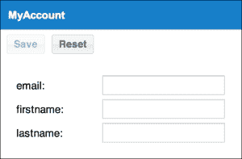
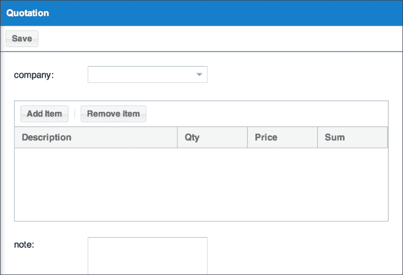

# 第三章：数据输入

欢迎回来。所以，在前两个章节中，我们学习了数据结构，并在 SQL 和 MySQL 中创建了表。然后我们在熟悉 Sencha Cmd 的过程中创建了开发环境。

在本章中，我们将：

+   学习如何创建输入数据的表单

+   通过 Ext Direct 将数据传输到服务器

+   学习如何监控输入状态

+   学习如何使用 Ext Direct 在服务器端验证`MyAccount`表单

# 创建登录页面

让我们从创建这个应用程序的登录页面开始。在这里，我们将使用 PHP 进行简单的实现。我们将创建`login.php`和`logout.php`。然而，我们不会在这里过多地详细介绍登录逻辑，因为这本书的重点是 Ext JS 而不是 PHP。

在 SQL 中创建你将要输入的变量，然后只需从数据库中提取用户信息。

源代码非常长，所以请前往源文件查看`01_making_the_login`文件夹中的`login.php`文件和`01_making_the_login`中的`logout.php`。

使用键`USERINFO`将用户数据存储在会话中。再次，为了能够执行登录检查，将`index.html`改为`index.php`并运行登录检查。除了开头的 PHP 代码外，它与`index.html`相同（源文件：`01_making_the_login/index.php`）：

```js
<?php
session_start();
if(!isset($_SESSION['USERINFO'])) {
  header("Location: ./login.php");
}
?>
<!DOCTYPE HTML>
...
</html>
```

# 创建 MyAccount 表单

现在，让我们构建将要部署到各种屏幕上的表单。首先是`MyAccount`。

将表单面板添加到你构建的临时面板中。不要直接将表单安装到`Screen`面板上——这样做有原因。你将建立列表和详情之间的关系，因此有时屏幕内会有多个面板存在。

恰好`MyAccount`只需要一个屏幕。如果方法数量增加，你可能会需要多个面板。你可能需要一个面板来运行输入验证。但在此阶段很难确定。因此，有必要将**屏幕布局**改为**卡片布局**，这将使处理多个屏幕变得更加容易。

首先，让我们指定屏幕布局为一个卡片布局。在你之前在`view`目录底部创建的`MyAccount.js`脚本中，创建一个`MyAccount`目录并进入它。目录的层次结构将发生变化，因此我们还需要修改类名（源文件：`02_making_the_account_form/app/view/myaccount/MyAccount.js`）：

```js
Ext.define('MyApp.view.myaccount.MyAccount', {
extend: 'MyApp.panel.Screen',
    ....
```

让我们按照以下方式修改类名（源文件：`02_making_the_account_form/app/controller/myaccount/MyAccount.js`）：

```js
Ext.define('MyApp.controller.myaccount.MyAccount', {
extend: 'MyApp.controller.Abstract',
    ....
```

同样，编辑`Quotation`、`Bill`和`Dashboard`的控制器和视图。通过这样做，应用程序现在应该可以工作了。

由于包名已更改，让我们相应地修改`Application.js`控制器设置（源文件：`02_making_the_account_form/app/Application.js`）：

```js
Ext.application({
    ....
    controllers: [
        'Main',
        'Header',
        'Navigation',
        'dashboard.Dashboard',
        'myaccount.MyAccount',
        'quotation.Quotation',
        'bill.Bill'
    ],
    ....
```

此外，视图名称已更改，因此我们也必须修改它（源文件：`02_making_the_account_form/app/view/Viewport.js`）：

```js
Ext.define('MyApp.view.Viewport', {
    ....
    requires:[
        'Ext.panel.Panel',
        'Ext.layout.container.Border',
        'MyApp.view.Header',
        'MyApp.view.Navigation',
        'MyApp.view.dashboard.Dashboard',
        'MyApp.view.myaccount.MyAccount',
        'MyApp.view.quotation.Quotation',
        'MyApp.view.bill.Bill'
    ],
    ....
```

现在有了这个，我们可以自由地创建表单。首先，我们想要创建表单面板并将其放入`MyAccount`，但我们想要对表单面板进行数据抽象。所以，一开始我们就这样做，创建一个简单的继承。

与我们为`app/panel/Screen.js`创建类的方式相同，我们将创建一个继承自`Ext.form.Panel`的类（参考源文件：`02_making_the_account_form/app/form/Panel.js`）。

我们已经创建了继承。让我们创建一个`edit`面板（源文件：`02_making_the_account_form/app/view/myaccount/Edit.js`）：

```js
Ext.define('MyApp.view.myaccount.MyAccount', {
    extend: 'MyApp.form.Panel',
    alias : 'widget.myapp-myaccount-edit',
    itemId: 'screen-myaccount-edit',
    initComponent: function() {
        var me = this;
        Ext.apply(me, {
        });
        me.callParent(arguments);
    }
});
```

我们稍后会在表单内进行实现。首先，让我们嵌入这个面板（源文件：`02_making_the_account_form/app/view/myaccount/MyAccount.js`）：

```js
Ext.define('MyApp.view.myaccount.MyAccount', {
  ...
    requires: [
        'MyApp.view.myaccount.Edit'
    ],
    itemId: 'screen-myaccount',
    title: 'MyAccount',
    layout: 'card',
    items: [{
        xtype: 'myapp-myaccount-edit',
        border: false
    }]
});
```

确保浏览器没有错误。外观没有变化，所以目前可能不太有趣。

目前，它在显示上看起来不错，但你可能已经注意到出现了**CT**错误。这是因为我们之前更改了名称。现在让我们修复它。

`MyAccount`类（`view`和`controller`）的包名已更改，因此请继续修改以下类名（参考源文件）：

`02_making_the_account_form/ct/myaccount/view.js`

`02_making_the_account_form/ct/myaccount/app.js`

与此同时，你也应该修复其他 CT 错误。

现在，让我们开始构建主表单。当你定义类时，你可以使用配置选项来定义它们，但让我们在`initComponent`中使用`Ext.apply`来设置。如果我们使用`initComponent`设置配置，我们可以在创建组件时设置更灵活的行为。

以下代码与**Sencha Architect**生成的代码非常相似（源文件：`02_making_the_account_form/app/view/myaccount/Edit.js`）：

```js
Ext.define('MyApp.view.myaccount.Edit', {
  ...
    initComponent: function() {
        var me = this;
        // Fields
        Ext.apply(me, {
            bodyPadding: 20,
            defaultType: 'textfield',
            items: [{
                fieldLabel: 'email'
           }, {
                fieldLabel: 'firstname'
           }, {
                fieldLabel: 'lastname'
           }]
        });
        // TopToolbar
    Ext.apply(me, {
        tbar: [{
text: 'Save',
action: 'save'
           }, {
            text: 'Reset',
            action: 'reset'
           }]
        });
    me.callParent(arguments);
    }
});
```

如果你运行前面的代码，它将看起来像以下截图：



我们以这种方式创建表单。如果你想到一个更复杂或更有吸引力的表单，可以尝试调整它。你可以在*Sencha Ext samples*上找到更多复杂的布局：[`dev.sencha.com/deploy/ext-4.0.0/examples/#sample-13`](http://dev.sencha.com/deploy/ext-4.0.0/examples/#sample-13)。

目前，我们只看到三个字段：**email:**，**firstname**，和**lastname:**。这些字段通常不会经常修改，但随着我们开发应用程序，可能需要添加更多需要修改的字段。在这种情况下，你可以在`myaccount.Edit`中添加新字段。

# 创建报价表单

让我们继续创建`Quotation`和`Bill`的表单。与之前一样，首先在`Screen`面板中设置卡片布局。

与`view/myaccount/MyAccount.js`中的方式相同，在`Quotation`类中，我们将添加`Edit`和`List`屏幕（源文件：`03_making_the_quotation_form/app/view/quotation/Quotation.js`）：

```js
Ext.define('MyApp.view.quotation.Quotation', {
  ...
  requires: [
        'MyApp.view.quotation.List',
        'MyApp.view.quotation.Edit'
    ],
  ...
items: [{
          xtype: 'myapp-quotation-list',
          border: false
    }, {
          xtype: 'myapp-quotation-edit',
          border: false
    }]
});
```

与之前的情况不同，现在存在两张卡片。这些是`List`和`Edit`。你将在后面的章节中实现`List`。在这里，让我们实现`Edit`。

问题是，如果你不创建一个类，那么`requires`将无法读取它。所以，按照以下方式创建一个`List`类（源文件：`03_making_the_quotation_form/app/view/quotation/List.js`）：

```js
Ext.define('MyApp.view.quotation.List', {
    extend: 'MyApp.form.Panel',
    alias : 'widget.myapp-quotation-list',
    itemId: 'screen-quotation-list',
    initComponent: function() {
      var me = this;
      Ext.apply(me, {
        });
    me.callParent(arguments);
    }
});
```

接下来，让我们创建`Edit`。这是一个相当长的过程，所以让我们将其分解成几个部分，并逐一介绍（源文件：`03_making_the_quotation_form/app/view/quotation/Edit.js`）：

```js
Ext.define('MyApp.view.quotation.Edit', {
    extend: 'MyApp.form.Panel',
    alias : 'widget.myapp-quotation-edit',
    itemId: 'screen-quotation-edit',
    initComponent: function() {
    ...
    }
});
```

我们已经创建了一个空的`MyApp.view.quotation.Edit`组件，从现在起，我们将开始实现`initComponent`方法的内部。正如我们之前看到的，这将使组件更加灵活。

让我们将它分解为`Store`、`field`和`grid`以及`TopToolbar`。以下各节提供了应插入到其特定点的代码。

## Store

`Store`组件是数据将在浏览器中本地存储的地方。

让我们现在创建`Store`组件。将以下代码实现到`MyApp.view.quotation.Edit`类中的`initComponent`方法（源文件：`03_making_the_quotation_form/app/view/quotation/Edit.js`）：

```js
Ext.applyIf(me, {
    customerStore: Ext.create('Ext.data.Store', {
        fields: ['id', 'name'],
        data : [
            {"id": 0, "name": "Sencha"},
            {"id": 1, "name": "Xenophy"}
        ]
    }),
    itemStore: Ext.create('Ext.data.Store', {
        storeId:'billItemStore',
        fields:['desc', 'qty', 'price', 'sum'],
        data:{'items':[
            { 'desc': 'Sencha Complete', "qty":"5", "price":"995", 
             "sum": 4975 },
            { 'desc': 'Sencha Ext JS + Standard Support', "qty":"5", 
             "price":"595", "sum": 2975 }
        ]},
proxy: {
type: 'memory',
reader: {
type: 'json',
root: 'items'
            }
        }
    })
});
```

生成`customerStore`和`itemStore`。`customerStore`是为组合框制作的，而`itemStore`是为`grid`面板制作的。这两个存储库暂时安装。这就是为什么我们使用`Ext.applyIf`。让我们修改它，以便在以后的阶段，你可以通过 Ext Direct 获取数据。

## 字段和网格组件

在本节中，我们将构建`field`组件（在这种情况下，这意味着屏幕顶部的组合框），以及将出现在其下方的`grid`面板。

这有点长，但在我们定义`Store`组件的步骤之后编写以下代码（源文件：`03_making_the_quotation_form/app/view/quotation/Edit.js`）：

```js
Ext.apply(me, {
    bodyPadding: 20,
    items: [{
        padding: '0 0 20 0',
        width: 500,
        xtype: 'combo',
        fieldLabel: 'customer',
        store: me.customerStore,
        editable: false,
        displayField: 'name',
        valueField: 'id'
    }, {
        // Grid Panel
        height: 400,
        padding: '0 0 20 0',
        xtype: 'grid',
        store: me.itemStore,
        plugins: [Ext.create('Ext.grid.plugin.CellEditing')],
        columns: [{
            text: 'Description',
            dataIndex: 'desc',
            flex: 1,
            editor: true
        }, {
            text: 'Qty',
            dataIndex: 'qty',
            editor: {
                xtype: 'numberfield',
                allowBlank: false,
                minValue: 0,
                maxValue: 10000
            }
        }, {
            text: 'Price',
            dataIndex: 'price',
            renderer: Ext.util.Format.usMoney,
            editor: {
                xtype: 'numberfield',
                allowBlank: false,
                minValue: 0,
                maxValue: 10000
            }
        }, {
            text: 'Sum',
            dataIndex: 'sum',
            renderer: Ext.util.Format.usMoney
        }],
        tbar: [{
            text: 'Add Item',
            action: 'add-item'
        }, '-', {
            text: 'Remove Item',
            action: 'remove-item'
        }]
   }, {
        fieldLabel: 'note',
        xtype: 'textarea',
        width: 500j
   }]
});
```

如果你布置了字段，你就是在布置`grid`面板。这里要记住的是，`grid`面板是通过插件`Ext.grid.plugin.CellEditing`设置的。为了打开各种单元格进行编辑，我们在列设置中设置了编辑键。默认情况下使用`textfield`表单字段，但你在`qty`和`price`中只想输入数值，所以我们使用`numberfield`。

## TopToolbar

在本节中，我们将创建一个将出现在我们应用程序顶部工具栏中的`Save`按钮。

要做到这一点，在我们在上一步中编写的代码之后编写以下代码以显示`Save`按钮（源文件：`03_making_the_quotation_form/app/view/quotation/Edit.js`）：

```js
Ext.apply(me, {
    tbar: [{
        text: 'Save',
        action: 'save'
   }]
});
```

我们将安装“保存”按钮。现在，我们希望尽可能快地显示此按钮，但到目前为止，没有任何内容被显示。这是因为，在卡片布局中，在“引用”视图的激活项中，`0`将显示“列表”屏幕，而`1`将显示“编辑”。

在这种状态下，我们无法执行组件测试，所以首先，让我们开始准备 CT 的`view_edit.html`（源文件：`03_making_the_quotation_form/ct/quotation/view_edit.html`）。

基本上，这不会在`view.html`中改变太多，我们只是在`view_edit.js`中读取`view.js`。

现在，`Quotation`视图的包名尚未修改，因此你现在可以更正它。对于源代码，请参阅源文件：`03_making_the_quotation_form/ct/quotation/view_edit.js`。

当你生成`MyApp.view.quotation.Quotation`时，在配置选项中添加`activeItem: 1`。这样做，`Edit`将从一开始就显示。当然，功能尚未实现，因此项目不会被添加或自动计算。

在这里，我们添加了一个新组件，因此为了将新组件的映射应用到`bootstrap.js`，让我们执行`sencha app build`。在执行 Sencha app build 并成功将映射应用到`bootstrap.js`之后，应该出现以下屏幕：



# 创建账单表单

接下来，让我们制作发票表单。`Bill`和`Quotation`表单的内容大部分相同。

这还需要描述更详细的细节，例如付款日期。因此，关于数据库的结构，ID 可以链接，以便报价可以为一个账单引发事件。

现在，让我们快速开始以与“引用”相同的方式制作卡片布局（源文件：`04_making_the_bill_form/app/view/bill/Bill.js`）：

```js
Ext.define('MyApp.view.bill.Bill', {
  ...
    title: 'Bill',
    layout: 'card',
    items: [{
        xtype: 'myapp-bill-list',
        border: false
    }, {
        xtype: 'myapp-bill-edit',
        border: false
    }]
});
```

接下来，让我们制作一个临时的空`List`组件来弥补我们之前写的，避免收到错误。

我们接下来要制作的类与`dashboard.Dashboard`类非常相似。所以，请在编码时参考它，并注意以下要点（源文件：`04_making_the_bill_form/app/view/bill/List.js`）：

```js
className: MyApp.view.bill.List
extend: MyApp.form.Panel
alias: widget.myapp-bill-list
itemId: screen-bill-list
```

此外，让我们为了与之前相同的原因实现空的`initComponent`，即为了`List`组件。

然后，在最后，以与“引用”相同的方式在“编辑”中进行“编辑”（源文件：`04_making_the_bill_form/app/view/bill/Edit.js`）。

再次强调，这个类与之前我们制作的`MyApp.view.quotation.Edit`类非常相似。

注意以下要点，并以相同的方式构建此类：

+   `className: MyApp.view.bill.Edit`

+   `aliasName: widget.myapp-quotation-edit`

+   `itemId: screen-quotation-edit`

您已经创建了视图，现在是时候实现各种控制器了。与其有一个控制器来管理分开成`List`和`Edit`的`Quotation`和`Bill`，不如为每个单独准备控制器（源文件：`04_making_the_bill_form/app/controller/quotation/List.js`）：

```js
Ext.define('MyApp.controller.quotation.List', {
    extend: 'MyApp.controller.Abstract',
    init: function() {
        var me = this;
        me.control({
        });
    }
});
```

让我们以完全相同的方式创建以下列出的其余控制器（只有类名不同）。

+   （源文件：`04_making_the_bill_form/app/controller/quotation/Edit.js`）

+   （源文件：`04_making_the_bill_form/app/controller/bill/List.js`）

+   （源文件：`04_making_the_bill_form/app/controller/bill/Edit.js`）

为了让前面的控制器可以被读取，请在`app/Application.js`中添加一个后缀（源文件：`04_making_the_bill_form/app/Application.js`）。

值得检查的是，通过访问`index.php`没有错误显示。

# 管理脏和干净的应用程序

自然地，每次按下**保存**按钮时发生保存过程是很好的。

然而，如果可能的话，您是否希望仅在更改已被做出时才提供**保存**按钮？

在这里，我们将实现逻辑到控制器中，以判断输入后是否已更改。

## MyAccount

首先，我们将从`MyAccount`实现一个简单的表单。但是，在此之前，`Quotation`和`Bill`已经分开控制器，但我们没有在`MyAccount`中做出更改！让我们快速将其分开并添加到`app/Application.js`中。

以`MyApp.controller.bill.Edit`类为参考，让我们继续创建`MyApp.controller.myaccount.Edit`类。

除了类名之外，过程完全相同（源文件：`05_management_of_dirty_and_undirty_myaccount/app/controller/myaccount/Edit.js`）。

在您完成构建前面的类之后，让我们将`myaccount.Edit`控制器添加到`app/Application.js`的控制器属性中。

现在，以相同的方式将其添加到 CT 目录中的`app.js`（源文件：`05_management_of_dirty_and_undirty_myaccount/ct/myaccount/app.js`）。

现在，它应该能够在 CT 中运行，并带有控制器。首先，设置以下事件列表，在组件测试期间触发：

+   `myapp-show`（显示组件）

+   `myapp-hide`（隐藏组件）

+   `myapp-dirty`（当表单内的信息被更改时触发）

+   `myapp-undirty`（当更改的信息被记录或信息被回滚到之前的状态时触发）

在做任何事情之前，关于`myapp-show`和`myapp-hide`，我们需要通过`MyApp.controller.myaccount.MyAccount`将事件传递给`List`和`Edit`类（源文件：`05_management_of_dirty_and_undirty_myaccount/app/controller/myaccount/MyAccount.js`）：

```js
Ext.define('MyApp.controller.myaccount.MyAccount', {
    extend: 'MyApp.controller.Abstract',
    screenName: 'myaccount',
    refs: [{
        ref: 'editView', selector: 'myapp-myaccount-edit' 
    }],
    init: function() {
        var me = this;
        me.control({
            'myapp-myaccount': {
                'myapp-show': me.onShow,
                'myapp-hide': me.onHide
            }
        });
    },
    onShow: function() {
        var me = this,
        editView = me.getEditView();
        editView.fireEvent('myapp-show', editView);
    },
    onHide: function() {
        var me = this,
        editView = me.getEditView();
        editView.fireEvent('myapp-hide', editView);
    }
});
```

主要目的是设置`refs`并捕获`editView`。接下来，定义`Edit`的控制器（源文件：`05_management_of_dirty_and_undirty_myaccount/app/controller/myaccount/Edit.js`）：

```js
Ext.define('MyApp.controller.myaccount.Edit', {
extend: 'MyApp.controller.Abstract',
init: function() {
var me = this;
me.control({
            'myapp-myaccount-edit': {
                'myapp-show': me.onShow,
                'myapp-hide': me.onHide,
                'myapp-dirty': me.onDirty,
                'myapp-undirty': me.onUndirty
            }
        });
    },
    onShow: function() {
    },
    onHide: function() {
    },
    onDirty: function() {
    },
    onUndirty: function() {
    }
});
```

接下来，我们需要获取 `field` 事件。通过组件查询获取字段，然后设置事件监听器（源文件：`05_management_of_dirty_and_undirty_myaccount/app/controller/myaccount/Edit.js`）：

```js
init: function() {
        ....
        Ext.iterate([
            {name: 'email', xtype: 'textfield', fn: me.onChangeField},
            {name: 'firstname', xtype: 'textfield', fn: 
             me.onChangeField},
            {name: 'lastname', xtype: 'textfield', fn: 
             me.onChangeField}
        ], function(f) {
            var scope = me, o = {},
            format = Ext.String.format,
            key = format('{0} {1}[name="{2}"]', 'myapp-myaccount-edit', f.xtype, f.name);
            o[key] = {
change  : { fn: f.fn, scope: scope }
            };
        me.control(o);
        });
    },
    onChangeField: function(field) {
        console.log(field);
    },
    onShow: function() {
    ....
```

将每个名称属性添加到 `View` 字段中（源文件：`05_management_of_dirty_and_undirty_myaccount/app/view/myaccount/Edit.js`）：

```js
Ext.define('MyApp.view.myaccount.Edit', {
    ....
    initComponent: function() {
        var me = this;
        // Fields
        Ext.apply(me, {
            ....
            items: [{
                fieldLabel: 'email',
                name: 'email'
            }, {
                fieldLabel: 'firstname',
                name: 'firstname'
            }, {
                fieldLabel: 'lastname',
                name: 'lastname'
            }]
        });
        ....
```

如果我们在文本框中输入某些内容，它将在控制台输出日志。我们希望定义与其他类类似的处理，因此将以下逻辑移动到 `Abstract` 类中，并修改它以便可以调用（源文件：`05_management_of_dirty_and_undirty_myaccount/app/controller/Abstract.js`）：

```js
Ext.define('MyApp.controller.Abstract', {
    ....
setChangeFieldEvents: function(fields, xtype, fn, scope) {
var me = this,
format = Ext.String.format;
Ext.iterate(fields, function(type, fs) {
if(Ext.isString(fs)) {
fs = [fs];
            }
if(Ext.isArray(fs)) {
Ext.iterate(fs, function(fname) {
var o = {}, key;
key = format('{0} {1}[name="{2}"]', xtype, type, fname);
o[key] = {
change  : { fn: fn, scope: scope }
                    };
me.control(o);
                });
            }
        });
    },
    ....
```

让我们在 `Edit.js` 中以相同的方式实现（源文件：`05_management_of_dirty_and_undirty_myaccount/app/controller/myaccount/Edit.js`）：

```js
    ....
init: function() {
        ....
        me.setChangeFieldEvents({
            textfield: [
                'email',
                'firstname',
                'lastname'
            ]
        },
        'myapp-myaccount-edit',
         me.onChangeField,
         me);
    },
    onChangeField: function(field) {
        console.log(field);
    },
    ....
```

`setChangeFieldEvents` 是为了能够设置除了 `textfield` 之外的其他事件。`setChangeFieldEvents` 还可以支持你想用于其他字段（如 `combobox`）的情况。文本细节被修改的事实意味着你可以使用到目前为止实现的实现来处理它。

那么，接下来，让我们检查内容是否真的发生了变化。这意味着在 `onChangeField` 方法中的实现是成功的。

如果 `MyApp.controller.myaccount.Edit` 控制器的 `init` 方法记录的组件内容被修改，则实现 `onChangeField` 方法（源文件：`05_management_of_dirty_and_undirty_myaccount/app/controller/myaccount/Edit.js`）。

使用 `getFieldValues` 来判断字段是否有变化。`Ext.Object.getKeys` 将返回一个数组。因此，通过这一行代码，你可以判断内容是否已更改。

如果有变化，将触发 `myapp-dirty` 事件，如果它恢复到原始状态，将触发 `myapp-undirty` 事件。

因此，让我们添加逻辑，使工具栏按钮在 `onDirty` 时可用，在 `onUndirty` 时不可用，以完成 `MyAccount` 的实现（源文件：`05_management_of_dirty_and_undirty_myaccount/app/controller/myaccount/Edit.js`）：

```js
Ext.define('MyApp.controller.myaccount.Edit', {
    ....
    onDirty: function() {
        var me = this,
        editView = me.getEditView(),
        btnSave = editView.down('button[action=save]')
        btnSave.enable();
    },
    onUndirty: function() {
        var me = this,
        editView = me.getEditView(),
        btnSave = editView.down('button[action=save]')
        btnSave.disable();
    }
});
```

让我们在 `Save` 按钮的设置中添加 `disabled`。在 CT 错误期间，`onShow` 不起作用。此外，当按钮处于 `onHide` 状态时，你应该进行按钮的初始化（源文件：`05_management_of_dirty_and_undirty_myaccount/app/view/myaccount/Edit.js`）：

```js
Ext.define('MyApp.view.myaccount.Edit', {
    ....
    tbar: [{
        text: 'Save',
        action: 'save',
        disabled: true
    ....
```

最后，如果你能聚集足够的能量，实现它，以便当按下重置按钮时，从 `Ext.form.Basic` 调用重置方法。

# `Quotation` 表单

`Quotation` 表单与 `Bill` 和 `MyAccount` 大致相同，但有一个很大的不同——表单面板中有一个网格。

乍一看，配置到 `grid` 面板的存储似乎将直接与服务器通信，但这并非事实。到最后，这个表单面板处理字段，所以它不直接处理网格，因此不需要分别发送表单数据和网格数据。

那么，我们如何解决这个问题呢？答案是提供一个隐藏字段，并使其以 JSON 格式保存网格数据。所以，网格存储可以保持为 **MemoryStore**。

首先，将其实现到与 `MyAccount` 相同的点。因为 `Quotation` 将会保存一个列表，所以添加到其中，以便 `refs` 也能获取到列表视图。

这段源代码与以下类的前一步实现非常相似：

+   `MyApp.controller.myaccount.MyAccount`

+   `MyApp.controller.myaccount.Edit`

尝试为 `Quotation` 实现，记住我们从之前的类中使用的源代码。如果你遇到困难，请参考以下源文件：

+   `06_management_of_dirty_and_undirty_quotation/app/controller/quotation/Quotation.js`

+   `06_management_of_dirty_and_undirty_quotation/app/controller/quotation/Edit.js`

为了检查你迄今为止实施的应用，添加一个 CT 来检查 `Edit`（源文件：`06_management_of_dirty_and_undirty_quotation/ct/quotation/app_edit.html`）。

我们将在 CT 目录的子目录中重新创建这个文件。内容与 `app.html` 大致相同，但我们将会将 `app.js` 中的读取内容更改为 `app_edit.js`（源文件：`06_management_of_dirty_and_undirty_quotation/ct/quotation/app_edit.js`）。

这几乎与同一层的 `app.js` 相同，但我们将在控制器中添加一个 `Edit` 控制器，并将 `activeItem:1` 添加到 `QuotationView` 控制器的配置选项中。

需要记住的主要点是向控制器添加 `quotation.Edit` 并将 `activeItem` 设置为 `1`，从开始就显示 `Edit` 面板。所以，就像我们最初提到的，将配置在 `grid` 中的存储数据转换为 JSON，然后创建要存储在 `Hidden` 字段中的逻辑。首先，我们需要在 `view` 中布局 `Hidden` 字段（源文件：`06_management_of_dirty_and_undirty_quotation/app/view/quotation/Edit.js`）：

```js
Ext.define('MyApp.view.quotation.Edit', {
            ....
            }, {
            name: 'items',
            xtype: 'hidden'
            }, {
            fieldLabel: 'note',
            name: 'note',
            xtype: 'textarea',
            width: 500
            }]
        });
        // TopToolbar
```

在这种状态下，数据是固定的，无法获取到特定更改的事件。在此之前，让我们实现项目的添加和删除以及事件编辑。为了实现这一点，我们需要做很多事情。

首先是将 `Store` 组件改为一个类。你只需要将 `view` 内部已经生成的部分变成一个外部类（源文件：`06_management_of_dirty_and_undirty_quotation/app/store/Customer.js`）：

```js
Ext.define('MyApp.store.Customer',{
    extend: 'Ext.data.Store',
    storeId:'Customer',
    fields: ['id', 'name'],
    data:{'items':[
        {"id": 0, "name": "Sencha"},
        {"id": 1, "name": "Xenophy"}
    ]},
proxy: {
    type: 'memory',
    reader: {
        type: 'json',
        root: 'items'
        }
    }
});
```

还要更改以下内容（源文件：`06_management_of_dirty_and_undirty_quotation/app/store/QuotationItem.js`）：

```js
Ext.define('MyApp.store.QuotationItem',{
    extend: 'Ext.data.Store',
    storeId:'QuotationItem',
    fields:['desc', 'qty', 'price', 'sum'],
    data:{'items':[
    ]},
proxy: {
    ... // Customer Store
    }
});
```

为了使用这个存储类，将设置添加到 `MyApp.controller.quotation.Edit` 类中。

我们将把 `Customer` 和 `QuotationItem` 添加到 `MyApp.controller.quotation.Edit` 类的 `stores` 属性中（源文件：`06_management_of_dirty_and_undirty_quotation/app/controller/quotation/Edit.js`）。

由于我们在`view`外部创建了`MyApp.store.Customer`和`MyApp.store.QuotationItem`，我们需要调整`view`中的代码（源文件：`06_management_of_dirty_and_undirty_quotation/app/view/quotation/Edit.js`）：

```js
Ext.define('MyApp.view.quotation.Edit', {
        ....
        (remove store defines!!)
        ....
        // Fields & Grid
Ext.apply(me, {
    bodyPadding: 20,
    items: [{
                ....
    store: 'Customer',
                ....
            }, {
                // Grid Panel
                ....
            store: 'QuotationItem',
                ....
```

我们将`store`外部化的原因在于，如果我们使用**Ext JS MVC 架构**配置`store`类，则会生成`getXXXXStore`方法，然后我们可以从控制器中访问`store`组件。`XXXX`是`store`类的名称。

接下来，我们将修改以监控控制器中`hidden`的变化，并将初始值更改为`hidden`（源文件：`06_management_of_dirty_and_undirty_quotation/app/view/quotation/Edit.js`）：

```js
name: 'items',
xtype: 'hidden',
value: '[]'
```

此外，更改以下代码（源文件：`06_management_of_dirty_and_undirty_quotation/app/controller/quotation/Edit.js`）：

```js
me.setChangeFieldEvents({
combo: [
        'customer'
    ],
hidden: [
        'items'
    ],
textarea: [
        'note'
    ]
},
```

最后，我们可以实现操作网格的功能。首先定义按钮的事件处理器（源文件：`06_management_of_dirty_and_undirty_quotation/app/controller/quotation/Edit.js`）。

实现`onAddItem`和`onRemoveItem`。在这里，将能够在网格中添加和删除项目（源文件：`06_management_of_dirty_and_undirty_quotation/app/controller/quotation/Edit.js`）：

```js
onAddItem: function() {
    var me = this,
    store = me.getQuotationItemStore();
    store.add({ desc: 'New Item', qty: 0, price: 0, sum: 0 });
},
onRemoveItem: function() {
    var me = this,
    store = me.getQuotationItemStore();
    editView = me.getEditView(),
    grid = editView.down('grid'),
    sm = grid.getSelectionModel();
    if(sm.getCount()) {
            var next = false;
            Ext.iterate(sm.getSelection(), function(item) {
        var flg = false;
        store.data.each(function(model) {
                if(flg) {
                next = model;
                flg = false;
                }
            if(model.id === item.id) {
                flg = true;
                }
            });
            store.remove(item);
        });
        if(next) {
            sm.select(next);
        } else {
            next = store.getAt(store.data.getCount() - 1);
            if(next) {
                sm.select(next);
            }
        }
    }
},
```

添加过程非常简单，只是使用存储的`Add`方法添加记录。然而，删除过程不仅仅是简单地删除。

已经设置为当发生删除时，从所选项目之后的下一个项目变为当前项目，并选择该项目。通过这样做，您可以通过继续点击**删除**按钮来继续删除。您应该将此视为一个小型附加功能！

因此，现在您可以在网格中添加和删除记录。接下来，我们将实现将存储数据转换为 JSON 并将其存储在`hidden`中的关键部分（源文件：`06_management_of_dirty_and_undirty_quotation/app/controller/quotation/Edit.js`）：

```js
Ext.define('MyApp.controller.quotation.Edit', {
    ....
    init: function() {
        ....
        var store = me.getQuotationItemStore(),
        updateGridData;
        updateGridData = function(store) {
          var f = me.getEditView().query('hidden[name=items]')[0],
          out = [];
          store.data.each(function(r) {
              out.push(Ext.clone(r.data));
            });
          f.setValue(Ext.encode(out));
        };
        store.on('update', function(store, r) {
          r.set('sum', r.get('qty')*r.get('price'));
          updateGridData(store);
        });
        store.on('add', function(store, r) {
          updateGridData(store);
        });
        store.on('remove', function(store, r) {
          updateGridData(store);
        });
    },
```

当网格数据被修改时，`update`、`add`和`remove`会作为单独的事件发生。您需要定义这些事件处理器。这个过程是通用的，所以首先在`updateGridData`中存储函数对象，然后使用它。

再次实现更新事件的附加功能。当内容被修改时，将`qty`和`price`相乘，然后它会自动将值放入`sum`中。这次它被设置为不能编辑`sum`，在自动计算后设置为输入。您可以在`ct/quotation/app_edit.html`中检查它是否工作。

到目前为止，我们一直在视图中定义存储。然而，由于我们将存储改为类文件，您可能已经注意到`ct/quotation/view_edit.html`没有正常工作。在`Quotation`的末尾，让我们进行修改，以便 CT 可以正常工作（源文件：`06_management_of_dirty_and_undirty_quotation/ct/quotation/view_edit.js`）：

```js
Ext.onReady(function() {
    Ext.create('MyApp.store.Customer');
    Ext.create('MyApp.store.QuotationItem');
    Ext.create('MyApp.view.quotation.Quotation', {
      activeItem: 1,
      width: 800,
      height: 600,
      renderTo: Ext.getBody()
    });
});
```

因为没有控制器，所以不会创建`store`组件。因此，如果你自己定义和生成它，它将与`storeId`链接然后显示。当然，如果你按下显示的任何按钮，也不会发生任何事情，因为没有控制器。

`Quotation`的实现比之前的任何内容都要长且复杂。接下来是`Bill`，其实现方式大致相同。请在进行过程中仔细检查复杂部分。

# 账单表单

如我们所知，`Bill`几乎与`Quotation`相同，但让我们继续并实现`Bill`。首先，让我们制作`BillItem`存储类。

对于`Bill`，它只与`QuotationItem`的类名和`StoreId`不同。其余的都是相同的，所以让我们尝试自己编写代码。如果你想参考一些源文件，可以查看以下内容：

`07_management_of_dirty_and_undirty_bill/app/store/BillItem.js`

接下来是控制器设置。同样，以下实现与之前的`Quotation`部分极其相似，所以回想一下`MyApp.controller.quotation.Quotation`和`MyApp.controller.quotation.Edit`，并亲自尝试。如果你需要帮助，可以在以下位置找到源文件：

+   `07_management_of_dirty_and_undirty_bill/app/controller/bill/Bill.js`

+   `07_management_of_dirty_and_undirty_bill/app/controller/bill/Edit.js`

最后，让我们修改`view`。同样，这与`EditView`非常相似，所以回想一下`MyApp.view.quotation.Edit`并亲自尝试。如果你需要一些帮助，以下源文件可供参考：

`07_management_of_dirty_and_undirty_bill/app/view/bill/Edit.js`

让我们修改并添加 CT。与上一步相同，为了验证`EditView`，我们将为`Edit`重新构建`app.html`和`view.html`。

内部发生的事情基本上是相同的，所以请参考以下源文件：

+   `07_management_of_dirty_and_undirty_bill/ct/bill/app_edit.html`

+   `07_management_of_dirty_and_undirty_bill/ct/bill/app_edit.js`

+   `07_management_of_dirty_and_undirty_bill/ct/bill/view_edit.html`

+   `07_management_of_dirty_and_undirty_bill/ct/bill/view_edit.js`

关于`app_edit.js`，为了与控制器进行相互验证，我们在屏幕上安装了一个按钮并触发了一个事件。

如果 CT 或整个应用程序没有出现错误，请转到下一部分。

# 使用 Ext Direct 实现读写过程

从这里开始，我们将开始实现与我们迄今为止制作的表单相关的读写数据处理。我们也将使用 Ext Direct 来完成这项工作。在我们继续以下实现之前，有一些要点需要你修改。其中之一是在登录时给会话添加一个**ID**。现在让我们修改它（源文件：`08_implement_read_and_write_by_ext_direct/index.php`）：

```js
....
"SELECT",
"    COUNT(id) as auth,",
"    users.id,", // <- add
"    users.email,",
....
```

然后，存储会话 ID：

```js
....
$_SESSION["USERINFO"] = array(
    "id" => $row["id"], // <- add
    "email" => $row["email"],
    ....
```

接下来，将 `session_start` 添加到 Ext Direct 所使用的路由器的开头。通过这样做，你应该能够使用每个类（源文件：`08_implement_read_and_write_by_ext_direct/php/router.php`）中的方法访问会话。

```js
<?php
session_start(); // <-- add
require('config.php');
```

你已经准备好了，现在让我们继续实现 `MyAccount`、`Quotation` 和 `Bill` 的读取过程。

# 读取数据

在这里，我们将开始了解我们应用程序的各个部分如何读取数据。

## MyAccount

首先，让我们开始处理 `MyAccount`。让我们为 Ext Direct 创建一个类。在这里，我们将添加新的 PHP 的源代码。

由于源代码将很长，不便添加到本文中，请参考您的源文件：`09_reading_data_myaccount/php/classes/MyAppMyAccount.php`。

实现 `readForm` 方法。当有人登录时，它通过使用保存的 ID 作为参考从数据库获取账户信息。

我将暂时不解释这里发生的 PHP 处理。主要点是返回的关联数组键。

访问键是一个标志，它给出 `true` 或 `false` 的值，表示表单的获取是否成功。每个字段的数配置在数据键中的关联数组中。为了在 Ext Direct 中使用此 `readForm`，更新 `REMOTING_API` 输出配置。

我们将为 Direct 添加一个新的类（源文件：`09_reading_data_myaccount/php/config.php`）：

```js
    'MyAppMyAccount' =>array(
        'methods' => array(
            'readForm' => array(
                'len' => 0
            )
        )
    )
```

现在还需要做一些更多的准备工作。`MyAccount` 的 CT 没有预设为使用 Ext Direct，因此我们应该修改这一点。首先，将 `api.php` 添加到 HTML 中。为了使我们的数据库在读取 `app.js` 之前读取 `api.php`，我们需要添加以下代码（源文件：`09_reading_data_myaccount/ct/myaccount/app.html`）：

```js
<script src="img/api.php"></script>
```

接下来，将 Ext Direct 设置添加到 `app.js` 中。让我们在 `Ext.Loader.setConfig` 之后添加以下代码（源文件：`09_reading_data_myaccount/ct/myaccount/app.js`）：

```js
Ext.app.REMOTING_API.url = "../../php/router.php";
Ext.direct.Manager.addProvider(Ext.app.REMOTING_API);
```

`Ext.app.REMOTING_API.url` 文件是由读取 `app.html` 的 `api.php` 创建的。在这个时候，CT 的 URL 路径不同，所以你应该覆盖这个。现在我们终于准备好了，所以让我们继续在 `MyAccount` 表单（`view`）中设置 Ext Direct。

我们将为 `MyApp.ciew.myaccount.Edit` 添加一个 `api` 属性（源文件：`09_reading_data_myaccount/app/view/myaccount/Edit.js`）：

```js
Ext.define('MyApp.view.myaccount.Edit', {
    ....
    api: {
      load    : 'MyAppMyAccount.readForm',
      submit  : 'MyAppMyAccount.writeForm'
```

在名为 `API` 的 `config.php` 文件中设置对象。在该键内部指定 `load` 和 `submit`。以与 `load` 和 `submit` 方法在 `Ext.create` 和 `Ext.define` 中的字符字符串中指定的类名相同的方式设置 `Ext.Direct` 函数的字符字符串。

现在，因为 `MyAccount` 想要在 `onShow`（显示时）读取，所以 CT 中的 `myapp-show` 事件不会触发。所以，让我们安装这个按钮，它将引发一个伪触发事件。

在 CT 子目录中，因为我们将添加一个对`myapp-show`的虚假复现必要的按钮，我们需要在`launch`方法内添加以下代码（源文件：`09_reading_data_myaccount/ct/myaccount/app.js`）：

```js
Ext.widget('button', {
text: 'fire myapp-show',
renderTo: Ext.getBody(),
scope: this,
handler: function() {
            this.getController('myaccount.MyAccount').loadIndex('#!/myaccount');
            }
        });
```

我们可以通过强制实现一个结构来自动调用我们之前制作的`loadIndex`方法来使`myapp-show`事件模拟触发。所以，如果您按下按钮，您可以使事件触发。现在，在`onShow`方法中实现表单数据的读取逻辑。

最后，在`myapp-show`触发后，我们将实现控制器行为（源文件：`09_reading_data_myaccount/app/controller/myaccount/Edit.js`）：

```js
onShow: function(p, owner, params) {
    var me = this,
    editView = me.getEditView(),
    form = editView.getForm();

    p.setLoading();
    form.trackResetOnLoad = true;
    form.isLoading = true;
    form.load({
      success: function(form, ret) {
        p.setLoading(false);
        p.fireEvent('myapp-undirty');
        form.isLoading = false;
        }
    });
},
```

这段代码相当简短。主要点是使用`getForm`获取`BasicForm`对象，并将`trackResetOnLoad`设置为`true`。

我们可以使用`isLoading`来判断在异步读取的同时发生其他处理的情况。如果我们调用`load`方法，之前在`API`密钥中配置的对象将被执行，并将请求发送到服务器。PHP 从数据库获取数据并将其发送回来，变量会自动插入字段。我们不需要自己设置接收到的数据到字段中。

在`MyAccount`控制器完成读取登录信息后，因为它是最新的用户信息，`myapp-undirty`事件被触发。从那时起，如果进行了修改，现在可以按下**保存**按钮。稍后，我们将实现一个部分，当按下**保存**按钮时，将数据反向发送。

## 引用表单

现在，让我们实现`Quotation`表单的读取操作。首先，在 CT 中设置 Ext Direct。

与我们在`MyAccount`中添加的方式相同，我们将以下代码添加到`app_edit.js`（源文件：`10_reading_data_quotation/ct/quotation/app_edit.js`）：

```js
Ext.app.REMOTING_API.url = "../../php/router.php";
Ext.direct.Manager.addProvider(Ext.app.REMOTING_API);
```

不要忘记读取`API`密钥，让我们现在设置它。

与我们在 HTML 端所做的方式相同，让它读取`api.php`文件以使用 Direct。如果您需要提醒，请参阅源文件`10_reading_data_quotation/ct/quotation/app_edit.html`。

接下来，我们将在服务器端进行准备。如您至今所理解的，过程与`MyAccount`大致相同。

我们将在`config.php`（源文件：`10_reading_data_quotation/ct/quotation/app_edit.js`）中为`Quotation`添加一个新的`API`密钥：

```js
    'MyAppQuotation'=>array(
        'methods'=>array(
            'readForm'=>array(
                'len'=>0
            ),
            'writeForm'=>array(
                'len'=>1,
                'formHandler'=>true
            )
        )
    ),
    'MyAppMyAccount'=>array(
        ....
    )
```

接下来，实现您在`config.php`中定义的类。我们将实现添加到`config.php`中的`API`密钥。

对于内容，请参阅以下源文件以供参考：

`10_reading_data_quotation/php/classes/MyAppQuotation.php`

实现`readForm`方法。使用`writeForm`方法时，在`Quotation`的情况下，如果需要执行复杂的判断过程以确定是更新还是新增，为了从列出的转换中判断是否有 ID，这一部分无法在本章实现，因此将其放在下一章实现。这与`Bill`相同。

因此，为了通过在服务器端使用类进行通信，请在表单面板中定义配置`API`的设置。

我们将以与`MyApp.view.myaccount.Edit`类（源文件：`10_reading_data_quotation/app/view/quotation/Edit.js`）相同的方式定义`API`属性。

定义`myapp-show`事件处理器。这将是一个非常长的源代码。因此，在仔细寻找`onShow`方法中的新增和编辑点的同时，请参考以下源文件进行测试：

`10_reading_data_quotation/app/controller/quotation/Edit.js`

函数已分为`onEditShow`和`onNewShow`。这次，只有`onEditShow`方法将运行。通过后续列出的实现，新创建的过程以及编辑后的分割过程也将实现。

在读取完成后，触发`myapp-undirty`以了解它是否处于干净状态。触发`myapp-show`事件的按钮已经安装在 CT 中，因此如果您按下按钮，它将发出信号并开始读取。

当然，这是`readForm`方法的处理过程，所以只读取固定的测试数据。但我们可以实现与下一章中实现的`writeForm`一起的数据库读取。在服务器端指定名称的情况下，需要在客户端的字段中设置一个名称。如果名称设置正确，数据应该会自动插入。

## Bill 表单

最后，以与`Quotation`相同的方式实现`Bill`。首先，在 CT 中配置 Ext Direct。

与上一步类似，我们将添加必要的代码以实现 Direct（源文件：`11_reading_data_bill/ct/bill/app_edit.js`）。

在配置时，不要忘记读取`API`密钥。这也会重复制作 HTML 读取`api.php`的过程（源文件：`11_reading_data_bill/ct/bill/app_edit.html`）。

现在准备服务器端。我们将为`Bill`类添加由`Bill`类使用的 Direct `API`类（源文件：`11_reading_data_bill/php/config.php`）：

```js
    'MyAppBill'=>array(
        'methods'=>array(
            'readForm'=>array(
                'len'=>0
            ),
            'writeForm'=>array(
                'len'=>1,
                'formHandler'=>true
            )
        )
    ),
    'MyAppQuotation'=>array(
```

接下来，实现由`config.php`定义的类。

由于代码非常长，请在此情况下参考以下源文件：

`11_reading_data_bill/php/classes/MyAppBill.php`

然后，在`API`配置文件中配置直接函数。让我们以与`MyApp.view.quotation.Edit`类（源文件：`11_reading_data_bill/app/view/bill/Edit.js`）相同的方式定义 API 属性。

最后，实现事件处理器 `myapp-show`。这实际上与 `MyApp.controller.quotation.Edit` 的实现非常相似，所以请亲自尝试。如果你需要，可以参考源文件 `11_reading_data_bill/app/view/bill/Edit.js`。

# 写入数据和验证

关于写入过程，正如我之前提到的，只需实现 `MyAccount` 和 `MyAccount` 的 `writeForm`。

这也很长，所以请参考源文件 `12_writing_data_and_validations/php/classes/MyAppMyAccount.php`。

处理内容很简单；然而，如果你查看 PHP 代码，它看起来相当复杂。我会尽量简单解释。

首先，为了像其他人一样以返回值的形式返回关联数组，我们必须将 `success` 设置为 `true` 并传达给客户端写入过程已正常完成。

在开始时，有一些地方我们设置了带有 `errors` 键的关联数组，然后在内部设置字段名键并插入一条消息。这是服务器端的输入检查。

如果你使用 Ext Direct，这就会完成输入检查。

在错误部分，输入错误目标的字段名，只需在其中输入错误消息，服务器端就会自动显示一个红色框架。如果你将鼠标悬停在其上，就会显示你在服务器端设置的消息。换句话说，你不需要在客户端编写任何编程代码来处理错误。

通常，你通过 AJAX 通信接收 JSON 数据，但我们需要在客户端和服务器端定义错误处理。所以，我相信我们都会更喜欢使用 Ext Direct，它会自动为我们处理这些。

### 小贴士

如果你习惯了这种开发方式，你可能会上瘾，而且你将无法回头。

再次强调，由于你可以完全分离客户端和服务器端，一个工程师不需要构建两者。相反，可以通过完全分离服务器端和客户端来推进工作。一旦输入检查通过，就会从保存会话 ID 的数据库中获取用户信息。

最后，设置成功键，当处理完成后显示 `true`。`writeForm` 是一个实现的方法，用于写入表单数据。在服务器端写入表单数据的成员中，你需要将 `formHandler` 方法设置为 `true`。

每个人都已经将 `formHandler` 在 `config.php` 中设置为 `true`，但在你以类似方式定义自己的项目时，人们经常会忘记将 `formHandler` 方法设置为 `true`，这意味着数据不会被发送。

### 小贴士

将 `formHandler` 方法设置为 `true`。

# 摘要

到目前为止，做得很好！这是一个相当长的章节，但这对我们的应用程序来说也是至关重要的（是的，所有章节都是至关重要的，但这一章更为重要！）。

在本章中，我们从登录屏幕开始，然后实现了使用表单的 `Edit` 屏幕。最后，我们学习了 Ext Direct。

在下一章中，我们将为每个使用 Ext Direct 的屏幕实现 `List` 和 `Search` 函数。快速休息一下喝杯咖啡，准备好后继续吧！
