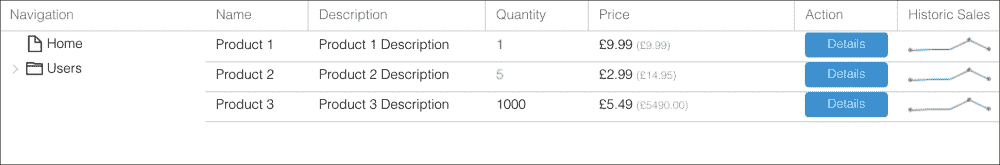
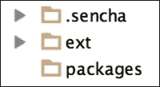
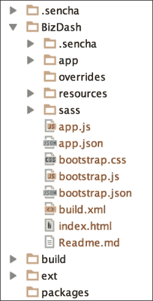

# 第一章. 了解 Ext JS

“应用”一词已经彻底改变了我们获取信息和相互以及与组织互动的方式。设计和开发应用给软件工程师带来了许多挑战，这些挑战可能会阻碍我们快速发布这些应用并保持开发过程的敏捷性。

框架和库的帮助现在比以往任何时候都更好，并且随着 Sencha 的最新发布，Ext JS 5，我们可以为我们的用户提供更丰富、更实时、更吸引人的体验。

*Ext JS Essentials*旨在涵盖 Ext JS 的所有主要主题。到本书结束时，你将了解：

+   如何使用 Ext JS 构建丰富且响应式的应用程序

+   基于**模型-视图-控制器**（**MVC**）和**模型-视图-视图模型**（**MVVM**）模式的 Web 应用架构

+   框架的基本要素，包括类、事件和用户交互

+   Ext JS 的核心布局、小部件和组件

+   数据包的主要概念和双向数据绑定

+   使用图表可视化数据集的方法

+   你可以使用来增强你的开发体验的工具

+   如何使用 SASS 自定义界面时的起点

+   你可以做什么来测试你的应用程序

本章将提供一个框架的高级概述，并解释为什么你应该投入时间和精力去学习其技术、技术和工具。

预计你已经具备编程背景，但你将发现你需要掌握的知识，以便充分利用框架。本书中使用的示例将围绕一个单一的应用程序，到本章结束时，你的开发环境将准备就绪，应用程序也将运行！

# 什么是 Ext JS

Sencha Ext JS 是一个应用开发平台，它允许你使用 Web 技术和标准构建丰富的用户体验。Ext JS 非常适合构建单页应用程序，并提供实现这一目标所需的所有工具。然而，如果你只想使用框架的一小部分，你可以只包含你需要的控件和类。你可以直接在网页上嵌入这些控件，就像嵌入 jQuery 组件一样。

与其他应用开发框架不同，Ext JS 具有一些独特的技巧。首先，它被专门设计为跨平台和跨浏览器工作。与跨浏览器开发相关的许多头痛问题已经为我们解决。只需付出很少的努力，你的应用程序就可以在以下浏览器上运行：

+   Internet Explorer 8 及以上版本

+   Firefox

+   Chrome

+   Safari 6 及以上版本

+   Opera 12 及以上版本

Sencha 也没有忘记 iOS 和 Android。从 Ext JS 5 开始，你将能够让你的应用在 iOS 6+和 Android 4.1+上流畅运行。

其次，Ext JS 鼓励在 Web 应用中使用最佳实践和架构模式。Ext JS 是一个面向对象的框架，具有清晰定义的结构和命名约定。Ext JS 支持 MVC 和 MVVM 架构，但你并不受 Sencha 的限制；自由地覆盖和扩展框架以满足你的需求。

最后，该框架得到了详尽且文笔优美的文档支持，以及一个杰出的用户社区，通常可以在 Sencha 论坛或 StackOverflow 上找到。Sencha 市场或 GitHub 上也有可用的插件社区。资源都在那里，等你去发现。去寻找吧，如果你找不到什么，就提出来。

# Ext JS 不是什么

在你继续之前，花几秒钟时间考虑一下 Ext JS 不是什么可能是有益的。如果你想要为移动设备优先设计，它就不适合你。Sencha 最近在框架上取得了重大进展，以提供触摸支持，但它仍然不是最适合手机的。另一方面，Sencha Touch 是一个专门为移动应用设计的框架。

Ext JS 也不太适合用于网站，除非你有特定的用例。例如，如果你在寻找网站上的下拉菜单或标签面板，你可能更愿意查看其他框架，如 jQuery。我们并不是说 Ext JS 不能做这些事情，但该框架有较大的开销，可能对于这些简单的用例来说过于复杂。

由于框架复杂且包含大量组件，有时定制组件和/或应用的外观和感觉以满足你的需求可能会变得繁琐。做好这件事需要时间、耐心和知识，但结果会证明一切。

# 用例

Ext JS 被全球数千家组织使用，向用户交付 Web 应用。其架构模式和组件，如网格，使其特别适合商业相关应用。

通常，开发者使用 Ext JS 进行以下操作：

+   带实时数据的交易应用

+   企业数据管理应用

+   内部网络应用

+   可视化应用

+   面向消费者的 Web 应用

+   原生封装的桌面应用

+   数据捕获和监控系统

+   仪表板和门户

显然，这个列表并不全面，但它应该能给你一个关于其他人如何在现实世界中使用 Ext JS 的概念。

# Ext JS 5 的新特性

Ext JS 5 是应用开发人员和最终用户向前迈出的又一步。其新特性使其成为世界上最先进的多设备 JavaScript 框架之一。以下是该框架主要增强功能的总结。

## 触摸支持

从一个代码库，你现在可以构建真正的跨平台应用。这次 Ext JS 的发布引入了触摸能力，使你能够在触摸屏设备上交付你的桌面应用。这结束了用户在平板电脑（如 iPad）或触摸屏笔记本电脑上所感受到的挫败感。

Sencha 提供了一个名为 *Neptune Touch* 的主题，更适合在触摸设备上使用。这是通过增加屏幕上可触摸组件的大小来实现的。

一个 *简洁* 的 Nept*une Touch 版本为你提供了更多选择，作为你应用程序的起点。

## 架构改进

进一步的效率和架构改进有助于使框架更加响应，并更好地构建应用程序。这里最显著的改进是新 MVVM 架构模式，它使我们能够使用更少的应用程序逻辑来开发 Ext JS。第三章，*对用户和应用交互做出反应*，将更深入地探讨 MVVM，并解释如何使用它来制作应用程序。

## 响应式布局

Ext JS 5 提供了让你的应用程序在桌面和平板电脑上获得最佳观看体验的能力，无论方向如何变化，都使用新的响应式配置系统。

## 组件增强

Sencha 对框架中的组件进行了多项增强。例如，网格能够直接在网格单元格中添加小部件。这将非常适合数据可视化和灵活的用户体验。图表包已升级，以支持金融图表，并进行了触摸优化。

# 你需要了解的内容

开始使用 Ext JS 不需要大量的前期知识，因为有大量的示例和资源可以帮助你。然而，具备一般的编程和面向对象编程经验将对你大有裨益。如果你恰好了解 JavaScript（以及 JSON），那就更好了。

本书将涵盖 MVC 和 MVVM 架构模式，但如果你从另一个框架中获得了相关知识，这将使学习更加容易。同样适用于应用主题：我们将演示在 Ext JS 应用中使用 SASS，但不会详细讲解这项技术。

## 开发环境

Ext JS 的开发环境只需要一个基本的文本编辑器、一个本地网络服务器和一个用于查看输出的网络浏览器。话虽如此，还有一些工具（其中一些是免费提供的），可以使你的体验更加出色。我们建议熟悉你浏览器内置的工具和插件：

+   Chrome 中的开发者工具

+   Firefox 中的 Firebug

+   Internet Explorer 中的开发者工具

+   Opera 中的 Dragonfly

+   Safari 中的开发者工具

最后，值得注意的是，近年来，对 **集成开发环境**（**IDEs**）的 JavaScript 支持有了很大的提升。Ext JS 与 JetBrains IntelliJ Idea（或如果你需要更基础的选择，WebStorm），Eclipse，以及 Spket 等其他环境配合得特别出色。

# 项目介绍

为了使我们在 Ext JS 框架中的旅程尽可能具有信息性和相关性，我们将从头到尾开发一个真实世界的应用程序。我们将涵盖应用程序构建过程的每个步骤，并将我们遇到的每个新概念、小部件和类都纳入这个应用程序中，以传授可以直接使用的实用知识。

我们的应用程序将是一个业务仪表板应用程序，将以多种不同的格式展示各种信息；它将允许用户创建和操作数据结构，并创建定制的界面和感觉。

到本书结束时，我们的应用程序将看起来像下面的截图，并将包括以下功能：

+   MVVM 架构

+   以各种图表显示的数据

+   交互式数据网格

+   定制数据视图

+   双向数据绑定表单



# 使用 Sencha Cmd 创建我们的应用程序

Sencha Cmd 是一个命令行工具，它自动化了与 Ext JS 和 Sencha Touch 应用程序创建、开发和部署相关的各种任务。它具有大量功能，其中许多将在第三章（Chapter 3. Reacting to User and Application Interactions）中详细讨论，*Reacting to User and Application Interactions*。在本节中，我们将讨论如何安装 Sencha Cmd，使用它来生成我们的业务仪表板应用程序，并为其生产部署做好准备。

## 安装 Sencha Cmd

Sencha Cmd 是一个跨平台工具，并为每个主要平台提供了不同的变体，但它依赖于必须首先安装的一些依赖项。这些是：

+   Java 运行时环境 v1.7

+   Ruby

    +   这在 OS X 上是预安装的。

    +   对于 Windows，可以从 [`rubyinstaller.org/downloads/`](http://rubyinstaller.org/downloads/) 获取。

    +   对于 Ubuntu，使用 `sudo apt-get install ruby2.0.0` 下载。

安装好这些后，前往 Sencha 网站（[`www.sencha.com/products/sencha-cmd/download`](http://www.sencha.com/products/sencha-cmd/download)）下载与你的操作系统相关的包。遵循安装程序中的说明，你应该可以开始使用了。

为了验证安装是否成功，打开一个新的终端或命令提示符窗口，并运行命令 `sencha`。你应该会看到 Sencha Cmd 帮助文本出现，列出可用的命令。

## 下载框架

在我们创建应用程序之前，我们必须首先从 Sencha 网站下载 Ext JS 框架（[`www.sencha.com/products/extjs/#try`](http://www.sencha.com/products/extjs/#try)）。将此存档提取到合适的位置。我们现在可以创建我们的应用程序了。

## 应用程序、包和工作区

当涉及到构建你的应用程序时，有三个主要实体需要理解：应用程序、包和工作区。

**应用程序** 是一个完整的产品，它将所有功能性和特性汇集在一起。每个应用程序都有自己的 `index.html` 页面，并且通常独立存在。

**包** 是一个自包含的代码片段，旨在在应用程序之间共享，它可以是工作区本地的，也可以通过 Sencha 包管理器和远程仓库进行分发。一个包的例子可能是一个自定义 UI 组件。

最后，**工作区** 是一个特殊的文件夹，它将多个应用程序和包分组在一起，允许它们共享通用代码和框架实例。

## 生成我们的工作区

我们将使用 Sencha Cmd 的 `generate` 命令来创建我们的基本应用程序结构，但我们将首先创建一个工作区。

首先，我们打开一个终端/命令提示符窗口，导航到我们之前提取的 Ext JS 框架文件夹。然后我们运行以下命令：

```js
sencha generate workspace /your/workspace/path

```

这告诉 Sencha Cmd 在指定的文件夹中生成一个新的工作区，如果它还不存在，则会创建。工作区的内容可以在下面的截图中看到：



`.sencha` 文件夹是一个隐藏文件夹，其中包含 Sencha Cmd 所使用的配置文件。你只有在自定义构建过程或对应用程序进行大量自定义时才需要深入这个文件夹。

`ext` 文件夹包含 Ext JS 框架代码，我们的新应用程序将使用这些代码。

最后，空的 `packages` 文件夹将成为我们选择包含的任何包的家园。这可能包括用户扩展、主题，或者仅仅是应用程序之间共享的通用代码。

## 生成我们的应用程序

现在我们已经为我们的应用程序创建了一个可以居住的工作区，我们可以使用 `generate app` 命令来创建它，并将应用程序的名称和工作区中应用程序文件夹的路径传递给它：

```js
sencha generate app BizDash /your/workspace/folder/BizDash

```

此命令将在名为 `BizDash` 的文件夹内创建一个基本的应用程序和文件夹结构，如下面的截图所示。我们将在下一节中解释这个文件夹内所有文件夹和文件的内容。



这种结构将构成我们业务仪表板应用程序的基础。

你可以用浏览器导航到 `index.html` 文件，看看它的样子。你应该看到一个带有标签栏和按钮的简单应用程序。

# 准备生产

显然，我们离应用程序的生产还有很长的路要走，但从一开始就正确设置这些事情非常重要，这样我们就可以在需要时快速部署，并且使这个过程持续运行。

当我们现在查看我们的应用程序并监控开发者工具中的文件请求时，我们会看到大量的活动——总计超过 350 个请求和 6 MB 的数据传输！这对最终用户来说远非理想，因此，我们希望将这些请求合并成一个单一的压缩文件。

我们通过使用 Sencha Cmd 构建应用来完成这项工作。这个过程将结合应用使用的所有类文件（即我们之前提到的 350 个请求）以及其他构建任务。有两种类型的构建：测试和生产。测试构建将结合代码但不会压缩，而生产构建将完全压缩。

我们使用以下命令为生产构建应用：

```js
sencha app build production

```

这将我们的构建应用输出到 `build/production/BizDash` 文件夹。如果你在浏览器中加载这个页面，你会看到请求的数量已经减少到 6 个，总大小仅为 1.3 MB。好多了！

除了连接和压缩我们的 JavaScript 之外，这个过程还将编译我们的 SASS 样式，为旧浏览器生成图像精灵，并构建缓存清单文件。

## 部署建议

虽然我们已经节省了超过 5 MB，但仍有进一步的优化应该进行，以确保我们的应用尽可能快地加载。这里我们将概述其中的一些方法，但为了更完整的列表，请查看 Google 的 PageSpeed 或 Yahoo 的 YSlow，它们将分析应用并提出建议。

### GZip

GZipping 允许压缩发送到浏览器的内容，使其下载速度更快。这是一个可以在大多数 Web 服务器上启用的设置。

### 压缩和连接

我们已经讨论了这两个过程，它们由 Sencha Cmd 处理。然而，当将第三方库和框架包含到你的应用中时，记住这一点很重要。

### 图片优化

在页面重量方面，JavaScript 的大小受到很多重视，但通常，移除单个图片可以将页面大小减半。如果无法移除图片，请确保它们已经完全优化，可以使用 ImageOptim 等工具。

# 我们应用的结构

让我们退一步，理解 Sencha Cmd 在我们的应用文件夹中创建的内容，以及我们的应用代码将属于何处：

+   `.sencha`: 我们应用的 `.sencha` 文件夹与工作区中找到的类似。其中的文件使我们能够对应用本身及其构建过程进行细粒度控制。

+   `app`: `app` 文件夹是我们将花费大部分时间的地方，因为它包含我们所有的 JavaScript 源代码。默认情况下，每个主要类类型都有自己的文件夹，包括控制器、模型、存储和视图。根据应用需求，可以随时在此处添加新文件夹。

    Ext JS 5 向框架引入了一个新的架构概念，称为 MVVM，这将在后续章节中进一步讨论。当使用这种结构时，我们将我们的 ViewModels 和 ViewControllers 包含在`view`文件夹中。

+   `Application.js`: 这个文件是定义应用程序的地方，也是它将从那里启动的地方。在这个文件中，我们将定义我们想要加载的控制器、存储和视图，以及当浏览器和框架准备好时我们想要运行的代码。

    你会注意到在根级别还有一个 `app.js` 文件。这个文件通常不需要编辑，并且任何“应用程序”自定义设置都应该添加到 `Application.js` 中。

+   `overrides`: 我们想要对框架代码进行的任何覆盖都可以添加到这里。

+   `resources`: 这个文件夹将包含我们应用程序将使用的任何资产（图像、图标、字体等）。当应用程序构建时，这些资产都会被复制到我们的生产 `build` 文件夹中。

+   `sass`: `sass` 文件夹将是我们所有自定义 SASS 样式规则的存放地，这些规则将在 Sencha Cmd 构建过程中被编译。

+   `app.json`: 我们的 `app.json` 文件包含大量针对应用程序的配置选项，可以用来配置诸如包含在构建中的 JavaScript 和 CSS 文件、AppCache 详细信息以及活动主题等。

+   `build.xml`: 这个文件允许我们挂钩到自动化构建过程的每个步骤，并添加我们自己的步骤。如果我们想要定制过程以适应我们的工作流程，这非常有用。

+   `bootstrap.css`、`bootstrap.js` 和 `bootstrap.json`: 这三个文件是启动应用程序所必需的，但它们是由 Sencha Cmd 构建过程生成的，因此不应手动编辑。

# 工作原理

到目前为止，我们已经创建了一个可工作的骨架应用程序，准备用我们的业务逻辑和用户界面来填充，但框架实际上是如何工作的，它为我们提供了哪些其他框架没有的功能呢？

## 引导启动过程

使用框架，我们的应用程序的启动和运行过程很简单，框架负责在需要时按正确顺序包含所有资产。我们只需定义哪些类依赖于哪些其他类，框架就会为我们构建这个关系图。

## JavaScript 到 HTML

Ext JS 管理整个用于向用户显示用户界面的 HTML。我们主要处理界面组件的 JavaScript 配置，这些组件随后被渲染为 HTML。通过这种方式，我们能够从复杂的 HTML 和 CSS 中抽象出来，这些是需要在所有平台上完美渲染丰富小部件所必需的。

## 事件系统

Ext JS 类使用一个事件系统，这使得它们能够无缝地相互通信。这使保持耦合度低变得容易，并且非常适合简化处理 JavaScript 的异步特性。

## 管理数据

框架的一个大优势是它允许你有效地对数据结构进行建模并在你的应用程序中管理数据。创建关联数据模型、读取和保存数据到各种来源以及直接将这些数据源绑定到界面组件的支持，使框架非常强大。

## 浏览器 API 交互

有许多浏览器 API，Ext JS 会代表我们抽象和交互，以简化并统一我们使用它们的方式。例如，使用这种方法，在将数据保存到服务器 API 或 LocalStorage 数据存储之间切换只是一个简单的配置更改。

## 路由

Ext JS 5 引入了一种新的路由系统，使我们能够在我们的单页 Web 应用程序中启用返回按钮，并直接访问应用程序的特定区域。

# 摘要

本章主要介绍了 Ext JS 框架的设置场景，并解释了如何使用它来创建令人难以置信的 Web 应用程序。它的用例多种多样，通过使用它，你可以确保你的项目建立在坚实的基础之上，拥有创建可靠、可维护且最重要的是功能强大的应用程序的功能。

我们还创建了本书项目应用的基础，这将在本书的每一章中扩展。到那时，我们将开发一个真实、活跃的应用程序。我们认为这种方法对于保持课程的相关性和实用性至关重要，确保你可以立即开始创建自己的应用程序。
