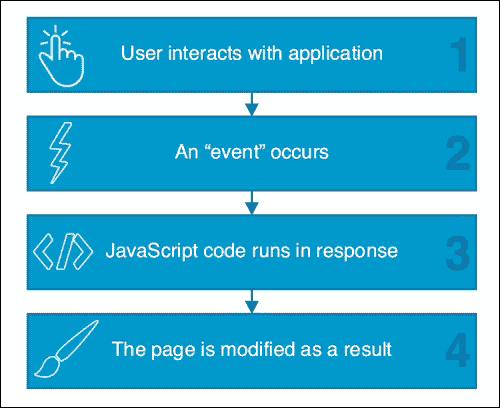

# 第三章。响应用户和应用交互

使用 Ext JS 开发有效的应用程序需要深入了解事件驱动编程以及如何根据用户和应用交互执行操作。Ext JS 是一个事件驱动框架，并使用事件来控制应用程序的流程。

事件可以通过用户输入、框架内部或我们自己的应用程序代码来触发。例如，当用户用鼠标点击按钮时，按钮的实例将触发一个点击事件。然后我们可以将监听器附加到这个事件，并在它被触发时执行我们的处理程序代码。看看下面的图示：



本章将详细探讨 Ext JS 中的事件。本章涵盖的主题包括：

+   监听事件

+   抬起自定义事件

+   将事件处理程序附加到组件上

+   通过鼠标、键盘和触摸屏监听用户输入

# 背景

使用 Ext JS 构建的应用程序将在其生命周期中的许多地方使用事件。即使你不知道，在后台，当发生有趣的事情时，框架将触发事件。作为开发者，我们希望我们的应用程序代码能够对这些事件做出响应，无论是处理某些事情还是向用户反馈发生了什么。

Ext JS 实现了一个`Ext.mixin.Observable`类，它提供了一个发布事件的通用接口。让我们看看我们有哪些选项来监听事件。

# 在配置对象中定义事件处理程序

定义监听器的一种常见方法是使用`listeners`配置选项，它允许我们定义一个包含事件处理程序的对象。这个对象应该在 Ext JS 组件的`config`对象中定义。

让我们直接跳转到在第一章中生成我们的应用程序时自动创建的`BizDash.view.main.Main`类，*了解 Ext JS*。

我们将绑定一个事件监听器到 Tab Panel 组件的`afterrender`事件。当事件被触发时，该函数将被执行。在这种情况下，处理程序的输出是一个简单的控制台消息：

```js
Ext.define('BizDash.view.main.Main', {
  extend: 'Ext.container.Container',
  ...
  items: [{
    region: 'center',
    xtype: 'tabpanel',
    listeners: {
      afterrender: function(component, eOpts) {
        console.log('Center tabpanel has rendered.')
      }
    }
  }]
});
```

同时也可以将处理程序附加到多个事件上。这个例子中，Tab Panel 组件触发的事件既有`beforerender`又有`afterrender`处理程序：

```js
Ext.define('BizDash.view.main.Main', {
  extend: 'Ext.container.Container',
  ...
  items: [{
    region: 'center',
    xtype: 'tabpanel',
    listeners: {
      afterrender: function(component, eOpts) {
        console.log('Center tabpanel has rendered.')
      },
      beforerender: function(component, eOpts) {
        console.log('Center tabpanel before rendering.')
      }
    }
  }]
});
```

## 按钮处理程序

该框架提供了一个快捷方式来定义一个处理程序到按钮，因为它高度可能你希望你的按钮能够响应鼠标点击。在这个情况下，`handler`被绑定到视图的`ViewController`中的`onClickButton`方法，`BizDash.view.main.MainController`：

```js
Ext.define('BizDash.view.main.Main', {
  extend: 'Ext.container.Container',
  ...
  items: [{
    ...
    tbar: [{
      text: 'Button',
      handler: 'onClickButton'
    }]
  }]
});
```

被认为是一个好的实践，将业务逻辑放在视图之外，而不是将其放在全局控制器或 ViewController 中。

## on 方法

或者，我们可以使用`on`方法，这是`addListener`方法的别名。这个方法来自混合的`Ext.mixin.Observable`类，并允许我们在类实例化后向类或组件添加监听器：

```js
Ext.define('BizDash.view.main.MainController', {
  extend: 'Ext.app.ViewController',
  ...
  init: function () {
    var button = this.getView().query('button[text="Button"]')[0];
    button.on('mouseover', 'onMouseOver');
    button.on({ mouseover: 'onMouseOver' });
  },
  onMouseOver: function () {
    console.log('Button Mouseover Event Fired');
  }
});
```

前面的例子展示了如何使用 Ext JS 组件查询在我们的应用程序中搜索按钮，并添加一个绑定到我们 ViewController 中`onMouseOver`方法的`mouseover`监听器。我们将在第七章构建常见 UI 小部件中更详细地介绍组件查询。

与监听器的`config`对象一样，`on`方法也接受一个可选的参数集，允许一次性分配多个事件处理器。通过将一个 JavaScript 对象作为第一个参数提供，其中包含指定事件名称和处理函数的键值对，可以一次性分配所有监听器。通过在这个对象中定义一个`scope`属性，处理函数将在这个指定对象的范围内执行（或者在函数内部`this`所引用的对象）： 

```js
Ext.define('BizDash.view.main.MainController', {
  extend: 'Ext.app.ViewController',
  ...
  init: function () {
    var button = this.getView().query('button[text="Button"]')[0];
    button.on({
      mouseover: 'onMouseOver',
      mouseout: 'onMouseOut',
      scope: this
    });
  },
  onMouseOver: function () {
    console.log('Button Mouseover Event Fired');
  },
  onMouseOut: function () {
    console.log('Button Mouseout Event Fired');
  }
});
```

**作用域**默认为触发事件的那个对象。在我们的例子中，那就是按钮。如果您需要处理函数在不同的作用域中执行，可以使用`scope`选项来自定义。前面的例子展示了如何使用`this`引用来改变作用域，使其变为`BizDash.view.main.MainController`的作用域。

# 监听器选项

您还可以配置许多监听器选项。例如，您可以缓冲连续快速触发的事件，或者将事件目标指向特定的元素而不是整个组件。在组件构建期间，这种事件委托非常有用，可以将 DOM 事件监听器添加到组件的元素上，这些元素将在组件渲染后存在。

```js
Ext.define('BizDash.view.main.MainController', {
  extend: 'Ext.app.ViewController',
  ...
  onClickButton: function () {
    Ext.Msg.confirm('Confirm', 'Are you sure?', 'onConfirm', this); 
    this.getView().getButton().disable();
  },
  ...
  init: function () {
    var button = this.getView().query('button[text="Button"]')[0];
    button.on({
      mouseover: 'onMouseOver',
      mouseout: 'onMouseOut',
      click: {fn: 'onClickButton', single: true},
      scope: this
    });
  },
  ...
});
```

此示例展示了添加到点击事件的`single`选项。此选项在第一次触发后自动删除点击事件。我们进一步增强了`onClickButton`方法，使其禁用按钮。

`Ext.mixin.Observable`类的文档包含有用的示例和有关配置事件的更多信息。您可以在[`docs.sencha.com/extjs/5.1/5.1.0-apidocs/#!/api/Ext.mixin.Observable`](http://docs.sencha.com/extjs/5.1/5.1.0-apidocs/#!/api/Ext.mixin.Observable)找到它。

# 触发事件

`Ext.mixin.Observable`类还提供了一种触发事件的方法，无论是框架事件还是自定义事件。`fireEvent`方法将触发我们需要的任何事件，并将参数传递给处理函数以供消费。以下示例展示了如何触发一个自定义的`confirmed`事件，将`choice`参数传递到按钮上，并将其绑定到`onConfirmed`处理函数：

```js
Ext.define('BizDash.view.main.MainController', {
  extend: 'Ext.app.ViewController',
  onConfirm: function (choice) {
    if (choice === 'yes') {
      var button = this.getView().getButton();
      button.fireEvent('confirmed', choice)
    }
  },
  onConfirmed: function(choice){
    console.log('The CONFIRMED event was fired');
  },
  init: function () {
    button.on({
      mouseover: 'onMouseOver',
      mouseout: 'onMouseOut',
      click: {
        fn: 'onClickButton',
        single: true
      },
      confirmed: 'onConfirmed',
      scope: this
    });
  }
});
```

# 在元素上监听事件

由于某些事件，例如点击，并非所有组件都可用，因此可以直接将事件处理器附加到任何元素。`Ext.dom.Element` 类是一个框架类，它包装 DOM 元素，并将所有底层 DOM 事件传递出去，其文档包含这些事件的完整列表。

```js
Ext.define('BizDash.view.main.MainController', {
  extend: 'Ext.app.ViewController',
  init: function () {
    var el = this.getView().getEl();
    el.on('tap', function() {
      console.log('The Viewport was tapped/clicked.');
    });
  }
});
```

上述示例展示了如何在整个 `Viewport` 上监听触摸事件。

## 事件委托

然而，事件处理器是内存泄漏的常见原因，如果不小心管理，可能会导致性能下降。我们创建的事件处理器越多，出现此类问题的可能性就越大；因此，当我们不需要时，应尽量避免创建大量处理器。

事件委托是一种技术，在父元素上创建单个事件处理器，利用浏览器会将任何在其子元素上引发的事件冒泡到父元素的事实。如果原始事件的目标与委托的选择器匹配，则将执行事件处理器；否则，不会发生任何操作。

这意味着我们不需要为每个单独的子元素附加事件处理器，而只需在父元素上创建一个处理器，然后在处理器内部查询实际被点击的子元素，并相应地做出反应。为了实现这一点，我们使用 `listeners` 配置中可用的委托选项。

以下示例展示了如何使用包含多个链接的元素进行事件委托：

```js
/* assume navigationEl is an Ext.Element instance containing multiple <a> tags */
navigationEl.on('click', function(e){
  /* Handle a click on any element inside the 'navigationElement'. Use e.getTarget to determine which link was clicked.*/

}, {
  delegate: 'a'
});
```

# 鼠标事件

框架可以处理的鼠标事件有 `mousedown`、`mousemove`、`mouseup`、`mouseover`、`mouseout`、`mouseenter` 和 `mouseleave`。`Ext.event.Event` 类处理跨浏览器和跨设备的差异，以确保我们的应用程序在所有支持的浏览器上表现一致。

# 键盘事件

`Ext.event.Event` 类还提供了一系列键常量：

```js
var constants = {
  BACKSPACE: 8,
  TAB: 9,
  NUM_CENTER: 12,
  ENTER: 13,
  RETURN: 13,
  SHIFT: 16,
  ...
}
```

例如，我们可以使用 `Ext.event.Event.ENTER` 获取回车键的代码。

## 键盘映射

`Ext.util.KeyMap` 类用于将键盘按键绑定到处理函数。使用此功能，用户可以使用键盘控制应用程序：

```js
Ext.define('BizDash.view.main.MainController', {
  extend: 'Ext.app.ViewController',
  init: function () {
    var map = new Ext.util.KeyMap({
      target: this.getView().getEl(),
      key: Ext.event.Event.ENTER,
      fn: this.onEnterPress,
      scope: this
    });
  },
  onEnterPress: function() {
    console.log('ENTER key was pressed');
  }
});
```

# 触摸事件

我们不仅经常需要支持多个浏览器，而且大多数时候我们需要我们的应用程序对设备不可知。Ext JS 使我们能够支持使用其他类型指针的用户，例如鼠标、笔或手指。

Ext JS 5 提供了对 `touchstart`、`touchmove` 和 `touchend` 事件的支持。

## 事件归一化

为了支持触摸屏设备，框架会自动将触摸屏事件转换为等效的鼠标事件，这称为事件归一化。

作为开发者，我们不需要担心额外的编码。我们只需考虑鼠标使用的事件即可。例如，`mousedown` 将无缝转换为 `touchdown` 和 `pointerdown`。

## 手势

虽然归一化可以节省我们编码，但我们仍然需要理解用户在我们应用程序上执行的手势。Ext JS 几乎为我们做了所有繁重的工作。它将解释点击、滑动、拖动和双击等手势，并在任何元素上为我们触发事件，以便我们监听。

为了做到这一点，框架基于 Sencha Touch 手势系统，该系统解释了三个主要事件的序列和时机：`touchstart`、`touchmove` 和 `touchend`。Ext JS 5 将这些转换为等效的指针和鼠标事件（例如，`pointerdown` 或 `mousedown`），以便手势无论在哪种输入设备上都能被理解。

例如，像点击和滑动这样的手势对触摸和鼠标输入都适用。

# 摘要

在本章中，我们学习了如何在 Ext JS 应用程序中处理事件。你现在应该对以下内容感到更加熟悉：

+   监听事件

+   触发自定义事件

+   将事件处理器附加到组件上

+   通过鼠标、键盘和触摸屏监听用户输入

下一章将在你对类和事件的知识基础上，涵盖整个应用程序及其架构。Ext JS 5 现在提供了对 MVVM 以及 MVC 的支持。虽然本章的重点是这些范式，但我们也会探讨在开发周期早期值得考虑的其他因素。
