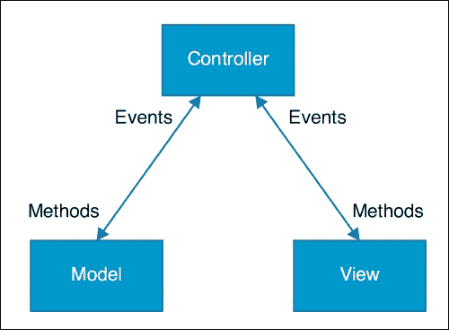
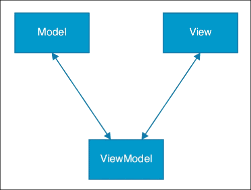
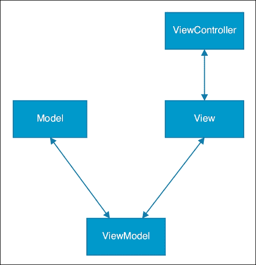

# 第四章。构建 Ext JS 应用程序架构

无论您是仅开发一个应用程序还是计划开发多个，提前考虑您的应用程序架构都是一个很好的主意。架构是您应用程序的内部结构以及其中使用的编程模式。

最终，遵循常用模式为您提供了应用程序中的连续性和一致性。这给我们带来了四个主要优势：

+   框架和您的应用程序更容易学习

+   在应用程序之间切换所需时间更少

+   应用程序之间的代码共享是可能的

+   您可以在构建和测试工具之间获得一致性

由于本章涵盖了使用 Ext JS 的应用程序架构，我们将要探讨的核心主题包括：

+   Sencha Cmd 以及它如何帮助我们构建应用程序

+   **模型-视图-控制器**（**MVC**）架构模式

+   新引入的 **模型-视图-视图模型**（**MVVM**）架构模式

+   使用事件驱动模型进行跨类通信

+   考虑将您的应用程序离线以及离线优先设计

Ext JS 5 现在提供了对 MVC 和 MVVM 应用程序架构的支持。本质上，这两种模式将应用程序分割，从而在组织良好的文件系统中产生井然有序的代码。

# 充分利用 Sencha Cmd

我们在第一章中描述了如何使用 Sencha Cmd 开始，*了解 Ext JS*，但您可以使用它做更多的事情。在本节中，我们将探讨一些其强大的命令以及它们如何加快并改进我们的工作流程。

## 生成应用程序组件

Sencha Cmd 可以通过生成 MVC/MVVM 组件来帮助加快开发过程，并使我们能够专注于应用程序的逻辑而不是编写重复的代码。

### 生成模型

要将模型添加到您的应用程序中，将 `/path/to/MyWorkspace/BizDash` 设置为当前目录并运行 Sencha Cmd，如下所示：

```js
cd /path/to/MyWorkspace/BizDash 
sencha generate model User Name:string,Email:string,TelNumber:string

```

此命令在 `model` 目录中的 `User.js` 文件中添加一个 `model` 类。文件看起来像这样：

```js
  fields: [
  {
    name: 'Name',
    type: 'string'
  },
  {
    name: 'Email',
    type: 'string'
  },
  {
    name: 'TelNumber',
    type: 'string'
  }
  ]
});
```

### 生成视图

以相同的方式将视图添加到您的应用程序中：

```js
cd /path/to/MyWorkspace/BizDash
sencha generate view location.Map

```

这将生成以下文件：

+   `app/view/Location/`：实现新视图的类的文件夹

+   `Map.js`：新视图

+   `MapModel.js`：新视图的 `Ext.app.ViewModel`

+   `MapController.js`：新视图的 `Ext.app.ViewController`

上述代码为 `Map.js` 生成的输出如下：

```js
Ext.define("BizDash.view.location.Map",{
  extend: "Ext.panel.Panel",
  controller: "location-map",
  viewModel: {
    type: "location-map"
  },
  html: "Hello, World!"
});
```

ViewController (`MapController.js`) 是：

```js
Ext.define('BizDash.view.location.MapController', {
  extend: 'Ext.app.ViewController',
  alias: 'controller.location-map'
});
```

在这种情况下，除了视图名称之外没有必需的参数。然而，如果您愿意，可以添加一个基类：

```js
cd /path/to/MyWorkspace/MyApp 
sencha generate view -base Ext.tab.Panel location.Map

```

这将改变视图类使用的扩展为 `Ext.tab.Panel`。

### 生成控制器

在 Ext JS 5 中，由 Sencha Cmd 生成的每个视图都有一个默认的 `Ext.app.ViewController`，因此大多数情况下不需要基于 `Ext.app.Controller` 生成全局控制器。如果您需要一个新的控制器，您可以使用与模型和视图相同的基本方式生成：

```js
cd /path/to/MyWorkspace/BizDash
sencha generate controller Location

```

这将在控制器目录中生成一个名为 `Location.js` 的文件，其内容如下：

```js
Ext.define('BizDash.controller.Location', {
  extend: 'Ext.app.Controller'
});
```

## 升级您的应用程序

随着框架增强、功能和错误修复的实施，您可能会发现自己处于希望将应用程序升级到框架新版本的境地。您可以使用以下命令来完成此操作：

```js
sencha app upgrade path/to/new/framework

```

此命令将升级 Sencha Cmd 框架和应用程序使用的框架。有关升级应用程序的完整说明，请参阅框架文档。

值得注意的是，使用 Sencha Cmd 无法撤销升级操作。我们建议在开始之前，确保您能够在版本控制系统中撤销升级更改。

## 刷新应用程序元数据

以下命令重新生成包含动态加载器和类系统 *bootstrap* 数据的元数据文件。每次添加、重命名或删除类时，都必须执行此操作。

```js
sencha app refresh

```

## 触发自动构建

`watch` 命令非常有用，因为它会监视您的代码库中的更改（编辑、删除等），并触发应用程序的重建以加快开发过程。

当您运行以下命令时，将启动一个 Web 服务器以托管应用程序：

```js
sencha app watch

```

### 注意

Web 服务器的默认端口是 1841。

# MVC 和 MVVM

本章的下一部分将重点关注与 Ext JS 应用程序配合最佳的建筑模式。当 Sencha 在 Sencha Touch 的早期版本中引入 MVC 时，它是 Web 应用程序中 MVC 的先驱。从那时起，随着 Web 应用程序变得更大、更复杂、更难以维护，MVC（以及 MVVM）在 Web 开发社区中获得了动力和普及。这些应用程序架构的主要目的之一是为您的代码库提供结构和一致性。如今，大多数主要框架都支持它们，Ext JS 也是如此。

我们将解释 MVC 和 MVVM 是什么，它们的优缺点，以及它们在典型的 Ext JS 应用程序中的工作方式。

## 什么是 MVC？

模型-视图-控制器（MVC）是编写软件的架构模式。它将应用程序的用户界面分为三个不同的部分，有助于将代码库组织成基于功能的逻辑信息表示。在 Ext JS 应用程序中，这种范式的结果是拥有组织良好的代码和文件系统。

### 解释缩写

有时，MVC 实现在不同应用程序之间可能略有不同，但一般来说，架构的每个部分都有特定的职责。在 MVC 架构中，程序中的每个对象都是一个模型、一个视图或一个控制器。

#### 模型

模型代表我们在应用程序中计划使用的数据。它描述了数据的通用格式——在大多数情况下是简单的字段，但它也可能包含业务规则、验证逻辑、转换、格式化规则和各种其他功能。

#### 视图

视图从视觉上向用户展示数据。它使用 Ext JS 的标准 JSON 配置通过扩展框架组件/小部件来定义。例如，一个典型的视图可能是一个网格、一个表单或一个图表。

可能会有多个视图以不同的方式显示相同的数据。例如，尽管图表和网格在视觉上不同，但它们共享相同的数据。

### 注意

最佳实践规定，视图中几乎不存在任何业务逻辑。

#### 控制器

控制器是 MVC 应用程序的核心部分。它是一个单一的结构，响应应用程序中的事件，并在模型和视图之间委派命令。由于 MVC 中关注点的清晰分离，控制器充当一个全局的消息总线，监听配置组件上的事件。

以下图表将为你提供一个更清晰的画面：



### 将这些内容整合起来

在你的应用程序中，用户将与视图交互，这些视图通常包含存储在模型中的数据。控制器在监控视图中的各种交互并更新模型或视图方面发挥着关键作用。控制器几乎包含应用程序的所有业务逻辑，使得视图和模型之间大部分互不干扰。你可以将其视为应用程序的发布-订阅模型。

Ext JS 有特定的类来管理控制器和模型，即`Ext.app.Controller`和`Ext.data.Model`。视图应通过扩展框架小部件来定义。

定义模型是一个好主意，因为它包含了你计划在应用程序中使用的数据。只需通过基本的字段配置扩展`Ext.data.Model`类，就可以开始使用。

依据此原则，通过扩展组件或小部件来创建视图。尽量避免在视图中放置业务逻辑；相反，将逻辑放在控制器中。例如，视图中的一个按钮不应包含事件逻辑——它应该放在控制器内部。

最后，通过扩展`Ext.app.Controller`来创建控制器。控制器可能不知道视图，在许多情况下，在你可以进行更多工作之前，你需要手动获取视图的引用。Sencha 关于 refs([`docs.sencha.com/extjs/5.1/5.1.0-apidocs/#!/api/Ext.app.Controller-cfg-refs`](http://docs.sencha.com/extjs/5.1/5.1.0-apidocs/#!/api/Ext.app.Controller-cfg-refs))和组件查询([`docs.sencha.com/extjs/5.1/5.1.0-apidocs/#!/api/Ext.ComponentQuery-method-query`](http://docs.sencha.com/extjs/5.1/5.1.0-apidocs/#!/api/Ext.ComponentQuery-method-query))的文档详细解释了这一点。

### Ext JS 的命名规范和目录结构

Sencha 使用明确的命名规范来保持所有文件在一起。例如，正如在第二章中解释的，*掌握框架的构建块*，类`BizDash.view.Main`与你的文件系统中的一个位置相关联。在这种情况下，文件被命名为`Main.js`，位于`view`目录中。

确保将你的模型存储在`model`目录中，视图存储在`view`目录中，控制器存储在`controller`目录中。

### 使用 MVC 的优缺点

使用 MVC 有许多优点，包括：

+   应用之间的连贯性，这减少了学习时间

+   应用之间共享代码的便利性

+   在使用 MVC 时，使用 Sencha 的构建工具构建优化应用的能

然而，MVC 架构最大的优势在于它帮助开发者避免编写过大且难以维护的文件。通过明确划分应用每个组件的责任，类被存储在一致且易于工作的目录结构中。

可惜，MVC 架构确实有其缺点。在 Ext JS 的 MVC 方法中，控制器是全局作用域的，这导致需要额外的业务逻辑来获取对视图、模型和其他对象的引用。控制器可以编写为在任何时候监视任何对象，因此任何给定的控制器可能既有视图 A 的逻辑，也有视图 B 的逻辑，这在大应用中会导致额外的混淆。

单元测试是 MVC 应用中反复出现的问题。在 MVC 模型中，视图和控制器应该是松散耦合的，但测试控制器需要了解更大的应用。很多时候，单元测试需要启动整个应用来测试单个组件。这显然是繁琐的、耗时的，并且容易出错。

### 注意

不要陷入构建具有相对较少控制器、每个控制器跨越数千行代码的应用程序的陷阱。最终，这会导致性能不佳和长期维护问题。

## 什么是 MVVM？

虽然 MVC 架构确实有一些主要优点，但其缺点也需要解决。模型-视图-视图模型（MVVM）架构是一个解决方案。Sencha 仅在 Ext JS 5 中引入了 MVVM 架构支持，因此你无法将这些原则应用于你的 Ext JS 4 或 Sencha Touch 2 应用。

Ext JS 5 仍然支持 MVC，因此从 Ext JS 4 升级到 5 不会破坏你的应用。Sencha 决定在 Ext JS 5 中支持 MVVM 架构，以解决可维护性和测试的缺点。

### 解决关注点

理论上，全局控制器非常有用，但如您所见，在实际中它们可能很难管理。MVVM 通过引入一个名为`ViewModel`的新类来克服这一点，该类管理特定于视图的数据。它是通过数据绑定来做到这一点的。这意味着我们编写的代码更少，更容易维护，并且测试起来更容易。

### 解释缩写

就像 MVC 一样，MVVM 是另一种用于编写软件的架构模式。它基于 MVC 模式，因此其中很多内容应该都很熟悉。

#### 模型

MVVM 架构中模型的原则与 MVC 中相同。

#### 视图

与模型一样，视图在 MVVM 中与 MVC 中相同。唯一的区别是我们必须为视图设置数据绑定。这是通过向视图中添加 ViewModel 来完成的：

```js
Ext.define("BizDash.view.location.Map",{
  extend: "Ext.panel.Panel",
  viewModel: {
    type: "location-map"
  }
});
```

与 MVC 不同，MVVM 架构紧密地将视图与其关联的 ViewModel 和 ViewController 耦合在一起。

#### ViewModel

ViewModel 是 MVVM 与 MVC 之间的关键区别。在 MVC 中，使用事件，我们的控制器负责管理模型和视图之间的通信。在 MVVM 中，框架在幕后进行大量工作，并使用数据绑定来完成这项工作。

数据绑定是一种将用户界面与业务逻辑连接起来的机制。例如，当 UI 中的值发生变化时，模型中的底层数据值也会发生变化。

引入 ViewModel 的结果是模型和框架比以前做更多的工作，这最大限度地减少了操纵视图所需的应用程序逻辑。

看一下以下图表：



一个典型的 ViewModel 可能看起来像这样：

```js
Ext.define('BizDash.view.location.MapModel', {
  extend: 'Ext.app.ViewModel',
  alias: 'viewmodel.location-map',
  data: {
    name: 'Map Location'
  }
});
```

ViewModel 在模型的数据和其视觉表示之间提供了一个桥梁。它们与视图紧密相关，并提供了它们所代表的数据。

### 业务逻辑

然而，仍然存在应用程序逻辑的问题。有两个选项，但通常，您的业务逻辑应该放在 ViewController 中。

#### ViewController

ViewController 非常类似于 Controller，因为它仍然通过监听事件来使用发布-订阅模型。它与之不同的地方在于它与视图的耦合方式。

ViewController 的定义如下：

+   直接关联到视图

+   具有一对一的关系

+   为每个视图实例创建

这大大减少了开销，因为您的应用程序没有那么多事件和组件引用在浮动。由于 ViewController 与引用它的视图相关联，内存泄漏和状态管理更容易识别和维护。



您的 ViewController 最初看起来可能如下所示：

```js
Ext.define('BizDash.view.location.MapController', {
  extend: 'Ext.app.ViewController',
  alias: 'controller.location-map'
});
```

在此处定义的别名可以在视图定义的控制器配置中使用，以将两个类关联起来。

#### 控制器

然而，您仍然可以使用控制器来处理您应用程序的消息总线。它们将继续像 MVC 架构中一样在多个视图中监听事件。

# 使用事件进行跨类通信

您的 Ext JS 应用程序利用事件来处理用户交互，但也很容易让您的类通过事件相互通信。

Ext JS 在处理事件方面非常成熟，因为这是框架自始至终的核心。它使用观察者模式允许您的类发布事件，并让其他类订阅这些事件。一旦发布类触发事件，您的订阅类就会立即触发其逻辑。这种范式是异步和模块化的。

正如我们在第二章中所述，*掌握框架的构建块*，Ext JS 中的事件驱动逻辑由`Ext.mixin.Observable`类处理。

# 将您的应用程序离线

在构建应用程序时，开发者经常争论设计一个能够离线工作的系统的问题。Ext JS 作为一个框架，旨在模仿在标准桌面环境中可能看到的组件和小部件。它为我们提供了构建真正丰富应用程序和类似甚至优于传统桌面应用程序的体验所需的工具。对于 Web 开发者来说，问题是用户已经习惯了使用那些被设计为“首先离线”的软件。许多移动或平板电脑应用程序也是如此。

以电子邮件客户端为例：即使您的数据连接丢失，桌面客户端仍然可以继续工作。您可以阅读电子邮件，搜索，组织文件夹，做很多事情。另一方面，基于 Web 的等效客户端可能表现不佳。自己试试看。

## 为什么我们应该设计离线优先？

除了确保网络始终是，并且继续是交付应用程序的有效解决方案之外，考虑将您的应用程序离线还有很多优势：

+   最重要的事实是*我们离线了*。这可能是无意为之，也可能不是我们所希望的，但连接性是间歇性的，并不总是可以保证的。这可能会导致您的用户丢失数据或无法完成他们的工作。

+   我们没有无处不在的互联网。我们必须在我们的移动和固定线路网络提供商的限制内工作。

+   移动、远程工作和在移动中访问系统比以往任何时候都更受欢迎。这一趋势仍在继续，大多数开发者在开发新应用程序时都需要考虑这一点。

+   性能得到了极大的提升，因为用户在本地做了大量工作，而您的服务器则可以用于其他更重要的任务。

+   可靠性和信任度得到了提升，因为您的用户将应用程序视为不带有通常缺陷的东西。

+   最后，鲁棒性得到了提升，例如，您的服务器宕机并不一定意味着应用程序会宕机。

总结来说，采用离线优先的方法将使您能够提供更好的用户体验。

## 我们能做些什么呢？

不同的应用有不同的方法，每个方法的难度等级也不同。按照从简单到复杂的顺序，常见的方法包括：

+   警告用户他们处于离线状态

+   提供用户缓存的数据库

+   允许用户进行最小程度的交互

+   允许用户与复杂应用进行完全交互

## 我们如何做到这一点？

在网络应用中有许多实现方式，为您的应用选择正确的方法并不简单。

+   原生打包是一个选项，类似于混合移动应用。可以使用嵌入式 WebKit、Cordova 或 Chrome/Firefox 应用等工具打包您的网络应用。

+   使用网络应用清单来定义应用中存在的详细信息和 API。

+   使用 AppCache 有助于浏览器缓存文件和资源。

+   如果您需要进行后台处理，例如数据同步，ServiceWorkers 非常有用；对于许多 JavaScript 开发者来说，这些可能是理想的。

+   LocalStorage 适用于以键值对的形式存储数据。Ext JS 为使用 LocalStorage 提供了出色的支持，但要注意其浏览器强制的存储限制——通常约为 5 MB。

+   IndexedDB 或 WebSQL 是在客户端存储应用程序数据的其他方法。WebSQL 已被弃用，但 IndexedDB 是一个非常可行的替代方案，并且 Ext JS 提供了出色的支持。

## 离线架构

有很多需要考虑的因素，显然，一个离线网络应用需要不同的架构。

你应该总是为最坏的情况做准备，并希望最好的情况发生。

解决这个问题的方法之一是将所有状态放在客户端，并在可能的情况下同步它。本质上，你希望设计你的应用程序以在用户的硬盘上下载和存储文件到缓存，并与本地存储的数据交互。在后台，本地存储的数据通过某种形式的代理与服务器同步。

## 同步数据

与后端同步数据可能是采用离线优先原则开发应用程序中最棘手的部分。编写同步协议是一个困难且耗时的过程。你应该考虑使用框架和工具，如 Hoodie、PouchDB 和 remoteStorage.io 来减轻同步引起的问题。

为了获得最佳结果，我们建议您遵循以下指南：

+   经常做，并且尽可能快地做

+   尽可能地传输最少的数据

+   准备好不可靠的数据网络

+   制定策略来管理冲突

# 摘要

本章重点介绍了应用程序架构的原则以及我们在 Ext JS 5 应用程序中可用的某些工具。我们涵盖了：

+   使用 Sencha Cmd 生成模型、视图和控制台

+   MVC 和 MVVM 架构模式

+   跨类通信

+   与离线数据一起工作

下一章将通过详细介绍数据包来进一步加深你的知识。对数据建模和存储的扎实理解将使你开发高级网络应用时处于有利地位。
