# 第五章。为您的 UI 模型化数据结构

准确表示您系统的数据对于每个应用程序都至关重要。能够以逻辑和组织的方式访问和操作数据集对于创建可维护的代码库是必不可少的。

Ext JS 拥有一个全面的数据包，这使得这项任务变得非常简单。它具有大量功能，包括：

+   数种数据字段类型

+   自动值转换

+   验证规则

+   关联，包括一对一、一对多和多对多

+   抽象的读写机制，包括 AJAX、LocalStorage 和 REST

在本章中，我们将演示如何创建业务仪表板应用程序所需的数据结构，如何将这些数据模型通过关联连接起来，以及如何从后端读取和写入数据。

以下图表展示了我们将代表的应用程序中的数据实体及其关系：

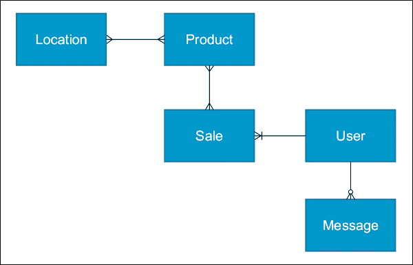

主要关系如下：

+   一个 **位置** 可以包含一个或多个 **产品**

+   一个 **产品** 可以位于一个或多个 **位置**

+   一个 **产品** 可以有多个 **销售**

+   一个 **销售** 可以涉及一个或多个 **产品**

+   一个 **用户** 可以有多个 **销售**

+   一个 **用户** 可以有多个 **消息**

# 定义模型

数据模型定义为常规的 Ext JS 类，并应扩展 `Ext.data.Model` 类。模型类通常位于应用程序的模型文件夹中，并且可以有任意数量的子命名空间，以允许对相关模型进行分组。

我们将首先在 `model` 文件夹中名为 `Product.js` 的文件中定义我们的产品模型：

```js
Ext.define('BizDash.model.Product', {
  extend: 'Ext.data.Model',
  fields: [
    {
      name: 'Name',
      type: 'string'
    },
    {
      name: 'Description',
      type: 'string'
    },
    {
      name: 'Quantity',
      type: 'int'
    },
    {
      name: 'Price',
      type: 'float'
    }
  ]
});
```

为了节省一些按键，您可以使用 Sencha Cmd 在命令行中生成模型。有关如何操作的详细信息，请参阅第四章，*构建 Ext JS 应用程序架构*，第四章。

## 字段

产品模型中的 `fields` 属性定义了附加到模型每份数据的名称和类型。`fields` 数组中的每个对象都是 `Ext.data.Field` 类的配置对象，该类提供了各种选项，用于解释和存储字段的方式。

主要配置如下：

+   `name`：这是字段的名称。在从数据源读取数据并稍后检索时用作映射键。

+   `type`：这是分配的值应解析成的数据类型。可能的值包括 `string`、`int`、`float`、`date`、`boolean` 和 `auto`。如果设置为 `auto`，则不会进行自动转换。

+   `mapping`：这允许从与字段名称不匹配的属性中提取字段的值。

## 字段验证

数据结构的验证逻辑可以直接嵌入到定义中，从而确保相同的逻辑不会散布在您的应用程序的各个部分。这可以通过 `validators` 选项来实现，该选项允许您定义应应用于每个字段的验证规则。

我们可以向产品模型添加验证规则以确保每个字段的数据正确。我们通过定义一个对象来完成此操作，其中每个键都引用一个字段的名称。此属性的值可以是一个简单的字符串，指代验证类型的名称，一个配置验证的对象，或者一个对象数组，以便可以应用多个规则。

下面的代码片段显示了用于以这种方式验证字段的配置：

+   `Name` 字段通过存在（即不为空）并且至少有三个字符长是有效的

+   `Quantity` 字段必须存在

+   `Price` 字段大于 0

```js
...
  validators: {
    Name: [
      {
        type : 'presence'
      },
      {
        type : 'length',
        min  : 3
      }
    ],
    Quantity: 'presence',
    Price: {
      type: 'range',
      min: 0
    }
  }
...
```

`type` 配置定义了我们想要应用的规则：默认情况下，可能的选项有 `presence`、`length`、`format`、`inclusion`、`exclusion`、`range` 和 `email`。每个选项的详细信息可以在 `Ext.data.validator.*` 命名空间中找到。

添加的任何其他属性都用作选项来定制特定的验证器；例如，min 定义了 `Name` 必须具有的最小长度。

我们可以使用 `getValidation` 方法在模型实例（有时称为 *record*）上应用验证规则。此方法将返回 `Ext.data.Validation` 类的实例，然后我们可以查询它以确定哪些字段无效并检索错误消息。

## 自定义字段类型

尽管 Ext JS 有五种字段类型可以覆盖大多数场景，但最新版本引入了创建自己的自定义字段类型的能力，该类型可以内置转换、验证和序列化。此功能可以帮助减少具有相同字段类型的模型之间的代码重复。

在我们的产品模型中，我们为 `Price` 字段定义了一个验证规则，以确保它具有正值。我们必须将此规则应用到每个包含货币值的字段的所有模型上。这将是一个理想的候选者，用于创建一个自定义字段类型，以便可以共享此配置。

自定义字段类型声明的方式与其他类相同，应扩展 `Ext.data.field.Field` 类（或其子类之一，如果您想基于其现有功能进行构建）。我们将扩展 `Ext.data.field.Number` 类型，它为我们提供了确保值是数字的逻辑。

我们添加到产品模型的验证规则可以添加到此类中：

```js
Ext.define('BizDash.model.field.Money', {
  extend: 'Ext.data.field.Number',
  alias: 'data.field.money',
  validators: [
    {
      type: 'range',
      min : 0
    }
  ],
  getType: function() {
    return 'money';
  }
});
```

现在可以通过将任何字段指定为类型 `money` 来使用此自定义字段类型。产品模型的 `Price` 字段将被重写如下，并且将自动应用我们指定的验证规则：

```js
...
  {
    name: 'Price',
    type: 'money' 
  }
...
```

## 自定义数据转换器

字段的值可以在存储之前自动处理，以便根据其他字段的值对其进行修改，或者将其值解析为不同的类型；例如，将接收到的货币值“USD10.00”拆分为其两个组成部分：货币和值。

实现这一点的第一种方法是向字段的配置中添加一个`convert`属性，并为其分配一个函数。这个函数将接收字段的值以及它所存储的记录实例，并应该返回要存储的处理后的值。

应该注意的是，记录实例可能根据字段填充的顺序而不完整，因此不能保证其他字段值将可用。

以下示例展示了我们如何实现一个`StockValue`字段，该字段使用当前的`Quantity`和`Price`值来计算股票的总价值：

```js
{
  name   : 'StockValue',
  type   : 'money',
  convert: function(val, rec) {
    return rec.get('Quantity') * rec.get('Price');
  },
  depends: ['Price', 'Quantity']
}
```

我们还包含了`depends`配置，它在我们使用的`StockValue`字段和其`convert`函数中的字段之间创建了一个依赖关系。这意味着当`Price`或`Quantity`字段更新时，`StockValue`字段会重新计算，确保一切保持同步。

另一种方法是使用`calculate`选项，它的工作方式非常相似，但设计用于仅用于计算字段而不是操作实际值。我们可以使用`calculate`重写`StockValue`字段，如下所示：

```js
{
  name     : 'StockValue',
  type     : 'money',
  calculate: function(data) {
    return data.Quantity * data.Price;
  }
}
```

`calculate`函数接受一个包含记录数据对象的参数，可以用来访问其他字段。与`convert`函数一样，它应该返回要存储的值。

通过使用`calculate`，会根据函数的内容自动确定依赖关系。因此，不需要显式的`depends`配置。

# 与存储一起工作

存储是一组模型实例的集合，允许对这些模型进行操作（例如，排序、过滤、搜索等）。它们还提供了一个与后端交互的平台。许多 Ext JS 组件可以绑定到数据存储，并处理许多响应存储中数据变化的管道工作。

在本节中，我们将讨论如何构建一个简单的存储以及如何对其进行简单的数据操作；如何使用链式存储创建数据集的不同视图；最后，如何使用 TreeStores 存储层次数据。

## 简单存储

要定义一个存储，你必须扩展`Ext.data.Store`类，并使用一个`model`类来配置它，该类将包含一个集合。以下存储定义显示了一个包含用户记录集合的存储：

```js
Ext.define('BizDash.store.Users', {
  extend: 'Ext.data.Store',
  model: 'BizDash.model.User'
});
```

我们现在可以将我们的存储添加到`Application.js`文件中的`stores`配置选项。这将导致文件被加载并自动实例化，使其可以通过`Ext.getStore`方法访问。然后我们可以使用`add`方法添加一些示例数据：

```js
// Application.js
stores: [
  'Users'
],
launch: function() {
  var usersStore = Ext.getStore('Users');
  usersStore.add([
    {
      Name : 'John',
      Email : 'john@gmail.com',
      TelNumber: ' 0330 122 2800',
      Role : 'Administrator'
    },
    {
      Name : 'Sarah',
      Email : 'sarah@hotmail.com',
      TelNumber: ' 0330 122 2800',
      Role : 'Customer'
    },
    {
      Name : 'Brian',
      Email : 'brian@aol.com',
      TelNumber: ' 0330 122 2800',
      Role : 'Supplier'
    },
    {
      Name : 'Karen',
      Email : 'karen@gmail.com',
      TelNumber: ' 0330 122 2800',
      Role : 'Administrator'
    }
  ]);
}
```

现在我们有一个填充了数据的存储，我们可以开始探索各种查询和操作数据的方法。

### 存储统计

我们经常需要知道存储中记录的数量，这可以通过`getCount`方法轻松完成：

```js
usersStore.getCount() // returns 4
```

### 检索记录

获取记录实例的最简单方法是基于其（基于 0 的）索引访问它。为此，我们使用`getAt`方法，它返回该位置的`Ext.data.Model`子类（如果没有找到则返回 null）：

```js
var userRecord = usersStore.getAt(0); // { Name: "John" ... }
```

### 查找特定记录

为了根据字段的值查找特定记录，我们使用`findRecord`方法，其最简单形式接受一个字段名称和要匹配的值。这将返回第一个匹配的记录，如果未找到则返回 null：

```js
var userRecord = usersStore.findRecord('Name', 'Karen');
```

默认情况下，这将搜索所有记录，并将搜索值查找在记录值的开头。它将不区分大小写，并允许部分匹配。这些选项可以通过将以下参数传递给`findRecord`方法来更改：

+   **字段名称（字符串）**：要匹配的字段

+   **搜索值（字符串/数字/日期）**：要查找的值

+   **起始索引（数字）**：开始搜索的索引

+   **任意匹配（布尔值）**：如果匹配搜索值在任意位置（而不仅仅是开头）

+   **区分大小写（布尔值）**：如果匹配大小写

+   **精确匹配（布尔值）**：如果匹配整个值

如果你希望检索记录的索引而不是实际的记录实例，可以使用`find`方法，它将返回记录的位置，如果未找到则返回-1。

### 复杂搜索

如果你的搜索条件比简单的字段匹配更复杂，你可以使用自己的自定义匹配函数来引入多个标准。例如，你可能想通过名称和电话号码查找用户。

你可以使用`findBy`方法做到这一点，传递一个函数，该函数将有一个参数，即`record`实例，如果被认为匹配则返回 true，如果不匹配则返回 false。此函数将为存储中的每个记录执行一次，直到找到匹配项：

```js
var userRecord = usersStore.findBy(function(record){
  return record.get('Name') === 'John' && record.get('TelNumber') === '0330 122 2800';
});
```

### 筛选商店

商店可以在任何时候通过类似的基本或复杂查询进行筛选。这样做，将导致商店仅暴露其原始数据集的子集。可以在任何时候移除过滤器以再次恢复完整的数据集。

我们可以使用`addFilter`方法通过配置筛选商店，它接受单个`Ext.util.Filter`实例或`Ext.util.Filter`实例数组或配置对象。这些应指定正在筛选的字段名称和要比较的值。以下示例筛选商店以仅包含名为“Brian”的用户：

```js
console.log(usersStore.getCount()); // 4
usersStore.addFilter({
  property: 'Name',
  value: 'Brian'
});
console.log(usersStore.getCount()); // 1
```

类似于`findBy`方法，我们还可以使用一个允许构建更复杂查询的函数进行筛选。以下示例显示了商店通过名称和电子邮件进行筛选：

```js
console.log(usersStore.getCount()); // 4
usersStore.filterBy(function(record){
  return record.get('Name') === 'John' && record.get('Email') === 'john@swarmonline.com';
});
console.log(usersStore.getCount()); // 1
```

当商店被筛选时，所有查询操作（`find`、`getAt`等）都在筛选后的数据集上执行，而不会搜索任何筛选项。要使商店回到未筛选状态，只需调用`clearFilter`方法：

```js
console.log(usersStore.getCount()); // 1
usersStore.clearFilter();
console.log(usersStore.getCount()); // 4
```

#### 基于配置的筛选

所有的前述示例都显示了存储程序化地进行过滤。当配置存储时，也可以定义一个默认过滤器，并将其应用于添加到存储中的所有新记录。这可以是一个完整的`Ext.util.Filter`配置对象，包含简单的属性/值组合或更复杂的`filterFn`：

```js
Ext.define('BizDash.store.Users', {
  extend: 'Ext.data.Store',
  model: 'BizDash.model.User',
  filters: [
    {
      property: 'Name',
      value: 'John'
    }
  ]
});
```

### 对存储进行排序

我们还可以通过使用`sort`或`sortBy`方法来更改存储记录的排序顺序。与过滤和查找类似，这些方法允许在单个或多个字段中进行简单排序，或者使用函数进行更复杂的排序。请注意，如果没有提供排序选项，记录将保持添加时的顺序。

对`名称`进行简单排序可以如下所示：

```js
console.log(usersStore.getAt(0).get('Name')); // John

  usersStore.sort('Name', 'ASC');

console.log(usersStore.getAt(0).get('Name')); // Brian 

console.log(usersStore.getAt(3).get('Name')); // Sarah

  usersStore.sort('Name', 'DESC');

console.log(usersStore.getAt(0).get('Name')); // Sarah 

console.log(usersStore.getAt(3).get('Name')); // Brian
```

要执行更复杂的排序，你可以提供一个对象来配置`Ext.util.Sorter`类的实例。以下示例通过每个用户的姓名的逆序（例如，nhoJ，haraS）进行排序：

```js
usersStore.sort({
  sorterFn: function(a, b) {
    var aName = a.get('Name').split('').reverse().join(''),
      bName = b.get('Name').split('').reverse().join('');
    return ((aName < bName) ? -1 : ((aName > bName) ? 1 : 0));
  },
  direction: 'ASC'
});
```

#### 基于配置的排序

再次强调，我们可以在添加每条新记录后重新应用默认排序器。这应该是一个`Ext.util.Sorter`配置对象：

```js
Ext.define('BizDash.store.Users', {
  extend: 'Ext.data.Store',
  model: 'BizDash.model.User',
  sorters: [
    {
      property: 'Name',
      direction: 'DESC'
    }
  ]
});
```

### 分组

存储的记录也可以通过特定的字段或字段的组合进行分组，这在以分组网格显示数据时非常有用。我们使用`group`方法如下，传入`Role`字段作为分组字段，以及`ASC`来确定组的排序方向：

```js
usersStore.group('Role', 'ASC');
```

通过调用此方法，存储保持不变。这意味着我们可以像以前一样访问所有记录，但现在它还提供了对`Ext.util.GroupCollection`实例的访问，这是一个包含每个实例中一组分组记录的`Ext.util.Group`实例集合。

我们可以使用`getGroups`方法来查询分组数据：

```js
var groups = usersStore.getGroups();
console.log(groups.getCount()); // 3 groups: Administrator, Supplier, Customer
console.log(groups.getAt(0).getGroupKey()); // Administrator
console.log(groups.getAt(1).getGroupKey()); // Customer
console.log(groups.getAt(2).getGroupKey()); // Supplier
console.log(groups.getAt(0).getCount()); // 2
console.log(groups.getAt(0).getAt(0).get('Name')); // John
console.log(groups.getAt(0).getAt(1).get('Name')); // Karen
```

除了接受这些参数外，我们还可以传递一个`Ext.util.Grouper`配置对象来定义更复杂的分组设置。在以下示例中，我们根据每个用户的电子邮件地址域进行分组（注意，我们使用`clearGrouping`方法来重置任何现有的分组）：

```js
usersStore.clearGrouping();
usersStore.group({
  groupFn: function(rec){
    var email = rec.get('Email'),
      emailSplit = email.split('@'),
      domain = emailSplit[1];
    return domain;
  },
  direction: 'DESC'
});
groups = usersStore.getGroups();
console.log(groups.getCount()); // 3 groups: hotmail.com,
//gmail.com, aol.com
console.log(groups.getAt(0).getGroupKey()); // hotmail.com 
console.log(groups.getAt(1).getGroupKey()); // gmail.com 
console.log(groups.getAt(2).getGroupKey()); // aol.com
console.log(groups.getAt(0).getCount()); // 1 
console.log(groups.getAt(0).getAt(0).get('Name')); // Sarah
```

#### 基于配置的分组

分组也可以通过在存储定义中使用`groupField`和`groupDirection`选项一起，或者单独使用`grouper`选项来完成。以下代码片段显示了使用每种组合在`Role`上对存储进行分组：

```js
Ext.define('BizDash.store.Users', {
  extend: 'Ext.data.Store',
  model: 'BizDash.model.User',
  grouper: [
    {
      property: 'Role',
      direction: 'ASC'
    }
  ]
});
```

此外，还有另一个示例：

```js
Ext.define('BizDash.store.Users', {
  extend: 'Ext.data.Store',
  model: 'BizDash.model.User',
  groupField: 'Role',
  groupDir: 'ASC'
});
```

## 连锁存储

连锁存储是 Ext JS 5 的新增功能，允许我们创建对同一底层数据存储的不同视图，而不会影响基础数据或其他连锁存储。

假设我们想在`usersStore`中为每个角色显示数据，我们希望一个网格连接到`usersStore`并带有过滤器*Role=Administrator*，下一个网格带有*Role=Supplier*，依此类推。不幸的是，在 Ext JS 5 之前，无法仅使用一个存储来完成此操作，因此，我们必须创建多个存储，包含相同数据的多个副本，并分别管理它们。链式存储解决了这个问题，并允许我们附加到基本数据存储，并应用任何过滤器或排序器到数据的视图中，而不会影响基本存储或任何其他相关联的链式存储。

下面的图解解释了这个概念：

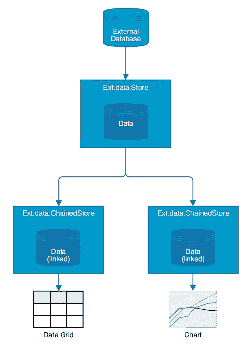

关于链式存储的关键事项包括：

+   记录实例在所有链式存储和基本存储之间共享

+   对任何记录所做的任何更新都将传播到所有相关联的存储。

回到我们的角色示例，我们现在可以通过定义三个链式存储来解决此问题，这些存储可以绑定到单独的网格或数据视图中。

我们使用`source`配置选项将它们链接到基本数据存储，该选项可以接受存储实例或存储 ID。然后我们可以向链式存储添加任何排序器或过滤器，就像对常规存储所做的那样。

我们在`store/users/`文件夹中创建这些存储，以保持事物有序：

```js
// store/users/Admins.js
Ext.define('BizDash.store.users.Admins', {
  extend: 'Ext.data.ChainedStore',
  config: {
    source: 'Users',
    filters: [
      {
        property: 'Role',
        value: 'Administrator'
      }
    ]
  }
});

// store/users/Customers.js
Ext.define('BizDash.store.users.Customers', {
  extend: 'Ext.data.ChainedStore',
  config: {
    source: 'Users',
    filters: [
      {
        property: 'Role',
        value: 'Customer'
      }
    ]
  }
});

// store/users/Suppliers.js
Ext.define('BizDash.store.users.Suppliers', {
  extend: 'Ext.data.ChainedStore',
  config: {
    source: 'Users',
    filters: [
      {
        property: 'Role',
        value: 'Supplier'
      }
    ]
  }
});
```

然后，我们在`Application.js`中的`stores`配置中添加新的存储，并为每个创建一个实例，查看每个实例的记录数：

```js
var adminStore = Ext.create('BizDash.store.users.Admins');
var customerStore = Ext.create('BizDash.store.users.Customers');
var supplierStore = Ext.create('BizDash.store.users.Suppliers');
console.log(usersStore.getCount()); // 4
console.log(adminStore.getCount()); // 2
console.log(customerStore.getCount()); // 1
console.log(supplierStore.getCount()); // 1
```

## TreeStores

`Ext.data.TreeStore`类是一个专业存储，它扩展自常规的`Ext.data.Store`类，用于管理层次化数据。此类存储必须用于绑定到树面板和其他组件，其中数据需要具有层次结构。

TreeStores 的创建方式与常规存储相同，只有一个主要区别。TreeStore 管理的模型集合必须扩展自`Ext.data.TreeModel`类，而不是通常的`Ext.data.Model`。

### Ext.data.TreeModels

TreeStore 的模型必须扩展`Ext.data.TreeModel`类的原因是每个模型实例都必须添加额外的属性和方法，以便正确管理模型的层次结构，并允许树组件正确显示它们。这些额外的属性和方法来自`Ext.data.NodeInterface`类，其成员都应用于 TreeStore 中的每个模型实例。

我们将通过首先定义将要存储的模型来创建一个简单的树示例。我们的数据将代表我们应用程序的导航结构，并形成我们菜单的基础：

```js
Ext.define('BizDash.model.NavigationItem', {
  extend: 'Ext.data.TreeModel',
  fields: [
    {
      name: 'Label',
      type: 'string'
    },
    {
      name: 'Route',
      type: 'string'
    }
  ]
});
```

如果你需要在你的 `Application.js` 文件中使用这个类，创建这个模型的实例并检查其内容。你会发现模型现在有超过 20 个额外的数据字段。这些字段都用于描述每个节点以实现各种目的，例如跟踪其位置、状态和外观。

默认情况下，这些字段的 `persist` 配置设置为 `false`，因此它们不会包含在任何由它们发起的保存操作中。

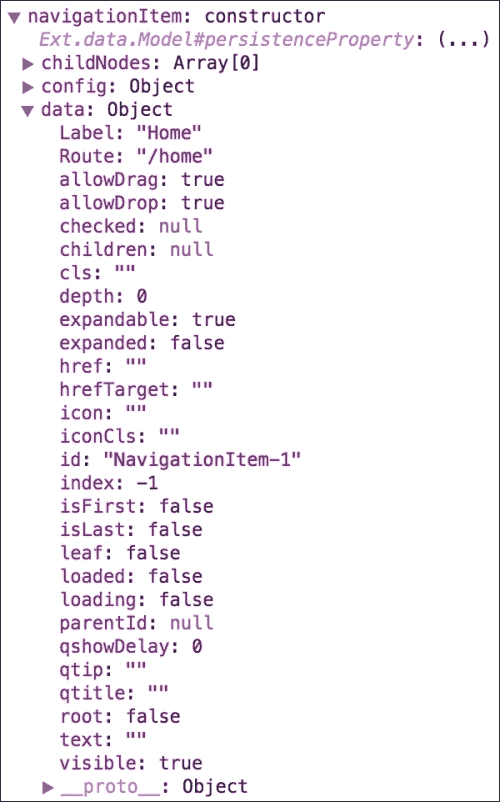

如果你进一步查看，你还会看到添加到模型中的许多额外方法。这些方法可以用来管理节点及其子节点，遍历树结构，并查询其在层次结构中的位置。其中一些更有用的方法在此处详细说明：

+   `appendChild`: 这会将指定的节点（或节点集合）添加为当前节点的最后一个子节点

+   `insertChild`: 这将在指定位置插入新的节点

+   `removeChild`: 这将从子节点集合中移除指定的节点

+   `eachChild`: 这将对每个子节点执行一个函数

+   `findChild`: 这将找到第一个匹配给定属性/值的子节点

+   `isLeaf`: 这将确定当前节点是否为没有子节点的叶子节点

### 创建一个 TreeStore

我们将创建一个简单的 TreeStore，名为 `BizDash.store.Navigation`，它将包含 `BizDash.model.NavigationItem` 模型实例的集合。此存储库扩展了基类 `Ext.data.TreeStore`：

```js
Ext.define('BizDash.store.Navigation', {
  extend: 'Ext.data.TreeStore',
  model: 'BizDash.model.NavigationItem'
});
```

我们将此存储库包含在 `Application.js` 文件中的 `stores` 数组中，它将自动加载和实例化，并且可以通过调用 `Ext.getStore('Navigation')` 来访问。

### 填充 TreeStore

TreeStores 必须始终有一个 *根节点*，它是存储中所有子节点的根父节点。这个节点通常总是隐藏的，实际上在树视图中从未真正显示。为了以编程方式（即不是从外部数据源——我们将在下一节中讨论这一点）填充我们的 TreeStore，我们可以使用 `setRoot` 方法添加完整的层次结构，或者使用 `appendChild` 或 `insertChild` 方法单独添加子节点。

我们将首先使用 `setRoot` 方法，该方法从根节点向外构建 `NavigationItem` 实例的层次结构：

```js
var navigationStore = Ext.getStore('Navigation');
navigationStore.setRoot({
  Label : 'Root',
  children: [
    {
      Label: 'Home',
      Route: '/home'
    },
    {
      Label : 'Users',
      Route : '',
      children: [
      {
        Label: 'Manage Users',
        Route: '/manage-users',
        leaf : true
      },
      {
        Label: 'Add User',
        Route: '/add-user',
      leaf : true
      }
    ]}
  ]
});
```

这将产生以下结构：

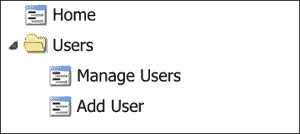

注意，我们自己的字段（`Label` 和 `Route`）与一些 `Ext.data.NodeInterface` 字段（子节点和叶子节点）结合使用；我们这样做是为了表示节点之间的父子关系，以及表示哪些节点没有子节点。

一旦存在根节点，我们也可以开始使用 `appendChild` 方法添加节点，如下面的代码片段所示：

```js
// append a node at the same level as 'Home' and 'Users'
navigationStore.getRoot().appendChild({
  Label: 'Orders',
  Route: '/orders'
});
// find the 'Users' node and append a node to it
navigationStore.getRoot().findChild('Label', 'Users', true).appendChild({
  Label: 'Import Users',
  Route: '/import-users'
});
```

# 将数据放入你的应用程序中

到目前为止，我们只处理了硬编码的数据，而没有处理从外部源加载数据和保存数据的真实世界示例，无论是 REST 端点、本地数据库还是第三方 API。Ext JS 支持多种不同的方式来帮助加载数据和持久化，包括 AJAX 和 LocalStorage。

## Ext.Ajax

虽然这与存储间接相关，但我们首先将更一般地讨论 AJAX 请求以及我们如何执行它们以调用服务器后端。

`Ext.Ajax`是`Ext.data.Connection`类的单例实例，它为我们提供了一个非常简单的接口，用于向服务器发出 AJAX 调用并处理响应。我们将主要关注`request`方法，它启动此调用并允许我们指定如何进行调用。

### 简单 AJAX 调用

我们将首先演示如何向一个静态 JSON 文件发出简单的 AJAX 请求。我们只需向请求方法传递一个配置对象，告诉框架在哪里发出 AJAX 请求，在这种情况下指定`url`属性：

```js
Ext.Ajax.request({
  url: 'user.json'
});
```

如果我们在 Ext JS 应用的控制台中运行此代码，我们应该在**网络**选项卡中看到请求正在发出。目前，我们正在忽略给我们提供的响应，所以现在我们将包括一个回调函数来处理接收到的数据。

如你所知，AJAX 调用是异步的，这意味着在请求进行时，其余的代码将继续执行，而不会等待它完成。这意味着我们必须在回调函数中处理响应，该函数将在收到响应时执行。我们通过指定`success`属性来实现这一点，该属性的函数将接收两个参数：一个响应对象和一个选项对象。

在我们的成功处理程序中，我们将解码收到的 JSON 字符串并将输出记录到控制台：

```js
Ext.Ajax.request({
  url: 'user.json',
  success: function(response, options){
    var user = Ext.decode(response.responseText);
    console.log(user);
  }
});
```

### 处理错误

显然，我们不能仅仅依赖于所有 AJAX 请求都成功完成的童话案例，所以我们必须包括一些替代方案，以防请求失败（即返回非 200 响应代码）。我们可以通过指定`failure`配置并定义一个在请求失败时将执行的函数来实现这一点。以下示例在发生错误时控制台记录响应状态代码：

```js
Ext.Ajax.request({
  url: 'user.json',
  success: function(response, options){
    var user = Ext.decode(response.responseText);
    console.log(user);
  },
  failure: function(response, options){
    console.log('The request failed! Response Code: ' + response.status);
  }
});
```

你可以通过修改`url`属性为一个不存在的地址来尝试此操作，以强制产生 404 错误。

### 其他有用的配置

你可以向`request`方法传递很多配置选项。以下是一些这些选项的简要说明：

+   `params`: 这是一个对象，其键/值对将随请求一起发送

+   `method`: 这是发送请求的方法（如果没有`params`，默认为`GET`，如果有则为`POST`）

+   `callback`: 在请求之后，无论成功与否，都会调用这里定义的函数

+   `timeout`: 这定义了请求的超时时间，以秒为单位

+   `headers`: 这定义了随请求一起发送的头部信息

## 代理

现在我们已经讨论了执行简单的 AJAX 请求，这些请求可以愉快地用来填充存储，我们将继续解释代理，它为我们提供了简单机制，使我们的存储能够与数据源通信。

存储或模型可以通过代理进行配置，该代理提供了一层抽象，覆盖了每个可能的数据源的具体细节（无论是外部服务器还是 LocalStorage）。这种抽象允许我们提供简单的配置，并让存储负责处理与数据源通信的复杂性。

代理与两种其他类类型相关联：`Reader`和`Writer`。`Reader`类负责解释接收到的数据并正确解析它，以便它可以转换为模型实例。另一方面，`Writer`类负责收集要保存的数据。

以下图表显示了这些类是如何相互关联的：


### AJAX 代理

最常见的代理类型是 AJAX 代理（`Ext.data.proxy.Ajax`），它允许我们通过 AJAX 调用将数据加载和保存到服务器端点。我们将向用户存储添加一个 AJAX 代理来从简单的 JSON 文件加载数据：

```js
Ext.define('BizDash.store.Users', {
  extend: 'Ext.data.Store',
  model: 'BizDash.model.User',
  proxy: {
    type : 'ajax',
    url : 'users.json',
    reader: {
      type : 'json',
      rootProperty: 'rows'
    }
  }
});
```

让我们分解这段代码。我们首先添加一个`proxy`配置选项和一个`config`对象。我们指定我们想要的`proxy`类型（我们很快会讨论其他类型）——在这种情况下是一个 AJAX 代理，相当于`Ext.data.proxy.Ajax`类。接下来，我们指定从哪里加载数据的`url`。最后，我们通过给代理一个`reader`配置来告诉代理如何解释结果。类型告诉它我们将接收 JSON 数据，因此我们想使用`Ext.data.reader.Json`类。`rootProperty`告诉读取器在接收到的 JSON 对象中查找数据记录的哪个属性。

此配置将从包含以下数据的`users.json`文件加载数据：

```js
{
  "success": true,
  "results": 4,
  "rows": [
    {
      "Name"     : "John",
      "Email"    : "john@gmail.com",
      "TelNumber": "0330 122 2800",
      "Role"     : "Administrator"
    },
    {
      "Name"     : "Sarah",
      "Email"    : "sarah@hotmail.com",
      "TelNumber": "0330 122 2800",
      "Role"     : "Customer"
    },
    {
      "Name"     : "Brian",
      "Email"    : "brian@aol.com",
      "TelNumber": "0330 122 2800",
      "Role"     : "Supplier"
    },
    {
      "Name"     : "Karen",
      "Email"    : "karen@gmail.com",
      "TelNumber": "0330 122 2800",
      "Role"     : "Administrator"
    }
  ]
}
```

我们现在可以将用户的加载方法称为存储，并且它将向`users.json`文件发起一个 AJAX 请求，并使用四个记录填充自身。以下代码将在完成加载后加载存储并记录加载的记录：

```js
Ext.getStore('Users').load(function(records, operation, success){
  console.log(Ext.getStore('Users').getCount()); // 4
  console.log(records); // [ ...record instances... ]
});
```

### LocalStorage 代理

另一种类型的代理是`localstorage`代理，它允许我们在浏览器中加载和保存 LocalStorage 中的数据。配置存储与 LocalStorage 通信非常简单，并且它遵循与 AJAX 代理相同的模式，如下所示：

```js
Ext.define('BizDash.store.Users', {
  extend: 'Ext.data.Store',
  model: 'BizDash.model.User',
  proxy: {
    type: 'localstorage',
    id : 'users'
  }
});
```

再次，我们指定了代理类型，在这种情况下，将使用`Ext.data.proxy.LocalStorage`类。我们还指定了一个`id`，它将用于识别 LocalStorage 中属于此存储的项目。这个`id`必须在所有代理中是唯一的。

我们将首先演示保存记录，以便在 LocalStorage 中有一些数据可以加载。我们可以在添加一些记录后通过调用`sync`方法来保存存储的记录：

```js
Ext.getStore('Users').add([
  {
    Name : 'John',
    Email : 'john@gmail.com',
    TelNumber: ' 0330 122 2800',
    Role : 'Administrator'
  },
  {
    Name : 'Sarah',
    Email : 'sarah@hotmail.com',
    TelNumber: ' 0330 122 2800',
    Role : 'Customer'
  },
  {
    Name : 'Brian',
    Email : 'brian@aol.com',
    TelNumber: ' 0330 122 2800',
    Role : 'Supplier'
  },
  {
    Name : 'Karen',
    Email : 'karen@gmail.com',
    TelNumber: ' 0330 122 2800',
    Role : 'Administrator'
  }
]);

Ext.getStore('Users').sync();
```

如果你打开开发者工具的**资源**选项卡并检查 LocalStorage 区域，你会看到基于我们提供的`id`的键的记录。

存储的项有三种类型：

+   `<id>-counter`，包含存储记录的数量

+   `<id>`，包含存储记录 ID 的逗号分隔列表

+   每条记录的 JSON 编码数据都存储在一个键中，其格式为`<id>-<Record ID>`

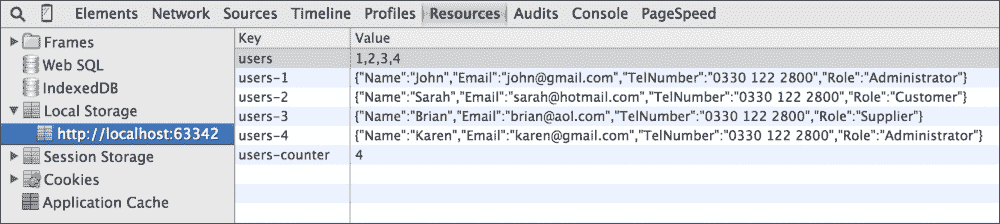

现在我们已经将记录保存在 LocalStorage 中，我们可以调用存储的`load`方法，就像我们使用 AJAX 代理做的那样，以检索这些已保存的记录并重新填充存储。

## REST 代理

许多 API 都是 RESTful 的，因此 Ext JS 提供了一个代理，使得与它们的集成变得极其简单。通过定义 REST 代理，我们的 CRUD 请求将执行到具有正确方法类型的端点。我们可以通过将类型更改为`rest`来更新我们的用户存储以使用 REST 代理（`Ext.data.writer.Rest`类）：

```js
proxy: {
  type  : 'rest',
  url   : 'users',
  reader: {
    type        : 'json',
    rootProperty: 'rows'
  }
}
```

现在我们有了我们的存储，通过使用 REST 代理，我们可以更新记录之一并同步存储，看到执行检索记录的`GET`请求和执行更新数据的`PUT`请求：

```js
Ext.getStore('Users').getAt(0).set('Email', 'john@hotmail.com');
Ext.getStore('Users').sync();
```

这里是它的截图：


# 数据关联

我们应用程序的数据模型之间始终存在关联，这些关联必须在我们的客户端应用程序中表示，以便它们可以轻松且一致地进行操作。Ext JS 提供了在模型类型之间建模一对一、一对多和多对多关系的功能。

## 一对多

当单个实体拥有多个不同类型的实体时，存在一对一关系。例如，一个作者*拥有许多*书籍或一个食谱*拥有许多*成分。在我们的示例项目中，我们将模拟用户和销售之间的关联——一个用户可以有多个销售，而每个销售只有一个用户。

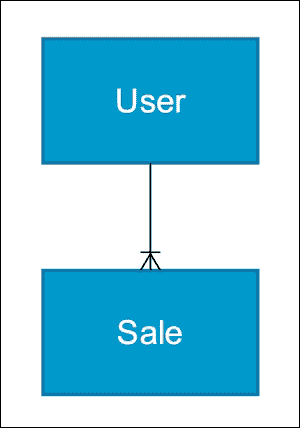

### 配置代理和数据源

我们将首先定义一个代理和简单的静态数据源，以便将我们的模型连接起来，这样它们就可以被填充。我们使用以下代码指向两个简单的 JSON 文件来完成此操作：

```js
Ext.define('BizDash.model.Sale', {
  extend: 'Ext.data.Model',
  ...
  proxy: {
    type : 'ajax',
    url : 'sale.json',
    reader: {
      type: 'json'
    }
  }
  ...
});

// sale.json
[
  {
    "id": 1,
    "userId": 1,
    "productId": 1,
    "Date" : "2014-08-04T14:41:17.220Z",
    "Quantity" : 1,
    "TotalCost": 9.99
  },
  {
    "id": 2,
    "userId": 1,
    "productId": 1,
    "Date" : "2014-08-03T14:41:17.220Z",
    "Quantity" : 2,
    "TotalCost": 19.98
  }
]

Ext.define('BizDash.model.User', {
  extend: 'Ext.data.Model',
  ...
  proxy: {
    type : 'ajax',
    url : 'user.json',
    reader: {
      type: 'json'
    }
  }
  ...
});

// user.json
{
  "id" : 99,
  "Name" : "Joe Bloggs",
  "Email" : "joe@gmail.com",
  "TelNumber": " 07777777777",
  "Role" : "Salesman"
}
```

### 定义关联

现在我们已经建立了基础设施，允许数据加载到每个模型中，我们可以定义这两个实体之间的关系。这可以通过两种方式完成：`hasMany`和`reference`。

#### hasMany 配置

`hasMany`配置选项是这些关联一直以来的创建方式，并允许我们定义相关的模型，以及每个模型的名称和数据源。这种方法允许对关联的细节有更明确的控制，使其更适合更定制的情况：

```js
Ext.define('BizDash.model.User', {
  extend: 'Ext.data.Model',
  ...
  hasMany: [
    {
      model: 'BizDash.model.Sale',
      name: 'sales'
    }
  ],
  ...
});
```

`hasMany`配置接受一个关联定义数组，并应包括一个模型选项，定义关联数据表示的模型名称，以及一个名称选项，该选项将用于访问关联数据。

要通过定义的代理访问关联数据，我们使用用户模型的静态`load`方法来加载 ID 为`1`的用户，并指定一个在成功加载时执行的回调函数：

```js
BizDash.model.User.load(1, {
  success: function(userRecord) {
  }
});
```

我们现在可以加载与该用户关联的销售记录。我们通过调用`sales`方法（根据我们在`hasMany`配置中给出的`name`配置命名）来完成此操作，这将返回一个包含我们的销售记录实例的`Ext.data.Store`实例。然后我们调用该存储的`load`方法，这将访问`sale.json`文件并返回相关的销售记录。在回调函数中，我们可以看到加载的数据项：

```js
BizDash.model.User.load(1, {
  success: function(userRecord) {
    userRecord.sales().load(function() {
      console.log('User: ', userRecord.get('Name')); // Joe Bloggs
      console.log('Sales: ', userRecord.sales().getCount()); // 2
    });
  }
});
```

### 引用配置

在 Ext JS 5 中定义关联的新方法是在模型字段上使用`reference`配置，这将把模型中的外键链接到相关模型类型。这极大地简化了关联的构建，并且意味着关联的两个方向都可以轻松访问。

以下代码展示了添加到`BizDash.model.Sale`模型的`reference`配置，将其链接到`BizDash.model.User`模型：

```js
Ext.define('BizDash.model.Sale', {
  extend: 'Ext.data.Model',
  fields: [
    ...
    {
      name: 'userId',
      type: 'int',
      reference: 'BizDash.model.User'
    },
    ...
  ]
});
```

我们现在可以使用相同的代码来加载用户及其关联的销售记录：

```js
BizDash.model.User.load(1, {
  success: function(userRecord) {
    userRecord.sales().load(function(){
      console.log('User: ', userRecord.get('Name')); // Joe Bloggs
      console.log('Sales: ', userRecord.sales().getCount()); // 2
    });
  }
});
```

这种技术还使得访问与用户关联的销售记录变得容易。我们利用生成的`getUser`方法，这是由于我们创建的引用而添加到销售记录中的。调用此方法将根据销售中定义的外键（`userId`）加载相关的用户模型：

```js
var saleRecord = Ext.create('BizDash.model.Sale', {
  id : 1,
  userId : 1,
  productId: 1,
  Date : new Date(),
  Quantity : 1,
  TotalCost: 9.99
});
saleRecord.getUser(function(userRecord){
  console.log(userRecord.get('Name')) // Joe Bloggs
});
```

### 探索请求

每次我们在关联中进行`load`或`getUser`调用时，都会向我们的服务器资源发送一个 AJAX 请求。在我们的案例中，我们只有简单的静态 JSON 文件，但在现实生活中，我们会有一个适当的服务器实现，它会根据请求的销售或用户返回正确的数据。如果我们查看开发者工具的**网络**选项卡，我们可以看到对`user.json`和`sale.json`文件的请求传递了参数，然后我们可以使用这些参数从我们的服务器数据库检索正确数据。

以下截图显示了 ID 为 1 的用户加载过程。它将 ID 值作为查询字符串参数传递：

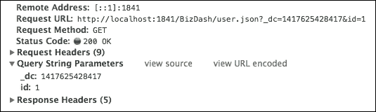

当加载与该用户相关的销售时，服务器会收到一个稍微复杂一些的 JSON 字符串，其中包含应用于检索正确数据的筛选器细节。在我们的服务器端代码中，我们会解析这个字符串并在数据库查询中使用它。

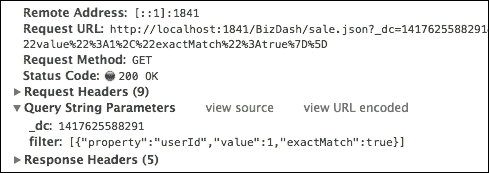

## 多对多

另一种可以建模的关系类型是多对多。在我们的应用中，我们想要定义产品和位置之间的多对多关系，这意味着一个产品可以存储在多个位置，而一个位置也可以拥有多个产品。例如，产品 1 可以位于仓库 1 和仓库 2，而仓库 1 可以存储产品 1 和产品 2。

### 配置代理和数据源

正如我们之前所做的那样，我们将首先定义一个代理和简单的静态数据源，以便将我们的模型连接起来，从而使它们可以被填充。我们使用以下代码指向两个简单的 JSON 文件：

```js
Ext.define('BizDash.model.Product', {
  extend: 'Ext.data.Model',
  ...
  proxy: {
    type : 'ajax',
    url : 'product.json',
    reader: {
      type: 'json'
    }
  }
  ...
});

// product.json
{
  "id" : 1,
  "Name" : "Product 1",
  "Description": "Product 1 Description",
  "Quantity" : 10,
  "Price" : 9.99
}

Ext.define('BizDash.model.Locations', {
  extend: 'Ext.data.Model',
  ...
  proxy: {
    type : 'ajax',
    url : 'location.json',
    reader: {
      type: 'json'
    }
  }
  ...
});

// location.json
[
  {
    "id" : 1,
    "Name" : "Location 1",
    "Row" : 20,
    "Shelf": 10
  },
  {
    "id" : 2,
    "Name" : "Location 2",
    "Row" : 11,
    "Shelf": 22
  }
]
```

### 定义关联

定义这种关系的最简单方法是在关联（产品与位置）两边的模型中添加`manyToMany`配置选项，并指定应该位于另一边的模型名称：

```js
Ext.define('BizDash.model.Product', {
  extend: 'Ext.data.Model',
  ...
  manyToMany: [
    'Location'
  ]
  ...
});

Ext.define('BizDash.model.Location', {
  extend: 'Ext.data.Model',
  ...
  manyToMany: [
    'Product'
  ]
  ...
});
```

### 加载关联数据

就像一对一关联一样，通过定义这个链接，Ext JS 将在产品和位置模型中分别生成名为`locations`和`products`的新方法。这些方法将返回一个`Ext.data.Store`实例，并包含我们的关联数据：

```js
BizDash.model.Product.load(1, {
  success: function(productRecord) {
    productRecord.locations().load(function() {
      console.log(productRecord.locations().getCount()); // 2
    });
  }
});
```

从位置记录中，可以以相同的方式加载相关的产品。

# 保存数据

现在我们能够成功地将数据加载到我们的应用程序中，我们可以继续将我们在客户端应用程序中对这些数据的更改持久化。在大多数应用程序中，当对数据存储或记录进行更改时，我们希望将此更改持久化回数据源，无论是服务器端数据库还是 LocalStorage 存储。如前所述，Ext JS 为我们提供了`Ext.data.writer.Writer`类（及其子类）来管理需要写入的字段。

在其最简单和标准的形式中，存储将在调用`sync`方法时保存所做的任何更改，而无需进一步添加到我们的`proxy`配置中。

如果我们继续使用我们的用户存储示例，我们可以更新一个`record`字段，然后调用`sync`方法：

```js
Ext.getStore('Users').getAt(0).set('Email', 'john@hotmail.com');
Ext.getStore('Users').sync();
```

如果我们检查开发者工具的**网络**标签页，我们将看到向我们的`users.json`文件发送`POST`请求，传递更改的字段和记录的 ID：

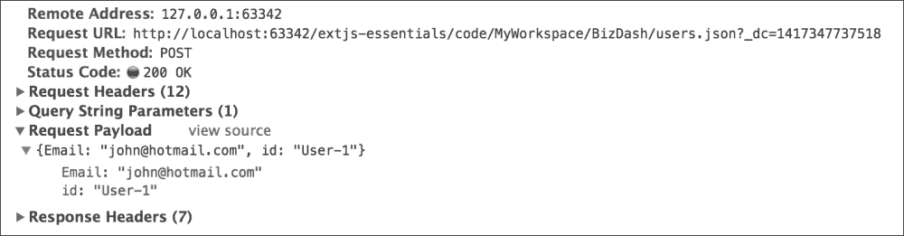

同样，我们可以添加或删除记录，并调用`sync`方法，这将触发一个等效的`POST`请求：

```js
Ext.getStore('Users').add({
  Name: 'Stuart',
  Email: 'stuart@gmail.com',
  Role: 'Customer',
  TelNumber: ' 0330 122 2800'
});
Ext.getStore('Users').sync();
```

这是请求的截图：

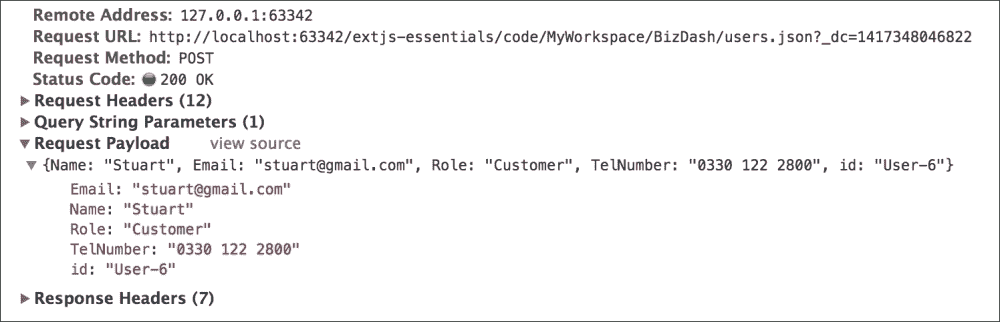

在记录添加后，前面的请求显示了所有字段作为`POST`参数被发送：

```js
Ext.getStore('Users').removeAt(0)
Ext.getStore('Users').sync();
```

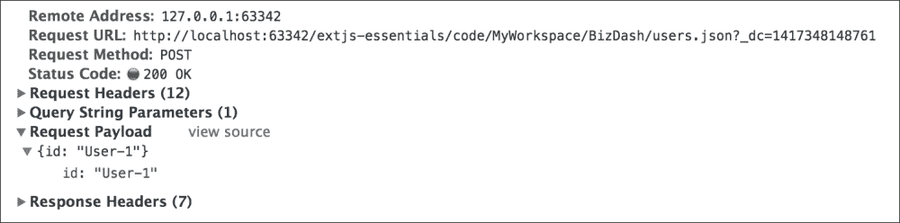

当记录被删除时，`id`字段将被发送到服务器。

## CRUD 端点

显然，前面的例子有点不完善，因为我们正在将更改 POST 到静态 JSON 文件。默认情况下，Ext JS 将发送所有更改到代理中指定的 URL，无论它们是添加、更新还是删除。当存在针对这些操作的单独端点时，这通常是不希望的。我们可以轻松配置我们的代理以使用`api`配置属性联系不同的端点。我们的`proxy`配置可以重写如下：

```js
proxy: {
  type  : 'ajax',
  url   : 'users.json',
  api   : {
    create : 'user-add.php',
    read   : 'users.json',
    update : 'user-update.php',
    destroy: 'user-delete.php'
  },
  reader: {
    type        : 'json',
     rootProperty: 'rows'
  }
}
```

如果我们重新运行添加、更新和删除操作，我们将看到对我们在`api`配置中指定的每个 PHP 文件的调用。

## 数据写入者

数据写入器使我们能够控制如何构建存储的数据以发送保存，并为我们提供了各种选项来自定义此过程。默认情况下，代理将使用 JSON 写入器（`Ext.data.writer.Json`），这将导致要保存的数据被编码为 JSON 字符串。或者，可以使用 XML 写入器（`Ext.data.writer.Writer`），这将数据作为 XML 传输。

要定义一个写入器，我们使用代理的 `writer` 配置，并给它一个自己的配置对象。`type` 属性确定使用哪个写入器类——要么是 JSON，要么是 XML。

我们可以配置我们的用户存储使用 JSON 写入器，如下所示：

```js
proxy: {
  ...
  writer: {
    type: 'json'
  }
}
```

现在，我们将查看写入器类提供的几个配置选项，以允许我们自定义如何以及发送哪些数据到服务器。

在我们之前的更新示例中，我们看到了编辑的字段（在这种情况下是 `Email` 字段）被发送，以及记录的 ID，到服务器。有时，我们可能希望无论是否已编辑，都发送所有字段到服务器。我们可以通过使用 `writeAllFields` 配置轻松完成此操作，如下所示：

```js
proxy: {
  ...
  writer: {
    type: 'json',
    writeAllFields: true
  }
}
```

这是此更新请求的截图：

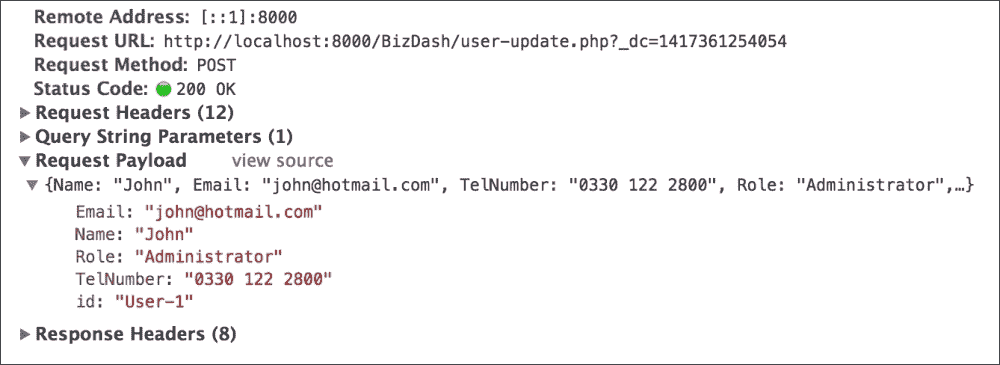

有时，在数据被发送到服务器之前，你可能想要对数据集进行一些额外的处理。我们可以通过使用 `transform` 配置来定义这个额外的处理步骤，给它一个在写入过程中执行的功能。这个函数将接受将要发送的 `data` 对象，并应返回处理后的 `data` 对象。以下示例显示了如何确保给定的电子邮件地址始终是小写：

```js
proxy: {
  ...
  writer: {
    type : 'json',
    writeAllFields: true,
    transform : {
      fn: function(data, request) {
        data.Email = data.Email.toLowerCase();
        return data;
      }
    }
  }
}
```

# 摘要

在本章中，我们探讨了如何使用 Ext JS 对应用程序的数据结构进行建模的细节。我们涵盖了：

+   定义模型

+   将数据加载和保存到服务器和 LocalStorage

+   通过关联定义模型之间的关系

+   如何在数据存储中处理数据

我们将在本书的其余部分利用所有这些课程，随着我们的示例应用程序逐渐成形，并开始将其与数据源和数据可视化集成。
