# 第八章. 使用 SASS 创建独特的视觉和感觉

自从 Ext JS 从其开始以来，在设计方面取得了长足的进步，并且将新设计应用于框架的容易程度也得到了提高。

它原始的蓝色主题是使其对开发者非常有吸引力的事物，但现在已经过时且过度使用。Ext JS 5 现在包括六个主题和一系列选项来自定义它们以及创建你自己的。

在本章中，我们将讨论如何：

+   将不同的主题应用到你的应用程序

+   创建你自己的自定义主题

+   使用 SASS 变量自定义基本应用程序视觉

+   创建自定义组件 UI

# 将主题应用到你的应用程序

当你使用 Sencha Cmd 生成新的 Ext JS 应用程序时，它将自动使用海王星主题。这是最新主题之一，看起来非常干净和现代：

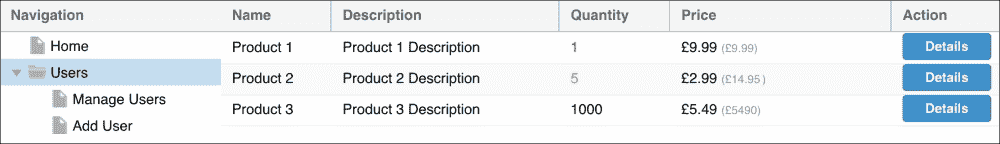

如前所述，Ext JS 包含了总共六个主题，如下所示：

+   海王星

+   海王星触摸（海王星的手势友好版本）

+   清晰

+   清晰触摸（清晰的手势友好版本）

+   经典

+   灰色

在以下屏幕截图中查看这些主题：

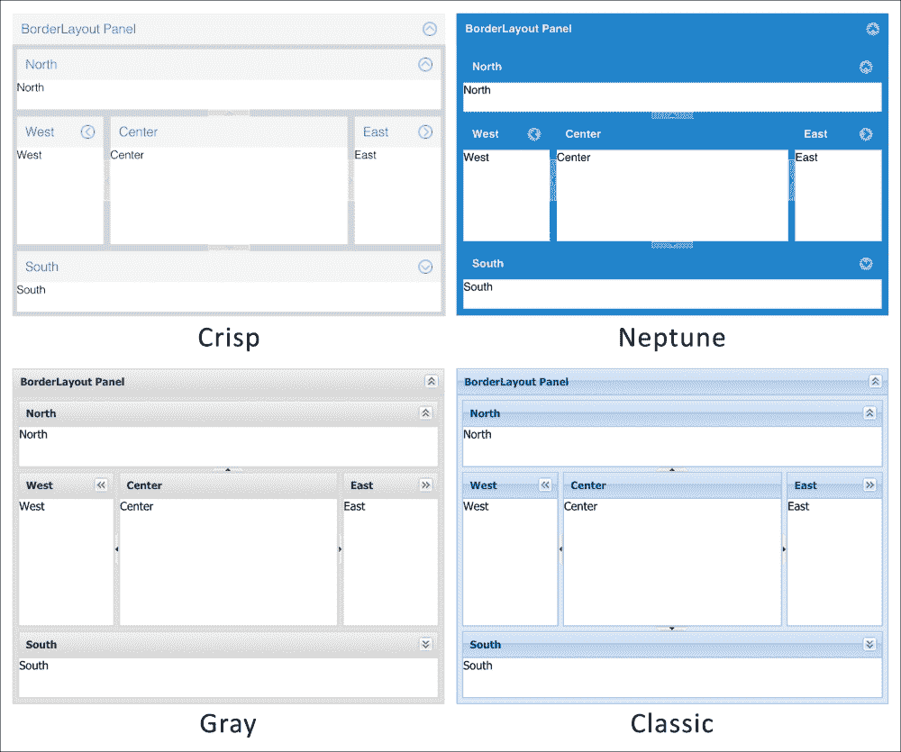

如果你导航到项目中的 `ext` 目录并查看 `packages` 文件夹，你会看到所有可用的主题包。

## 配置新主题

你可以轻松地更改应用程序使用的主题，只需进行一次配置更改。在你的应用程序文件夹中，打开 `app.json` 文件。此文件用于配置应用程序的不同方面以及它的加载和构建方式。

你应该在文件顶部附近看到一个名为 `theme` 的项目。我们将编辑此属性的值并将其更改为 `ext-theme-crisp`：

```js
"theme": "ext-theme-crisp"
```

为了使此更改生效，我们必须使用以下命令从 `BizDash` 文件夹重新构建应用程序：

```js
sencha app build
```

这将重新生成应用程序的 CSS 文件，并包含新主题的样式。

在浏览器中刷新应用程序现在应该显示应用了清晰主题的效果：

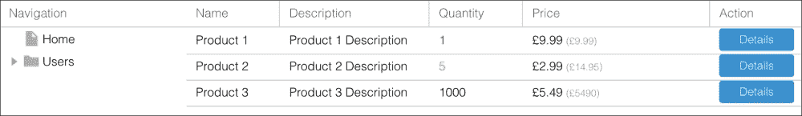

# 创建自定义主题

现在我们知道了如何切换应用程序的主题，我们将继续创建我们自己的自定义主题。

## 主题架构

如您从我们对 Ext JS 包夹的探索中注意到的，主题被设计为与 Sencha Core 和 Sencha Charts 一样作为包。这意味着它们可以在应用程序之间移植，并且独立于我们的应用程序代码。

主题包也是按照继承层次结构构建的，它们建立在常见的主题包之上。以下图表显示了每个包如何相互关联以及基本样式如何在它们之间共享：

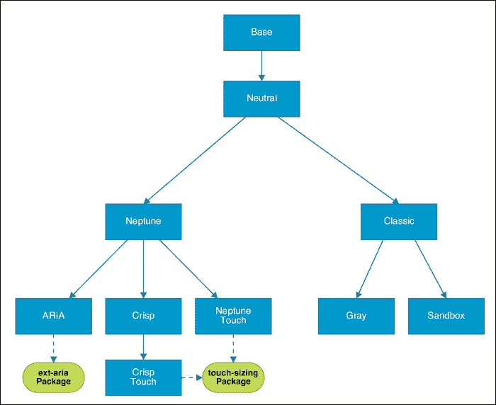

## 生成主题包

首先，我们必须使用 Sencha Cmd 生成一个空白主题包。为此，我们打开终端并导航到我们的 `BizDash` 项目文件夹。

接下来，我们运行以下命令来生成一个基本的新主题：

```js
sencha generate theme bizdash-theme
```

我们使用`generate`命令，你可能还记得在本书前面的内容，但这次我们告诉它生成一个名为 bizdash-theme 的主题。

执行后，我们应该在我们的工作区包文件夹中看到一个新文件夹：

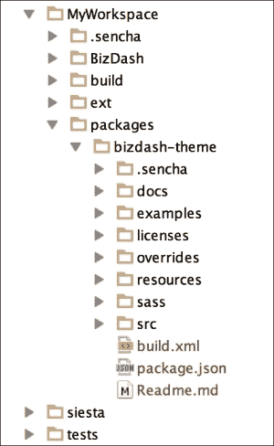

## 主题的解剖结构

在我们的新主题包中，应该有我们在常规代码包中期望的所有文件和文件夹。我们最感兴趣的是处理以下内容：

+   `package.json`：这是定义所有包的详细信息和配置的地方

+   `sass/var`：这将是我们放置所有 SASS 变量覆盖的地方

+   `sass/src`：这是我们定义单个组件样式的位置

+   `sass/etc`：这是放置任何与组件文件无直接关联的杂项 SASS 文件的位置

## 跨浏览器样式

Ext JS 的一个巨大好处是它对旧浏览器的支持。那么，我们这些闪亮的新主题如何应对这些旧浏览器呢？Ext JS 在渲染不同浏览器时非常聪明，并为不支持 CSS3 属性（如渐变和圆角）的浏览器使用不同的样式。这些旧浏览器会得到图像精灵来显示这些设计特性，因此，完全相同的设计可以在所有浏览器中复制。

在 Sencha Cmd 构建过程中，一个包含所有框架组件的示例页面在一个无头浏览器中渲染，并对其进行了快照。然后，这个快照被切割成所需的精灵，并按需使用。

## 主题继承

正如我们之前提到的，主题扩展其他主题，并在每个级别定义的样式上构建。默认情况下，我们的新主题将扩展 ext-theme-classic 主题，并且看起来与它完全相同。

我们可以通过在 IDE 中打开包的`package.json`文件来更改我们新主题的基础主题。在这个文件中，我们可以更新`extend`属性为我们想要扩展的主题的名称。我们可以将其更改为扩展 Crisp 主题：

```js
"extend": "ext-theme-crisp"
```

### 应用新主题

现在我们已经设置了一个基本主题，我们可以以应用内置主题相同的方式将其应用到我们的应用程序中。我们修改应用程序的`app.json`文件，并将包含的主题名称更改为 bizdash-theme：

```js
"theme": "bizdash-theme"
```

在重新构建应用程序并刷新浏览器后，我们将看到我们的应用程序显示我们的新主题（尽管目前它看起来就像 Crisp 主题）。

# 基本主题定制

现在我们已经设置了一个自定义主题，我们想要开始让它变得独特，并从基础主题继承的默认设置中脱离出来。

## 主题变量

Ext JS 主题是用 SASS 创建的，并将大量设计控制权交给了 SASS 变量。通过修改这些变量，我们可以非常容易地对我们的主题进行基本修改。

SASS 是一种 CSS 预处理器，它引入了一种更简洁、更功能化的 CSS 编写方式。它引入了变量、嵌套规则、选择器继承和 mixin 等概念，这些概念在编写大型应用程序的 CSS 时非常有用。

框架中的每个组件都有自己的变量集，这将修改特定组件的外观。我们可以在文档中找到变量列表，包括该组件定义的方法、配置和事件。

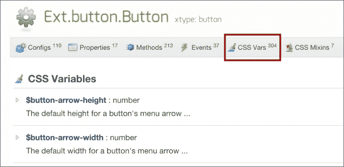

要在我们的主题中定义这些变量之一，我们必须在主题包的`sass/var`文件夹中创建一个新的 SCSS 文件。这些 SCSS 文件应与我们的 JavaScript 文件结构相匹配。例如，为`Ext.button.Button`类定义变量应放在名为`sass/var/button/Button.scss`的文件中。在`sass/src`文件夹中创建新样式时应遵循此模式。

现在，我们将演示如何使用 SASS 变量自定义 UI 的一些区域。

## 更改主颜色

一个常见的场景是我们希望将主题的主颜色更改为与我们的企业颜色相匹配。这可以通过`$base-color`变量轻松完成，该变量可以分配任何有效的 HTML 颜色代码。

此变量是`Ext.Component`类的一部分，因此必须在名为`sass/var/Component.scss`的文件中定义。要将基本颜色更改为红色，请在文件中包含以下代码：

```js
$base-color: #FF0000 !default;
```

`!default`后缀将允许在扩展此主题的主题中覆盖变量。

如果我们重新构建我们的应用程序并刷新浏览器，我们将看到这对我们应用程序的影响：

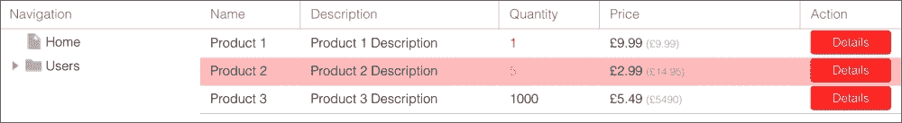

## 更改字体大小

我们可以通过包含带有新大小值的`$font-size`变量来快速更改应用程序中使用的字体大小。以下代码将字体大小增加到 16 px：

```js
$font-size: 16px !default;
```

## 更改按钮颜色

我们已经看到，更改`$base-color`变量导致我们的按钮以新颜色渲染。我们可以通过覆盖`$button-default-background-color`变量来为按钮选择不同的颜色。

我们创建一个名为`sass/var/button/Button.scss`的新 SCSS 文件，并添加以下代码来更改颜色：

```js
$button-default-background-color: #0000FF !default;
```

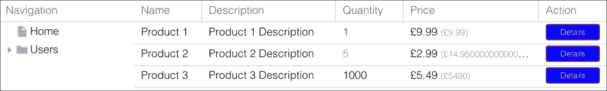

# 自定义组件 UI

Ext JS 组件可以在创建时通过提供不同的`ui`配置来单独自定义。这改变了添加到组件中的 CSS 类，使它们具有不同的外观，而与其他类型的组件分离。例如，你可能希望操作按钮为绿色，取消按钮为灰色，但所有其他按钮为默认颜色。

## 定义 UI

我们通过包含一个 SASS 混合并使用我们所需的颜色和设置来配置它来定义一个 UI。SASS 混合是一组组合在一起的样式规则，因此可以在多个地方重复使用，并通过传递参数值来定制。

我们将创建本章前面提到的两个 UI，用于我们的`ProductForm`的`save`和`cancel`按钮。

我们首先在`bizdash-theme`包文件夹内的`sass/src/button`文件夹中创建一个`Button.scss`文件。这个文件夹结构反映了`Ext.button.Button`组件类，因此在`sencha app build`过程中将被拾取和编译。

在此文件中，我们包含了`extjs-button-small-ui`混合：

```js
@include extjs-button-small-ui( );
```

然后我们定义 UI 的名称，该名称将用于将样式应用于按钮。我们使用`$ui`参数名称，并将其命名为`action`：

```js
@include extjs-button-small-ui(
  $ui: 'action'
);
```

接下来，我们定义按钮的背景颜色、文本颜色和边框颜色：

```js
@include extjs-button-small-ui(
  $ui: 'action',
  $background-color: #008000,
  $color: #FFFFFF,
  $border-color: transparent
);
```

我们可以为`cancel`按钮重复此操作，并将类似的混合添加到`Button.scss`文件中：

```js
@include extjs-button-small-ui(
  $ui: 'cancel',
  $background-color: #EBEBEB,
  $color: #000000,
  $border-color: transparent
);
```

现在这些都已经就绪，我们使用`BizDash`文件夹内的`sencha app build`命令重新构建应用程序。

## 应用 UI

现在我们有两个 UI 样式准备应用于我们应用程序中的按钮。要应用这些样式，我们使用`ui`配置选项。添加后，此选项将添加一个新 CSS 类，该类是在上一步中由我们的混合生成的，并将其添加到组件中：

在`ProductForm`类中，我们的`button`配置变为：

```js
...
  bbar : [
    {
      xtype    : 'button',
      text     : 'Save',
      ui       : 'action',
      listeners: {
        click: 'onSave'
      }
    },
    {
      xtype    : 'button',
      text     : 'Cancel',
      ui       : 'cancel',
      listeners: {
        click: 'onCancel'
      }
    }
  ]
  ...
```

在我们的浏览器中刷新应用程序后，我们可以看到新的按钮样式已经就绪。检查 DOM 显示已添加到每个按钮的新 CSS 类：


以下截图显示了新的 CSS 类：

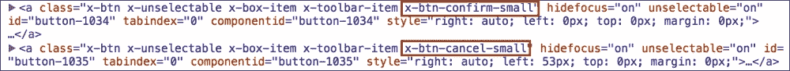

# 其他 UI

框架中的大多数组件都有混合，允许我们定义不同的组件样式。现在我们将演示如何为`Ext.Panel`组件创建一个替代 UI。

如果你在 Ext JS 文档中找到`Ext.Panel`，你将在**CSS Mixins**下拉菜单下看到一个条目。我们将使用此条目来定义我们自己的 UI，我们首先在文件夹`sass/src/panel/Panel`中创建一个`Panel.scss`文件。

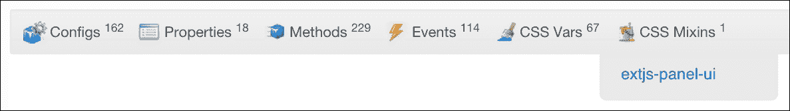

我们将此内容包含在我们的`Panel.scss`文件中，并开始配置我们想要的样式。您可以在文档中查看所有可用的选项，但我们将自定义页眉背景颜色、边框颜色和边框半径，如下所示：

```js
@include extjs-panel-ui(
  $ui: 'product',
  $ui-border-color: #78CCFC,
  $ui-border-radius: 5px,
  $ui-header-background-color: #78CCFC
);
```

这个 UI 选项可以以与我们处理按钮完全相同的方式添加到`ProductForm`中，使用`ui`配置：

```js
...
    ui: 'product',
...
```

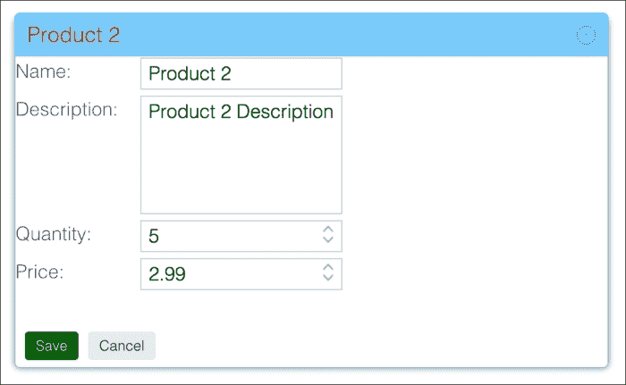

# 摘要

在本章中，我们探讨了如何通过使用自定义主题来定制我们的 Ext JS 应用程序的外观和感觉。我们探讨了主题是如何构建的以及它们是如何相互继承的。

我们还展示了如何通过使用全局 SASS 变量和组件混合来创建和自定义一个新的主题。

下一章将专注于通过使用图表在我们的应用程序中可视化数据。
