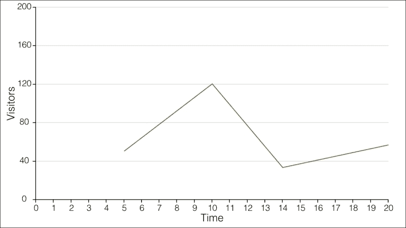
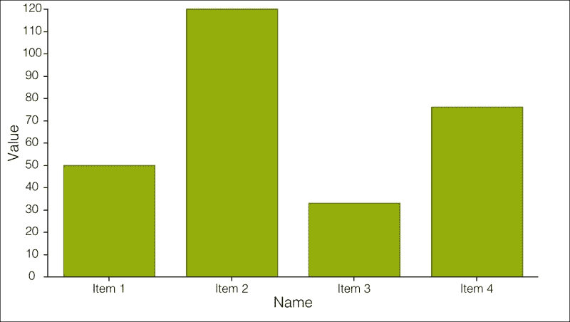
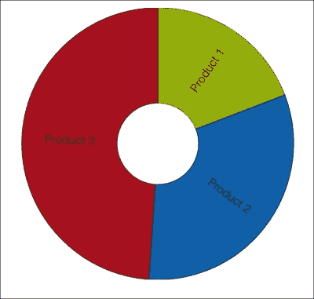
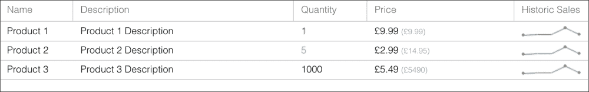

# 第九章。可视化应用程序的数据

本章将演示如何使用图表和图形来可视化您的数据。它将重点介绍最受欢迎的图表类型以及如何将数据源与它们集成。我们还将讨论如何将可视化集成到其他组件中，例如网格。

我们将涵盖与图表相关的最常见主题。以下是一些：

+   理解可视化技术和 Ext JS 中图表的工作原理

+   常见图表的示例和说明，包括：

    +   折线图

    +   柱状图

    +   饼图

+   将这些可视化集成到其他组件中，例如网格

# 图表组件的解剖结构

Ext JS 提供了一个非常灵活且功能丰富的图表工具包，用于向用户直观地展示数据。为了充分利用图表包，了解图表的解剖结构是值得的。

## 系列

在 Ext JS 中，系列基本上是图表类型。系列是图表中最复杂的一部分，负责处理元素如何动画、显示或隐藏。此外，系列还处理数据的标签。

例如，如果应用程序需要柱状图，那么您需要关注的是柱状图或柱状图 3D 系列类。

Ext JS 5 默认提供的以下图表：

+   柱状图（以及 3D 变体）

+   OHCL/蜡烛图

+   面积图

+   饼图（以及 3D 变体）

+   折线图

+   仪表盘

+   散点图

+   雷达图

+   极坐标图

## 轴

与任何其他图表一样，您通常需要为图表组件定义轴。数值轴和类别轴是最常用的。如果需要非标准的东西，框架提供了一系列布局和分段数据的方法。

## 标签

图表标签只是显示数据点标签的一种方式。Ext JS 使我们能够自定义这些标签的显示和动画。

## 交互

交互简单地指的是用户如何与图表交互。例如，使用交互可能允许用户单击并拖动图表的一部分来放大数据。

# 创建折线图

折线图是最常用的图表类型之一，最适合表示趋势数据，这些数据通常定期更新，并需要实时分析。

Ext JS 图表包的一个巨大优势是我们可以在实时中处理数据。这可以通过多种方式实现：

+   简单地定期轮询以获取更新

+   将存储绑定到 `WebSocket` 并从服务器端推送更新

为了继续我们的 BizDash 商业仪表板的主题，我们将创建一个折线图，显示目前有多少人正在访问我们的网站。

## 创建存储和模型

正如我们在第五章中看到的，“为您的 UI 建模数据结构”，我们需要首先定义一个模型来表示存储检索的个别记录。

在我们深入了解创建折线图之前，我们需要创建一个存储和模型。在我们的应用程序中还没有`WebSiteVisitor`模型。所以，让我们创建一个：

```js
// app/model/WebSiteVisitor.js
Ext.define('BizDash.model.WebSiteVisitor', {
  extend: 'Ext.data.Model',
  fields: [
    {
      name: 'Time',
      type: 'int'
    },
    {
      name: 'Visitors',
      type: 'int'
    }
  ]
});

// app/store/WebSiteVisitors.js
Ext.define('BizDash.store.WebSiteVisitors', {
  extend: 'Ext.data.Store',
  model: 'BizDash.model.WebSiteVisitor',
  proxy: {
    type : 'ajax',
    url : 'visitors.json',
    reader: {
      type : 'json',
      rootProperty: 'rows'
    }
  }
});
```

## 轮询服务器获取新数据

要让我们的存储每 10 秒轮询服务器一次，并使用`setInterval`或类似方法绘制该时刻的访问次数，是非常直接的：

```js
setInterval(function(){
  store.load({
    addRecords: true
  });
}, 10000);
```

`addRecords`配置传递给存储的`load`方法。通过将此属性设置为`true`，通过加载操作检索的新记录将附加到现有数据集，而不是替换已经存在的记录，这是默认行为。

图表的配置本身非常简单。我们将在一个新的视图中这样做，以保持与我们的应用程序的其他部分一致：

```js
Ext.define('BizDash.view.chart.SiteVisits', {
  extend: 'Ext.chart.CartesianChart',
  xtype: 'chart-SiteVisits',
  config: {
    animate: true,
    store : 'WebSiteVisitors',
    series : [
      {
        type : 'line',
        smooth: false,
        axis : 'left',
        xField: 'Time',
        yField: 'Visitors'
      }
    ],
    axes : [
      {
        type : 'numeric',
        grid : true,
        position : 'left',
        fields : ['Visitors'],
        title : 'Visitors',
        minimum : 0,
        maximum : 200,
        majorTickSteps: 5
      },
      {
        type : 'numeric',
        position : 'bottom',
        fields : 'Time',
        title : 'Time',
        minimum : 0,
        maximum : 20,
        decimals : 0,
        constrain : true,
        majorTickSteps: 20
      }
    ]
  }
});
```

这就是它的样子：



我们创建的折线图设置在一个相当标准的方式。两个数值轴绑定到`WebSiteVisitor`模型内的整数字段。线条本身是通过`Ext.chart.series.Line`类显示的，它通过`xField`和`yField`属性与数据相关联。

# 在柱状图中展示数据

柱状图是向用户展示定量数据的一种极其有用的方式。我们将快速演示如何创建柱状图，并从服务器异步加载数据。

与折线图一样，我们需要一个模型和存储来开始：

```js
// app/model/BarChart.js
Ext.define('BizDash.model.BarChart', {
  extend: 'Ext.data.Model',
  fields: [
    {
      name: 'name',
      type: 'string'
    },
    {
      name: 'value',
      type: 'int'
    }
  ]
});

// app/store/BarChart.js
Ext.define('BizDash.store.BarChart', {
  extend: 'Ext.data.Store',
  model: 'BizDash.model.BarChart',
  proxy: {
    type : 'ajax',
    url : 'path/to/your/datasource',
    reader: {
      type : 'json',
      rootProperty: 'data'
    }
  },
  autoLoad: true
});
```

在这个虚构的例子中，从服务器返回的数据必须有一个`name`和`value`属性，因为我们已经将这些定义为模型中的字段。

在本例中定义的存储用作我们数据的客户端缓存。通过将`BarChart`模型关联到存储，我们确保数据在图表组件中正确表示。

现在存储已经准备好了，我们只需要一个组件来绑定它。现在我们将创建一个新的视图`BizDash.view.chart.BarChart`，其中包含一个带有柱状系列的笛卡尔图表。这为我们提供了基本的图表功能，我们可以添加轴和系列，并将存储绑定到它。

轴用于定义图表的边界，在本例中，创建水平和垂直轴。系列负责在图表上渲染数据点。在这里，我们使用了`Ext.chart.series.Bar`类来创建一个简单的柱状图。在柱状图配置中，`xField`和`yField`必须包含我们在模型中定义的相同名称的字段。

```js
Ext.define('BizDash.view.chart.BarChart', {
  extend: 'Ext.chart.Chart',
  xtype: 'chart-BarChart',
  config: {
    animate: true,
    store : 'BarChart',
    axes : [
      {
        type : 'numeric',
        position: 'left',
        fields : ['value'],
        title : 'Value'
      },
      {
        type : 'category',
        position: 'bottom',
        fields : ['name'],
        title : 'Name'
      }
    ],
    series : [
      {
        type : 'bar',
        axis : 'bottom',
        xField: 'name',
        yField: 'value'
      }
    ]
  }
});
```

这就是图表现在的样子：



# 在 Ext JS 中创建饼图

饼图是一种非常常见的图表类型，非常适合表示比例数据，其中饼图的每一块等于该块相对于整个数据集总和的百分比。

在本节中，我们将演示如何创建一个饼图，以展示我们仓库中产品（按库存水平）的分布情况。

我们已经在本书中定义了产品存储和模型（第五章，*为您的 UI 建模数据结构*，和第七章，*构建常见 UI 小部件*）。作为提醒，以下是我们定义的内容：

```js
Ext.define('BizDash.model.Product', {
  extend: 'Ext.data.Model',
  fields: [
    {
      name: 'Name',
      type: 'string'
    },
    {
      name: 'Description',
      type: 'string'
    },
    {
      name: 'Quantity',
      type: 'int'
    },
    {
      name: 'Price',
      type: 'float'
    }
  ]
});
Ext.define('BizDash.store.Products', {
  extend: 'Ext.data.Store',
  model: 'BizDash.model.Product',
  autoLoad: true,
  proxy: {
    type : 'ajax',
    url : 'products.json',
    reader: {
      type : 'json',
      rootProperty: 'rows'
    }
  }
});
```

现在我们已经组织好了存储和模型，我们需要为我们的饼图创建一个新的视图：

```js
Ext.define('BizDash.view.chart.StockLevelPie', {
  extend: 'Ext.chart.PolarChart',
  xtype: 'chart-StockLevelPie',
  config: {
    animate : true,
    store : 'Products',
    interactions: 'rotate',
    series : {
      type : 'pie',
      label : {
        field : 'Name',
        display: 'rotate'
      },
      xField: 'Quantity',
      donut : 30
    }
  }
});
```

惊人的是，就这么简单。您可以在以下图像中看到输出：



与其他具有极坐标的图表一样，`Ext.chart.PolarChart`类为我们特定的图表类型提供了基础设施和画布以进行渲染。

我们使用饼图系列类型，让`Ext.chart.series.Pie`类处理绑定存储中的记录，并将其转换为一系列精灵以形成图表。此系列将存储中的每个记录转换为饼图的切片。

此系列类型最重要的配置是`xField`。这告诉系列我们的模型字段中哪个字段包含用于计算每个记录切片大小的数值。

我们通过使用`labels`属性配置`Ext.chart.Label`混合，并将其应用于`Ext.chart.series.Pie`类，为图表添加标签。这些选项允许我们配置标签的位置和样式。通过选择`display`属性的旋转值，标签将定位在切片的长度上。在讨论图表的外观时，也许值得强调的是，`donut`配置是饼图中中间挖空的孔的半径（以百分比表示）。

# 在网格中集成可视化

网格小部件是 Ext JS 最知名的功能之一，该框架现在支持小部件列的概念。小部件列允许您嵌入一个小部件，与标准组件不同，它是一个轻量级组件，渲染和更新速度快。小部件非常适合网格，在网格中您可能同时显示数十个小部件。

Ext JS 5 引入了多个轻量级网格小部件，但毫无疑问，Sparkline 小部件是展示网格中图表的完美小部件。它是一个超轻量级的图表，旨在用最小的空间表示一系列值。

有许多不同的 Sparkline 可以工作：

+   柱状图

+   线形图

+   饼图

+   项目符号

+   范围图

+   三态

+   箱线图

为了演示 Sparkline 的实际应用，我们将回到第七章，*构建常见 UI 小部件*，并利用我们的`product`网格：

```js
Ext.define('BizDash.view.product.ProductGrid', {
  extend: 'Ext.grid.Panel',
  xtype: 'product-ProductGrid',
  store: 'Products',
  columns: [
    {
      text: 'Name',
      dataIndex: 'Name'
    },
    {
      text: 'Description',
      dataIndex: 'Description',
      flex: 1
    },
    {
      text: 'Quantity',
      dataIndex: 'Quantity'
    },
    {
      text: 'Price ',
      dataIndex: 'Price'
    }
  ]
});
```

一个 Sparkline 图必须附加到单个数据字段，该字段包含将要绘制的点数组。为了演示这个功能，我们将向我们的 Product 模型添加一个`HistoricSales`字段，该字段将保存我们将要绘制的数据：

```js
Ext.define('BizDash.model.Product', {
  extend: 'Ext.data.Model',
  ...
  fields: [
    ...
    {
      name: 'HistoricSales',
      type: 'auto',
      defaultValue: [4, 9, 12, 66, 9]
    }
  ]
});
```

这个网格已经绑定了一个存储和模型，所以只需将一个新的 `widgetcolumn` 添加到 `columns` 数组中，如下所示：

```js
Ext.define('BizDash.view.product.ProductGrid', {
  extend: 'Ext.grid.Panel',
  columns: [
    ...
    {
      text : 'Historic Sales',
      xtype : 'widgetcolumn',
      dataIndex: 'HistoricSales',
      widget : {
        xtype: 'sparklineline'
      }
    }
  ]
});
```

`widget` 配置允许我们指定将在列中渲染的 sparkline 的 xtype（可能的值包括 `sparklinebar`、`sparklinepie`、`sparklinebullet` 和 `sparklinediscrete`）。以下截图显示了如何渲染此线形图：



# 摘要

在本章中，我们探讨了将图表可视化添加到我们的 Ext JS 应用程序中的细节。我们：

+   介绍了图表创建的基础知识

+   理解了图表的组成部分

+   建立了一个折线图

+   建立了一个柱状图

+   建立了一个饼图

+   将可视化集成到网格中

下一章将深入探讨如何通过教授你如何编写可测试的 JavaScript 和单元测试来测试你的 Ext JS 应用程序。
