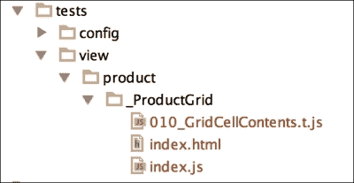

# 第十章.通过单元和 UI 测试确保代码质量

在我们添加新功能、重构现有功能以及最终发布产品时，对我们的代码质量和功能充满信心是至关重要的。

如果没有自动检查我们代码的流程，我们总会担心我们的更改会对应用程序的其他部分产生什么影响。引入错误和发现错误之间的时间延长，导致解决它们的成本大幅上升。

本章将重点介绍我们如何确保我们的代码具有高标准，并且始终按预期工作。我们将探讨以下主题：

+   编写可测试 JavaScript 的最佳实践

+   将测试置于开发流程核心的开发方法

+   Siesta 测试框架简介

+   如何编写单元测试

+   如何编写 UI 测试

+   如何将测试集成到开发工作流程中

# 编写可测试的 JavaScript

JavaScript 一直是一种难以测试的语言。这很大程度上是由于它被使用的非结构化性质以及将其撒入页面以添加小效果和功能片段的倾向。这意味着隔离小段代码以进行测试变得极其困难，因此，往往根本不进行测试。

现在，JavaScript 被用来编写严肃的应用程序，开发者正在基于框架，如 Ext JS，为他们的项目引入更严格的架构。这种结构使得测试功能单元变得更加容易，并为我们提供了更简单的场景来工作和构建测试。

尽管使用 Ext JS 编写应用程序已经使你朝着更可测试的代码迈出了重要一步，但还有一些良好的实践需要遵循，以确保事情更加简单，我们将在本节中探讨这些内容。

## 单一职责

通过确保你的类和方法只负责单一的功能部分，意味着测试该功能变得更加容易，因为输入和输出更加清晰。

例如，有一个方法，在按钮点击时，将更新应用程序的三个部分，这个方法将非常复杂。为了测试这个单一的方法，我们需要所有三个区域都可用，并在每个区域检查适当的结果。

如果我们将这些提取为三个独立的方法，我们就可以单独测试每个方法，并专注于该函数及其结果。

## 可访问的代码

如果我们的代码库中的函数是**私有的**（即，例如，通过闭包无法从外部代码访问），那么我们将无法测试它或模拟它。这种方法使得测试这些私有函数变得不可能，并且测试依赖于它们的函数变得非常困难，因为它们可能需要被模拟。

因此，有时有必要将这些私有函数公开化，以帮助测试。

## 嵌套回调

深层嵌套的回调函数非常难以测试，因为它们都是私有的，并且依赖于许多条件来对它们进行测试。这与之前提到的使代码可访问性的观点密切相关。与其嵌套大量的回调，不如考虑将它们提取到成员函数中。以下示例展示了处理 `async` 调用的函数无法进行测试：

```js
Ext.define('MyClass', {
  doAction: function(){
    Ext.Ajax.request({
      url: 'action.php',
      success: function(response){
        OtherClass.async(response.value, function(newValue){
          AnotherClass.async(newValue, function(){
          // finished!
          });
        });
      }
    });
  }
});
```

这可以通过使用可以单独测试的成员函数来重构。此外，代码更加整洁，避免了大量的嵌套回调。

```js
Ext.define('MyClass', {
  doAction: function(){
    Ext.Ajax.request({
      url: 'action.php',
      success: this.onActionSuccess
    });
  },
  onActionSuccess: function(response){
    OtherClass.async(response.value, this.onOtherClassAsync);
  },
  onOtherClassAsync: function(newValue){
    AnotherClass.async(newValue, this.onAnotherClassSync);
  },
  onAnotherClassSync: function(){
  // finished!
  }
});
```

## 将事件处理程序与操作分离

当将功能附加到事件时，我们通常在同一个函数内执行操作。以下示例展示了按钮点击处理程序，它基于网格中选定的行向用户发送删除请求：

```js
onDeleteButtonClick: function(btn) {
  var grid = btn.up('gridpanel'),
  selectedUserModel = grid.getSelection()[0];
  Ext.Ajax.request({
    url : 'deleteUser.php',
    params : {
      userID: selectedUserModel.get('userID')
    },
    success: this.onUserDeleteSuccess,
    failure: this.onUserDeleteFailure,
    scope : this
  });
}
```

这段代码的问题在于，为了测试删除用户，我们需要有一个网格和一个选定的行可用，这设置起来很麻烦。更好的做法是从处理程序中提取操作，这样就可以在不需要设置代码的情况下测试操作。这还有一个额外的优点，即可以从不同的上下文中执行；例如，从删除键处理程序中执行。

```js
onDeleteButtonClick: function(btn) {
  var grid = btn.up('gridpanel'),
  selectedUserModel = grid.getSelection()[0];
  this.doUserDelete(selectedUserModel.get('userID'));
},
doUserDelete: function(userID){
  Ext.Ajax.request({
    url : 'deleteUser.php',
    params : {
      userID: userID
    },
    success: this.onUserDeleteSuccess,
    failure: this.onUserDeleteFailure,
    scope : this
  });
}
```

# 测试框架

有许多 JavaScript 测试框架都可以很好地与 Ext JS 应用程序一起工作。它们各自提供了不同的做事方式和不同的功能集。在本节中，我们将讨论 Jasmine ([`jasmine.github.io/`](http://jasmine.github.io/)) 和 Siesta ([`www.bryntum.com/products/siesta/`](http://www.bryntum.com/products/siesta/))，并在后续章节中详细解释 Siesta。

## Jasmine

Jasmine 是一个简单、免费、BDD 风格的框架，在业界广泛使用，包括 Sencha，用于开发 Ext JS 和 Sencha Touch。

这个框架在概述测试时采用了一种非常描述性的方法：

```js
describe("Test Suite Title", function() {
  var a;
  it("Spec Description", function() {
    a = MyClass.doSomething();
    expect(a).toBe(true);
  });
});
```

测试套件和规范只是简单的函数，它们应该执行测试代码，然后断言结果是否正确。

`describe` 方法让我们定义一个测试套件，它可以包括多个规范（或实际上嵌套的测试套件）。规范是通过 `it` 方法定义的，它接受规范的描述和一个形成测试的函数。在这个函数中，我们设置并执行测试，并分析其结果以确保达到了正确的结果。

Jasmine 有一个测试 harness 页面，它执行所有包含的测试套件并显示结果。它也可以使用像 PhantomJS 这样的工具无头执行。这使得它非常适合与 CI 流程集成。

## Siesta

Siesta 是一个强大的测试框架，专注于测试 Ext JS 和 Sencha Touch 应用程序。它允许我们为我们的应用程序编写单元和 UI 测试，还内置了一个强大的事件记录器，用于记录和测试与特定 UI 元素的交互。由于有 Sencha 的倾向，它还提供了辅助方法来帮助测试常见组件，并支持 Sencha 风格构造，如组件查询和 `Ext.Loader`。

这种 Sencha 专注使 Siesta 成为测试 Ext JS 应用程序的理想选择，因为它对框架的了解，使得任务变得更加简单。一个额外的优势是，它是用 Ext JS 编写的，并使用自身进行测试，因此开发者每天都在使用他们的产品，这为这个框架提供了高度的开发者关注。

Siesta 允许您在一个测试套件中包含多个规范，每个规范测试应用程序的一个区域：

```js
StartTest(function(t) {
  t.diag("MyClass Test");
  var a = MyClass.doSomething();
  t.is(a, true, 'MyClass.doSomething returned true');
  t.done();
});
```

传递给 `StartTest` 的函数包含所有测试逻辑，包括测试步骤和断言。传递给此函数的对象 `t` 给我们提供了访问大量断言方法的权限，我们将在稍后探讨。

我们建议使用 Siesta 作为您的测试框架，因为它与 Ext JS 的紧密集成，这使得快速有效地实施测试变得极其容易。

# 编写单元测试

Siesta 允许我们创建单元测试套件，这使我们能够测试非 UI 逻辑。我们将为 `BizDash.config.Config` 类编写一些简单的测试来测试其方法。这个类的简化版本如下所示：

```js
Ext.define('BizDash.config.Config', {
  extend: 'Ext.util.Observable',
  singleton: true,
  config: { version: '0.0.1-0' ... },
  ...
  getBuildNumber: function() {
    var versionSplit = this.getVersion().split('-');
    return versionSplit[1];
  },
  applyVersion: function(newVersion, oldVersion){
    return newVersion;
  },
  updateVersion: function(newVersion, oldVersion){
    if(this.hasListeners) {
      this.fireEvent('versionchanged', newVersion, oldVersion);
    }
  }
});
```

## 测试项目结构

我们将首先将 Siesta 框架文件添加到我们的项目文件夹中；这些可以从 Siesta 网站下载（[`www.bryntum.com/products/siesta/`](http://www.bryntum.com/products/siesta/))。

### 注意

Siesta 提供了一个 Lite 版本，可以免费使用，但功能有限。标准许可证则为您提供了访问额外功能和支持的权利。

然后，我们创建一个测试文件夹，我们将在这里保存我们的测试套件。我们的文件夹结构应该看起来像以下图片：


接下来，我们将为 `Config` 类创建一个测试套件。我们将模仿应用程序的文件夹结构，并创建一个与被测试的类同名但以下划线为前缀的文件夹。在这种情况下，我们最终得到以下结构：


通过遵循这个约定，测试会根据它们的类分组，因此可以轻松导航。这纯粹是一个建议的结构，如果你的测试套件愿意遵循完全不同的模式，也可以。

## 创建测试工具

要运行 Siesta 测试，我们必须有一个测试定义脚本（就像我们在上一节中创建的那样）以及一个加载 Siesta 框架和定义脚本的 HTML 页面。

我们的测试定义应该包含以下代码，并且位于 `index.js` 文件中：

```js
var Harness = Siesta.Harness.Browser.ExtJS;
Harness.configure({
  title: 'Config Tests',
  preload: [
    '../../../MyWorkspace/build/testing/BizDash/resources/BizDash-all.css',
    '../../../MyWorkspace/build/testing/BizDash/app.js' ]
  });
  Harness.start(
    {
      group: 'Config',
      items: [
    ]
  }
);
```

第一部分配置 Siesta 测试套件标题，并告诉它预加载我们应用程序的构建版本（在运行`sencha app build`之后创建的版本）。

接下来，我们告诉测试工具开始运行我们的测试，我们将以组的形式结构化这些测试。目前我们没有要运行的测试，但当我们有测试时，我们将引用`items`数组中的文件。

我们的 HTML 页面非常简单，只是加载了 Siesta 和 Ext JS 框架以及我们的测试定义脚本。

```js
<!DOCTYPE html>
    <html>
    <head>
        <link rel="stylesheet" type="text/css" href="http://cdn.sencha.io/ext/gpl/4.2.0/resources/css/ext-all.css">
        <link rel="stylesheet" type="text/css" href="../../siesta/resources/css/siesta-all.css">

        <script type="text/javascript" src="img/ext-all.js"></script>
        <script type="text/javascript" src="img/siesta-all.js"></script>
        <script type="text/javascript" src="img/index.js"></script>
    </head>
    <body>
    </body>
    </html>
```

## 添加第一个测试

我们首先将为`getBuildNumber`方法添加一个测试。添加一个名为`010_getBuildNumber.t.js`的新文件。

我们在这里使用的命名约定不是必需的，但在 Siesta 文档中广泛使用。编号允许测试以特定顺序运行，名称指代正在测试的方法或功能。`.t.js`扩展用于识别测试文件。

在此文件中，我们调用`StartTest`方法：

```js
StartTest(function(t) {
  t.diag("Config.getBuildNumber");
  t.done();
});
```

接下来，我们调用`getBuildNumber`方法并检查返回的结果是否正确：

```js
StartTest(function(t) {
  t.diag("Config.getBuildNumber");
  var buildNumber = BizDash.config.Config.getBuildNumber();
  t.expect(buildNumber).toEqual('0');
  t.done();
});
```

最后，我们必须在`index.js`的`items`数组中引用这个新文件：

```js
Harness.start(
  {
    group: 'Config',
    items: [
      '010_getBuildNumber.t.js'
    ]
  }
);
```

## 执行测试

要运行我们的测试，我们只需在浏览器中打开`index.html`，然后点击屏幕左下角的**运行所有**按钮。Siesta 将执行列出的每个测试并显示结果，如下面的截图所示：


## 扩展测试

我们可以添加尽可能多的断言和测试到这个初始文件中，但通常将不同的测试类型放在不同的文件中是明智的，以保持事物有序并确保一个干净的环境，不受先前测试的污染。

我们现在将添加一些新的测试文件来测试一些边缘情况。每个这些文件都应该添加到`index.js`文件中，以便它们包含在测试运行中。

我们下一个规范`020_getBuildNumber_emptyString.t.js`将测试当版本号设置为空字符串时的输出。我们使用`toBeUndefined`方法来检查输出：

```js
StartTest(function(t) {
  t.diag("Config.getBuildNumber");
  BizDash.config.Config.setVersion('');
  var buildNumber = BizDash.config.Config.getBuildNumber();
  t.expect(buildNumber).toBeUndefined();
  t.done();
});
```

最后，我们将使用我们糟糕的`getBuildNumber`方法实现来演示如何测试当`version`配置为 null 时，方法应该抛出异常。为此，我们使用`toThrow`断言，并将要测试的方法传递给它：

```js
StartTest(function(t) {
  t.diag("Config.getBuildNumber");
  BizDash.config.Config.setVersion(null);
  t.expect(BizDash.config.Config.getBuildNumber).toThrow();
  t.done();
});
```

框架将自动调用我们传递给`expect`的方法，如果它抛出异常，则通过测试。

# 测试 UI 交互

Siesta 的一个主要优点是它能够测试真实的 UI 交互，允许我们创建基于应用程序实际渲染方式和真实用户如何与之交互的自动化、可重复的测试。

在本节中，我们将测试我们在第七章中创建的产品网格，*构建常用 UI 小部件*。我们将查看测试其渲染方式，然后继续测试网格行上的**详情**按钮的点击。

## 测试单元格内容

首先，我们将测试每个单元格是否根据其绑定的存储中的数据渲染正确的值。这将捕获字段名称更改和网格列配置中的任何问题。

我们首先创建一个新的测试套件，就像我们在上一节中做的那样，并创建一个名为`010_GridCellContents.t.js`的新测试文件。我们的文件夹结构将如下所示：



请注意更新你的`index.html`和`index.js`文件中的所有路径，以适应新的位置。

在这些测试套件中，我们将包括整个`app.js`文件，这意味着应用程序将以你打开浏览器时的方式启动。这意味着我们可以立即与 UI 交互。

如果你展开 Siesta 界面右侧的 DOM 面板，它将显示测试期间出现的 UI。如果你在测试运行时观察此区域，你将看到实时发生的交互。

### 设置预期数据

了解我们的网格正在渲染什么数据非常重要，这样我们就可以检查它是否正确。因此，我们的第一步是将已知测试数据填充到我们的产品存储中：

```js
StartTest(function(t) {
  t.diag("Product Grid Contents");
  var productsStore = Ext.getStore('Products');
  productsStore.removeAll();
  productsStore.add([
    {
      "id" : 1,
      "Name" : "Product 1",
      "Description": "Product 1 Description",
      "Quantity" : 1,
      "Price" : 9.99
    },
    {
      "id" : 2,
      "Name" : "Product 2",
      "Description": "Product 2 Description",
      "Quantity" : 5,
      "Price" : 2.99
    },
    {
      "id" : 3,
      "Name" : "Product 3",
      "Description": "Product 3 Description",
      "Quantity" : 1000,
      "Price" : 5.49
    }
  ]);
});
```

### 检查单元格内容

现在，我们可以使用通过`t`参数提供的内置`matchGridCellContent`方法。此方法接受一个网格实例（或用于找到它的组件查询），单元格行和列，预期的值以及测试的描述。

我们可以添加一个测试来检查第一列（包含产品名称）是否具有正确的值，基于我们添加到我们存储中的数据：

```js
// test Row 0, Cell 0
t.matchGridCellContent('product-ProductGrid', 0, 0, 'Product 1', 'Cell 0, 0 contents are correct');
// test Row 1, Cell 0
t.matchGridCellContent('product-ProductGrid', 1, 0, 'Product 2', 'Cell 1, 0 contents are correct');
```

## 模拟点击

接下来，我们将测试在点击网格行中的一个“详情”按钮后的产品编辑过程。我们希望在这次交互之后测试以下内容：

+   创建并显示一个新的产品表单

+   表单已填充正确的记录详情

+   编辑“名称”字段后，网格实时更新

+   点击“保存”按钮后，表单被隐藏并提交记录

我们首先创建一个新的测试文件（`020_ProductEdit.t.js`），并包含与上一节中相同的初始存储填充代码。

现在，我们需要获取包含“详情”按钮的单元格的引用。我们通过使用`getCell`方法来实现，传递给它一个组件查询以找到网格和行/单元格索引：

```js
var cell = t.getCell('product-ProductGrid', 0, 4);
```

对于这个测试，我们将按顺序执行多个操作，这些操作可能是异步的。我们可以使用回调方法来链接这些项，但我们将使用链式方法，这使得这个过程更容易。

首先，我们将引发对单元格的点击，然后确认已创建了一个`ProductForm`组件。我们使用`cqExists`（组件查询存在）方法来完成此操作：

```js
...
t.chain( function (next) {
  // click the button
  t.click(cell);
  // check ProductForm is created
    t.cqExists('product-ProductForm', 'Product Form is displayed');
    next();
  }
  ...
);
```

我们传递给`chain`方法的每个函数都传递一个`next`方法，应在链的末尾调用此方法，以便执行链中的下一个项。

现在，我们想要检查表单是否已从所选记录中填充了正确的值。首先，我们在链中添加一个 10 毫秒的小暂停，以便让表单有时间填充，然后我们为每个字段调用`fieldHasValue`方法。我们通过组件查询传递给它，以找到所需的字段，我们期望它拥有的值，以及测试的描述：

```js
...
{
  waitFor: 'Ms',
  args: 10
},
function (next) {
  t.fieldHasValue('product-ProductForm textfield[fieldLabel="Name"]', 'Product 1', 'Name field has correct value');

  t.fieldHasValue('product-ProductForm textfield[fieldLabel="Description"]', 'Product 1 Description', 'Description field has correct value');

  t.fieldHasValue('product-ProductForm textfield[fieldLabel="Quantity"]', '1', 'Quantity field has correct value');

  t.fieldHasValue('product-ProductForm textfield[fieldLabel="Price"]', '9.99', 'Price field has correct value');

  next();
}
...
```

下一步我们想要测试的是当一个字段被更新时会发生什么。为此，我们在链中添加另一个步骤并更新`名称`字段。然后我们检查网格是否相应更新，并且模型实例现在被标记为脏（即，有一个等待提交的更改）：

```js
function(next){
  var nameField = Ext.ComponentQuery.query('product-ProductForm textfield[fieldLabel="Name"]')[0];

  nameField.setValue('Updated Product 1');

  t.matchGridCellContent('product-ProductGrid', 0, 0, 'Updated Product 1', 'Cell 0, 0 contents are correct');

  t.expect(Ext.getStore('Products').getAt(0).dirty).toEqual(true);

  next();
}
```

最后，我们测试保存过程。我们模拟点击`保存`按钮并测试产品表单是否已关闭，并且记录的更改已被提交。最后，我们调用 done 方法来告诉测试框架我们的测试已完成：

```js
function(){
  t.click('>>button[text="Save"]');
  t.cqNotExists('product-ProductForm');
  t.expect(Ext.getStore('Products').getAt(0).dirty).toEqual(false);
  t.done();
}
```

前缀`>>`应用于表示组件查询字符串。如果省略，查询将被解释为 CSS 样式选择器。

## 事件记录器

在前面的例子中，我们在测试中执行了非常简单的步骤。然而，为每个按钮和交互顺序手动编码所有组件查询可能会变得繁琐。Siesta Standard 提供了一个事件记录器，允许我们记录一系列交互并生成将这些步骤包含在测试中所需的代码。值得注意的是，此代码很少“原样”使用；相反，它通常在添加到测试脚本之前进行修改和增强。

要启动事件记录器，请点击测试结果窗口中的视频摄像头图标，这将显示一个空的步骤列表，如下截图所示：


我们将使用事件记录器来测试产品表单的取消过程。我们首先运行`ProductEdit`测试，以便我们有一个可以与之交互并记录的界面。然后我们点击记录按钮（小红色圆圈）并开始与 DOM 面板中的界面进行交互。

我们将执行以下操作：

1.  点击**详情**按钮。

1.  编辑产品表单中的**名称**字段。

1.  点击**取消**按钮。

我们完成这些后，将点击停止按钮，步骤将填充到网格中。


你会看到每个动作都显示为一行，包括动作类型、动作的目标（在这种情况下是用于定位元素的组件查询或输入的文本），以及动作的偏移量。

如果你想要更改目标，你可以点击单元格并从提供的列表中选择不同的查询，或者手动修改它。

一旦你对步骤满意，你可以生成要包含在测试规范中的代码。只需点击**生成代码**按钮，代码就会显示出来，可以复制并粘贴到我们的测试文件中。

记录器的输出通常使用更简洁、声明性的语法来表示链式步骤。这两种语法都是完全有效的，并且会产生相同的结果。

在大多数情况下，这足以让我们开始，并且我们可以向链中添加更多步骤，这些步骤将在每个动作之后检查正确的结果。

以我们的例子为例，我们可以在记录的步骤周围构建以下测试断言：

```js
t.chain( { click : "button[text=Details] => .x-btn-button", offset : [10, 13] },
function(next) {
  t.cqExists('product-ProductForm', 'Product Form is displayed');
  next();
},
{
  click : "product-ProductForm[title=Product 1] textfield[inputType=text] => .x-form-text", offset : [127, 10] },
{
action : "type", text : " Updated"
},
function(next) {
  t.matchGridCellContent('product-ProductGrid', 0, 0, 'Product 1 Updated', 'Cell 0, 0 contents are correct');
  t.expect(Ext.getStore('Products').getAt(0).dirty).toEqual(true);
  next();
},
{
  click : "button[text=Cancel] => .x-btn-inner", offset : [16, 1] },
  function() {
    t.cqNotExists('product-ProductForm');
    t.expect(Ext.getStore('Products').getAt(0).dirty).toEqual(false);
    t.done();
  }
);
```

# 测试自动化和集成

到目前为止，我们只使用 Siesta 界面在浏览器中运行了我们的 Siesta 单元测试，这对于开发来说非常好。然而，我们通常希望将这些测试作为自动化构建过程的一部分来运行。

我们可以非常容易地从命令行使用 PhantomJS 或 WebDriver 运行我们的测试套件。现在我们将演示如何使用 WebDriver 从命令行运行跨浏览器测试。

WebDriver 是一个允许跨浏览器测试自动化的工具，它随 Siesta 一起打包，使得它非常容易工作。在其最简单的形式中，我们可以运行我们刚刚创建的测试，这些测试必须可以从服务器或本地主机访问，并在 Google Chrome 中使用以下代码运行：

```js
siesta/bin/webdriver http://localhost/tests/view/product/_ProductGrid/index.html --browser=chrome
```

通过从我们的根项目目录执行此代码，将启动一个 Google Chrome 实例，运行测试，并在终端/命令提示符窗口中打印结果。


您可以通过使用`--browser=*`选项将其扩展到包括 FireFox、Safari、Chrome 和 Internet Explorer。这将依次打开每个浏览器并执行测试——非常适合跨浏览器测试。

## 测试报告

在每次运行后，也可以生成一个测试报告，例如将其包含在构建资产中。为此，我们在命令的末尾包含`--report-format=json`和`--report-file=BuildReport.json`选项，以保存测试结果的 JSON 版本。

# 摘要

本章重点介绍了我们如何编写更好、更可测试的 JavaScript 代码，然后转向如何使用测试框架来执行对代码的重复性测试。

我们深入探讨了 Siesta 测试框架，并展示了如何编写简单的单元测试以及更复杂的 UI 测试，这些测试可以像用户与他们交互一样测试我们的应用程序。

最后，我们看到了如何从命令行运行我们的测试套件，以测试构建过程中的跨浏览器有效性。
