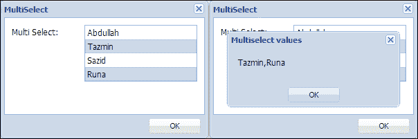
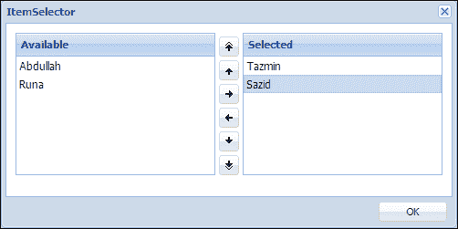
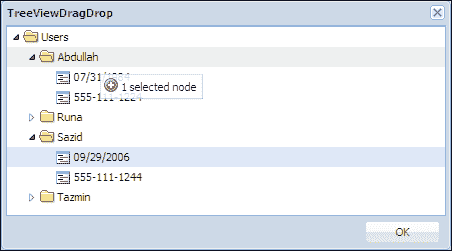
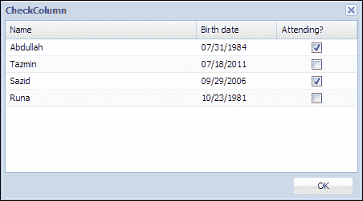
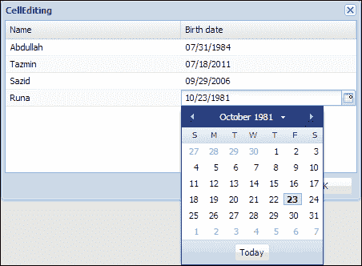
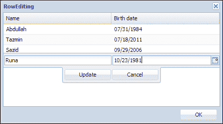
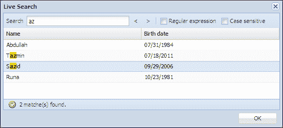

# 第二章. Ext JS 提供的插件和扩展

本章介绍了 Ext JS 库中一些非常有用且流行的插件和扩展。

在本章中，我们将涵盖：

+   MultiSelect

+   ItemSelector

+   TreeViewDragDrop

+   CheckColumn

+   CellEditing

+   RowEditing

+   LiveSearchGridPanel

# The MultiSelect extension

`Ext.ux.form.MultiSelect` 是一种表单字段类型，允许从列表中选择一个或多个项目。列表使用数据存储进行填充。如果此类的 `ddReorder` 属性设置为 `true`，则可以通过拖放方法重新排序项目。

在以下代码中，定义了一个表单面板类，其中使用了 `MultiSelect` 扩展作为此表单的一项：

```js
Ext.define('Examples.view.multiselect.MultiSelectFormPanel', {
  extend : 'Ext.form.Panel',
  alias : 'widget.multiselectformpanel',
  requires : ['Ext.ux.form.MultiSelect'],

  constructor : function(config) {

    Ext.apply(this, {
      bodyPadding : 10,
      items : [{
        anchor : '100%',
        xtype : 'multiselect',
        fieldLabel : 'Multi Select',
        name : 'multiselect',
        store : Ext.create('Examples.store.DummyStore'),
        valueField : 'name',
        displayField : 'name',
        ddReorder : true,
        listeners : {
          change : {
            fn : this.getMultiSelectValue
          },
          scope : this
        }
      }]
    });
    this.callParent(arguments);

  },

  getMultiSelectValue : function() {
    var title = "Multiselect values",
    value = this.getForm().findField('multiselect').getValue();
    Ext.Msg.alert(title, value);
  }
});
```

在前面的代码中，您可以看到 `ddReorder` 选项设置为 `true` 以通过拖放方法重新排序项目。此外，通过使用 `getMultiSelectValue` 函数作为 `multiselect` 字段的 `change` 事件处理程序，可以显示一个包含 `multiselect` 字段已选值的消息。

在以下屏幕截图中，您可以看到我们定义的 `MultiSelectFormPanel` 类的结果，该类用于窗口中：



您可以看到我们可以选择多个值，一旦我们在列表中选择项目，多选字段的已选值就会显示为消息，`multiselect` 字段的已选值也会显示为消息。

该扩展的可用配置选项、属性、方法和事件在 [`docs.sencha.com/extjs/4.1.3/#!/api/Ext.ux.form.MultiSelect`](http://docs.sencha.com/extjs/4.1.3/#!/api/Ext.ux.form.MultiSelect) 中有文档说明。

# The ItemSelector extension

`ItemSelector` 是一个专门的 `MultiSelect` 字段，它以一对的形式呈现，与 `MultiSelect` 字段一起；一个包含可用选项，另一个包含已选选项。中间有一组按钮，允许项目在字段之间移动并在选择中进行重新排序。此外，它们还可以通过拖放方法移动。

在以下代码中，定义了一个表单面板类，其中我们使用 `ItemSelector` 扩展作为此表单的一项：

```js
Ext.define('Examples.view.itemselector.ItemSelectorFormPanel', {
  extend : 'Ext.form.Panel',
  alias : 'widget.itemselectorformpanel',
  requires : ['Ext.ux.form.ItemSelector'],

  constructor : function(config) {

    Ext.apply(this, {
      bodyPadding : 10,
      items : [{
        anchor : '100%',
        xtype: 'itemselector',
        name: 'itemselector',
        store : Ext.create('Examples.store.DummyStore'),
        valueField : 'name',
        displayField : 'name',
        fromTitle: 'Available',
        toTitle: 'Selected'

      }]
    });
  this.callParent(arguments);

  }
});
```

您可以在以下屏幕截图中看到 `ItemSelector` 扩展是一对 `MultiSelect` 字段，其中一个加载了数据存储：



我们可以从这个可用字段中选择值并将这些值移动到 **已选** 字段。我们可以使用箭头按钮或拖放来移动这些字段内的值或在这些字段之间进行重新排序。如果我们使用此 `ItemSelector` 扩展的 `getValue` 函数，它将返回 **已选** 字段中可用的值集合。

此扩展的文档可在 [`docs.sencha.com/extjs/4.1.3/#!/api/Ext.ux.form.ItemSelector`](http://docs.sencha.com/extjs/4.1.3/#!/api/Ext.ux.form.ItemSelector) 上找到，在那里您可以获取此扩展的全部可用配置选项、属性、方法和事件。

# TreeViewDragDrop 插件

此插件为 `TreeView` 类提供了拖放功能。它创建了一个专门的 `DragZone` 实例，该实例知道如何从 `TreeView` 类中拖动，并加载传递给 `DragZone` 协作方法的数据对象，具有以下属性：

+   **复制**: `布尔值`

    它是 `TreeView` 的 `copy` 属性的值，或者如果 `TreeView` 类配置了 `allowCopy` 设置为 `true` 并且在拖动操作开始时按下了 *Ctrl* 键，则为 `true`。

+   **视图**: `TreeView`

    它是拖动操作的源 `TreeView`。

+   **ddel**: `HtmlElement`

    它是随着鼠标移动的拖动代理元素。

+   **item**: `HtmlElement`

    它是注册了 `mousedown` 事件的 `TreeView` 节点。

+   **记录**: `数组`

    它是一个表示从源 `TreeView` 拖动的选中数据的模型数组。

它还创建了一个专门的 `Ext.dd.DropZone` 实例，与其他 `DropZone` 类协作。这些 `DropZone` 类是同一 `ddGroup` 的成员，处理这些数据对象。将此插件添加到视图中意味着在拖放之前，客户端 `TreeView` 可能会触发两个新事件。

### 注意

注意，插件必须添加到树视图中，而不是树面板中。例如，通过使用 `viewConfig`：

```js
viewConfig: {
    plugins: { ptype: 'treeviewdragdrop' }
}
```

在下面的代码片段中，定义了一个树类，其中使用了 `TreeViewDragDrop` 插件来实现节点拖放：

```js
Ext.define('Examples.view.treeviewdragdrop.TreeViewDragDropTree', {
    extend : 'Ext.tree.Panel',
    alias : 'widget.treeviewdragdroptree',
    requires : ['Examples.store.SampleTreeStore',
                'Ext.tree.plugin.TreeViewDragDrop'],

    constructor : function(config) {

        Ext.apply(this, {
            border : false,
            store : Ext.create('Examples.store.SampleTreeStore'),
            viewConfig : {
                plugins : [
                    'treeviewdragdrop'
                ]
            },            
            useArrows : true
        });

        this.callParent(arguments);

    }
});
```

在下面的屏幕截图中，您可以查看我们定义的 `TreeViewDragDropTree` 类的结果，该类用于窗口中：



您可以看到，当我们拖动 **09/29/2006** 节点时，会显示一个可见的浮动消息，表明已选择一个节点，然后我们可以轻松地将该节点拖放到其他节点中。

此插件在 [`docs.sencha.com/extjs/4.1.3/#!/api/Ext.tree.plugin.TreeViewDragDrop`](http://docs.sencha.com/extjs/4.1.3/#!/api/Ext.tree.plugin.TreeViewDragDrop) 上有很好的文档，在那里您可以获取此插件的全部可用配置选项、属性、方法和事件。

# CheckColumn 扩展

`Ext.ux.CheckColumn` 是 `Ext.grid.column.Column` 的一个扩展，它会在每个列单元格中渲染一个复选框。这个复选框在点击时切换关联数据字段的真值。除了在记录数据中切换布尔值之外，这个类还会根据是否选中在 `<td>` 元素上添加或移除 CSS 类 `x-grid-checked`，以改变用于列的背景图像。

在下面的代码中，我们定义了一个网格类，在其中我们使用`CheckColumn`扩展为列中的每个单元格提供复选框：

```js
Ext.define('Examples.view.checkcolumn.CheckColumnGrid', {
  extend : 'Ext.grid.Panel',
  alias : 'widget.checkcolumngrid',
  requires : ['Examples.store.DummyStore',
              'Ext.ux.CheckColumn'],

  constructor : function(config) {

    Ext.apply(this, {
      border : false,
      store : Ext.create('Examples.store.DummyStore'),
      columns : [{
        header : 'Name',
        dataIndex : 'name',
        flex : 1
      },{
        header : 'Birth date',
        dataIndex : 'birthdate',
        renderer : Ext.util.Format.dateRenderer('m/d/Y')
      },{
        xtype : 'checkcolumn',
        header : 'Attending?',
        dataIndex : 'attending'
      }]

    });

    this.callParent(arguments); 

  }
});
```

在下面的屏幕截图中，您可以查看我们定义的`CheckColumnGrid`类所得到的结果，该类在窗口中使用：



您可以看到**参加？**列，其中`CheckColumn`扩展生成了复选框，这些复选框使用存储值来确定复选框是否应该被选中。

该扩展的可用配置选项、属性、方法和事件在[`docs.sencha.com/extjs/4.1.3/#!/api/Ext.ux.CheckColumn`](http://docs.sencha.com/extjs/4.1.3/#!/api/Ext.ux.CheckColumn)中有文档说明。

# `CellEditing`插件

`Ext.grid.plugin.CellEditing`插件在网格的单元格级别注入编辑功能。`editor`字段可以是一个字段实例或一个需要提供在`columns`定义中的`editor`配置选项内的字段配置。使用`CellEditing`插件，我们可以在任何时间编辑单元格。如果未为特定列指定编辑器，则该单元格不能被编辑，并且当通过鼠标或键盘激活时将被跳过。

当我们配置列使用编辑器进行单元格编辑时，我们应该选择一个合适的字段类型来匹配此编辑器字段将要编辑的数据类型。例如，要编辑单元格中的日期值，指定`Ext.form.field.Date`作为编辑器将是有用的。

在下面的代码中，我们定义了一个网格类，在其中我们使用`CellEditing`插件来编辑单元格：

```js
Ext.define('Examples.view.cellediting.CellEditingGrid', {
  extend : 'Ext.grid.Panel',
  alias : 'widget.celleditingGrid',
  requires : ['Examples.store.DummyStore',
              'Ext.grid.plugin.CellEditing', 
              'Ext.form.field.Date'],

  constructor : function(config) {

    Ext.apply(this, {
      store : Ext.create('Examples.store.DummyStore'),
      columns : [{
        header : 'Name',
        dataIndex : 'name',
        flex : 1,
        editor : 'textfield'
      },
      {
        header : 'Birth date',
        dataIndex : 'birthdate',
        renderer : Ext.util.Format.dateRenderer('m/d/Y'),
        flex : 1,
        editor : {
          xtype : 'datefield',
          allowBlank : false
        }
      }],
      selType : 'cellmodel',
      plugins : [Ext.create('Ext.grid.plugin.CellEditing', {
        clicksToEdit : 1
      })]
    });

    this.callParent(arguments); 

  }
});
```

您可以在代码中看到，在`columns`定义中，`editor`配置已经提供了`textfield`选项来编辑**名称**单元格，以及`datefield`选项来编辑**出生日期**单元格。为了支持单元格编辑，指定网格应使用`cellmodel`选项的`selType`，并创建一个`CellEditing`插件的实例。该插件已被配置为通过设置`clicksToEdit`配置选项为`1`，在单次点击后激活每个编辑器。该值也可以设置为`2`，以便通过双击激活编辑器。还有一个名为`triggerEvent`的配置选项，它也会触发编辑，并覆盖`clicksToEdit`配置选项。`triggerEvent`选项的值可以设置为`cellclick`、`celldblclick`、`cellfocus`和`rowfocus`。

在下面的屏幕截图中，您可以查看我们定义的`CellEditingGrid`类所得到的结果，该类在窗口中使用：



您可以看到，日期字段允许您在单元格被点击后立即从日期选择器中选择一个日期。

该插件在 [`docs.sencha.com/extjs/4.1.3/#!/api/Ext.grid.plugin.CellEditing`](http://docs.sencha.com/extjs/4.1.3/#!/api/Ext.grid.plugin.CellEditing) 中有很好的文档，在那里你可以获取该插件的所有可配置选项、属性、方法和事件。

# RowEditing 插件

`Ext.grid.plugin.RowEditing` 插件在 Grid 的行级别注入编辑功能。当开始编辑时，将显示一个小浮动对话框，用于适当的行。每个可编辑列将显示一个用于编辑的字段。有一个按钮可以保存或取消所有编辑更改。`editor` 字段可以是字段实例或字段配置，我们需要在列定义中的 `editor` 配置选项中提供它。如果未为特定列指定编辑器，则该列的单元格将不可编辑，单元格的值将显示。

当我们配置一个列以使用行编辑的编辑器时，我们应该选择一个合适的字段类型来匹配该编辑器字段将要编辑的数据类型。例如，要编辑单元格中的日期值，指定 `Ext.form.field.Date` 作为编辑器会很有用。

在下面的代码中，我们正在定义一个网格类，在其中我们使用 `RowEditing` 插件来编辑行：

```js
Ext.define('Examples.view.rowediting.RowEditingGrid',{
  extend : 'Ext.grid.Panel',
  alias : 'widget.roweditingGrid',
  requires : ['Examples.store.DummyStore',
              'Ext.grid.plugin.RowEditing', 
              'Ext.form.field.Date'],

  constructor : function(config) {

    Ext.apply(this, {
      store : Ext.create('Examples.store.DummyStore'),
      columns : [{
        header : 'Name',
        dataIndex : 'name',
        flex : 1,
        editor : 'textfield'
      },{
        header : 'Birth date',
        dataIndex : 'birthdate',
        renderer : Ext.util.Format.dateRenderer('m/d/Y'),
        flex : 1,
        editor : {
          xtype : 'datefield',
          allowBlank : false
        }
      }],
      selType : 'rowmodel',
      plugins : [Ext.create('Ext.grid.plugin.RowEditing',{
        clicksToEdit : 1
      })]
    });

    this.callParent(arguments);

  }
});
```

在代码中可以看到，在 `columns` 定义中，已经提供了 `editor` 配置，使用 `textfield` 选项编辑**名称**单元格，使用 `datefield` 选项编辑**出生日期**单元格。为了支持行编辑，指定网格应使用 `rowmodel` 作为 `selType` 配置的值。已创建 `RowEditing` 插件的实例，并将其配置为在单击一次后激活每个编辑器。

在下面的屏幕截图中，你可以看到我们定义的 `RowEditing` 网格类在窗口中的结果：



你可以看到，一个浮动对话框正好显示在编辑行上方，其中包含提供的编辑器，包括**更新**和**取消**按钮。

该插件的可配置选项、属性、方法和事件文档位于 [`docs.sencha.com/extjs/4.1.3/#!/api/Ext.grid.plugin.RowEditing`](http://docs.sencha.com/extjs/4.1.3/#!/api/Ext.grid.plugin.RowEditing)。

# LiveSearchGridPanel 扩展

`Ext.ux.LiveSearchGridPanel` 是一个支持实时搜索的 `GridPanel` 类。

在下面的代码中，通过扩展 `LiveSearchGridPanel` 扩展定义了一个网格面板类：

```js
Ext.define('Examples.view.livesearch.LiveSearchGrid', {
  extend : 'Ext.ux.LiveSearchGridPanel',
  alias : 'widget.livesearchgrid',
  requires : ['Examples.store.DummyStore'],

  constructor : function(config) {

    Ext.apply(this, { 
      border : false,
      store : Ext.create('Examples.store.DummyStore'),
      columns : [{
        header : 'Name',
        dataIndex : 'name',
        flex : 1
      },{
        header : 'Birth date',
        dataIndex : 'birthdate',
        renderer : Ext.util.Format.dateRenderer('m/d/Y'),
        flex : 1
      }]
    });

    this.callParent(arguments);

  }
});
```

在下面的屏幕截图中，你可以看到我们定义的 `LiveSearchGrid` 类的结果，该类在窗口中使用：



您可以看到，生成了一个带有**搜索**输入框、上一页和下一页按钮、**正则表达式**和**大小写敏感**选项的网格面板，以及用于适当消息的状态栏。此扩展`GridPanel`突出显示匹配文本并选择匹配文本行的第一行。然后我们还可以使用上一页和下一页按钮在这些行之间移动选择。

该扩展的文档可在[`docs.sencha.com/extjs/4.1.3/#!/api/Ext.ux.LiveSearchGridPanel`](http://docs.sencha.com/extjs/4.1.3/#!/api/Ext.ux.LiveSearchGridPanel)找到，其中详细记录了该扩展的所有可用配置选项、属性、方法和事件。

# 摘要

Ext JS 确实是一个功能丰富的库，提供了多个现成且实用的扩展和插件。在本章中，我们介绍了一些流行的扩展和插件，并学习了如何使用它们。

在下一章中，我们将通过扩展`Ext.form.field.Spinner`类来实际开发一个名为 Labeled Spinner 的扩展。
