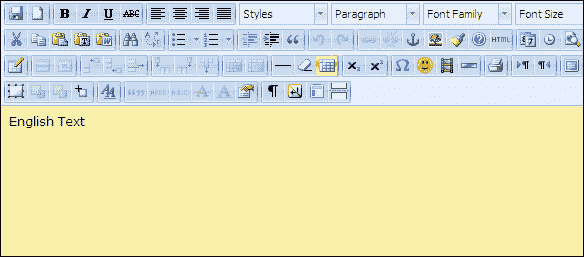

# 第三章. Ext JS 社区扩展和插件

Ext JS 社区拥有丰富的扩展和插件集合。本章介绍了 Ext JS 社区的一些流行扩展和插件。

在本章中，我们将介绍以下内容：

+   Callout

+   SmartLegend

+   TitleChart

+   BoxSelect

+   MultiDate

+   MultiMonth

+   MultiSelect

+   TinyMCETextArea

+   FilterBar

+   DragSelector

# Callout 扩展

`Callout` 是一个扩展类，它是一个可 CSS 样式的浮动调用容器，带有可选的箭头，由约翰·亚纳雷拉开发。它用于创建提示覆盖和交互式调用窗口/弹出窗口。

我们可以在以下屏幕截图看到一个 `callout` 弹出窗口：

一个 `Ext.ux.callout.Callout` 扩展可以轻松配置以：

+   在各种位置显示其关联的调用箭头，包括顶部、底部、左侧、右侧、左上角、右上角、左下角、右下角、左上、左下、右上、右下

+   将其相对于目标 `Ext.Element` 或 `Ext.Component` 定位，当目标移动或浏览器调整大小时，它将保持相对位置

+   当鼠标点击调用区域外时，它会自动隐藏

+   在可配置的延迟后自动消失

+   显示时淡入，隐藏时淡出

该扩展的实时演示可在 [`lab.codecatalyst.com/Ext.ux.callout.Callout`](http://lab.codecatalyst.com/Ext.ux.callout.Callout) 获得。此扩展受 **麻省理工学院**（**MIT**）许可。此扩展的下载链接、版权详情和许可信息可在 [`github.com/CodeCatalyst/Ext.ux.callout.Callout`](https://github.com/CodeCatalyst/Ext.ux.callout.Callout) 获取。

# SmartLegend 扩展

`SmartLegend` 是一个扩展，它实现了具有更高级行为的图表图例，由亚历山大·托卡列夫开发。这个扩展类基本上与 `Ext.chart.Legend` 相同，除了它的一些方法被重构以提高重用性。

以下是一个使用 `SmartLegend` 扩展的图表的屏幕截图：

以下是一些 `SmartLegend` 的功能：

+   图例项的大小调整到字体大小

+   图例项可以配置为显示任何特定文本，而不仅仅是固定的系列标题或值

+   图例根据方向在多行或多列中绘制自身

该扩展的实时演示位于 [`nohuhu.org/demos/demo_smartlegend.html`](http://nohuhu.org/demos/demo_smartlegend.html)。此扩展受 GPLv3 许可。此扩展的下载链接、版权详情和许可信息可在 [`github.com/nohuhu/Ext.ux.chart.SmartLegend`](https://github.com/nohuhu/Ext.ux.chart.SmartLegend) 获取。

# TitleChart 扩展

此类是 `Ext.chart.Chart` 的扩展，实现了带标题的图表，由亚历山大·托卡列夫开发。通过使用此扩展，我们可以轻松配置我们的图表标题。

以下是一个使用 `TitleChart` 扩展的图表的屏幕截图：

可用的配置选项包括：

+   **titleLocation**：`left`、`right`、`top` 或 `bottom`。当位置为 `right` 或 `left` 时，标题文本将相应旋转。

+   **titleFont**：图表标题的字体属性，采用 CSS 格式。

+   **titlePadding**：图表画布边缘与标题之间的空间，以像素为单位。

+   **titleMargin**：标题与实际图表区域之间的空间。

该扩展程序的实时演示位于 [`nohuhu.org/demos/demo_titlechart.html`](http://nohuhu.org/demos/
demo_titlechart.html)。本扩展程序采用 GPLv3 许可证。该扩展程序的下载链接、版权详情和许可证信息可在 [`github.com/nohuhu/Ext.ux.chart.TitleChart`](https://github.com/nohuhu/Ext.ux.chart.TitleChart) 找到。

# The BoxSelect extension

`Ext.ux.form.field.BoxSelect` 是一个组合框，通过使用单独标记的选中项扩展了更直观的多选功能，由凯文·沃恩开发。

在以下屏幕截图中，您可以看到如何在 `BoxSelect` 组合框内选择多个项目：

在以下屏幕截图中，您可以看到如何通过模板配置选中值和下拉列表：

以下是一些 `BoxSelect` 的功能：

+   每个选中值都有可单独移除的标记项。

+   可定制的项目模板，除了组合框支持的可定制的下拉列表模板外。

+   基于键盘的选中值和导航选择（左右键、*Shift*、*Ctrl* + *A*、*Backspace*、*Delete*）。

+   当设置未知值时，从远程存储按需加载值，即设置 `queryMode = 'remote'` 和 `forceSelection = true`。

+   为 `forceSelection = false` 创建新的值记录。

+   可配置 `multiSelect = true` 的组合选择列表的固定。

+   可配置标记项的渲染（自动大小或堆叠）。

+   由于 `BoxSelect` 扩展了 ComboBox，大多数（如果不是所有）的功能和配置选项应该按预期工作。

本扩展程序采用 MIT 许可证。本扩展程序的示例和参考信息可在 [`kveeiv.github.io/extjs-boxselect/examples/boxselect.html`](http://kveeiv.github.io/extjs-boxselect/examples/boxselect.html) 找到。该扩展程序的下载链接、版权详情和许可证信息可在 [`github.com/kveeiv/extjs-boxselect`](https://github.com/kveeiv/extjs-boxselect) 找到。

# MultiDate 扩展

`MultiDate` 是一个表单字段扩展，它扩展了 `Ext.form.field.Date`，允许输入多个日期和日期范围，具有灵活的格式匹配和强大的下拉选择器，由亚历山大·托卡列夫开发。

以下是一个 `MultiDate` 字段的截图：

以下是一些 `MultiDate` 的功能：

+   日期或日期范围的数量没有限制。

+   分别设置范围值的输入格式、显示格式和提交格式。

+   完全使用提供的 CSS 表格主题化。

+   向后兼容性：可以通过设置一个选项来关闭多值输入；在这种情况下，行为类似于 **stockDate** 字段。

+   支持可配置的工作周选择。

+   在选择器中按 *Space* 键选择/取消选择单个日期。

+   在选择器中 *Shift* + *Space* 或 *Shift* + 点击选择工作周。

+   在选择器中 *Ctrl* + *Backspace* 清除选择。

+   在选择器中 *Ctrl* + 点击选择自由范围：*Ctrl* + 点击一次设置开始日期，*Ctrl* + 点击再次设置结束日期并选择所有之间的日期。这也适用于多个月份/年份。

+   在选择器中 *Ctrl* + *Shift* + 点击选择自由范围，但只包括工作日。

+   在选择器中按 *Enter* 键以确认选择。

+   在选择器中按 *Esc* 键取消选择。

此扩展的实时演示位于 [`nohuhu.org/demos/demo_uxmultidate.html`](http://nohuhu.org/demos/
demo_uxmultidate.html)。此扩展受 GPLv3 许可证保护。此扩展的下载链接、版权详情和许可证信息可在 [`github.com/nohuhu/Ext.ux.form.field.MultiDate`](https://github.com/nohuhu/Ext.ux.form.field.MultiDate) 获取。

# MultiMonth 扩展

`MultiMonth` 是一个允许输入月份范围的表单字段扩展，具有灵活的格式匹配和自定义的下拉选择器，由亚历山大·托卡列夫开发。

以下是一个 `MultiMonth` 字段的截图：

以下是一些 `MultiMonth` 的功能：

+   允许输入开始和结束月份。

+   分别设置输入格式、显示格式和提交格式。

+   完全使用提供的 CSS 表格主题化。

+   切换行为：将 `multiValue` 属性设置为 `false`，字段将只允许输入单个月份。

此扩展的实时演示位于 [`nohuhu.org/demos/demo_uxmultimonth.html`](http://nohuhu.org/demos/
demo_uxmultimonth.html)。此扩展受 GPLv3 许可证保护。此扩展的下载链接、版权详情和许可证信息可在 [`github.com/nohuhu/Ext.ux.form.field.MultiDate`](https://github.com/nohuhu/Ext.ux.form.field.MultiDate) 获取。

# MultiSelect 扩展

`MultiSelect` 是一个用于输入任意类型值及其值范围的表单字段，具有包含实时搜索、智能匹配、视觉选择等功能的选择器，由亚历山大·托卡列夫开发。

以下是一个 `MultiSelect` 字段的截图：

此扩展程序实现了一个表单字段，允许输入任意类型的多个值和值范围，并带有提供实时搜索和可视项目选择的下拉选择器。

以下是 `MultiSelect` 的一些功能：

+   项目数量和项目范围没有限制。

+   单个和范围值的输入格式、显示格式和提交格式有单独的设置。

+   提供 CSS 样式的全主题表单字段。

+   两种操作模式：多值和单值。

+   带有实时搜索和智能匹配的下拉选择器。

+   优化用于大数据集。

+   接受预配置的存储库，其中包含要显示的值列表。

+   支持延迟存储填充；只有当选择器被激活时才会加载数据。

+   可配置列定义；列的数量和宽度没有任意限制。

+   在选择器中按下 *Enter* 键或点击加号图标以选择单个项目。

+   按下 *Tab* 键选择一个列表，然后按下 *Enter* 键，或者点击减号图标取消选择一个项目。

+   在选择器中按下 *Ctrl* + *Enter* 键确认选择。

+   在选择器中按下 *Ctrl* + *Backspace* 键清除选择。

+   在选择器中按下 *Esc* 键取消选择。

此扩展程序的实时演示位于 [`nohuhu.org/demos/demo_uxmultiselect.html`](http://nohuhu.org/demos/demo_uxmultiselect.html)。此扩展程序受 GPLv3 许可协议保护。此扩展程序的下载链接、版权详情和许可信息可在 [`github.com/nohuhu/Ext.ux.form.field.MultiSelect`](https://github.com/nohuhu/Ext.ux.form.field.MultiSelect) 找到。

# TinyMCETextArea 扩展

`TinyMCETextArea` 是一个集成了 `TinyMCE` WYSIWYG 编辑器的 Ext JS 文本区域，由 Oleg Schildt 开发。

以下是一个 `TinyMCETextArea` 文本区域的截图：

此扩展程序的实时演示位于 [`www.point-constructor.com/tinyta_demo`](http://www.point-constructor.com/tinyta_demo)。此扩展程序受 GPLv3 许可协议保护。您可以在 [`market.sencha.com/extensions/ext-ux-form-tinymcetextarea/versions/2.6/download`](https://market.sencha.com/extensions/ext-ux-form-tinymcetextarea/versions/2.6/download) 下载此扩展程序。

# FilterBar 插件

`FilterBar` 是一个插件，由 ldonofrio 开发，它可以在网格标题上启用过滤器。

以下是一个使用 `FilterBar` 插件的网格的截图：

以下是 `FilterBar` 插件的一些功能：

+   允许预配置的过滤器类型，并基于存储字段的数据类型自动设置。

+   条件运算符选择以实现更好的查询。

+   自动生成组合和列表过滤器的存储库（本地收集或服务器在 `autoStoresRemoteProperty` 响应属性中）。

+   支持在操作列或新生成的小列中渲染的 `clearAll` 和 `showHide` 按钮。

此插件采用 GPLv3 许可。此插件的下载链接可在[`market.sencha.com/extensions/ext-ux-grid-filterbar/versions/218/download`](https://market.sencha.com/extensions/ext-ux-grid-filterbar/versions/218/download)找到。

# The DragSelector plugin

`DragSelector`是一个通过在行上拖动鼠标来帮助选择网格行的插件，由 Harald Hanek 开发。原始代码的初始开发者是 Claudio Walser。此插件非常有用，因为它可以非常快速地选择多行。它支持以下方式选择网格行：

+   通过在行上拖动来选择

+   按住*Ctrl*键并通过拖动来选择，同时保持现有的选择

+   按住*Ctrl*键并通过拖动鼠标交叉现有选择来取消现有选择。

在下面的屏幕截图中，我们可以看到`DragSelector`插件的实际应用：

此插件的实时演示位于[`harrydeluxe.github.io/extjs-ux/example/grid/dragselector.html`](http://harrydeluxe.github.io/
extjs-ux/example/grid/dragselector.html)。此插件采用 LGPLv3 许可。您可以在[`github.com/harrydeluxe/extjs-ux/blob/master/ux/grid/plugin/DragSelector.js`](https://github.com/harrydeluxe/extjs-ux/blob/master/ux/grid/plugin/DragSelector.js)下载此插件。

# 摘要

在本章中，我们介绍了一些流行的 Ext JS 社区扩展和插件。Ext JS 社区中有许多扩展和插件，其中我们可能会找到我们需要的；而且，社区扩展和插件每天都在增长。
