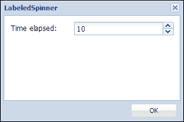
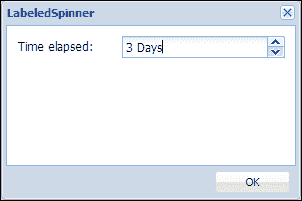
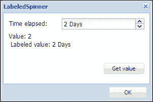

# 第四章：带标签的旋转按钮

在本章中，我们将开发一个名为**带标签的旋转按钮**的 Ext JS 扩展。为了开发这个扩展，我们将扩展`Ext.form.field.Spinner`类，这将添加一个功能，在旋转按钮字段内显示可配置的标签，以及一些更高级的功能。

在本章中，我们将涵盖：

+   功能需求

+   规划和编写带标签的旋转按钮代码

# 功能需求

我们希望开发一个用于数值的字段，该字段将提供具有上下旋转按钮的功能，以便增加或减少数值。此外，用户还可以在字段内编辑数值。还有一个配置选项，可以在字段内数值旁边显示用户定义的标签作为单位名称。还将提供选项从该字段获取值，这将仅是数值，也可以是包括单位名称的数值，正如它在字段内显示的那样。

# 规划和编写带标签的旋转按钮代码

为了满足功能需求，我们将通过扩展 Ext JS 的`Ext.form.field.Spinner`类来创建一个扩展类，从而获取我们提供所需的大部分功能。我们需要实现`Ext.form.field.Spinner`类的`onSpinUp`和`onSpinDown`函数，以处理旋转按钮点击事件，提供我们的逻辑来增加或减少数值。默认情况下，按下上下箭头键也会触发`onSpinUp`和`onSpinDown`方法。现在，让我们开始编写代码：

```js
Ext.define('Examples.ux.LabeledSpinner', {
  extend : 'Ext.form.field.Spinner',
  alias : 'widget.labeledspinner',

  onSpinUp : function() {
    this.setValue(++this.value);
  },

  onSpinDown : function() {
    this.setValue(--this.value);
  }
});
```

现在我们有一个可以增加或减少其值的可工作扩展。以下是使用此扩展的屏幕截图：



你可以看到我们现在有一个带有上下旋转按钮的字段，我们可以通过它增加或减少数值 1。

现在，我们将添加一个功能，该字段可以显示单位标签文本，直接位于数值旁边。我们将定义`setValue`函数，通过它可以设置包括标签单位的值。我们还将向此类添加一些`config`属性，以便我们可以设置所需的值：

```js
Ext.define('Examples.ux.LabeledSpinner', {
  extend : 'Ext.form.field.Spinner',
  alias : 'widget.labeledspinner',

  config : {
    labelText : ",
    minValue: 0,
    value: 0
  },

  onSpinUp : function() {
    var value = parseFloat(this.getValue().split(' ')[0]);
    this.setValue(++value);
  },

  onSpinDown : function() {
    var value = parseFloat(this.getValue().split(' ')[0]);
    this.setValue(--value);
  },

  setValue : function(value) {
    value = (value ||this.minValue) + ' ' +this.getLabelText();
    this.callParent(arguments);
  }
}); 
```

在下面的屏幕截图中，我们可以看到标签直接位于字段内的数值旁边：



在代码中，你可以发现我们提供了一些`config`选项，添加了`setValue`函数，并对`onSpinUp`和`onSpinDown`函数进行了一些修改。

现在，我们将定义`getValue`函数，以便我们可以从该字段获取数值，并定义`getLabeledValue`函数，该函数将返回数值，包括单位标签，正如它在字段内显示的那样。我们还将定义`onBlur`处理程序来检查并修复任何错误输入，并对现有代码进行一些更改。以下是我们的扩展的完整代码：

```js
Ext.define('Examples.ux.LabeledSpinner', {
  extend : 'Ext.form.field.Spinner',
  alias : 'widget.labeledspinner',

  config : {
    labelText : '',
    minValue : 0,
    maxValue : Number.MAX_VALUE,
    step : 1,
    value : 0
  },

  onBlur : function() {
    if (isNaN(this.getValue())) {
      this.setValue(this.getLabeledValue(this.getMinValue()));
    }
    else{
      this.setValue(this.getLabeledValue());
    }
  },

  onSpinUp : function() {
    var val = this.getValue() || this.getMinValue();
    this.setChangedValue(val + this.step);
  },

  onSpinDown : function() {
    var val = this.getValue() || this.getMinValue();

    this.setChangedValue(val - this.step);
  },

  getLabeledValue : function(value) {
    value = Ext.isDefined(value) ? value : this.getValue();
    if (value.toString().indexOf(this.getLabelText()) == -1) {
      return value + ' ' + this.getLabelText();
    } else {
      return value;
    }
  },

  setValue : function(value) {
    if(!this.readOnly){
      value = this.getLabeledValue(value);
    }
    this.callParent(arguments);
  },

  getValue : function() {
    var me = this, 
    val = me.rawToValue(me.processRawValue(me.getRawValue()));

    val = parseFloat(val.split(' ')[0]);
    return val;
  },

  setChangedValue : function(value){        
    if(!isNaN(value)){
      this.setValue(Ext.Number.constrain(value, 
        this.getMinValue(), this.getMaxValue()));
    }
  }

}); 
```

以下是我们的工作“标签式旋转框”扩展的屏幕截图：



在前面的屏幕截图中，我们可以在窗口中找到“获取值”按钮。当点击此按钮时，我们通过调用 `getValue` 和 `getLabeledValue` 函数来打印窗口上的值。

# 摘要

在本章中，我们通过扩展 Ext JS 的现有类开发了一个新的组件，并学习了如何轻松创建 Ext JS 扩展以及注入所需的功能。在下一章中，我们将开发一个名为“图表下载”的 Ext JS 插件，该插件在容器工具栏上生成一个按钮，当点击此按钮时，可以将容器的图表项作为图片下载。
