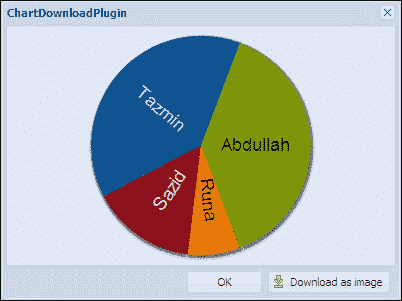
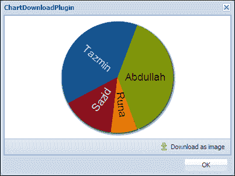

# 第五章 图表下载器

在本章中，我们将开发一个 Ext JS 插件，该插件将帮助我们下载图表作为图片。此插件将生成一个按钮，当按钮被点击时，它将执行所需的功能，使得插件容器中的图表项将被下载为图片。

在本章中，我们将涵盖：

+   功能需求

+   规划并编写图表下载器

# 功能需求

我们希望开发一个插件，该插件将简化将图表作为图片下载的功能。该插件将在容器的底部工具栏中生成一个按钮。如果容器底部没有工具栏，则此插件将为容器创建一个底部工具栏，然后在该工具栏中生成按钮。当此按钮被点击时，插件将在容器内搜索图表项，并将图表作为图片下载。

# 规划并编写图表下载器

插件的容器可能包含或不包含底部栏，因此我们需要在容器内搜索底部栏。如果找到，我们将使用它，否则我们需要创建底部栏，然后我们可以将下载按钮添加到该底部栏。

现在，让我们开始编写插件代码。

```js
Ext.define('Examples.plugin.ChartDownload', {

  alias : 'plugin.chartdownload',

  config : {
    chartXtype: 'chart',
    downloadButtonText: 'Download as image',
    chartNotFoundErrorMsg: 'No valid chart type found!',
    errorText: 'Error'
  }
…
```

我们在这里提供了一个配置选项`chartXtype`，这样我们就可以使用我们想要下载为图片的图表的正确 xtype 来配置此插件。现在让我们定义此插件所需的`init`函数：

```js
init : function(container) {

  this.container = container;

  if (!container.rendered) {
    container.on('afterrender', this.handleAfterRender, this);
  } else {
    this.handleAfterRender();
  }

}
```

现在让我们定义`handleAfterRender`函数：

```js
handleAfterRender : function(container) {

  this.chart = this.container.down(this.getChartXtype());

  if(!Ext.isDefined(this.chart) || this.chart ==null){
    Ext.Function.defer(function(){
      this.showErrorMessage({
        title: this.getErrorText(),
        text: this.getChartNotFoundErrorMsg()
      })
    }, 1000, this);
  }

  else{

    this.addDownloadButton();
  }

},
```

在此函数中，我们试图获取图表组件，如果找不到图表组件，我们将显示错误消息。如果找到图表组件，我们将调用`addDownloadButton`函数，该函数将创建并添加下载按钮。现在让我们定义`addDownloadButton`函数：

```js
addDownloadButton: function(){

  var toolbar = this.getToolbar(),
  itemsToAdd = [],
  placeholder = '->',
  button = {
    iconCls : 'icon-export',
    text : this.getDownloadButtonText(),
    handler: this.saveChart,
    scope : this
  };

  if(toolbar.items.items.length === 0){
    itemsToAdd.push(placeholder);
  }

  itemsToAdd.push(button);
  toolbar.add(itemsToAdd); 
}
```

在此函数中，首先我们试图通过调用`getToolbar`函数获取底部工具栏，然后将下载按钮添加到该工具栏中。现在让我们定义`getToolbar`函数：

```js
getToolbar: function(){

  var dockedItems = this.container.getDockedItems(),
  toolbar = null,
  hasToolbar = false;

  if(dockedItems.length>0){
    Ext.each(dockedItems, function(item){
      if(item.xtype ==='toolbar' && item.dock == 'bottom'){
        hasToolbar = true;
        toolbar = item;
        return false;
      }
    });
  }

  if(!hasToolbar){
    toolbar = this.container.addDocked({
      xtype: 'toolbar',
      dock: 'bottom'
    })[0];
  }

  return toolbar;

}
```

在此函数中，我们试图获取容器的底部工具栏，如果找到工具栏，我们使用它，如果没有找到，我们创建一个新的底部工具栏。现在让我们定义`saveChart`函数，该函数将在点击**下载**按钮时被调用：

```js
saveChart: function(){

  this.chart.save({
    type : 'image/png'
  });

}
```

在这里，我们在一个窗口中使用此插件：

```js
Ext.define('Examples.view.chartdownloadplugin.ChartDownloadPluginWindow', {
  extend : 'Ext.Window',
  alias : 'widget.chartdownloadpluginwindow',
  requires : ['Examples.view.chartdownloadplugin.Chart',
             'Examples.plugin.ChartDownload'],

  constructor : function(config) {

    Ext.apply(this, {
      modal : true,
      width : 400,
      height : 300,
      title : 'ChartDownloadPlugin',
      layout : {
        type:'fit'
      },
      plugins:['chartdownload'],
        items : [Ext.create('Examples.view.chartdownloadplugin.Chart')],
      buttons : [{
        text : 'OK',
        handler : function() {
          this.close();
        },
        scope : this
      }]
    });
    this.callParent(arguments);
  }
});
```

以下截图是使用我们的图表下载器插件生成的输出：



您可以看到“下载为图片”按钮生成在窗口的底部栏中，用户可以通过点击此按钮下载图片。

现在，让我们使用没有定义底部栏的另一个容器进行测试：

```js
Ext.define('Examples.view.chartdownloadplugin.ChartDownloadPluginWindow', {
  extend : 'Ext.Window',
  alias : 'widget.chartdownloadpluginwindow',
  requires : ['Examples.view.chartdownloadplugin.Chart',
          'Examples.plugin.ChartDownload'],

  constructor : function(config) {

    Ext.apply(this, {
      modal : true,
      width : 400,
      height : 300,
      title : 'ChartDownloadPlugin',
      layout : {
        type:'fit'
      },
      items : [{
        xtype:'panel',
        plugins:['chartdownload'],
        layout:'fit',
        items:[Ext.create('Examples.view.chartdownloadplugin.Chart')]
      }],
      buttons : [{
        text : 'OK',
        handler : function() {
          this.close();
        },
        scope : this
      }]
    });
    this.callParent(arguments);

  }
});
```

以下截图是输出结果：



您可以看到，下载按钮现在生成在嵌套面板的底部栏中。

# 概述

在本章中，我们开发了一个可以下载图表为图片的 Ext JS 插件。通过本章，我们学习了如何创建 Ext JS 插件以及如何通过 Ext JS 插件轻松注入功能。在下一章，我们将介绍一个非常流行的用于网格搜索的插件，用户可以选择或取消选择他们想要应用搜索的网格列。
