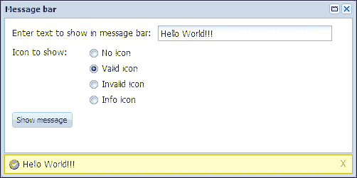
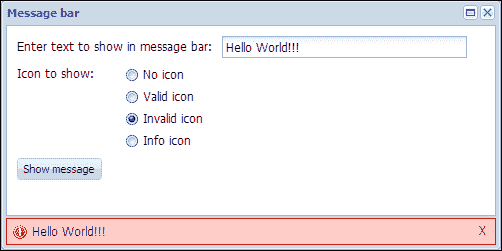

# 第八章：消息栏

在本章中，我们将开发一个 Ext JS 扩展，它将是一个花哨的动画消息栏。消息栏将提供显示消息的可配置持续时间计时器、关闭按钮，并且还可以在运行时自定义外观，并为不同类型的状态提供可选的图标，如有效、无效或信息。

在本章中，我们将涵盖：

+   功能需求

+   消息栏的规划和编码

# 功能需求

我们的目标是开发一个 Ext JS 扩展，它可以用来显示消息。这个扩展可以在容器内作为一个停靠项来显示消息。当配置的计时器完成后，消息栏将自动关闭。这个消息栏还将提供一个关闭按钮，点击这个按钮，消息栏将被关闭。消息栏的打开和关闭将以平滑的动画形式进行。这个消息栏还可以在运行时接受配置，以显示它可以改变外观的几种状态，并可以显示适当的图标。

# 消息栏的规划和编码

为了开发这个扩展，我们可以使用 Ext JS 工具栏并将其停靠到容器的底部。然后我们可以添加一个功能，使这个工具栏可以显示消息文本。然后我们需要添加一个功能，当调用消息栏来显示消息时；消息栏在点击关闭按钮或配置的计时器完成后出现和消失。根据我们的功能需求，我们可以看到 Ext JS 库提供的`StatusBar`扩展做了很多我们需要的，我们需要为这个消息栏扩展提供功能。因此，我们可以修改这个扩展并添加我们自己的功能和 CSS 样式来满足我们的需求。现在让我们开始编码：

```js
Ext.define('Examples.ux.MessageBar', {
  extend: 'Ext.toolbar.Toolbar',
  alias: 'widget.ux-msgbar',
  activeThreadId: 0,
  dock: 'bottom',
  config: {
    cls: 'x-messagebar',
    emptyText: '',
    defaultText: '',
    autoClear: 5000
  },

  initComponent: function () {
    this.callParent(arguments);
  },
…
```

在定义了类配置之后，现在让我们创建一个元素，消息文本将在其中显示——图标和关闭按钮。现在让我们定义`afterRender`处理程序，我们将在这里创建这些元素：

```js
afterRender: function () {

  this.el.addCls('x-message-msgbar-body');

  this.currIconCls = this.iconCls || this.defaultIconCls;
  var me = this;

  setTimeout(function () {

    var tpl = new Ext.XTemplate(
      '<div id="{id}-bar" class="{bodyCls}"',
      ' style="width: {width}px; {left}">',
      '<div class="{msgCls}"></div>',
      '<div style="float:right" class="{closeCls}">X</div>',
      '</div>'
    );

    tpl = tpl.apply({
      id: me.id,
      bodyCls: 'x-message-msgbar-body',
      width: me.ownerCt.getWidth() - 10,
      left: Ext.isIE8 ? 'left:5px' : '',
      msgCls: 'x-message-bar-msg',
      closeCls: 'x-message-bar-close'
    });

    me.ownerCt.el.createChild(tpl);

    Ext.select('.x-message-bar-close').on('click', function () {
      me.clearMessage();
    });

  }, 500);

  this.hide();
  this.callParent(arguments);
}
```

您可以看到我们是如何创建这些元素的。我们还定义了关闭按钮的点击处理程序。每当关闭按钮被点击时，我们都会调用`clearMessage`函数。我们将在本章后面定义这个函数。我们需要注意，每当容器被调整大小时，我们也需要调整消息栏元素的大小。因此，现在让我们在`afterRender`处理程序中添加一些代码来处理这个问题：

```js
this.ownerCt.on('resize', function (ownerContainer, width, height) {
  if (width == this.parentWidth && height == this.parentHeight) {
    return;
  }

  var bar = Ext.get(this.id + '-bar');

  if (bar) {
    bar.setStyle('width', (this.ownerCt.getWidth()-10)  + 'px');
  }
}, this);
```

现在让我们定义`showMessage`函数，它将被调用来显示带有提供配置的消息：

```js
showMessage: function (msg) {

  if (Ext.isString(msg)) {
    msg = {
      text: msg
    }
  }

  this.setMessage({
    text: msg.text,
    iconCls: 'x-message-'
    + (msg.type || '') + ' ',
    clear: Ext.isDefined(msg.clear) ? msg.clear : true
  });

}
```

在这个函数中，我们正在检查提供的配置，并正确地准备配置，然后将其发送到`setMessage`函数。现在让我们定义`setMessage`函数：

```js
setMessage: function (o) {
  if (o && (o.text == '' || o.text == '&nbsp;')) {
    return;
  } else {
    var cmp = Ext.get(this.id + '-bar');
    if (cmp) {
      cmp.slideIn('b', {
        duration: 300,
        easing: 'easeIn',
        callback: function () {
          this.setMessageData(o);
        },
        scope: this
      });
    }
  }
}
```

在这个函数中，我们正在检查消息文本是否为空，如果不为空，我们将打开消息栏并调用 `setMessageData` 函数来设置消息文本、UI 和消息栏的适当图标。现在让我们定义 `setMessageData` 函数：

```js
setMessageData: function (o) {
  o = o || {};
  if (o.text !== undefined) {
    this.setText(o.text);
  }
  if (o.iconCls !== undefined) {
    var bar = Ext.get(this.id + '-bar');
    if (o.iconCls == 'x-message-error ') {
      bar.removeCls('x-message-msg-body');
      bar.addCls('x-message-error-body');
    } else {
      bar.removeCls('x-message-error-body');
      bar.addCls('x-message-msg-body');
    }
    this.setIcon(o.iconCls);
  }
  if (o.clear) {
    var c = o.clear, wait = this.autoClear, defaults = {
      useDefaults: true,
      anim: true
    };
    if (Ext.isObject(c)) {
      c = Ext.applyIf(c, defaults);
      if (c.wait) {
        wait = c.wait;
      }
    } else if (Ext.isNumber(c)) {
      wait = c;
      c = defaults;
    } else if (Ext.isBoolean(c)) {
      c = defaults;
    }
    c.threadId = this.activeThreadId;
    if (this.clearTimer) {
      clearTimeout(this.clearTimer);
    }
    this.clearTimer = Ext.defer(this.clearMessage, wait, this, [c]);
  }
}
```

你可以看到，在这个函数中，我们正在设置消息文本、图标和 UI。要设置消息文本，我们调用 `setText` 函数；要更改 UI，我们添加和移除相应的 CSS 类；要设置图标，我们调用 `setIcon` 函数。此外，当清除配置选项设置为 `true` 时，我们应用配置的计时器，在计时器完成后隐藏消息栏。现在让我们定义 `clearMessage` 函数：

```js
clearMessage: function (o) {
  o = o || {};
  if (o.threadId && o.threadId !== this.activeThreadId) {
    return this;
  }
  var bar = Ext.get(this.id + '-bar');
  if (bar) {
    Ext.get(this.id + '-bar').slideOut('b', {
      duration: 300,
      easing: 'easeOut',
      callback: function () {
        var text = o.useDefaults ? this.defaultText : this.emptyText,
        iconCls = o.useDefaults ? (this.defaultIconCls ? this.defaultIconCls : '') : '';
        this.setMessage({
          text: text,
          iconCls: iconCls
        });
      },
      scope: this
    });
  }
  return this;
}
```

在这里，在这个 `clearMessage` 函数中，我们正在隐藏消息栏。

现在，让我们对这个扩展进行一些测试。在下面的屏幕截图中，你可以看到我们的消息栏扩展正在运行。我们创建了一个 Ext JS 窗口，并将消息栏作为一个停靠项添加进去。



你可以看到，当你点击 **显示消息** 按钮时，消息栏会显示配置的数据。当我们选择 **无效图标** 选项时，我们可以看到消息栏外观的变化。这里你可以看到我们选择 **无效图标** 时的结果：



从前面的屏幕截图中，我们可以看到我们的扩展确实按照我们的预期工作。

# 摘要

在本章中，我们开发了一个 Ext JS 扩展，一个花哨的动画消息栏。在本章中，我们学习了如何轻松地创建我们自己的自定义控件。正如我们已经学到的，Ext JS 扩展的力量以及我们如何轻松地创建 Ext JS 扩展，我们可以看到创建我们自己的控件确实非常容易，这有助于满足我们的定制需求。

在下一章中，我们将介绍另一个 Ext JS 扩展 `BoxSelect`，该扩展最初由 Kevin Vaughan 开发。这个扩展非常有用，它提供了一个更友好的 combobox，可以轻松地为每个选择创建可移除的标签。
